# [vivo悟空活动中台-基于行为预设的动态布局方案](https://my.oschina.net/vivotech/blog/4303604)

【悟空活动中台】系列往期精彩文章：

- 《[揭秘 vivo 如何打造千万级 DAU 活动中台 - 启航篇](https://www.oschina.net/action/GoToLink?url=http%3A%2F%2Fmp.weixin.qq.com%2Fs%3F__biz%3DMzI4NjY4MTU5Nw%3D%3D%26mid%3D2247486583%26idx%3D1%26sn%3Df914759459e73a84194de8f3ad11ba01%26chksm%3Debd87ce5dcaff5f36ea1004bf1cf5293b2dd9ef0539ef23cb983423bd3821cf7653b1b567660%26scene%3D21%23wechat_redirect)》 主要为大家讲述 vivo 活动中台的能力与创新。
- 《[悟空活动中台 - 微组件状态管理（上）](https://www.oschina.net/action/GoToLink?url=http%3A%2F%2Fmp.weixin.qq.com%2Fs%3F__biz%3DMzI4NjY4MTU5Nw%3D%3D%26mid%3D2247486706%26idx%3D1%26sn%3D06c17167cc6ec207dc856a6f8b83f62a%26chksm%3Debd87c60dcaff576afd9734029e5f54474ad72ab25500b0abd13cc70a356dc57ae5089180988%26scene%3D21%23wechat_redirect)》介绍了活动页内 RSC 组件之间的状态管理和背后的设计思路。
- 《[悟空活动中台 - 微组件状态管理（下）](https://www.oschina.net/action/GoToLink?url=http%3A%2F%2Fmp.weixin.qq.com%2Fs%3F__biz%3DMzI4NjY4MTU5Nw%3D%3D%26mid%3D2247486950%26idx%3D1%26sn%3D7812d90f5b206d279c3cdcc3da34bbea%26chksm%3Debd87d74dcaff462a8f1d813953dcc7978e6e0fcd1bf429fe43f0a21cee010e11db6d7f312c2%26scene%3D21%23wechat_redirect)》探索平台和跨沙箱环境下的微组件状态管理。


# 一、写在前面

作为前端工程师，页面布局是基本功。面对悟空中台的海量的活动需求，仅仅有几招常规的布局套路显然是难以招架的，悟空开发者团队从个性化需求中提炼特定场景下的共性特点，设计了多个“创意布局”方案。

本文以“满屏”场景下的页面布局思考为切入点，以微组件为元素单元，提供了一种新的布局方案设计思路——**基于行为预设的动态布局方案**，并详细的分享了设计目的及具体实现方案，对技术基础要求不高，是一篇男女老少皆宜的“技术甜点”。


# 二、灵感缘起

灵感往往并不是凭空产生的，而是与问题的出现形成因果关系，解决方案也鲜有一蹴而就，大多有一个不断完善的演进过程，我们都执着于发现问题，分析问题，解决问题的轮回。


## **1、问题是什么**


### **1.1、客户端茫茫多，而设计稿只有一个**

这是移动端H5页面进行布局时面临的核心问题之一。

随着移动端生态的日益繁荣，设备屏幕宽高比从 3:4、9:16 到  9:19、9:21 ，分辨率从 480p 、720p 到 1080p 甚至 2k ，显然设计师同学不可能针对每种场景都进行对应的创作，所以一般只就约定的标准尺寸（如常见的 1080 * 1920 ）输出一张设计稿。

而前端开发同学在实施样式布局时，就需要能根据设计师的一张设计稿，作出适配各种不同屏幕尺寸、分辨率的效果。


### **1.2、避免重复劳作**

如果你面对的是 2 个设备，可能你只需要写两套样式去适配；

如果你面对的是 20 个设备，可能累一点也能搞得定；

如果你面对的是 200 个、 2000 个设备呢？仅仅是体力劳动已经完全不能解决问题，我们需要有更高效的办法——制定一套规则，遵循该规则的页面能够在运行时自己去适配所在设备。


## **2、普适性方案**

为了实现页面运行时的样式自适应，我们从一开始的静态布局、流式布局、到响应式布局、弹性布局，目前大家普遍采取的方案是**使用rem单位的弹性布局**，即基于设备像素比（ Device Pixel Ratio，简称 DPR ）计算并设置不同设备中的根字体大小，元素尺寸采取 rem 单位的方案，具体实现此处就不再赘述。


### **2.1、优势**

面对不同大小、比例和素质的屏幕，只需要写一套样式，就能够做到对设计稿视觉效果的精准还原；跨屏适配的逻辑代码可以完全直接复用，配合现有的 px 转 rem 插件，几乎没有额外工作量开销。


### **2.2、不足**

以上方案虽然有着诸多优势，但是有时面对特定场景也会存在适配效果不够理想的问题。


#### **2.2.1、满屏场景**

在单页或者滑屏H5场景下，对任何设备，页面内容“恰好”占满视口。打个比方：页面内容就像是一个“万能螺丝钉”，不管任何规格的螺帽（视口），它都能做到“严丝合缝”的填充。


上图展示了不同规格视口中，页面内容总能恰好占满视口，没有溢出也没有留白；前文所述的普适性方案在满屏场景下就存在一些问题。


#### 2.2.2、元素溢出和页面留白

由于基于 DPR 和 rem 的方案特点是动态适配且对设计稿的**精确还原**，所以当遇到实际可视区域与设计稿比例不一致的情况，就会出现纵向适配问题：

- 视口比设计稿“长”时，页面纵向无法填充一屏，出现**底部留白**；
- 视口比设计稿“短”时，就会出现页面纵向内容无法一屏显示的问题，即**元素溢出**。


### **2.3、初步优化方案**

为了解决纵向适配问题，我们将页面内容分为背景图和内部元素两部分，并针对性的进行属性调整，初步可以解决问题。


#### 2.3.1、背景适配

对于背景元素，一般有两种方案：

- 拉伸填充

  令背景直接在横向、纵向进行平铺；缺点是会令背景图片由于拉伸/收缩而产生形变，比例失衡。

```javascript
background-size: 100% 100%;
```

- 裁切溢出

  在保持背景图比例不变的前提下，使其大小能够完全cover窗口大小，并将多余的横向/纵向部分裁掉。

```javascript
background-size: cover;
background-position: center;
```

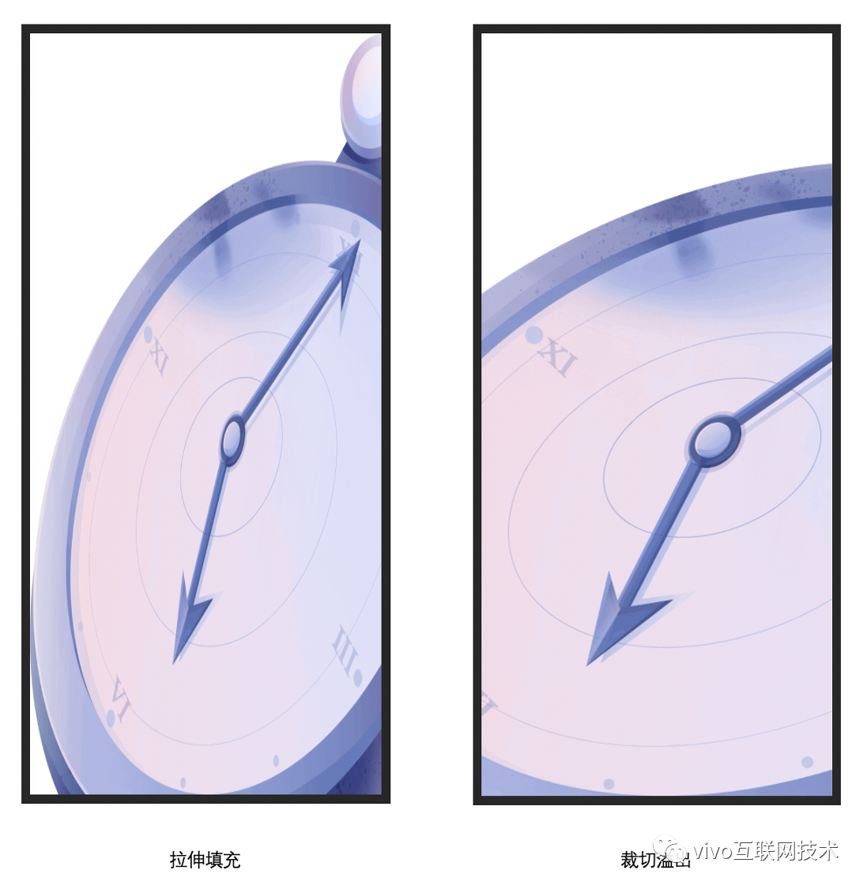


#### 2.3.2、内部元素定位方式

对于页面元素，我们采用固定定位（ fixed ），令其相对于窗口的各个边位置固定。

下图展示了分别相对于视口顶部左边、顶部右边、底部左边和底部右边固定定位的元素：

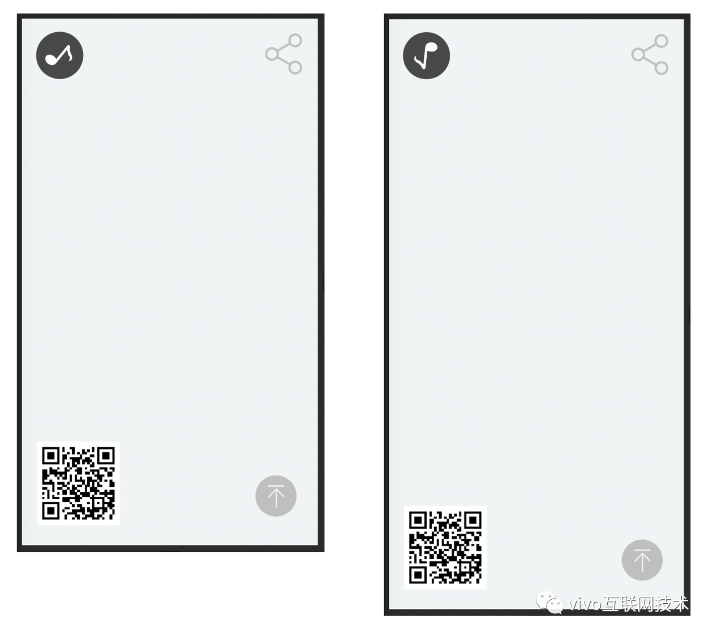


### **2.4、“精进”的优化**


#### 2.4.1、初步优化方案的问题

这种布局方案可以做到无论是横向还是纵向，页面内容所占空间始终与视口区域相同，初步满足了“满屏”的需求，但是仍然存在**不足**：

- 不够灵活

  固定定位的问题在于元素始终是以自己的某条边相对于视口的对应边框进行定位（如：只能是元素顶部相对于窗口顶部位置固定，而不能实现元素底部相对于窗口顶部位置固定的需求）

- 空间竞争

  由于所有元素根据屏幕实际宽度进行 **等比缩放** ，故对屏幕“剩余空间”的利用是静态的，即当屏幕宽高比变化时，所有元素总是 同时 “占据”或者“让出”特定比例的空间，尤其是在空间紧凑的情况下，可能存在非重点内容元素（点缀作用）与重点内容元素“空间竞争”的问题。

下图反映了固定定位在可视区域变小的情景下，元素对“剩余”空间的挤占：

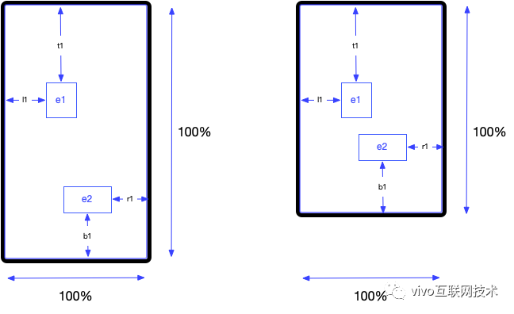


#### 2.4.2、预设方案进行灵活适配

为了进一步提升满屏场景布局的效果，悟空中台团队基于 **DPR & rem** 布局方案，借鉴了元素相对窗口固定定位的思想，提出并实现了基于行为预设的动态布局方案。


# 三、预设规则

即通过在用户配置页面的时候提供页面背景图和内部元素的属性、定位行为预设，实现产出页面对不同视口的良好适配。


## **1、背景图尺寸预设**


### **1.1、多种方案灵活可选**

提供多种背景图填充方式，供用户灵活选择：

- 默认——不对 background-size 进行设置
- 拉伸填充——横纵平铺
- 包含—— contain
- 覆盖—— cover
- 重复平铺—— repeat


## **2、内部元素行为预设**

提供配置选项，可以对元素的缩放行为作出灵活的配置以满足实际需求。


### **2.1、缩放行为预设**

缩放行为预设主要解决不同视口下页面元素间的空间竞争问题。


#### 2.1.1、元素分类

将元素分类为 主**要元素 和 次要元素**：

- **主要元素**

  页面中需要突出的重点内容，在视口尺寸发生变化引起的空间竞争中，处于优势地位；

- **次要元素**

  页面中相对不重点的内容，在视口尺寸发生变化引起的空间竞争中，处于劣势地位；


#### 2.1.2、基准视口与实际视口

**基准视口** 即与设计稿比例相同的视口，即如果设计稿比例是 9:16 ，则基准视口就是比例为 9:16 的视口；其他比例的视口我们称之为 非基准视口。

**实际视口**即页面运行时的视口，根据不同比例，可能是基准视口，也可能是非基准视口。


#### 2.1.3、实际视口中的元素缩放行为

当实际视口短于基准视口，主要元素大小与基准视口保持不变，次要元素按视口比例缩小；

当实际视口长于基准视口，主要元素按视口比例放大，次要元素大小与基准视口保持不变。

经过以上缩放行为预设，可以灵活定义不同元素在实际视口中的缩放行为，解决元素因视口变化出现的空间竞争问题。


#### 2.1.4、元素类型别名

为了使运营同学更容易理解主要元素和次要元素的预期行为，我们称放大元素为主要元素的别名，缩小元素为次要元素的别名，其余称为默认元素。

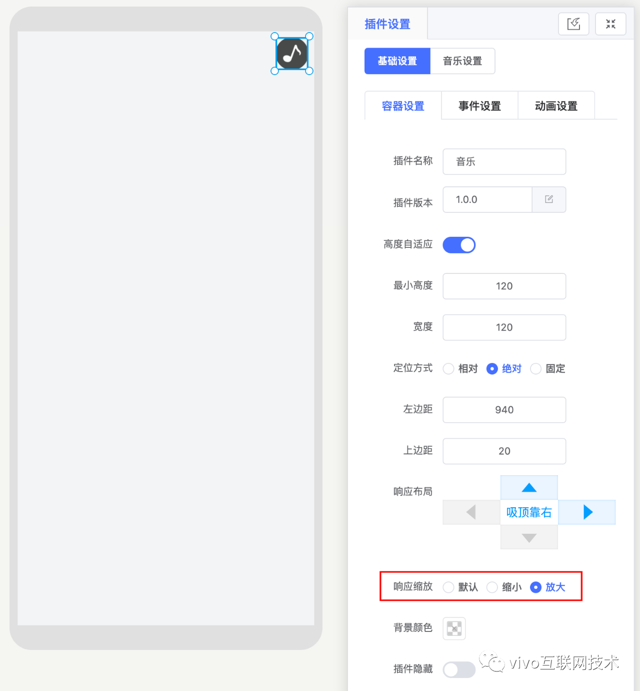


### **2.2、定位方式预设**

**定位方式**预设为了提升元素定位的**灵活性**，使得元素内部的定位基准可以根据实际需要任意选取。


#### 2.2.1、锚点

元素内部选取一个定位中心，作为锚点，将来元素的定位都是基于锚点进行计算。

锚点的设置可以让元素的定位更加灵活：如果将元素的锚点设置为其底边的中点，那么令锚点吸附视口顶部即可实现元素底部相对视口顶部距离固定，这是常规固定定位无法实现的。


#### 2.2.2、吸附性

对于一个元素，可以预设其锚点吸附于视口的顶部/底部，左边/右边，具体规则如下：

1. 元素在水平方向或垂直方向上，不能同时吸附对应的两条边；比如不能令一个元素同时吸附视口顶部和视口底部；但是可以另其同时吸附视口顶部和视口左边。
2. 元素若预设吸附了视口某一条边，则在任意规格的视口中，元素锚点相对于该条边的距离相同（以 rem 为单位）。
3. 若元素在水平或垂直方向上，并不吸附于任意一条边，则令其相对于该方向上的两条边的距离比例固定；比如若元素同时不吸附于视口左边和右边，则元素相对于视口左边和右边的距离之比固定，值为在页面设计器中，配置页面时该元素距离视口左边和右边的距离之比。

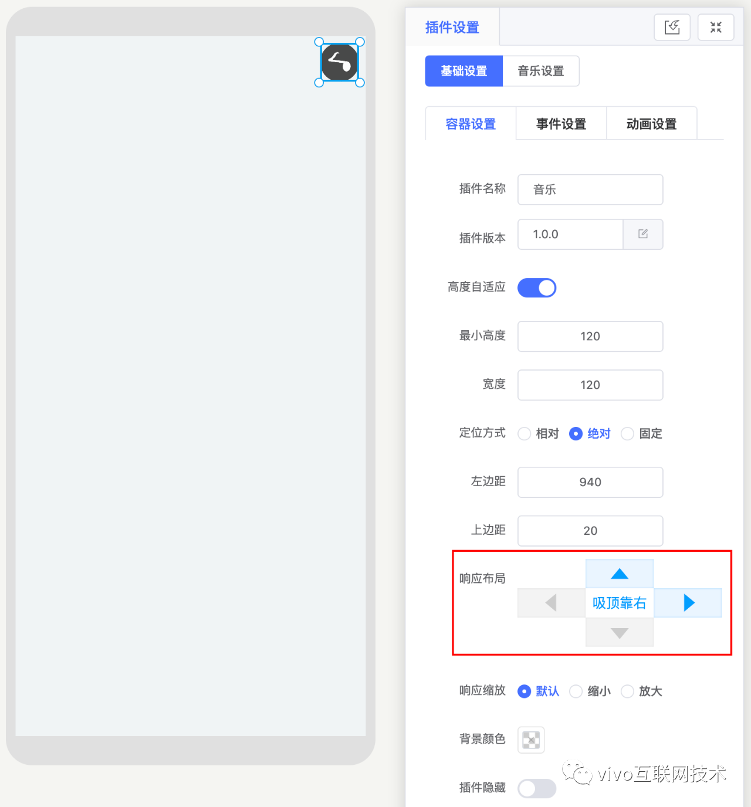


# 四、预设规则的实现

本部分介绍了预设规则的具体实现，重点在于体现设计思路，示例代码均为伪代码。


## **1、基准视口与实际视口**


### 1.1、基准视口宽高

描述基准视口的宽度与高度，我们设基准宽度用 **baseW** 表示，其值为 10.8 rem （对应设计稿 1080px ），同理基准高度 **baseH** 的值设置为 21.6 rem 。


### 1.2、实际视口宽高

描述实际视口宽度与高度，我们设实际宽度和高度分别为 **realW** 和 **realH** ，且由于使用基于 DPR 和 rem 的方案，容易得出 realW = baseW = 10.8rem ;

这样一来，实际视口与基准视口的差别就在于 **realH** 与 **baseH** 的不同。

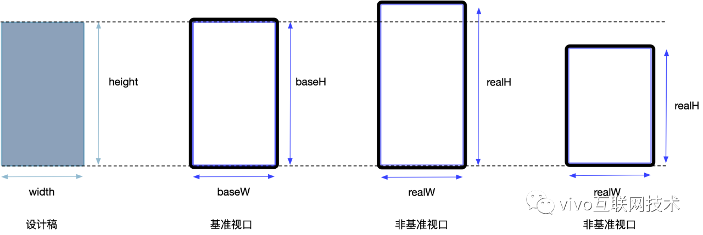


### 1.3、实际视口高度计算

根据 realW / realH = window.innerWidth / window.innerHeight ，将 realW = 10.8 rem 代入即可求得实际视口的 CSS 高度：

```javascript
realW = 10.8
realH = (realW * window.innerHeight) / window.innerWidht
```


### 1.4、视口高度比

实际视口与基准视口的比例，设其为 **windowHeightRatio** ，则

```javascript
// 计算视口高度比
windowHeightRatio = realH / baseH
```


## **2、元素缩放行为预设的实现**


### 2.1、缩放类型

使用 **scaleType** 描述元素缩放类型，其可选值有三个—— **zoomIn**（放大）、 **zoomOut**（缩小）和 **standard**（不进行缩放）。


### 2.2、缩放比 scale

使用 **scale** 描述元素在实际视口与标准视口下的缩放比，设元素在基准视口下的宽高为 **width** 和 **height** ，则元素在实际视口下的宽高分别为 baseW * scale 和 baseH * scale 。

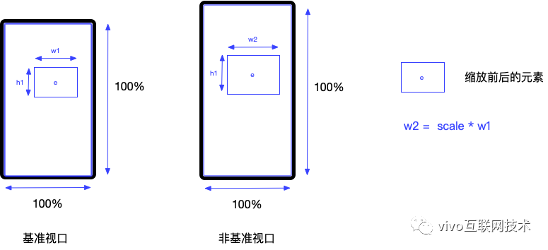


### 2.3、缩放行为目标

对于 scaleType 为 **zoomIn** 的元素，当实际视口 **高于** 基准视口时，元素 **缩放比** 为视口高度比，元素表现为放大；当实际视口 **不高于** 基准视口时，元素缩放比为 1，元素大小保持不变。即

- 当 windowHeightRatio > 1 （实际视口大于基准视口）时，元素 sacle = windowHeightRatio
- 当 windowHeightRatio <= 1 （实际视口小于基准视口）时，元素 sacle = 1

对于 scaleType 为 **zoomOut** 的元素，当实际视口 **低于** 基准视口时，元素 **缩放比** 为视口高度比（ realH / baseH ），元素表现为缩小；当实际视口 **不低于** 基准视口时，元素缩放比为 1，元素大小保持不变。即

- 当 windowHeightRatio > 1 （实际视口大于基准视口）时，元素 sacle = 1
- 当 windowHeightRatio < 1 （实际视口大于基准视口）时，元素 sacle = windowHeightRatio

对于 scaleType 为 **standard** 的元素，表现行为是始终与设计稿尺寸保持一致，故

- 对于任何 windowHeightRatio ，始终有 sacle = 1

```javascript
// 根据元素缩放类型确定元素的实际缩放比
switch (scaleType) {
  case 'zoomIn':
    scale = windowHeightRatio >= 1 ? windowHeightRatio : 1
    break
  case 'zoomOut':
    scale = windowHeightRatio >= 1 ? 1 : windowHeightRatio
    break
  default:
    scale = 1
}
```

至此，我们已经完成了对元素缩放类型的定义及缩放比的计算，接下来我们要定义并实现的另一个预设特性——定位特性。


## **3、元素定位方式预设的实现**


### 3.1、锚点

锚点的设置并不固定，可以灵活根据实际需求的效果进行设置；为便于理解，本例将其设置为元素实际 **宽高的中心点** 。


### 3.2、吸附性

不同视口内，页面元素的 **锚点** 相对于视口的某一个**边**的位置是定值，称该元素 **吸附** 于该条边，视吸附的边的不同，可以分为 **吸顶** 、 **吸底** 、 **靠左** 和 **靠右**；

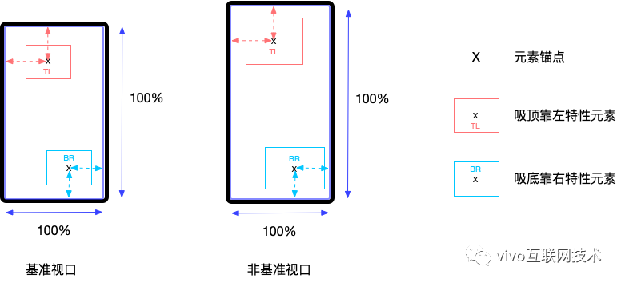

对于某个元素，若其在水平或竖直方向并 **不吸附** 于某一条边，而是相对于顶部到底部或左边到右边的距离是固定比例，则称其为 **按比例居中**。

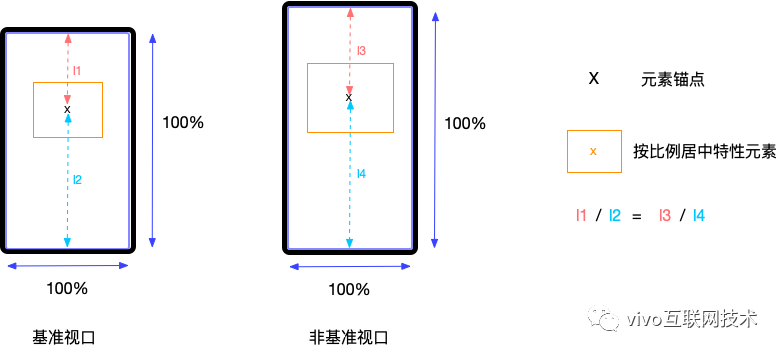

 


### 3.3、元素定位

我们以视口左上角作为定位坐标系的原点 ( 0, 0 ) ，将元素的吸附性使用元素锚点相对于定位原点的距离进行描述。

令元素与基准视口顶部及左边的距离为 baseTop 和 baseLeft；

元素与实际视口顶部及左边的距离为 realTop 和 realLeft。

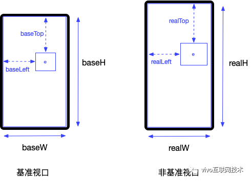

 


#### 3.3.1 特元素与可视区域顶部距离 realTop 的计算

（1）吸顶元素

吸顶元素的特性是元素 **锚点与视口顶部距离固定**，即

- 不同视口中，元素的 **高度的一半** 与 **元素顶部到到屏幕顶部** 的距离的 **和** 是不变的。

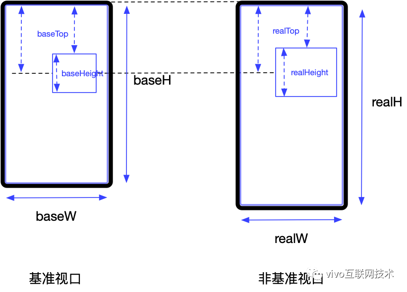

根据特性有如下换算关系：

height / 2 + baseTop = height * scale / 2 + realTop

由 realH = baseH * scale 得到

```javascript
realTop = height / 2 + baseTop - (height * scale) / 2
```

（2） 吸底元素

特性是元素 **锚点与视口底部的距离固定**，即

- 不同视口中，元素的 **高度的一半** 与 **元素底部到到屏幕底部** 的距离的 **和** 是不变的。

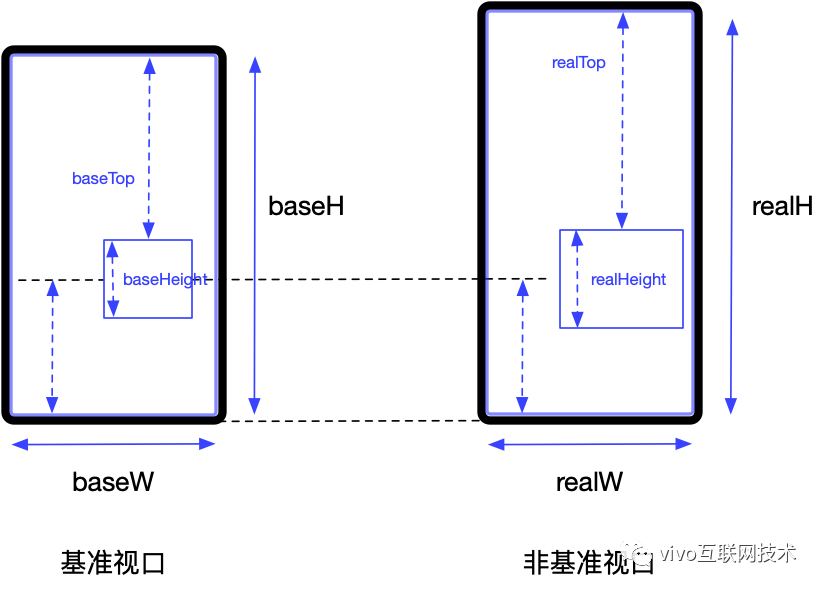

故应有如下换算关系：

baseH - ( baseTop + height / 2 ) = realH - ( realTop + height * scale / 2 )

求得

```javascript
realTop = realH - baseH + (baseTop + height / 2) - (height * scale) / 2
```

（3）按比例居中元素

特性是元素 **锚点距视口顶部和底部的距离成固定比例**，即

- 不同视口中，元素 **高度的一半加上元素顶部到屏幕顶部的距离的和** 的值，与元素 **高度的一半加上元素底部到屏幕底部的距离的和** 的值，这两个值 **相等**。

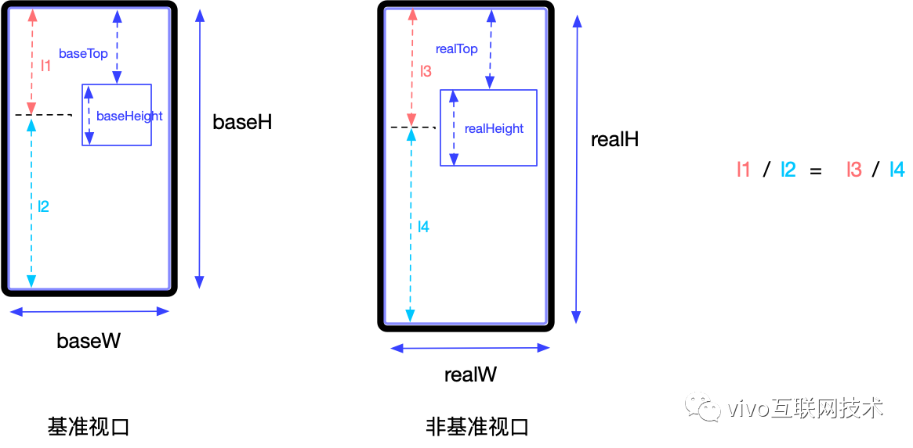

故应有如下换算关系：

( height / 2 + baseTops ) / baseH = ( height * scale / 2 + realTop ) / realH

求得

```javascript
realTop = (realH / baseH) * (height / 2 + baseTops) - (height * scale) / 2
```


#### 3.3.2、元素与可视区域左边框距离 realLeft 的计算

（1）靠左元素

对于靠左元素，特点是 **锚点距离视口左边框的距离固定**，即

- 不同视口中，元素元素 **宽度的一半与元素左边到屏幕左边** 的距离 **和** 是固定的。

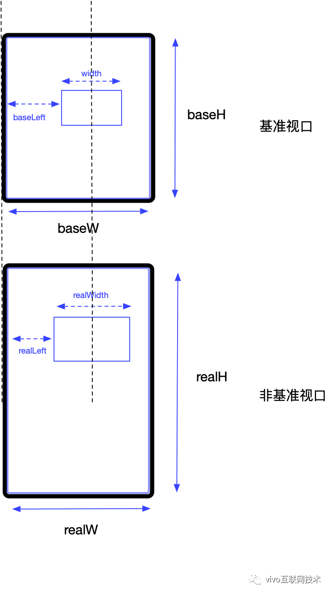

故应有如下换算关系：

baseLeft + width / 2 = realLeft + width * scale / 2

求得

```javascript
realLeft = baseLeft + width / 2 - (width * scale) / 2
```

（2）靠右元素

计算过程同上文，可以得到

```javascript
realLeft = realW - baseW + ( baseLeft + width / 2 ) - width * scale / 2
```

（3）按比例居中元素

根据 **元素锚点到屏幕左右边框距离相等** ，可以得到

```javascript
realLeft = (realW / baseW) * (baseLeft + width / 2) - (width * scale) / 2
```

由于我们基于 rem 和 DPR 的布局方案的一个“准则”是视口宽度总是 10.8rem ，即 realW 实际和 baseW 在数值上相等，所以上述结果可以简化为：、

```javascript
realLeft = ( baseLeft + width / 2 ) - width * scale / 2
```

至此，我们已经完成了对元素预设规则——元素缩放特性和元素定位特性的实现，接下来需要使用这两种特性对元素的综合样式进行描述。


## **4、元素最终样式**


### 4.1、定位方案的选择


#### 4.1.1、简单场景

对于单一的“满屏”需求，如一个单独的满屏页面，我们只需要对其中的元素使用 **固定定位**（fixed）方案结合前面几个步骤求得的 scale , realTop 和 realLeft 求得样式即可，举个栗子：

```javascript
style = `
  top: ${realTop}rem;
  left: ${realLeft}rem;
  width: ${width}rem;
  height: ${height}rem;
  transform: scale(${scale});
`
```


#### 4.1.2、较为复杂的场景

如果我们的页面需要由一连串的“满屏”页面组成，并且可以进行“满屏”页面的切换，实现类似幻灯片一样的效果，则实际上每个“满屏”的页面其实是我们最终页面的一个具备“满屏”特性的“容器”，容器内部的元素在进行布局时，需要相对于容器进行绝对定位（ absolute ）。


#### 4.1.3 使用锚点进行样式表达

而且既然我们已经有了元素 **锚点** 的概念，使用元素锚点的偏移量进行定位是更合乎情理的，锚点即是 CSS 中的 **transform-origin** 属性，即 transform-origin : center ，假设元素均处于默认起始位置 （ top = left = 0 ）,我们使用 transform 属性对元素的偏移位置进行设置：

锚点竖直方向原位置：baseAnchorY = height / 2

锚点竖直方向目标位置：realAnchorY = realTop + height * scale / 2

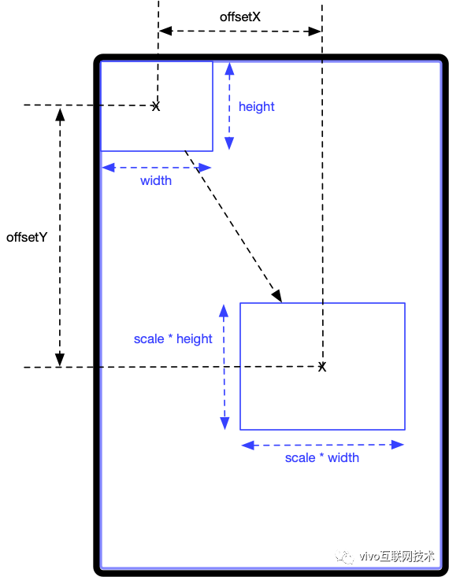

根据以上可以求得：

锚点竖直方向的偏移量：offsetVertical = realAnchorY - baseAnchorY = realTop + height * scale / 2 - height / 2

同理求得锚点水平方向的偏移量：offsetHorizontal = realAnchorX - baseAnchorX

最终获得元素样式为：

```javascript
style = `
  top: 0px;
  left: 0px; 
  width: ${width}rem;
  height: ${height}rem;
  transform-origin: center; // 锚点设置
  transform: translateX(${offsetVertical}rem) translateY(${offsetHorizontal}rem) scale(${style.scale});
`
```


# 五、预设方案在生产中的应用


## **1、集成形式**

目前基于行为预设的动态布局方案已经作为 **悟空活动中台** 上单页满屏场景的默认布局配置方案，用户可以通过简单的两步操作，便可调选中元素的吸附和缩放特性进行预设：

 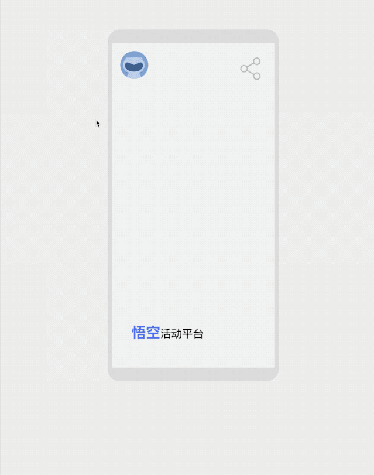


## **2、产出实例**

悟空平台已经产出许多应用了的线上专题，比如经典的[vivo 浏览器年终策划 | 2018 大事鉴](https://www.oschina.net/action/GoToLink?url=https%3A%2F%2Ftopic.vivo.com.cn%2FvivoBrowser%2FTP5eoz81ia08g0%2Findex.html)：


#  六、写在最后

**基于行为预设的动态布局方案** 一定程度上实现了根据视口尺寸对元素定位和大小的动态设置，达到了“恰到好处的突出重点”的效果。根据业务现实情况，预设方案也可以有多种不同的灵活实现，比如元素的响应式缩放、吸附特征以及锚点位置的设置可以根据需求动态调整。

如果本文能够对你的布局设计带来一点点微小灵感的话，那真是深感荣幸。感谢阅读。

更多内容敬请关注 **vivo 互联网技术** 微信公众号