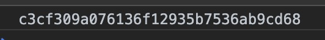

# [前端使用js计算文件的MD5值](https://segmentfault.com/a/1190000022920399)

在前端开发时有时需要计算文件的 `MD5` 值传给后端用作比较文件的准确性和完整性。

前端计算 `MD5` 可以使用插件 [js-spark-md5](https://link.segmentfault.com/?enc=v5fuSS6atUyeiiBoMPgJEA%3D%3D.8mABm2lVmu1tTWtea6fkaoH9X%2F4lDJZ%2BBrJYVnRD2c4HfTLwXLBV7Pbr12fsLAVG) ，下载 [spark-md5.min.js](https://link.segmentfault.com/?enc=2b7XX8%2BwLmfCWesyRa%2BQEA%3D%3D.yTMExTFA6vtGOd8uhEKdQ1i%2BaUFlJFWiwPfGpcfw%2B%2Bq2AadRoLMKqn2F%2FPb9AmVOhjg%2BG%2BwqKMF1BkX08HA1Ougm6BYsQmAot7c4xCvTNZs%3D) 存储在本地。

还应用到了现代浏览器中都实现了的类 [FileReader](https://link.segmentfault.com/?enc=z1WaOSgvPXdub1FVhko1Iw%3D%3D.k93knNHxMymROP7NMJ1097NbggHV5jO%2Bc8OWbveAxr5dUp4e4%2FEh3dhUEI9riNcLXjIHT6X7Y8%2B9AR1vjvPkFw%3D%3D)，它的实例的 `readAsBinaryString` 方法，用来读取文件的原始二进制数据。

**创建HTML部分并引入插件**

```routeros
<input type="file" id="file">
<script src="spark-md5.min.js"></script>
```

**计算小文件的MD5值**

```dart
document.querySelector('#file').addEventListener('change', e => {
  const file = e.target.files[0];
  const fileReader = new FileReader()
  fileReader.readAsBinaryString(file);
  fileReader.onload = e => {
    const md5 = SparkMD5.hashBinary(e.target.result);
    console.log(md5);
  }
});
```

首先获取了上传的文件，然后用前面提到的 `FileReader` 实例的 `readAsBinaryString` 方法读取文件的二进制数据，当读取完成后会触发 `onload` 事件，用 `e.target.result` 获取二进制数据，传入`SparkMD5` 的 `hashBinary` 方法计算 `MD5` 值，打开控制台，可以看到计算出的最终 `MD5` 值：



**计算大文件的MD5值**
但是假设上传的是一个大文件，受限于计算机性能的原因，`MD5` 的计算速度就会大幅度降低。这时可以将文件切分成若干切片，分别计算 `MD5` 值，然后再组合起来。[File](https://link.segmentfault.com/?enc=WSIOJ1f3iez9NE8bsTJnQw%3D%3D.EOZiRgmkMiFg%2BXSiuxN5XtG60SSH8TjrRks%2BzP%2BqoP9stTHHBzQUqhYdZE4GewYG0es5e%2F%2F6znr%2BdtVDy85rWA%3D%3D) 类从 `BloB` 类继承了 `slice` 方法，可以对文件进行切片处理。

```javascript
document.querySelector('#file').addEventListener('change', e => {
  const file = e.target.files[0];
  const sliceLength = 10;
  const chunkSize = Math.ceil(file.size / sliceLength);
  const fileReader = new FileReader();
  const md5 = new SparkMD5();
  let index = 0;
  const loadFile = () => {
    const slice = file.slice(index, index + chunkSize);
    fileReader.readAsBinaryString(slice);
  }
  loadFile();
  fileReader.onload = e => {
    md5.appendBinary(e.target.result);
    if (index < file.size) {
      index += chunkSize;
      loadFile();
    } else {
      console.log(md5.end());
    }
  };
});
```

假设将文件切成10份，那么每一份的大小就是 `file.size / sliceLength` ，首先创建 `FileReader` 和 `SparkMD5` 的实例。再对文件进行切片处理，并把切片传入 `FileReader` 实例获取二进制数据的方法 `readAsBinaryString` 中，读取完成调用 `SparkMD5` 实例的 `appendBinary` 方法，即为该切片的 `MD5` 。如果没有读取完成，则重复该读取操作，直至最后一个切片读取完成。读取完成后调用 `md5.end` 方法，输出最终的 `MD5` 值。打开控制台查看：


与刚才一次性读取的 `MD5` 值相同。

当在开发过程中如果需要计算文件的 `MD5` 值时，可根据文件大小选择以上两种方法中的某一个进行使用即可。