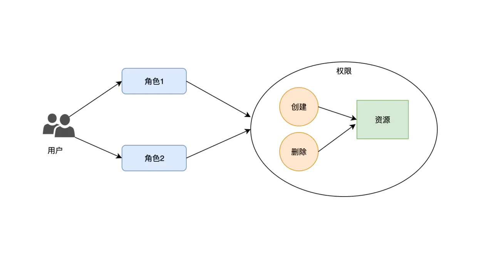

# 基于 RBAC 的前端权限控制

当我们讨论到前端应用的权限控制时，不是在讨论如何去控制权限，而是在讨论如何将用户权限反映到页面元素的显隐上。如果用户没有权限访问请求，不仅会造成请求资源的浪费，还会降低用户体验。前端的权限控制就是为了解决这类问题。

RBAC 是目前普遍使用的一种权限模型。本文会讨论如何基于 RBAC 权限模型去实现前端应用的权限控制。

## RBAC 简介

RBAC（Role-Based Access Control）即：基于角色的访问控制。RBAC 认为授权其实就是 who, what, how 三者之间的关系，即 who 对 what 进行 how 操作。简单来说就是某个角色 (who) 对某些资源 (what) 拥有怎样的 (how) 权限。

在 RBAC 中，用户只和角色关联，而角色对应了一组权限。通过为不同的用户分配不同的角色，从而让不同的用户拥有不同的权限。

相比于 ACL（Access Control List）直接为用户赋予权限的方式，RBAC 通过角色为用户和权限之间架起了一座桥梁，从而简化了用户和权限之间的关系，让权限配置更易于扩展和维护。



## 前端应用的权限控制

对于前端应用来说，按照权限控制粒度的不同，可以分为组件权限和页面权限：

1. 组件权限控制的粒度较细，可以精确地控制每个 UI 组件显示与否。
2. 页面权限控制的粒度较粗，只能控制到页面层。本质上就是对路由进行权限控制。

### 组件权限控制

刚才也提到了，组件的权限控制粒度很细。因此，我们可能需要为应用中数百个组件添加权限控制。这意味着如果一开始没有设计好组件权限控制的方案，可能会导致应用难以维护，甚至造成灾难性的后果。

#### 一个「错误」的方案

在最初设计组件权限控制的方案时，我们将组件的显示与否关联到了角色。也就是说通过配置「允许访问的角色列表」，去控制组件的显示与否。为了方便使用，我们还设计了一个公用组件，用来包裹每个需要权限控制的组件。如下所示：

```
<OneOfAccessControl permittedRoles={["RoleA", "RoleB", "RoleC"]}>
  <Button />
</OneOfAccessControl>
```

在上面的例子中，只要列表中的任意一个角色有权限，就会渲染按钮组件，否则什么也不做。这段代码看起来似乎没什么问题。但如果此时要新增一个角色，试想会发生什么？

我们可能需要修改上百个地方的配置，而且由于配置散落在项目的各个角落，修改起来十分困难。因此每增加一个角色或者移除一个角色，都会带来巨大成本。为了解决这个问题，我们优化了之前的方案。如下所示：

```
const permissionsConfig = {
  canViewButton: ["RoleA", "RoleB", "RoleC"],
  canEditButton: ["Role_A", "Role_B"]
  canDeleteButton: ["Role_B"],
};
```

与前面不同的是，我们将分散的配置项集中管理起来了。在获取到当前用户所拥有的角色之后，将这份配置转换成了一组控制 UI 组件显隐的开关，并通过 Context 提供给下游组件。在使用时只需要通过一个布尔值就能控制按钮的显示和隐藏。如下所示：

```
const ACButton = () => {
 const { canViewButton } = useContext(PermissionsContext);
 return canViewButton && <Button />; 
}
```

优化后的方案确实更易于维护了。但如果需求是根据动态生成的角色去控制组件的显示与否，又该如何解决呢？动态生成角色意味着角色列表可能随时发生变化。因此无法再像上面一样，通过配置「固定」的角色列表，去控制组件的显示与否。

其实问题的关键就在于：RBAC 权限模型中，角色不是固定的而是动态变化的。我们可以随时增加或者修改一个角色。因此，最好不要将组件的权限控制和角色绑定到一起。

#### 不如交给 BFF 吧？

有时候一个组件的显示与否，不仅仅和权限相关，也和 API 返回的数据相关。比如：

```
// 有权限并且年满 18 岁的用户才能看到这个按钮
hasPermission && age >= 18 && <Button />
```

我们都知道，BFF（Backends For Frontends）是服务于前端的后端。既然是为前端服务的，我们可以在返回数据的同时，返回组件的开关。这样即便权限或数据状态发生改变，前端也无需重新部署。

不过这个方案可能会增加前后端的沟通成本。每次定义 API Schema 时，除了业务数据还需要定义一堆用于控制组件显隐的开关。

随着前端组件的变化，字段可能也需要重命名。比如原来的字段名叫 `canViewProfile`，随着需求的变化应该修改为 `canViewProfileAndHistory`，否则就会产生字段不表意的问题。

另外，前端组件不断增加，开关字段也会随之增多。如下所示：

```
{
  "canViewProfile": true,
  "canEditProfile": false,
  "canDeleteProfile": false,
  "canViewHistory": true,
  "canEditHistory": false,
  "canDeleteHistory": false,
  "canCreateReport": false,
  "canViewReport": false,
  "canDeleteReport": false
}
```

在一些情况下，这种方案可能有致命的缺陷。比如一个提交按钮，根据权限控制的需求，在请求数据之前就需要将其隐藏，这个时候就无法通过 BFF 在返回数据中加上开关，而再提供额外接口获取开关又显得冗余。

#### 将后端权限映射到前端

RESTful 是目前最流行的 API 设计规范。它的核心思想就是用「动词 + 宾语」的结构来描述客户端发出的数据操作指令。

动词通常是指五种 HTTP 方法（GET, POST, PUT, PATCH, DELETE），对应接口的 CRUD 操作。宾语是指操作的资源。`DELETE /book/ID` 这个指令描述的就是删除（动词）某本书（宾语）。而 RESTful API 中的「动词 + 宾语」，不就正好对应了 RBAC 权限模型中的「权限 + 资源」吗？

因此，可以将权限管理与 RESTful API 关联起来。比如，A 角色对 `book` 资源拥有 `delete` 权限，那么 A 角色就一定可以调用 `DELETE /book/ID` API，自然也能看到页面上的删除按钮。

我们可以让后端返回当前用户可用的接口列表，用于开关前端组件。比如：

```
{
  "permissions": [
    "GET,/api/books",
    "POST,/api/book/{id}",
    "PATCH,/api/book/{id}",
    "DELETE,/api/book/{id}"
  ]
}
```

但接口最好用 API 唯一标识替代（如 `operationId`），以方便前端使用。如下所示：

```
{
  "permissions": ["GetBook", "NewBook", "UpdateBook", "DeleteBook", "ListBook"]
}
```

这样，当我们需要控制 `DeleteButton` 是否显示时，只需要看看当前用户有没有调用 `DeleteBook` 接口的权限即可。如下所示：

```
const ACDeleteButton = () => {
  const { permissions } = useContext(PermissionsContext);
  return hasPermission("DeleteBook")(permissions) && <DeleteButton />;
}
```

通过可用接口列表来配置权限，在角色变化时不会造成任何负担。同时，由于不需要在接口中定义开关字段，减少了前后端的沟通成本，也避免了接口字段不断膨胀的问题。

#### 权限的复用

有时候，我们需要考虑带权限组件的复用问题。比如一个组件用在了很多地方，并且每个地方需要的权限控制也相同。为了方便复用，可以把权限控制的逻辑和组件一起，封装成一个单独的组件。比如上个例子中的 `ACDeleteButton`。

但是，这种场景更适合使用高阶组件。因为高阶组件采用了装饰器模式，可以增强原有组件的功能，并且不破坏它原有的特性。我们可以抽象一个不带权限控制的原始组件，再通过高阶组件去修饰它，从而得到一个带权限配置的新组件。这样，当需要复用原始组件时，也很方便。比如：

```
export const needOneOfPermission = (...permissionKeys: string[]) => {
  const { permissions } = useContext(PermissionContext);
  return (Comp) => {
    return hasOneOfPermission(permissionKeys)(permissions) && <Comp />;
  };
};

const ACBookList = needOneOfPermission("ListBook")(BookList);
const ACBook = needOneOfPermission("GetBook")(Book);
```

通过高阶组件，我们可以让一个组件在「带权限」和「不带权限」之间快速切换。

### 页面权限控制

页面的权限控制，其实就是对路由的权限控制。我们可以根据用户当前所拥有的权限，去判断他是否能访问某个页面，从而决定是否渲染某个路由导航。

与组件的权限控制类似，页面的权限控制也面临着相同的问题。如果根据角色列表去控制导航菜单的渲染，同样会遇到角色动态变化的问题。如果让 BFF 返回路由开关，还需要增加一个额外的接口。因此，最好还是根据用户可访问的接口列表去开关路由。

#### 配置路由

在配置路由时，我们可以增加一个状态 `visible` 用于开关路由。在获取到当前用户可访问的接口列表之后，再将用户可访问的路由过滤出来。

```
const routes = [
  {
    path: "/home",
    exact: true,
    visible: (permissions) => hasOneOfPermissions(["GetBook", "GetPerson"], permissions),
  },
  {
    path: "/list",
    exact: true,
    visible: (permissions) => hasAllPermissions(["GetList", "ListBook"], permissions),
  },
];

filterRoutesByPermissions(routes, permissions);
```

这个方案相对来说比较简单，但是容易遗漏配置项。特别是当只要任意一个权限满足就渲染路由时，很难发现某个接口权限漏掉了。

#### 组件推导

页面一定会使用组件，因此可以根据页面使用到的组件，推导出页面的权限。当然，这里需要对组件进行一些改造。比如上一小节的 `DeleteButton` ：

```
const ACDeleteButton = needPermissions("DeleteBook")(DeleteButton)
```

我们可以封装高阶组件（High-Order-Component）来包裹原组件， 使之在函数组件的基础上，让函数持有 `shouldRender(permissions: {}) => bool` 方法以便推导：

```
interface AccessControlComponent<TProps> {
  (props: TProps) => JSX.Element | null;
  shouldRender: (permissions: {}) => bool;
}
```

在其他组件，我们可以通过如下方式进行组合直至页面：

```
const ACSection = needPermissions(ACDeleteButton)(() => (
	<div>
    <ACDeleteButton/>
  </div>	
))

const ACPage = needPermissions(ACSection)(() => {}(
	<div>
    <ACSection/>
  </div>	
))
```

最后将 `ACPage` 注册到路由，在渲染导航菜单时，我们可以直接使用 `ACPage.shouldRender` 判断是否需要渲染页面对应的菜单。

组件推导的方案更适合通过 Babel 插件去自动配置。如果没有自动化工具辅助，这个方案会显得比较繁琐。

## 最后

本文讨论了前端实现 RBAC 权限控制的几种方案。其中最灵活的一种方式，就是通过当前用户可用的接口列表，去控制前端组件和路由的渲染。

这些方案没有绝对的对错之分，只有「适合」与「不适合」。就拿第一个「错误」的方案来说，它确实缺少了一些灵活性，但如果你项目中的角色变动很少，采用这个方案也不是不可以。只不过你需要明确这个方案会带来哪些「利」与「弊」。