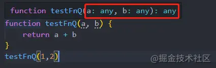

# 快速TypeScript指南

## 一、为什么要用TypeScript

`TypeScript`可以让我们开发中避免一些`类型`或者`一些不是我们预期希望的代码结果`错误。xxx is not defined 我们都知道`JavaScript`错误是在运行中才抛出的，但是`TypeScript`错误直接是在编辑器里告知我们的，这极大的提升了开发效率，也不用花大量的时间去写单测，同时也避免了大量的时间排查`Bug`。

## 二、TypeScript优缺点

### 优点

- 一般我们在前后端联调时，都要去看接口文档上的字段类型，而`TypeScript`会自动帮我们识别当前的类型。节省了我们去看`文档`或者`network`时间。这叫做类型推导(待会我们会讲到)
- 友好地在编辑器里提示错误，避免代码在运行时类型隐式转换踩坑。

### 缺点

- 有一定的学习成本，`TypeScript`中有几种类型概念，`interface接口`、`class类`、`enum枚举`、`generics泛型`等这些需要我们花时间学习。
- 可能和一些插件库结合的不是很完美

## 三、TypeScript运行流程及JavaScript代码运行流程

**1. JavaScript运行流程如下，依赖NodeJs环境和浏览器环境**

- 将`JavaScript`代码转换为`JavaScript-AST`
- 将`AST`代码转换为字节码
- 运算时计算字节码

**2. TypeScript运行流程，以下操作均为TSC操作，三步执行完继续同上操作，让浏览器解析**

- 将`TypeScript`代码编译为 `TypeScript-AST`
- 检查`AST`代码上类型检查
- 类型检查后，编译为`JavaScript`代码
- `JavaScript`代码转换为`JavaScript-AST`
- 将`AST`代码转换为字节码
- 运算时计算字节码

## 四、TypeScript和JavaScript区别

只有搞懂了二者的区别，我们才可以更好的理解`TypeScript`

| 类型系统特性           | JavaScript | TypeScript |
| ---------------------- | ---------- | ---------- |
| 类型是如何绑定？       | 动态       | 静态       |
| 是否存在类型隐式转换？ | 是         | 否         |
| 何时检查类型？         | 运行时     | 编译时     |
| 何时报告错误           | 运行时     | 编译时     |

### 类型绑定

**JavaScript**

`JavaScript`动态绑定类型，只有运行程序才能知道类型，在程序运行之前`JavaScript`对类型一无所知

**TypeScript**

`TypeScript`是在程序运行前（也就是编译时）就会知道当前是什么类型。当然如果该变量没有定义类型，那么`TypeScript`会自动类型推导出来。

### 类型转换

**JavaScript**

比如在`JavaScript`中`1 + true`这样一个代码片段，`JavaScript`存在隐式转换，这时`true`会变成`number`类型`number(true)`和1相加。

**TypeScript**

在`TypeScript`中，`1+true`这样的代码会在`TypeScript`中报错，提示`number`类型不能和`boolean`类型进行运算。

### 何时检查类型

**JavaScript**

在`JavaScript`中只有在程序运行时才能检查类型。类型也会存在隐式转换，很坑。

**TypeScript**

在`TypeScript`中，在编译时就会检查类型，如果和预期的类型不符合直接会在编辑器里报错、爆红

### 何时报告错误

**JavaScript**

在`JavaScript`只有在程序执行时才能抛出异常，`JavaScript`存在隐式转换，等我们程序执行时才能真正的知道代码类型是否是预期的类型，代码是不是有效。

**TypeScript**

在`TypeScript中`，当你在编辑器写代码时，如有错误则会直接抛出异常，极大得提高了效率，也是方便。

## 五、TypeScript总共围绕两种模式展开

### 显式注解类型

举个栗子

```typescript
let name: string = "前端娱乐圈";
let age: number = 38;
let hobby: string[] = ["write code", "玩游戏"]
```

显式注解类型就是，声明变量时定义上类型（官方话语就是**声明时带上注解**），让我们一看就明白，哦~，这个`name`是一个`string`类型。

### 推导类型

举个栗子

```typescript
let name = "前端娱乐圈"; // 是一个string类型
let age = 38;  // 是一个number类型
let hobby = ["write code", "玩游戏"] // 是一个string数组类型
```

推导类型就是去掉显示注解，系统自动会识别当前值是一个什么类型的。

## 六、安装TypeScript && 运行

### typescript

全局安装`typescript`环境。

```bash
npm i -g typescript
```

可是这只是安装了`typescript`，那我们怎么运行`.ts`文件呢，安装完`typescript`我们就可以执行`tsc`命令。

如：我们的文件叫做`index.ts`，直接在命令行执行`tsc index.ts`即可。然后就可以看到在目录下编译出来一个`index.js`，这就是`tsc`编译完的结果。

**index.ts**

```typescript
const userName: string = "前端娱乐圈" 
```

运行`tsc index.ts`，你可以看见在`index.ts`的同级下又生成一个`index.js`，如下就是编译的结果文件`index.js`。

```typescript
var userName = "前端娱乐圈"
```

上面我们知道了运行`tsc`命令就可以编译生成一个文件，有的小伙伴觉得这样太麻烦了，每次运行只是编译出来一个文件还不是运行，还得用`node index.js`才可以运行。不急我们接着往下看

### ts-node

我们来看一下这个插件`ts-node`，这个插件可以直接运行`.ts`文件，并且也不会编译出来`.js`文件。

```bash
npm i ts-node
// 运行 ts-node index.ts
```

讲到这里我们了解了**为什么要用TypeScript**和它的**优缺点**以及它的**运行工作方式**。

那么接下来步入`TypeScript`基础知识的海洋啦~，follow me。

感觉有帮助的小伙伴可以关注一下：**前端娱乐圈** 公众号，谢谢啦~，每天更新一篇小技巧

## 七、基础知识

### 1. 基础静态类型

在`TypeScript`中基础类型跟我们`JavScript`中基础类型是一样的。只是有各别是`Ts`里面新出的。

#### 1. number

```typescript
const count: number = 18; // 显示注解一个number类型
const count1 = 18; // 不显示注解，ts会自动推导出来类型
```

#### 2. string

```typescript
const str: string = "前端娱乐圈"; // 显示注解一个string类型
const str1 = "蛙人"; // 不显示注解，ts会自动推导出来类型
```

#### 3. boolean

```typescript
const status: string = false; // 显示注解一个string类型
const status1 = true; // 不显示注解，ts会自动推导出来类型
```

#### 4. null

```typescript
const value: null = null;
const value: null = undefined; // 这一点null类型可以赋值undefined跟在 js中是一样的，null == undefined
```

#### 5. undefined

```typescript
const value: undefined = undefined;
const value: undefined = null; // 这一点null类型可以赋值undefined跟在 js中是一样的，null == undefined
```

#### 6. void

估计到这有一些小伙伴可能对`void`这个比较陌生，以为只有`TypeScript`才有的。其实不是哈，在我们`JavaScript`就已经存在`void`关键字啦，它的意思就是无效的，有的小伙伴可能看见过早些项目里面`<a href="javascript: void(0)">`这是控制`a`标签的跳转默认行为。你不管怎么执行`void`方法它都是返回`undefined`

那么在我们`TypeScript`中`void`类型是什么呢。它也是代表无效的，一般只用在**函数**上，告诉别人这个**函数**没有返回值。

```typescript
function fn(): void {} // 正确
function testFn(): void {
    return 1; // 报错，不接受返回值存在
}

function fn1(): void { return undefined} // 显示返回undefined类型，也是可以的
function fn2(): void { return null} // 显示返回null类型也可以，因为 null == undefined
```

#### 7. never

`never`**一个永远不会有值的类型**或者也可以说**一个永远也执行不完的类型**，代表用于不会有值，`undefined`、`null`也算做是值。一般这个类型就不会用到，也不用。大家知道这个类型就行。

```typescript
const test: never = null; // 错误
const test1: never = undefined // 错误

function Person(): never { // 正确，因为死循环了，一直执行不完
    while(true) {}
}

function Person(): never { // 正确，因为递归，永远没有出口
    Person()
}

function Person(): never { // 正确 代码报错了，执行不下去
    throw new Error()
}
```

#### 8. any

`any`这个类型代表**任何的**、**任意的**。希望大家在项目中，不要大片定义`any`类型。虽然它真的好使，那这样我们写`TypeScript`就没有任何意义了。

```typescript
let value: any = ""; // 正确
value = null // 正确
value = {} // 正确
value = undefined // 正确
```

#### 9. unknown

`unknown`类型是我们`TypeScript`中第二个`any`类型，也是接受任意的类型的值。它的英文翻译过来就是**未知的**，我们来看一下栗子

```typescript
let value: unknown = ""	 
value = 1;
value = "fdsfs"
value = null
value = {}
```

那现在肯定有小伙伴疑惑，诶，那它`unknown`相当于是`any`类型，那二者的区别是什么。我们来看一下

```typescript
let valueAny: any = "";
let valueUnknown: unknown = "";

valueAny = "蛙人";
valueUnknown = "前端娱乐圈"

let status: null = false;
status = valueAny; // 正确
status = valueUnknown // 报错，不能将unknown类型分配给null类型
```

我们来看一下上面的，为什么`any`类型就能被赋值成功，而`unknown`类型不行呢，从它俩的意义来上看，还是有点区别的，`any`任何的，任意的、`unknown`未知的。所以你给`unknown`类型赋值任何类型都没关系，因为它本来就是未知类型嘛。但是你如果把它的`unknown`类型去被赋值一个`null`类型，这时人家`null`这边不干了，我不接受`unknown`类型。

说白了一句话，别人不接受`unknown`类型，而`unknown`类型接受别人，哈哈哈哈。

### 2. 对象静态类型

说起对象类型，我们肯定都能想到对象包含`{}`、`数组`、`类`、`函数`

#### 1. object && {}

其实这俩意思一样，`{}`、`object`表示非原始类型，也就是除`number`，`string`，`boolean`，`symbol`，`null`或`undefined`之外的类型。

```typescript
const list: object = {} // 空对象

const list1: object = null; // null对象

const list: object = [] // 数组对象

const list: {} = {}
list.name = 1 // 报错 不可更改里面的字段，但是可以读取
list.toString()
```

#### 2. 数组

```typescript
const list: [] = []; // 定义一个数组类型
const list1: number[] = [1,2] // 定义一个数组，里面值必须是number
const list2: object[] = [null, {}, []] // 定义一个数组里面必须是对象类型的
const list3: Array<number> = [1,2,3] // 泛型定义数组必须是number类型，泛型我们待会讲到
```

#### 3. 类

```typescript
// 类
class ClassPerson = {
    name: "前端娱乐圈"
}
const person: ClassPerson = new Person();
person.xxx = 123; // 这行代码报错，因为当前类中不存在该xxx属性
```

#### 4. 函数

```typescript
// 函数
const fn: () => string = () => "前端娱乐圈" // 定义一个变量必须是函数类型的，返回值必须是string类型
```

### 3. 函数类型注解

这里说一下函数显示注解和函数参数不会类型推导问题。

#### 1. 函数返回类型为number

```typescript
function fn(a, b): number {
    return a + b;
}
fn(1, 2)
```

#### 2. 函数void

显示注解为`void`类型，函数没有返回值。

```typescript
function fn(): void {
    console.log(1)
}
```

#### 3. 函数不会自动类型推导

可以看到下面的函数类型，不会自动类型推导，我们实参虽然传入的1和2，但是形参方面是可以接受任意类型值的，所以系统也识别不出来你传递的什么，所以这里得需要我们显示定义注解类型。

```typescript
function testFnQ(a, b) {
    return a + b
}
testFnQ(1,2)
```



我们来改造一下。

```typescript
function testFnQ(a:number, b:number) {
    return a + b
}
testFnQ(1,2)
```


我们再来看一下参数对象显示注解类型，也是在`:`号后面赋值每个字段类型即可。

```typescript
function testFnQ(obj : {num: number}) {
    return obj.num
}
testFnQ({num: 18})
```

### 4. 元组Tuple

元组用于表示一个已知数组的数量和类型的数组，定义数组中每一个值的类型，一般不经常使用。

```typescript
const arr: [string, number] = ["前端娱乐圈", 1]
const arr: [string, string] = ["前端娱乐圈", 1] // 报错
```

### 5. 枚举Enum

`Enum`枚举类型，可以设置默认值，如果不设置则为索引。

```typescript
enum color {
    RED,
    BLUE = "blue",
    GREEN = "green"
}
// color["RED"] 0
// color["BLUE"] blue
```

像上面的`color`中`RED没`有设置值，那么它的值则为`0`，如果`BLUE`也不设置的话那么它的值则是`1`，它们这里是递增。如果设置值则是返回设置的值

**注意这里还有一个问题，直接来上代码**

通过上面学习我们知道了`enum`可以递增值，也可以设置默认值。但是有一点得注意一下，`enum`没有`json`对象那样灵活，`enum`不能在任意字段上设置默认值。

比如下面栗子，`RED`没有设置值，然后`BLUE`设置了默认值，但是`GREEN`又没有设置，这时这个`GREEN`会报错。因为你第二个`BLUE`设置完默认值，第三又不设置，这时代码都不知道该咋递增了，所以报错。还有一种方案就是你给`BLUE`可以设置一个数字值，这时第三个`GREEN`不设置也会跟着递增，因为都是`number`类型。

```typescript
// 报错
enum color {
    RED,
    BLUE = "blue",
    GREEN
}
// good
enum color {
    RED,	   // 0
    BLUE = 4,  // 4
    GREEN      // 5
}
```

比如`enum`枚举类型还可以反差，通过`value`查`key`值。像我们`json`对象就是不支持这种写法的。

```typescript
enum color {
    RED,	   // 0
    BLUE = 4,  // 4
    GREEN      // 5
}
console.log(color[4]) // BLUE
console.log(color[0]) // RED
```

### 5. 接口Interface

接口`interface`是什么，接口`interface`就是方便我们定义一处代码，多处复用。接口里面也存在一些修饰符。下面我们来认识一下它们吧。

#### 1. 接口怎么复用

比如在讲到这之前，我们不知道`接口`这东西，可能需要给对象定义一个类型的话，你可能会这样做。

```typescript
const testObj: { name: string, age: number } = { name: "前端娱乐圈", age: 18 }
const testObj1: { name: string, age: number } = { name: "蛙人", age: 18 }
```

我们用接口来改造一下。

```typescript
interface Types {
    name: string, 
    age: number
}

const testObj: Types = { name: "前端娱乐圈", age: 18 }
const testObj1: Types = { name: "蛙人", age: 18 }
```

可以看到使用`interface`关键字定义一个接口，然后赋值给这两个变量，实现复用。

#### 2. readonly修饰符

`readonly`类型，只可读状态，不可更改。

```typescript
interface Types {
    readonly name: string, 
    readonly age: number
}
const testObj: Types = { name: "前端娱乐圈", age: 18 }
const testObj1: Types = { name: "蛙人", age: 18 }

testObj.name = "张三" // 无法更改name属性，因为它是只读属性
testObj1.name = "李四" // 无法更改name属性，因为它是只读属性
```

#### 3. ?可选修饰符

可选修饰符以`?`定义，为什么需要可选修饰符呢，因为如果我们不写`可选修饰符`，那`interface`里面的属性都是必填的。

```typescript
interface Types {
    readonly name: string, 
    readonly age: number,
    sex?: string
}
const testObj: Types = { name: "前端娱乐圈", age: 18}
```

#### 4. extends继承

我们的`interface`也是可以继承的，跟**ES6**`Class`类一样，使用`extends`关键字。

```typescript
interface Types {
    readonly name: string, 
    readonly age: number,
    sex?: string
}
interface ChildrenType extends Types { // 这ChildrenType接口就已经继承了父级Types接口
    hobby: []
}    
const testObj: ChildrenType = { name: "前端娱乐圈", age: 18， hobby: ["code", "羽毛球"] }
```

#### 5. propName扩展

interface里面这个功能就很强大，它可以写入不在interface里面的属性。

```typescript
interface Types {
    readonly name: string, 
    readonly age: number,
    sex?: string,
}
const testObj: Types = { name: "前端娱乐圈", age: 19, hobby: [] } 
```

上面这个`testObj`这行代码会爆红，因为`hobby`属性不存在`interface`接口中，那么我们不存在的接口中的，还不让人家写了？。这时候可以使用**自定义**就是上面的`propName`。

```typescript
interface Types {
    readonly name: string, 
    readonly age: number,
    sex?: string,
    [propName: string]: any // propName字段必须是 string类型 or number类型。 值是any类型，也就是任意的
}
const testObj: Types = { name: "前端娱乐圈", age: 19, hobby: [] } 
```

在运行上面代码，就可以看到不爆红了~

### 6. Type

我们再来看一下`Type`，这个是声明类型别名使的，别名类型只能定义是：`基础静态类型`、`对象静态类型`、`元组`、`联合类型`。

> 注意：type别名不可以定义interface

```typescript
type Types = string;
type TypeUnite = string | number
const name: typeUnite = "前端娱乐圈"
const age: typeUnite = 18
```

#### 1. 那么type类型别名和interface接口有什么区别呢

##### 1. type不支持interface声明

```typescript
type Types = number
type Types = string // 报错， 类型别名type不允许出现重复名字
interface Types1 {
    name: string
}
interface Types1 {
    age: number
}
// interface接口可以出现重复类型名称，如果重复出现则是，合并起来也就是变成 { name：string, age: number }
```

第一个`Types`类型别名type不允许出现重复名字，interface接口可以出现重复类型名称，如果重复出现则是，合并起来也就是变 `{ name：string, age: number }`

**再来看一下interface另一种情况**

```typescript
interface Types1 {
    name: string
}
interface Types1 {
    name: number
}
```

可以看到上面两个同名称的`interface`接口，里面的属性也是同名称，但是类型不一样。这第二个的`Types1`就会爆红，提示：**后续声明的接口，必须跟前面声明的同名属性类型必须保持一致**，把后续声明的`name`它类型换成`string`即可。

##### 2. type支持表达式 interface不支持

```typescript
const count: number = 123
type testType = typeof count

const count: number = 123
interface testType {
    [name: typeof count]: any // 报错
}
```

可以看到上面`type`支持表达式，而`interface`不支持

##### 3. type 支持类型映射，interface不支持

```typescript
type keys = "name" | "age"  
type KeysObj = {
    [propName in keys]: string
}
const PersonObj: KeysObj = { // 正常运行
    name: "蛙人",
    age: "18"
} 
interface testType {
    [propName in keys]: string // 报错
}
```

### 7. 联合类型

`联合类型`用`|`表示，说白了就是满足其中的一个`类型`就可以。

```typescript
const statusTest: string | number = "前端娱乐圈"
const flag: boolean | number = true
```

再来看一下栗子。我们用函数参数使用**联合类型**看看会发生什么

```typescript
function testStatusFn(params: number | string) {
    console.log(params.toFixed()) // 报错
}
testStatusFn(1)
```

上面我们说过了，函数参数类型不能类型自动推导，更何况现在用上**联合类型**，系统更懵逼了，不能识别当前实参的类型。所以访问当前类型上的方法报错。

接下来带大家看一些`类型保护`，听着挺高级，其实这些大家都见过。别忘了记得关注：**前端娱乐圈** 公众号哦，嘻嘻

#### 1. typeof

```typescript
function testStatusFn(params: number | string) {
    console.log(params.toFixed()) // 报错
}
testStatusFn(1)
```

**改造后**

```typescript
// 正常
function testStatusFn(params: string | number) {
    if (typeof params == "string") {
        console.log(params.split)
    }
    if (typeof params == "number") {
        console.log(params.toFixed)
    }
}
testStatusFn(1)
```

#### 2. in

```typescript
// 报错
interface frontEnd {
    name: string
}
interface backEnd {
    age: string
}
function testStatusFn(params: frontEnd | backEnd) {
    console.log(params.name)
}
testStatusFn({name: "蛙人"})
```

**改造后**

```typescript
// 正常
function testStatusFn(params: frontEnd | backEnd) {
    if ("name" in params) {
        console.log(params.name)
    }
    if ("age" in params) {
        console.log(params.age)
    }
}
testStatusFn({name: "蛙人"})
```

#### 3. as 断言

```typescript
// 报错
interface frontEnd {
    name: string
}
interface backEnd {
    age: string
}
function testStatusFn(params: frontEnd | backEnd) {
    console.log(params.name)
}
testStatusFn({name: "蛙人"})
```

**改造后**

```typescript
// 正常
function testStatusFn(params: frontEnd | backEnd) {
    if ("name" in params) {
        const res = (params as frontEnd).name
        console.log(res)
    }  
    if ("age" in params) {
        const res = (params as backEnd).age
        console.log(res)
    }
}
testStatusFn({age: 118})
```

### 8. 交叉类型

`交叉类型`就是跟联合类型相反，它用`&`表示，`交叉类型`就是两个类型必须存在。这里还用上面的**联合类型**的栗子来看下。

```typescript
interface frontEnd {
    name: string
}
interface backEnd {
    age: number
}
function testStatusFn(params: frontEnd & backEnd) {}
testStatusFn({age: 118, name: "前端娱乐圈"})
```

这里我们可以看到实参必须传入两个**接口(interface)**全部的属性值才可以。**联合类型**是传入其中类型就可以。

**注意：我们的接口interface出现同名属性**

```typescript
interface frontEnd {
    name: string
}
interface backEnd {
    name: number
}
function testStatusFn(params: frontEnd & backEnd) {
    console.log(params)
}
testStatusFn({name: "前端"})
```

上面我们两个接口类型中都出现了同名属性，但是类型不一样，这时类型就会变为`never`。


### 9. 泛型

泛型是`TypeScript`中最难理解的了，这里我尽量用通俗易懂的方式讲明白。

```typescript
function test(a: string | number, b: string | number) {
    console.log(a, b)
}
test(1, "前端娱乐圈")
```

比如上面栗子，函数参数`注解类型`定义`string`和`number`，调用函数实参传入也没什么问题，但是有个需求，就是实参我们**必须传入同样的类型**（传入两个`number`类型）。虽然上面这种**联合类型**也可以实现，但是如果我们要在加一个`boolean`类型，那么**联合类型**还得在追加一个`boolean`，那这样代码太冗余了。

这时就需要用到**泛型**了，**泛型**是专门针对不确定的类型使用，并且灵活。泛型的使用大部分都是使用`<T>`，当然也可以随便使用，如：`<Test>`、`<Custom>`都可以。

```typescript
function test<T>(a: T, b: T) {
    console.log(a, b)
}
test<number>(1, "前端娱乐圈") // 调用后面跟着尖括号这就是泛型的类型，这时报错，因为在调用的使用类型是number，所以只能传入相同类型的
test<boolean>(true, false) 
test<string>("前端娱乐圈", "蛙人")
```

上面这使用**泛型**就解决了我们刚才说的传入同一个类型参数问题，但是**泛型**也可以使用不同的参数，可以把调用类型定义为`<any>`

```typescript
function test<T>(a: T, b: T) {
    console.log(a, b)
}
test<any>(1, "前端娱乐圈")
```

但是上面这种又有一种问题，它可以传入对象，但是如果我们只希望传入`number`类型和`string`类型。那么我们**泛型**也给我们提供了**`约束`**类型。\**泛型\**使用`extends`进行了**类型约束**，只能选择`string`、`number`类型。

```typescript
function test<T extends number | string, Y extends number | string>(a: T, b: Y) {
    console.log(a, b)
}
test<number, string>(18, "前端娱乐圈")
test<string, number>("前端娱乐圈", 18)
```

这时，传入泛型时使用`，`逗号分隔，来定义每一个类型希望是什么。记住，只有我们不确定的类型，可以使用泛型。

### 10. 模块

`TypeScript`也支持`import`和`export`这里大多数小伙伴都知道，这里都不多讲啦。

```typescript
// 导入
import xxx, { xxx } from "./xxx"

// 导出
export default {}
export const name = "前端娱乐圈"
```

如有不明白的小伙伴，可以看我以前文章 [聊聊什么是CommonJs和Es Module及它们的区别](https://juejin.cn/post/6938581764432461854)

### 11. Class类

> 以下这三个修饰符是在`TypeScript`类中才能使用，在`JavaScript`类中是不支持的。


#### 1. public

`public`为`类`的公共属性，就是不管在`类`的内部还是外部，都可以访问该`类`中**属性**及**方法**。默认定义的**属性**及**方法**都是`public`。

```typescript
class Person {
	name = "前端娱乐圈";
	public age = 18;
}
const res = new Person();
console.log(res.name, res.age) // 前端娱乐圈 18
```

上面可以看到打印结果都能显示出来，`name`属性没有定义`public`公共属性，所以`类`里面定义的**属性**及**方法**默认都是`public`定义。

#### 2. private

`private`为`类`的私有属性，只有在当前`类`里面才能访问，当前`类`就是`{}`里面区域内。在`{}`外面是不能访问`private`定义的**属性**及**方法**的

```typescript
class Person {
	private name = "前端娱乐圈";
	private age = 18;
}
const res = new Person();
console.log(res.name, res.age) // 这俩行会爆红，当前属性为私有属性，只能在类内部访问

class Scholl extends Person {
    getData() {
        return this.username + "," + this.age
    }
}
const temp = new Scholl()
console.log(temp.getData()) // 爆红~，虽然继承了Person类，但是private定义是只能在当前类访问，子类也不能访问。
```

#### 3. protected

`protected`为`类`的保护属性，只有在**当前类**和**子类**可以访问。也就是说用`protected`属性定义的**子类**也可以访问。

```typescript
class Person {
    protected username = "前端娱乐圈";
    protected age = 18;
}
const res = new Person();
console.log(res.name, res.age) // 这俩行会爆红，当前属性为私有属性，只能在类内部访问

class Scholl extends Person {
    getData() {
        return this.username + "," + this.age
    }
}
const temp = new Scholl()
console.log(temp.getData()) // 前端娱乐圈，18。可以正常访问父类的属性
```

#### 4. implements

`implements`关键字只能在`class`中使用，顾名思义，实现一个新的类，从父级或者从接口实现所有的属性和方法，如果在`PersonAll`类里面不写进去接口里面已有的属性和方法则会报错。

```typescript
interface frontEnd {
    name: string,
    fn: () => void
}

class PersonAll implements frontEnd {
    name: "前端娱乐圈";
    
    fn() {
        
    }
}
```

#### 5. 抽象类

抽象类使用`abstract`关键字定义。`abstract`抽象方法不能实例化，如果，抽象类里面方法是抽象的，那么本身的类也必须是抽象的，抽象方法不能写函数体。父类里面有抽象方法，那么子类也必须要重新该方法。

```typescript
// 抽象类
abstract class Boss {
    name = "秦";
    call() {} // 抽象方法不能写函数体
}

class A extends Boss {
    call() {
        console.log(this.name);
        console.log("A")
    }
}

class B extends Boss {
    call() {
         console.log("B")
    }
}

new A().call()
```

该抽象类使用场景，比如`A`需求或者`B`需求正好需要一个公共属性，然后本身还有一些自己的逻辑，就可以使用抽象类，抽象类只能在`TypeScript`中使用。

### 12. 命名空间namespace

我们学到现在可以看到，不知道小伙伴们发现没有，项目中文件是不是不能有重复的变量(不管你是不是一样的文件还是其它文件)，否则就直接爆红了。命名空间一个最明确的目的就是解决重名问题。

命名空间使用`namespace`关键字来定义，来看栗子吧。

**index.ts**

```typescript
namespace SomeNameSpaceName { 
    const q = {}

    export interface obj {
        name: string
    }
}
```

上面这样，就定义好了一个命名空间，可以看到变量`q`没有写`export`关键字，这证明它是内部的变量，就算别的`.ts`文件引用它，它也不会暴露出去。而`interface`这个`obj`接口是可以被全局访问的。

**我们在别的页面访问当前命名空间**

#### 1. reference引入

```typescript
/// <reference path="./index.ts" />
namespace SomeNameSpaceName { 
	export class person implements obj {
		name: "前端娱乐圈"
	}
}
```

#### 2. import

```typescript
export interface valueData {
     name: string
}

import { valueData } from "./xxx.ts"
```

这时使用命名空间之后完全可以解决不同文件重名爆红问题。

### 13. tsConfig.json

这个`tsconfig`文件，是我们编译ts文件，如何将`ts`文件编译成我们的`js`文件。`tsc -init`这个命令会生成该文件出来哈。执行完该命令，我们可以看到根目录下会生成一个`tsconfig.json`文件，里面有一堆属性。

那么我们怎么将`ts`文件编译成`js`文件呢，直接执行`tsc`命令可以将根目录下所有的`.ts`文件全部编译成`.js`文件输出到项目下。

更多配置文档，请参考[官网](https://link.juejin.cn/?target=https%3A%2F%2Fwww.tslang.cn%2Fdocs%2Fhandbook%2Fcompiler-options.html)

```typescript
{
    // include: ["*.ts"] // 执行目录下所有的ts文件转换成js文件
    // include: ["index.ts"] // 只将项目下index.ts文件转换为js文件
    // files: ["index.ts"] // 跟include一样，只执行当前数组值里面的文件,当前files必须写相对路径
    // exclude: ["index.ts"] // exclude就是除了index.ts不执行，其它都执行
    
    compilerOptions: {
        removeComments: true, // 去掉编译完js文件的注释
        outDir: "./build", // 最终输出的js文件目录
        rootDir: "./src", // ts入口文件查找
    }
}
```

## 八、实用类型

最后来说一下实用类型，`TypeScript`标准库自带了一些实用类型。这些实用类都是方便接口`Interface`使用。这里只列举几个常用的，更多实用类型[官网](https://link.juejin.cn/?target=https%3A%2F%2Fwww.typescriptlang.org%2Fdocs%2Fhandbook%2Futility-types.html)

### 1. Exclude

从一个类型中排除另一个类型，只能是**联合类型**，从`TypesTest`类型中排除`UtilityLast`类型。

**适用于：并集类型**

```typescript
interface UtilityFirst {
    name: string
}

interface UtilityLast {
    age: number
}

type TypesTest = UtilityFirst | UtilityLast;

const ObjJson: Exclude<TypesTest, UtilityLast> = {
    name: "前端娱乐圈"
}
```

### 2. Extract

`Extract`正好跟上面那个相反，这是选择某一个可赋值的**联合类型**，从`TypesTest`类型中只选择`UtilityLast`类型。

**适用于：并集类型**

```typescript
interface UtilityFirst {
    name: string
}

interface UtilityLast {
    age: number
}

type TypesTest = UtilityFirst | UtilityLast;

const ObjJson: Extract<TypesTest, UtilityLast> = {
    age: 1
}
```

### 3. Readonly

把数组或对象的所有属性值转换为只读的。这里只演示一下对象栗子，数组同样的写法。

**适用于：对象、数组**

```typescript
interface UtilityFirst {
    name: string
}

const ObjJson: Readonly<UtilityFirst> = {
    name: "前端娱乐圈"
}
ObjJson.name = "蛙人" // 报错 只读状态

```

### 4. Partial

把对象的所有属性设置为选的。我们知道`interface`只要不设置`?`修饰符，那么对象都是必选的。这个实用类可以将属性全部转换为可选的。

**适用于：对象**

```typescript
interface UtilityFirst {
    name: string
}

const ObjJson: Partial<UtilityFirst> = {
    
}
```

### 5. Pick

`Pick`选择对象类型中的部分`key`值，提取出来。第一个参数`目标值`，第二个参数**联合**`key`

**适用于：对象**

```typescript
interface UtilityFirst {
    name: string,
    age: number,
    hobby: []
}

const ObjJson: Pick<UtilityFirst, "name" | "age"> = {
    name: "前端娱乐圈",
    age: 18
}
```

### 6. Omit

`Omit`选择对象类型中的部分`key`值，过滤掉。第一个参数`目标值`，第二个参数**联合**`key`

**适用于：对象**

```typescript
interface UtilityFirst {
    name: string,
    age: number,
    hobby: string[]
}

const ObjJson: Omit<UtilityFirst, "name" | "age"> = {
    hobby: ["code", "羽毛球"]
}
```

### 7. Required

`Required`把对象所有可选属性转换成必选属性。

**适用于：对象**

```typescript
interface UtilityFirst {
    name?: string,
    age?: number,
    hobby?: string[]
}

const ObjJson: Required<UtilityFirst> = {
    name: "蛙人",
    age: 18,
    hobby: ["code"]
}
```

### 8. Record

创建一个对象结果集，第一个参数则是`key`值，第二个参数则是`value`值。规定我们只能创建这里面字段值。

**适用于：对象**

```typescript
type IndexList = 0 | 1 | 2

const ObjJson: Record<IndexList, "前端娱乐圈"> = {
    0: "前端娱乐圈",
    1: "前端娱乐圈",
    2: "前端娱乐圈"
}
```