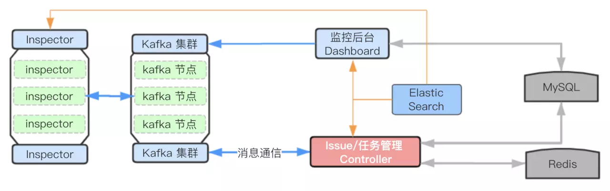

# 技术探索：60 天急速自研-前端埋点监控跟踪系统大浪子

> 决策源于数据，而数据源于采集，采集源于规则梳理，让这一切发生源于工程师的创造力和执行力，本文 5000 字，偏科普向，技术深度一般，阅读约 10 分钟，可以先 Mark 后看，本文最新版会在小册中进行维护 - 《[前端核心能力进阶指南](https://juejin.im/book/5cb56b7be51d456e3267e400?referrer=5790c76dc4c9710054f0f58b)》。

背景：小菜从 2014 年第一款 APP 上线，到如今将近 5 年，5 年风雨 5 年征程，虽然技术部有 80 人，前端有 20 人，我们依然对自己所研发的 8 款 APP、4 款小程序、6 款 H5 商城系统、10+ 个 PC CRM/IM/ERP/TMS 中台运营系统的用户使用情况、线上异常情况、设备分布情况、营销活动的 PV/UV 转化情况统统一无所知，**因为看不见就不清楚现场，这种做法显然很不互联网，也很不符合小菜前端 “工具为王效率至上” 的技术价值观**。

历史问题和痛点：

> 1. toB 产品的多端数据未搜集，toC 的产品亦然
>    - 如同一个业务的 RN APP/PC Web(React 单页/多页应用)/H5/小程序跨端产品
> 2. 数据埋点散落未做定义及归类
>    - 如阿里有位置跟踪 SPM、资源位跟踪 SCM、曝光和交互的黄金令牌，我们统统没有
> 3. 用户的线上访问异常(B 端用户，可用性稳定性是刚需)无从跟踪
>    - 如整个质量体系监控没有抓手，前端报错后端报错，全靠经验、人肉日志和用户主动反馈
> 4. 用户的访问行为/设备特征/应用性能信息完全无感知
>    - 如活跃时间点(避开做发布)，软硬件系统和设备比例(做兼容)，慢页面优化等无从做起
> 5. 业务数据的效果无从跟踪
>    - 如营销活动转化效果、支付链路的耗时等都很难服务业务决策

其实痛点还太多太多，为了不让自己变成瞎子，我们决定无论是借助社区方案，还是付费，还是自研，一定要做出一套前端产品埋点监控的工具产品出来，这几年，我们也做过一点尝试，总共走过了 3 段历程：

直到今年，我们最终选择社区开源方案 + 完全自研，也就是阶段三，几乎不再用任何付费产品，投入了 1 个前端全力攻坚，整个项目从立项到落地，差不多用了 60 人日（对，小菜前端就是这么硬核）。

另外，本文所介绍的整个监控系统属于小菜前端质量评估与跟踪体系中的一环，至于端质量体系策划了两篇，还没动笔写：

- 上篇 - 如何从 0 到 1 搭建前端质量跟踪平台(上)
- 下篇 - 如何从 0 到 1 搭建前端质量跟踪平台(下)

本文我们不做质量体系的探讨，只聚焦在监控跟踪实现。

## 监控系统肚子里有哪些东东

为了让大家更直观的感受到底我们做了什么，做了多少，也便于大家理解后面更技术性的一些选型判断，先放我们的数据流向图、产品功能图和系统架构图出来，形成第一观感及疑问。

数据从用户访问页面那一刻开始，到基于这些数据做出必要的决策结束，整个数据流进来一步步处理掉，可以分为 采集、转发、解密、持久化和处理这几个核心流程：

而整个监控跟踪，从采集到跟踪，从产品的视角，可以拆分出来如下几个功能模块：

从实现层面，数据一层层进来，每一层的任务都有对应系统接管处理，整个监控跟踪的技术架构图如下：

从核心系统/模块组成上，可以简单分如下几个：

- 采集 SDK 的设计与实现（PC/H5/小程序/RN/NodeJs）
- 数据转发器 DataTransfer 设计实现
- 监控后台 Dashboard 前后端设计实现
- 任务控制器 Controller 设计实现
- 任务执行器 Instpector 设计实现

限于篇幅，我们只针对每个系统的设计做介绍，不涉及技术细节，大家想要了解更详细的信息，或者要更详细的高清架构图，**可以加我微信索取： codingdream**。

图上用到了很多名词，大家可以搜索下做些越热，我先尝试用大白话简述下它们关系，然后我们就开始进入系统介绍，内部的关系是：

1. **数据流：数据从页面上搜集上来后，经由 Nginx 给到了一个数据转发服务器，它无脑的把一行行访问日志丢给 Kafka 这个消息转发中心，经由它交给专门处理日志的 ELK 套件，然后 ELK 这个套件提供了很多查询日志的能力，这些能力进一步按照规则被下沉到数据仓库，数据仓库再经由 SQL-Table-Charts 的报表生产和展现工具，通过报表平台给到产品业务同学使用。**
2. 数据管理：除此之外，面向开发者应该有一个监控管理后台，实时从 ES 查数据展现数据，以及基于异常数据做一些任务的生成，而这些业务逻辑都是管理后台，透过 Kafka 来通知到任务控制器完成的，任务控制器做一些更纯粹的任务管理，它把一些更细节的执行透过 Kafka 来通知到执行器干活，任务的回写之类的事情自己做掉。
3. 数据持久化：所有的日志都存在 ES 里面，所有的 issue 都存在 MySQL 里面，而对 issue 的跟踪管理则以任务栈的形式存在了 Redis 里面，同时所有的按照规则梳理的数据，都下沉到了数据仓库最后透出到报表平台。

## 客户端 SDK

数据源于采集，而采集源于需求梳理和规则梳理，也就是为了达到某某某的目的，而必须采集到端上什么样的数据，以 PC/H5 为例，希望采集的数据有如下几大类：

- 用户数据
  - 如匿名/非匿名的用户 ID、IP 等基本信息
- 设备信息
  - 如操作系统类型和版本
  - 如浏览器类型和版本
  - 如 App 版本号等
- 行为数据
  - 如用户访问来源
  - 如用户访问路径
  - 用户点击滑动区域等
- 性能数据
  - 如脚本加载时间、接口响应时间等
- 异常数据
  - 如前端脚本加载错误、脚本运行错误
  - 如后端 API 请求超时、返回数据异常、参数交互错误等
- 定制数据
  - 如活动页面特殊区块访问数据、表单提交数据、邀请来源等

对这些数据需求做整理，映射到浏览器宿主环境下，就需要实现如下一些功能：

- API 请求监控
- Log 面包屑
- 性能上报
- 自定义事件上报
- SPA/MPA 路由/页面切换记录数据上报
- Error 监控（onerror/onunhandledrejection）
- UI 事件上报（可手动开启，用于错误回溯以及页面热力图）

技术没什么难点，主要是对浏览器的特定事件( onerror 、onunhandledrejection、onpopstate 等)进行监听以及以 AOP 的方式进行包装一些全局对象的某些特定函数（如 XHR 的 `send` ），在不影响开发者的情况下采集必要的数据。

这个过程中我们应该注意的是，在对函数或对象进行 wrap 的时候，一定要避免重复包装，真正花时间的是兼容性的调试，特别是在移动端会遇到一些难点，比如 iOS 设备频繁发生的 `script error` 、指纹丢失、iOS 的 `sendBeacon`  上报到达率低一些问题。

因为要集中管理多个端的 SDK，我们在搭建这个 SDK 工程时，使用了 monorepo 的方式，TypeScript 实现代码，部分 SDK 使用 rollup + tsc 打包。

## 数据转发器 DataTransfer

#### 模块关系图

数据从客户端采集到后，按照一定的策略上报到服务器，先经由 Nginx 拿到 IP 等信息后，直接交由 Transfer，然后将数据发送给 Kafka，让 Kafka 把数据同步给 ELK。下图是 DataTransfer 在整个架构中与其他组件的关系:

#### 模块的作用

这里的数据转发器，就是一个 Node 服务，它扮演数据搬运工的角色，将数据转发给 Kafka 集群，同时它也做了一些额外的事情，比如数据的解密和验证，添加额外的必要字段等。

#### 模块实现方式

针对 Kafka 我们做了降级方案，当转发到 Kafka 失败的时候，就将数据写到本地的日志，然后用 Filebeat 发送给 Logstash，为什么做降级呢，因为我们自建的 ES 和 Kakfa 正在经历阿里云 VPS 从经典到私有网络的切换，过渡期的几个月不稳定，我们这里就用了两条腿，优先发送给 Kafka，当 Kafka 不稳定的时候，就由 Filebeat 接管，再推送给 Logstash，每一台 transfer 上都对应一个 Filebeat 备胎，属于是过渡性方案。

其实这里的 Nginx + Transfer 用 Openresty 会更合适，性能也不错，我们之所以没采用，是因为整套设施是前端自行搭建和维护的，用 Eggjs 搭建的 Transfer 服务，不想引入额外的语言栈加大后期的维护成本，就用了 Nginx + Node Transfer(Filebeat)。

至于工程的实现，我们依然使用了 TS，服务框架用的是 Eggjs，针对 Eggjs 写了一个 egg-kafka 插件用于 kafka 的消息收发，该插件也算是此次项目的收获之一。

## 监控后台 Dashboard 前后端

#### 模块关系图

数据如果没有介入到团队的决策，那就失去了搜集的价值，既然是决策，无非就是信息的聚合展示以及各种任务的增删改查，而这个角色就有监控后台 Dashboard 承担。

Dashboard 在整体架构中与其他模块的关系如图所示：

#### 为什么不用 Kibana

ELK 三大件中最好用的莫过于是 Kibana，为什么我们不用呢，其实我们也不是不用，而是给到部分小场景去灵活使用，之所以没有完全使用，是因为我们希望跟前端团队有更强的关联性，比如用户身份、issue 的推进、任务的跟踪、未来代码仓库分支的异常关联、质量报告的评估等等，这些业务属性太强，而 Kibana 显然不便于我们做很灵活的扩展，所以就没有以它作为 Dashboard。

#### Dashborad 的数据来源

Dashboard 的数据来源主要有两个，ES 和 阿里云的 RDS(MySQL)。

#### Elasticsearch 日志查询

ES 扮演的就是日志数据库的角色，他提供查询的能力，而 Dashboard 就是无脑的从 ES 获取实时数据，比如刚刚 15 分钟的异常数量，或者今天到目前为止某个应用的 PU/V ，访问的设备类型分布等等，如下图，某个应用大盘的数据:

或者该应用异常发生情况：

> 每一个特定的异常，我们可以点击详情查看相应的异常详情，跟踪到用户的 ID、设备及厂商、浏览器版本、页面、发生时间、IP、地理位置甚至角色身份等更细节的数据信息，再结合异常的回溯重放和 Sourcemap，便于我们第一时间跟进了解和修复。

甚至 API 请求出错的情况也能查看：

#### MySQL 持久化业务数据

> MySQL 中存储的数据是我们通过下节会讲到的 Controller 对存储在 ES 中的错误原始数据进行分类和抽象而得到 issue 信息、以及开发者为了监控某个特殊 issue 而制定的规则和相应的任务信息，

下图便是我们抽象出来的 issue ：

针对每个 issue ，无论是前端还是后端，到底哪些被跟进修复了，修复情况如何，都可以跟踪到：

同时，针对用户的某一次的一系列动作我们会有一个 session 的概念，上报数据时会生成一个 sessionId 然后透出到 issue 详情中，便于开发者在解决错误时查看用户具体操作了什么，然后能更好地解决问题：

> 目前这个页面还做得比较粗糙，毕竟没有专门设计师

issue 的大致生命周期如下，其中大多数状态变更的操作是开发者在 dashboard 上实现的：

前端和后端结合起来联动查看，可以更快速的解决问题，再配合上异常的识别和判定机制，可以更主动的把异常推到前端和后端的钉钉群里，甚至复发的问题会 @ 当事人，关于 issue 的判定我们放到后面再来讲：

#### 报警任务信息的生成

当开发者需要对某个 issue 特别 "关照" 时，可以针对该 issue 设置相应的报警规则，下文提到的 controller 会根据报警规则生成报警任务，下图就是一个简单的报警任务:

我们还能看到该任务的执行情况：

后台还有很多其他实用的功能，比如 issue 查看分配指派与分类、更新流水、报警任务查看编辑、错误信息回溯、各种质量周报的生成推送等，更多截图在文后。

#### DashBoard 的技术实现

技术实现上，后端我们使用的是基于 Eggjs 封装的 Cross 搭建的工程，集成了 Kafka 和钉钉等，其中 kafka 用于和其他模块交流；前端则使用了 AntDesign Pro(umijs/dva/bizcharts)，这次考虑到是功能多变且业务性强，就没有使用 TS。

## 控制器 Controller

#### 模块关系图

前面提到的 Dashboard 最大的作用是消费、修改以及管理 issue 数据，而从原始数据中抽象出 issue 数据给 dashboard 消费的则是 controller，当然，controller 的作用不止于此，我们会在下面展开来说，这里先贴出其在整个架构中的与其他模块的关系图，让大家对其在整个架构中的角色有一个大致的认识:

#### 控制器的作用

Controller 在整个架构中的作用至关重要，主要体现在以下几个方面:

- 线上 bug 发现，新 issue 的生成、分类和发送警告
- 某一个 bug 在某个时间段内发生次数过多(如 100次/1m )的警告
- 某一个已经标记为已解决的 issue 又再次发生，需要通知到相关 issue 的负责人
- bug 报告生成，这样就能让开发负责人们对端质量上有一个更量化认识

- 用户针对特殊 issue 设置的报警任务的分配，以及报警任务执行完成后的结果分析等，但是 controller 并不会执行任务，它只负责通过 Kafka 发送消息分配任务给下面将要提到的任务执行器 inspector(s) 们

#### 控制器的技术实现

任务控制器是一个纯后端项目，它依然通过 kafka 与其他模块进行交流，因为其功能比较明确所以我们采用 TypeScript 编写，后端框架依然是我们团队基于 Eggjs 自研的 Cross。而报警任务队列是通过 redis 实现的。

## 任务执行器 Instpector

#### 执行器的作用

作为任务控制器的小弟，任务执行器 Instpector 做的事情就很纯粹，就是解析从 controller 发送过来的任务，然后对原始进行查询最后返回结果，但是考虑到任务可能会比较多，我们在设计时是将其设计为多点的，利用 kafka 的消息单播的特点，尽可能让任务尽快地执行。

#### 执行器的实现

实现执行器也是用 TS 开发，框架为 Eggjs, 比较简单。

## 梭哈监控后的心得

这个系统的建设并不是一蹴而就的，我们在过去两年使用过不少社区现有的产品，也自研过不完善的方案，从中积累了不少经验，没有这些沉淀，我们也没办法做出现在的这个系统。

整个系统麻烦在于设计而不是实现，大家动手之前，可以先考虑清楚自己的应用场景，期望解决的问题是什么，也就是弄清楚 What 和 Why，之后再考虑是否投入人力进行设计和实现，毕竟整个系统建设下来，还是需要一定的技术实力和不少人力的。

截至目前，这个系统并非达到最理想的状态：

- 比如 Dashboard 和 Controller 中都会对 MySQL 和 ES 做相似的某些操作，其实是可以将其抽象成两个特定的服务
- 比如我们目前还没做到针对页面加载时间过长的报警
- 比如我们还没有做到将所有问题分类型的解决方案汇聚成 "bug 解决方式百科全书"，也就是异常 Wiki 化
- 比如我们还没有做到将平台的 issue 与我们的代码仓库绑定，然后解决 issue 实现自动化关闭等等，也就是异常与仓库代码分支的联动，自然也就做不到更有参考价值的工程师代码质量的评估

但即便如此，上线这 3 个月以来，我们能看到端产品上的行为数据和异常情况了，对产品体验的提升或者下降更有感知，对问题的跟踪修复也更有效率了，用户对于产品的负面反馈也在一天天的减少，我想，这也算是一个不错的开始吧。

再补两张 DashBoard 截图：

> Scott 近两年无论是面试还是线下线上的技术分享，遇到许许多多前端同学，由于团队原因，个人原因，职业成长，技术方向，甚至家庭等等原因，在理想国与现实之间，在放弃与坚守之间，摇摆不停，心酸硬扛，大家可以找我聊聊南聊聊北，对工程师的宿命有更多的了解，有更多的看见与听见，Scott 微信： codingdream