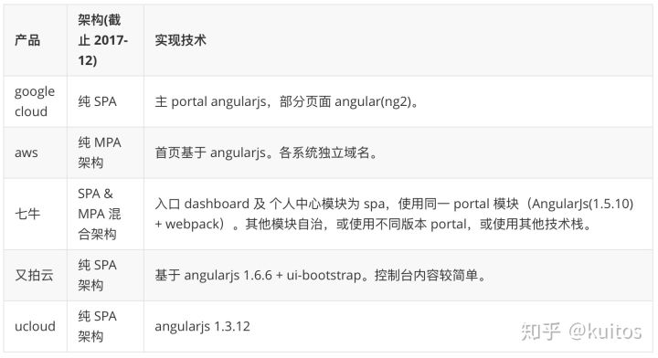
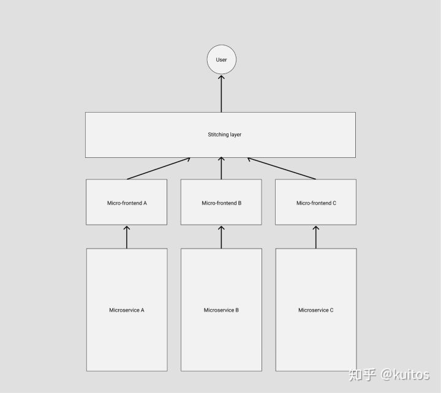
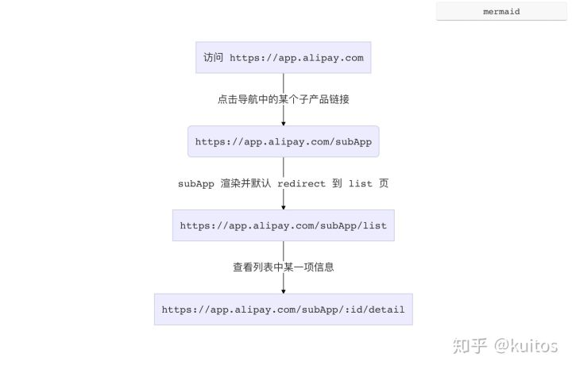
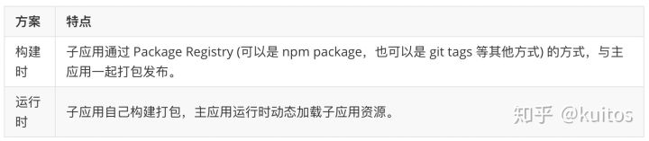
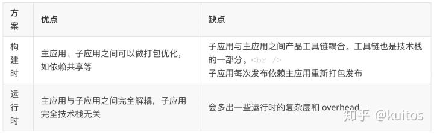
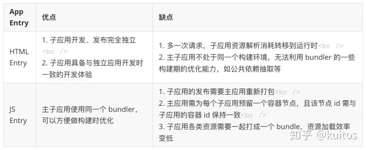
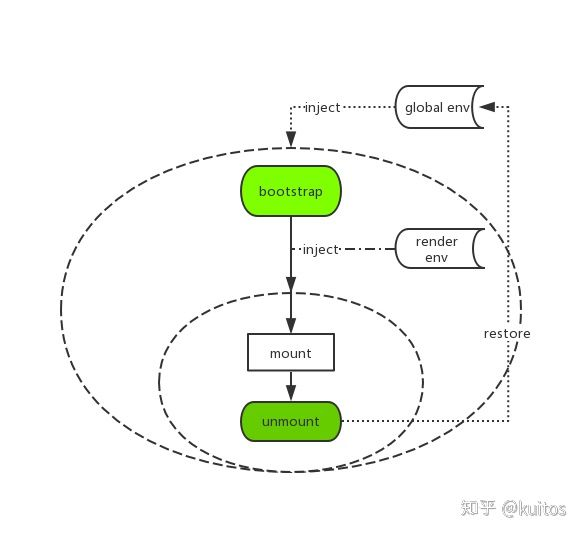
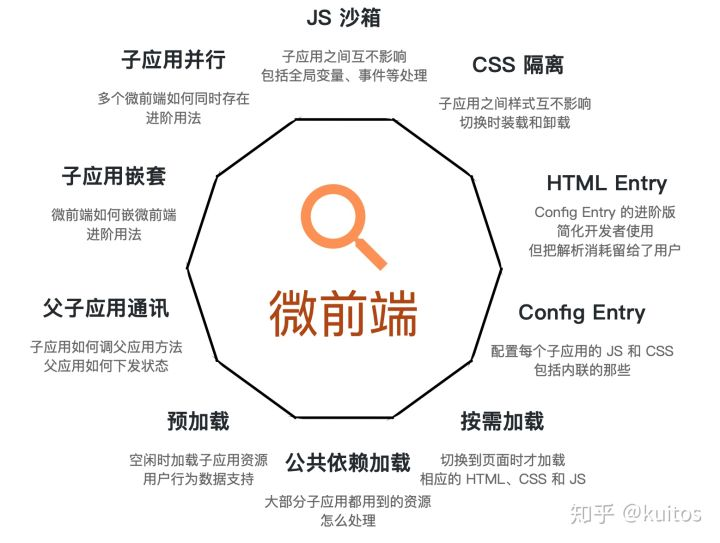

# 最完善的微前端解决方案

伪前端伪架构师 / mobxjs team member

> Techniques, strategies and recipes for building a **modern web app** with **multiple teams** using **different JavaScript frameworks**. — Micro Frontends

## 前言

*想跳过技术细节直接看怎么实践的同学可以拖到文章底部，直接看最后一节。*

目前社区有很多关于微前端架构的介绍，但大多停留在概念介绍的阶段。而本文会就某一个具体的类型场景，着重介绍微前端架构可以**带来什么价值**以及**具体实践过程中需要关注的技术决策**，并辅以具体代码，从而能真正意义上帮助你构建一个**生产可用**的微前端架构系统。

而对于微前端的概念感兴趣或不熟悉的同学，可以通过搜索引擎来获取更多信息，如 [知乎上的相关内容](https://www.zhihu.com/search?q=微前端&type=content)， 本文不再做过多介绍。

*两个月前 Twitter 曾爆发过关于微前端的“热烈”讨论，参与大佬众多(Dan、Larkin 等)，对“事件”本身我们今天不做过多评论(后面可能会写篇文章来回顾一下)，有兴趣的同学可以通过*[这篇文章](https://link.zhihu.com/?target=https%3A//zendev.com/2019/06/17/microfrontends-good-bad-ugly.html)*了解一二。*

## 微前端的价值

微前端架构具备以下几个核心价值：

- 技术栈无关 主框架不限制接入应用的技术栈，子应用具备完全自主权
- 独立开发、独立部署 子应用仓库独立，前后端可独立开发，部署完成后主框架自动完成同步更新
- 独立运行时 每个子应用之间状态隔离，运行时状态不共享

微前端架构旨在解决单体应用在一个相对长的时间跨度下，由于参与的人员、团队的增多、变迁，从一个普通应用演变成一个巨石应用([Frontend Monolith](https://link.zhihu.com/?target=https%3A//www.youtube.com/watch%3Fv%3DpU1gXA0rfwc))后，随之而来的应用不可维护的问题。这类问题在企业级 Web 应用中尤其常见。

## 针对中后台应用的解决方案

中后台应用由于其应用生命周期长(动辄 3+ 年)等特点，最后演变成一个巨石应用的概率往往高于其他类型的 web 应用。而从技术实现角度，微前端架构解决方案大概分为两类场景：

- 单实例：即同一时刻，只有一个子应用被展示，子应用具备一个完整的应用生命周期。通常基于 url 的变化来做子应用的切换。
- 多实例：同一时刻可展示多个子应用。通常使用 Web Components 方案来做子应用封装，子应用更像是一个业务组件而不是应用。

本文将着重介绍**单实例场景**下的微前端架构实践方案（基于 [single-spa](https://link.zhihu.com/?target=https%3A//github.com/CanopyTax/single-spa)），因为这个场景更贴近大部分中后台应用。

## 行业现状

传统的云控制台应用，几乎都会面临业务快速发展之后，单体应用进化成巨石应用的问题。为了解决产品研发之间各种耦合的问题，大部分企业也都会有自己的解决方案。笔者于17年底，针对国内外几个著名的云产品控制台，做过这样一个技术调研：



MPA 方案的优点在于 部署简单、各应用之间硬隔离，天生具备技术栈无关、独立开发、独立部署的特性。缺点则也很明显，应用之间切换会造成浏览器重刷，由于产品域名之间相互跳转，流程体验上会存在断点。

SPA 则天生具备体验上的优势，应用直接无刷新切换，能极大的保证多产品之间流程操作串联时的流程性。缺点则在于各应用技术栈之间是强耦合的。

那我们有没有可能将 MPA 和 SPA 两者的优势结合起来，构建出一个相对完善的微前端架构方案呢？

*jsconf china 2016 大会上，ucloud 的同学分享了他们的基于 angularjs 的方案（*[单页应用“联邦制”实践](https://link.zhihu.com/?target=https%3A//www.youtube.com/watch%3Fv%3DyL_znMNwTNw)*），里面提到的 "联邦制" 概念很贴切，可以认为是早期的基于耦合技术栈的微前端架构实践。*

## 微前端架构实践中的问题

可以发现，微前端架构的优势，正是 MPA 与 SPA 架构优势的合集。即保证应用具备独立开发权的同时，又有将它们整合到一起保证产品完整的流程体验的能力。

这样一套模式下，应用的架构就会变成：




Stitching layer 作为主框架的核心成员，充当调度者的角色，由它来决定在不同的条件下激活不同的子应用。因此主框架的定位则仅仅是：**导航路由 + 资源加载框架**。

而具体要实现这样一套架构，我们需要解决以下几个技术问题：

### 路由系统及 Future State

我们在一个实现了微前端内核的产品中，正常访问一个子应用的页面时，可能会有这样一个链路：



此时浏览器的地址可能是 `https://app.alipay.com/subApp/123/detail`，想象一下，此时我们手动刷新一下浏览器，会发生什么情况？

由于我们的子应用都是 lazy load 的，当浏览器重新刷新时，主框架的资源会被重新加载，同时异步 load 子应用的静态资源，由于此时主应用的路由系统已经激活，但子应用的资源可能还没有完全加载完毕，从而导致路由注册表里发现没有能匹配子应用 `/subApp/123/detail` 的规则，这时候就会导致跳 NotFound 页或者直接路由报错。

这个问题在所有 lazy load 方式加载子应用的方案中都会碰到，早些年前 angularjs 社区把这个问题统一称之为 [Future State](https://link.zhihu.com/?target=https%3A//ui-router.github.io/guide/lazyloading%23future-states)。

解决的思路也很简单，我们需要设计这样一套路由机制：

主框架配置子应用的路由为 `subApp: { url: '/subApp/**', entry: './subApp.js' }`，则当浏览器的地址为 `/subApp/abc` 时，框架需要先加载 entry 资源，待 entry 资源加载完毕，确保子应用的路由系统注册进主框架之后后，再去由子应用的路由系统接管 url change 事件。同时在子应用路由切出时，主框架需要触发相应的 destroy 事件，子应用在监听到该事件时，调用自己的卸载方法卸载应用，如 React 场景下 `destroy = () => ReactDOM.unmountAtNode(container)`。

要实现这样一套机制，我们可以自己去劫持 url change 事件从而实现自己的路由系统，也可以基于社区已有的 ui router library，尤其是 react-router 在 v4 之后实现了 [Dynamic Routing](https://link.zhihu.com/?target=https%3A//reacttraining.com/react-router/core/guides/philosophy) 能力，我们只需要复写一部分路由发现的逻辑即可。这里我们推荐直接选择社区比较完善的相关实践 [single-spa](https://link.zhihu.com/?target=https%3A//github.com/CanopyTax/single-spa)。

### App Entry

解决了路由问题后，主框架与子应用集成的方式，也会成为一个需要重点关注的技术决策。

### 构建时组合 VS 运行时组合

微前端架构模式下，子应用打包的方式，基本分为两种：



两者的优缺点也很明显：



很显然，要实现真正的技术栈无关跟独立部署两个核心目标，大部分场景下我们需要使用运行时加载子应用这种方案。

### JS Entry vs HTML Entry

在确定了运行时载入的方案后，另一个需要决策的点是，我们需要子应用提供什么形式的资源作为渲染入口？

JS Entry 的方式通常是子应用将资源打成一个 entry script，比如 single-spa 的 [example](https://link.zhihu.com/?target=https%3A//github.com/joeldenning/simple-single-spa-webpack-example/blob/master/src/root-application/root-application.js) 中的方式。但这个方案的限制也颇多，如要求子应用的所有资源打包到一个 js bundle 里，包括 css、图片等资源。除了打出来的包可能体积庞大之外的问题之外，资源的并行加载等特性也无法利用上。

HTML Entry 则更加灵活，直接将子应用打出来 HTML 作为入口，主框架可以通过 fetch html 的方式获取子应用的静态资源，同时将 HTML document 作为子节点塞到主框架的容器中。这样不仅可以极大的减少主应用的接入成本，子应用的开发方式及打包方式基本上也不需要调整，而且可以天然的解决子应用之间样式隔离的问题(后面提到)。想象一下这样一个场景：

```html
<!-- 子应用 index.html -->
<script src="//unpkg/antd.min.js"></script>
<body>
  <main id="root"></main>
</body>
// 子应用入口
ReactDOM.render(<App/>, document.getElementById('root'))
```

如果是 JS Entry 方案，主框架需要在子应用加载之前构建好相应的容器节点(比如这里的 "#root" 节点)，不然子应用加载时会因为找不到 container 报错。但问题在于，主应用并不能保证子应用使用的容器节点为某一特定标记元素。而 HTML Entry 的方案则天然能解决这一问题，保留子应用完整的环境上下文，从而确保子应用有良好的开发体验。

HTML Entry 方案下，主框架注册子应用的方式则变成：

```js
framework.registerApp('subApp1', { entry: '//abc.alipay.com/index.html'})
```

本质上这里 HTML 充当的是应用静态资源表的角色，在某些场景下，我们也可以将 HTML Entry 的方案优化成 Config Entry，从而减少一次请求，如：

```js
framework.registerApp('subApp1', { html: '', scripts: ['//abc.alipay.com/index.js'], css: ['//abc.alipay.com/index.css']})
```

总结一下：



### 模块导入

微前端架构下，我们需要获取到子应用暴露出的一些钩子引用，如 bootstrap、mount、unmout 等(参考 single-spa)，从而能对接入应用有一个完整的生命周期控制。而由于子应用通常又有集成部署、独立部署两种模式同时支持的需求，使得我们只能选择 umd 这种兼容性的模块格式打包我们的子应用。如何在浏览器运行时获取远程脚本中导出的模块引用也是一个需要解决的问题。

通常我们第一反应的解法，也是最简单的解法就是与子应用与主框架之间约定好一个全局变量，把导出的钩子引用挂载到这个全局变量上，然后主应用从这里面取生命周期函数。

这个方案很好用，但是最大的问题是，主应用与子应用之间存在一种强约定的打包协议。那我们是否能找出一种松耦合的解决方案呢？

很简单，我们只需要走 umd 包格式中的 global export 方式获取子应用的导出即可，大体的思路是通过给 window 变量打标记，记住每次最后添加的全局变量，这个变量一般就是应用 export 后挂载到 global 上的变量。实现方式可以参考 [systemjs global import](https://link.zhihu.com/?target=https%3A//github.com/systemjs/systemjs/blob/master/src/extras/global.js)，这里不再赘述。

### 应用隔离

微前端架构方案中有两个非常关键的问题，有没有解决这两个问题将直接标志你的方案是否真的生产可用。比较遗憾的是此前社区在这个问题上的处理都会不约而同选择”绕道“的方式，比如通过主子应用之间的一些默认约定去规避冲突。而今天我们会尝试从纯技术角度，更智能的解决应用之间可能冲突的问题。

### 样式隔离

由于微前端场景下，不同技术栈的子应用会被集成到同一个运行时中，所以我们必须在框架层确保各个子应用之间不会出现样式互相干扰的问题。

### Shadow DOM？

针对 "Isolated Styles" 这个问题，如果不考虑浏览器兼容性，通常第一个浮现到我们脑海里的方案会是 Web Components。基于 Web Components 的 Shadow DOM 能力，我们可以将每个子应用包裹到一个 Shadow DOM 中，保证其运行时的样式的绝对隔离。

但 Shadow DOM 方案在工程实践中会碰到一个常见问题，比如我们这样去构建了一个在 Shadow DOM 里渲染的子应用：

```js
const shadow = document.querySelector('#hostElement').attachShadow({mode: 'open'});
shadow.innerHTML = '<sub-app>Here is some new text</sub-app><link rel="stylesheet" href="//unpkg.com/antd/antd.min.css">';
```

由于子应用的样式作用域仅在 shadow 元素下，那么一旦子应用中出现运行时越界跑到外面构建 DOM 的场景，必定会导致构建出来的 DOM 无法应用子应用的样式的情况。

比如 sub-app 里调用了 antd modal 组件，由于 modal 是动态挂载到 document.body 的，而由于 Shadow DOM 的特性 antd 的样式只会在 shadow 这个作用域下生效，结果就是弹出框无法应用到 antd 的样式。解决的办法是把 antd 样式上浮一层，丢到主文档里，但这么做意味着子应用的样式直接泄露到主文档了。gg...

### CSS Module? BEM?

社区通常的实践是通过约定 css 前缀的方式来避免样式冲突，即各个子应用使用特定的前缀来命名 class，或者直接基于 css module 方案写样式。对于一个全新的项目，这样当然是可行，但是通常微前端架构更多的目标是解决存量/遗产 应用的接入问题。很显然遗产应用通常是很难有动力做大幅改造的。

最主要的是，约定的方式有一个无法解决的问题，假如子应用中使用了三方的组件库，三方库在写入了大量的全局样式的同时又不支持定制化前缀？比如 a 应用引入了 antd 2.x，而 b 应用引入了 antd 3.x，两个版本的 antd 都写入了全局的 `.menu class`，但又彼此不兼容怎么办？

### Dynamic Stylesheet !

解决方案其实很简单，我们只需要在应用切出/卸载后，同时卸载掉其样式表即可，原理是浏览器会对所有的样式表的插入、移除做整个 CSSOM 的重构，从而达到 插入、卸载 样式的目的。这样即能保证，在一个时间点里，只有一个应用的样式表是生效的。

上文提到的 HTML Entry 方案则天生具备样式隔离的特性，因为应用卸载后会直接移除去 HTML 结构，从而自动移除了其样式表。

比如 HTML Entry 模式下，子应用加载完成的后的 DOM 结构可能长这样：

```html
<html>
  <body>
    <main id="subApp">
      // 子应用完整的 html 结构
      <link rel="stylesheet" href="//alipay.com/subapp.css">
      <div id="root">....</div>
    </main>
  </body>
</html>
```

当子应用被替换或卸载时，`subApp` 节点的 innerHTML 也会被复写，`//alipay.com/subapp.css` 也就自然被移除样式也随之卸载了。

### JS 隔离

解决了样式隔离的问题后，有一个更关键的问题我们还没有解决：如何确保各个子应用之间的全局变量不会互相干扰，从而保证每个子应用之间的软隔离？

这个问题比样式隔离的问题更棘手，社区的普遍玩法是给一些全局副作用加各种前缀从而避免冲突。但其实我们都明白，这种通过团队间的”口头“约定的方式往往低效且易碎，所有依赖人为约束的方案都很难避免由于人的疏忽导致的线上 bug。那么我们是否有可能打造出一个好用的且完全无约束的 JS 隔离方案呢？

针对 JS 隔离的问题，我们独创了一个运行时的 JS 沙箱。简单画了个架构图：



即在应用的 bootstrap 及 mount 两个生命周期开始之前分别给全局状态打下快照，然后当应用切出/卸载时，将状态回滚至 bootstrap 开始之前的阶段，确保应用对全局状态的污染全部清零。而当应用二次进入时则再恢复至 mount 前的状态的，从而确保应用在 remount 时拥有跟第一次 mount 时一致的全局上下文。

当然沙箱里做的事情还远不止这些，其他的还包括一些对全局事件监听的劫持等，以确保应用在切出之后，对全局事件的监听能得到完整的卸载，同时也会在 remount 时重新监听这些全局事件，从而模拟出与应用独立运行时一致的沙箱环境。

## 蚂蚁的微前端落地实践

自去年年底伊始，我们便尝试基于微前端架构模式，构建出一套全链路的面向中后台场景的产品接入平台，目的是解决不同产品之间集成困难、流程割裂的问题，希望接入平台后的应用，不论使用哪种技术栈，在运行时都可以通过自定义配置，实现不同应用之间页面级别的自由组合，从而生成一个千人千面的个性化控制台。

目前这套平台已在蚂蚁生产环境运行半年多，同时接入了多个产品线的 40+ 应用、4+ 不同类型的技术栈。过程中针对大量微前端实践中的问题，我们总结出了一套完整的解决方案：



在内部得到充分的技术验证和线上考验之后，我们决定将这套解决方案开源出来！

### qiankun - 一套完整的微前端解决方案

**https://github.com/umijs/qiankun**

取名 qiankun，意为统一。我们希望通过 qiankun 这种技术手段，让你能很方便的将一个巨石应用改造成一个基于微前端架构的系统，并且不再需要去关注各种过程中的技术细节，做到真正的开箱即用和生产可用。

对于 umi 用户我们也提供了配套的 qiankun 插件 [@umijs/plugin-qiankun](https://link.zhihu.com/?target=https%3A//github.com/umijs/umi-plugin-qiankun/) ，以便于 umi 应用能几乎零成本的接入 qiankun。

最后欢迎大家点赞使用提出宝贵的意见。