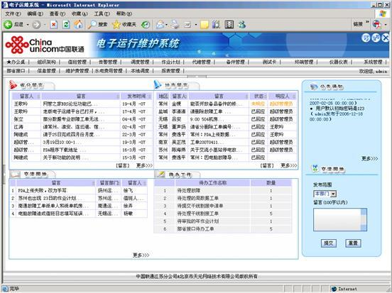
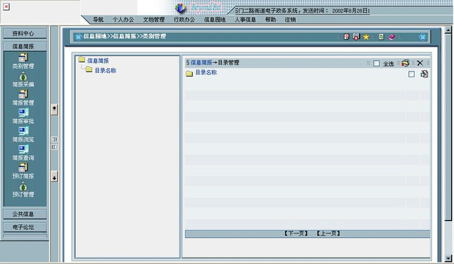
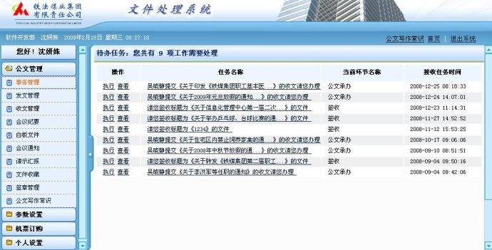
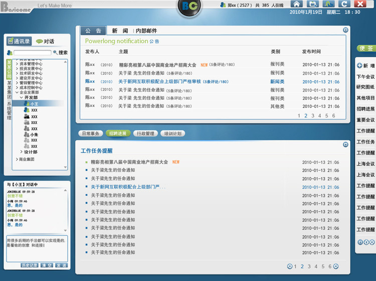
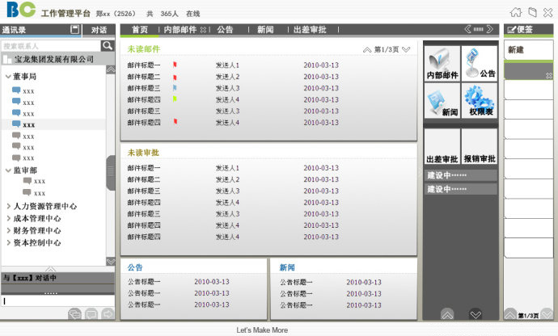
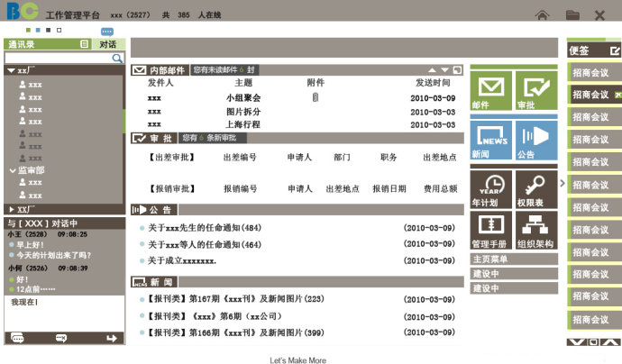
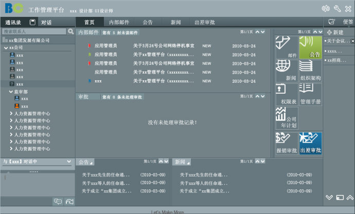

# 浅谈UI设计之"企业工作管理系统"

近几年来UI设计已经不再陌生，它无处不在的存在人们的生活中，远点有银行的ATM机，地铁的自动售票机，小区物业的自动交费机，贴身的就有智能手机，电脑里的Word及Excel文档等等，它们的用户界面及操作平台都是UI设计师通过对软件的人机交互、操作逻辑、界面美观做出的最合理判断而设计出来的，不仅是让界面变得有个性有品味，还要让用户的操作使用变得舒适、简单、自由。

 

在这里通过近年来对“企业工作管理系统”的充分接触与深刻理解，总结一下个人在UI设计方面的一些心得和领悟，也希望对刚刚踏入该行业的新人们有所启发与帮助，如有与各位思想冲突的地方望谅解，仅代表个人的思想与设计风格。

 

一个好的工作管理系统软件，除了要拥有突出的编码设计，更需要拥有美观的、人性化的用户操作界面。UI设计除了要从用户与界面2个方面考虑外，更多的是要专注于研究用户与界面之间的交互关系，当然再怎么炫酷或者平凡的工作界面，都不能忘记站在功能角度考虑：美观的背后占据了多么庞大的数据读取时间……在使用者看来，工作管理系统的效率位居第一，其次是操作方便，最后才是美观。也正因为此，UI设计在软件开发过程中一直没有被重视起来，如果工作管理系统相当于一辆高档跑车，系统的程序相当于跑车的发动机，那么界面就相当于跑车的外观，两者在市场上占据同等重要的位置。一个好的界面是将效率、操作方便及美观合为一体，在给人带来舒适的视觉享受的同时，也带来简单方便的操作功能及流畅高效的工作环境，企业工作管理系统的界面风格也迎来了定制时代，符合企业文化，吸纳时下潮流，之前的美工也被美其名曰UI设计师。

 

以下图1至图3是比较传统的企业工作管理系统的界面风格,横平竖直,一般的编程工程师就可以实现的界面美化效果,保证了可用性原则。

​                             图1

 

​                                           图2

 

​                                         图3

基本上类似以上3种的界面风格可以适用于所有的企业,即使每个企业的需求不同及特殊性,也只是在功能上作了加减法，界面设计还是一成不变。由于企业品牌化的不断提升，后期应运而生的“界面定制时代”来临，企业可以根据需求更改界面风格，简单说就是替换image文件夹里的每个图形及图标,满足界面的颜色及图标得到更新，以适应不同的企业需求。

 

​                                             图4

图4是根据企业需求设计的工作管理系统界面，UI设计师们提出的自定义功能在和编成工程师一轮又一轮的唇枪舌战下不得不妥协，毕竟这个看起来像QQ空间的方案不适用于企业工作管理平台，企业的高层远远踏不进80后的门槛，试想他有时间有兴趣自定义他经常操作的相关功能吗？它出现的最大问题就是结构：工作管理系统的桌面无法将公告、新闻、内部邮件一次性展现给用户，增加了用户点击菜单的频率，最终夭折告终。

 

​                                         图5

相比较图4而言，图5框架布局的设计更加全面性，是最可取之处，桌面尽可能的展示必须的功能，精简繁琐的点击次数，增强了一步直达目的地，大大提高了工作效率。但在色彩上过于浓重，长时间工作会视觉疲劳；灰色渐变背景的使用，即使是1px的拼贴，也很大程度上增加了数据读取时间，企业成千上百的用户，再加上多种分辨率，直接影响了使用效率，还是会被Fail掉。

 企业工作管理系统界面的最大需求就是：框架内容一目了然，用户明确自己要去的地方；长时间使用下不会感觉视觉疲劳；操作时速度一定要快。能做到以上几点基本上可以算是一个成功的界面，再深入下去就是如何美化界面，一定要掌握以下几点：

 **1.明确企业的功能需求**

在UI设计开始前深刻了解软件要实现的所有功能及细节，所有可能会出现的界面。整合需求及界面，为你后期的工作量可以减轻不少的负担，比如通讯录及邮件里用户的选择都可以使同一风格或者界面，极大程度上减少的设计时间。

 **2.目标用户的习惯交互方式**

只有掌握的目标用户的习惯交互方式，那么你的框架设计将实现一半，除非你新的设计更合理，千万别轻易改变目标用户的习性，否则你会死得很惨。比如企业之前的通讯录位置在界面的左侧，方便随时搜索查询要联系的同事的电话信息，如果你把位置移到右侧、顶部或者底部，不合逻辑的同时也强加于难度和不认知度各用户，合理情况下，左侧是重要信息及常用功能区，右侧是工作区，几千年来的从左到右，从上到下定律也不要忽视了。

 **3.指示和引导用户**

用户可以在无任何培训下可以自如的运用工作管理系统，就说明这个系统界面的指示和引导作用是成功的。在这里图标起到了最大的作用，不管是图标、按钮、还是文字都是有特别讲究的。

 拿图标来说，一个图标除了指示和引导用户外的功能外，充其量就只是为了美化界面，它的统一性至关紧要。比如向左的图标图形是色块面的形式，向右就不能是线的形式；可点击是蓝色，不能点击为灰色，删除是红色；尺寸配比也都要一致，装饰性图标小，可操作性图标大一些；能快速、合理、明确的给用户传达初定的想法，以便用户很快认识到红色是删除，不能随意点击，灰色是不可点击，不用闹出把管理员叫来说“这个按钮怎么点不到下一页”的笑话，当然所以的用户都是聪明的精英不至于出此洋相。所以在图标能够足以表达出它想要展示的信息时，再加以文字的描述用户就更加明确要点击什么，再满足设计需求只想用图标来展示内容时，千万别忘了和jss技术人员说一声，你要鼠标经过该图标时出现小标签注解的功能，那么就大功告成了。

 **4.一致性原则**

风格、色调、图标、按钮、文字以及每一条线都必须做到统一。如下图6和图7在一致性原则上就有着明显的对比。

 

​                                         图6

 

​                                        图7

 1）风格：平面的、立体的，还是中规中矩的横平竖直，是大色块分割区域，点、线来丰富画面，还是光影水晶效果，在一开始设计之前就已经明确客户的需求及界面的主方向，当然不忘后期的技术难度以及数据的读取量。

 2）色彩：界面最多不要超过4种颜色，一般配比为80%主色调为背景色或者界面风格色调，15%副色调用来主导界面风格或者辅助界面风格色彩，也可以是中性色黑、白、灰，视设计风格而定；4%界面装饰色或者功能需求色；1%跳色用来做提醒功能或者点缀界面功能，这些再着手设计每个界面之前一定要明确。

3）图标：保持风格的一致，第3项“指示和引导用户里”已经做了说明，在这就不再以解释。

 4）文字：字体、大小以及颜色也是需要注重的部分。

字体要特别注意，在用PS或者其他软件设计界面时，一般用宋体，当与web的字体比较时，你会发现web的宋体更加犀利，因为都是像素字体，而且web里的宋体已经不再是PS里的宋体，所以在PS里设计时，字体一定要用黑体，这样和Web里通用的总体外形才得以相似，也不至于让客户看了设计稿和web上线后的效果落差太大。

 一般正文用12px大小字体，这是标准尺寸也是看起来比较舒服的大小，那么标签、菜单、导航等字体大小是根据设计需求而定，在企业工作平台一般均为12px，最大也不至于超过14px，当然有些老爷们喜欢大，那就给他16px，再大可以用你的专业镇压他无知。 

 文字颜色也是可以起到画龙点睛的作用，可以根据状态功能把文字用不同颜色来区分，比如用黑色表示确认、审核中用蓝色、已超时用红色提醒等，就不需要花大把时间在图标、图形上作文章，吃力不讨好还占用系统资源。文字颜色还可以用来区分菜单的级别、区分标题和内容，比如标题用蓝色，正文用黑色等。

 **5.可用性原则**

在满足美观之前一定要保证工作平台的可用性原则，否则再华丽的外衣也只是皇帝的新装，一无是处。

 最后补充，界面的尺寸和分布是必须首要考虑的问题。特别鄙视那些不负责任的说法：设计时只是觉着好看，就没有想得那么细，尺寸啊、对齐啊、间距啊之类再考虑……这句话就像建筑商说没想要盖14楼，我的地基是按照6楼的标准打的，实在可恶！！工作管理系统的Web界面也一样，前期的尺寸、布局不精确，要怎么继续往下施工呢？

 **界面的尺寸**

目前多以1280x1024的分辨率，据前几年的数据调查80%以上用户的分辨率为1024x768，近几年逐渐向更大的分辨率迈进，所以在考虑分辨率上一定要全面、详尽。有点题外话，和开放的Web页面比，企业工作管理平台在这一点上是十分好控制的，一个屏幕的宽度一定要减去下拉条占用的17px；高度一定要减去浏览器工具栏占用的高度，一般1024的剩857px的高度，768的剩628的高度，保险起见高度尽可能控制再少一点，当然我这只是基于工作管理系统不需要出现下拉条的情况下而拟定的，如图5。宽度是可以很好解决的，以100%满足不同屏幕宽度即可，但高度只能根据需求及合理性而定，如果你就是要把工作管理系统的页面设计到2-3屏高的内容，也不是不可以的，只要合理，如图4就会出现小部分下拉条。 

 **界面的分布**

工作管理系统的界面还涉及了内容的分布，哪些是要一直显示在界面的，哪些是肯以隐藏需要时打开的，哪些界面是需要展开或者新开窗口全频显示的，都是需要确定的。比如公告新闻置于左侧一直显示，还是应该分布于中区桌面页展示，点击进去后就隐藏呢？这些是否确定还是会有所变更会直接影响你的设计进度。

 这个话题还有很多需要研究探讨，也不是我这区区一两千文字能够说完的，希望有兴趣的同僚一起研究探讨。

