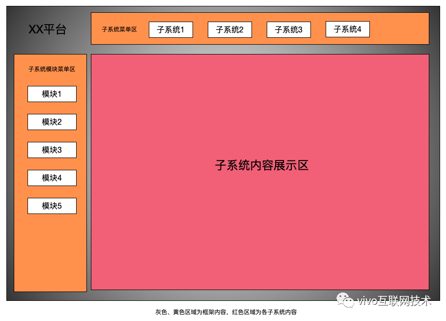
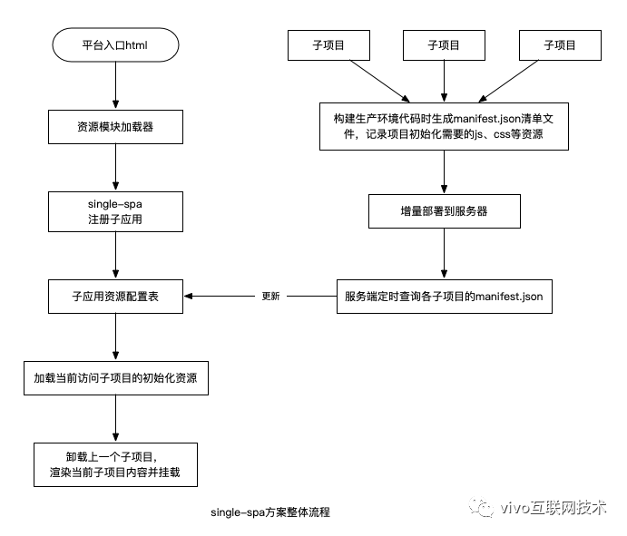
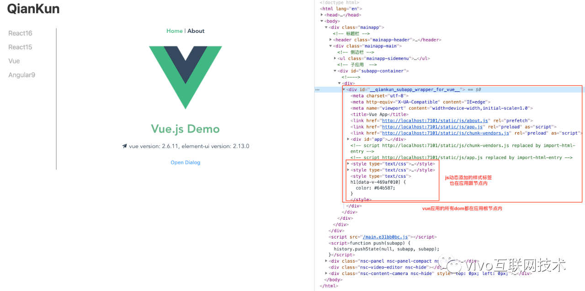

# [聊聊微前端的原理和实践](https://my.oschina.net/vivotech/blog/4437855)

> 本文首发于 vivo互联网技术 微信公众号 
> 链接：[https://mp.weixin.qq.com/s/2qH9qMNpU_LuLEBTsDUKzA](https://www.oschina.net/action/GoToLink?url=https%3A%2F%2Fmp.weixin.qq.com%2Fs%2F2qH9qMNpU_LuLEBTsDUKzA)
> 作者：Tan Xin

本文对微前端的概念和场景进行科普，介绍一些主流的微前端的实现库及其用法，并讲解部分这些库的原理和实践知识。

# 一、微前端

在项目迭代中，随着业务的发展壮大，项目的功能模块通常也会越来越多。可能原来所有的代码模块都在一个仓库里，由一个团队负责。但随着功能模块越来越多，一个团队可能负责不过来，需要多个团队来专门维护不同的模块。相应的代码也会被拆到多个仓库里，并且各模块能独立开发、部署更新。通常虽然项目被拆成了多个模块，但为了维持整体统一性以及用户体验，各模块依然都会挂在统一的入口下。



上面所述场景就是典型的微前端场景，类似于后端的微服务架构，它将web应用由单一的单体应用转变为多个小型前端应用聚合为一的应用。

通常，要实现上面类似的需求，我们很容易会想到使用iframe的方式来实现。在入口框架中用iframe来显示子模块的页面，切换子模块时，iframe也跟着切换成对应子模块页面的url。

虽然iframe是比较容易实现的，但通常也会有一些问题：

1. 显示区域受限制，比如子项目中显示弹窗蒙层时，蒙层只会覆盖iframe区域，无法覆盖整个页面，内容也无法真正居中。
2. 页面浏览记录无法自动被记录，刷新页面后iframe又自动回到首页。
3. 全局上下文完全隔离，变量不共享，页面间通信比较麻烦，比如子项目与主题框架、子项目之间通信等，只能采用postMessage方式。
4. 速度较慢，每次进入子应用时都要重建整个上下文。

上面所列问题，有些可以解决，有些甚至都没法或者很难解决。总的来说，iframe是一个比较快捷的方案，但不是最好的方案，会对体验有很多限制。如果强行打各种patch，复杂度又上来了，最后可能得不偿失。


# 二、single-spa

刚才我们讲了iframe实现微前端的一些弊端，主要原因就是这些应用还是在各自独立的页面内，这就导致了一些天然的限制。而single-spa微前端方案结合了MPA和SPA的优势，可以在单个页面内集成多个应用，并且是技术栈无关的。



 

如上图就是采用single-spa实现微前端的整体流程：

> **资源模块加载器：**用来加载子项目初始化资源。我们将子项目的入口js构建成umd格式，然后使用模块加载器远程加载，通常会使用SystemJs（不是必须）通用模块加载器来进行加载。
>
> **子应用资源配置表：**用来记录各个子应用的入口资源url信息，以便在切换不同子应用时使用模块加载器去远程加载。因为每次子应用更新后入口资源的hash通常会变化，所以需要服务端定时去更新该配置表，以便框架能及时加载子应用最新的资源。
>
> **注意：**single-spa本身是不支持子应用资源列表的，每个子应用只能将自己所有初始化资源打包到一个入口js中。如果子应用初始化资源有多个文件（可以通过webpack-manifest-plugin生成应用初始化资源清单），就需要按照上述方式来添加额外处理。


## **1、框架入口**

```
<!DOCTYPE html>
<html>
  
<head>
  <!-- 在systemjs中注册模块 -->
  <script type="systemjs-importmap">
    {
      "imports": {
        "app1": "http://localhost:8081/js/app.js",
        "app2": "http://localhost:8082/js/app.js",
        "single-spa": "https://cdnjs.cloudflare.com/ajax/libs/single-spa/4.3.7/system/single-spa.min.js",
        "vue": "https://cdn.jsdelivr.net/npm/vue@2.6.10/dist/vue.js",
        "vue-router": "https://cdn.jsdelivr.net/npm/vue-router@3.0.7/dist/vue-router.min.js",
        "vuex": "https://cdnjs.cloudflare.com/ajax/libs/vuex/3.1.2/vuex.min.js"
      }
    }
</script>
</head>
  
<body>
  <div></div>
  <!-- 加载systemjs -->
  <script src="https://cdnjs.cloudflare.com/ajax/libs/systemjs/6.1.1/system.min.js"></script>
  <script src="https://cdnjs.cloudflare.com/ajax/libs/systemjs/6.1.1/extras/amd.min.js"></script>
  <script src="https://cdnjs.cloudflare.com/ajax/libs/systemjs/6.1.1/extras/named-exports.js"></script>
  <script src="https://cdnjs.cloudflare.com/ajax/libs/systemjs/6.1.1/extras/named-register.min.js"></script>
  <script src="https://cdnjs.cloudflare.com/ajax/libs/systemjs/6.1.1/extras/use-default.min.js"></script>
  <script>
    (function () {
      // 加载公共js库
      Promise.all([System.import('single-spa'), System.import('vue'), System.import('vue-router'), System.import('vuex')]).then(function (modules) {
        var singleSpa = modules[0];
        var Vue = modules[1];
        var VueRouter = modules[2];
        var Vuex = modules[3];
  
        Vue.use(VueRouter)
        Vue.use(Vuex)
  
        // single-spa注册子应用
        singleSpa.registerApplication(
          'app1',
          () => System.import('app1'),
          location => location.pathname.startsWith('/app1')
        )
  
        singleSpa.registerApplication(
          'app2',
          () => System.import('app2'),
          location => location.pathname.startsWith('/app2')
        )
  
        // 启动
        singleSpa.start();
      })
    })()
</script>
</body>
  
</html>
```

为了简单展示，上述只是框架入口html的一个简单demo，并没有解析子应用资源配置表来加载相应资源。在入口中我们注册了子应用，并确定了子应用的激活时机。

> 子应用资源配置表是完全自定义的，只要入口加载器这边按照约定的规范来解析加载资源，并按照single-spa的生命周期钩子来处理好这些资源的挂载。
>
> 我们还可以将一些公共的资源库资源库（如上vue、vue-router等）抽取到入口中，这样各个子应用不需要再包含这些库文件了，可以减小资源文件大小，提升加载速度。子应用中构建时要外置这些库，比如用webpack构建时如下：

```
externals: ['vue', 'vue-router', 'vuex']
```


## **2、子应用入口**

```
import './set-public-path'
import Vue from 'vue'
import App from './App.vue'
import router from './router'
import singleSpaVue from 'single-spa-vue'
  
Vue.config.productionTip = false
  
if (process.env.NODE_ENV === 'development') {
  // 开发环境直接渲染
  new Vue({
    router,
    render: h => h(App)
  }).$mount('#app')
}
  
const vueLifecycles = singleSpaVue({
  Vue,
  appOptions: {
    render: (h) => h(App),
    router
  }
})
  
export const bootstrap = vueLifecycles.bootstrap
export const mount = vueLifecycles.mount
export const unmount = vueLifecycles.unmount
```

如上我们的子应用是vue开发的，需要用single-spa-vue来包装下，然后导出生命周期的钩子函数。为了方便开发，我们可以判断下运行环境，如果是开发环境的话，就直接渲染到页面上。

set-public-path.js

细心的同学就会注意到，子应用代码中运行了set-public-path.js。那么这个文件是干嘛用的呢？先来看下：

```
import { setPublicPath } from 'systemjs-webpack-interop'
setPublicPath('app1', 2)
```

从名字也能看出，systemjs-webpack-interop是针对在systemjs中使用webpack构建的bundle的场景的。众所周知，webpack构建代码时，可以通过output.publicPath选项指定要加载资源的url前缀，这在传统的spa中不会有问题，但在single-spa的页面中可能会有问题。比如output.publicPath: '/xx'的情况，webpack会认为异步资源加载的url域名为当前页面的域名，这在传统spa中不会有问题，但在single-spa的场景下异步资源就会加载失败，因为子应用的异步资源与框架页面的url域名并不是一样的。所以需要各个子应用自行在入口中执行上述代码，这会设置子应用的异步资源url前缀与子应用的入口js一致，这样加载的路径就不会错误了。

setPublicPath代码如下：

```
export function setPublicPath(systemjsModuleName, rootDirectoryLevel) {
  if (!rootDirectoryLevel) {
    rootDirectoryLevel = 1;
  }
 
 
  if (
    typeof systemjsModuleName !== "string" ||
    systemjsModuleName.trim().length === 0
 
  ) {
 
    throw Error(
      "systemjs-webpack-interop: setPublicPath(systemjsModuleName) must be called with a non-empty string 'systemjsModuleName'"
 
    );
 
  }
 
 
  if (
    typeof rootDirectoryLevel !== "number" ||
    rootDirectoryLevel <= 0 ||
    !Number.isInteger(rootDirectoryLevel)
  ) {
 
    throw Error(
      "systemjs-webpack-interop: setPublicPath(systemjsModuleName, rootDirectoryLevel) must be called with a positive integer 'rootDirectoryLevel'"
    );
 
  }
 
 
  let moduleUrl;
  try {
    moduleUrl = window.System.resolve(systemjsModuleName);
    if (!moduleUrl) {
      throw Error()
 
    }
 
 
  } catch (err) {
 
    throw Error(
      "systemjs-webpack-interop: There is no such module '" +
        systemjsModuleName +
        "' in the SystemJS registry. Did you misspell the name of your module?"
    );
 
 
  }
 
  __webpack_public_path__ = resolveDirectory(moduleUrl, rootDirectoryLevel);
 
}
 
function resolveDirectory(urlString, rootDirectoryLevel) {
  const url = new URL(urlString);
  const pathname = new URL(urlString).pathname;
  let numDirsProcessed = 0,
    index = pathname.length;
 
  while (numDirsProcessed !== rootDirectoryLevel && index >= 0) {
    const char = pathname[--index];
    if (char === "/") {
      numDirsProcessed++;
    }
  }
 
  if (numDirsProcessed !== rootDirectoryLevel) {
    throw Error(
      "systemjs-webpack-interop: rootDirectoryLevel (" +
        rootDirectoryLevel +
        ") is greater than the number of directories (" +
        numDirsProcessed +
        ") in the URL path " +
        fullUrl
    );
 
  }
 
  url.pathname = url.pathname.slice(0, index + 1);
  return url.href;
 
}
```


# 三、single-spa的不足

1. 如上面提到过，如果子应用初始化资源有多个文件（比如通常我们会将css、npm模块抽离成一个单独的文件），那么我们就要自行维护一个子应用资源列表并做一些额外处理，这个工作往往也是比较繁琐的；
2. 将多个子应用都集成在一个页面中，css和js都是很有可能产生冲突的。虽然我们可以制定规范，比如各子项目使用唯一地命名前缀等，但这种人为约定往往又是不那么靠谱。对于css，我们还可以在构建时使用一些工具自动添加前缀，这样可以比较靠谱的避免冲突；对于js来说，比较靠谱的方式可能就是人为制造沙箱，让子应用的js都运行在各自的沙箱中，但这实现起来就比较复杂了。


# 四、qiankun

其实，已经有个基于single-spa的开源库qiankun已经帮我们解决了上面提到的问题，其有如下特征：

- 解析子应用入口时，不是解析的js文件，二是直接解析子应用的html文件。就算子应用更新了，其入口html文件的url始终不会变，并且完整的包含了所有的初始化资源url，所以不用再自行维护子应用的资源列表了。
- 子应用挂载时，会自动进行一些特殊处理，可以确保子应用所有的资源dom（包括js添加的style标签等）都集中在子应用根节点dom下。子应用卸载时，对应的整个dom都移除了，这样也就避免了样式冲突。
- 提供了js沙箱，子应用挂载时，会对全局window对象代理、对全局事件监听进行劫持等，确保各子应用都运行在自己的沙箱内，这样也就避免了js冲突。

包含多个spa应用的demo


 

子应用 dom 结构如下



 

当然，在前端越来越庞大复杂的场景中，微前端方案也不是银弹，但确是值得探索实践的方向。


# 五、参考文献

1. [single-spa](https://www.oschina.net/action/GoToLink?url=https%3A%2F%2Fzh-hans.single-spa.js.org%2F)
2. [qiankun](https://www.oschina.net/action/GoToLink?url=https%3A%2F%2Fqiankun.umijs.org%2Fzh%2F)
3. [可能是你见过最完善的微前端解决方案](https://www.oschina.net/action/GoToLink?url=https%3A%2F%2Fzhuanlan.zhihu.com%2Fp%2F78362028)