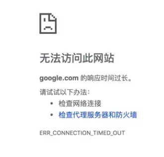
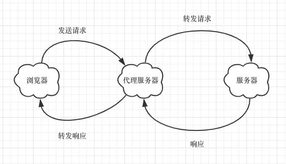

# 跨域解决方案

今天我们来聊一个老生常谈的话题，跨域！

**又是跨域，烦不烦 ？网上跨域的文章那么多，跨的我眼睛都疲劳了，不看了不看了** 🤣 别走...我尽量用最简单的方式将常见的几种跨域解决方案给大家阐释清楚，相信认真看完本文，以后不管是作为受试者还是面试官，对于这块的知识都能够游刃有余。

## 什么是“跨源”

**不是讲跨域吗 ？怎么又来个“跨源” ？字都能打错的 ？**

😄...稍安勿躁，其实我们平常说的跨域是一种狭义的请求场景，简单来说，就是“跨“过[浏览器的同源策略](https://developer.mozilla.org/en-US/docs/Web/Security/Same-origin_policy)去请求资“源”，所以我们叫它“跨源”也没啥问题。那么，

跨源，源是什么？**浏览器的同源策略**

什么是同源？**协议，域名，端口都相同就是同源**

干巴巴的，能不能举个栗子？**栗子:)，有的有的**：

```
const url = 'https://www.google.com:3000'
```

比如上面的这个 URL，协议是：**https**，域名是 **www.google.com**，端口是 **3000**。

不同源了会怎么样？**会有很多限制，比如**：

- Cookie，LocalStorage，IndexDB 等存储性内容无法读取
- DOM 节点无法访问
- Ajax 请求发出去了，但是响应被浏览器拦截了

我就想请求个东西，至于吗，为什么要搞个这么个东西限制我？**基于安全考虑，没有它，你可能会遇到**：

- Cookie劫持，被恶意网站窃取数据
- 更容易受到 XSS，CSRF 攻击
- 无法隔离潜在恶意文件
- ... ...

所以，**得有**。正是因为浏览器同源策略的存在，你的 Ajax 请求有可能在发出去后就被拦截了，它还会给你报个错：

```
✘ Access to XMLHttpRequest at 'xxx' from origin 'xxx' has been block by CORS,
  policy: No 'Access-Control-Allow-Origin' header is present on the requested resource.
```

这种发出去拿不到响应的感受，就像你在网上冲浪时，被一股神秘的东方力量限制了一样:



非常难受，所以，我们接下来就来看看怎么用科学的方法上网（**啊呸，科学的方法解决跨域的问题**

## JSONP

这玩意儿就是利用了 `` 标签的 **src 属性没有跨域限制的漏洞**，让我们可以得到从其他来源动态产生的 JSON 数据。

为什么叫 JSONP ？**JSONP 是 JSON with Padding 的缩写，额，至于为什么叫这个名字，我网上找了下也没个标准的解释，还望评论区的各位老哥知道的赶紧告诉我: )**

怎么实现 ？**具体实现思路大致分为以下步骤**：

- 本站的脚本创建一个 元素，src 地址指向跨域请求数据的服务器
- 提供一个回调函数来接受数据，函数名可以通过地址参数传递进行约定
- 服务器收到请求后，返回一个包装了 JSON 数据的响应字符串，类似这样：callback({...})

浏览器接受响应后就会去执行回调函数 callback，传递解析后的 JSON 对象作为参数，这样我们就可以在 callback 里处理数据了。实际开发中，会遇到回调函数名相同的情况，可以简单封装一个 JSONP 函数：

```
function jsonp({ url, params, callback }) {
  return new Promise((resolve, reject) => {
    // 创建一个临时的 script 标签用于发起请求
    const script = document.createElement('script');
    // 将回调函数临时绑定到 window 对象，回调函数执行完成后，移除 script 标签
    window[callback] = data => {
      resolve(data);
      document.body.removeChild(script);
    };
    // 构造 GET 请求参数，key=value&callback=callback
    const formatParams = { ...params, callback };
    const requestParams = Object.keys(formatParams)
      .reduce((acc, cur) => {
        return acc.concat([`${cur}=${formatParams[cur]}`]);
      }, [])
			.join('&');
		// 构造 GET 请求的 url 地址
    const src = `${url}?${requestParams}`;
    script.setAttribute('src', src);
    document.body.appendChild(script);
  });
}

// 调用时
jsonp({
  url: 'https://xxx.xxx',
  params: {...},
  callback: 'func',
})
```

我们用 **Promise 封装了请求**，使异步回调更加优雅，但是别看楼上的洋洋洒洒写了一大段，其实本质上就是：

```
<script src='https://xxx.xxx.xx?key=value&callback=xxx'><script>
```

想要看例子 ？[戳这里](https://codepen.io/lycheelee/pen/MWWXKeN?editors=1000)

JSONP 的优点是简单而且兼容性很好，但是缺点也很明显，**需要服务器支持而且只支持 GET 请求**，下面我们来看第二种方案，也是目前主流的跨域解决方案，**划重点**！😁

## CORS

[CORS](https://developer.mozilla.org/en-US/docs/Web/HTTP/CORS)（Cross-Origin Resource Sharing）的全称叫 **跨域资源共享**，名称好高大上，别怕，这玩意儿其实就是一种机制。浏览器不是有同源策略呐，这东西好是好，但是对于开发人员来说就不怎么友好了，因为我们可能经常需要发起一个 **跨域 HTTP 请求**。我们之前说过，跨域的请求其实是发出去了的，只不过被浏览器给拦截了，因为不安全，说直白点儿就是，**你想要从服务器哪儿拿个东西，但是没有经过人家允许啊**。所以怎么样才安全 ？服务器允许了不就安全了，这就是 CORS 实现的原理：**使用额外的 HTTP 头来告诉浏览器，让运行在某一个 origin 上的 Web 应用允许访问来自不同源服务器上的指定的资源**。

### 兼容性

目前，所有的主流浏览器都支持 CORS，其中，IE 浏览器的版本不能低于 10，**IE 8 和 9 需要通过 XDomainRequest 来实现**。

完整的兼容性情况 ? [戳这里](https://caniuse.com/#search=CORS)

### 实现原理

CORS 需要浏览器和服务器同时支持，整个 CORS 的通信过程，都是浏览器自动完成。

**怎么个自动法** ？

简单来说，浏览器一旦发现请求是一个**跨域请求**，首先会**判断请求的类型**，

如果是**简单请求**，会在请求头中增加一个 **Origin** 字段，表示这次请求是来自哪一个**源**。而服务器接受到请求后，会返回一个响应，响应头中会包含一个叫 **Access-Control-Allow-Origin** 的字段，它的值**要么包含由 Origin 首部字段所指明的域名，要么是一个 "\*"**，表示接受任意域名的请求。如果响应头中没有这个字段，就说明当前源不在服务器的许可范围内，浏览器就会报错:

```
GET /cors HTTP/1.1
Origin: https://xxx.xx
Accept-Language: en-US
Connection: keep-alive
... ...
```

如果是**非简单请求**，会在正式通信之前，发送一个**预检请求（preflight）**，目的在于询问服务器，当前网页所在的域名是否在服务器的许可名单之中，以及可以使用哪些 HTTP 动词和头信息字段，只有得到肯定答复，浏览器才会发出正式的请求，否则就报错。你可能发现我们在日常的开发中，会看到很多使用 OPTION 方法发起的请求，它其实就是一个预检请求：

```
OPTIONS /cors HTTP/1.1
Origin: http://xxx.xx
Access-Control-Request-Method: PUT
Accept-Language: en-US
... ...
```

**那么到底哪些是简单请求，哪些是非简单请求 ？**

### 请求类型

不会触发 CORS 预检的，就是简单请求。哪些请求不会触发预检 ？

使用以下方法之一：**GET, HEAD, POST**,

并且 **Content-Type** 的值仅限于下列三者之一：

- text/plain
- multipart/form-data
- application/x-www-form-urlencoded

相反，不符合上述条件的就是非简单请求啦。

所以，**实现 CORS 的关键是服务器**，只要服务器实现了 CORS 的相关接口，就可以实现跨域。CORS 与 JSONP相比，优势是支持所有的请求方法，缺点是兼容性上较 JSONP 差。除了 JSONP 和 CORS 外，还有一种常用的跨域解决方案：PostMessage，它**更多地用于窗口间的消息传递。**

## PostMessage

PostMessage 是 Html5 XMLHttpRequest Level 2 中的 API，它可以实现**跨文档通信（Cross-document messaging）**。兼容性上，IE8+，Chrome，Firfox 等主流浏览器都支持，可以放心用😊，如何理解跨文档通信？

你可以类比设计模式中的**发布-订阅模式**，在这里，一个窗口发送消息，另一个窗口接受消息，之所以说类似发布-订阅模式，而不是**观察者模式**，是因为这里两个窗口间没有直接通信，而是通过浏览器这个第三方平台。

```
window.postMessage(message, origin, [transfer])
```

postMessage 方法接收三个参数，要发送的消息，接收消息的源和一个可选的 Transferable 对象，**如何接收消息 ？**

```
window.addEventListener("message", function receiveMessage(event) {}, false); // 推荐，兼容性更好

window.onmessage = function receiveMessage(event) {} // 不推荐，这是一个实验性的功能，兼容性不如上面的方法
```

接收到消息后，消息对象 event 中包含了三个属性：**source，origin，data**，其中 data 就是我们发送的 message。

此外，除了实现窗口通信，postMessage 还可以同 Web Worker 和 Service Work 进行通信，有兴趣的可以 [戳这里](https://juejin.im/post/5b8359f351882542ba1dcc31#heading-9)。

## Websocket

Websocket 是 HTML5 的一个持久化的协议，它**实现了浏览器与服务器的全双工通信**，同时也是跨域的一种解决方案。什么是全双工通信 ？简单来说，**就是在建立连接之后，server 与 client 都能主动向对方发送或接收数据**。

原生的 WebSocket API 使用起来不太方便，我们一般会选择自己封装一个 Websocket（嗯，我们团队也自己封了一个 : ））或者使用已有的第三方库，我们这里以第三方库 [ws](https://github.com/websockets/ws) 为例：

```
const WebSocket = require('ws');

const ws = new WebSocket('ws://www.host.com/path');

ws.on('open', function open() {
  ws.send('something');
});

ws.on('message', function incoming(data) {
  console.log(data);
});
... ...
```

需要注意的是，Websocket 属于长连接，在一个页面建立多个 Websocket 连接可能会导致性能问题。

## Nginx 反向代理

我们知道同源策略限制的是：浏览器向服务器发送跨域请求需要遵循的标准，那如果是**服务器向服务器发送跨域请求**呢？

答案当然是，**不受浏览器的同源策略限制**。

利用这个思路，我们就可以搭建一个代理服务器，接受客户端请求，然后将请求转发给服务器，拿到响应后，再将响应转发给客户端：

  

这就是 Nginx 反向代理的原理，只需要简单配置就可以实现跨域：

```
# nginx.config
# ...
server {
  listen       80;
  server_name  www.domain1.com;
  location / {
    proxy_pass   http://www.domain2.com:8080;  #反向代理
    proxy_cookie_domain www.domain2.com www.domain1.com; #修改cookie里域名
    index  index.html index.htm;

    # 当用 webpack-dev-server 等中间件代理接口访问 nignx 时，此时无浏览器参与，故没有同源限制，下面的跨域配置可不启用
    add_header Access-Control-Allow-Origin *;
    add_header Access-Control-Allow-Credentials true;
    # ...
  }
}
```

## Node 中间件代理

实现的原理和我们前文提到的代理服务器原理如出一辙，只不过这里使用了 Node 中间件做为代理。需要注意的是，**浏览器向代理服务器请求时仍然遵循同源策略**，别忘了在 Node 层通过 CORS 做跨域处理：

```
const https = require('https')
// 接受客户端请求
const sever = https.createServer((req, res) => {
  ...
  const { method, headers } = req
  // 设置 CORS 允许跨域
  res.writeHead(200, {
    'Access-Control-Allow-Origin': '*',
    'Access-Control-Allow-Methods': '*',
    'Access-Control-Allow-Headers': 'Content-Type',
    ...
  })
  // 请求服务器
  const proxy = https.request({ host: 'xxx', method, headers, ...}, response => {
    let body = ''
    response.on('data', chunk => { body = body + chunk })
    response.on('end', () => {
      // 响应结果转发给客户端
      res.end(body)
    })
  })
})
```

## document.domain

二级域名相同的情况下，设置 document.domain 就可以实现跨域。**什么是二级域名 ？**

a.test.com 和 b.test.com 就属于二级域名，它们都是 test.com 的子域。如何实现跨域 ？

```
document.domain = 'test.com' // 设置 domain 相同

// 通过 iframe 嵌入跨域的页面
const iframe = document.createElement('iframe')
iframe.setAttribute('src', 'b.test.com/xxx.html')
iframe.onload = function() {
  // 拿到 iframe 实例后就可以直接访问 iframe 中的数据
  console.log(iframe.contentWindow.xxx)
}
document.appendChild(iframe)
```

## 总结

当然，除了上述的方案外，比较 **Hack** 的还有：**window.name, location.hash**，但是这些跨域的方式现在我们已经不推荐了，为什么 ？因为**相比之下有更加安全和强大的 PostMessage 作为替代**。跨域的方案其实有很多，总结下来：

- **CORS 支持所有的 HTTP 请求，是跨域最主流的方案**
- **JSONP 只支持 GET 请求，但是可以兼容老式浏览器**
- **Node 中间件和 Nginx 反向代理都是利用了服务器对服务器没有同源策略限制**
- **Websocket 也是一种跨域的解决方案**
- **PostMessage 可以实现跨文档通信，更多地用于窗口通信**
- **document.domain, window.name, location.hash 逐渐淡出历史舞台，作为替代 PostMessage 是一种不错的方案**

## 写在最后

本文首发于我的 [博客](https://github.com/campcc/blog)，才疏学浅，难免有错误，文章有误之处还望不吝指正！

如果有疑问或者发现错误，可以在评论区进行提问和勘误，

如果喜欢或者有所启发，欢迎 star，对作者也是一种鼓励。

（完）