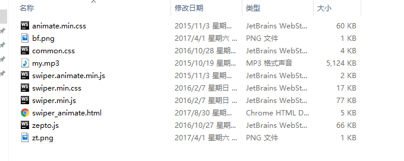
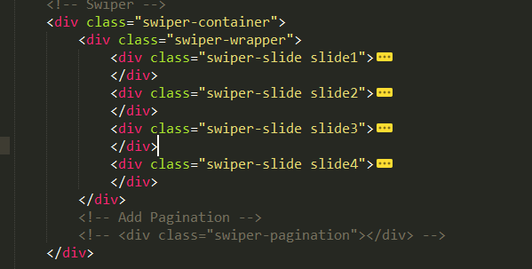
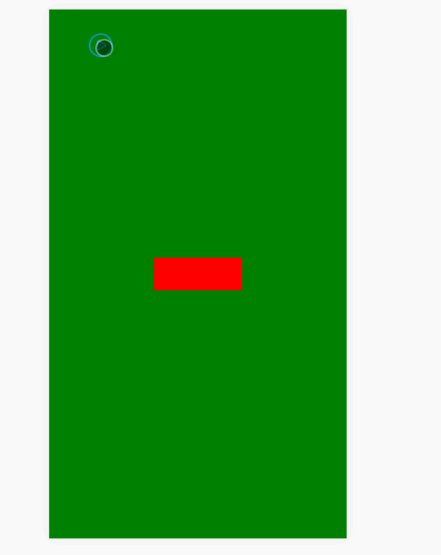

# 基于swiper的移动端H5页面,丰富的动画效果

概述
--

通过运用swiper插件，制作移动端上下整屏滑动的H5页面，用来宣传或者简单注册等，可以嵌套H5音乐或者视频。

详细
--

#### 代码下载：[http://www.demodashi.com/demo/11942.html](http://www.demodashi.com/demo/11942.html)

目前对于H5方面有多个软件快餐，例如易企秀，人人秀等等，甚至连WPS都出了WPSH5。但是对于“高级程序工程师”来说，怎么会甘心只用鼠标傻瓜式的制作H5？

给大家介绍一款插件，有丰富的动画效果已经滚动效果，用于上下整屏滑动等纵向滚动十分简便，还可用于PC和移动端的轮播，左右滑动等横向滚动。

项目结构：需要引入swiper，zepto插件，其中swiper.animate是swiper的一部分，用于小模块的移入移出的动画效果。common.css是移动端的一个公共文件，定义html的font-size。



接下来给大家简单介绍介绍用法：

1. 第一步：

    <meta name="viewport" content="width=device-width, initial-scale=1, minimum-scale=1, maximum-scale=1">

定义自适应宽度，禁止用户缩放，体验原生APP的效果。

引入文件：

    <link rel="stylesheet" href="swiper.min.css">
    <link rel="stylesheet" href="animate.min.css">
    <link rel="stylesheet" href="common.css">
    
    <script src="zepto.js"></script>
    <script src="swiper.min.js"></script>
    <script src="swiper.animate.min.js"></script>

2. 第二步：

给定盒子标签，swiper-slide即整屏的数目，对于滑动页面的数量，根据项目需要进行设置即可。



  

3. 第三步：  

初始化，定义参数，可参考[swiperAPI文档](http://www.swiper.com.cn/api/index.html)

```js
var swiper = new Swiper('.swiper-container', {
        pagination: '.swiper-pagination',
        paginationClickable: true,
        direction: 'vertical',
        onInit: function(swiper){ //Swiper2.x的初始化是onFirstInit
            swiperAnimateCache(swiper); //隐藏动画元素 
            swiperAnimate(swiper); //初始化完成开始动画
          }, 
        onSlideChangeEnd: function(swiper){ 
            swiperAnimate(swiper); //每个slide切换结束时也运行当前slide动画
        } 
    });
```


4. 第四步：

运用swiper.animate的功能，给其中每个单页中的单个模块添加动画：  

```html
<div style="visibility:visible;" class="div1 ani" swiper-animate-effect="bounceInUp" swiper-animate-duration="0.5s" swiper-animate-delay="0.3"></div>
```

只需在需要移入移出动画的标签中添加.ani类名，然后进行相应的动画类型，动画持续时间和延迟时间设置即可，十分简便。

效果中我只设置了一个小模块，大家可以自行设置多个模块，然后通过持续时间，延迟时间来控制先手顺序，再配上各种效果，想想都酷，对不对。

各类动画效果，具体可以参考[动画效果](http://www.swiper.com.cn/usage/animate/index.html)

注意：每个整屏上的各个模块均采用绝对定位的方式进行布局，简单粗暴，移动端的单位注意更换为rem。

5. 第五步：

背景音乐采用audio标签，通过播放暂停按钮进行模拟控制。

```html
<div class="vi">
        
        <audio id="aud" src="my.mp3" autoplay="autoplay">
            <!-- <source src="我的楼兰.mp3" type="audio/mp3">-->
            您的浏览器不支持audio标签
        </audio>
</div>
```

注意：最外面的盒子，要相对屏幕定位，同时设置z-index

```css
 .vi{
        position: fixed;
        width:30px;
        height:30px;
        font-size: 0;
        top: 30px;
        left: 50px;
        z-index: 1000;
    }
```

音乐的话有的手机系统不支持自动播放，大家可以通过touchstart等事件来模拟自动播放，只要用户一碰屏幕就会播放。  

整体效果如下：



#### 代码下载：[http://www.demodashi.com/demo/11942.html
