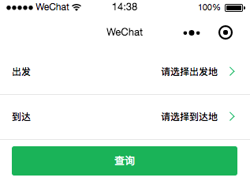
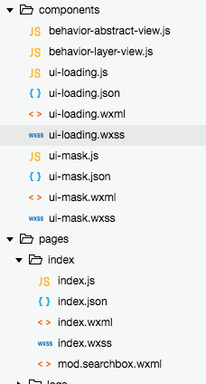
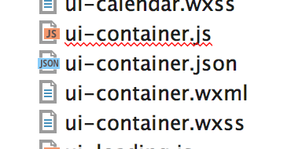
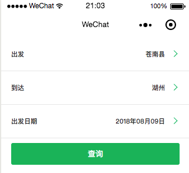
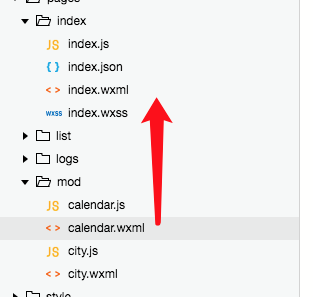

# 微信小程序开发

## 目录

[TOC]

##  

##  01-小程序的执行流程是怎么样的？

### 前言

我们这边最近一直在做基础服务，这一切都是为了完善技术体系，这里对于前端来说便是我们需要做一个Hybrid体系，如果做App，React Native也是不错的选择，但是一定要有完善的分层：

① 底层框架解决开发效率，将复杂的部分做成一个黑匣子，给页面开发展示的只是固定的三板斧，固定的模式下开发即可

② 工程部门为业务开发者封装最小化开发环境，最优为浏览器，确实不行便为其提供一个类似浏览器的调试环境

如此一来，业务便能快速迭代，因为业务开发者写的代码大同小异，所以底层框架配合工程团队（一般是同一个团队），便可以在底层做掉很多效率性能问题。

稍微大点的公司，稍微宽裕的团队，还会同步做很多后续的性能监控、错误日志工作，如此形成一套文档->开发->调试->构建->发布->监控、分析 为一套完善的技术体系

如果形成了这么一套体系，那么后续就算是内部框架更改、技术革新，也是在这个体系上改造，但很可惜，很多团队只会在这个路径上做一部分，后面由于种种原因不在深入，有可能是感觉没价值，而最恐怖的行为是，自己的体系没形成就贸然的换基础框架，戒之慎之啊！

从第三方应用接入来说，微信应该是做的最好的，百度这边有直达号等类似的产品，但是其体系化感觉还是有待提高的，阿里应该也有类似的技术产品诞生，从我们这层来说，都没有太多知晓，所以要么是运营的不好要么是做的不好。

而从小程序诞生以来，我这边便一直在关注，至今整个小程序体系已经十分完备了，腾讯小程序和腾讯云深度整合了，如果使用内测的开发者工具，全免费，纯js就搞定小程序前后端，不用服务器、存储、cdn、服务代码，都是免费，开发完后端不用自己运维，大杀器的节奏，我有时候在想，腾讯的技术实力真的是强啊！

### 小程序的结构追溯

小程序的开发文档还是比较完善的，依旧是 账号申请->demo 流程，等熟悉后便可以走代码上架等流程了，前端代码用工具构建后上传，后台服务自己维护，配置地址映射，我们这里仅关注开发流程，所有使用其测试账号即可。

1 appid wx0c387cc8c19bdf78 2 appsecret acd6c02e2fdca183416df1269d2e3fb9

经过一年多的发展，小程序形成的文档已经比较完善了，我们可以从文档和demo对小程序做出大概的判断：


这里就是小程序给业务人员可以看到的代码了，我们从这个代码以及运行，基本可以将小程序的梗概猜测一番，这里首先看看其全局控制器APP：

```js
//app.js
App({
  onLaunch: function () {
    // 展示本地存储能力
    var logs = wx.getStorageSync('logs') || []
    logs.unshift(Date.now())
    wx.setStorageSync('logs', logs)

    // 登录
    wx.login({
      success: res => {
        // 发送 res.code 到后台换取 openId, sessionKey, unionId
      }
    })
    // 获取用户信息
    wx.getSetting({
      success: res => {
        if (res.authSetting['scope.userInfo']) {
          // 已经授权，可以直接调用 getUserInfo 获取头像昵称，不会弹框
          wx.getUserInfo({
            success: res => {
              // 可以将 res 发送给后台解码出 unionId
              this.globalData.userInfo = res.userInfo

              // 由于 getUserInfo 是网络请求，可能会在 Page.onLoad 之后才返回
              // 所以此处加入 callback 以防止这种情况
              if (this.userInfoReadyCallback) {
                this.userInfoReadyCallback(res)
              }
            }
          })
        }
      }
    })
  },
  globalData: {
    userInfo: null
  }
})
```


一个应用只会有一个APP实例，而小程序为这个单例提供了几个基本的事件定义，我们用的最多的应该是onLaunch、onShow、onHide（我还没写小程序，所以猜测）：


我们这里来追溯一下小程序架构层的执行逻辑，从APP到一个view实例化是怎么做的，这里首先明确几个点：

① 微信小程序事实上依旧是提供的webview执行环境，所以我们依旧可以在js环境中访问window、location等属性

② 微信小程序提供的展示的全部是Native定制化的UI，所以不要去想DOM操作的事

这里各位可以想象为，小程序界面中有一块webview在执行真正的代码逻辑，只不过这个webview除了装载js程序什么都没做，而所有的页面渲染全部是js通过URL Schema或者JSCore进行的Native通信，叫Native根据设置的规则完成的页面渲染。

#### 全局控制器App

这里我们重点关注全局控制器App这个类做了什么，因为拿不到源码，我们这里也只能猜测加单步调试了，首先微信容器会准备一个webview容器为我们的js代码提供宿主环境，容器与构建工具会配合产出以下页面：


他在这里应该执行了实例化App的方法：


这一坨代码，在这个环境下便相当晦涩了：

 

```js
//app.js
App({
  onLaunch: function () {
    // 展示本地存储能力
    var logs = wx.getStorageSync('logs') || []
    logs.unshift(Date.now())
    wx.setStorageSync('logs', logs)

    // 登录
    wx.login({
      success: res => {
        // 发送 res.code 到后台换取 openId, sessionKey, unionId
      }
    })
    // 获取用户信息
    wx.getSetting({
      success: res => {
        if (res.authSetting['scope.userInfo']) {
          // 已经授权，可以直接调用 getUserInfo 获取头像昵称，不会弹框
          wx.getUserInfo({
            success: res => {
              // 可以将 res 发送给后台解码出 unionId
              this.globalData.userInfo = res.userInfo

              // 由于 getUserInfo 是网络请求，可能会在 Page.onLoad 之后才返回
              // 所以此处加入 callback 以防止这种情况
              if (this.userInfoReadyCallback) {
                this.userInfoReadyCallback(res)
              }
            }
          })
        }
      }
    })
  },
  globalData: {
    userInfo: null
  }
})
```


这里会往App中注册一个事件，我们这里注册的是onLaunch事件，这里对应的是当小程序初始化时候会执行这个回调，所以原则上应该是Native装在成功后会执行这个函数，这里再详细点说明下H5与Native的交互流程（这里是我之前做Hybrid框架时候跟Native同事的交互约定，小程序应该大同小异）：

我们一般是在全局上会有一个对象，保存所有需要Native执行函数的对象，比如这里的onLaunch，Native在执行到一个状态时候会调用js全局环境该对象上的一个函数  
因为我们js注册native执行是以字符串key作为标志，所以Native执行的时候可能是window.app\['onLauch...'\]('参数')  
而我们在window对象上会使用bind的方式将对应的作用域环境保留下来，这个时候执行的逻辑便是正确的

这里在小程序全局没有找到对应的标识，这里猜测是直接在app对象上，Native会直接执行APP对象上面的方法，但是我这里有个疑问是View级别如果想注册个全局事件该怎么做，这个留到后面来看看吧，这里是Native载入webview时，会执行对象定义的onLaunch事件，在下面的代码看得到：


这里会结合app.json获取首先加载页面的信息，默认取pages数组第一个，但是具体哪里获取和设置的代码没有找到，也跟主流程无关，我们这里忽略......然后我们看到代码执行了onShow逻辑：


然后流转到注册微信容器层面的事件，我觉得，无论如何，这里应该是像微信容器注册事件了吧，但是我找不到全局的key😔


#### Page流程

如果有微信小程序的同学，麻烦这里指点一下，是不是猜测正确，顺便可以帮忙说明下这里，这里也是我觉得全局key，被Native调用的点，然后，逻辑上会获取默认view的类开始做实例化，我们这里来到view级别代码：

 

```js
//index.js
//获取应用实例
const app = getApp()

Page({
  data: {
    motto: 'Hello Wor11ld',
    userInfo: {},
    hasUserInfo: false,
    canIUse: wx.canIUse('button.open-type.getUserInfo')
  },
  //事件处理函数
  bindViewTap: function() {
    wx.navigateTo({
      url: '../logs/logs'
    })
  },
  onLoad: function () {
    if (app.globalData.userInfo) {
      this.setData({
        userInfo: app.globalData.userInfo,
        hasUserInfo: true
      })
    } else if (this.data.canIUse){
      // 由于 getUserInfo 是网络请求，可能会在 Page.onLoad 之后才返回
      // 所以此处加入 callback 以防止这种情况
      app.userInfoReadyCallback = res => {
        this.setData({
          userInfo: res.userInfo,
          hasUserInfo: true
        })
      }
    } else {
      // 在没有 open-type=getUserInfo 版本的兼容处理
      wx.getUserInfo({
        success: res => {
          app.globalData.userInfo = res.userInfo
          this.setData({
            userInfo: res.userInfo,
            hasUserInfo: true
          })
        }
      })
    }
  },
  getUserInfo: function(e) {
    console.log(e)
    app.globalData.userInfo = e.detail.userInfo
    this.setData({
      userInfo: e.detail.userInfo,
      hasUserInfo: true
    })
  }
})
```

他首先一来便获取了当前app实例：

```
const app = getApp()
```

其次开始了view实例化流程，这个是Page的类入口，**大家要注意view.js只是定义的类，但是其实例化应该在全局的控制器，其实例化在这里完成的：**


Page实例化后会自己执行onLoad以及onShow，但是这里的onLoad以及onShow就看不出来分别了


### 总结

我们这里一起瞎子摸象一般对微信小程序架构做了简单的摸索，这里发现事实上小程序流程与自己所想有一些出入，这里初步认为流程是这样的：

① 我们写好小程序代码后，提交代码

② 在发布流程中我们的代码经过构建流程，app.json以及入口的index.html（伪造页面），重新组装为一个只有js代码的空页面

③ 这里开始载入流程，用户点击一个微信按钮，进入小程序

④ 微信容器开启Hybrid容器，webview载入入口页面（我感觉应该有个规则可以通过url去打开固定一个小程序页面，这里后续碰到开发案例再说）

⑤ webview执行环境实例化App，其后自动装载默认Page（这里默认是index）

PS：这里我有个很疑惑的点，微信Native容器的各个事件点什么时候执行，由谁执行？

⑥ 进入页面渲染逻辑

⑦ ......

这里我还比较在意，执行事件后，对应Native页面是如何进行更新的，所以我们这里关注下这段代码：

```js
debugger;
this.setData({
   userInfo: app.globalData.userInfo,
   hasUserInfo: true
})
```


这里出现了一段非常关键的代码：


可以看到，我们这里往微信容器注册了一个appDataChange的异步事件，而这个时候就将所有的逻辑交给了Native本身，Native执行结束后会根据webviewIds找到后续要执行的回调继续执行。


至于，容器如何使用webviewId找到对应函数的代码，我没有找到。至此，我们对小程序结构的初步探索便结束了，我们本周后面时间继续来对小程序进行深入学习。

## 02-小程序基本介绍

### 前言

前面我们研究了下微信小程序的执行流程，因为拿不到源码，只能算我们的猜想，我们需要更加了解小程序还需要做具体的项目，于是我们将原来那套还算复杂的业务拿出来：

[【组件化开发】前端进阶篇之如何编写可维护可升级的代码](https://www.cnblogs.com/yexiaochai/p/4876099.html)（有些晦涩有些乱，但是对于整体了解小程序结构有帮助）

我们用小程序实现这里的代码，看看是个什么样的体验，另外我这里想保证代码最大程度重用，为后续一端代码四端运行做前驱探索。


页面复杂度还是比较高的，包括了：

① 弹出层

② 页面跳转

③ 缓存

④ 数据请求

⑤ 列表页、滚动分页

⑥ ......

我相信完成了这个例子，我们对小程序业务代码怎么写会有比较好的了解，于是让我们开始今天的代码吧。

### 小程序的布局

#### 为什么不使用HTML&CSS

微信小程序这种平台型的超越Hybrid系统诞生还是有一些客观条件的，其中一个就是移动端的应用相对来说简单的多，想想PC负责的布局，如果要使用小程序实现，那么复杂度会提高很多。

小程序代码编写逻辑层依旧使用JS完成，但是结构层以及样式层推出了：

① WXML，Weixin Markup Language，是微信设计的一套标签语言，与HTML类似，做过React&Vue的同学会非常熟悉

② WXSS，WeiXin Style Sheets，是一套样式语言，用于定义样式，与CSS类似，一般认为是CSS的子集

因为小程序中UI组件都是Native实现，所以小程序直接手起刀落压根放弃让我们使用HTML容器，这样做我觉得有个好处是：

**为了更好的限制**，我之前也在做Hybrid乃至前端框架，一般来说我会限制到View级别的实习，要求必须按照我的规则做，但是因为入口为index.html文件，我甚至将全局控制器App的实例化放到了main.js里面，只提供了建议的做法，事实上HTML还是太过灵活，有些同事逐渐根本不按照我们的规则玩，他觉得他的做法更好，但是这样一来便会破坏了项目的总体性，后续的工程性的优化或者监控可能就不能帮助他了，从某个角度来说，我是认可小程序的做法的。

我们之前在这里研究过自定义标签的做法：[从DOM操作看Vue&React的前端组件化，顺带补齐React的demo](https://www.cnblogs.com/yexiaochai/p/5515264.html)

```html
<article class="cm-page page-list" id="main">
    <div class="js_sort_wrapper sort-bar-wrapper">
        <mySortBar :entity="sortEntity"></mySortBar>
    </div>
    <myList :entity="listEntity" :sort="sort"></myList>
</article>
```


从这个文章以及小程序的实现可以看出基本的概念：

① 标签的出现根本不是做标签用，而是为了让JS捕捉执行相关逻辑，最后生成真正的标签

② 为了做更好的限制，小程序根本不提供入口index.html文件了，所以这里的标签是用作JS做模板解析后生成Native能识别的代码，更具体点说是，Native实现了一个组件，组件有很多规则，可以使用JS去调用，正如我们这里的header组件调用逻辑（JS会设置Native的Header组件展示），这里如果不太清晰可以参考下这个文章：[浅谈Hybrid技术的设计与实现第二弹](https://www.cnblogs.com/yexiaochai/p/5524783.html)

当然，小程序底层具体是不是这么做，我们不得而知，如果有小程序的同事，可以指导下：），至此，我觉得可以从技术层面说明为什么不直接使用HTML&CSS了：更好的业务限制 + 方便JS解析模板被Native执行。

#### 小程序组件

我们之前做Hybrid应用的时候，事实上只提供了一个真正具有结构的组件Header，其他loading类的提示组件都比较简单，而我们看看小程序提供了哪些组件呢：

##### 容器类组件

view&scroll-view&swiper等作为容器组件存在，这里官方有基本介绍，我们这里看看其中一个即可：


这里官方给了一个demo进行说明：

```html
<view class="section">
  <view class="section__title">flex-direction: row</view>
  <view class="flex-wrp" style="flex-direction:row;">
    <view class="flex-item bc_green">1</view>
    <view class="flex-item bc_red">2</view>
    <view class="flex-item bc_blue">3</view>
  </view>
</view>
<view class="section">
  <view class="section__title">flex-direction: column</view>
  <view class="flex-wrp" style="height: 300px;flex-direction:column;">
    <view class="flex-item bc_green">1</view>
    <view class="flex-item bc_red">2</view>
    <view class="flex-item bc_blue">3</view>
  </view>
</view>
```


```css
@import "../lib/weui.wxss";

.page-section{
  margin-bottom: 20rpx;
}
.flex-wrp {display: flex;}
.bc_green {background: green;width:100px; height: 100px;}
.bc_red {background: red;width:100px; height: 100px;}
.bc_blue {background: blue;width:100px; height: 100px;}
```


可以将这个标签理解为div类组件。

###### swipe

一般来说，Native提供的轮播图体验要好得多，所以这里也提供了一个Native的组件：

```html
<view class="container">
  <view class="page-body">
    <view class="page-section page-section-spacing swiper">
      <swiper
        indicator-dots="{{indicatorDots}}" autoplay="{{autoplay}}" circular="{{circular}}" vertical="{{vertical}}"
        interval="{{interval}}" duration="{{duration}}" previous-margin="{{previousMargin}}px" next-margin="{{nextMargin}}px">
        <block wx:for="{{background}}" wx:key="*this">
          <swiper-item>
            <view class="swiper-item {{item}}"></view>
          </swiper-item>
        </block>
      </swiper>
    </view>
    <view class="page-section" style="margin-top: 40rpx;margin-bottom: 0;">
      <view class="weui-cells weui-cells_after-title">
        <view class="weui-cell weui-cell_switch">
          <view class="weui-cell__bd">指示点</view>
          <view class="weui-cell__ft">
            <switch checked="{{indicatorDots}}" bindchange="changeProperty" data-property-name="indicatorDots" />
          </view>
        </view>
        <view class="weui-cell weui-cell_switch">
          <view class="weui-cell__bd">自动播放</view>
          <view class="weui-cell__ft">
            <switch checked="{{autoplay}}" bindchange="changeProperty" data-property-name="autoplay" />
          </view>
        </view>
        <view class="weui-cell weui-cell_switch">
          <view class="weui-cell__bd">衔接滑动</view>
          <view class="weui-cell__ft">
            <switch checked="{{circular}}" bindchange="changeProperty" data-property-name="circular" />
          </view>
        </view>
        <view class="weui-cell weui-cell_switch">
          <view class="weui-cell__bd">竖向</view>
          <view class="weui-cell__ft">
            <switch checked="{{vertical}}" bindchange="changeProperty" data-property-name="vertical" />
          </view>
        </view>
      </view>
    </view>

    <view class="page-section page-section-spacing">
      <view class="page-section-title">
        <text>幻灯片切换时长(ms)</text>
        <text class="info">{{duration}}</text>
      </view>
      <slider value="{{duration}}" min="500" max="2000" bindchange="changeProperty" data-property-name="duration" />
      <view class="page-section-title">
        <text>自动播放间隔时长(ms)</text>
        <text class="info">{{interval}}</text>
      </view>
      <slider value="{{interval}}" min="2000" max="10000" bindchange="changeProperty" data-property-name="interval" />
      <view class="page-section-title">
        <text>前边距(px)</text>
        <text class="info">{{previousMargin}}</text>
      </view>
      <slider value="{{previousMargin}}" min="0" max="50" bindchange="changeProperty" data-property-name="previousMargin" />
      <view class="page-section-title">
        <text>后边距(px)</text>
        <text class="info">{{nextMargin}}</text>
      </view>
      <slider value="{{nextMargin}}" min="0" max="50" bindchange="changeProperty" data-property-name="nextMargin" />
    </view>
  </view>
</view>
```

```css
Page({
  data: {
    background: ['demo-text-1', 'demo-text-2', 'demo-text-3'],
    indicatorDots: true,
    vertical: false,
    autoplay: false,
    circular: false,
    interval: 2000,
    duration: 500,
    previousMargin: 0,
    nextMargin: 0
  },
  changeProperty: function (e) {
    var propertyName = e.currentTarget.dataset.propertyName
    var newData = {}
    newData[propertyName] = e.detail.value
    this.setData(newData)
  },
  changeIndicatorDots: function (e) {
    this.setData({
      indicatorDots: !this.data.indicatorDots
    })
  },
  changeAutoplay: function (e) {
    this.setData({
      autoplay: !this.data.autoplay
    })
  },
  intervalChange: function (e) {
    this.setData({
      interval: e.detail.value
    })
  },
  durationChange: function (e) {
    this.setData({
      duration: e.detail.value
    })
  }
})
```


有demo有代码，还是比较清晰。

###### movable-area

提供一个可以移动的区域，暂时没想到应用场景......

###### icon

图标，小程序这边还扩展了一下，给了很多默认的图标样式，能满足基本需求

###### text

文本

###### rich-text

富文本，用于展示文章，支持HTML，这里的nodes属性建议使用数组，类型，还不如系统自己解析js算了，因为不会有人像这样写代码（nodes看上去很蠢）： 

```js
Page({
  data: {
    html: '<div class="div_class" style="line-height: 60px; color: red;">Hello&nbsp;World!</div><script>console.log(1)</script>',
    nodes: [{
      name: 'div',
      attrs: {
        class: 'div_class',
        style: 'line-height: 60px; color: red;'
      },
      children: [{
        type: 'text',
        text: 'Hello&nbsp;World!'
      }]
    }]
  },
  tap() {
    console.log('tap')
  }
})
```


###### progress

进度条

###### button

按钮

###### checkbox

选择框

###### form

表单相关

###### input

输入框，小程序的数据流动是单向的，每次数据更新，动态调用setData改变数据便会触发view更新，底层实现便不知道了；文本框值改变js需要自己去获取

###### label

与html一致，用以点击文字操作控件，主要用于文本框

###### picker&picker-view

用于级联操作

###### navigator & function-page-navigator

页面链接，这个组件感觉不利于跳转收口，建议少用

其他组件请大家直接到这里来看demo，非常清晰：

[https://developers.weixin.qq.com/miniprogram/dev/component/map.html#map](https://developers.weixin.qq.com/miniprogram/dev/component/map.html#map)

#### 总结

可以看出，小程序Native层是将常用的HTML标签分别都实现了一次，使用这些组件可以拼接处任何复杂的组件。至于样式方面，WXSS与CSS大同小异，其中主要区别是小程序没有使用px而是使用的rpx，这个类似于rem的实现，为了解决移动端的适配问题而存在，总而言之，你在iPhone6设计搞上是多少px就写成多少rpx就行，其余系统会帮你完成适配工作，这块透明做的很好，后续样式我们直接上实例即可。

### 小程序的生命周期

我们这里上一张图：


这张图不但真实反映了Page的生命周期，也将我们之前的猜想做了一个证明，解读这张图大概是这个意思（未必正确，如有错误请指出）：

Native层在载入小程序时候，起了两个线程一个的view Thread一个是AppService Thread，我这边理解下来应该就是程序逻辑执行与页面渲染分离，也许是想优化性能，这里更具体一点的解释是（带有猜测了）：微信会开一个webview来执行我们的JS逻辑，然后会开一个Native View UI执行页面渲染；两个部分是彼此独立的，页面点击时候触发事件，View线程会获取APPService服务线程（其实就是获取webview），执行其中的js逻辑；APPService执行js逻辑改变数据通过setData调用，触发一个JSCore通信，通知view线程执行UI更新，这里结合这张图做下理解：

① 微信打开一个小程序时，主UI线程继续运行，开启一个webview（我认为这里的主线程就是view Thread，webview就是APPService线程，这里可能有误）

② 主View等待构建页面命令，逻辑层开始载入js逻辑（编译过），微信底层应该会将WXML以及WXSS翻译为JS代码，逻辑层执行JS代码做一些初始化工作APP结束后，开始Page逻辑，而他这个图只有Page的逻辑，没有将app囊括进去，这里也引发了我一个疑惑：我在onLoad的时候打了个断点，而页面这个时候事实上已经进行了结构层的渲染，也就是说页面的WXML逻辑已经执行了：


如果要按照我现有的逻辑下做解释的话，我认为实例化Page的时候，执行了一个create事件，但是小程序并没有释放onCreate事件让我们做注册，所以我这里知识体系的基础依旧是：

JS逻辑先于Native UI 执行，页面渲染是由实例化Page时候发出

所以我觉得，这里的图好像少了一部分（或者说我理解是有问题的）：


③ 业务线程执行实例化Page逻辑，引发onLoad、onShow事件，onShow的时候页面初步渲染已经结束，如果系统有异步数据或者其他再次数据渲染会执行setData，引发Native UI更新，逻辑结束

但是微信给出的图不可能是错的，而从图上看，首次异步通知是由View Thread发起的，我这里就很是困惑了😪，因为我认为逻辑发起者一定是逻辑层的js发出通知

## 03-这是一个组件

### 编写组件

#### 基本结构

我们今天先来实现这个弹出层：


之前这个组件是一个容器类组件，弹出层可设置载入的html结构，然后再设置各种事件即可，这种组件有一个特点：

① 只提供Header部分以及容器部分

② 容器部分的HTML结构由业务层提供

③ 容器部分对应样式由业务层提供

我们如果要在小程序中实现这类组件，意味着我们需要往小程序中动态插入WXML结构，我们这里先做个demo，试试往动态插入WXML是不是可行

```js
this.setData({'wxml': ` 
    <my-component>
    <view>动态插入的节点</view> 
    </my-component>
`});
```


小程序对应设置的数据进行了转义，所以并不能动态解析，如果站在性能角度思考，不进行动态解析也不是错误的；另一方面，一旦小程序能动态解析wxml，那么可能会涌出各种花式用法，控制力会减低，那么我们这里如何解决这个问题呢？

我想的是，直接将业务级wxml结构放到页面里面，隐藏起来，需要使用弹出层的时候，直接将之装载进去，我们来看看是否可行，我们将我们需要展示的结构放到一个模板当中：

```xml
<template name="searchbox">
   <my-component>
       <view>动态组件部分</view> 
   </my-component>
</template>
```

然后，我们在我们主界面中载入模板：

```xml
<import src="mod.searchbox.wxml"/>
<view>
  <my-component>
    <!-- 这部分内容将被放置在组件 <slot> 的位置上 -->
     <view>这里是插入到组件slot中的内容</view> 
  </my-component>
</view>
<view>
  <template is="searchbox" />
</view>
```


主体结构放到页面中，我们传入数据模型或者控制显示即可，看起来是可行的，于是我们先实现我们基本的样式，因为业务模块的样子应该由业务提供，所以对应样式写到index.wxss里面：

 

```css
.btn-primary {
    background-color: #00b358;
    color: #fff;
    border: 0 none;
}
.btn, .btn-primary, .btn-secondary, .btn-sub {
    line-height: 88rpx;
    height: 88rpx;
    padding: 0 20rpx;
    display: inline-block;
    vertical-align: middle;
    text-align: center;
    border-radius: 8rpx;
    cursor: pointer;
    font-size: 32rpx;
    -webkit-box-sizing: border-box;
    box-sizing: border-box;
}
.full-width {
    width: 100%;
    -webkit-box-sizing: border-box;
    box-sizing: border-box;
}


.c-row {
    width: auto;
    display: -webkit-box;
    -webkit-box-orient: horizontal;
    -webkit-box-direction: normal;
    -webkit-box-pack: justify;
    -webkit-box-align: stretch;
    -webkit-box-lines: single;
    display: -webkit-flex;
    -webkit-flex-direction: row;
    -webkit-justify-content: space-between;
    -webkit-align-items: strecth;
    -webkit-align-content: flex-start;
    -webkit-flex-wrap: nowrap;
    padding: 20rpx 40rpx;
}

.c-span3 {
    width: 25%;
    -webkit-box-flex: 3;
    -webkit-flex: 3 3 auto;
}

.c-span9 {
    width: 75%;
    -webkit-box-flex: 9;
    -webkit-flex: 9 9 auto;
}

.search-line {
    position: relative;
    height: 96rpx;
    line-height: 96rpx;
    font-size: 30rpx;
    font-weight: 600;
    border-bottom: 1rpx solid #e6e6e6;
}

.search-line::after {
    content: "";
    display: inline-block;
    vertical-align: middle;
    width: 20rpx;
    height: 20rpx;
    border-top: 4rpx solid #00b358;
    border-right: 4rpx solid #00b358;
    position: absolute;
    right: 60rpx;
    top: 50%;
    margin-top: -4rpx;
    -webkit-transform: rotate(45deg) translateY(-50%);
    transform: rotate(45deg) translateY(-50%);
    -webkit-box-sizing: border-box;
    box-sizing: border-box;
}

.search-line-txt {
    text-align: right;
    padding-right: 60rpx;
    overflow: hidden;
    text-overflow: ellipsis;
    white-space: nowrap;
}
```

```xml
<template name="searchbox">
  <view class="c-row search-line" data-flag="start">
      <view class="c-span3">
          出发</view>
      <view class="c-span9 js-start search-line-txt">
          请选择出发地</view>
  </view>
  <view class="c-row search-line" data-flag="arrive">
      <view class="c-span3">
          到达</view>
      <view class="c-span9 js-arrive search-line-txt">
          请选择到达地</view>
  </view>
  <view class="c-row " data-flag="arrive">
      <span class="btn-primary full-width js_search_list">查询</span>
  </view>
</template>
```




如此一来，我们基本的弹出层样式就七七八八了，这里可以看出一些特点：小程序与平时我们的样式差距不大，稍微改点就能用，甚至能直接通用；另一方面，我们也需要思考一个问题：公共部分的CSS该怎么处理？其实我这里需要解决的不只是公共的样式部分，还需要解决公共的组件部分。

我这里想的是将所有公共部分的CSS放到一个全局的文件global.wxss中，然后在每个业务级页面import即可，所以我们这里需要形成一个公共的WXSS库，这个与纯web映射起来即可，我们这里便不深入。

#### 公共组件库

要提高开发效率的第一个前提就是要有足够多的UI组件，小程序本身提供了一些定制化的组件，我们仍然会用到的组件有：

① alert类弹出层

② loading类弹出层

③ 日历组件

④ toast&message类提示弹出组件

⑤ 容器类组件

⑥ ......

之前的做法，是我们将html实体和组件实现直接放到一起，css放到全局global里面去，现在小程序并不支持动态展示wxml，所以动态插入的方式行不通了，我们需要将组件的wxml放到页面里面做预加载，这里我想的是提供一个通用global.ui.wxml文件用以装载所有的wxml实体，常用的组件我们默认全局引入，我们这里先挑点软柿子来捏，我们先实现一个alert类弹出层组件。

我们将原来弹出层类会用到的CSS全部翻译为WXSS，放入global.wxss中：


然后我们每个组件都会有一个固定的生命周期：创建->显示->隐藏，这个生命周期是每个组件都具有的特性，所以我们这里应该引入继承概念实现组件，但是小程序官方提供的Components并没有提供继承概念，而是提供了behaviors概念，用以将组件间的公共部分处理掉，所以我们这里也使用behaviors，因为不能操作dom，我们的组件抽象会变得相对简单，不用记录太多dom节点了，另外小程序的组件与我们之前的“组件”从定义到使用上有很大的不同，之前我们是以js作为控制器，现在是以标签wxml作为控制器，根本没有办法在js中获取实例，而小程序组件的生命周期并不包含显示隐藏生命周期，所以他的组件和我们以为的组件有很大的不同

我思考了下为什么小程序中，js不能获取组件的实例，这里得出的结论是：

小程序中所有的WXML必须在页面中进行预加载逻辑，不能动态插入DOM的方式插入WXML，所以小程序没有提供组件实例给我们控制  
所以在小程序中想完成组件库，那么便只能把组件做标签使用（而且是js不能获取的标签），而不是js组件，这样会有效帮助我们理解

我们这里尝试实现一个遮盖层的标签（这里开始不用组件这个词，感觉很有歧义）:


代码非常简单：

```
<view class="cm-overlay"></view>
```

```css
.cm-overlay {
    background: rgba(0, 0, 0, 0.5);
    position: fixed;
    top: 0; right: 0; bottom: 0; left: 0;
}
```


```js
let LayerView = require('behavior-layer-view')

Component({
  behaviors: [LayerView],

  data: {
    myData: {}
  },
  attached: function () { },
  methods: {
  }
})
```


可以看到，这个遮盖层mask没有什么意义，而且一般来说mask也不会单独存在，一般是一个组件（比如弹出层的loading）会包含一个遮盖层，所以我们这里要改造下Mask的结构，让他可以装载组件，我们从js组件逻辑来说是mask应该是loading的一个实例，但是我们站在标签角度来说，他们两个应该是独立的：

```
 <view class="cm-overlay">
   <slot></slot>
 </view>
```

我们这里实现一个loading的组件（PS：CSS3动画稍微要做点兼容调试）：




 

```css
.spinner {
  width: 140rpx;
  height: 140rpx;
  position: fixed;
  align-items: center;
  display: flex;
  top: 50%;
  left: 50%;
  margin-left: -70rpx;
  margin-top: -70rpx;
}
 
.container1 > view, .container2 > view, .container3 > view {
  width: 24rpx;
  height: 24rpx;
  background-color: #00b358;
  border-radius: 100%;
  position: absolute;
  -webkit-animation: bouncedelay 1.2s infinite ease-in-out;
  animation: bouncedelay 1.2s infinite ease-in-out;
  -webkit-animation-fill-mode: both;
  animation-fill-mode: both;
}
 
.spinner .spinner-container {
  position: absolute;
  width: 66%;
  height: 66%;
  top: 10%;
  left: 10%;
}
 
.container2 {
  -webkit-transform: rotateZ(45deg);
  transform: rotateZ(45deg);
}
 
.container3 {
  -webkit-transform: rotateZ(90deg);
  transform: rotateZ(90deg);
}
 
.circle1 { top: 0; left: 0; }
.circle2 { top: 0; right: 0; }
.circle3 { right: 0; bottom: 0; }
.circle4 { left: 0; bottom: 0; }
 
.container2 .circle1 {
  -webkit-animation-delay: -1.1s;
  animation-delay: -1.1s;
}
 
.container3 .circle1 {
  -webkit-animation-delay: -1.0s;
  animation-delay: -1.0s;
}
 
.container1 .circle2 {
  -webkit-animation-delay: -0.9s;
  animation-delay: -0.9s;
}
 
.container2 .circle2 {
  -webkit-animation-delay: -0.8s;
  animation-delay: -0.8s;
}
 
.container3 .circle2 {
  -webkit-animation-delay: -0.7s;
  animation-delay: -0.7s;
}
 
.container1 .circle3 {
  -webkit-animation-delay: -0.6s;
  animation-delay: -0.6s;
}
 
.container2 .circle3 {
  -webkit-animation-delay: -0.5s;
  animation-delay: -0.5s;
}
 
.container3 .circle3 {
  -webkit-animation-delay: -0.4s;
  animation-delay: -0.4s;
}
 
.container1 .circle4 {
  -webkit-animation-delay: -0.3s;
  animation-delay: -0.3s;
}
 
.container2 .circle4 {
  -webkit-animation-delay: -0.2s;
  animation-delay: -0.2s;
}
 
.container3 .circle4 {
  -webkit-animation-delay: -0.1s;
  animation-delay: -0.1s;
}

@-webkit-keyframes bouncedelay {
  0%, 80%, 100% { -webkit-transform: scale(0.0) }
  40% { -webkit-transform: scale(1.0) }
}
 
@keyframes bouncedelay {
  0%, 80%, 100% {
    transform: scale(0.0);
    -webkit-transform: scale(0.0);
  } 40% {
    transform: scale(1.0);
    -webkit-transform: scale(1.0);
  }
}

```

loading样式


```xml
<ui-mask z-index="{{maskzIndex}}" ></ui-mask>
<view class="spinner" style="z-index: {{meIndex}}">
  <view class="spinner-container container1">
    <view class="circle1"></view>
    <view class="circle2"></view>
    <view class="circle3"></view>
    <view class="circle4"></view>
  </view>
  <view class="spinner-container container2">
    <view class="circle1"></view>
    <view class="circle2"></view>
    <view class="circle3"></view>
    <view class="circle4"></view>
  </view>
  <view class="spinner-container container3">
    <view class="circle1"></view>
    <view class="circle2"></view>
    <view class="circle3"></view>
    <view class="circle4"></view>
  </view>
</view>
```


 

```js
const util = require('../utils/util.js');
let LayerView = require('behavior-layer-view');

Component({
  behaviors: [LayerView],

  data: {
    maskzIndex: util.getBiggerzIndex(),
    meIndex: util.getBiggerzIndex()
  },
  attached: function () { 
    console.log('loading')
  },
  methods: {
  }
})
```

index调用情况：

```xml
<import src="./mod.searchbox.wxml" />

<view>
  <template is="searchbox" />
  <ui-loading></ui-loading>
</view>
```


我们后续将完整的项目代码放到github上去，这里便继续代码了

#### 添加事件

于是，我们开始添加事件了，这里添加一个点击遮盖层关闭整个组件的功能，这里有个问题是，我们点击遮盖层事实上关闭的是遮盖以及loading两个标签，而我们这里的isShow属性便派上了用处，我们现在page中设置下属性：

```
<ui-loading is-show="{{isLoadingShow}}"></ui-loading>
```

```js
onShow: function() {
   this.setData({
     isLoadingShow: ''
   });
},
```

然后我们改造mask以及loading添加事件：

```xml
<view class="cm-overlay" style="z-index: {{zIndex}}; display: {{isShow}}" bindtap="onTap">
</view>
```

```js
let LayerView = require('behavior-layer-view')

Component({
  behaviors: [LayerView],

  data: {
    myData: {}
  },
  attached: function () { 
    console.log('mask')
  },
  methods: {
    onTap: function() {
      this.triggerEvent('customevent', {}, {})
    }
  }
})
```


```xml
<ui-mask z-index="{{maskzIndex}}" is-show="{{isShow}}" bindcustomevent="onMaskEvent"></ui-mask>
<view class="spinner" style="z-index: {{meIndex}}; display: {{isShow}}; ">
  <view class="spinner-container container1">
    <view class="circle1"></view>
    <view class="circle2"></view>
    <view class="circle3"></view>
    <view class="circle4"></view>
  </view>
  <view class="spinner-container container2">
    <view class="circle1"></view>
    <view class="circle2"></view>
    <view class="circle3"></view>
    <view class="circle4"></view>
  </view>
  <view class="spinner-container container3">
    <view class="circle1"></view>
    <view class="circle2"></view>
    <view class="circle3"></view>
    <view class="circle4"></view>
  </view>
</view>
```


```js
const util = require('../utils/util.js');
let LayerView = require('behavior-layer-view');

Component({
  behaviors: [LayerView],

  data: {
    maskzIndex: util.getBiggerzIndex(),
    meIndex: util.getBiggerzIndex()
  },
  attached: function () { 
    console.log('loading')
  },
  methods: {
    onMaskEvent: function (e) {
      console.log(e);
      this.setData({
        isShow: 'none'
      });
    }
  }
})
```


这个时候，当我们点击遮盖层的时候，我们整个组件便关闭了。

### 总结

我们今天花了很多功夫写一个loading，发现小程序中的组件事实上是标签，我们没法使用js获取到我们“组件”的实例，所以使用上有很大的区别，但是什么都不能阻碍我们写通用组件的决心，于是我们明天来写一些通用的组件库，并且形成一个小程序的体系，这里想的是有：

① 消息框

② toast提示

③ 日历组件

④ 然后再做一个需要定位的气泡组件

## 04-打造自己的UI库

前言

github地址：[https://github.com/yexiaochai/wxdemo](https://github.com/yexiaochai/wxdemo)

接上文继续，我们前面学习了小程序的生命周期、小程序的标签、小程序的样式，后面我们写了一个简单的loading组件，显然他是个半成品，我们在做loading组件的时候意识到一个问题：

小程序的组件事实上是标签
我们没有办法获得标签的实例，至少我暂时没有办法
所以这些前提让我们对标签的认识有很大的不同，完成小程序特有的UI库，那么就需要从标签出发
这里面关注的点从js中的实例变成了wxml中的属性

我们今天尝试做几个组件，然后先做未完成的loading，然后做消息类弹出组件，然后做日历组件，我希望在这个过程中，我们形成一套可用的体系，这里涉及了组件体系，我们可能需要整理下流程：

① 首先我们这里做的组件其实是“标签”，这个时候就要考虑引入时候的怎么处理了

② 因为写业务页面的同事（写page的同事），需要在json配置中引入需要使用的标签：

```
"usingComponents": {
	"ui-loading": "/components/ui-loading"
}
```

因为不能动态插入标签，所以需要一开始就把标签放入页面wxml中：

```
<ui-loading is-show="{{isLoadingShow}}"></ui-loading>
```

③ json中的配置暂时只能拷贝，但是我们可以提供一个ui-set.wxml来动态引入一些组件，如全局使用的loading弹出类提示框

④ 像日历类组件或者平时用的比较少的弹出层组件便需要自己在页面中引入了，工作量貌似不大，后续看看情况，如何优化

⑤ 我们这里给每个组件设置一个behaviors，behaviors原则只设置一层（这里有点继承的关系），层级多了变比较复杂了，弹出层类是一个、一般类一个（用于日历类组件）

有了以上标准，我们这里先来改造我们的loading组件

⑥ 默认所有的组件初期WXSS直接设置为隐藏

### 改造loading

这里首先改造弹出层都要继承的behaviors behavior-layer：

```
const util = require('../utils/util.js')
module.exports = Behavior({
  properties: {
    //重要属性，每个组件必带，定义组件是否显示
    isShow: {
      type: String
    }
  },
  //这里设置弹出层必须带有一个遮盖层，所以每个弹出层都一定具有有个z-index属性
  data: {
    maskzIndex: util.getBiggerzIndex(),
    uiIndex: util.getBiggerzIndex()
  },
  attached: function() {
    console.log('layer')
  },
  methods: {
  }
})
```

其次我们改造下我们的mask组件：


```
let LayerView = require('behavior-layer')
Component({
  behaviors: [LayerView],
  properties: {
    //只有mask的z-index属性需要被调用的弹出层动态设置
    zIndex: {
      type: String
    }
  },
  data: {
  },
  attached: function () { 
    console.log('mask')
  },
  methods: {
    onTap: function() {
      this.triggerEvent('customevent', {}, {})
    }
  }
})
```


WXML不做变化，便完成了我们的代码，并且结构关系似乎更加清晰了，但是作为loading组件其实是有个问题的，比如点击遮盖层要不要关闭整个组件，像类似这种点击遮盖层要不要关闭整个组件，其实该是一个公共属性，所以我们对我们的layer、mask继续进行改造（这里具体请看github代码）：


```
const util = require('../utils/util.js')
module.exports = Behavior({
  properties: {
    //重要属性，每个组件必带，定义组件是否显示
    isShow: {
      type: String
    }
  },
  //这里设置弹出层必须带有一个遮盖层，所以每个弹出层都一定具有有个z-index属性
  data: {
    maskzIndex: util.getBiggerzIndex(),
    uiIndex: util.getBiggerzIndex(),
    //默认点击遮盖层不关闭组件
    clickToHide: false
  },
  attached: function() {
    console.log('layer')
  },
  methods: {
  }
})
```


```
methods: {
  onMaskEvent: function (e) {
    console.log(e);
    //如果设置了点击遮盖层关闭组件则关闭
    if (this.data.clickToHide)
      this.setData({
        isShow: 'none'
      });
  }
}
```

这个时候，点击要不要关闭，基本就在组件里面设置一个属性即可，但是我们这个作为了内部属性，没有释放出去，这个时候我们也许发现了另外一个比较幽默的场景了：

我们因为没法获取一个标签的实例，所以我们需要在页面里面动态调用：

```
onShow: function() {
  let scope= this;
  this.setData({
    isLoadingShow: ''
  });
  //3秒后关闭loading
  setTimeout(function () {
    scope.setData({
      isLoadingShow: 'none'
    });
  }, 3000);
},
```


可以看到，标签接入到页面后，控制标签事实上是动态操作他的属性，也就是说操作页面的状态数据，页面的UI变化全部是数据触发，这样的逻辑会让界面变得更加清晰，但是作为全局类的loading这种参数，我并不想放到各个页面中，因为这样会导致很多重复代码，于是我在utils目录中新建了一个ui-util的工具类，作为一些全局类的ui公共库：

 

```
//因为小程序页面中每个页面应该是独立的作用域
class UIUtil {
  constructor(opts) {
    //用于存储各种默认ui属性
    this.isLoadingShow = 'none';
  }
  //产出页面loading需要的参数
  getPageData() {
    return {
      isLoadingShow: this.isLoadingShow
    }
  }
  //需要传入page实例
  showLoading(page) {
    this.isLoadingShow = '';
    page.setData({
      isLoadingShow: this.isLoadingShow
    });
  }
  //关闭loading
  hideLoading(page) {
    this.isLoadingShow = 'none';
    page.setData({
      isLoadingShow: this.isLoadingShow
    });
  }
}

//直接返回一个UI工具了类的实例
module.exports = new UIUtil
```

index.js使用上产生一点变化：

```
//获取公共ui操作类实例
const uiUtil = require('../../utils/ui-util.js');
//获取应用实例
const app = getApp()
Page({
  data: uiUtil.getPageData(),
  onShow: function() {
    let scope= this;
    uiUtil.showLoading(this);
    //3秒后关闭loading
    setTimeout(function () {
      uiUtil.hideLoading(scope);
    }, 3000);
  },
  onLoad: function () {
  }
})
```

这样，我们将页面里面要用于操作组件的数据全部放到了一个util类中，这样代码会变得清晰一些，组件管理也放到了一个地方，只是命名规范一定要安规则来，似乎到这里，我们的loading组件改造结束了，这里却有一个问题，我们在ui-util类中存储的事实上是页面级的数据，其中包含是组件的状态，但是真实情况我们点击遮盖层关闭组件，根本不会知会page层的数据，这个时候我们loading的显示状态搞不好是显示，而真实的组件已经关闭了，**如何保证状态统一我们后面点再说，我暂时没有想到好的办法。**

### toast组件

我们现在先继续作toast组件，toast组件一样包含一个遮盖层，但是点击的时候可以关闭遮盖层，显示3秒后关闭，显示多久关闭的属性应该是可以配置的（作为属性传递），所以我们新增组件：


```
const util = require('../utils/util.js');
let LayerView = require('behavior-layer');

Component({
  behaviors: [
    LayerView
  ],
  properties: {
    message: {
      type: String
    }
  },
  data: {
  },
  attached: function () { 
    console.log(this)
  },
  methods: {
    onMaskEvent: function (e) {
      console.log(e);
      //如果设置了点击遮盖层关闭组件则关闭
      if (this.data.clickToHide)
        this.setData({
          isShow: 'none'
        });
    }
  }
})
```


整体代码请各位在git上面去看，这里也引起了一些问题：

① 我的组件如何居中？

② 一般来说toast消失的时候是可以定制化一个事件回调的，我们这里怎么实现？

这里我们先抛开居中问题，我们先来解决第二个问题，因为小程序中没有addEventListener这个方法，所以能够改变组件特性的方式只剩下数据操作，回顾我们这里可以引起组件隐藏的点只有：

① toast中的点击弹出层时改变显示属性

```
onMaskEvent: function (e) {
  console.log(e);
  //如果设置了点击遮盖层关闭组件则关闭
  if (this.data.clickToHide)
    this.setData({
      isShow: 'none'
    });
}
```

② 然后就是页面中动态改变数据属性了：

```
onShow: function() {
  let scope= this;
  uiUtil.showToast(this, '我是美丽可爱的toast');
  //3秒后关闭loading
  setTimeout(function () {
    uiUtil.hideToast(scope);
  }, 3000);
},
```

这里，我们不得不处理之前的数据同步问题了，我们应该给toast提供一个事件属性可定义的点，点击遮盖层的真正处理逻辑需要放到page层，其实认真思考下，标签就应该很纯粹，不应该与业务相关，只需要提供钩子，与业务相关的是page中的业务，这个时候大家可以看到我们代码之间的关联是多么的复杂了：

① 页面index.js依赖于index.wxml中组件的标签，并且依赖于uiUtil这个工具类

② 单单一个toast组件（标签）便依赖了mask标签，一个工具栏，还有基础的layer behavior

③ 因为不能获取实例，所以组件直接通信只能通过标签的bindevent的做法，让情况变得更加诡异

从这里看起来，调用方式也着实太复杂了，而这还仅仅是一个简单的组件，这个是不是我们写法有问题呢？答案是！我的思路还是以之前做js的组件的思路，但是小程序暂时不支持动态插入标签，所以我们不应该有过多的继承关系，其中的mask是没有必要的；另一方面，每个页面要动态引入ui-utils这个莫名其妙的组件库，似乎也很别扭，所以我们这里准备进行改造，降低没有必要的复杂度

### 组件改造

经过思考，我们这里准备做以下优化（PS：我小程序也是上星期开始学习的，需要逐步摸索）：

① 保留mask组件，但是去除toast、loading类组件与其关联，将WXML以及样式直接内联，使用空间复杂度降低代码复杂度

② 取消ui-uitil攻击类，转而实现一个page基类

我们这里先重新实现toast组件：

```
//behavior-layer
const util = require('../utils/util.js')
module.exports = Behavior({
  properties: {
    //重要属性，每个组件必带，定义组件是否显示
    isShow: {
      type: String
    }
  },
  //这里设置弹出层必须带有一个遮盖层，所以每个弹出层都一定具有有个z-index属性
  data: {
    maskzIndex: util.getBiggerzIndex(),
    uiIndex: util.getBiggerzIndex(),
    //默认点击遮盖层不关闭组件
    clickToHide: true
  },
  attached: function() {
    console.log('layer')
  },
  methods: {
    onMaskEvent: function (e) {
      this.triggerEvent('maskevent', e, {})
    }
  }
})
```


```
.cm-overlay {
    background: rgba(0, 0, 0, 0.5);
    position: fixed;
    top: 0;
    right: 0;
    bottom: 0;
    left: 0;
}

.cm-modal {
  background-color: #fff;
  overflow: hidden;
  width: 100%;
  border-radius: 8rpx;
}

.cm-modal--toast {
  width: auto;
  margin-top: -38rpx;
  background: rgba(0, 0, 0, 0.7);
  color: #fff;
  padding: 20rpx 30rpx;
  text-align: center;
  font-size: 24rpx;
  white-space: nowrap;
  position: fixed;
  top: 50%;
  left: 50%;

}
.cm-modal--toast .icon-right {
  display: inline-block;
  margin: 10rpx 0 24rpx 10rpx;
}
.cm-modal--toast .icon-right::before {
  content: "";
  display: block;
  width: 36rpx;
  height: 16rpx;
  border-bottom: 4rpx solid #fff;
  border-left: 4rpx solid #fff;
  -webkit-transform: rotate(-45deg);
          transform: rotate(-45deg);
  -webkit-box-sizing: border-box;
          box-sizing: border-box;
}
```


```xml
<section class="cm-modal cm-modal--toast" style="z-index: {{uiIndex}}; display: {{isShow}}; ">
    {{message}}
</section>
<view class="cm-overlay" bindtap="onMaskEvent" style="z-index: {{maskzIndex}}; display: {{isShow}}" >
</view>
```

```
const util = require('../utils/util.js');
let LayerView = require('behavior-layer');
Component({
  behaviors: [
    LayerView
  ],
  properties: {
    message: {
      type: String
    }
  },
  data: {
  },
  attached: function () { 
    console.log(this)
  },
  methods: {
  }
})
```

页面层的使用不必变化就已经焕然一新了，这个时候我们开始做ui-util与page关系的改造，看看能不能让我们的代码变得简单，我这里的思路是设计一个公共的abstract-view出来，做所有页面的基类：


```js
class Page {
    constructor(opts) {
        //用于基础page存储各种默认ui属性
        this.isLoadingShow = 'none';
        this.isToastShow = 'none';
        this.toastMessage = 'toast提示';

        //通用方法列表配置，暂时约定用于点击
        this.methodSet = [
            'onToastHide', 'showToast', 'hideToast', 'showLoading', 'hideLoading'
        ];

        //当前page对象
        this.page = null;
    }
    initPage(pageData) {
        //debugger;

        let _pageData = {};

        //为页面动态添加操作组件的方法
        Object.assign(_pageData, this.getPageFuncs(), pageData);

        //生成真实的页面数据
        _pageData.data = {};
        Object.assign(_pageData.data, this.getPageData(), pageData.data || {});

        console.log(_pageData);
        return _pageData;
    }
    //当关闭toast时触发的事件
    onToastHide(e) {
        this.hideToast();
    }
    //设置页面可能使用的方法
    getPageFuncs() {
        let funcs = {};
        for (let i = 0, len = this.methodSet.length; i < len; i++ ) {
            funcs[this.methodSet[i]] = this[this.methodSet[i]];
        }
        return funcs;
    }
    //产出页面组件需要的参数
    getPageData() {
        return {
            isLoadingShow: this.isLoadingShow,
            isToastShow: this.isToastShow,
            toastMessage: this.toastMessage
        }
    }
    showToast(message) {
        this.setData({
            isToastShow: '',
            toastMessage: message
        });
    }
    hideToast() {
        this.setData({
            isToastShow: 'none'
        });
    }
    //需要传入page实例
    showLoading() {
        this.setData({
            isLoadingShow: ''
        });
    }
    //关闭loading
    hideLoading() {
        this.setData({
            isLoadingShow: 'none'
        });
    }
}
//直接返回一个UI工具了类的实例
module.exports = new Page

abstract-view
```

这里还提供了一个公共模板用于被页面include，abstract-view.wxml：

```xml
<ui-toast bindonToastHide="onToastHide" is-show="{{isToastShow}}" message="{{toastMessage}}"></ui-toast>
```

页面调用时候的代码发生了很大的变化：

```xml
<import src="./mod.searchbox.wxml" />
<view>
  <template is="searchbox" />
</view>
<include src="../../utils/abstract-page.wxml"/>
```

 

```js
//获取公共ui操作类实例
const _page = require('../../utils/abstract-page.js');
//获取应用实例
const app = getApp()

Page(_page.initPage({
  data: {
    ttt: 'ttt'

  },
  // methods: uiUtil.getPageMethods(),
  methods: {
  },
  onShow: function () {
     let scope = this;
     this.showToast('我是美丽可爱的toast');
     // 3秒后关闭loading
    //  setTimeout(function () {
    //    scope.hideToast();
    //  }, 3000);
  },
  onLoad: function () {
    // this.setPageMethods();
  }
}))
```

这样我们相当于变相给page赋能了，详情请各位看github上的代码：[https://github.com/yexiaochai/wxdemo](https://github.com/yexiaochai/wxdemo)，这个时候，我们要为toast组件添加关闭时候的事件回调，就变得相对简单了，事实上我们可以看到这个行为已经跟组件本身没有太多关系了：

```js
showToast(message, callback) {
  this.toastHideCallback = null;
  if (callback) this.toastHideCallback = callback;
  let scope = this;
  this.setData({
    isToastShow: '',
    toastMessage: message
  });

  // 3秒后关闭loading
  setTimeout(function () {
    scope.hideToast();
  }, 3000);
}
hideToast() {
  this.setData({
    isToastShow: 'none'
  });
  if (this.toastHideCallback) this.toastHideCallback.call(this);
}
```

```
this.showToast('我是美丽可爱的toast', function () { console.log('执行回调')} );
```

当然这里可以做得更加人性化，比如显示时间是根据message长度动态设置的，我们这里先这样。

### alert类组件

本篇篇幅已经比较长了，我们最后完成一个alert组件便结束今天的学习，明天主要实现日历等组件，alert组件一般是一个带确定框的提示弹出层，有可能有两个按钮，那个情况要稍微复杂点，我们这里依旧为其新增组件结构wxml以及wxss：

```
//获取公共ui操作类实例
const _page = require('../../utils/abstract-page.js');
//获取应用实例
const app = getApp()

Page(_page.initPage({
  data: {
  },
  // methods: uiUtil.getPageMethods(),
  methods: {
  },
  onShow: function () {
    global.sss = this;
    let scope = this;
    this.showMessage({
      message: '我是一个确定框',
      ok: {
        name: '确定',
        callback: function () {
          scope.hideMessage();
          scope.showMessage('我选择了确定');
        }
      },
      cancel: {
        name: '取消',
        callback: function () {
          scope.hideMessage();
          scope.showToast('我选择了取消');
        }
      }
    });

  },
  onLoad: function () {
    // this.setPageMethods();
  }
}))
```


### 结语

github地址：[https://github.com/yexiaochai/wxdemo](https://github.com/yexiaochai/wxdemo)

今天我们似乎找到了一个适合小程序的组件编写方式，明天我们继续完成一些组件，组件完成后我们便开始写实际业务代码了

## 05-日历组件的实现

### 日历组件

github地址：[https://github.com/yexiaochai/wxdemo](https://github.com/yexiaochai/wxdemo)

我们这里继续实现我们的日历组件，这个日历组件稍微有点特殊，算是相对复杂的组件了，然后一般的日历组件又会有很多的变化，所以我们这里实现最基本的标签即可：


 

```js
let View = require('behavior-view');
const util = require('../utils/util.js');

// const dateUtil = util.dateUtil;

Component({
  behaviors: [
    View
  ],
  properties: {
    
  },
  data: {
    weekDayArr: ['日', '一', '二', '三', '四', '五', '六'],
    displayMonthNum: 1,

    //当前显示的时间
    displayTime: null,
    //可以选择的最早时间
    startTime: null,
    //最晚时间
    endTime: null,

    //当前时间，有时候是读取服务器端
    curTime: new Date()
    
  },

  attached: function () { 
    //console.log(this)
  },
  methods: {
   
  }
})
```

```xml
<wxs module="dateUtil">
  var isDate = function(date) {
    return date && date.getMonth;
  };

  var isLeapYear = function(year) {
    //传入为时间格式需要处理
    if (isDate(year)) year = year.getFullYear()
    if ((year % 4 == 0 && year % 100 != 0) || (year % 400 == 0)) return true;
    return false;
  };

  var getDaysOfMonth = function(date) {
    var month = date.getMonth(); //注意此处月份要加1，所以我们要减一
    var year = date.getFullYear();
    return [31, isLeapYear(year) ? 29 : 28, 31, 30, 31, 30, 31, 31, 30, 31, 30, 31][month];
  }

  var getBeginDayOfMouth = function(date) {
    var month = date.getMonth();
    var year = date.getFullYear();
    var d = getDate(year, month, 1);
    return d.getDay();
  }

  var getDisplayInfo = function(date) {
    if (!isDate(date)) {
      date = getDate(date)
    }
    var year = date.getFullYear();

    var month = date.getMonth();
    var d = getDate(year, month);

    //这个月一共多少天
    var days = getDaysOfMonth(d);

    //这个月是星期几开始的
    var beginWeek = getBeginDayOfMouth(d);

    /*
        console.log('info',JSON.stringify( {
          year: year,
          month: month,
          days: days,
          beginWeek: beginWeek
        }));
    */

    return {
      year: year,
      month: month,
      days: days,
      beginWeek: beginWeek
    }
  }

  module.exports = {
    getDipalyInfo: getDisplayInfo
  }
</wxs>


<view class="cm-calendar">
  <view class="cm-calendar-hd ">
    <block wx:for="{{weekDayArr}}">
      <view class="item">{{item}}</view>
    </block>
  </view>
  <view class="cm-calendar-bd ">
    <view class="cm-month ">
    </view>
    <view class="cm-day-list">

      <block wx:for="{{dateUtil.getDipalyInfo(curTime).days + dateUtil.getDipalyInfo(curTime).beginWeek}}" wx:for-index="index">

        <view wx:if="{{index < dateUtil.getDipalyInfo(curTime).beginWeek }}" class="item active"></view>
        <view wx:else class="item">{{index + 1 - dateUtil.getDipalyInfo(curTime).beginWeek}}</view>
      </block>
      <view class=" active  cm-item--disabled " data-cndate="" data-date="">
      </view>
    </view>
  </view>
</view>
```

这个是非常简陋的日历雏形，在代码过程中有以下几点比较痛苦：

① WXML与js间应该只有数据传递，根本不能传递方法，应该是两个webview的通信，而日历组件这里在WXML层由不得不写一点逻辑

② 本来在WXML中写逻辑已经不太对了，而我们引入的WXS，使用与HTML中的js片段也有很大的不同

这些问题，一度让代码变得复杂，而可以看到一个简单的组件，还没有复杂功能，涉及到的文件都太多了，这里是调用层：

```
<ui-calendar is-show="" ></ui-calendar>
```

事实上，我们以上数据根本不应该写到data里面，应该属性传递，我们这里先为了简单实现功能，接下来我们继续完善这个组件，具体代码请看git：


这个日历组件应该是在小程序中写的最复杂的组件了，尤其是很多逻辑判断的代码都放在了WXML里面，根据之前的了解，小程序渲染在一个webview中，js逻辑在一个webview中，他这样做的目的可能是想让性能更好，但是我这里代码写起来事实上是有点痛苦的，我们这里开始组装组件，将数据配置放到属性上，开始组装abstract-page，事实上我认为日历这种非全局组件本来不应该放到基类中：

① 因为Component提供的是一个标签，而且涉及的文件很多，加上继承关系很不好管理

② 因为日历组件事实上是一个标签，所以我们会有一个引入的基础WXML，一个使用的js，完全独立一个文件更加复杂

③ 本来小程序或者复杂的页面都应该组件化开发，所以我们简历一个页面级别的组件，分散到对应的页面中

小程序像是给灵活的HTML&JS戴上了枷锁，只允许在其允许的范围灵活，我们这里尝试对页面进行再拆分：


```xml
<import src="./mod.searchbox.wxml" />
<view>
  <template is="searchbox" />
</view>
<include src="./mod/calendar.wxml"/>
<include src="../../utils/abstract-page.wxml"/>
```


```xml
<ui-calendar displayTime="{{CalendarDisplayTime}}"
selectedDate="{{CalendarSelectedDate}}"
displayMonthNum="{{CalendarDisplayMonthNum}}"
is-show="{{isCalendarShow}}" ></ui-calendar>
```

```js
/*
事实上一个mod就只是一个对象,只不过为了方便拆分,将对象分拆成一个个的mod
一个mod对应一个wxml,但是共享外部的css,暂时如此设计
所有日历模块的需求全部再此实现
*/
module.exports = {
  q: 1,
  ddd: function(){},

  data: {
    isCalendarShow: '',
    CalendarDisplayMonthNum: 2,
    CalendarDisplayTime: new Date(),
    CalendarSelectedDate: null
  }
}
```


核心代码还是在abstract-page里面：


```js
//pageData为页面级别数据,mod为模块数据,要求一定不能重复
  initPage(pageData, mod) {
    //debugger;
    let _pageData = {};
    let key, value, k, v;

    //为页面动态添加操作组件的方法
    Object.assign(_pageData, this.getPageFuncs(), pageData);

    //生成真实的页面数据
    _pageData.data = {};
    Object.assign(_pageData.data, this.getPageData(), pageData.data || {});

    for( key in mod) {
      value = mod[key];
      for(k in value) {
        v = value[k];
        if(k === 'data') {
          Object.assign(_pageData.data, v);
        } else {
          _pageData[k] = v;
        }
      }
    }

    console.log(_pageData);
    return _pageData;
  }
```


这里再改造一下，我们基本的日历组件便完成了80%了：

```js
/*
事实上一个mod就只是一个对象,只不过为了方便拆分,将对象分拆成一个个的mod
一个mod对应一个wxml,但是共享外部的css,暂时如此设计
所有日历模块的需求全部再此实现
*/
module.exports = {
  q: 1,
  ddd: function(){},
  onCalendarDayTap: function (e) {
    let data = e.detail;
    var date = new Date(data.year, data.month, data.day);
    console.log(date)
    this.setData({
      calendarSelectedDate: date
    });
  },
  data: {
    isCalendarShow: '',
    calendarDisplayMonthNum: 2,
    calendarDisplayTime: new Date(),
    calendarSelectedDate: null
  }
}
```


至此，我们组件相关课题基本结束，接下来，我们开始我们的业务代码

## 06-一个业务页面的完成

### 前言

接上文：[微信小程序开发05-日历组件的实现](http://www.cnblogs.com/yexiaochai/p/9412951.html)

github地址：[https://github.com/yexiaochai/wxdemo](https://github.com/yexiaochai/wxdemo)

这里来说一说我们的理念，我们也学习小程序开发有一周多了，从近期的使用上来说，小程序可以作为底层，但是缺少一个框架层，这个框架层需要提供：

① 组件库

② 更好的代码组织方式，也就是让我们可以做到轻松的组件化开发

我们从最开始到现在，都在沿着这个方向去分解小程序学习，其实小程序本身的东西差不多了，但是我们代码过程中有时候却越高越复杂，多了很多封装，其实这所有的复杂都是为了设置一个基本的架构，一个标准的开发模式，让后面写业务代码的同学能更高效的写代码，经过一年多的发展，事实上这种较为成熟的框架已经有了，比如我们正在使用的：

[https://tencent.github.io/wepy/](https://tencent.github.io/wepy/)

但是，可以看到小程序基本还是原生JS，这其实是个非常好的学习整理机会，所以我这边一步步和大家对小程序进行了拆分，期望能形成一套还能用的雏形，帮助大家理解，所以我们继续今天的学习吧，为了降低单页面难度，我们将首页进行下改造。

### 首页

首页做了一点改造，变成了这个样式了：


这里需要三个点击时间点，因为日历组件，我们昨天就做好了，而他这个出发日期事实上就是我们日历组件的selecedDate，处理这块逻辑：

```xml
<template name="searchbox">
  <view class="c-row search-line" data-flag="start">
    <view class="c-span3">
      出发</view>
    <view class="c-span9 js-start search-line-txt">
      请选择出发地</view>
  </view>
  <view class="c-row search-line" data-flag="arrive">
    <view class="c-span3">
      到达</view>
    <view class="c-span9 js-arrive search-line-txt">
      请选择到达地</view>
  </view>
  <view class="c-row search-line" data-flag="arrive">
    <view class="c-span3">
      出发日期</view>
    <view class="c-span9 js-arrive search-line-txt">
      {{calendarSelectedDate || '请选择出发日期'}} </view>
  </view>
  <view class="c-row " data-flag="arrive">
    <span class="btn-primary full-width js_search_list">查询</span>
  </view>
</template>
```


```xml
<view class="c-row search-line" data-flag="arrive">
  <view class="c-span3">
    出发日期</view>
  <view class="c-span9 js-arrive search-line-txt">
    {{calendarSelectedDate || '请选择出发日期'}} </view>
</view>
```


点击时候我们弹出我们的日历，这个时候我们日历模块释放一个事件显示日历：

PS:template不与页面级别WXML共享一个作用域，所以我暂时都采用的include引入


```xml
<view class="c-row search-line" data-flag="start">
  <view class="c-span3">
    出发</view>
  <view class="c-span9 js-start search-line-txt">
    请选择出发地</view>
</view>
<view class="c-row search-line" data-flag="arrive">
  <view class="c-span3">
    到达</view>
  <view class="c-span9 js-arrive search-line-txt">
    请选择到达地</view>
</view>
<view class="c-row search-line" data-flag="arrive" ontap="showCalendar">
  <view class="c-span3">
    出发日期</view>
  <view class="c-span9 js-arrive search-line-txt">
    {{calendarSelectedDateStr}}</view>
</view>
<view class="c-row " data-flag="arrive">
  <span class="btn-primary full-width js_search_list">查询</span>
</view>
<include src="./mod/calendar.wxml" />
<include src="../../utils/abstract-page.wxml" />
```


```xml
<view class="c-row search-line" data-flag="arrive" ontap="showCalendar">
  <view class="c-span3">
    出发日期</view>
  <view class="c-span9 js-arrive search-line-txt">
    {{calendarSelectedDateStr}}</view>
</view>
```


```js
/*
事实上一个mod就只是一个对象,只不过为了方便拆分,将对象分拆成一个个的mod
一个mod对应一个wxml,但是共享外部的css,暂时如此设计
所有日历模块的需求全部再此实现
*/
const util = require('../../../utils/util.js')

let selectedDate = new Date();

module.exports = {
  showCalendar: function () {
    this.setData({
      isCalendarShow: ''
    });
  },
  onCalendarDayTap: function (e) {
    let data = e.detail;
    var date = new Date(data.year, data.month, data.day);
    console.log(date)
    this.setData({
      calendarSelectedDate: date,
      calendarSelectedDateStr: util.dateUtil.format(date, 'Y年M月D日')
    });
  },
  data: {
    isCalendarShow: 'none',
    calendarDisplayMonthNum: 2,
    calendarDisplayTime: new Date(),
    calendarSelectedDate: selectedDate,
    calendarSelectedDateStr: util.dateUtil.format(selectedDate, 'Y年M月D日')
  }
}
```


显然，这里的日历这样摆设有点丑，我们这里将其封装成一个弹出层，所以我们这里再做一个容器类组件，专门用于装载页面样式用：




```xml
<view class="cm-modal " style="z-index: {{uiIndex}}; position: fixed; display: {{isShow}}; ">
   <slot ></slot>
</view>
<view class="cm-overlay" bindtap="onMaskEvent" style="z-index:{{maskzIndex}}; display:{{isShow}}" >
</view>
```


```xml
<ui-container bindonContainerHide="onContainerHide" is-show="{{isCalendarShow}}" >
    <view class="calendar-wrapper-box">
      <view class="box-hd">
        <text class="fl icon-back js_back "></text>
        <text class="fr icon-next js_next"></text>
      </view>
      <ui-calendar bindonDayTap="onCalendarDayTap" displayTime="{{calendarDisplayTime}}" 
selectedDate="{{calendarSelectedDate}}" displayMonthNum="{{calendarDisplayMonthNum}}" 
is-show="{{isCalendarShow}}"></ui-calendar>
    </view>
</ui-container>
```


但是这里也引起了其他问题，因为引入了shadow-dom概念，我的样式不能重用，组件内部样式与外部是不能通信的，但是这里是页面级别容器，内容的样式肯定是来源页面的，这里没什么问题，所以我们这里显示的是正确的，但是我这里想做一个出格一点的操作，我想用样式将这里日历月标题换个位置：


而日历组件和外部是不能通信的，我们这里该如何处理呢，我这里想了两个方案：

① 设置一个全局使用的组件库样式，让所有组件继承，但是不知道这里对性能是否有影响，因为这样的话体积不会太小

② 小程序设计了可以传入组件的方法，比如我们这里的日历组件我们可以这样改变其样式


```css
.calendar-cm-month {
    position: absolute;
    top: 0;
    height: 90rpx;
    line-height: 90rpx;
    width: 100%;
    color: #00b358;
    text-align: center;
}
```


```js
Component({
  externalClasses: ['ex-class'],
  behaviors: [
    View
  ],
  properties: {
    displayMonthNum: {
      type: Number
    },
    displayTime: {
      type: Date
    },
    selectedDate: {
      type: Date
    }
  },
  data: {
    weekDayArr: ['日', '一', '二', '三', '四', '五', '六'],
  },

  attached: function () { 
    //console.log(this)
    // debugger
  },
  methods: {
    onDayTap: function (e) {
      this.triggerEvent('onDayTap', e.currentTarget.dataset)
    }
  }
})
```


```xml
<ui-container bindonContainerHide="onContainerHide" is-show="{{isCalendarShow}}" >
    <view class="calendar-wrapper-box">
      <view class="box-hd">
        <text class="fl icon-back js_back "></text>
        <text class="fr icon-next js_next"></text>
      </view>
      <ui-calendar ex-class="calendar-cm-month" bindonDayTap="onCalendarDayTap" 
displayTime="{{calendarDisplayTime}}" selectedDate="{{calendarSelectedDate}}" 
displayMonthNum="{{calendarDisplayMonthNum}}" is-show="{{isCalendarShow}}"></ui-calendar>
    </view>
</ui-container>
```


具体各位去github上查看，总而言之，我们的页面变成了这个样子了：


PS：这里发现一个不知道是不是坑点的点，我们这里属性传递的是一个date对象，但是到了组件层之间变成了对象，不知微信底层做了什么：

calendarDisplayTime: new Date()


好像变成了一个空对象，这里可能发生的情况是，经过传递的日期对象会被某种特殊处理，但是具体发生了什么事情就不知道了，这个却引起了我们不小的麻烦，这里大概去翻开了一下源码：


极有可能，小程序本身就不支持date属性的传递，我们的日历组件能跑起来的原因是什么，我这里都有点疑惑了......

而且就算以对象方式传递到组件的date类型都会变成莫名其妙的东西：

```
ttt: {
    key: 'date',
    value: selectedDate
},
```


这个特性有点令人抓不住头脑了，这里根据探查，很有可能Component将date对象传入WXML解释时候，自动转为了日期字符串了，所以我们这里看上去是对象的东西其实是字符串，这里的建议是：**跟组件的date传递，暂时全部使用字符串代替，以免自我麻烦**，然后我们先将之前的日历操作全部变成字符串，再为我们的前后按钮加上事件：

```js
module.exports = {
  showCalendar: function () {
    this.setData({
      isCalendarShow: ''
    });
  },
  hideCalendar: function () {
    this.setData({
      isCalendarShow: 'none'
    });
  },
  preMonth: function () {

    this.setData({
      calendarDisplayTime: util.dateUtil.preMonth(this.data.calendarDisplayTime).toString()
    });
  },
  nextMonth: function () {
    this.setData({
      calendarDisplayTime: util.dateUtil.nextMonth(this.data.calendarDisplayTime).toString()
    });
  },
  onCalendarDayTap: function (e) {
    let data = e.detail;
    var date = new Date(data.year, data.month, data.day);
    console.log(date)
    this.setData({
      isCalendarShow: 'none',
      calendarSelectedDate: date.toString(),
      calendarSelectedDateStr: util.dateUtil.format(date, 'Y年M月D日')
    });
  },
  onContainerHide: function () {
    this.hideCalendar();
  },

  data: {
    ttt: {
      key: 'date',
      value: selectedDate
    },
    isCalendarShow: '',
    calendarDisplayMonthNum: 1,
    calendarDisplayTime: new Date(2018, 9).toString(),
    calendarSelectedDate: selectedDate,
    calendarSelectedDateStr: util.dateUtil.format(new Date(selectedDate), 'Y年M月D日')
  }
}
```


虽然看上去恶心了一点，但是总是不会出什么明显的问题，忍一忍吧......日期部分基本结束了，还有些小的限制没有做上，比如哪些时段能选，哪些不能，这块就有待各位发现吧，我们这里毕竟是学习，做细了很花功夫，我们接下来做出发目的地选择部分。

### 数据请求

#### 城市列表

城市列表这里看起来需要新开一个页面，但是我这里想做在一个页面中，考虑篇幅，我们使用弹出层容器组件看并且尽量削弱一些特性，几天下来别说写的还有些累......

这个又作为首页的一个模块而存在：


```xml
<view style="display: {{isCityShow}}; " class="city-wrapper"  >
    <view class="city-list">
        <view class="list-name">A</view>
        <view class="list-item">成都</view>
        <view class="list-item">成都</view>
        <view class="list-item">成都</view>
        <view class="list-item">成都</view>
        <view class="list-item">成都</view>
        <view class="list-item">成都</view>
    </view>
    <view class="city-list">
        <view class="list-name">A</view>
        <view class="list-item">成都</view>
        <view class="list-item">成都</view>
        <view class="list-item">成都</view>
        <view class="list-item">成都</view>
        <view class="list-item">成都</view>
        <view class="list-item">成都</view>
    </view>
</view>
```


```js
/*
事实上一个mod就只是一个对象,只不过为了方便拆分,将对象分拆成一个个的mod
一个mod对应一个wxml,但是共享外部的css,暂时如此设计
所有日历模块的需求全部再此实现
*/
const util = require('../../../utils/util.js')

let selectedDate = new Date().toString();

module.exports = {
  showCitylist: function (e) {
    let flag = e.currentTarget.dataset.flag;

    if(flag === 'start') {

    } else {

    }
  },
  //用于设置城市数据
  setCityData: function (data) {

  },
  showCity: function () {
      this.setData({
        isCityShow: ''
      });
  },
  shideCity: function () {
    this.setData({
      isCityShow: 'none'
    });
  },
  data: {
    isCityShow: ''
  }
}
```


首页调用代码：


```js
//获取公共ui操作类实例
const _page = require('../../utils/abstract-page.js');
let modCalendar = require('./mod/calendar.js');
let modCity = require('./mod/city.js');

//获取应用实例
const app = getApp()

Page(_page.initPage({
  data: {
  },
  // methods: uiUtil.getPageMethods(),
  methods: {
  },
  onShow: function () {
    global.sss = this;
    let scope = this;
  },
  onLoad: function () {
    // this.setPageMethods();
  }
}, {
  modCalendar: modCalendar,
  modCity: modCity
}))
```


这里我们开始有数据请求模块了，小程序使用这个接口请求数据，这里比较尴尬的是他要设置域名白名单：

```
wx.request(OBJECT)
```

而我们使用的是测试账号没有可以设置的地方，所以我们还是去申请个小程序账号吧...配置成功，我们继续代码：


可以看到数据请求已经回来了，但是我们一般来说一个接口不止会用于一个地方，每次重新写好像有些费事，加之我这里想将重复的请求缓存起来，所以我们这里封装一套数据访问层出来

#### 数据缓存（持久层）

之前在浏览器中，我们一般使用localstorage存储一些不太更改的数据，微信里面提供了接口处理这一切：

```
wx.setStorage(OBJECT)
```

我们这里需要对其进行简单封装，便与后面更好的使用，一般来说有缓存就一定要有过期，所以我们动态给每个缓存对象增加一个过期时间：

```
class Store {
  constructor(opts) {
    if(typeof opts === 'string') this.key = opts;
    else Object.assign(this, opts);

    //如果没有传过期时间,则默认30分钟
    if(!this.lifeTime) this.lifeTime = 1;

    //本地缓存用以存放所有localstorage键值与过期日期的映射
    this._keyCache = 'SYSTEM_KEY_TIMEOUT_MAP';

  }
  //获取过期时间,单位为毫秒
  _getDeadline() {
    return this.lifeTime * 60 * 1000;
  }

  //获取一个数据缓存对象,存可以异步,获取我同步即可
  get(sign){
    let key = this.key;
    let now = new Date().getTime();
    var data = wx.getStorageSync(key);
    if(!data) return null;
    data = JSON.parse(data);
    //数据过期
    if (data.deadLine < now) {
      this.removeOverdueCache();
      return null;
    }

    if(data.sign) {
      if(sign === data.sign) return data.data;
      else return null;
    }
    return null;
  }

  /*产出页面组件需要的参数
  sign 为格式化后的请求参数，用于同一请求不同参数时候返回新数据，比如列表为北京的城市，后切换为上海，会判断tag不同而更新缓存数据，tag相当于签名
  每一键值只会缓存一条信息
  */
  set(data, sign) {
    let timeout = new Date();
    let time = timeout.setTime(timeout.getTime() + this._getDeadline());
    this._saveData(data, time, sign);
  }
  _saveData(data, time, sign) {
    let key = this.key;
    let entity = {
      deadLine: time,
      data: data,
      sign: sign
    };
    let scope = this;

    wx.setStorage({
      key: key,
      data: JSON.stringify(entity),
      success: function () {
        //每次真实存入前,需要往系统中存储一个清单
        scope._saveSysList(key, entity.deadLine);
      }
    });
  }
  _saveSysList(key, timeout) {
    if (!key || !timeout || timeout < new Date().getTime()) return;
    let keyCache = this._keyCache;
    wx.getStorage({
      key: keyCache,
      complete: function (data) {
        let oldData = {};
        if(data.data) oldData = JSON.parse(data.data);
        oldData[key] = timeout;
        wx.setStorage({
          key: keyCache,
          data: JSON.stringify(oldData)
        });
      }
    });
  }
  //删除过期缓存
  removeOverdueCache() {
    let now = new Date().getTime();
    let keyCache = this._keyCache;
    wx.getStorage({
      key: keyCache,
      success: function (data) {
        if(data && data.data) data = JSON.parse(data.data);
        for(let k in data) {
          if(data[k] < now) {
            delete data[k];
            wx.removeStorage({key: k, success: function(){}});
          }
        }
        wx.setStorage({
          key: keyCache,
          data: JSON.stringify(data)
        });
      }
    });
  }

}

module.exports = Store
```


这个类的使用也非常简单，这里举个例子：

```js
sss = new global.Store({key: 'qqq', lifeTime: 1})
sss.set({a: 1}, 2)
sss.get()//因为没有秘钥会是null
sss.get(2)//sss.get(2)
```

这个时候我们开始写我们数据请求的类：

首先还是实现了一个抽象类和一个业务基类，然后开始在业务层请求数据：

```js
class Model {
  constructor() {
    this.url = '';
    this.param = {};
    this.validates = [];
  }
  pushValidates(handler) {
    if (typeof handler === 'function') {
      this.validates.push(handler);
    }
  }
  setParam(key, val) {
    if (typeof key === 'object') {
      Object.assign(this.param, key);
    } else {
      this.param[key] = val;
    }
  }
  //@override
  buildurl() {
    return this.url;
  }
  onDataSuccess() {
  }
  //执行数据请求逻辑
  execute(onComplete) {
    let scope = this;
    let _success = function(data) {
      let _data = data;
      if (typeof data == 'string') _data = JSON.parse(data);

      // @description 开发者可以传入一组验证方法进行验证
      for (let i = 0, len = scope.validates.length; i < len; i++) {
        if (!scope.validates[i](data)) {
          // @description 如果一个验证不通过就返回
          if (typeof onError === 'function') {
            return onError.call(scope || this, _data, data);
          } else {
            return false;
          }
        }
      }

      // @description 对获取的数据做字段映射
      let datamodel = typeof scope.dataformat === 'function' ? scope.dataformat(_data) : _data;

      if (scope.onDataSuccess) scope.onDataSuccess.call(scope, datamodel, data);
      if (typeof onComplete === 'function') {
        onComplete.call(scope, datamodel, data);
      }
    };
    this._sendRequest(_success);
  }

  //删除过期缓存
  _sendRequest(callback) {
    let url = this.buildurl();
    wx.request({
      url: this.buildurl(),
      data: this.param,
      success: function success(data) {
        callback && callback(data);
      }
    });
  }
}
module.exports = Model
```

业务基类：

```js
let Model = require('./abstract-model.js');

class DemoModel extends Model {
  constructor() {
    super();
    let scope = this;
    this.domain = 'https://apikuai.baidu.com';
    this.param = {
      head: {
        version: '1.0.1',
        ct: 'ios'
      }
    };

    //如果需要缓存,可以在此设置缓存对象
    this.cacheData = null;

    this.pushValidates(function(data) {
      return scope._baseDataValidate(data);
    });
  }

  //首轮处理返回数据，检查错误码做统一验证处理
  _baseDataValidate(data) {
    if (typeof data === 'string') data = JSON.parse(data);
    if (data.data) data = data.data;
    if (data.errno === 0) return true;
    return false;
  }

  dataformat(data) {
    if (typeof data === 'string') data = JSON.parse(data);
    if (data.data) data = data.data;
    if (data.data) data = data.data;
    return data;
  }

  buildurl() {
    return this.domain + this.url;
  }

  getSign() {
    let param = this.getParam() || {};
    return JSON.stringify(param);
  }
  onDataSuccess(fdata, data) {
    if (this.cacheData && this.cacheData.set)
      this.cacheData.set(fdata, this.getSign());
  }

  //如果有缓存直接读取缓存,没有才请求
  execute(onComplete, ajaxOnly) {
    let data = null;
    if (!ajaxOnly && this.cacheData && this.cacheData.get) {
      data = this.cacheData.get(this.getSign());
      if (data) {
        onComplete(data);
        return;
      }
    }
    super.execute(onComplete);
  }

}

class CityModel extends DemoModel {
  constructor() {
    super();
    this.url = '/city/getstartcitys';
  }
}

module.exports = {
  cityModel: new CityModel
}

```

接下来是实际调用代码：

```js
let model = models.cityModel;
model.setParam({
  type: 1
});
model.execute(function(data) {
  console.log(data);
  debugger;
});
```


数据便请求结束了，有了这个类我们可以做非常多的工作，比如：

① 前端设置统一的错误码处理逻辑

② 前端打点，统计所有的接口响应状态

③ 每次请求相同参数做数据缓存

④ 这个对于错误处理很关键，一般来说前端出错很大可能都是后端数据接口字段有变化，而这种错误是比较难寻找的，如果我这里做一个统一的收口，每次数据返回记录所有的返回字段的标志上报呢，就以这个城市数据为例，我们可以这样做：

```js
class CityModel extends DemoModel {
  constructor() {
    super();
    this.url = '/city/getstartcitys';
  }
  //每次数据访问成功，错误码为0时皆会执行这个回调
  onDataSuccess(fdata, data) {
    super.onDataSuccess(fdata, data);
    //开始执行自我逻辑
    let o = {
      _indate: new Date().getTime()
    };
    for(let k in fdata) {
      o[k] = typeof fdata[k];
    }
    //执行数据上报逻辑
    console.log(JSON.stringify(o));
  }
}
```


这里就会输出以下信息：

```
{"_indate":1533436847778,"cities":"object","hots":"object","total":"number","page":"string"}
```

如果对数据要求非常严苛，对某些接口做到字段层面的验证，那么加一个Validates验证即可，这样对接口的控制会最大化，就算哪次出问题，也能很好从数据分析系统之中可以查看到问题所在，如果我现在想要一个更为具体的功能呢？我想要首次请求一个接口时便将其数据记录下来，第二次便不再请求呢，这个时候我们之前设计的数据持久层便派上了用处：

```js
let Store = require('./abstract-store.js');

class CityStore extends Store {
  constructor() {
    super();
    this.key = 'DEMO_CITYLIST';
    //30分钟过期时间
    this.lifeTime = 30;
  }
}

module.exports = {
  cityStore: new CityStore
}
```


```
class CityModel extends DemoModel {
  constructor() {
    super();
    this.url = '/city/getstartcitys';
    this.cacheData = Stores.cityStore;
  }
  //每次数据访问成功，错误码为0时皆会执行这个回调
  onDataSuccess(fdata, data) {
    super.onDataSuccess(fdata, data);
    //开始执行自我逻辑
    let o = {
      _indate: new Date().getTime()
    };
    for(let k in fdata) {
      o[k] = typeof fdata[k];
    }
    //执行数据上报逻辑
    console.log(JSON.stringify(o));
  }
}
```


这个时候第二次请求时候便会直接读取缓存了


接下来便可以回到我们的页面渲染逻辑了，这个时候就变得非常简单了：

```xml
<view style="display: {{isCityShow}}; " class="city-wrapper">
  <block wx:for="{{cityData}}" wx:key="k">
    <view class="city-list">
      <block wx:for="{{item}}" wx:key="kk" wx:for-index="key" wx:for-item="value">
        <view class="list-name">{{key}}</view>
        <block wx:for="{{value}}" wx:key="kkk" wx:for-index="i" wx:for-item="v">
          <view class="list-item" data-cnname="{{v.name}}" data-id="{{v.regionid}}">{{v.cnname}}</view>
        </block>
      </block>
    </view>
  </block>
</view>
```


```js
//用于设置城市数据
  setCityData: function(data) {
    data = data.cities;
    let citys = {}, sortCitys = [];
    let k, gname, name, i, tmp = {}, index;

    //首先处理每个name生成唯一K
    for (k in data) {
      name = data[k].name;
      if (!name) {
        continue;
      }
      gname = name[0].toUpperCase();
      if (!citys[gname]) citys[gname] = [];
      citys[gname].push(data[k]);
    }

    for (i = 65; i < 91; i++) {
      tmp = {};
      tmp[String.fromCharCode(i)] = [];
      sortCitys.push(tmp);
    }

    for (k in citys) {
      index = k.charCodeAt() - 65;
      tmp = {};
      tmp[k] = citys[k];
      sortCitys[index] = tmp;
    }

    this.setData({
      cityData: sortCitys,
      isCityShow: ''
    });
  },
```


然后我们这里为组件绑定事件等就比较简单了，大家可以自己看github，于是我们首页的功能便完成了：



经过一个多星期的学习，我们慢慢的完成了我们的首页，好像也就几个元素，但是后面的一切却不简单啊，我们明天继续完成list页面逻辑，便开始总结小程序开发。

## 07-列表页面怎么做

github地址：[https://github.com/yexiaochai/wxdemo](https://github.com/yexiaochai/wxdemo)

我们首页功能基本完成，我对比了下实际工作中的需求，完成度有70%以上，如果再花一两天时间，便能跟之前工作做的差不多了，今天我们继续实现一个页面列表，便结束这次的学习。

### 列表页面

这里考虑demo复杂度，列表页功能完成度也仅仅完成主功能模块，与真实工作完成度对比60%左右吧，于是我们开始愉快的代码，首先是将我们的页面样式实现：

```xml
<view class="page-wrapper ">
  <view class="bus-list js_bus_list ">
    <view data-supplierid="100020" data-key="" class="bus-list-item  ">
      <view class="bus-time"> 08:25</view>
      <view class="tobooking"> 预订 </view>
      <view class="detail">
        <view class="detail1">
          <view class="start">
            <text class="icon-circle s-icon1"></text>东莞市南城汽车客运站</view>
          <view class="end">
            <text class="icon-circle s-icon2"></text>连州</view>
        </view>
        <view class="tags">
          <view>
            <text class="price">￥135</text>
          </view>
          <view>
            <text class="countleft">10张</text>
          </view>
          <view>
            <text class="b-tags js_tags"></text>
          </view>
        </view>
      </view>
    </view>
  </view>

  <view class="bus-list js_bus_list ">
    <view data-supplierid="100020" data-key="" class="bus-list-item  ">
      <view class="bus-time"> 08:25</view>
      <view class="tobooking"> 预订 </view>
      <view class="detail">
        <view class="detail1">
          <view class="start">
            <text class="icon-circle s-icon1"></text>东莞市南城汽车客运站</view>
          <view class="end">
            <text class="icon-circle s-icon2"></text>连州</view>
        </view>
        <view class="tags">
          <view>
            <text class="price">￥135</text>
          </view>
          <view>
            <text class="countleft">10张</text>
          </view>
          <view>
            <text class="b-tags js_tags"></text>
          </view>
        </view>
      </view>
    </view>
  </view>
  <view class="bus-list js_bus_list ">
    <view data-supplierid="100020" data-key="" class="bus-list-item  ">
      <view class="bus-time"> 08:25</view>
      <view class="tobooking"> 预订 </view>
      <view class="detail">
        <view class="detail1">
          <view class="start">
            <text class="icon-circle s-icon1"></text>东莞市南城汽车客运站</view>
          <view class="end">
            <text class="icon-circle s-icon2"></text>连州</view>
        </view>
        <view class="tags">
          <view>
            <text class="price">￥135</text>
          </view>
          <view>
            <text class="countleft">10张</text>
          </view>
          <view>
            <text class="b-tags js_tags"></text>
          </view>
        </view>
      </view>
    </view>
  </view>

  <include src="../mod/calendar.wxml" />
  <include src="../../utils/abstract-page.wxml" />

</view>
```


```css
.page-wrapper {
    margin: 0;
    font-size: 28rpx;
    line-height: 1.5;
    color: #333;
    background-color: #efefef;
    overflow-x: hidden;
    -webkit-overflow-scrolling: touch;
    -webkit-tap-highlight-color: transparent;
    min-height:2000rpx;
}

.bus-list .bus-list-item {
 position: relative;
 height: 160rpx;
 background-color: #fff; 
 margin: 16rpx 0;
 border: 2rpx solid #e5e5e5;
 border-width: 2rpx 0;
}

.bus-list .bus-list-item::before,.bus-list .bus-list-item::after {
 position: absolute;
 left: 122rpx;
 content: '';
 width: 24rpx;
 height: 12rpx;
 background-color: #efefef;
 border: 2rpx solid #e5e5e5;
}

.bus-list .bus-list-item::before {
  border-radius: 0 0 60rpx 60rpx;
    border-top: none;
  top: -2rpx;
}

.bus-list .bus-list-item::after {
  border-radius: 60rpx 60rpx 0 0;
    border-bottom: none;
  bottom: -2rpx;
}

.bus-list .bus-list-item .bus-time {
 position: absolute;
 left: 0;
 width: 134rpx;
 height: 100rpx;
 line-height: 100rpx;
 margin: 30rpx 0;
 color: #00b358;
 text-align: center;
 font-size: 40rpx;
 font-family: Arial;
 border-right: 2rpx dashed #e5e5e5;
}

.bus-list .bus-list-item .tobooking {
 background-color: #00B358;
 position: absolute;
 right: 0;
 width: 120rpx;
 height: 160rpx;
 line-height: 160rpx;
 text-align: center;
 color: #fff;
 font-size: 30rpx;
}

.bus-list .bus-list-item.disabled .tobooking {
  background-color: #c5c5c5;
}

.bus-list .bus-list-item .detail {
 height: 80rpx;
 padding: 36rpx 0;
 margin: 0 140rpx 0 144rpx;
}

.bus-list .bus-list-item .detail  .sub-list{
    height: 52rpx;
}


.bus-list .bus-list-item .start, .bus-list .bus-list-item .end {
 color: #333333;
 font-size: 26rpx;
 
}

.bus-list .bus-list-item .price {
 font-family: Arial;
 color: #fd8f01;
 font-size: 32rpx;
 font-weight: 600;
}

.bus-list .bus-list-item.disabled .ticket {
 display: none;
}

.bus-list .bus-list-item .ticket {
  color: #fd8f01;
  font-size: 24rpx;
  border: 2rpx solid #fd8f01;
  padding: 2rpx 8rpx;
  border-radius: 10rpx;
  font-family: Arial;
}

.bus-list .bus-list-item.disabled .ticket {
  color: #c5c5c5;
}

.bus-list .bus-list-item .s-icon1 {
  margin: 0 10rpx;
  border-color: #00B358;
}

.bus-list .bus-list-item .s-icon2 {
  margin: 0 10rpx;
  border-color: #f06463;
}

.bus-list .bus-list-item .tags {
    width: 160rpx;
    text-align: right;
    position: absolute;
    right: 0;
    margin-right: 138rpx;
    margin-top: 34rpx;
    top: 0;
}
```

轻轻松松完成了页面主体布局：


然后这里需求请求数据，所以我们去设置一个请求实体：


```js
class ListModel extends DemoModel {
  constructor() {
    super();
    this.url = '/schedule/list';
  }
}
module.exports = {
  cityModel: new CityModel,
  city2Model: new City2Model,
  listModel: new ListModel
}
```


开始请求参数：

```js
onLoad: function (data) {
    let scope = this;

    if(!data || !data.sid || !data.aid || !data.date) {
      this.showToast('参数错误');
      return
    }

    this.index = 0;
    let listModel = models.listModel;

    listModel.setParam({
      startcityid: data.sid,
      arrivalcityid: data.aid,
      startdatetime: data.date / 1000,
      page: this.index + 1
    });

    this.showLoading();
    listModel.execute(function(data) {
      scope.hideLoading();
      scope._appendList(data.schedules);

    });

  }
```


接下来的工作便是渲染页面即可，如果不考虑细节，只是做demo，真的很轻易呢：）


```js
//获取公共ui操作类实例
const _page = require('../../utils/abstract-page.js');
let modCalendar = require('../mod/calendar.js');
const models = require('../../data/demo-model.js')
const util = require('../../utils/util.js')

//获取应用实例
const app = getApp()

Page(_page.initPage({
  data: {
    listData: []
  },
  // methods: uiUtil.getPageMethods(),
  methods: {
  },

  goIndex: function () {

    wx.navigateTo({
      url: '../index/index'
    })
  },
  onShow: function () {
    global.sss = this;
    let scope = this;
  },

  _appendList: function (data) {

    for(let i = 0, len = data.length; i < len; i++) {
      data[i].dateStr = util.dateUtil.format(new Date(data[i].datetime * 1000), 'H:F' )
    }

    this.setData({
      listData: this.data.listData.concat(data)
    });
  },

  onLoad: function (data) {
    let scope = this;

    if(!data || !data.sid || !data.aid || !data.date) {
      this.showToast('参数错误');
      return
    }

    this.index = 0;
    let listModel = models.listModel;

    listModel.setParam({
      startcityid: data.sid,
      arrivalcityid: data.aid,
      startdatetime: data.date / 1000,
      page: this.index + 1
    });

    this.showLoading();
    listModel.execute(function(data) {
      scope.hideLoading();
      scope._appendList(data.schedules);

    });

  }
}, {
  modCalendar: modCalendar
}))
```


```xml
<view class="page-wrapper ">
  <view class="calendar-bar-wrapper js_calendar_wrapper">
    <view class="bus-tabs calendar-bar">
      <view class="tabs-item js_pre_day">前一天</view>
      <view class="tabs-item js_show_calendar" style="-webkit-flex: 2; flex: 2;">2018-8-6 周一(明天)</view>
      <view class="tabs-item js_next_day">后一天</view>
    </view>
  </view>
  <view class="bus-list js_bus_list ">

    <block wx:for="{{listData}}" wx:key="k">
      <view class="bus-list-item  ">
        <view class="bus-time">{{item.dateStr}}</view>
        <view class="tobooking"> 预订 </view>
        <view class="detail">
          <view class="detail1">
            <view class="start">
              <text class="icon-circle s-icon1"></text>{{item.startstationname}}</view>
            <view class="end">
              <text class="icon-circle s-icon2"></text>{{item.arrivalstationname}}</view>
          </view>
          <view class="tags">
            <view>
              <text class="price">￥{{item.price / 100}}</text>
            </view>
            <view>
              <text class="countleft">{{item.cansellcountamount}}张</text>
            </view>
            <view>
              <text class="b-tags js_tags"></text>
            </view>
          </view>
        </view>
      </view>

    </block>

  </view>

  <include src="../mod/calendar.wxml" />
  <include src="../../utils/abstract-page.wxml" />


  <view class="bus-list js_bus_list " ontap="goIndex">
    去首页
  </view>
</view>
```


最后，我们完善一下这里日期相关操作，便暂时结束这次学习：


### 列表页的一些总结

我们做小程序相关学习有快两周了，完成了一个简单的demo，项目还是有一定复杂度，感觉上还是比较适合做小程序了解的，但是也有一些问题，比如写到后面事实上更多是业务的东西了，业务会涉及很多细节体验，需要耗时费力，比如今天的列表业务，显然就偷懒了，代码质量也没怎么关注，事实上大家可以思考一些问题，这里还差很多功能：

① 滚动加载

② 列表各种状态

③ ......

事实上，列表页是常用的一种业务页面，虽然各种列表页的筛选条件不一样，但是主体功能无非都是：

① 列表渲染

② 滚动加载

③ 条件筛选、重新渲染

所以说我们其实可以将其做成一个页面基类，跟abstract-page一个意思，这里留待我们下次来处理吧，借此我们微信小程序的学习教程就此结束，我后面几天总结下前面所学整理一个博客出来，帮助各位更好的了解

## 项目实践总结——30分钟从陌生到熟悉

### 前言

我们之前对小程序做了基本学习，本文后面点需要对着代码调试阅读。

**对应的github地址是：[https://github.com/yexiaochai/wxdemo](https://github.com/yexiaochai/wxdemo)**

首先我们来一言以蔽之，什么是微信小程序？

> 小程序是一个不需要下载安装就可使用的应用，它实现了应用触手可及的梦想，用户扫一扫或者搜一下即可打开应用。也体现了用完即走的理念，用户不用关心是否安装太多应用的问题。应用将无处不在，随时可用，但又无需安装卸载。从字面上看小程序具有类似Web应用的热部署能力，在功能上又接近于原生APP。
>

所以说，**其实微信小程序是一套超级Hybrid的解决方案，现在看来，小程序应该是应用场景最广，也最为复杂的解决方案了**。

很多公司都会有自己的Hybrid平台，我这里了解到比较不错的是携程的Hybrid平台、阿里的Weex、百度的糯米，但是从应用场景来说都没有微信来得丰富，这里根本的区别是：

**微信小程序是给各个公司开发者接入的，其他公司平台多是给自己业务团队使用，**这一根本区别，就造就了我们看到的很多小程序不一样的特性：

① 小程序定义了自己的标签语言WXML

② 小程序定义了自己的样式语言WXSS

③ 小程序提供了一套前端框架包括对应Native API

④ **禁用浏览器Dom API（这个区别，会影响我们的代码方式）**

只要了解到这些区别就会知道为什么小程序会这么设计：

> 因为小程序是给各个公司的开发做的，其他公司的Hybrid方案是给公司业务团队用的，一般拥有Hybrid平台的公司实力都不错，但是开发小程序的公司实力良莠不齐，所以小程序要做绝对的限制，最大程度的保证框架层（小程序团队）对程序的控制，因为毕竟程序运行在微信这种体量的APP中。
>

之前我也有一个疑惑为什么微信小程序会设计自己的标签语言，也在知乎看到各种各样的回答，但是如果出于设计层面以及应用层面考虑的话：这样会有更好的控制，而且我后面发现微信小程序事实上依旧使用的是webview做渲染（**这个与我之前认为微信是NativeUI是向左的**），但是如果我们使用的微信限制下面的标签，这个是有限的标签，后期想要换成NativeUI会变得更加轻易：


另一方面，经过之前的学习，我这边明确可以得出一个感受：

① **小程序的页面核心是标签**，标签是不可控制的（我暂时没用到js操作元素的方法），只能按照微信给的玩法玩，标签控制显示是我们的view

② 标签的展示只与data有关联，和js是隔离的，没有办法在标签中调用js的方法

③ 而我们的js的唯一工作便是根据业务改变data，重新引发页面渲染，以后别想操作DOM，别想操作Window对象了，改变开发方式，改变开发方式，改变开发方式！

```js

```

 

然后可以看到这个是一个MVC模型


每个页面的目录是这个样子的：


```
project
├── pages
|   ├── index
|   |   ├── index.json  index 页面配置
|   |   ├── index.js    index 页面逻辑
|   |   ├── index.wxml  index 页面结构
|   |   └── index.wxss  index 页面样式表
|   └── log
|       ├── log.json    log 页面配置
|       ├── log.wxml    log 页面逻辑
|       ├── log.js      log 页面结构
|       └── log.wxss    log 页面样式表
├── app.js              小程序逻辑
├── app.json            小程序公共设置
└── app.wxss            小程序公共样式表
```

每个组件的目录也大概是这个样子的，大同小异，但是入口是Page层。

小程序打包后的结构（这里就真的不懂了，引用：[**小程序底层框架实现原理解析**](https://buluo.qq.com/p/detail.html?bid=288398&pid=5845491-1490680808)）：


所有的小程序基本都最后都被打成上面的结构

1、WAService.js  框架JS库，提供逻辑层基础的API能力

2、WAWebview.js 框架JS库，提供视图层基础的API能力

3、WAConsole.js 框架JS库，控制台

4、app-config.js 小程序完整的配置，包含我们通过app.json里的所有配置，综合了默认配置型

5、app-service.js 我们自己的JS代码，全部打包到这个文件

6、page-frame.html 小程序视图的模板文件，所有的页面都使用此加载渲染，且所有的WXML都拆解为JS实现打包到这里

7、pages 所有的页面，这个不是我们之前的wxml文件了，主要是处理WXSS转换，使用js插入到header区域

从设计的角度上说，小程序采用的组件化开发的方案，除了页面级别的标签，后面全部是组件，而组件中的标签view、data、js的关系应该是与page是一致的，这个也是我们平时建议的开发方式，将一根页面拆分成一个个小的业务组件或者UI组件：


从我写业务代码过程中，觉得整体来说还是比较顺畅的，小程序是有自己一套完整的前端框架的，并且释放给业务代码的主要就是page，而page只能使用标签和组件，所以说框架的对业务的控制力度很好。

最后我们从工程角度来看微信小程序的架构就更加完美了，小程序从三个方面考虑了业务者的感受：

① 开发工具+调试工具

② 开发基本模型（开发基本标准WXML、WXSS、JS、JSON）

③ 完善的构建（对业务方透明）

④ 自动化上传离线包（对业务费透明离线包逻辑）

⑤ 监控统计逻辑

所以，微信小程序从架构上和使用场景来说是很令人惊艳的，至少惊艳了我......所以我们接下来在开发层面对他进行更加深入的剖析，我们这边最近一直在做基础服务，这一切都是为了完善技术体系，这里对于前端来说便是我们需要做一个Hybrid体系，如果做App，React Native也是不错的选择，但是一定要有完善的分层：

① 底层框架解决开发效率，将复杂的部分做成一个黑匣子，给页面开发展示的只是固定的三板斧，固定的模式下开发即可

② 工程部门为业务开发者封装最小化开发环境，最优为浏览器，确实不行便为其提供一个类似浏览器的调试环境

如此一来，业务便能快速迭代，因为业务开发者写的代码大同小异，所以底层框架配合工程团队（一般是同一个团队），便可以在底层做掉很多效率性能问题。

稍微大点的公司，稍微宽裕的团队，还会同步做很多后续的性能监控、错误日志工作，如此形成一套文档->开发->调试->构建->发布->监控、分析 为一套完善的技术体系

如果形成了这么一套体系，那么后续就算是内部框架更改、技术革新，也是在这个体系上改造，这块微信小程序是做的非常好的。但很可惜，很多其他公司团队只会在这个路径上做一部分，后面由于种种原因不在深入，有可能是感觉没价值，而最恐怖的行为是，自己的体系没形成就贸然的换基础框架，戒之慎之啊！好了闲话少说，我们继续接下来的学习。

**我对小程序的理解有限，因为没有源码只能靠经验猜测，如果文中有误，请各位多多提点**

**文章更多面对初中级选手，如果对各位有用，麻烦点赞哟**

### 微信小程序的执行流程

微信小程序为了对业务方有更强的控制，App层做的工作很有限，我后面写demo的时候根本没有用到app.js，所以我这里认为app.js只是完成了一个路由以及初始化相关的工作，这个是我们看得到的，我们看不到的是底层框架会根据app.json的配置将所有页面js都准备好。

我这里要表达的是，我们这里配置了我们所有的路由：

```js
"pages":[
  "pages/index/index",
  "pages/list/list",
  "pages/logs/logs"
],
```

微信小程序一旦载入，会开3个webview，装载3个页面的逻辑，完成基本的实例化工作，只显示首页！这个是小程序为了优化页面打开速度所做的工作，也势必会浪费一些资源，所以到底是全部打开或者预加载几个，详细底层Native会根据实际情况动态变化，我们也可以看到，从业务层面来说，要了解小程序的执行流程，其实只要能了解Page的流程就好了，关于Page生命周期，除了释放出来的API：onLoad -> onShow -> onReady -> onHide等，官方还出了一张图进行说明：


Native层在载入小程序时候，起了两个线程一个的view Thread一个是AppService Thread，我这边理解下来应该就是程序逻辑执行与页面渲染分离，小程序的视图层目前使用 WebView 作为渲染载体，而逻辑层是由独立的 JavascriptCore 作为运行环境。在架构上，WebView 和 JavascriptCore 都是独立的模块，并不具备数据直接共享的通道。当前，视图层和逻辑层的数据传输，实际上通过两边提供的 `evaluateJavascript` 所实现。即用户传输的数据，需要将其转换为字符串形式传递，同时把转换后的数据内容拼接成一份 JS 脚本，再通过执行 JS 脚本的形式传递到两边独立环境。而 `evaluateJavascript` 的执行会受很多方面的影响，数据到达视图层并不是实时的。

因为之前我认为页面是使用NativeUI做渲染跟Webview没撒关系，便觉得这个图有问题，但是后面实际代码看到了熟悉的shadow-dom以及Android可以看到哪部分是Web的，其实小程序主体还是使用的浏览器渲染的方式，还是webview装载HTML和CSS的逻辑，最后我发现这张图是没有问题的，有问题的是我的理解，哈哈，这里我们重新解析这张图：

WXML先会被编译成JS文件，引入数据后在WebView中渲染，这里可以认为微信载入小程序时同时初始化了两个线程，分别执行彼此逻辑：

① WXML&CSS编译形成的JS View实例化结束，准备结束时向业务线程发送通知

② 业务线程中的JS Page部分同步完成实例化结束，这个时候接收到View线程部分的等待数据通知，将初始化data数据发送给View

③ View线程接到数据，开始渲染页面，渲染结束执行通知Page触发onReady事件

这里翻开源码，可以看到，应该是全局控制器完成的Page实例化，完成后便会执行onLoad事件，但是在执行前会往页面发通知：

```js
__appServiceSDK__.invokeWebviewMethod({
    name: "appDataChange",
    args: o({}, e, {
        complete: n
    }),
    webviewIds: [t]
})
```


真实的逻辑是这样的，全局控制器会完成页面实例化，这个是根据app.json中来的，全部完成实例化存储起来然后选择第一个page实例执行一些逻辑，然后通知view线程，即将执行onLoad事件，因为view线程和业务线程是两个线程，所以不会造成阻塞，view线程根据初始数据完成渲染，而业务线程继续后续逻辑，执行onLoad，如果onLoad中有setData，那么会进入队列继续通知view线程更新。

所以我个人感觉微信官网那张图不太清晰，我这里重新画了一个图：


再[引用一张其他地方的图](http://www.wxapp-union.com/portal.php?mod=view&aid=1312)：


### 模拟实现

都这个时候了，不来个简单的小程序框架实现好像有点不对，我们做小程序实现的主要原因是想做到一端代码三端运行：web、小程序、Hybrid甚至Servce端

我们这里没有可能实现太复杂的功能，这里想的是就实现一个基本的页面展示带一个最基本的标签即可，只做Page一块的简单实现，让大家能了解到小程序可能的实现，以及如何将小程序直接转为H5的可能走法


```xml
<view>
  <!-- 以下是对一个自定义组件的引用 -->
  <my-component inner-text="组件数据"></my-component>
  <view>{{pageData}}</view>
</view>
```


```js
Page({
  data: {
    pageData: '页面数据'
  },
  onLoad: function () {
    console.log('onLoad')
  },
})
```


```xml
<!-- 这是自定义组件的内部WXML结构 -->
<view class="inner">
  {{innerText}} 
</view>
<slot></slot>
```


```js
Component({
  properties: {
    // 这里定义了innerText属性，属性值可以在组件使用时指定
    innerText: {
      type: String,
      value: 'default value',
    }
  },
  data: {
    // 这里是一些组件内部数据
    someData: {}
  },
  methods: {
    // 这里是一个自定义方法
    customMethod: function () { }
  }
})
```

我们直接将小程序这些代码拷贝一份到我们的目录：


我们需要做的就是让这段代码运行起来，而这里的目录是我们最终看见的目录，真实运行的时候可能不是这个样，运行之前项目会通过我们的工程构建，变成可以直接运行的代码，而我这里思考的可以运行的代码事实上是一个模块，所以我们这里从最终结果反推、分拆到开发结构目录，我们首先将所有代码放到index.html，可能是这样的：

模拟核心代码：

```js
<!DOCTYPE html>
<html lang="en">
<head>
  <meta charset="UTF-8">
  <title>Title</title>
</head>
<body>

<script type="text/javascript" src="libs/zepto.js" ></script>
<script type="text/javascript">

  class View {
    constructor(opts) {
      this.template = '<view>{{pageShow}}</view><view class="ddd" is-show="{{pageShow}}" >{{pageShow}}<view class="c1">{{pageData}}</view></view>';

      //由控制器page传入的初始数据或者setData产生的数据
      this.data = {
        pageShow: 'pageshow',
        pageData: 'pageData',
        pageShow1: 'pageShow1'
      };

      this.labelMap = {
        'view': 'div',
        '#text': 'span'
      };

      this.nodes = {};
      this.nodeInfo = {};
    }

    /*
      传入一个节点,解析出一个节点,并且将节点中的数据以初始化数据改变
      并且将其中包含{{}}标志的节点信息记录下来
    */
    _handlerNode (node) {

      let reg = /\{\{([\s\S]+?)\}\}/;
      let result, name, value, n, map = {};
      let attrs , i, len, attr;

      name = node.nodeName;
      attrs = node.attributes;
      value = node.nodeValue;
      n = document.createElement(this.labelMap[name.toLowerCase()] || name);

      //说明是文本,需要记录下来了
      if(node.nodeType === 3) {
        n.innerText =  this.data[value] || '';

        result =  reg.exec(value);
        if(result) {
          n.innerText =  this.data[result[1]] || '';

          if(!map[result[1]]) map[result[1]] = [];
          map[result[1]].push({
            type: 'text',
            node: n
          });
        }
      }

      if(attrs) {
        //这里暂时只处理属性和值两种情况,多了就复杂10倍了
        for (i = 0, len = attrs.length; i < len; i++) {
          attr = attrs[i];
          result = reg.exec(attr.value);

          n.setAttribute(attr.name, attr.value);
          //如果有node需要处理则需要存下来标志
          if (result) {
            n.setAttribute(attr.name, this.data[result[1]] || '');

            //存储所有会用到的节点,以便后面动态更新
            if (!map[result[1]]) map[result[1]] = [];
            map[result[1]].push({
              type: 'attr',
              name: attr.name,
              node: n
            });

          }
        }
      }

      return {
        node: n,
        map: map
      }

    }

    //遍历一个节点的所有子节点,如果有子节点继续遍历到没有为止
    _runAllNode(node, map, root) {

      let nodeInfo = this._handlerNode(node);
      let _map = nodeInfo.map;
      let n = nodeInfo.node;
      let k, i, len, children = node.childNodes;

      //先将该根节点插入到上一个节点中
      root.appendChild(n);

      //处理map数据,这里的map是根对象,最初的map
      for(k in _map) {
        if(map[k]) {
          map[k].push(_map[k]);
        } else {
          map[k] = _map[k];
        }
      }

      for(i = 0, len = children.length; i < len; i++) {
        this._runAllNode(children[i], map, n);
      }

    }

    //处理每个节点,翻译为页面识别的节点,并且将需要操作的节点记录
    splitTemplate () {
      let nodes = $(this.template);
      let map = {}, root = document.createElement('div');
      let i, len;

      for(i = 0, len = nodes.length; i < len; i++) {
        this._runAllNode(nodes[i], map, root);
      }

      window.map = map;
      return root
    }

      //拆分目标形成node,这个方法过长,真实项目需要拆分
    splitTemplate1 () {
      let template = this.template;
      let node = $(this.template)[0];
      let map = {}, n, name, root = document.createElement('div');
      let isEnd = false, index = 0, result;

      let attrs, i, len, attr;
      let reg = /\{\{([\s\S]+?)\}\}/;

      window.map = map;

      //开始遍历节点,处理
      while (!isEnd) {
        name = node.localName;
        attrs = node.attributes;
        value = node.nodeValue;
        n = document.createElement(this.labelMap[name] || name);

        //说明是文本,需要记录下来了
        if(node.nodeType === 3) {
          n.innerText =  this.data[value] || '';

          result =  reg.exec(value);
          if(result) {
            n.innerText =  this.data[value] || '';

            if(!map[value]) map[value] = [];
            map[value].push({
              type: 'text',
              node: n
            });
          }
        }

        //这里暂时只处理属性和值两种情况,多了就复杂10倍了
        for(i = 0, len = attrs.length; i < len; i++) {
          attr = attrs[i];
          result =  reg.exec(attr.value);

          n.setAttribute(attr.name, attr.value);
          //如果有node需要处理则需要存下来标志
          if(result) {
            n.setAttribute(attr.name, this.data[result[1]] || '');

            //存储所有会用到的节点,以便后面动态更新
            if(!map[result[1]]) map[result[1]] = [];
            map[result[1]].push({
              type: 'attr',
              name: attr.name,
              node: n
            });

          }
        }
debugger
        if(index === 0) root.appendChild(n);
        isEnd = true;
        index++;
      }
      return root;
      console.log(node)
    }
  }
  let view = new View();
  document.body.appendChild(window.node)

</script>
</body>
</html>
```


这段代码，非常简单：

① 设置了一段模板，甚至，我们这里根本不关系其格式化状态，直接写成一行方便处理

```js
this.template = '<view>{{pageShow}}</view><view class="ddd" is-show="{{pageShow}}" >{{pageShow}}<view class="c1">{{pageData}}</view></view>';
```

② 然后我们将这段模板转为node节点（这里可以不用zepto，但是模拟实现怎么简单怎么来吧），然后遍历处理所有节点，我们就可以处理我们的数据了，最终形成了这个html：

```
<div><div><span>ffsd</span></div><div class="ddd" is-show="pageshow"><span>pageshow</span><div class="c1"><span>pageData</span></div></div></div>
```

③ 与此同时，我们存储了一个对象，这个对象包含所有与之相关的节点：


这个对象是所有setData会影响到node的一个映射表，后面调用setData的时候，便可以直接操作对应的数据了，这里我们分拆我们代码，形成了几个关键部分，首先是View类，这个对应我们的模板，是核心类：

核心模板处理类View：

```js
//View为模块的实现,主要用于解析目标生产node
class View {
  constructor(template) {
    this.template = template;

    //由控制器page传入的初始数据或者setData产生的数据
    this.data = {};

    this.labelMap = {
      'view': 'div',
      '#text': 'span'
    };

    this.nodes = {};
    this.root = {};
  }

  setInitData(data) {
    this.data = data;
  }

  //数据便会引起的重新渲染
  reRender(data, allData) {
    this.data = allData;
    let k, v, i, len, j, len2, v2;

    //开始重新渲染逻辑,寻找所有保存了的node
    for(k in data) {
      if(!this.nodes[k]) continue;
      for(i = 0, len = this.nodes[k].length; i < len; i++) {
        for(j = 0; j < this.nodes[k][i].length; j++) {
          v = this.nodes[k][i][j];
          if(v.type === 'text') {
            v.node.innerText = data[k];
          } else if(v.type === 'attr') {
            v.node.setAttribute(v.name, data[k]);
          }
        }
      }
    }
  }
  /*
    传入一个节点,解析出一个节点,并且将节点中的数据以初始化数据改变
    并且将其中包含{{}}标志的节点信息记录下来
  */
  _handlerNode (node) {

    let reg = /\{\{([\s\S]+?)\}\}/;
    let result, name, value, n, map = {};
    let attrs , i, len, attr;

    name = node.nodeName;
    attrs = node.attributes;
    value = node.nodeValue;
    n = document.createElement(this.labelMap[name.toLowerCase()] || name);

    //说明是文本,需要记录下来了
    if(node.nodeType === 3) {
      n.innerText =  this.data[value] || '';

      result =  reg.exec(value);
      if(result) {
        n.innerText =  this.data[result[1]] || '';

        if(!map[result[1]]) map[result[1]] = [];
        map[result[1]].push({
          type: 'text',
          node: n
        });
      }
    }

    if(attrs) {
      //这里暂时只处理属性和值两种情况,多了就复杂10倍了
      for (i = 0, len = attrs.length; i < len; i++) {
        attr = attrs[i];
        result = reg.exec(attr.value);

        n.setAttribute(attr.name, attr.value);
        //如果有node需要处理则需要存下来标志
        if (result) {
          n.setAttribute(attr.name, this.data[result[1]] || '');

          //存储所有会用到的节点,以便后面动态更新
          if (!map[result[1]]) map[result[1]] = [];
          map[result[1]].push({
            type: 'attr',
            name: attr.name,
            node: n
          });

        }
      }
    }

    return {
      node: n,
      map: map
    }

  }

  //遍历一个节点的所有子节点,如果有子节点继续遍历到没有为止
  _runAllNode(node, map, root) {

    let nodeInfo = this._handlerNode(node);
    let _map = nodeInfo.map;
    let n = nodeInfo.node;
    let k, i, len, children = node.childNodes;

    //先将该根节点插入到上一个节点中
    root.appendChild(n);

    //处理map数据,这里的map是根对象,最初的map
    for(k in _map) {
      if(!map[k]) map[k] = [];
      map[k].push(_map[k]);
    }

    for(i = 0, len = children.length; i < len; i++) {
      this._runAllNode(children[i], map, n);
    }

  }

  //处理每个节点,翻译为页面识别的节点,并且将需要操作的节点记录
  splitTemplate () {
    let nodes = $(this.template);
    let map = {}, root = document.createElement('div');
    let i, len;

    for(i = 0, len = nodes.length; i < len; i++) {
      this._runAllNode(nodes[i], map, root);
    }

    this.nodes = map;
    this.root = root;
  }

  render() {
    let i, len;
    this.splitTemplate();
    for(i = 0, len = this.root.childNodes.length; i< len; i++)
      document.body.appendChild(this.root.childNodes[0]);
  }
}

```

核心模板处理类View

这个类主要完成的工作是：

① 接受传入的template字符串（直接由index.wxml读出）

② 解析template模板，生成字符串和兼职与node映射表，方便后期setData导致的改变

③ 渲染和再次渲染工作

然后就是我们的Page类的实现了，这里反而比较简单（当然这里的实现是不完善的）：


```js
//这个为js罗杰部分实现,后续会释放工厂方法
class PageClass {
  //构造函数,传入对象
  constructor(opts) {

    //必须拥有的参数
    this.data = {};
    Object.assign(this, opts);
  }

  //核心方法,每个Page对象需要一个模板实例
  setView(view) {
    this.view = view;
  }

  //核心方法,设置数据后会引发页面刷新
  setData(data) {
    Object.assign(this.data, data);

    //只影响改变的数据
    this.view.reRender(data, this.data)
  }

  render() {
    this.view.setInitData(this.data);
    this.view.render();

    if(this.onLoad) this.onLoad();
  }
}
```

现在轮着我们实际调用方，Page方法出场了：

```js
function Page (data) {
  let page = new PageClass(data);
  return page;
}
```

基本上什么都没有干的感觉，调用层代码这样写：

```js
function main() {
  let view = new View('<view>{{pageShow}}</view><view class="ddd" is-show="{{pageShow}}" >{{pageShow}}<view class="c1">{{pageData}}</view></view>');
  let page = Page({
    data: {
      pageShow: 'pageshow',
      pageData: 'pageData',
      pageShow1: 'pageShow1'
    },
    onLoad: function () {
      this.setData({
        pageShow: '我是pageShow啊'
      });
    }
  });

  page.setView(view);
  page.render();
}
main();
```

于是，我们可以看到页面的变化，由开始的初始化页面到执行onLoad时候的变化：


这里是最终完整的代码：

```html
<!DOCTYPE html>
<html lang="en">
<head>
  <meta charset="UTF-8">
  <title>Title</title>
</head>
<body>

<script type="text/javascript" src="libs/zepto.js" ></script>
<script type="text/javascript">

//这个为js罗杰部分实现,后续会释放工厂方法
class PageClass {
  //构造函数,传入对象
  constructor(opts) {

    //必须拥有的参数
    this.data = {};
    Object.assign(this, opts);
  }

  //核心方法,每个Page对象需要一个模板实例
  setView(view) {
    this.view = view;
  }

  //核心方法,设置数据后会引发页面刷新
  setData(data) {
    Object.assign(this.data, data);

    //只影响改变的数据
    this.view.reRender(data, this.data)
  }

  render() {
    this.view.setInitData(this.data);
    this.view.render();

    if(this.onLoad) this.onLoad();
  }

}

//View为模块的实现,主要用于解析目标生产node
class View {
  constructor(template) {
    this.template = template;

    //由控制器page传入的初始数据或者setData产生的数据
    this.data = {};

    this.labelMap = {
      'view': 'div',
      '#text': 'span'
    };

    this.nodes = {};
    this.root = {};
  }

  setInitData(data) {
    this.data = data;
  }

  //数据便会引起的重新渲染
  reRender(data, allData) {
    this.data = allData;
    let k, v, i, len, j, len2, v2;

    //开始重新渲染逻辑,寻找所有保存了的node
    for(k in data) {
      if(!this.nodes[k]) continue;
      for(i = 0, len = this.nodes[k].length; i < len; i++) {
        for(j = 0; j < this.nodes[k][i].length; j++) {
          v = this.nodes[k][i][j];
          if(v.type === 'text') {
            v.node.innerText = data[k];
          } else if(v.type === 'attr') {
            v.node.setAttribute(v.name, data[k]);
          }
        }
      }
    }
  }
  /*
    传入一个节点,解析出一个节点,并且将节点中的数据以初始化数据改变
    并且将其中包含{{}}标志的节点信息记录下来
  */
  _handlerNode (node) {

    let reg = /\{\{([\s\S]+?)\}\}/;
    let result, name, value, n, map = {};
    let attrs , i, len, attr;

    name = node.nodeName;
    attrs = node.attributes;
    value = node.nodeValue;
    n = document.createElement(this.labelMap[name.toLowerCase()] || name);

    //说明是文本,需要记录下来了
    if(node.nodeType === 3) {
      n.innerText =  this.data[value] || '';

      result =  reg.exec(value);
      if(result) {
        n.innerText =  this.data[result[1]] || '';

        if(!map[result[1]]) map[result[1]] = [];
        map[result[1]].push({
          type: 'text',
          node: n
        });
      }
    }

    if(attrs) {
      //这里暂时只处理属性和值两种情况,多了就复杂10倍了
      for (i = 0, len = attrs.length; i < len; i++) {
        attr = attrs[i];
        result = reg.exec(attr.value);

        n.setAttribute(attr.name, attr.value);
        //如果有node需要处理则需要存下来标志
        if (result) {
          n.setAttribute(attr.name, this.data[result[1]] || '');

          //存储所有会用到的节点,以便后面动态更新
          if (!map[result[1]]) map[result[1]] = [];
          map[result[1]].push({
            type: 'attr',
            name: attr.name,
            node: n
          });

        }
      }
    }

    return {
      node: n,
      map: map
    }

  }

  //遍历一个节点的所有子节点,如果有子节点继续遍历到没有为止
  _runAllNode(node, map, root) {

    let nodeInfo = this._handlerNode(node);
    let _map = nodeInfo.map;
    let n = nodeInfo.node;
    let k, i, len, children = node.childNodes;

    //先将该根节点插入到上一个节点中
    root.appendChild(n);

    //处理map数据,这里的map是根对象,最初的map
    for(k in _map) {
      if(!map[k]) map[k] = [];
      map[k].push(_map[k]);
    }

    for(i = 0, len = children.length; i < len; i++) {
      this._runAllNode(children[i], map, n);
    }

  }

  //处理每个节点,翻译为页面识别的节点,并且将需要操作的节点记录
  splitTemplate () {
    let nodes = $(this.template);
    let map = {}, root = document.createElement('div');
    let i, len;

    for(i = 0, len = nodes.length; i < len; i++) {
      this._runAllNode(nodes[i], map, root);
    }

    this.nodes = map;
    this.root = root;
  }

  render() {
    let i, len;
    this.splitTemplate();
    for(i = 0, len = this.root.childNodes.length; i< len; i++)
      document.body.appendChild(this.root.childNodes[0]);
  }

}

function Page (data) {
  let page = new PageClass(data);
  return page;
}

function main() {
  let view = new View('<view>{{pageShow}}</view><view class="ddd" is-show="{{pageShow}}" >{{pageShow}}<view class="c1">{{pageData}}</view></view>');
  let page = Page({
    data: {
      pageShow: 'pageshow',
      pageData: 'pageData',
      pageShow1: 'pageShow1'
    },
    onLoad: function () {
      this.setData({
        pageShow: '我是pageShow啊'
      });
    }
  });

  page.setView(view);
  page.render();
}

main();

</script>
</body>
</html>
```


我们简单的模拟便先到此结束，这里结束的比较仓促有一些原因：

① 这段代码可以是最终打包构建形成的代码，但是我这里的完成度只有百分之一，后续需要大量的构建相关介入

② 这篇文章目的还是接受开发基础，而本章模拟实现太过复杂，如果篇幅大了会主旨不清

③ 这个是最重要的点，**我一时也写不出来啊**！！！，所以各位等下个长篇，小程序前端框架模拟实现吧

④ 如果继续实现，这里马上要遇到组件处理、事件模型、分文件构建等高端知识，时间会拉得很长

所以我们继续下章吧......

### 小程序中的Page的封装

小程序的Page类是这样写的：

```js
Page({
  data: {
    pageData: '页面数据'
  },
  onLoad: function () {
    console.log('onLoad')
  },
})
```

传入的是一个对象，显然，我们为了更好的拆分页面逻辑，前面我们介绍了小程序是采用组件化开发的方式，这里的说法可以更进一步，小程序是采用标签化的方式开发，而标签对应的控制器js只会改变数据影响标签显示，所以某种程度小程序开发的特点是：先标签后js，我们构建一个页面，首先就应该思考这个页面有哪些标签，哪些标签是公共的标签，然后设计好标签再做实现。

比如我们一个页面中有比较复杂的日历相关模块，事实上这个日历模块也就是在操作日历标签的数据以及设置点击回调，那么我们就需要将页面分开



比如这里的业务日历模块仅仅是index的一部分（其他页面也可能用得到），所以我们实现了一个页面共用的记录，便与我们更好的分拆页面：

```js
class Page {
  constructor(opts) {
    //用于基础page存储各种默认ui属性
    this.isLoadingShow = 'none';
    this.isToastShow = 'none';
    this.isMessageShow = 'none';

    this.toastMessage = 'toast提示';

    this.alertTitle = '';
    this.alertMessage = 'alertMessage';
    this.alertBtn = [];

    //通用方法列表配置，暂时约定用于点击
    this.methodSet = [
      'onToastHide',
      'showToast',
      'hideToast',
      'showLoading',
      'hideLoading',
      'onAlertBtnTap',
      'showMessage',
      'hideMessage'
    ];

    //当前page对象
    this.page = null;
  }
  //产出页面组件需要的参数
  getPageData() {
    return {
      isMessageShow: this.isMessageShow,
      alertTitle: this.alertTitle,
      alertMessage: this.alertMessage,
      alertBtn: this.alertBtn,

      isLoadingShow: this.isLoadingShow,
      isToastShow: this.isToastShow,
      toastMessage: this.toastMessage

    }
  }

  //pageData为页面级别数据,mod为模块数据,要求一定不能重复
  initPage(pageData, mod) {
    //debugger;
    let _pageData = {};
    let key, value, k, v;

    //为页面动态添加操作组件的方法
    Object.assign(_pageData, this.getPageFuncs(), pageData);

    //生成真实的页面数据
    _pageData.data = {};
    Object.assign(_pageData.data, this.getPageData(), pageData.data || {});

    for( key in mod) {
      value = mod[key];
      for(k in value) {
        v = value[k];
        if(k === 'data') {
          Object.assign(_pageData.data, v);
        } else {
          _pageData[k] = v;
        }
      }
    }

    console.log(_pageData);
    return _pageData;
  }
  onAlertBtnTap(e) {
    let type = e.detail.target.dataset.type;
    if (type === 'default') {
      this.hideMessage();
    } else if (type === 'ok') {
      if (this.alertOkCallback) this.alertOkCallback.call(this);
    } else if (type == 'cancel') {
      if (this.alertCancelCallback) this.alertCancelCallback.call(this);
    }
  }
  showMessage(msg) {
    let alertBtn = [{
      type: 'default',
      name: '知道了'
    }];
    let message = msg;
    this.alertOkCallback = null;
    this.alertCancelCallback = null;

    if (typeof msg === 'object') {
      message = msg.message;
      alertBtn = [];
      msg.cancel.type = 'cancel';
      msg.ok.type = 'ok';

      alertBtn.push(msg.cancel);
      alertBtn.push(msg.ok);
      this.alertOkCallback = msg.ok.callback;
      this.alertCancelCallback = msg.cancel.callback;
    }

    this.setData({
      alertBtn: alertBtn,
      isMessageShow: '',
      alertMessage: message
    });
  }
  hideMessage() {
    this.setData({
      isMessageShow: 'none',
    });
  }
  //当关闭toast时触发的事件
  onToastHide(e) {
    this.hideToast();
  }
  //设置页面可能使用的方法
  getPageFuncs() {
    let funcs = {};
    for (let i = 0, len = this.methodSet.length; i < len; i++) {
      funcs[this.methodSet[i]] = this[this.methodSet[i]];
    }
    return funcs;
  }

  showToast(message, callback) {
    this.toastHideCallback = null;
    if (callback) this.toastHideCallback = callback;
    let scope = this;
    this.setData({
      isToastShow: '',
      toastMessage: message
    });

    // 3秒后关闭loading
    setTimeout(function() {
      scope.hideToast();
    }, 3000);
  }
  hideToast() {
    this.setData({
      isToastShow: 'none'
    });
    if (this.toastHideCallback) this.toastHideCallback.call(this);
  }
  //需要传入page实例
  showLoading() {
    this.setData({
      isLoadingShow: ''
    });
  }
  //关闭loading
  hideLoading() {
    this.setData({
      isLoadingShow: 'none'
    });
  }
}
//直接返回一个UI工具了类的实例
module.exports = new Page
```

所有page页面基类

其中页面会用到的一块核心就是：

```
//pageData为页面级别数据,mod为模块数据,要求一定不能重复
initPage(pageData, mod) {
  //debugger;
  let _pageData = {};
  let key, value, k, v;

  //为页面动态添加操作组件的方法
  Object.assign(_pageData, this.getPageFuncs(), pageData);

  //生成真实的页面数据
  _pageData.data = {};
  Object.assign(_pageData.data, this.getPageData(), pageData.data || {});

  for( key in mod) {
    value = mod[key];
    for(k in value) {
      v = value[k];
      if(k === 'data') {
        Object.assign(_pageData.data, v);
      } else {
        _pageData[k] = v;
      }
    }
  }

  console.log(_pageData);
  return _pageData;
}
```

调用方式是：

```js
Page(_page.initPage({
  data: {
    sss: 'sss'
  },
  // methods: uiUtil.getPageMethods(),
  methods: {
  },
  goList: function () {
    if(!this.data.cityStartId) {
      this.showToast('请选择出发城市');
      return;
    }
    if(!this.data.cityArriveId) {
      this.showToast('请选择到达城市');
      return;
    }

    wx.navigateTo({
    })

  }
}, {
  modCalendar: modCalendar,
  modCity: modCity
}))
```

可以看到，其他组件，如这里的日历模块只是一个对象而已：

```js
module.exports = {
  showCalendar: function () {
    this.setData({
      isCalendarShow: ''
    });
  },
  hideCalendar: function () {
    this.setData({
      isCalendarShow: 'none'
    });
  },
  preMonth: function () {

    this.setData({
      calendarDisplayTime: util.dateUtil.preMonth(this.data.calendarDisplayTime).toString()
    });
  },
  nextMonth: function () {
    this.setData({
      calendarDisplayTime: util.dateUtil.nextMonth(this.data.calendarDisplayTime).toString()
    });
  },
  onCalendarDayTap: function (e) {
    let data = e.detail;
    var date = new Date(data.year, data.month, data.day);
    console.log(date)

    //留下一个钩子函数
    if(this.calendarHook) this.calendarHook(date);
    this.setData({
      isCalendarShow: 'none',
      calendarSelectedDate: date.toString(),
      calendarSelectedDateStr: util.dateUtil.format(date, 'Y年M月D日')
    });
  },
  onContainerHide: function () {
    this.hideCalendar();
  },

  data: {
    isCalendarShow: 'none',
    calendarDisplayMonthNum: 1,
    calendarDisplayTime: selectedDate,
    calendarSelectedDate: selectedDate,
    calendarSelectedDateStr: util.dateUtil.format(new Date(selectedDate), 'Y年M月D日')
  }
}
```

但是在代码层面却帮我们做到了更好的封装，这个基类里面还包括我们自定义的常用组件，loading、toast等等：


page是最值得封装的部分，这里是基本page的封装，事实上，列表页是常用的一种业务页面，虽然各种列表页的筛选条件不一样，但是主体功能无非都是：

① 列表渲染

② 滚动加载

③ 条件筛选、重新渲染

所以说我们其实可以将其做成一个页面基类，跟abstract-page一个意思，这里留待我们下次来处理吧

### 小程序中的组件

**请大家对着github中的代码调试阅读这里**

前面已经说了，小程序的开发重点是一个个的标签的实现，我们这里将业务组件设置成了一个个mod，UI组件设置成了真正的标签，比如我们页面会有很多非业务类的UI组件：

① alert类弹出层

② loading类弹出层

③ 日历组件

④ toast&message类提示弹出组件

⑤ 容器类组件

⑥ ......

这些都可以我们自己去实现，但是微信其实提供给我们了系统级别的组件：


这里要不要用就看实际业务需求了，一般来说还是建议用的，我们这里为了帮助各位更好的了解小程序组件，特别实现了一个较为复杂，而小程序又没有提供的组件日历组件，首先我们这里先建立一个日历组件目录：


其次我们这里先做最简单实现：

```js
let View = require('behavior-view');
const util = require('../utils/util.js');

// const dateUtil = util.dateUtil;

Component({
  behaviors: [
    View
  ],
  properties: {
    
  },
  data: {
    weekDayArr: ['日', '一', '二', '三', '四', '五', '六'],
    displayMonthNum: 1,

    //当前显示的时间
    displayTime: null,
    //可以选择的最早时间
    startTime: null,
    //最晚时间
    endTime: null,

    //当前时间，有时候是读取服务器端
    curTime: new Date()
    
  },

  attached: function () { 
    //console.log(this)
  },
  methods: {
   
  }
})
```

日历结构部分代码：

```js
<wxs module="dateUtil">
  var isDate = function(date) {
    return date && date.getMonth;
  };

  var isLeapYear = function(year) {
    //传入为时间格式需要处理
    if (isDate(year)) year = year.getFullYear()
    if ((year % 4 == 0 && year % 100 != 0) || (year % 400 == 0)) return true;
    return false;
  };

  var getDaysOfMonth = function(date) {
    var month = date.getMonth(); //注意此处月份要加1，所以我们要减一
    var year = date.getFullYear();
    return [31, isLeapYear(year) ? 29 : 28, 31, 30, 31, 30, 31, 31, 30, 31, 30, 31][month];
  }

  var getBeginDayOfMouth = function(date) {
    var month = date.getMonth();
    var year = date.getFullYear();
    var d = getDate(year, month, 1);
    return d.getDay();
  }

  var getDisplayInfo = function(date) {
    if (!isDate(date)) {
      date = getDate(date)
    }
    var year = date.getFullYear();

    var month = date.getMonth();
    var d = getDate(year, month);

    //这个月一共多少天
    var days = getDaysOfMonth(d);

    //这个月是星期几开始的
    var beginWeek = getBeginDayOfMouth(d);

    /*
        console.log('info',JSON.stringify( {
          year: year,
          month: month,
          days: days,
          beginWeek: beginWeek
        }));
    */

    return {
      year: year,
      month: month,
      days: days,
      beginWeek: beginWeek
    }
  }

  module.exports = {
    getDipalyInfo: getDisplayInfo
  }
</wxs>

<view class="cm-calendar">
  <view class="cm-calendar-hd ">
    <block wx:for="{{weekDayArr}}">
      <view class="item">{{item}}</view>
    </block>
  </view>
  <view class="cm-calendar-bd ">
    <view class="cm-month ">
    </view>
    <view class="cm-day-list">

      <block wx:for="{{dateUtil.getDipalyInfo(curTime).days + dateUtil.getDipalyInfo(curTime).beginWeek}}" wx:for-index="index">

        <view wx:if="{{index < dateUtil.getDipalyInfo(curTime).beginWeek }}" class="item active"></view>
        <view wx:else class="item">{{index + 1 - dateUtil.getDipalyInfo(curTime).beginWeek}}</view>

      </block>

      <view class=" active  cm-item--disabled " data-cndate="" data-date="">

      </view>
    </view>
  </view>
</view>
```

日历结构部分代码

这个是非常简陋的日历雏形，在代码过程中有以下几点比较痛苦：

① WXML与js间应该只有数据传递，根本不能传递方法，应该是两个webview的通信，而日历组件这里在WXML层由不得不写一点逻辑

② 本来在WXML中写逻辑已经非常费劲了，而我们引入的WXS，使用与HTML中的js片段也有很大的不同，主要体现在日期操作

这些问题，一度让代码变得复杂，而可以看到一个简单的组件，还没有复杂功能，涉及到的文件都太多了，这里页面调用层引入标签后：

```
<ui-calendar is-show="" ></ui-calendar>
```

日历的基本页面就出来了：


这个日历组件应该是在小程序中写的最复杂的组件了，尤其是很多逻辑判断的代码都放在了WXML里面，根据之前的了解，小程序渲染在一个webview中，js逻辑在一个webview中，他这样做的目的可能是想让性能更好，这种UI组件使用的方式一般是直接使用，但是如果涉及到了页面业务，便需要独立出一个mod小模块去操作对应组件的数据，如图我们这里的日历组件一般


```xml
<import src="./mod.searchbox.wxml" />
<view>
  <template is="searchbox" />
</view>
<include src="./mod/calendar.wxml"/>
<include src="../../utils/abstract-page.wxml"/>
```


```js
/*
事实上一个mod就只是一个对象,只不过为了方便拆分,将对象分拆成一个个的mod
一个mod对应一个wxml,但是共享外部的css,暂时如此设计
所有日历模块的需求全部再此实现
*/
module.exports = {
  q: 1,
  ddd: function(){},

  data: {
    isCalendarShow: '',
    CalendarDisplayMonthNum: 2,
    CalendarDisplayTime: new Date(),
    CalendarSelectedDate: null
  }
}
```

于是代码便非常好拆分了，这里请各位对比着github中的代码阅读，最终使用效果：


### 小程序中的数据请求与缓存

小程序使用这个接口请求数据，这里需要设置域名白名单：

```
wx.request(OBJECT)
```


可以看到数据请求已经回来了，但是我们一般来说一个接口不止会用于一个地方，每次重新写好像有些费事，加之我这里想将重复的请求缓存起来，所以我们这里封装一套数据访问层出来

之前在浏览器中，我们一般使用localstorage存储一些不太更改的数据，微信里面提供了接口处理这一切：

```
wx.setStorage(OBJECT)
```

我们这里需要对其进行简单封装，便与后面更好的使用，一般来说有缓存就一定要有过期，所以我们动态给每个缓存对象增加一个过期时间：

缓存层核心代码：

```js
class Store {
  constructor(opts) {
    if(typeof opts === 'string') this.key = opts;
    else Object.assign(this, opts);

    //如果没有传过期时间,则默认30分钟
    if(!this.lifeTime) this.lifeTime = 1;

    //本地缓存用以存放所有localstorage键值与过期日期的映射
    this._keyCache = 'SYSTEM_KEY_TIMEOUT_MAP';

  }
  //获取过期时间,单位为毫秒
  _getDeadline() {
    return this.lifeTime * 60 * 1000;
  }

  //获取一个数据缓存对象,存可以异步,获取我同步即可
  get(sign){
    let key = this.key;
    let now = new Date().getTime();
    var data = wx.getStorageSync(key);
    if(!data) return null;
    data = JSON.parse(data);
    //数据过期
    if (data.deadLine < now) {
      this.removeOverdueCache();
      return null;
    }

    if(data.sign) {
      if(sign === data.sign) return data.data;
      else return null;
    }
    return null;
  }

  /*产出页面组件需要的参数
  sign 为格式化后的请求参数，用于同一请求不同参数时候返回新数据，比如列表为北京的城市，后切换为上海，会判断tag不同而更新缓存数据，tag相当于签名
  每一键值只会缓存一条信息
  */
  set(data, sign) {
    let timeout = new Date();
    let time = timeout.setTime(timeout.getTime() + this._getDeadline());
    this._saveData(data, time, sign);
  }
  _saveData(data, time, sign) {
    let key = this.key;
    let entity = {
      deadLine: time,
      data: data,
      sign: sign
    };
    let scope = this;

    wx.setStorage({
      key: key,
      data: JSON.stringify(entity),
      success: function () {
        //每次真实存入前,需要往系统中存储一个清单
        scope._saveSysList(key, entity.deadLine);
      }
    });
  }
  _saveSysList(key, timeout) {
    if (!key || !timeout || timeout < new Date().getTime()) return;
    let keyCache = this._keyCache;
    wx.getStorage({
      key: keyCache,
      complete: function (data) {
        let oldData = {};
        if(data.data) oldData = JSON.parse(data.data);
        oldData[key] = timeout;
        wx.setStorage({
          key: keyCache,
          data: JSON.stringify(oldData)
        });
      }
    });
  }
  //删除过期缓存
  removeOverdueCache() {
    let now = new Date().getTime();
    let keyCache = this._keyCache;
    wx.getStorage({
      key: keyCache,
      success: function (data) {
        if(data && data.data) data = JSON.parse(data.data);
        for(let k in data) {
          if(data[k] < now) {
            delete data[k];
            wx.removeStorage({key: k, success: function(){}});
          }
        }
        wx.setStorage({
          key: keyCache,
          data: JSON.stringify(data)
        });
      }
    });
  }
}
module.exports = Store
```

这个类的使用也非常简单，这里举个例子：

```
sss = new global.Store({key: 'qqq', lifeTime: 1})
sss.set({a: 1}, 2)
sss.get()//因为没有秘钥会是null
sss.get(2)//sss.get(2)
```

这个时候我们开始写我们数据请求的类：

首先还是实现了一个抽象类和一个业务基类，然后开始在业务层请求数据：

数据请求核心类：

```js
class Model {
  constructor() {
    this.url = '';
    this.param = {};
    this.validates = [];
  }
  pushValidates(handler) {
    if (typeof handler === 'function') {
      this.validates.push(handler);
    }
  }
  setParam(key, val) {
    if (typeof key === 'object') {
      Object.assign(this.param, key);
    } else {
      this.param[key] = val;
    }
  }
  //@override
  buildurl() {
    return this.url;
  }
  onDataSuccess() {
  }
  //执行数据请求逻辑
  execute(onComplete) {
    let scope = this;
    let _success = function(data) {
      let _data = data;
      if (typeof data == 'string') _data = JSON.parse(data);

      // @description 开发者可以传入一组验证方法进行验证
      for (let i = 0, len = scope.validates.length; i < len; i++) {
        if (!scope.validates[i](data)) {
          // @description 如果一个验证不通过就返回
          if (typeof onError === 'function') {
            return onError.call(scope || this, _data, data);
          } else {
            return false;
          }
        }
      }

      // @description 对获取的数据做字段映射
      let datamodel = typeof scope.dataformat === 'function' ? scope.dataformat(_data) : _data;

      if (scope.onDataSuccess) scope.onDataSuccess.call(scope, datamodel, data);
      if (typeof onComplete === 'function') {
        onComplete.call(scope, datamodel, data);
      }
    };
    this._sendRequest(_success);
  }

  //删除过期缓存
  _sendRequest(callback) {
    let url = this.buildurl();
    wx.request({
      url: this.buildurl(),
      data: this.param,
      success: function success(data) {
        callback && callback(data);
      }
    });
  }
}
module.exports = Model
```

这里是业务基类的使用办法：

业务请求基类：

```js
let Model = require('./abstract-model.js');

class DemoModel extends Model {
  constructor() {
    super();
    let scope = this;
    this.domain = 'https://apikuai.baidu.com';
    this.param = {
      head: {
        version: '1.0.1',
        ct: 'ios'
      }
    };

    //如果需要缓存,可以在此设置缓存对象
    this.cacheData = null;

    this.pushValidates(function(data) {
      return scope._baseDataValidate(data);
    });
  }

  //首轮处理返回数据，检查错误码做统一验证处理
  _baseDataValidate(data) {
    if (typeof data === 'string') data = JSON.parse(data);
    if (data.data) data = data.data;
    if (data.errno === 0) return true;
    return false;
  }

  dataformat(data) {
    if (typeof data === 'string') data = JSON.parse(data);
    if (data.data) data = data.data;
    if (data.data) data = data.data;
    return data;
  }

  buildurl() {
    return this.domain + this.url;
  }

  getSign() {
    let param = this.getParam() || {};
    return JSON.stringify(param);
  }
  onDataSuccess(fdata, data) {
    if (this.cacheData && this.cacheData.set)
      this.cacheData.set(fdata, this.getSign());
  }

  //如果有缓存直接读取缓存,没有才请求
  execute(onComplete, ajaxOnly) {
    let data = null;
    if (!ajaxOnly && this.cacheData && this.cacheData.get) {
      data = this.cacheData.get(this.getSign());
      if (data) {
        onComplete(data);
        return;
      }
    }
    super.execute(onComplete);
  }

}

class CityModel extends DemoModel {
  constructor() {
    super();
    this.url = '/city/getstartcitys';
  }
}

module.exports = {
  cityModel: new CityModel
}
```

接下来是实际调用代码：

```js
let model = models.cityModel;
model.setParam({
  type: 1
});
model.execute(function(data) {
  console.log(data);
  debugger;
});
```

数据便请求结束了，有了这个类我们可以做非常多的工作，比如：

① 前端设置统一的错误码处理逻辑

② 前端打点，统计所有的接口响应状态

③ 每次请求相同参数做数据缓存

④ 这个对于错误处理很关键，一般来说前端出错很大可能都是后端数据接口字段有变化，而这种错误是比较难寻找的，如果我这里做一个统一的收口，每次数据返回记录所有的返回字段的标志上报呢，就以这个城市数据为例，我们可以这样做：

```js
class CityModel extends DemoModel {
  constructor() {
    super();
    this.url = '/city/getstartcitys';
  }
  //每次数据访问成功，错误码为0时皆会执行这个回调
  onDataSuccess(fdata, data) {
    super.onDataSuccess(fdata, data);
    //开始执行自我逻辑
    let o = {
      _indate: new Date().getTime()
    };
    for(let k in fdata) {
      o[k] = typeof fdata[k];
    }
    //执行数据上报逻辑
    console.log(JSON.stringify(o));
  }
}
```

这里就会输出以下信息：

```js
{"_indate":1533436847778,"cities":"object","hots":"object","total":"number","page":"string"}
```

如果对数据要求非常严苛，对某些接口做到字段层面的验证，那么加一个Validates验证即可，这样对接口的控制会最大化，就算哪次出问题，也能很好从数据分析系统之中可以查看到问题所在，如果我现在想要一个更为具体的功能呢？我想要首次请求一个接口时便将其数据记录下来，第二次便不再请求呢，这个时候我们之前设计的数据持久层便派上了用处：


```
let Store = require('./abstract-store.js');

class CityStore extends Store {
  constructor() {
    super();
    this.key = 'DEMO_CITYLIST';
    //30分钟过期时间
    this.lifeTime = 30;
  }
}

module.exports = {
  cityStore: new CityStore
}
```


```
class CityModel extends DemoModel {
  constructor() {
    super();
    this.url = '/city/getstartcitys';
    this.cacheData = Stores.cityStore;
  }
  //每次数据访问成功，错误码为0时皆会执行这个回调
  onDataSuccess(fdata, data) {
    super.onDataSuccess(fdata, data);
    //开始执行自我逻辑
    let o = {
      _indate: new Date().getTime()
    };
    for(let k in fdata) {
      o[k] = typeof fdata[k];
    }
    //执行数据上报逻辑
    console.log(JSON.stringify(o));
  }
}
```

这个时候第二次请求时候便会直接读取缓存了


### 结语

如果读到这里，我相信大家应该清楚了，30分钟当然是骗人的啦。。。。。。别说三十分钟了，三个小时这些东西都读不完，对于初学者的同学建议把代码下载下来一边调试一边对着这里的文章做思考，这样3天左右便可以吸收很多微信小程序的知识

总结起来基本还是那句话，微信小程序从架构工程层面十分值得学习，而我这边不出意外时间允许会深入的探索前端框架的实现，争取实现一套能兼容小程序和web同时运行的代码。

我们实际工作中会直接使用上面的代码，也会使用一些比较成熟的框架比如：[https://tencent.github.io/wepy/](https://tencent.github.io/wepy/)，用什么，怎么做单看自己团队项目的需求

我们在学习过程中做了一个实际的项目，完成度有60%，实际工作中便只需要完善细节即可，我这里便没有再加强，一来是时间不足，二来是纯粹业务代码只会让学习的代码变得复杂，没什么太大的必要，希望对初学者有一定帮助：


