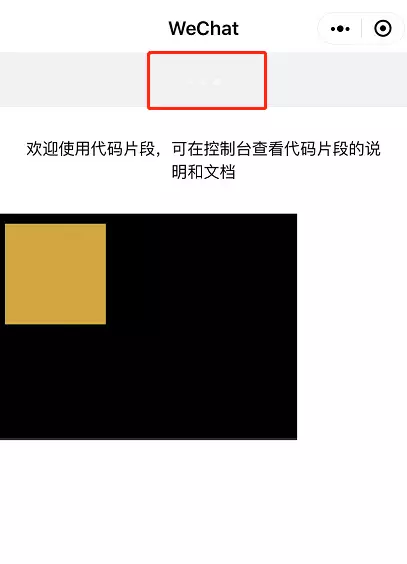
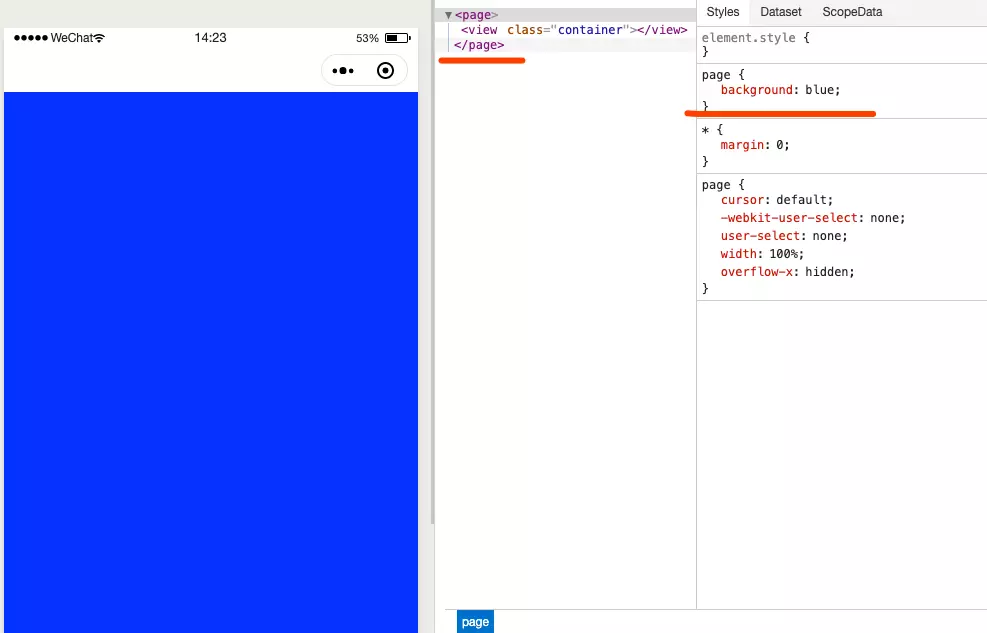
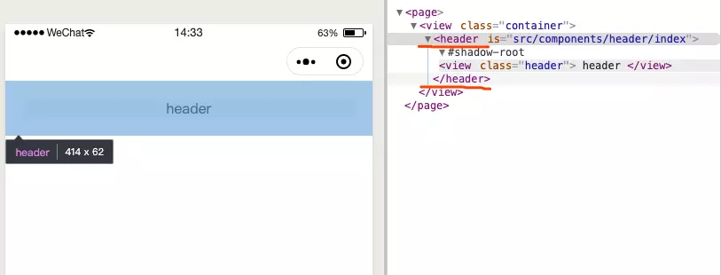
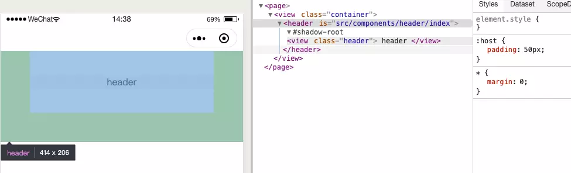
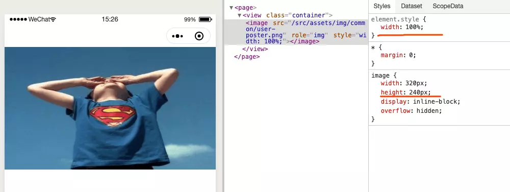
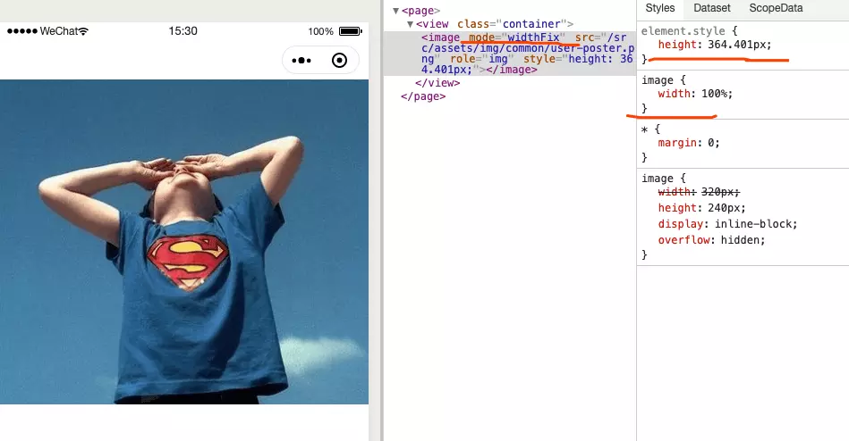

# 微信小程序开发技巧


开发小程序这么久了，整理了一些技巧清单，分享出来。

## 1、backgroundColor 配置无效

页面配置中 `backgroundColor` 可以设置窗口颜色：

```
{
  "backgroundColor": "#f2f2f2"
}
```

这么设置完之后发现一点效果都没有，仔细研究一番，原来窗口颜色指的是最底层。（真想说句：卧槽~）



解决这个问题很简单，使用 `page` 选择器即可：

```
page {
  background: #f2f2f2;
}
复制代码
```

`page` 是页面的根节点，也就是h5里的 `html`，所以可以用来设置一些样式。



## 2、改变自定义组件根节点样式

header组件代码如下：

```
<view class="header">
  header
</view>
```

可以看到渲染出来后发现多出 `header` 节点。



在大部分开发中跟组件节点并没有什么用， `但是` 某些情况下是会影响样式的， 比如说弹性布局，这里不贴demo了，反之此技巧必定用到，回头瞧瞧就行。

我们可以在自定义组件样式文件使用 `:host` 选择器修改跟组件节点：

```
:host {
  padding: 50px;
}
```

可以对比上图盒子模型

  

## 3、block标签是什么

`block` 标签其实就类似于 react 中的 `Fragment`, Vue中的 `template`。

如果没接触过 react/vue 没关系，看下面例子：

```
<block>
  <view>say</view>
  <view>hello</view>
</block>
```

渲染后结果, `block` 节点消失

```
<view>say</view>
<view>hello</view>
```

如果没有`block`节点，需要这么做:

```
<!-- 多渲染了跟节点标签 -->
<view>
  <view>say</view>
  <view>hello</view>
</view>
```

比较常用的用来配合 wx:if

```
<block wx:if="{{ show }}">
  <view wx:for="{{ arr }}" wx:key="index">{{ item }}</view>
</block>
```

## 4、如何设置背景图片

搞个背景图片都费劲 [发火]

平常在h5中设置背景图片直接引入地址就行

```
background: url("/example.png");
```

但是在小程序中竟然不可以。。。

为啥？？？

```
小程序： 你只能乖乖引入网络图片
xx: mmp, 设置个图片都搞那么多花样？ 我觉得...
小程序：我不要你觉得， 我要我觉得。
```

xx了。 只能走后门了。

**1、可以将图片转成 `base64` 即可：**

```
background-image: url("data:image/svg+xml;base64,PHN2ZyBjbGFzcz0ibGRzLXNwaW5uZXIiIHdpZHRoPSIxMDlweCIgIGhlaWdodD0iMTA5cHgiICB4bWxucz0iaHR0cDovL3d3dy53My5vcmcvMjAwMC9zdmciIHhtbG5zOnhsaW5rPSJodHRwOi8vd3d3LnczLm9yZy8xOTk5L3hsaW5rIiB2aWV3Qm94PSIwIDAgMTAwIDEwMCIgcHJlc2VydmVBc3BlY3RSYXRpbz0ieE1pZFlNaWQiIHN0eWxlPSJiYWNrZ3JvdW5kOiBub25lOyI+PGcgdHJhbnNmb3JtPSJyb3RhdGUoMCA1MCA1MCkiPgogIDxyZWN0IHg9IjQ3IiB5PSIyNCIgcng9IjkuNCIgcnk9IjQuOCIgd2lkdGg9IjYiIGhlaWdodD0iMTIiIGZpbGw9IiMwMDAiPgogICAgPGFuaW1hdGUgYXR0cmlidXRlTmFtZT0ib3BhY2l0eSIgdmFsdWVzPSIxOzAiIHRpbWVzPSIwOzEiIGR1cj0iMXMiIGJlZ2luPSItMC45MTY2NjY2NjY2NjY2NjY2cyIgcmVwZWF0Q291bnQ9ImluZGVmaW5pdGUiPjwvYW5pbWF0ZT4KICA8L3JlY3Q+CjwvZz48ZyB0cmFuc2Zvcm09InJvdGF0ZSgzMCA1MCA1MCkiPgogIDxyZWN0IHg9IjQ3IiB5PSIyNCIgcng9IjkuNCIgcnk9IjQuOCIgd2lkdGg9IjYiIGhlaWdodD0iMTIiIGZpbGw9IiMwMDAiPgogICAgPGFuaW1hdGUgYXR0cmlidXRlTmFtZT0ib3BhY2l0eSIgdmFsdWVzPSIxOzAiIHRpbWVzPSIwOzEiIGR1cj0iMXMiIGJlZ2luPSItMC44MzMzMzMzMzMzMzMzMzM0cyIgcmVwZWF0Q291bnQ9ImluZGVmaW5pdGUiPjwvYW5pbWF0ZT4KICA8L3JlY3Q+CjwvZz48ZyB0cmFuc2Zvcm09InJvdGF0ZSg2MCA1MCA1MCkiPgogIDxyZWN0IHg9IjQ3IiB5PSIyNCIgcng9IjkuNCIgcnk9IjQuOCIgd2lkdGg9IjYiIGhlaWdodD0iMTIiIGZpbGw9IiMwMDAiPgogICAgPGFuaW1hdGUgYXR0cmlidXRlTmFtZT0ib3BhY2l0eSIgdmFsdWVzPSIxOzAiIHRpbWVzPSIwOzEiIGR1cj0iMXMiIGJlZ2luPSItMC43NXMiIHJlcGVhdENvdW50PSJpbmRlZmluaXRlIj48L2FuaW1hdGU+CiAgPC9yZWN0Pgo8L2c+PGcgdHJhbnNmb3JtPSJyb3RhdGUoOTAgNTAgNTApIj4KICA8cmVjdCB4PSI0NyIgeT0iMjQiIHJ4PSI5LjQiIHJ5PSI0LjgiIHdpZHRoPSI2IiBoZWlnaHQ9IjEyIiBmaWxsPSIjMDAwIj4KICAgIDxhbmltYXRlIGF0dHJpYnV0ZU5hbWU9Im9wYWNpdHkiIHZhbHVlcz0iMTswIiB0aW1lcz0iMDsxIiBkdXI9IjFzIiBiZWdpbj0iLTAuNjY2NjY2NjY2NjY2NjY2NnMiIHJlcGVhdENvdW50PSJpbmRlZmluaXRlIj48L2FuaW1hdGU+CiAgPC9yZWN0Pgo8L2c+PGcgdHJhbnNmb3JtPSJyb3RhdGUoMTIwIDUwIDUwKSI+CiAgPHJlY3QgeD0iNDciIHk9IjI0IiByeD0iOS40IiByeT0iNC44IiB3aWR0aD0iNiIgaGVpZ2h0PSIxMiIgZmlsbD0iIzAwMCI+CiAgICA8YW5pbWF0ZSBhdHRyaWJ1dGVOYW1lPSJvcGFjaXR5IiB2YWx1ZXM9IjE7MCIgdGltZXM9IjA7MSIgZHVyPSIxcyIgYmVnaW49Ii0wLjU4MzMzMzMzMzMzMzMzMzRzIiByZXBlYXRDb3VudD0iaW5kZWZpbml0ZSI+PC9hbmltYXRlPgogIDwvcmVjdD4KPC9nPjxnIHRyYW5zZm9ybT0icm90YXRlKDE1MCA1MCA1MCkiPgogIDxyZWN0IHg9IjQ3IiB5PSIyNCIgcng9IjkuNCIgcnk9IjQuOCIgd2lkdGg9IjYiIGhlaWdodD0iMTIiIGZpbGw9IiMwMDAiPgogICAgPGFuaW1hdGUgYXR0cmlidXRlTmFtZT0ib3BhY2l0eSIgdmFsdWVzPSIxOzAiIHRpbWVzPSIwOzEiIGR1cj0iMXMiIGJlZ2luPSItMC41cyIgcmVwZWF0Q291bnQ9ImluZGVmaW5pdGUiPjwvYW5pbWF0ZT4KICA8L3JlY3Q+CjwvZz48ZyB0cmFuc2Zvcm09InJvdGF0ZSgxODAgNTAgNTApIj4KICA8cmVjdCB4PSI0NyIgeT0iMjQiIHJ4PSI5LjQiIHJ5PSI0LjgiIHdpZHRoPSI2IiBoZWlnaHQ9IjEyIiBmaWxsPSIjMDAwIj4KICAgIDxhbmltYXRlIGF0dHJpYnV0ZU5hbWU9Im9wYWNpdHkiIHZhbHVlcz0iMTswIiB0aW1lcz0iMDsxIiBkdXI9IjFzIiBiZWdpbj0iLTAuNDE2NjY2NjY2NjY2NjY2N3MiIHJlcGVhdENvdW50PSJpbmRlZmluaXRlIj48L2FuaW1hdGU+CiAgPC9yZWN0Pgo8L2c+PGcgdHJhbnNmb3JtPSJyb3RhdGUoMjEwIDUwIDUwKSI+CiAgPHJlY3QgeD0iNDciIHk9IjI0IiByeD0iOS40IiByeT0iNC44IiB3aWR0aD0iNiIgaGVpZ2h0PSIxMiIgZmlsbD0iIzAwMCI+CiAgICA8YW5pbWF0ZSBhdHRyaWJ1dGVOYW1lPSJvcGFjaXR5IiB2YWx1ZXM9IjE7MCIgdGltZXM9IjA7MSIgZHVyPSIxcyIgYmVnaW49Ii0wLjMzMzMzMzMzMzMzMzMzMzNzIiByZXBlYXRDb3VudD0iaW5kZWZpbml0ZSI+PC9hbmltYXRlPgogIDwvcmVjdD4KPC9nPjxnIHRyYW5zZm9ybT0icm90YXRlKDI0MCA1MCA1MCkiPgogIDxyZWN0IHg9IjQ3IiB5PSIyNCIgcng9IjkuNCIgcnk9IjQuOCIgd2lkdGg9IjYiIGhlaWdodD0iMTIiIGZpbGw9IiMwMDAiPgogICAgPGFuaW1hdGUgYXR0cmlidXRlTmFtZT0ib3BhY2l0eSIgdmFsdWVzPSIxOzAiIHRpbWVzPSIwOzEiIGR1cj0iMXMiIGJlZ2luPSItMC4yNXMiIHJlcGVhdENvdW50PSJpbmRlZmluaXRlIj48L2FuaW1hdGU+CiAgPC9yZWN0Pgo8L2c+PGcgdHJhbnNmb3JtPSJyb3RhdGUoMjcwIDUwIDUwKSI+CiAgPHJlY3QgeD0iNDciIHk9IjI0IiByeD0iOS40IiByeT0iNC44IiB3aWR0aD0iNiIgaGVpZ2h0PSIxMiIgZmlsbD0iIzAwMCI+CiAgICA8YW5pbWF0ZSBhdHRyaWJ1dGVOYW1lPSJvcGFjaXR5IiB2YWx1ZXM9IjE7MCIgdGltZXM9IjA7MSIgZHVyPSIxcyIgYmVnaW49Ii0wLjE2NjY2NjY2NjY2NjY2NjY2cyIgcmVwZWF0Q291bnQ9ImluZGVmaW5pdGUiPjwvYW5pbWF0ZT4KICA8L3JlY3Q+CjwvZz48ZyB0cmFuc2Zvcm09InJvdGF0ZSgzMDAgNTAgNTApIj4KICA8cmVjdCB4PSI0NyIgeT0iMjQiIHJ4PSI5LjQiIHJ5PSI0LjgiIHdpZHRoPSI2IiBoZWlnaHQ9IjEyIiBmaWxsPSIjMDAwIj4KICAgIDxhbmltYXRlIGF0dHJpYnV0ZU5hbWU9Im9wYWNpdHkiIHZhbHVlcz0iMTswIiB0aW1lcz0iMDsxIiBkdXI9IjFzIiBiZWdpbj0iLTAuMDgzMzMzMzMzMzMzMzMzMzNzIiByZXBlYXRDb3VudD0iaW5kZWZpbml0ZSI+PC9hbmltYXRlPgogIDwvcmVjdD4KPC9nPjxnIHRyYW5zZm9ybT0icm90YXRlKDMzMCA1MCA1MCkiPgogIDxyZWN0IHg9IjQ3IiB5PSIyNCIgcng9IjkuNCIgcnk9IjQuOCIgd2lkdGg9IjYiIGhlaWdodD0iMTIiIGZpbGw9IiMwMDAiPgogICAgPGFuaW1hdGUgYXR0cmlidXRlTmFtZT0ib3BhY2l0eSIgdmFsdWVzPSIxOzAiIHRpbWVzPSIwOzEiIGR1cj0iMXMiIGJlZ2luPSIwcyIgcmVwZWF0Q291bnQ9ImluZGVmaW5pdGUiPjwvYW5pbWF0ZT4KICA8L3JlY3Q+CjwvZz48L3N2Zz4=");
```

**2、内联节点中使用 `backgorund-image`**

```
<view style="background-image: url(example.png)">
</view>
```

这个方法我就不该说出来~ 因为在真机是无效的。。。（欲哭无泪）

**3、使用 `image`** 这个方法我也懒得详细贴`demo`了， 总之就是使用 `image` 改改样式设置到底部即可。

```
<view>
  <image src="example.png" />
</view>
```

最后：现在的项目本地图片使用是非常少的，反正我见过的项目最多也就几张。 所以设置背景图片最简单的方法就是使用`base64`。

## 5、object-fit无效

在h5中使用 `object-fit` 特性是非常多的，它可以对图片保持一定的比例，而不会发生变形， 如果想了解其具体内容到 [MDN](https://developer.mozilla.org/zh-CN/docs/Web/CSS/object-fit)

在小程序中对图片使用此特性是没有效果的

```
.image {
  object-fit: cover;
}
```

解决这个问题也很简单，使用小程序自带的属性即可

```
<image src="example.png" mode="aspectFill"></image>
```

具体属性可到官方查看 [mode属性一览](https://developers.weixin.qq.com/miniprogram/dev/component/image.html)

## 6、小程序mock数据

在WEB开发中我们会使用 `mockjs` 进行拦截请求从而模拟数据。

在小程序中也可以使用吗？ 那当然了， 只不过要对小程序 `wx.request` 处理。

1、安装 `mockjs`

```
npm i mockjs
```

2、新建 wxMock.js

```
// 有点水平的应该能看得懂
// 微信底层API都是不能重写的，所以用到 defineProperty 将其设置可写
// 之后重写了底层 wx.request 方法，然后做些处理即可

const __request = wx.request;
const Mock = require('mockjs');

Object.defineProperty(wx, 'request', { writable: true });

wx.request = function (config) {
  if (typeof Mock._mocked[config.url] === 'undefined') {
    __request(config);
    return;
  }

  const resTemplate = Mock._mocked[config.url].template;
  const response = Mock.mock(resTemplate);

  if (typeof config.success === 'function') {
    config.success(response)
  }
  
  if (typeof config.complete === 'function') {
    config.complete(response)
  }
};

module.exports = Mock;
```

3、使用 wxMock.js

```
const Mock = require('wxMock.js')

// 平常怎么用的就怎么用
Mock.mock('/api/example', {
  data: { ... }
})
```

4、在app.js入口文件中引入mock

```
import "./mock/index.js";
```

## 7、图片宽度100%，高度无法自适应

在WEB开发中当把图片设置 100% 时，高度会自适应。

小程序就是不行，不行你看：



因为小程序底层已经对 `image` 添加了宽高了，所以默认就是 `240px`。

解决方法是给 `image` 元素添加 `mode` 属性

```
<image src="example.png" mode="widthFix"></image>
复制代码
```

当添加此模式并给图片设置 100% 宽度后，小程序自动计算其高度，就可以让图片自适应了。



## 8、properties 能定义多个类型吗？

我只能先说`可以`。

此特性是小程序基础库`2.6.5`新增的，可能有些小伙伴不知道。

optionalTypes 字段是个数组，指定属性类型，可以多个。

```
Component({
  properties: {
    lastLeaf: {
      // 这个属性可以是 Number 、 String 、 Object 三种类型中的一种
      type: Number,
      optionalTypes: [String, Object],
      value: 0
    }
  }
})
```

## 9、跳转到tabbar无法返回上一层

这个问题我估计每一个开发者都经历过。

常规页面跳转到 `tabbar` 页面只能使用 `wx.switchTab` ，此API有个问题是：**跳转到 tabBar 页面，并关闭其他所有非 tabBar 页面**

所以当跳转到 tabbar 页面左上角返回键自然就没了，所以是无法返回上一层的。

用得比较多的场景就是购物车了， 某个页面跳转到购物车不可以返回上一层那体验不是很差么。

这个问题我就不贴demo了，说下其方案。

- 自定义导航头部，新增一个返回键
- 自定义 tabbar 组件， 这个时候就不存在什么 switchTab 跳转了
- 将购物车页面封装成一个组件，然后新建2个页面，一个作为tabbar，一个作为常规页面，目前jd使用这种方案。

## 总结

微信小程序开发和 web 还是有一些区别的， 小程序的开发灵活度虽然现在没有那么高，但随着不断的迭代更新，会慢慢得到改善，并受到众多开发者的喜爱。

这篇文章不会断更，只要有些好的技巧会总结下来并分享。