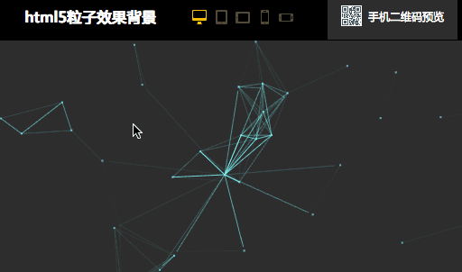

# 大数据可视化大屏设计经验

> 大数据产业正在用一个超乎我们想象的速度蓬勃发展，大数据时代的来临，越来越多的公司开始意识到数据资源的管理和运用，大数据可视化大屏展示被更多的企业青睐，身为UI设计师的我们，也要紧跟时代的步伐学习这方面的设计。

今天要跟大家分享我一年多设计大数据可视化大屏的经验和观点，下面从**UI设计、交互设计、动效设计**三个方面来分享。

## 一、UI设计

设计大屏一样要谨记要以展示数据为核心，在任何炫酷屌炸天表现都要建立在不影响数据的有效展示上！

下图是天猫可视化大屏设计，图中屌炸天的3D地球围绕粒子效果，这篇文章将教你怎么实现，而且是数据可视化的呈现，不是动效或者视频！

天猫双十一可视化大屏

### 1. 拼接大屏

大屏几乎都是拼接屏，UI设计时不用考虑屏幕缝隙影响内容的呈现，内容不会丢失，但有可能影响视觉的表现，例如一个很大的人物图像被缝隙正中“劈成”两半，或者“劈中”了眼睛，看起来很不舒服

所以设计时可以建立缝隙位置的参考线避免类似情况发生。（现在企业常用的有无缝隙、1.7mm缝隙、3.5mm缝隙、三种拼接大屏，缝隙越小越贵）

### 2. 设计尺寸

拼接的每块小屏一般是16:9的高清屏，设计尺寸可以把上下高度设定为1080px，长度按照拼接屏的数量比例得出长度的设计尺寸。

例如3乘5的一块大屏幕，高度3块屏设为1080，每块高就是360，360除9乘16等640，640就是一块屏幕的长度，640乘5块屏＝3200最后得出设计稿尺寸就是：高1080px乘宽3200px（在这里感谢我的数学老师）

拼接屏设计尺寸图解

### 3. 视觉设计

首先了解需求，整合数据，分析出主要数据次要数据、总量数据细分数据、各数据的维度等等，通过了解这些可以先设计出一个布局模版，也可以在纸上画出来，布局可以在设计过程中随时调整。

设计的风格，背景色一般用深色调，深色调紧张感强，让视觉更好的聚焦，大屏暗色调看上去更柔和舒服不刺眼，也会较省电。

大屏设计跟网页不一样，页面不能有滚动条，大屏的长宽都是固定的。

字号跟网页设计一样不小于12号字，可以用于图表的标注，数据信息建议14号字以上，大屏观者远距离才能看全内容，所以字号可以稍大一点。字体不一定只用一种，可以用到一些科技感强的字体，这里要注意，记得把字体给开发一份。

设计完成先去大屏上看一下效果，大屏的品质不一样色调也会有很大的差别，要根据自家的大屏呈现效果做调整。

下面分享一个开源的jquery插件库网站，里面有很多很棒的动态效果！

> http://www.jq22.com/

插件库其中的一个效果

大屏设计会给设计师很大的想象设计空间，尽情发挥你的能力吧！

## 二、交互设计

我把大数据可视化大屏分为两种，一种“纯展示型”另一种“展示＋功能型”，具体怎么区分：

**纯展示型**几乎没有交互，后台录入数据，在大屏上展示就行了。

**展示＋功能型**，例如实时监控数据、采集数据、数据对比功能、云计算数据、分析与预警等等。

这里就着重说一下带有功能型的大屏产品的结构层（信息架构），一切功能结构都要围绕核心数据主页面来架构，因为大屏展示的核心就是将一些业务的关键指标数据以数据可视化的方式展示出来。

功能型大数据可视化大屏结构层（信息架构）

大屏的交互，区别于网页和。首先要清楚一点，大屏使用群体可能就是公司内部的几个人，而非面向广大用户群体。从这个维度上考虑，交互就可以弱化一些引导性的元素，例如一个可点击的数据组件，就可以不加“点击进入”按钮。

也可以设计隐藏式的交互方式，例如鼠标左移动、上移动、出来控制面板（Mac电脑就有这样的交互方式），有控制台是触摸屏也可以结合手势来设计交互方式。

为了让用户感知到一直停留在主页面上，交互上跳转页面能用“关闭”按钮就不用“返回”按钮！

## 三、动效设计

大数据可视化大屏设计少不了动效，动效是可视化重要的组成部分，动效的增加能让大屏看上去是活的，增加观感体验。但过分的动效极其容易喧宾夺主，让观看者的眼球不知道往哪里聚焦，反而弱化了数据的展示。

什么是过度的动效设计？这个度又该怎么把握？

看下图动效设计过度的一个案例，当你试着去看图表的内容，你的眼球一次一次的被闪动的边框抓走，这就是过度的动效设计！

（图片来源网络）

把握动效设计这个度其实并不难，只要看的舒服不影响数据清晰展示就可以，有数据展示的页面最好动的地方不易过多。如果要多，几个动画就得有节奏的变化，例如一个动画表现的视觉强，另一个就表现稍弱化，有强有弱、有主有次节奏才会舒服，同时动效能结合数据的变化而变化最好，这样就不容易看数据内容被动画抓走眼球。

### 1. 动效怎么实现？

我习惯用AE的插件Bodymovin生成json文件实现，具体怎么操作之前写过，这里就不多讲了。

json文件

Bodymovin这个工具在AE中有些预设效果和透视功能是不支持的，所以再教大家另一种方法，就是把动画渲染成视频，把格式转换为ogg或者webm网页视频格式，网页格式视频加载是非常快的，之后把下面的文件给开发就可以了。

html5网页视频格式

### 2. 3D动效怎么实现？

3D动画

先说下用到的软件C4D+AE+PS

**步骤1：**

找个模型也可以用C4D自带的模型，还可以自己建模，有了模型在C4D中把模型变成晶格状，做个旋转360度动画，渲染出png序列帧。

**步骤2：**

把ps设计好的视觉稿和序列帧图片导入AE中，如果要用Bodymovin插件实现，就得把全部序列帧每张分开导入，不然Bodymovin不能识别序列帧，只能用网页视频格式实现！

大概就是这样流程，可能说的不是很详细请见谅，有不明白的地方可以随时问我！

### 3. 3D地球可视化

开篇给大家留个悬念，怎么设计3D地球动画，下面就教你。

天猫双十一阿里的3D地球是有专门人员设计的，阿里也有这方面的组件库。我们可以用开源网站类似组件来实现，大数据页面用到的图表这个网站几乎都有，且免费。

> 网址：http://echarts.baidu.com/index.html

echarts组件效果

最终的效果是用两个组件拼合在一起实现的，左边就是代码，后台录入信息可以让粒子效果匹配数据，最终实现数据的可视化。

echarts网站

> 再推荐一个组件网站：https://www.hcharts.cn/

Highcharts网站

同样的很多图表组件，两个网站都可以用，下面介绍一下两个网站的优缺点。

**（1） Echarts：**

优点：免费、开源、效果炫酷、原生全中文。

缺点：兼容性差、经常报错、文档不够详情。

**（2） Highcharts：**

优点：文档实例很详细、易懂易学、兼容性强可兼容到IE6。

缺点：收费。

## 四、总结

大屏设计是一个长期跟进的过程，有很多问题会在数据真正进来时，放在大屏上才能发现，所以等产品做到落地时设计方面要积极跟进改进。

好了就这么多感谢阅读，希望这篇文章对你有一点用！

 

作者：吴星辰，微信公众号：互联网设计帮

本文由 @吴星辰 原创发布于人人都是产品经理。未经许可，禁止转载。

题图来自Unsplash，基于CC0协议