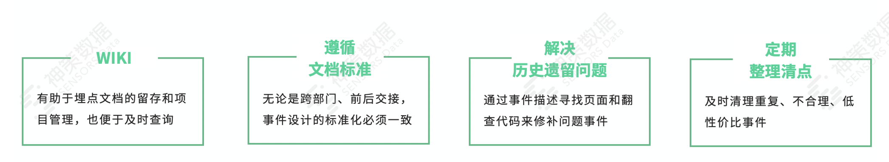

# [如何从 0 到 1 构建埋点体系](https://my.oschina.net/u/4161891/blog/5005922)

本文根据资深数据产品经理陈家崑《从 0 到 1 埋点体系指南》的分享内容整理。主要内容如下：
· 首次开荒指南
· 埋点体系迭代指南
· 体系落地指南
· 数据埋点实操案例

#### 一、开荒

所谓开荒，指的是初次接触埋点或神策的阶段。

1.定位：一个容易忽视的仪式

关于埋点系统的定位，需要想清楚三个问题：
第一，有没有清晰的认知，埋点系统所承担的用途是什么？
作为业务埋点对接人，需要想清楚埋点系统所承担的用途是什么？它在整个公司业务体系中的定位是什么？如果没有对这个工具定位好，后续推广使用及跨部门合作时，可能会产生冲突或者与其他工具的定位重复或矛盾。
第二，有没有明确的需求，而不是“为了埋点而埋点”。
在面临具体埋点需求时，需要进一步明确它的使用价值是什么、能为业务解决什么问题。在我过往接触过的业务线中，有的为了埋点而埋点，没有想清楚具体该怎么使用，这样很容易造成大量垃圾数据。
尤其当用户客群较大时，对应的数据量也是非常凶猛的，常常令人措手不及，比如使用若干个月后，发现线上存储空间不足，系统性能不够等，这些问题的治理繁琐又困难。
第三，有没有明确的规划？
在实际调动公司资源去落地构建埋点体系时，需要一定的节奏。因为正常产品开发也需要遵循着这样的原则，要进行一定的规划。
总之，基于这三个问题，我们要考虑清楚定位。

2.把埋点体系作为数据中台或 BI 体系的重要组成部分

埋点系统和数据仓库、分析体系、预警系统等子系统一样，需要放入整个公司的业务体系和数据体系里，方便统一规划。
不得不说，神策的不可替代性很强。因为埋点采集技术难度较大，如果没有经验的话，成本就比较高。
至于成为整个数据体系有什么样的好处呢？
首先，可以把行为数据作为数据体系的一部分进行整合。
行为数据，换一个角度看也是一种业务数据，这种数据在业务系统里无法采集。建议把它作为一个数据源，方便把整个用户行为数据关联到业务或外部数据。
其次，可以把此时此刻的用户数据特征作为属性补充行为数据。
整个数据体系中，有些数据在前端埋点时无法采集。比如在做某些优惠券逻辑时，只会传一个 ID 到前端页面上，实际再去埋点时，也只能拿到这些 ID 信息，其他无法采集。解决这个问题有很多办法，但通过前端业务侧解决的方式，通常风险比较大，因为要考虑接口设计、性能及各种并发问题，如果把这些数据问题放在业务侧，将会受到一定的阻力。
而如果通过数据侧解决会相对容易，比如把 ID 采集回来后，它的优惠价格、历史信息及其所承载的数据含义等信息，在数据侧都可以直接关联。

3.以项目视角看产品

之所以谈到项目化，因为埋点体系搭建既是一个产品规划问题，也是一个项目管理问题。建议在开荒阶段，就要把这个项目的过程筹备好。
接下来根据自己过往所经历的项目筹建经历，跟大家分享一些实操经验。 

 

第一，树立项目意识，因为它既是一个产品规划问题，也是一个项目管理问题。
第二，制定标准化流程，包括需求收集、讨论、评审，到开发、测试、上线、迭代等，任何在前后端进行开发所需要经历的过程，一个都不能缺少。
如果缺少了某个环节就容易产生大的问题，比如如果没有测试，那数据质量就无法保证，一旦产生问题，如何修复大量的数据，如何补充属性纠正问题，都是比较麻烦的事情。
第三，明确项目内外的角色和分工，以我过往项目经历为例，当时把来自不同的业务线的同事，比如客户端、策略后台算法、分析师等组成虚拟团队，集中明确各自分工，这里特别强调下技术和测试环节。
技术环节，建议项目相关的技术同学都要去熟悉相关文档，如果不熟悉就直接上手操作，加上不同技术同事轮流去做，会很难沉淀下来一些方法论。
测试环节也一样，如何使用埋点工具、如何在控制台排查问题，测试同事都需要一定的时间去熟悉。可能只有经过两次版本迭代后，才会对整个流程熟悉，做到心里有数。建议大家重点培养测试同学对数据问题的敏感性。只有保证整个测试环节的质量没有问题，后续的分析算法的应用才能真正能发挥出价值。
第四，确认技术点，这里需要注意一些细则，比如用户 ID 是一对一的关联，还是一对多的关联？以电商公司为例，涉及到买手机的场景时，很多用户都是拿着旧手机买新手机，建议做成一对多的关系，因为很多用户拿来的旧手机基本不用了，如果成交，做成一对一关联的话就会被误认为是两个用户。
第五，关于使用边界或项目边界问题，在日常做埋点时，经常会面临不同的业务线同步进行，这时就需要明确各业务线的边界。涉及到各业务线私有的东西，每条业务线自己负责，而涉及到公共的东西，需要大家一起去完善和维护。
第六，关于项目筹划，建议把相关责任人用清单的方式列下来，明确各自责任，并且通过邮件等方式公开留底，后续再去推广业务时会比较顺畅。

4.需求整理最好前置

第一，埋点规划。在对埋点需求进行规划时，切忌一次性完成大量需求，最好对需求进行优先级排序处理，这样有助于管理产品文档，如果一次性处理几百个埋点，加上涉及到跨部门协同，撰写时难免会有纰漏，所以埋点规划的节奏非常重要。
第二，用户属性。设计埋点时要考虑用户属性设计。设计用户属性时，需要遵循一个最基本的原则，就是通过事件分析系统、用户标签、用户画像系统计算出来的东西，就不要单独上报埋点。
比如想要获取用户近几日的消费单数，或是确认他是否为 VIP 用户，这些数据需求都可以通过事件计算出来。如果再单独埋点，不但会浪费开发资源，而且上报来的结果远不如整个系统内环计算来的灵活。
需要注意的是，下面两个属性非常值得埋。一个是静态属性，比如说用户年龄、性别等，这些静态属性无法算出来，很有埋点的必要。另一个是通过算法和数据挖掘产生的挖掘标签，也值得单独埋点。
第三，了解预制属性。建议大家多多通读了解预制属性，一方面是防止事件所采集的属性，跟预制属性有所重叠。
另一方面，通过预制属性，可以了解各端的数据特性，比如小程序的特性如何，它在封闭环境里可以返回哪些数据、不返回哪些数据？比如 H5 特性如何，客户端特性如何等等。
第四，确定节点口径。通常，一个事件会有很多下沉节点，比如某个按钮的点击事件，从用户在 APP 层的点击，到 APP 去请求应用接口，到服务器去确定接口，接到了请求后，到业务侧后台系统处理这个请求时是否成功，再到最后是否能把结果成功返回给客户端。
因此，整理需求做事件设计时，一定要明确它的节点口径，明确需要在什么样的层级采集。具体来看，一方面需要想清楚在哪个节点采集，另一方面也要看具体需求，在什么样的环境采集。通常来说，越靠近 APP 端，它所采集的事件越大，但可能对比业务端来说，它的准确性会相对较低。

#### 二、迭代

完成了前面的基础工作后，埋点体系经过 1-2 个版本后初见成效，这时开始面临如何拓展使用，如何管理大量的数据需求的问题。同时，还伴随着如下问题：随着时间的推移埋点文档越写越多、越写越乱；不清楚的埋点定义越来越多；相关项目人员离职，未做相关交接等。

1.事件分类

 

根据所要埋的事件类型进行分类很有必要，一方面方便对需求进行优先级确认，另一方面设计埋点时，不同类型的事件需要对应各自的方法。
（1）通用事件
对于通用的、泛化性的、活动等次要流程事件，可以进行抽象化处理。 比如，在日常工作中，经常遇到市场或活动运营同事提出某次活动的埋点需求，如果每次活动都单独处理成一个事件，随着时间的推移将会导致同类事件越积越多，不利于管理，因此对于这类相关的事件，需要进行抽象化的通用事件处理。
（2）边缘事件
所谓边缘事件，指的是零散的只查看点击或浏览行为的事件，比如 APP 端诸如设置、客服入口等功能按钮。
处理此类事件，有两种常见方法：
一种是做一个最基本的自定义事件容器，然后把相关按钮名称、所在页面及其他零散东西抽象化后放进去。
另一种是手动纠正一些全埋点进行上报。之所以要手动纠正，是因为前后端的技术架构不同，没有办法 100% 地适应全埋点，当全埋点数据出现未知或无法采集时，需要手动调 SDK，纠正所要采集的页面。

2.事件管理方法

当处理的事件数量越来越多时，就需要进行相应的管理，具体方法如下  

第一，关于埋点系统的 WIKI 文档一定要放到云端留存，方便项目管理和及时查询；
第二，为了方便跨部门沟通和前后交接，埋点体系项目组成员在撰写 WIKI 文档时，最好明确出一套文档规范，防止以各自形式撰写，导致后续加入的人查看时摸不着头脑；
第三，通过事件描述寻找页面和翻查代码来修补问题事件，方便解决历史遗留问题；
第四，定期进行清点和梳理，具体可以在 admin 账号里进行系统诊断，定期地导出诊断报告，便于对不合理、低性价比事件及时进行清理。

3.问题排查技巧

问题排查这块，主要讲日常应用中常遇到的三个问题。
第一，数据一致性问题。当埋点系统收集的数据和业务端、BI 等系统数据节点或口径不一致时，该如何处理？
比如，关于新用户与老用户的定义差异，当埋点所定义的概念和市场及运营端同事的口径不同时，就会造成数据对不上的问题。如何应对这种情况呢？建议先跟运营或是对应的产品同事了解相关指标，它的口径和节点是怎样的，及时去修改属性和描述，比如不要笼统地定义为老用户或新用户，而是定义为注册用户、认证用户或下单用户等。
第二，关于准确性挑战。把埋点系统的数据与业务端、BI 端数据进行校对，基本上三个数据大体一致。当然也不排除三端同时出现数据错误，这需要根据实际情况进行纠正。
第三，关于未知和空数据。出现这种情况的原因有很多，但有一种情况我们可以提前避免，就是在事先设计和定义属性时，一定要考虑到这个属性的空状态下该如何上报？是 0 还是空，具体如何处理需要提前考虑清楚。

4.多项目处理方法

如果同时接到多条业务线的埋点需求时，该如何选择，是在一个项目里埋多个应用，还是把它们隔离成不同的项目？如果做项目隔离，又涉及到从头开始做的问题，成本较高，这时又该如何处理？

  

首先，用户是最重要的基准，是否需要区分项目，取决于应用用户的关联性。
如果业务线之间没有任何用户关联，这种情况就需要隔离处理，不仅数据和系统需要隔离，事件管理也需要隔离。比如涉及到属性在命名上的冲突，或某些事件的冲突，会导致后面做埋点时，相同命名的属性会报错。 至于在实际处理时，是进行项目合并还是隔离，需要对数据互通与数据管理问题进行权衡。一方面是要考虑到数据隔离后，后续不便于做关联分析，另一方面也要考虑到如果项目关联过多，会导致管理难的问题，具体抉择需要具体权衡。

5.巧用数据导入

数据导入作为一个小工具，可以解决老用户标注问题，及时补充老用户数据。
在业务上线之后，通常那些在埋点之前已有的老用户，会被错误地定义成新用户，这时就可以通过数据导入工具，导入存量数据解决老用户标注问题。
其次，通过这个工具，还可以修补因为错误埋点而导致的数据问题。
最后，这个工具可以对数据维度表做有力的补充。比如采集来的订单数据里，有很多 ID、优惠券、活动等信息都没有做关联，这时通过数据导入工具，可以补充维护商品表信息，而不再需要额外地改造业务侧数据。

#### 三、如何落实应用？

1.推广使用方法

推广使用一般有三种方式：

  

第一，日常培训，即对业务方的产品交付进行培训讲解。
第二，内部资料，编写内部资料、说明手册，有助于持续输出。
第三，保持沟通，项目内外保持沟通，保证埋点的准确及迭代。
首先，这三个推广方法息息相关，最好同时进行。
其次，所讲的文档要跟日常的培训一一对应，考虑到产品相对复杂，加上人员迭代，在编写内部资料时最好写得详细，这样可以减少很多不必要的重复沟通。
最后，要和业务同事保持沟通，有助于后续更好地优化这套埋点体系。

2.渠道管理指南

说到渠道管理，通常大家都会通过渠道标识、活跃留存、漏斗等工具进行渠道评估。在实际应用过程中，不夸张的说，神策的渠道管理体系是我见过最好的一套管理体系。

  

过往遇到的其他关于用户渠道管理体系，大多只有一个渠道标识。如果可能，建议大家还是尽量通过多维度的渠道标识规则，完善现有体系。比如某用户从新浪微博来，这是一层渠道标识，那它具体从微博的哪个活动来的呢，就可以再去打一层渠道标识。
另外，通过分析渠道的用户数据表现可以了解重要的用户属性，从而赋能业务。
比如，通过渠道数据可以宏观地看到从微博活动过来的用户有什么特征？同时可以细分微博活动效果，比如某个账号或某次活动具体效果如何？再比如，从抖音来的用户和从微博来的用户各有哪些不同的特质，它们的转化率有何差异？根据这些分析结果，不断完善市场投放思路。

3.小工具使用技巧

这部分主要讲一些实用小工具，它们可以帮助我们更好地使用神策。 第一，廉价存储，当业务积累了大量的事件数据后，通常会发现集群存储线上热数据存储空间满了，这时要及时进行冷数据分离，多历史数据进行归档。因为它的查询频次较低，日常价值也不大。
第二，数据导入工具之前已经做过详细介绍，这里不再重复赘述。
第三，关于 JDBC，当我们把 BI 侧的行为数据和用户数据需要进行关联时，可以考虑通过 JDBC 直连把数据拉出来进行分析。
最后，重点分享 MQ 的妙用。在后端埋点时，会遇到一个很大的问题：当在集群上去部署 Log 服务时，如果服务没起来，落到集群上的数据无法上报的，这会导致数据丢失。这种情况对于后端埋点上报可以说是一个灾难性的问题。那需要怎么解决呢？
其实如果企业内部有微服务体系的话，建议把后端埋点做成一个独立的微服务，然后再去总线抓所有的事件，定义注册用户、订阅用户下单等。同时这样做还有一个好处，就是我们从用户侧收集来的数据订单可以和 BI 侧、数据侧进行更详实的关联，这相当于在入库之前做了进一步的数据处理。
此外，神策系统里的 Kafka 等应用也支持功能迭代。比如订阅用户的启动事件、订阅 VIP 用户的启动事件、订阅用户的下单事件等，都可以通过神策系统导出来。

#### 四、数据埋点实操案例

最后，分享一个我之前做的项目，一个实操案例。

1.什么是 GBDT？

之前业务方有过这样一个需求：点击过哪些事件的用户，比较有可能成为下单用户？中间尝试了很多分析办法，但我最终选择通过数据挖掘，通过 GBDT 来找答案。
什么是 GBDT？简言之就是：Gradient Boosting Decision Tree。这里不详细展开相关定义。本质上，它解决的就是找到那些拥有某些特征的用户，就应该是业务的下单用户，然后再把这个模型套进来，从而找到那些最终没有下单的用户。
选择 GBDT 其实有两个原因：
第一，特征清晰。这种方式便于特征工程的处理，通过它可以很简易获取清晰的特征。通过埋点系统可以对相关数据进行提取，甚至大概有一些 Python 基础就可以完成。
第二，泛化性强，对新数据的适应性强，适用于较为复杂的行为数据特征作为样本。在埋点上用这个模型，性价比非常高，可以解决很多回归问题。

2.具体实践流程

 

首先，进行特征构建。比如对已下单的用户，根据过往的运营经验和策略进行特征构建：比如他是否点击过网点、是否关注过促销活动、在活动页面浏览了时间多长、所在地区、在什么样的地方打开等。
然后，把符合这些特征完成下单的用户拿出来，最终找到模型权重进行训练和评估。
最后，再把这个模型去套入现有线上数据进行相关预测，方便对用户进行召回或进一步分析流失原因。
比如，通过算法模型可以快速地找到某些完全符合这些下单特征的用户，比如他浏览的时间足够长、他关注过活动等，他具备归纳出的下单特征但却没有下单，就可以进一步分析流失的原因。同时还可以分析哪些特征对用户下单决策影响最大。