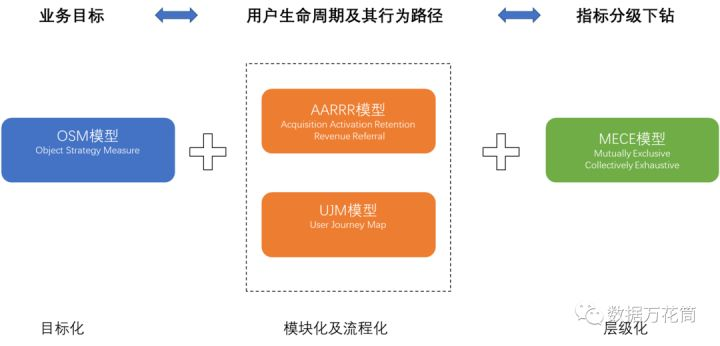
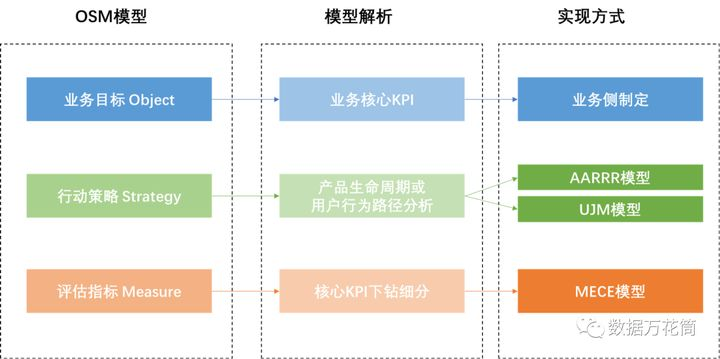
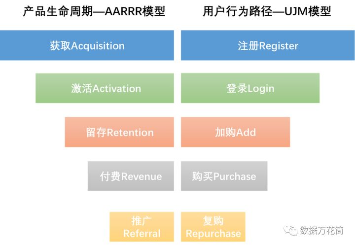
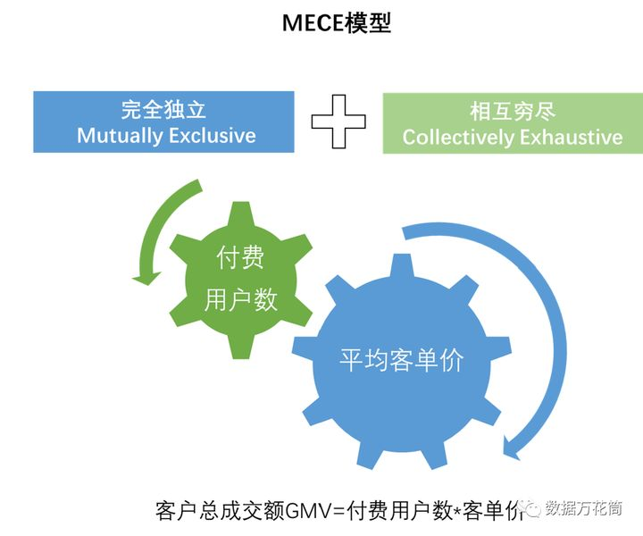
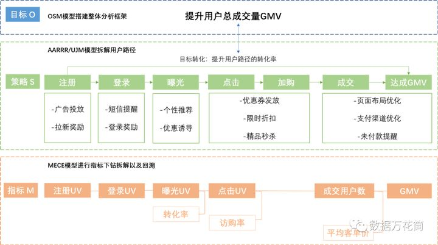
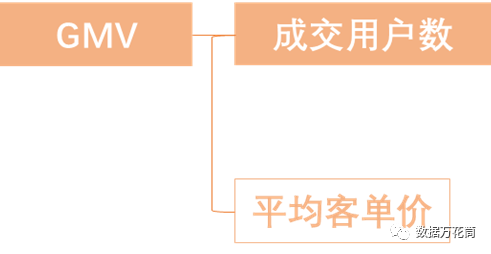
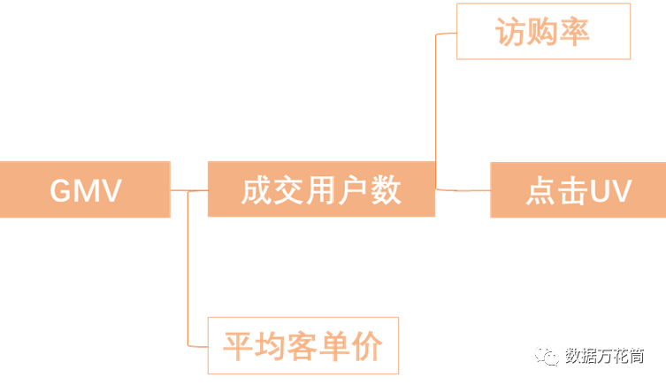
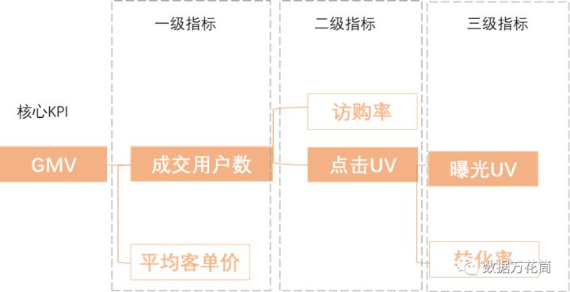

# 指标体系|四个模型教会你指标体系构建的方法

作为数据分析师，构建数据指标体系是较为基础但是极为重要的工作内容。好的指标体系能够监控业务变化，当业务出现问题时，分析师们通过指标体系进行问题回溯和下钻能够准确地定位到问题，反馈给业务让其解决相应的问题。这就是指标体系存在的意义和数据分析师的价值所在。那如何才能建设一套能够实时监控业务变化且能迅速定位业务问题的指标体系呢？小编今天会用三个步骤，四个模型教会大家指标体系的构建方法。

## 构建数据指标体系的方法概括

数据指标体系建设的方法可以总结为三个步骤，即明确业务目标，理清用户生命周期以及行为路径以及指标分层治理，在这三个步骤当中又涉及到 OSM(Object,Strategy,Measure),AARRR(Acquisition,Activation,Retention,Revenue,Referral),UJM(User, Journey, Map), MECE (Mutually Exclusive, Collectively Exhaustive) 四个模型，这四个模型是指导我们构建完整而清晰的指标体系的方法论。

小编整合这四个模型，为大家梳理了一套建设指标体系的流程和方法。

## 三个步骤，四个模型方法论

**1.OSM模型-明确业务目标，数据赋能业务**

OSM模型是 Object, Strategy, Measure的缩写。数据服务于业务才能赋能业务，数据脱离业务，那么数据就会失去其价值。

所以，我们在建立数据指标体系之前，一定要清晰的了解业务目标，也就是模型中的O,Object。换句话说，业务的目标也就是业务的核心KPI，了解业务的核心KPI能够帮助我们快速理清指标体系的方向。

了解业务目标方向之后，就需要制定相应的行动策略，也就是模型中的S,Strategy。行动策略的制定可以根据产品生命周期或者用户行为路径进行拆解，也就是把业务的核心KPI拆解到产品生命周期(AARRR)或者用户行为路径(UJM)当中，在整条链路当中分析可以提升核心KPI的点。

最后，就需要我们制定较细的评估指标，也就是模型中的M,Measure。评估指标的制定是将产品链路或者行为路径中的各个核心KPI进行下钻细分，这里用到的方法就是麦肯锡著名的MECE模型，需保证每个细分指标是完全独立且相互穷尽的。

总结一下OSM模型的内容及其与AARRR,UJM,MECE模型之间的关系，OSM模型是指标体系建设的指导思想，理解业务KPI是OSM模型的核心；制定行动策略是实现业务KPI的手段，而AARRR和UJM模型是实现策略制定的方法论；制定细分指标是评估业务策略优劣的方法，而MECE模型制定细分指标的方法论。

**2.AARRR模型和UJM模型--理清用户生命周期以及行为路径**

前面我们提到AARRR和UJM模型是实现策略制定的方法论，对于刚入门或者想要转行的朋友来说，可能对这两个模型都还很陌生，下面我们就简单的介绍下这两个模型。

AARRR和UJM模型都是路径模型，二者原理相似，只是它们出发的角度不一样。AARRR模型是从产品角度出发，揭示产品的整个生命周期；而UJM模型是从用户出发，揭示用户的行为路径。

AARRR模型是基于产品角度，简单地来说就是拉新，促活，留存，付费，推广。对于一款产品来说，我们首先要从各个渠道获取用户；其次需要激活这些用户并让他们留存下来；对于留存下来的用户引导他们付费以及推广产品。

UJM模型则是从用户角度出发，描述了用户进入产品的整个路径流程，即注册，登陆，加购，购买，复购链路流程。

无论是产品角度还是用户角度进行链路流程，核心KPI都可以下钻到相应的节点，这样我们就在整条链路流程当中拆解了业务的核心KPI。这样的好处是，我们可以从更多的角度和维度监控和分析业务问题。

**3.MECE模型--指标体系分级治理**

前面两个步骤，首先我们明确了业务核心目标；其次，我们将业务核心的KPI下钻到产品生命周期或者用户路径行为中；接下来我们需要对这些核心KPI向下进行三到五层的拆解，这个过程我们成为指标体系分级治理，用到的模型是MECE模型。MECE模型的指导思想是完全独立，相互穷尽，根据这个原则拆分可以暴露业务最本质的问题，帮助数据分析师们快速地定位业务问题。例如，客户总成交额GMV进行以及拆解可以是付费用户数与平均客单价的乘积。

## 以GMV为例，用三个步骤，四个模型教会你搭建指标体系的方法

如果你的老板给出你一个很大的业务问题，他说，“我们现在做一套GMV相关的指标体系，你出一个方案吧！”面对这么大的一个命题，我们就需要对命题进行分解，将其分解成若干个子问题并找到各个子问题之间的联系，做成一套业务监控指标体系，帮助数据分析师快速定义业务问题。在这里，我们就通过上面提到的三个步骤，四个模型去搭建GMV相关的指标体系。

第一步，根据OSM模型构建整体框架，明确业务目标。

为什么业务会关注GMV？当然这是业务的核心KPI，关系到自己的饭碗，GMV当然越高越年终奖越高。所以，作为数据分析师我们提炼出业务目标——提升用户总成交量GMV。

第二步，根据AARRR或UJM模型拆解用户达成GMV的路径，将业务目标转换为提升用户路径转化率。

用户达成GMV需要通过六个步骤，即注册-登录-曝光-点击-加购-成交。到目前为止，我们已经将提升GMV这个目标转换为提升用户付费路径的转化率，只要我们提升用户每一步的基数，使得每一步的转化率变高就可以达成提高GMV的目标。

将提升GMV转化为提高用户达成GMV路径转化率还有另外一个好处，即通过路径拆解能够暴露业务更多的问题，同时，分析师可以根据暴露的业务问题提出相应的建议方案，这也是数据分析师的价值所在。

**第三步，根据MECE模型对GMV达成路径的每一个指标进行拆解，实现指标分级治理。**

有了GMV达成路径之后，我们就可以将这个路径的核心步骤抽象成GMV的分级指标并进行回溯下钻。同时，找出影响每一个步骤的关键因素作为二级指标，每一个关键因素之间需要完全独立，相互穷尽。

我们先根据公式1：

GMV=成交用户数*平均客单价

这里将核心KPI用户总成交量GMV进行了一级拆解。

又有公式2：

成交用户数=点击UV*访购率

将公式2带入公式1得到：

GMV=点击UV*访购率*平均客单价

又有公式3：

点击UV=曝光UV*转化率

将公式3带入公式1得到：

GMV=曝光UV*转化率*访购率*平均客单价

到这里呢，我们已经将核心KPI用户总成交量GMV进行三级回溯拆解，形成了分级治理的指标体系。到这里并没有结束，像曝光UV等着指标还可以继续向下拆解，例如，谷歌渠道曝光UV，华为渠道曝光UV等等，可以根据具体的工作场景进行适当的调整和向下拆解。

讲到这里你可能会有几个问题。

问题1：指标分级治理拆这么细有什么用？

正向作用：分解核心KPI，明确每一个步骤的行动计算和每个行动考核指标。

例如，老板让你估算明年GMV，就可以根据历史数据运用这套指标体系对明年的GMV进行估算。

再例如，老板让你下个月做到1个亿的GMV，让你出个方案。这是就可以再对曝光UV进行细分，把量拆解到每一个渠道上去。

反向作用：当业务出现问题，可以通过指标体系反向排查业务问题。

例如，这个月的GMV下降了10%，老板让你排查下问题在哪里。这时候就可以根据这套指标体系逐一排查问题，定位到是哪个步骤，哪个环节出现问题，并提出相应的解决策略。

问题2：在运用MECE模型进行指标体系分级治理时，是不是拆的越细越好，越全越好？

当然不是，在进行MECE拆解时，需要找到与核心指标有重要关联关系的子集进行拆解分类，这样才能保证指套指标体系能够指导业务进行决策分析，帮助数分定位业务问题！

指标体系相关文章持续更新中，当你入职新公司你知道如何为新业务搭建一套通用的指标体系并快速实现落地嘛？在看满16个继续更新哦！

如果喜欢我们的文章，请分享给你的好友，动动手指就是对我们最大的支持！

参考链接：

https://www.zhihu.com/question/315972357/answer/1238739118

https://www.zhihu.com/question/396456056/answer/1238380415

https://zhuanlan.zhihu.com/p/153286082

[https://blog.csdn.net/weixin_39699670/article/details/111103446](https://link.zhihu.com/?target=https%3A//blog.csdn.net/weixin_39699670/article/details/111103446)

[http://www.woshipm.com/operate/400](https://link.zhihu.com/?target=http%3A//www.woshipm.com/operate/4000572.html)