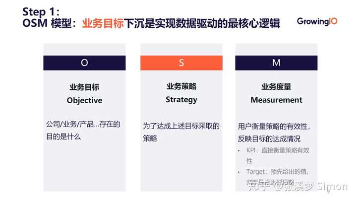
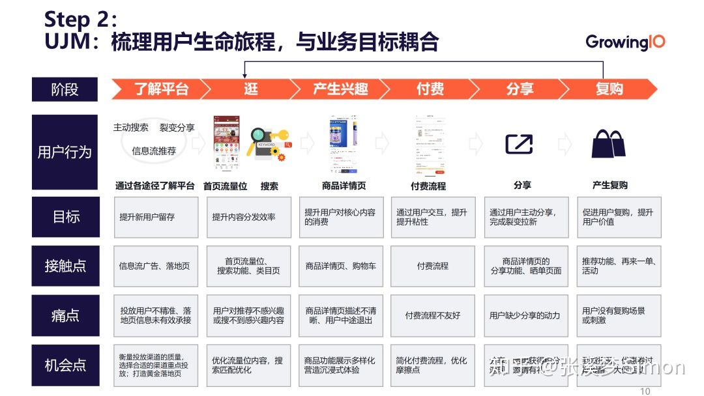
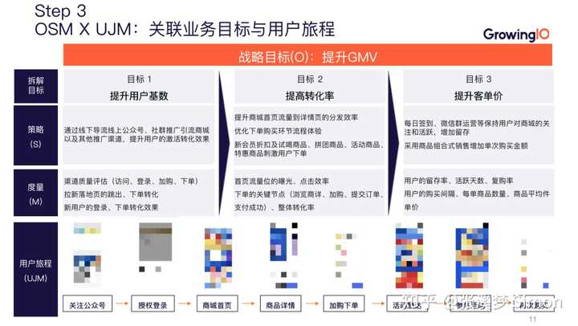
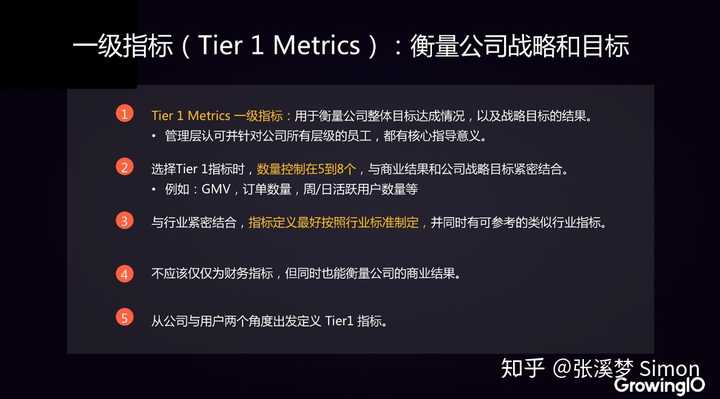
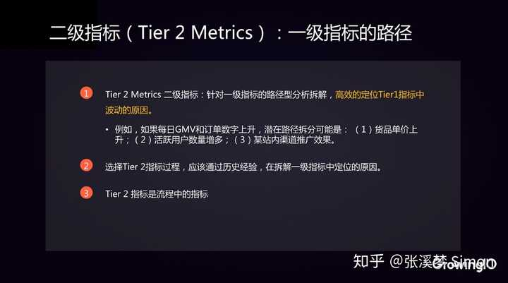
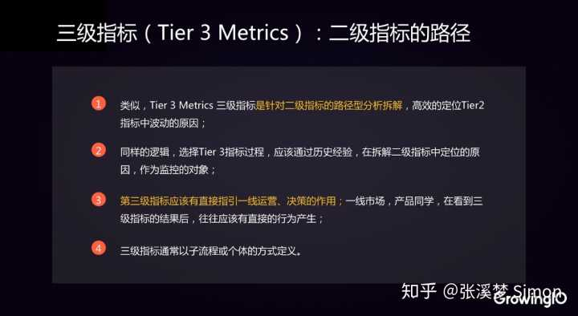
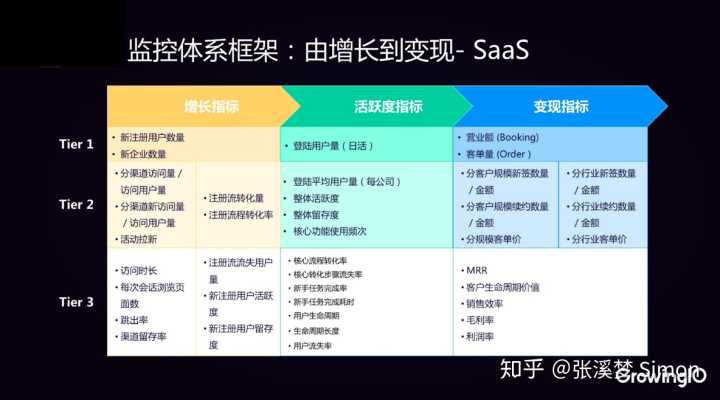

# 数据分析师如何搭建数据运营指标体系

作者：张溪梦 Simon
链接：https://www.zhihu.com/question/315972357/answer/1238739118
来源：知乎
著作权归作者所有。商业转载请联系作者获得授权，非商业转载请注明出处。

汇总了一些我们公司分析师的经验，从全局再到单点，来系统的回答一下这个问题。

## 一. 数据指标体系搭建不是单个部门能够完成的

作为数据分析师，需要站在更高的角度，认识到数据指标体系搭建并不是单个部门能够完成的，应当至少有业务团队、数据团队以及开发团队三个团队进行协作（业务部门包括但不限于市场、运营和产品团队）。

上图是我们总结及建议的，在企业内部搭建数据指标体系的最佳实践流程。分为以下 6 大阶段：

***1.\*** **需求收集阶段**：一般由业务团队提出业务需求，数据团队评估、归纳业务需求。

***2.\*** **方案规划阶段：**需要业务团队和数据团队共同制定、梳理 OSM 和 UJM，并且归纳出每一个环节的场景，设计出一套指标体系。 

***3.\*** **数据采集阶段：**指标体系在团队内部达成一致之后，建议由数据团队牵头设计数据采集方案，规范指标命名。命名是非常一件重要的事情，可以说是互联网行业两大痛点之一，下篇文章会为大家分享。

***4.\*** **采集方案评估：**数据方案采集方案设计完成后，需要联合业务、数据、以及开发三大团队一起进行采集方案的评估，评估实现成本以及实践的优先级。这里就可以按照之前说到场景化模块，根据成本和重要性，评估优先去落地实施哪一场景。

***5.\*** **数据采集与数据验证上线阶段：**这个环节主要需要开发团队来设计一些数据库，按照前端、后端埋点等等数据采集方案进行数据采集；然后进入到一个非常重要的环节——数据校验，这里必须要保证我们的数据校验与指标体系需要的数据口径一致，这样得到的数据才是业务方需要的数据，才能够回答业务问题。

***6.\*** **效果评估阶段：**最后是一个非常有价值的阶段，即效果评估。这个环节中，需要由数据团队牵头，将数据搭建出可视化看板，通过看板指导实现业务迭代效果。

业务迭代肯定会有很多的新功能、新业务线产生，这些新业务线同时也需要反哺指标体系。也就是说，指标体系的搭建不是一蹴而就的，而是要在原有的基础上不断地迭代的。

还有一个重要的环节，是在指标体系看板搭建完成之后，需要输出一个数据字典。数据字典能够协调全公司的一个步调，使大家都在同一个数据口径看待数据，提高公司整体的协同效率。

数据分析师除了专业能力外，还需要有全局思维、协调能力等，才能将一套数据指标体系真正的在企业内部顺利落地。

## 二，规划数据指标体系的两个模型

## **1. OSM 模型：业务目标下沉式实现数据驱动的最核心逻辑**

***▪\*** O（Objective）**：**是指我们的业务目标。在这个环节我们需要思考或者回答的问题是，我们的业务、产品，甚至是其中的一个小的功能，它存在的目的是什么、能够解决用户什么问题、满足用户的什么需求？

***▪\*** S（Strategy）：是指清楚业务目标之后，为了达成上述目标，我们应当采取的业务策略。

***▪\*** M（Measurement）：是用来反映业务策略有效性、反映策略执行是否能达成业务目标的度量指标。

以上就是 OSM 的基本的框架。之后会给分享一个电商经典的 OSM 模型，来帮助大家更好的理解它。

## **2. UJM 作用：梳理用户生命旅程，与业务目标耦合**

UJM 就是我们在设计一款产品的过程中，必须要去梳理的用户生命旅程。

为什么我们会在搭建指标体系这个过程中引入用户生命旅程的思路呢？

前面我们通过 OSM 的框架设计好了业务目标、策略和度量指标之后，需要回过头来梳理整个产品的用户生命旅程，以校准我们的业务目标，判断它能否与用户每个阶段的旅程进行吻合。

也就是说，UJM 是用来与我们的业务目标不断进行耦合的，两者相互影响、相互作用，促使业务目标能够更好地贴合用户需求，业务策略能够更好地回答业务问题。

为了方便大家更好的理解，这里简单介绍一下 UJM 的思路。

如上图，一个简化版的电商产品 UJM，它包括：拆解用户所处的每一个旅程阶段，了解每个阶段中用户的行为，明确每个阶段中产品的目标，发现各阶段中产品与用户的接触点，最终从接触点里找到产品的痛点和机会点。

也就是说，用户使用一款电商产品，会经历这六个阶段：

从各个途径了解该电商平台，并进入该产品 → 通过首页、搜索功能乃至商品类目页等其他各个入口“逛”平台 → 对商品产生兴趣，进入到商品详情页 → 进入付费流程，完成一次重要的转化 → 分享、复购阶段。

在整个用户旅程中，用户会反复发生各环节间互相的跳转。

我们需要为每一个阶段都设置对应的一个目标。在这一思路中设置出的目标就可以去反哺我们之前制定出来的 OSM 框架，判断其是否有遗漏。

各阶段目标确定后，我们需要寻找到产品中为了达到这一目标，与用户产生的接触点，例如首页、搜索页面、商品类目页等就是用户逛产品时的接触点。

了解接触点之后，我们紧接着就能够找到每个环节的痛点，而痛点的反面就是我们的机会点。同时，这里每一个机会点都可以反哺前面 OSM 框架中的 S，就是我们的策略，机会点是否与策略相互吻合。

所以 UJM 的价值就在于，这样梳理了用户旅程之后，将 UJM 和 OSM 进行关联，就可以起到用户旅程与业务目标相互耦合、相互影响的作用，使得我们的业务目标能够满足用户需求，我们策略能够回答业务问题。

## **3. OSM × UJM：关联业务目标与用户旅程**

这里仍然举一个电商经典的案例。

首先 GrowingIO 将电商的一个战略目标（O）——“提升 GMV”根据电商的经典公式进行了拆解，拆解成为三大目标，分别是提升用户基数、提高转化率以及提升客单价。

每个目标下面都会有对应的一个策略（S），而这里的策略其实都来自于刚刚的 UJM 框架梳理出的用户每一阶段的机会点，每个策略也都会有对应的一个度量指标（M）。

也就是说，这里的每一个目标对应的策略、度量指标都是与用户旅程的每一环节对应。这样就有了一个指标体系的大框架。

## 三，指标分级体系

## 1.适合分析师的指标分级体系

指标分级体系用到的技能会更高阶一点，更适合 BI 或者分析师，能够帮助公司搭建一套完整的数据指标体系，从而及时发现业绩的升高或降低、以及产生的原因。

数据本身是分层的，我们在思考指标的时候，也应该有一个层级的概念，而不是现阶段关心什么，我们就放什么；指标分级可以帮助我们更高效的去定位问题，去验证我们的方法论，无需每次都要思考要去看哪些指标。

我们可以针对不同的指标，分不同的层级。不一定要拆得太细，否则层级会过深，基本上 3 个层级就能够指导我们一线的业务人员去做一些动作。

**1）一级指标**

一级指标必须是全公司都认可的、衡量业绩的核心指标。可以直接指引公司的战略目标，衡量公司的业务达成情况，本质上需要管理层和下级员工的双向理解、认同，且要易于沟通传达，比如公司的销售额，或者社交产品的活跃度。

以 GrowingIO 为例，在 GrowingIO 获客的时候，一级指标就是新的注册用户数。当用户创建看板的数量大于 5 个，GrowingIO 会认为这是活跃用户。因为当用户接入 SDK 并且搭建了这个图表的时候，GrowingIO 才认为用户深度体验了产品功能和产品特性。

**2）二级指标**

二级指标是一级指标的路径指标。一级指标发生变化的时候，我们通过查看二级指标，能够快速定位问题的原因所在。

比如说，我们的一级指标是 GMV 和订单数量上升，那怎样去定二级指标呢？我们在历史经验的基础上去拆解一级指标，而能够影响到 GMV 和订单数量上升的，就是我们的核心二级指标。比如说货品的单价上升，或者最近做的一些活动。

**3）三级指标**

三级指标是对二级指标的路径的分析。通过三级指标，可以高效定位二级指标波动的原因，这一步也会基于历史经验和拆解。

三级指标能够直接执行一线运营的角色和作用。以一级指标 GMV 提升为例，我们拆解后发现是转化率提升，那么转化率就是二级指标。接着分平台去拆解转化率的时候，我们发现是 IOS 的客户端转化率有所提升。

那为什么安卓没有提升，是不是 iOS 最近做了一些迭代？是不是它的一个转换路径比其他端好？这些思考就能指导业务人员展开行动。

## 2. 指标体系分级的应用

那么指标体系分级具体是如何应用的？

这里同样以 GrowingIO 为例，GrowingIO 是基于用户行为数据的增长平台，国内领先的数据运营解决方案供应商。为产品、运营、市场、数据团队及管理者提供客户数据平台、获客分析、产品分析、智能运营等产品和咨询服务，帮助企业在数据化升级的路上，提升数据驱动能力，实现更好的增长。

GrowingIO 是如何搭建一套监控体系的呢？

我们设立了增长指标、活跃指标和变现指标，分别对应一级、二级和三级指标。

- 增长指标：新用户的注册量；
- 活跃指标：DAU ，也就是登陆用户数。
- 变现指标：用户从注册到下单，所完成的订单额或营业额。

如果看到一级指标（新的注册用户数）有增长，我们就要迅速去看一下，是不是有哪些二级指标做了波动，便能快速定位一级指标增长的原因。有了二级指标的增长，再通过三级指标拆解二级指标，以此类推，我们便能够解决日常业务中遇到的 70% 的问题。