# 数据可视化大屏设计实战

本文作者从实际工作出发，结合案例分享了大屏可视化设计过程中的一些问题以及设计思路，供大家一起参考与学习。

年底完成了一些数据可视化网页版UI改造及大屏可视化设计的方案，最近空出一些时间来整理遇到的问题及设计思路，本文分享一下想法和感悟。

重点概览：

了解数据可视化图表设计指南；具体设计思路；大屏优化设计总结

## 一、了解数据可视化

可视化是为了帮助用户更好的分析数据，信息的质量很大程度上依赖于其表达方式。

数据本身是冰冷的数字，通过选择合适的图形或者图表来进行展示表达，使得传递给使用者的感受更加直观、更容易获得其中的价值。

数据可视化将技术与艺术完美结合，借助图形化的手段，清晰有效地传达与沟通信息。一方面，数据赋予可视化以价值;另一方面，可视化增加数据的灵性，两者相辅相成，帮助企业从信息中提取有价值的信息。

## 二、图表设计指南

在数据可视化设计中，首先面临的问题是如何将各种繁多的数据指标进行展示，需要根据数据的特点，以及数据之间的关系，决定选择什么样的图表类型，然后梳理数据包含的维度，最终突出关键信息。

如下图，通过对数据展示需求进行归类整理，并调研行业内的主流解决方案，将数据展示需求分为以下几种类型：

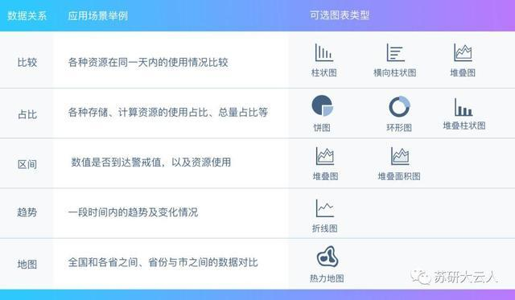

## 三、具体设计思路

数据可视化的目的是让数据说话，让复杂抽象的数据以视觉的形式更准确的传达。简单的来说就是既要选择合适的图表，又要展示其中的数据关系，通过视觉元素有序组合体现数据特征。

下面来举些栗子～

### \1. 数量的图表展示对于数量展示，主要包含以下几种使用场景

纯数字应用于具体的总数展示场景，例如XXX个数为1000台，XXX个数为99条等，这里把纯数字置于视觉控件中，能让观者直观了解到个数多少台、条数有多少条；数字翻牌器应用于地图中个各个指标总数显示的展示场景，例如XXX个数为88个等；折线图表示一段时间内数据的变化，例如XXX在1-7月中每个月的数量增减情况、XXX在最近一周内数量增减情况等；横向柱状图是主要是通过水平方向不同颜色的柱子来展示数值，此类数值一般有正负关系，一般展示资源总量与已使用量、未使用量对比的场景中，例如XXX的总量800pb、已分配量500pb、未分配量300pb三者之间的资源数量的对比等；

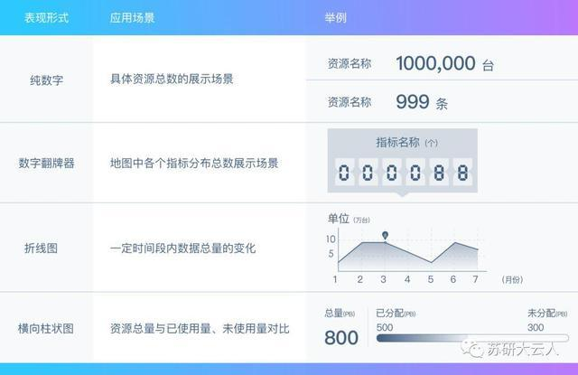

### \2. 趋势的图表展示主要使用场景

折线图是指定一个分析轴进行数据大小的比较，主要是展示数据随着时间推移的趋势或变化，两点连接。例如展示最近6个小时的两种数值变化趋势等。

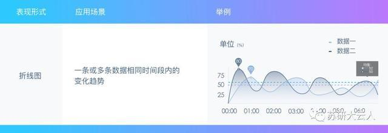

### \3. 占比类数值的图表展示主要使用场景

环形图应用于部分占比情况展示，主要是通过展示不同类别数值相对于总数的占比情况，反应部分与整体的关系。每个区域弧长表示类别大小，总和为100%。

例如在环形图中，某资源占整个资源的30%。

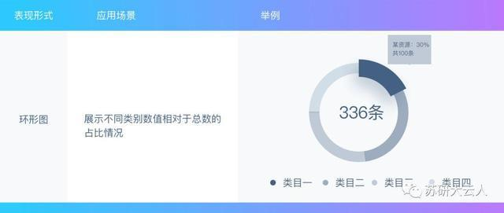

### \4. TOP类数据的图表展示主要指各种指标的TOPN展示

比如TOP5的数值大小排行。

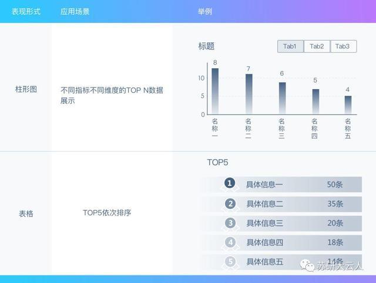

### \5. 区域类的数据

区域类的数据展示在一张地图图上展示各区域资源数量情况，有利于使用者观察全局以及各个区域的情况。

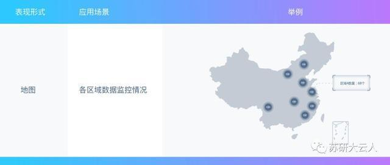

### \6. 网页版数据可视化设计样例

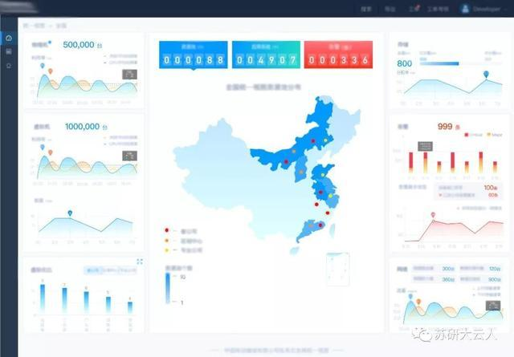

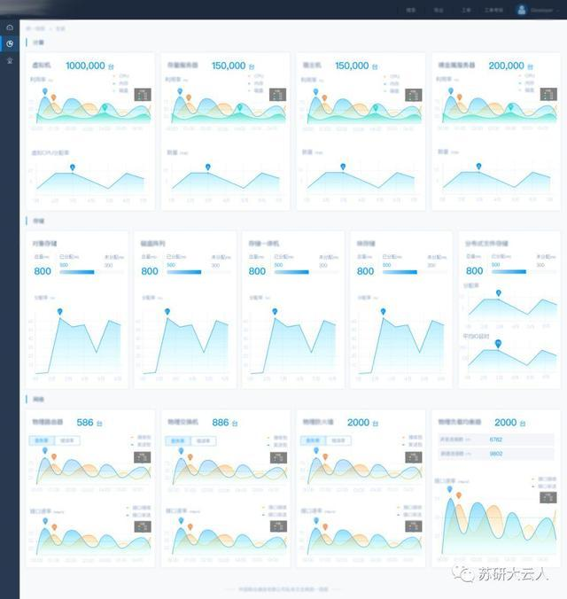

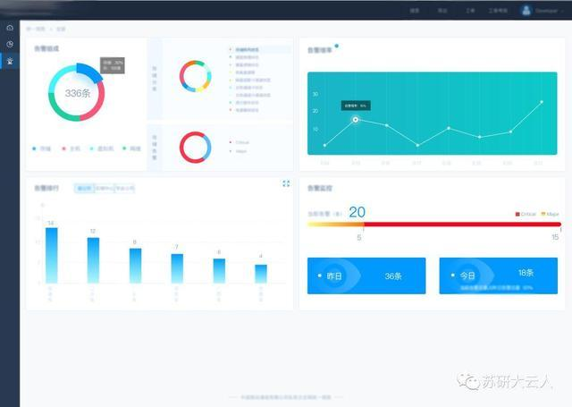

## 四、大屏优化设计

本次可视化大屏主要是为了实时展示相关数据监控情况，不同于网页版可视化设计的展示，大屏展示需要做到重点突出，要求较强的数据展示能力，而不是面面俱到。

网页版偏向展示一段时间内的数据，甚至是通过日期筛选查询到某一时间段的数据。大屏更多起到的是监测职能，反馈的是实时信息，显示的是当下的数据。以下是大屏设计和网页版设计的一些不同：

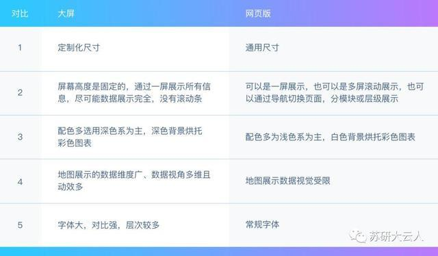

### \1. 布局和配色：设计尺寸

**硬件尺寸：**

6384*1216px，分辨率：72dpi设计布局了解需求的基础上，辨别数据的优先级，做到重点突出，细分资源类型及指标，布局出大致的设计模版，如下图。

**字体：**

**配色：**

相比较网页版设计展示，大屏更倾向于选用深色调背景，不仅为了让视觉更好聚焦，而且长时间观看之后眼睛也不会出现视觉刺刺痛感。

基于此，所有图表的配色皆以深色系为背景，保证数据明度与色调的和谐统一。

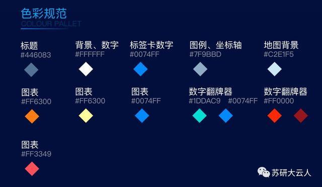

**数据元素：**

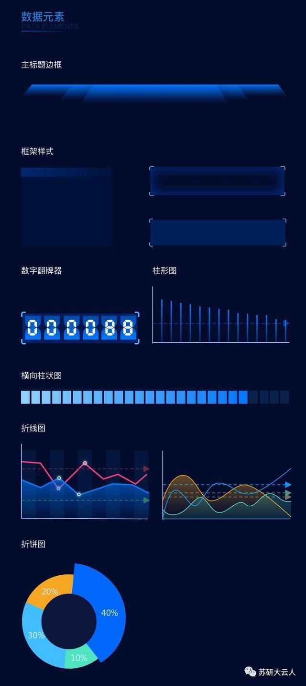

**图标：**

### \2. 展示和交互

在大屏展示中，有多种资源类型及数据展示。通过构图突出重点，在主要信息和次要信息的布局和所占面积上进行调整，明确层级关系和流向，使观者获取信息时也能获得视觉平衡感。

以地图的方式展示出资源分布信息，左右两侧排布详细类别的资源信息展示，在构图上突出主次。并在全国地图中省份位置添加钻取的动态效果，进一步增强视觉导流线和信息层级的引导作用。

不同于网页版可视化内容展示可以做到面面俱到，大屏界面空间有限，必须突出重点，将重要的指标放在最显眼的位置，尽量集中放置，吸引视觉焦点。

交互方面，网页版可视化内容展示的交互复杂相对多样化。而可视化大屏，交互样式单一，更多是侧重于数据多维度钻取。

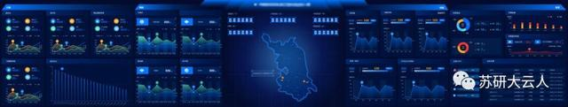

### \3. 优化细节

在完成大屏设计初稿后，为了进一步优化维度和展现的方式，对大屏中的细节进行优化。例如对背景、装饰线框、图表线条等细节进行审查。

比如视觉上显得线条太多，页面整体不够清晰，重要信息凸显不出来。对应装饰元素能避免则避免。

对于层次感不明显的问题，进行了丰富信息以及加大背景色对比度的调整；对于图表中柱状图的数量过密和过疏，进行长宽高、面积进行调整；对于表格排列进行优化序号突出重点的调整……

最后一步，按照产品经理收集到需求方的要求，考虑到是否达到预期，是否有色差等。最后也要让需求方审核是否能够理解，数据是否是想要的样子。

**优化后的最终版：**

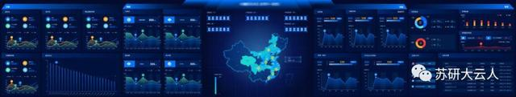

## 五、总结

数据可视化设计的着力点就是要把握好图表的主次关系，突出主要图表的重点数据。

本次设计实战，在网页版UI设计基础上，提炼重点数据信息进行大屏设计，最终目的是能够让观者洞悉各个资源的使用情况。

在本次设计实战需要在短时间内实现复杂繁多的指标数据可视化，网页版要做到面面俱到，大屏版要做到重点突出，整体设计难免有不完美的地方，后续会继续改进完善。

本文由@一时无两 原创发布于人人都是产品经理，未经许可，禁止转载

题图来自Unsplash， 基于CC0协议