# 数据质量专项治理在政务大数据中的应用实践

> 前言：不久前，龙石数据在信通院大数据技术标准推进委员会的全体成员会议上做了一次分享，主题是“数据质量专项治理在政务大数据中的应用”。本文为分享内容整理。

大家好，我是龙石数据练海荣，很高兴能跟大家分享“数据质量专项治理在政务大数据中的应用”。

根据我们的研究和实践，我们认为数据资产管理活动可以分为三个方面：

- 第一是让数据用起来
- 第二是让数据用得放心
- 第三是让数据创造价值

我们的政府部门，尤其是政府的大数据管理部门，在过去十几年中，针对“让数据用起来”做了很多工作，建设了诸如数据交换平台、数据共享平台、数据资源目录、基础库、主题库，甚至数据中台、数据湖等这样的项目。

但是这些项目建设完后，所建设的数据中心的建设成果还不够理想，尤其是数据质量上，在使用过程中还是发现很多的数据质量问题。比如，一些政府部门建设了诸如领导驾驶舱这样的系统，领导驾驶舱是利用数据为领导决策做支撑的，如果数据质量有问题，那必然带来比较严重的后果。

所以我们认为，在数据要素化和数据资产化这个时间节点上，我们要让这些数据发挥数据要素的价值，首先就是要解决数据质量问题，因此我们提出要让数据要用的放心。第三，就是要让数据创造价值，比如说现在耳熟能详的一网通办、一网通用、一网统管这些热门的业务，也是基于数据融合共享的基础上所打造的创新的政务服务和监管模式。

## 政务大数据面临的数据质量问题

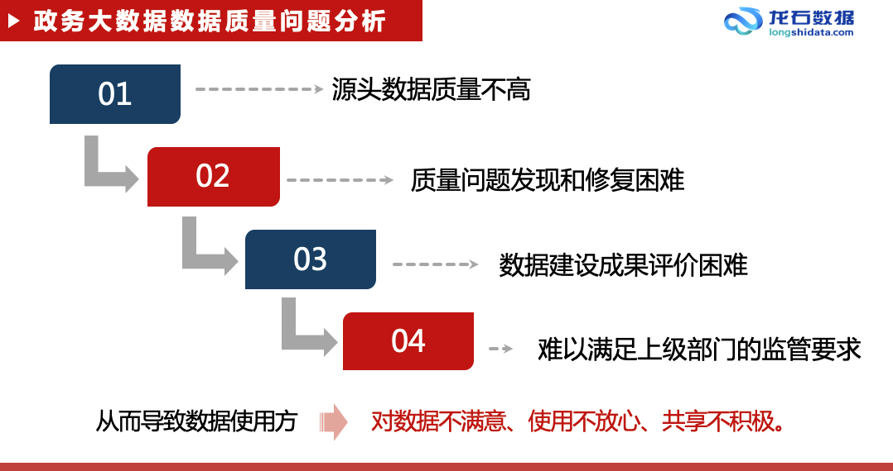

首先，源头的数据质量不高。源头是指政府的业务部门，质量不高的原因也是多方面，诸如人手不足、技术力量不够，以及各个部门对数据质量的重视程度还不够，这些因素综合导致源头的数据质量不高。

第二，数据质量问题的发现和修复困难。政务大数据的数据源头多达几十家甚至上百家，各个源头部门的业务内容也比较复杂，而数据是与业务密切相关的，这就导致在数据进行汇聚后，大数据管理部门很难发现这些质量问题。

对修复来说，因为大数据中心是一个大数据的管理和服务部门，并不办理业务，也不生产数据，从责权上来讲，他就没有权限来修改这些数据，到最后数据的修复工作还得依赖于各个业务部门，这里面的沟通和推进工作就会比较困难。

第三，数据项目的建设成果评价困难。因为现在的大数据项目就体量都比较大，动辄几百万，甚至上千万、上亿，我们要来评价这个大数据项目的建设成果，技术难度、复杂度、工作量都是比较大的，如果没有很好的评价手段，我们就难以在项目验收那么短的时间里去确认这个项目建设的成果到底怎么样。而据我了解，信通院大数据技术标准推进委员会已经推出了这方面的评价标准，大家有兴趣可以了解一下。

第四，难以满足上级部门的监管要求。以互联网加监管来说，我们国家制定了互联网加监管的数据标准，然后省市也都沿用和完善了这些数据标准，通过及时性、正确性和覆盖率三个指标来评价数据质量。

从我们的实践过程中看到，早期时候，很多城市报送的数据质量都不太理想，无法满足上级监管部门的要求。以银行业为例，银保监会去年对国有六大行及两家股份制银行因监管数据质量及报送存在违法违规行为开具了 1770 万元的罚单。

所以，上述的这些问题导致我们的业务部门，也就是数据使用方，陷入对数据不满意、使用不放心、共享不积极这样的一个恶性循环。

在这样的背景下，我们认为，如果我们要继续深化数据的开放共享这项工作，我们可以以质量为突破，打破这个恶性循环，达到人人为我、我为人人的良性的数据开放共享状态，也就是说如果我拿到的数据是优质的，那我也必须提供优质的数据。

## 着手数据质量专项治理

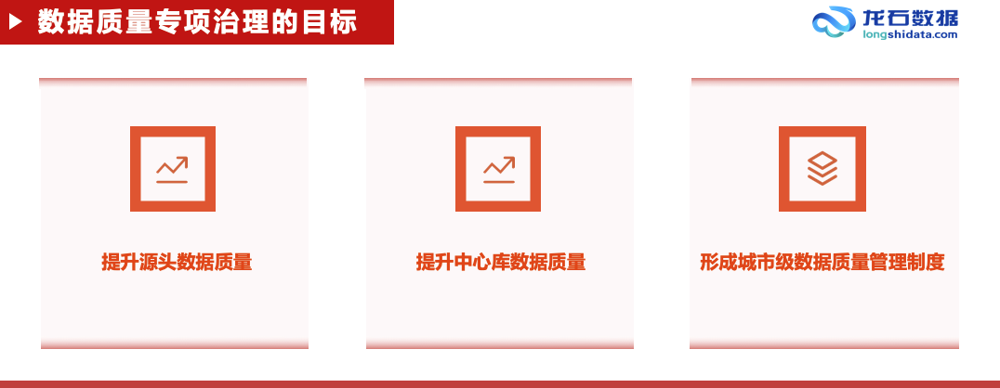

面对这些问题，数据质量专项治理主要从三个方面来着手：

第一、提升源头的数据质量，因为源头是解决数据质量问题的根本，只有源头的质量好了，那我们才能达到一个“标本兼治”的状态，否则只是在数据中心做清洗加工处理的话，工作量和成本投入也非常高，效果也不会很好。

第二、提升中心库的数据质量，中心库中存储的是一个城市最基础的数据，例如像法人、人口、地信息、电子证照等等，这些数据如果出现问题的话，必然影响整个城市的所有业务部门，所以中心库的质量就显得非常重要。

第三、形成城市级数据质量管理制度、工作流程和考核办法，在提升源头质量和提升中心库质量的过程当中，形成具有本地特色的，符合本地情况的一整套的数据管理制度、工作流程和考核办法。

从核心思路上来讲，数据质量专项治理的主要工作是使用数据标准来检验项目建设成果是否达到预期目标，并通过相应的技术手段和管理手段来弥补项目建设过程中的不足。

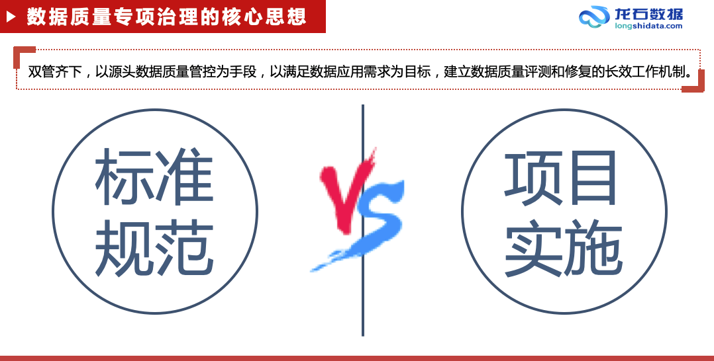

从方法论上讲，我们研究了一些国外框架，最后在参考国外主流框架的基础上，主要遵从了国标《数据管理能力成熟度评估模型》（简称 DCMM，GB/T 36073-2018），从质量需求、质量检查、质量分析和质量提升这些角度来解决数据质量问题。

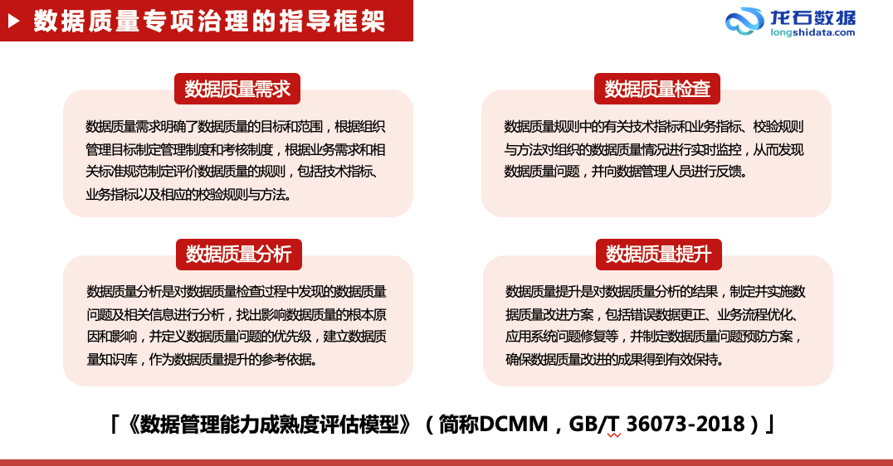

第一步，我们针对不同主题，做数据标准的归集和整理工作。我国针对各行各业的数据出台了很多标准，但这些标准有一个共同问题，就是它是零散的，比如有身份证号码编码规范、统一社会信用代码编码规范，甚至人的性别都有相应的代码集标准，例如 1 表示男，2 表示女，0 表示未知，9 表示未说明。

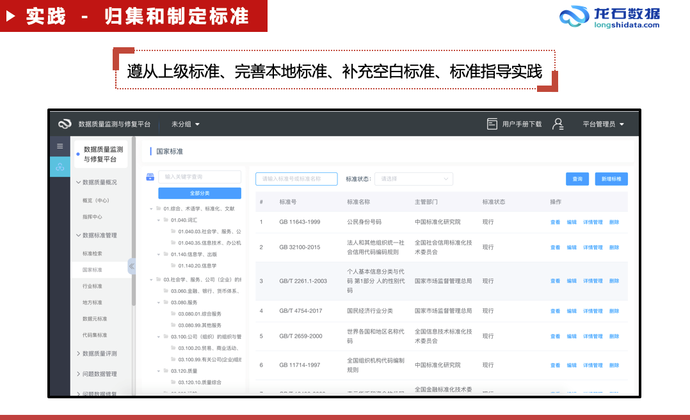

但对于基础库，例如法人人口就没有这样一个已经整理过的综合的标准。所以，我们只能将这些零散的标准依据我们对业务的理解进行整理和组合，按业务和行业进行归类，然后将这些标准从 PDF 结构化成代码集和数据元。这是我们做质量治理工作的前提。

第二步，标准整理完后，就开始建立我们的数据质量模型和规则。数据质量模型和规则的定义，我们是按照国标《GB/T 36344-2018 信息技术数据质量评价指标》里面的五个指标来执行的，包括规范性、完整性、准确性、一致性和时效性，但国标里的可用性指标，因为执行比较困难，我们没有采用。例如法人基础库，如果按大法人的概念，包括食品、药品、特种设备等，我们建立了 300 多个模型，3000 多个规则。在规则制定过程中，最重要的是对业务的理解，也只有对业务有深刻的理解，才能去制定出法人数据相关的业务规则。如果说标准的归集和整理是前提的话，那规则的定义就是最核心的部分。

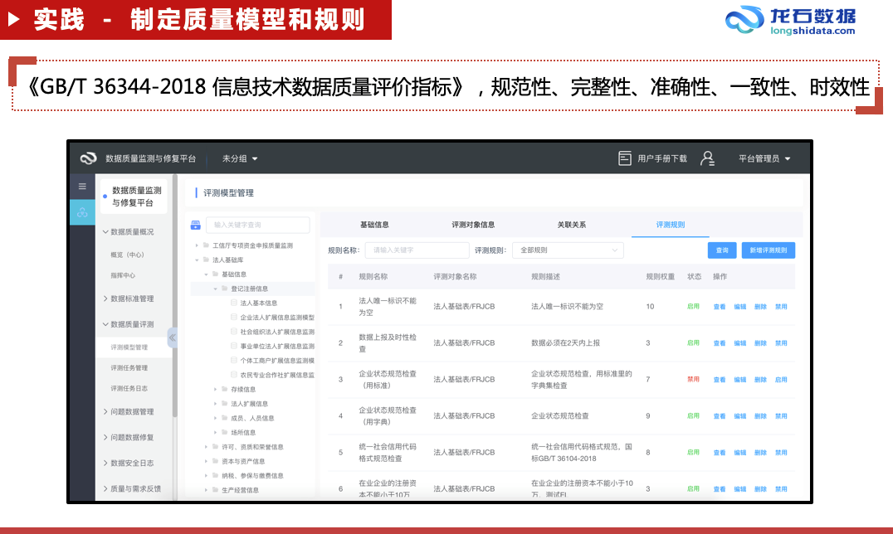

第三步，在规则定义完成后，那我们就要采用旁路检测的方法来执行这些规则。我们可以把数据质量的评测和修复工作比喻成要在一个行驶的火车上面来对火车的问题进行检修，并且不能让这个火车停下来。因为我们国家电子政务的发展速度非常迅速，根据联合国电子政务调查报告，我国已经从 2018 年的 65 位上升到 2020 年的 45 位，尤其是疫情过后，我们的电子政务在线服务水平更是以肉眼看得见的速度快速发展。

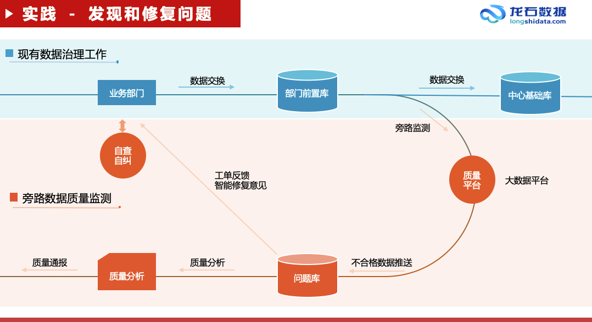

苏州的“苏周到 APP”就是一个很好的例子，它作为苏州市民服务的总入口，囊括了政务公共服务的方方面面。

所以我们怎么样才能在这么一个快速行驶的火车上去进行检修呢？意思就是我们原来的数据归集、数据清洗加工、基础库的建设都不停，原来该怎么干还怎么干，当数据从业务部门共享到部门前置机以后，我们开一个分支出来，将数据采集到数据质量监测平台，然后在数据质量监测平台上面进行规则的运算。

另一个原因，如果在基础库上做规则运算，那么多的质量规则就直接把基础库给拖垮了。所以质量平台必须是一个大数据平台。

规则运算完以后，就会形成问题库，然后质量平台将这些问题以工单的形式分发到各个源头部门，公安的问题给公安，民政的问题给民政，这也是将来做质量通报和考核的重要依据。我们发送工单的时候，也会将一些智能修复的意见推送给源头剖门，辅助源头部门来修复数据质量问题。业务部门修复了数据质量问题后，再将数据通过共享交换的流程共享到基础库主题库里面，这样我们就把一个质量工作进行了闭环。

第四步，数据质量本身及数据质量治理工作成果的评价。在质量治理服务的过程中，我们会周期性生成数据质量分析报告。报告的一个重点就是右上角这张图，我们称之为“标本线”，“标本线”可以帮助我们直观地评价数据质量本身和数据质量治理的工作成果。图中蓝线表示当前的数据质量情况，橙线表示的是源头数据质量情况，这两条线之间的差值表示的是数据质量治理的工作成果，橙线逐步上升的过程，表示的是源头部门的数据质量在不断的提高，所以我们把橙色的线称为“本线”，把蓝色的线称为“标线”，两条线同时在往上走的一个过程就是一个“标本兼治”的过程。

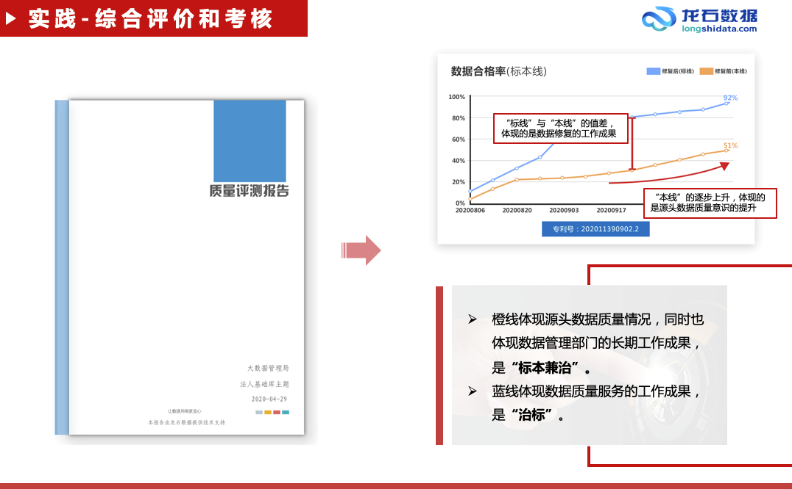

同时，质量分析报告还包含各个源头部门的详细排名情况、公安提供了多少数据、修复前的正确率是多少、修复后的正确率是多少、正确率上升了多少，等等。

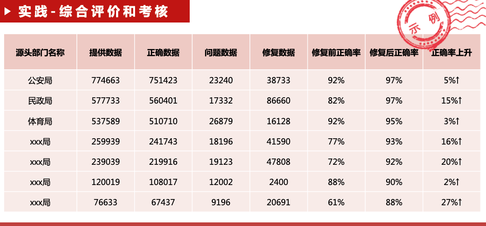

所以修复前的正确率体现的是公安的技术水平，也体现的是公安的质量意识，正确率的上升幅度体现的是公安在数据质量工作中的配合程度，以及公安在数据质量管理工作中的成果。

质量分析报告也包含了数据及时性评价，我们将数据及时性分成两类：

第一类是报送结果的及时性，比如今天有一个企业注册登记，我们不能一个月以后才共享这个企业注册信息，如果别的部门需要依赖于这个数据来做审批或执法的话，业务就没有办法往下做了。

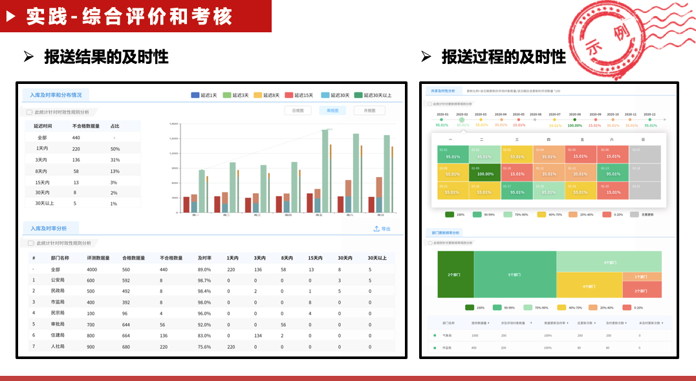

第二类是报送过程的及时性，我们在资源目录上都会标明每一个数据资源的更新频率，那么，报送过程及时检查中，就是检查是否按约定执行了数据更新动作。

综上，数据质量专项治理的工作可以概括为标准的归集整理、模型和规则的制定、评测任务的执行、问题的修复和质量的分析评价。

从成果上来说，我们大致归纳为以下三点：

第一、政务大数据质量虽然还不尽理想，但呈现出明显的上升趋势，数据质量管理的能力体系，也达到了 DCMM 的量化管理级。

第二、通过源头数据质量的提高，大大降低了中心的治理成本，保障了数据中心的建设成效。

第三、通过数据质量的提高，打消了业务部门使用数据的顾虑，促进了数据生产、数据共享、数据使用、数据再共享的良性的数据质量文化的形成。

最后，我们认为数据质量治理工作还只是一个开头，还有很长的路要走，还有很多方面需要国家层面，需要整个行业来共同努力，向前推进。

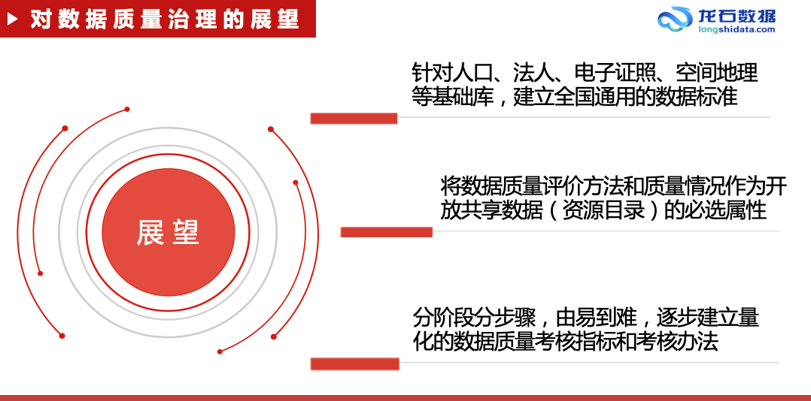

我概括以下三点，算是抛砖引玉。

第一、针对人口、法人、电子证照、空间地理等基础库，建立全国通用的数据标准。我国正在大力推进跨省通办这样的业务，这是很创新的，那如果要跨省通办的话，那就是要跨省数据通用，要跨省数据互认，如果没有一定的标准指导各做各的，那后期跨省沟通的难度就会很大。

第二、我们可以将数据质量的评价方法和质量描述作为开放共享数据的必选属性。现在我们在资源目录上面标记更新周期、开放共享类型、共享方式、共享条件等等，但数据质量是数据应用的前提，应当适当说明。

第三、我们可以根据实际情况，分阶段分步骤，由易到难，逐步建立数据质量的考核标准，让大家都积极地参与到这个数据质量的工作当中来，都能够为自己共享的数据承担相应的责任，也能够从别人共享的优质数据中获益。

关于作者：

练海荣，微信号 Sulaohuai1980，现服务于龙石数据，曾就职于神州数码、Oracle、新加坡电信等企业，擅长微服务架构、数据治理及技术管理。

2021 年 4 月 25 日 15:59