# 贝壳一站式大数据开发平台实践

> 本次分享嘉宾是来自贝壳大数据部门的仰宗强，详细介绍了针对贝壳的业务数据与需求的增长，逐步升级数据开发平台的探索实践过程，包括三次数据开发平台架构升级的细节。
>
> 
>
> 本次主题分享，主要从下面 4 个方面进行介绍：
>
> 
>
> - 背景介绍
> - 探索历程
> - 平台介绍
> - 总结与展望

## 背景介绍

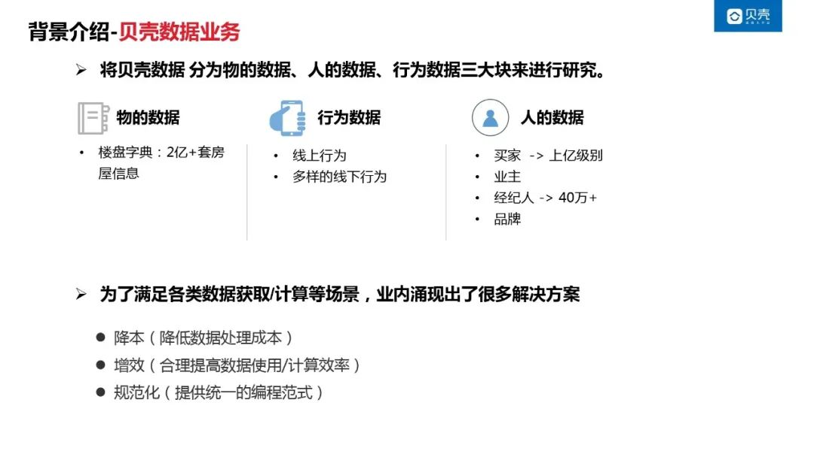

贝壳一开始的数据体量非常小，那时候需求也非常简单，所以那时候都是业务自己负责处理业务需求的获取。随着业务规模的增长，业务的需求逐渐的复杂化，直到最后业务方已经无法独立承载数据的需求了。所以我们从 14 年就开始成立了一个大数据部，专门来研究数据需求，也就是数据开发的一些探索。我们当时针对贝壳数据需求分析了下，贝壳的数据基本上是会围绕物的数据，人的数据，行为的数据这三大块来进行探究。

### 1. 数据业务

①物的数据

我们早在 08 年就开始筹建罗盘字典，当时我们是以接到小区单元门楼盘以及户型图之类的这些多维度信息进行描述，我们的房子到目前为止已经承载了两亿多的房屋信息

②人的数据

基本上就是买家，实际上就是买房子的人，还有租户以及业主，经纪人，以及后续我们升级为贝壳品牌，还有介入了品牌以及我们后续的装修人员这些数据

③行为数据

买家在我们平台上进行的线上浏览行为，以及经纪人会在线下带买家去业主家去看房行为，等等线上和线下的信息

### 2. 设计准则

准则：

- 降本
- 增效
- 规范式

总之，就是降低数据处理的成本，快速为各个业务方提供各种规范化的数据。

## 探索历程

### 1. 最初阶段

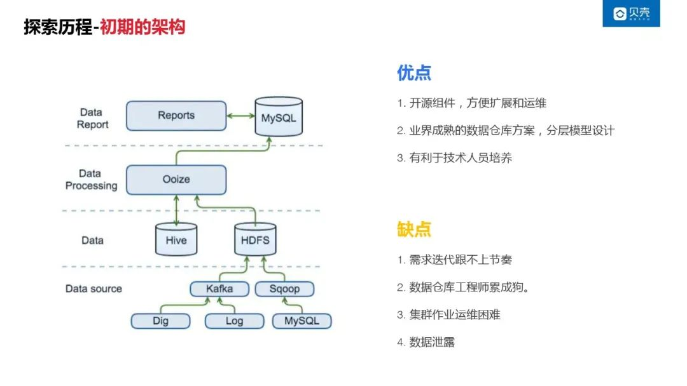

最初的数据开发平台架构，就是使用 Hadoop 开源组件 Hadoop/Hive/Sqoop。因为开源框架的文档比较多，而且它对应的那些解决方案也比较成熟，也方便组件扩展跟运维。开发过程中，也可以通过众多的文档资料能快速的熟悉架构模块。

在数据存储方面，使用了业界比较成熟的一个数据仓库的方案，就是分层模型。第一层是接入层，然后数仓层加报表层三个模型，可以避免踩很多一些不必要的坑。

在业务上，数据开发与业务紧密结合，使用了 Case By Case 的定制化开发方式来满足业务的需要。

当然，这种开发架构的缺点也是非常明显。

缺点：

- 业务上，定制化开发方式，无法快速适应复杂业务的多变性。可能出现，完成数据开发后，业务已经改变的情况。
- 调度框架简单，运维困难。调度框架是基于宙斯+Python+Shell 实现的。任务日志在物理机上，排查一个计算结果的问题，可能需要登录多个集群节点查找日志，一个简单问题，可能需要一到两个小时才能解决。
- 数据安全亟待解决

后来开始进行了我们平台化的探索

### 2. 平台化架构

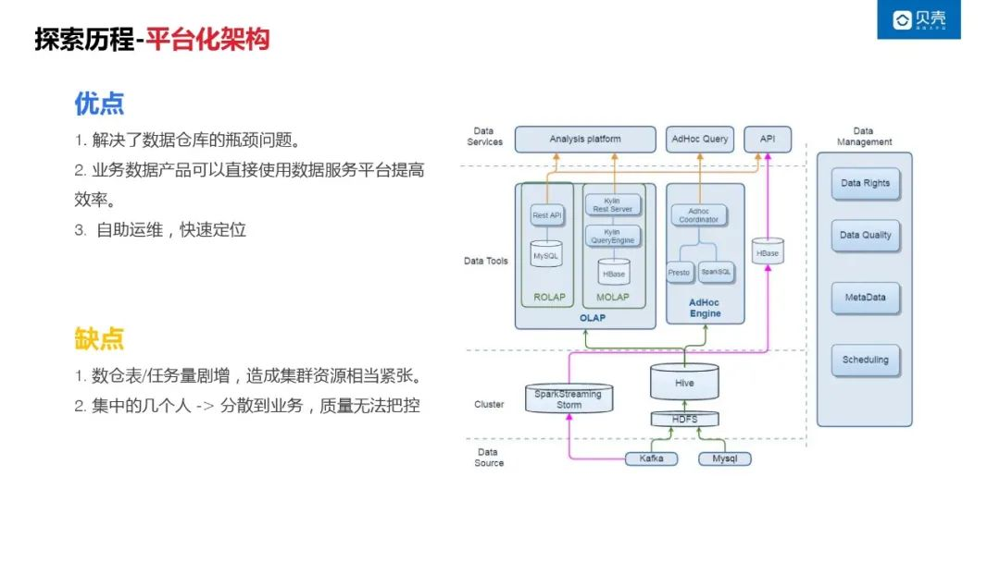

本次架构升级，引入了数据管理平台， AdHoc 查询平台。

数据管理平台包括了元数据管理 、数据质量、数据安全、调度系统。所有的元数据查询、数据开发操作，都可以在一个平台进行管控。

AdHoc 查询的功能，可以让业务分析人员结合元数据管理里面的数据地图，针对临时的业务查询，自主的在数据开发平台进行分析，不在需要数据开发工程师的介入。让业务开发的人员，自己去承载具体的业务需求,自主的维护业务数据。

同时，针对调度系统进行重构，借鉴了 Airflow/ 宙斯的相关框架，使用 workflow 的形式，将运行日志集成到了平台，节点的运行情况，使用流程图的形式进行一个展现，方便业务进行问题定位。

**优点：**

- 解决了数据仓库的瓶颈问题。
- 业务数据产品开发，与数据开发人员，独立承载自己的需求。专业的人做专业的事情。
- 自主运维，快速定位。

**缺点：**

- 相关权限的数据开发操作，开放出去后，数仓的任务量增加比较多，资源也比较紧张。
- 数据开发的质量无法管控

### 3. 平台化架构-飞跃阶段

我们就做了一个下面的一些优化，比如说第一个就是我们的资产资源，我们就加了一个数据资产的管理，以及第二个就是我们对应的这些数据开发的一些流程都提供给业务了，业务它怎么样很方便地来我们的平台去玩儿，怎么样去开发，那就提供了一些数据开发的一些套件，然后这些数据怎么样的能健康及时准确地流转给业务，实际上就是我们做了一些统一的一些监控智能的一些运维的工作。架构如下图：

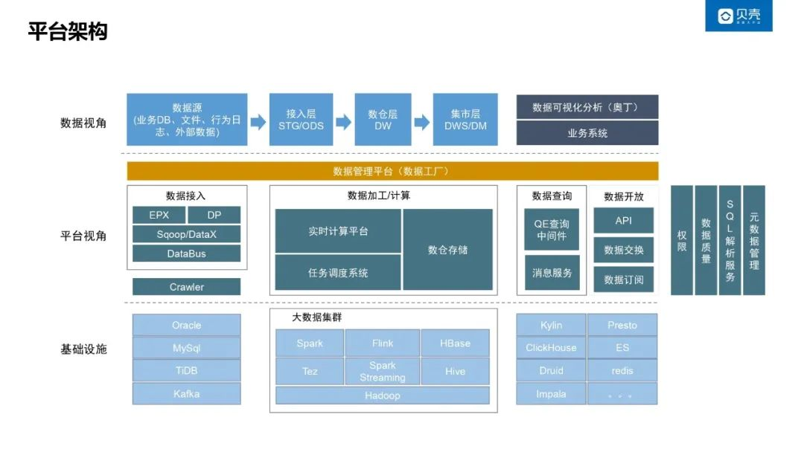

在数据接入层，从原来 Sqoop 我扩展到了 DataX/Dbus。：Log 日志接入，我们使用了 Flumn 接入进来的，然后中间的数据加工计算，实际上就是在我们手机管理平台有一个一站式开发的一些组件，然后建完了之后就可以通过我的任务调度系统能去周期性地运行我们的任务，然后这些数据通过我们的开放平台，比如说 API 交换订阅的一些消息队列释放给业务，能产生我们的数据的价值，然后这些也沉淀了几个底层的一些服务，比如说像权限这一块儿，能负责我们整个大数据的一些权限流程，然后数据质量实际是保证我们从接入到开发到我们释放之后，整个的一些质量能及时准确，然后还有元数据管理是能保证我们数据是唯一准确的。

## 平台介绍

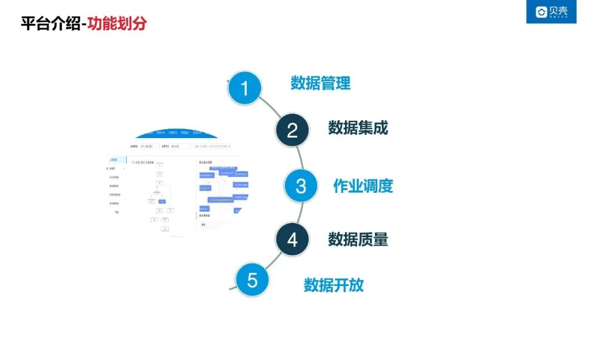

### 1. 数据管理

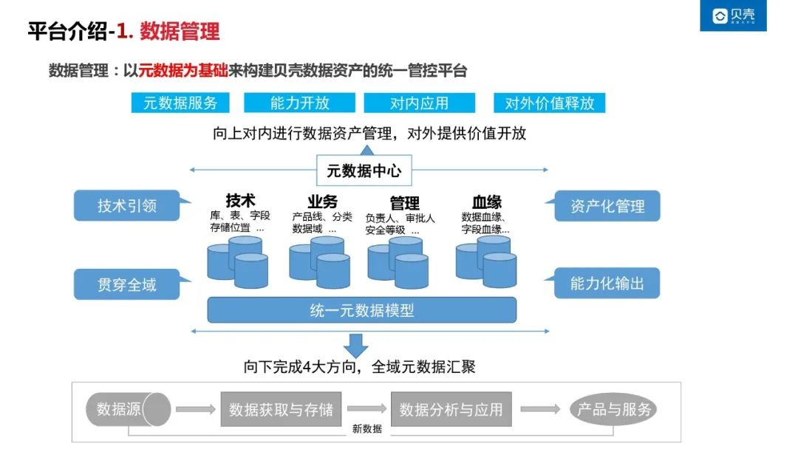

### 数据管理的特点

- 统一的元数据模型

第一个实际上就是一个统一的元数据模型，就是我们所有的人数据，包括关于基因数据，非关系型的一些数据，以及那些 log 的这些元数据，还有半结构化的，这些我们都是通过一个元数据模型去管控

- 贯穿全域

实际上就是通过业务的数据源到我们的数据获取存储，到我们的应用分析然后带到我们的产品服务，以及它产生的一些数据，回流到我们的一数据源，整个的原数据进行汇聚，

- 资产化管理

我们的元数据，它具备了第一有技术上数据的一些管理，第二是业务的人数据的一些管理，还有第三是管理的人数的数据管理，以及我们的自带血缘加数据血缘这一块儿，这些管理起来了之后，我们可以去做一些资产化的一些管理，相当于说我们能知道我们贝壳有哪些数据了。

- 能力输出

第二个我们就可以去做一些赋能的问题，例如说我这些软数据进行一个数据地图或者说数据资产的一些功能的一些展示提供，可以让用户能知道我们大数据平台有哪些数据，这些数据都长成什么样子的，应该怎么去获取，应该找谁去申请之类的。

### 数据管理的实现效果

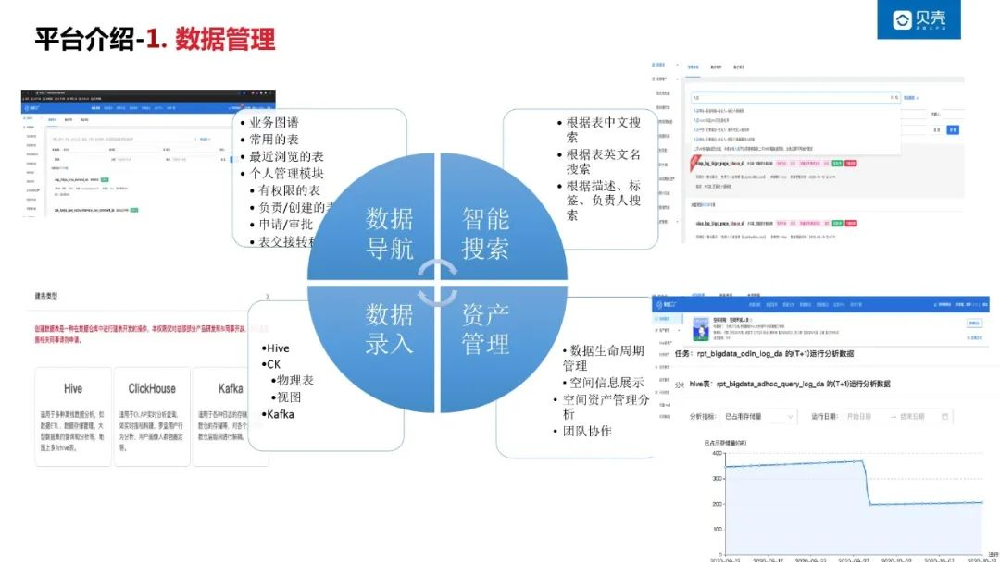

①数据录入

有些数据我们是主动采集的，比如说像 DB 类的，这些都是业务系统的一些数据，都是由数据管理平台去采集。但是对于有一些数仓开发的一些任务表，我们是通过平台制定一些规范，在平台进行录入的。同时，我们现在还支持 CK 跟 Kafka 的元数据。

②数据导航

我们怎么让业务找到数据，让用户找找到数据，首先是通过我们的数据导航，我们通过业务图谱能找到，比如从业务从数据录入到带看，然后到我们成交这一套的业务路径，然后它每一个环节对应的一些表，我们就可以通过业务图谱去找到。还有一些我们可以有个性化的一些模块，比如说我个人的表，我有权限的表，我创建的表，就可以快速地找到这些数据。

③智能搜索

如果说数据导航还找不着，那么可以使用智能搜索，我们已经具备了模糊匹配表中文名，英文名儿，然后描述以及字段名里的描述，能让用户能去自动的去找到这些表。元数据详情内容有，有基本信息，字段信息，还有一些逻辑处理，调度任务这些详情数据，血缘可以让用户能很明显的去看到我这张表是做了什么事情，而且它的数据是从哪来的，而且它是怎么加工来的，那么它就可以通过我们的权限资质查询去看这些数据是什么样的，而且能去自助的去分析。

 ④资产管理

第一场景，假如说是工作交接了，涉及到一些权限转移之类的，可以通过我们平台做到权限一个闭环。

第二个是我们的资产管理，大数据平台肯定是承载了所有的业务的数据，如果说我们不做一些生命周期的管控的话，它肯定会一直膨胀，它的膨胀速度一定是随着我业务的增长而增长的，我们就会涉及到一个生命周期的一些管理。关于生命周期的管理这一块，我们做了一些规则，以及表维度的一些沉淀，然后可以给用户进行一些确认，然后就可以达到平台的一些规生命周期的一个管理。

生命周期管理：

第一是我们能把冷数据备份，能把无效的数据是无效的任务下线，一些不必要的表进行清理之类的一些操作，而且还做了一个引入了一个工作空间的概念，就是说我们会把我们的数据资产按照我们不同的一些业务进行化作工作空间，然后这些工作空间进行一个配额限制，然后能从而达到正向的去引导用户去做。

**资产空间信息展示：**

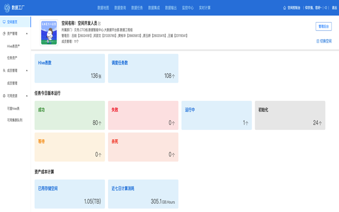

资产的生命周期的一些管控，并且在我们的资产空间管理里面有做到数据质量的一些分析，分析的内容包括：

- 第一个场景，我们的任务时长有问题，那么它就可以通过这个趋势图去看到它任务时长是不是有波动。

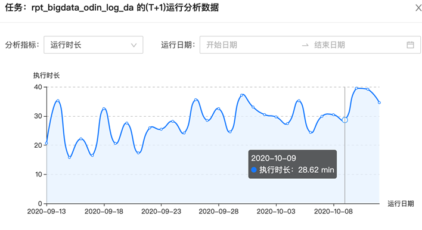

- 第二个场景，今天我运行得很慢，为什么很慢，他就可以去看看。如果说我的运行都是一条线，肯定都是很好的。

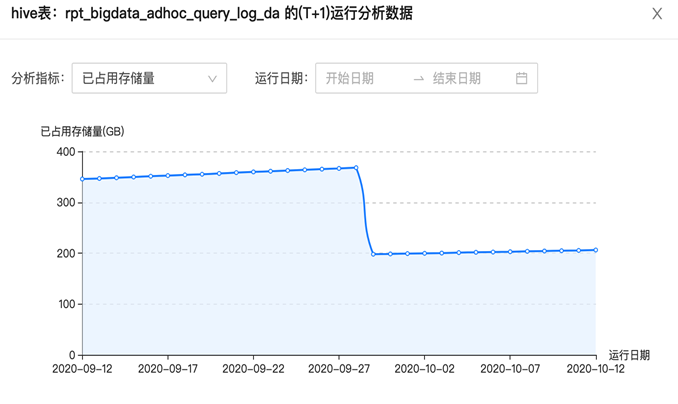

- 第三个场景，就是我们数据增长就相当于说这张表它开始增长，肯定是我每天加一个分区，它肯定是稳定增长的，等我到达一个时间，降的那一块儿，实际上就是我们通过生命周期把一些不必要的数据进行归档加清理掉，它就会进行降低，

工作空间：

我们工作空间还可以做到团队协作，估计大家应该做过，数据工厂应该都会有这些有团队协作的一个概念，应该大家都是用什么角色/组或者说一些角色去做的，这些事情实际上我们拿到工作空间去做，就是说我们工作空间的人都能去操作这些数据，这样的话我们就能知道我们贝壳有哪些资产，这些资产都是什么样的，我们哪些没有接入到大数据。

### 2. 数据集成

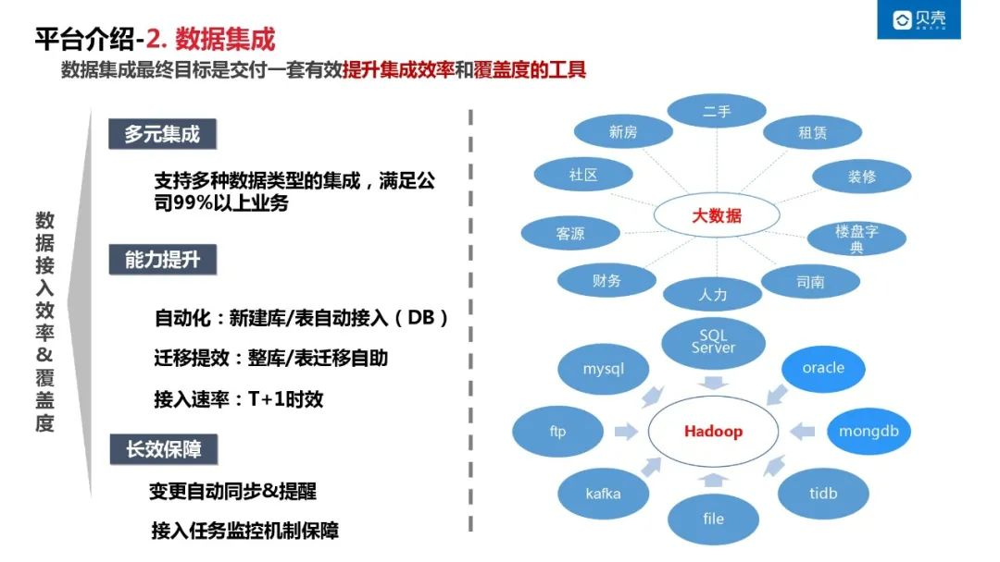

可以通过数据集成，把未接入的数据能快速的集成到我们的大数据平台。已经支持的数据源类型包括 MySQL/Oracle/SQL Server/TiDB/MongoDB/Kafka 等等 。现在可以满足 99%以上的一些业务数据接入场景。接入能力以配置的方式自动化实现。比如说新建库表这一块，我们就能自动化接入到我们的大数据平台。还可以支持数据迁移，从一个实例迁移到另一个实例。同时也支持业务拆分场景，把某一个业务里面的一张表拆到另外一个业务里面去，我们能够做到自助的一些迁移，能保证我们的数据的一些完整性。

从时效性上来讲，能做到 T+1，如果说要更小粒度，目前能够做到小时+1。

业务变更实时提醒：

业务变更的情况下，我们能自动同步跟提醒怎么说？业务人员与数据开发人员及下游相关人员，那么他们怎么样去建立互通？信息的不对称，所以导致我们的数据业务会是失败，或者说没接到大数据。所以我们做到，就是说业务的原数据变更了，我们能自动感知到，然后我们自动同步到大数据，并提醒到相关人员，让他去做一些变更，有一些我们可以也能自动做到，就是说我们直接去同步。

### 3. 作业调度

业务数据都接到我们大数据来了，那么我们数仓同学他就要去做一些开发操作，那么它的数据建模，它数据建设怎么去做？

**开发流程简介**

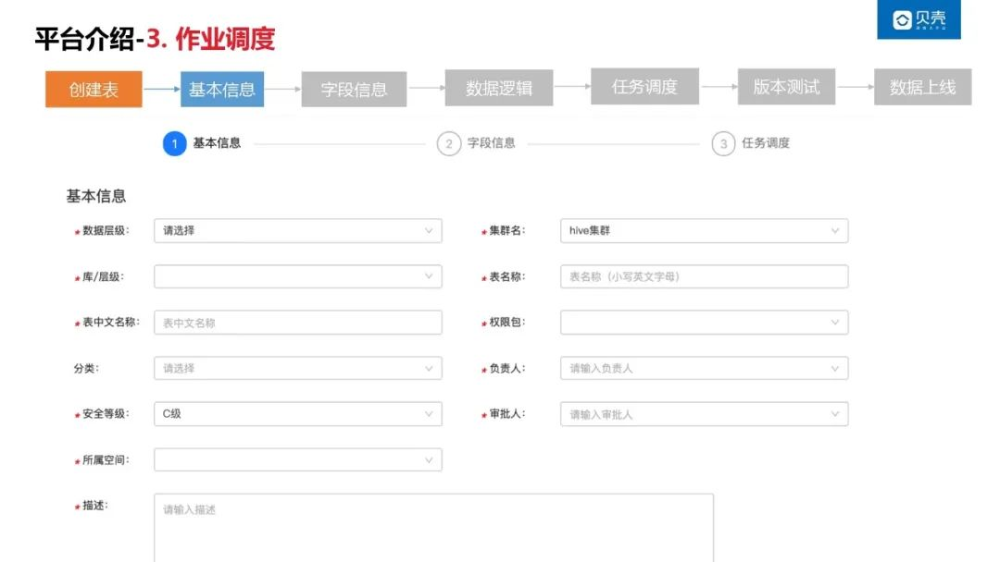

在平台创建一张表，填一些表的一些基本信息，它属于哪个层级的，它属于哪个库的，按照模型去定义好对应的表名，然后它的负责人是谁之类的一些基本信息。

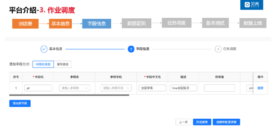

然后再说我们这张表应该有哪些字段信息，这些我们可以通过可视化添加，比如说我们去新加字段还可以，就是说我们通过语句添加生成这个字段。

然后去做一个业务逻辑。

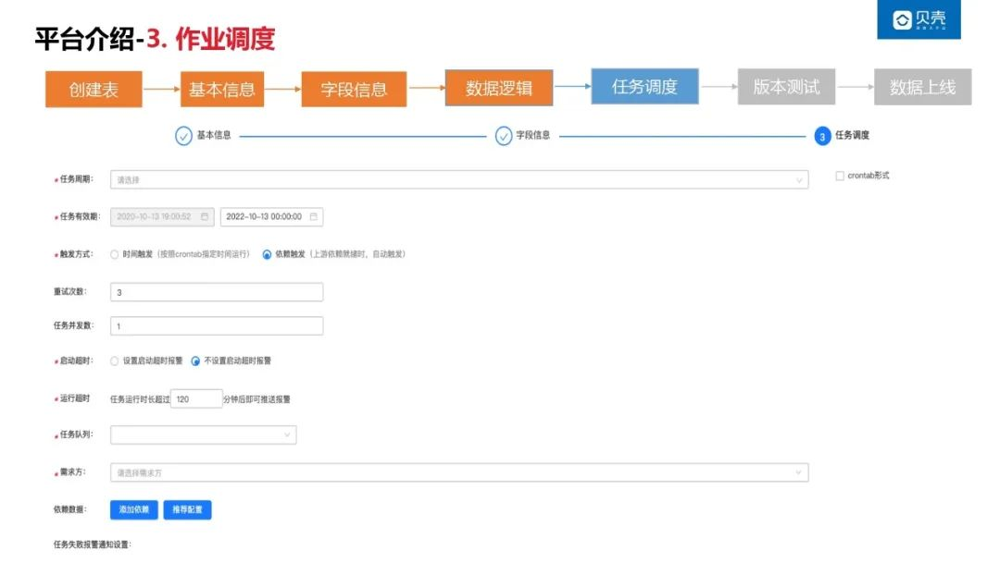

大家都知道，我们数据开发基本上就是要么写个 INSERT OVERWRITE AS SELECT，可以直接在平台完成开发操作。写完之后我们就可以简单的去做一个调度的配置，就是说我们这个任务，计划该是明天几点跑，或者说每周的几点跑，每月的几点跑，我们依赖的上游任务有哪些，我们任务失败报警应该报给谁之类的，这些在这做简单的配置之后，我们就会生成一个版本。

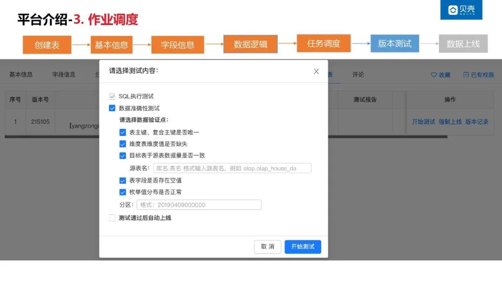

那么这个版本，我们就可以进入到测试阶段。测试过程包括，SQL 语法校验，任务结果准确性测试。

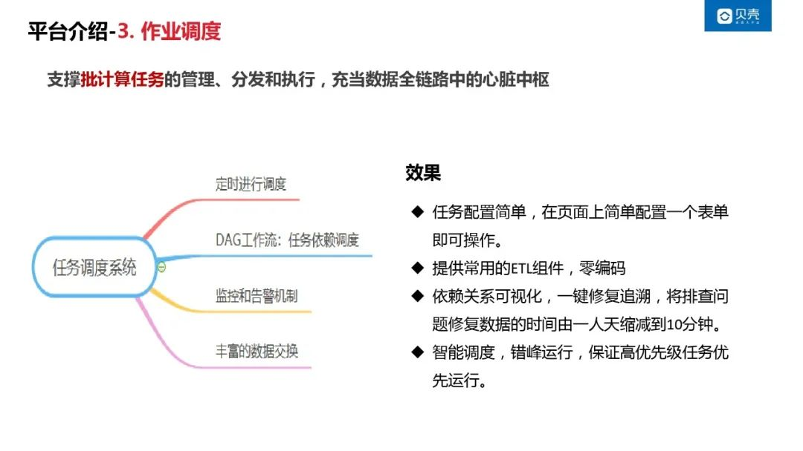

做完发现这数据没有问题了，就可以达到上线的环境进行调度，实际上就是我们的调度系统。它能帮助我们把周期性的任务，按照时间顺序，基于工作流依赖进行调度起来。而且能支持许多丰富的数据交换场景。

第一，它是个简单配置，刚才看的页面就能完成我整个配置的一些需求，然后还提供了一些常用的一些 ETL 组件，比如说我们的报警监控这一块儿，原来我们是每次报警，我们写一段代码，把所有的信息写进去，然后告诉他我要报给谁，我应该是怎么报之类的。那么这一块我们就直接假如说我要发一个失败了发一个邮件，那不就只用填一个 Email 邮箱，或者说发给短信就直接填个手机号就能搞定。

同时，我们得有一个依赖，那么还有个推荐依赖，这一块就可以有一个依赖关系的一个可视化，能知道我们数据是从哪个节点出现问题了，假如说我这个数据一直没运行，哪个点判定了，导致了这个事情没运行。现在问题修复时间从原来的一天缩减到现在的十分钟。

还有一个就是我们这些数量数据任务都已经很多了，那么它怎么样让它能高效地运转，让业务能快速的拿到数据，实际上就是这一块就引入了一些调度算法，这块应该引入的一些参数，实际上就是我们的依赖度，执行时长之类的一些因素，还能保证我们高优先的运行。

### 4. 数据质量

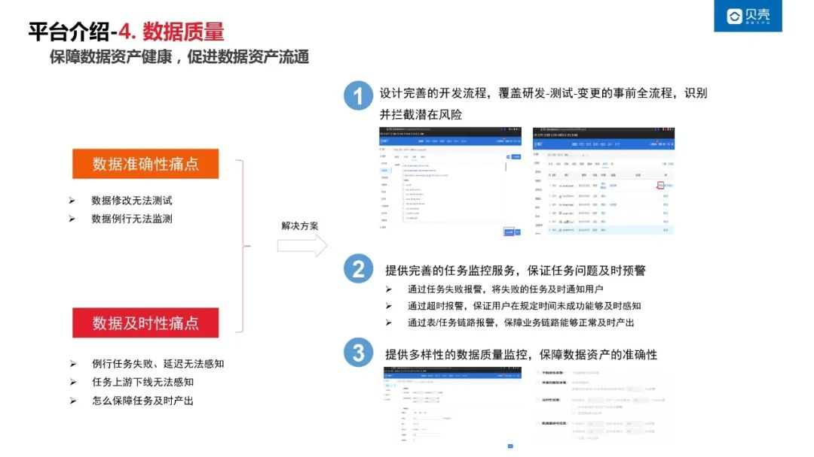

① 提出问题

这些数据已经都能跑了。那么它对应的质量怎么样？实际上它有的一个及时性和准确性的概念，就是说我们数据怎么能让他及时的让用户拿到，即使拿到了之后，它怎么样是准确的。比如说我今天拿了一个表，发现里面数据是空的，或者说里面本来是个交易额，结果是个零，这个数据肯定是不准确的，所以它就会有一个数据质量这一块儿。大部分场景下，我们数据开发人员都是通过 SQL 的形式完成业务表达，写好的 SQL 逻辑放在调度上，我们怎么样去测试？这是一个问题。第二个是我们数据每日运行的任务，这到底是失败的还是成功的？我这任务有没有运行，这是另外一个问题。

② 及时性问题

然后及时性这一块实际上就是我们任务这一块，有一些就是说无法感知的一些东西。假如说老板要我一个集团日报，他要在早上 6 点产出，我们应该怎么办？

我们在上一家公司做的时候，我们集团制日报是也是保证六点产出，但是我们链路比较短，所以我们当时做法是，把所有的 SLA 时间压缩一半，就相当于说三点能够产出。所以我们集团日报最后一个叶子节点在三点能产出，如果产出不了，发现即使它是最源头的一个任务失败了，我们改了之后，我也可以拿剩下的时间去运行，也能保证到我们六点能够及时产出到这个日报。

但是对于贝壳这个业务场景非常复杂，它的链路非常长。即有些任务它运行的时间超过半小时，或者说一小时，那么整个链路跑下来估计有五六个小时。如果是说我们到五六点的时候才去发现叶子节点没跑完，结果是我们最上层一个节点是失败的，那么我们改完之后再去跑，结果肯定是到 12 点才能说拿到这些数据，这还是如果顺利的话。如果不顺利的话，可能我到 12 点还拿不到这个数据。

③ SQL 解析

第一，就是测试环节，关于 SQL 需要进行检验。第一个方式是我们 SQL 逻辑写完之后，我们会经过 SQL 解析去看他写语法有没有错误，比如说我写了个 Left Join，但是后面没没有 on 的一些关键字；或者说我在这里面写了一个 select 没有 from，它是能通过 SQL 语法解析解释出来的。但是还有可能存在其他的问题，就可以通过第二种方式，使用 Explan 模式去让它去生成一个执行计划，看看它是不是有问题。

这里面的一个我们当时遇到一些场景，我们 SQL 解析出来了，但是它没有语法错误，但是我们这里字段里面发现有一个多了个字段，或者说少了一个字段，以及他没法去捕获，结果他任务失败了，所以这就需要我们用 Explan 模式 去生成一个执行计划。

然后及时做了这些，你还不放心，就可以去测试，真真实实地跑一遍，然后去验证它的数据量，验证它的波动性。最后就可以放心的去上线。

④ 监控任务链路

在任务运行中，我们提供了监控任务链路。覆盖了任务失败，任务超时的场景。我们的做法就是，针对每一个任务，会基于它的平均时间去算每一个任务的今天预计理想的一个产生时间，然后再加一些 buffer 时间。基于这个时间去做关于链路下的任务监控。比如说我计算日报应用了上游哪些表，每个表它对应的基准时间是多少，然后基于上下游完成时间的监控，去保证正常且及时的去产出。

⑤ 准确性

然后对于那位数据，还有一个数据的一个准确性，就是我们接入的时候，它是不是完成了完整的接进来。比如说我们一张表，它可能有 3000 万行，结果我们接进来了就 2 万行的数据，那么我们怎么样去监控？然后另外一个就是说我们字段的变化，比如说我们一个表，它知道你改变了，我们怎么样去让它感知了，实际上就是通过我们的采集完整性，做到变化监控，还有一些数据阈值的一些波动性监控。那么这些数据我们都能保证它是正确的及时的完成的。

### 5. 数据开放

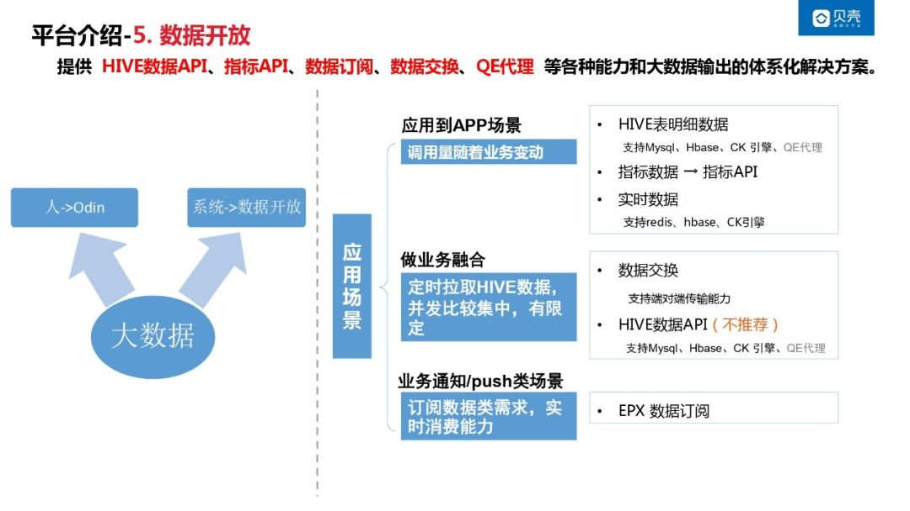

那么怎样数据开放出去，如果没有开放出去，那么它对应的数据实际上就是一个成本，它就是个垃圾。如果是说你不给开放出去了，给业务应用了，那么就是相当于我们的数据释放了价值，

① 对接业务人员

我们数据开放会有两种场景，第一种就是有人来找我们要数据，有人也想经过我们大数据去分析数据，看数据，那么这些就是人。业务人员来找我们大数据要数据的时候，实际上是通过我们奥丁平台去搞定的。奥丁平台是我们自研的一个可视化系统，以及 AdHoc 的一个自身平台的一个集合。可视化的这一块分析可以通过奥丁的可视化报表去看。奥丁的自助分析，比如说我们要做一个 BI 分析师，我要出这个数也要出那个数，我要改口径，那么可以用我们的 AdHoc 自助查询引擎去做这些事情。

② 对接业务系统

第一个场景，贝壳找房里面的地图数据以及我们指表数据，是通过我们数据开放去拿的。它的应用场景，就是我们直接应用到 APP 端，提供了 Hive 明细的一些元数据以及指标。然后还有一些实时的一些数据，实际上就是我们通过实时去计算得到的一些数据。

第二个场景是拿到我们大数据的数据，然后再跟业务的一些部分数据进行融合，得到了一些最终数据。通过数据交换，实际上就是支持端对端的传输能力，把我们的数据直接交换到他们的系统里面，比如说业务系统的 MySQL、MongoDB 等等。

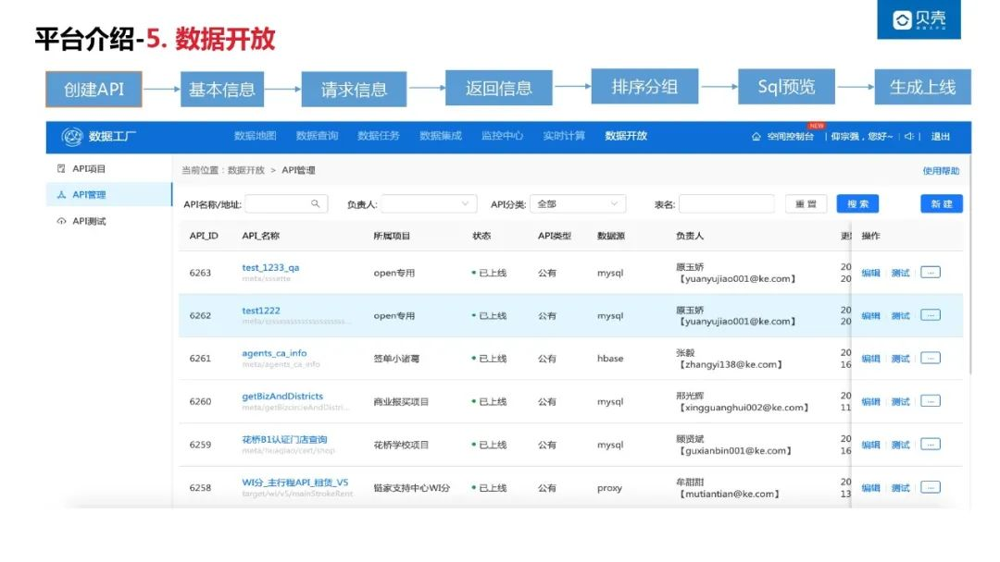

还有一种应用场景，也可以通过大数据 API 拿到数据。去通过一个简单的方式，让用户无编码的方式，去拿到我们这些指标数据。

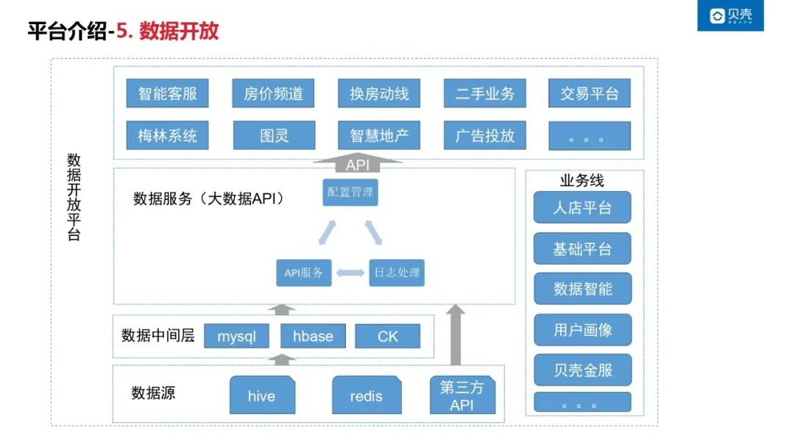

具体的做法就是，通过基本信息/请求信息/返回信息，进行排序预览能完成上线，实际上就是拿到了一个大数据 API，然后它在业务进行调用就够了。在技术架构上我们使用了一个中间层，因为它的数据查询需求会影响资源，还有就是查询的时效性上有要求，比如我们对应的 APP 端它需要的一个性能要求是比较高的，在技术实现上，所以我们借助了一些中间层，比如说 HBASE/CK/MySQL 这些中间层把数据缓存，然后通过 API 的配置，应用到我们的业务。

③ 业务变更通知

然后第三个实际上就是一些数据通知订阅的能力，实际上就是我们数据改变了，或者说我们数据有个结构变了，那么怎么样让业务去感知到，我这边增加了一些房子，就是房源系统里面我添加了一个房子，我怎么样在业务房源列表里面能实时看到，实际上就接助了一个 EPX 的一个订阅能力。

这就是我们整个大数据平台，从输入的集成管理，然后到开发到运维以及到开放出去整个流程的能力建设，目前来看能达到一个很好的一些成果。

## 总结与展望

- 数据资产化管理，全链路数据追踪和分析，提升数据价值
- 加密、脱敏、敏感监控等多种安全策略，全方位保障数据的存储、访问、传输过程
- 沉淀一系列的技术能力和组件集合，构建共性能力和通用服务，打造企业级大数据平台

在未来我们会集成更多的能力，例如说我们的 IDE 的一些能力；还有一个就是我们的数据治理的能力；赋能前台实现智能的一些管理，以及提升我们整体的一个开发跟使用的一些效率。目前，数据都集成在我们大数据平台，我们怎么样让它更安全的保障数据的存储，访问跟传输过程，打造我们企业界的一个大数据平台是我们的一个方向。

**分享嘉宾：**

**仰宗强**

贝壳 | 资深工程师

仰宗强，贝壳找房资深数据工程师,现负责贝壳找房一站式大数据开发平台建设。曾就职于百度，参与百度流量数据仓库和工具平台的研发工作。