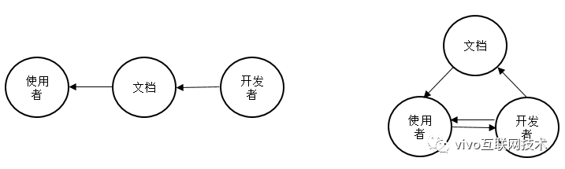
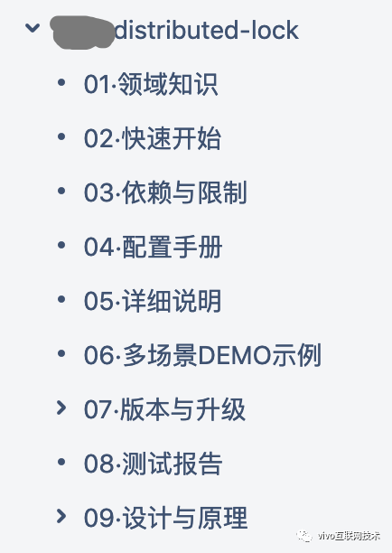
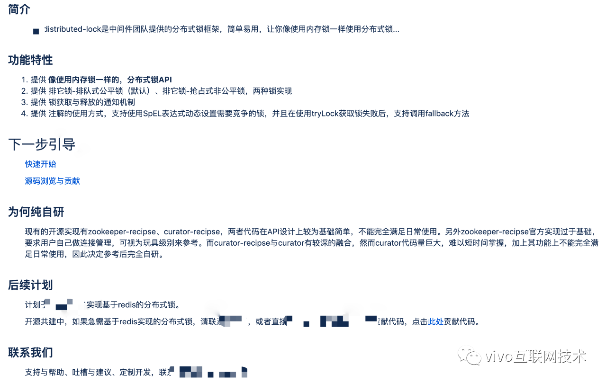
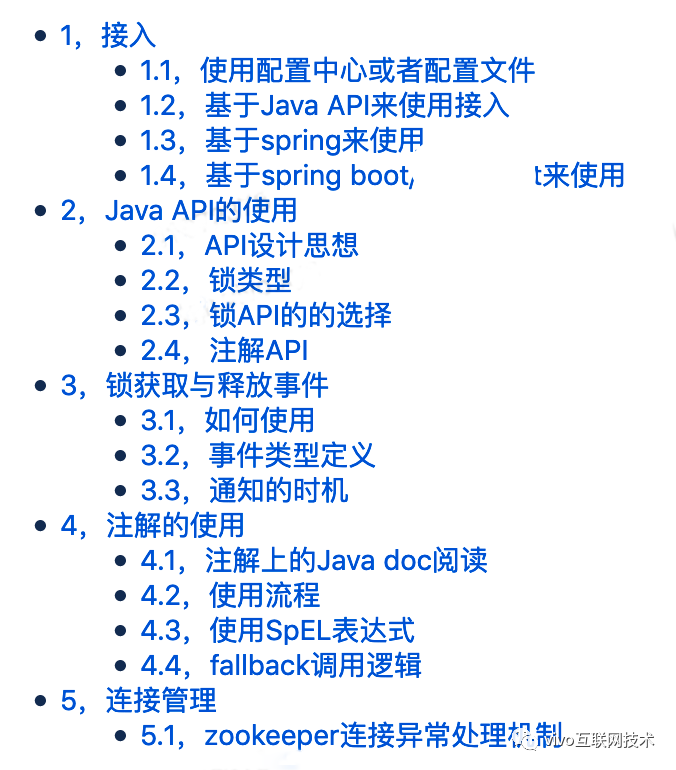
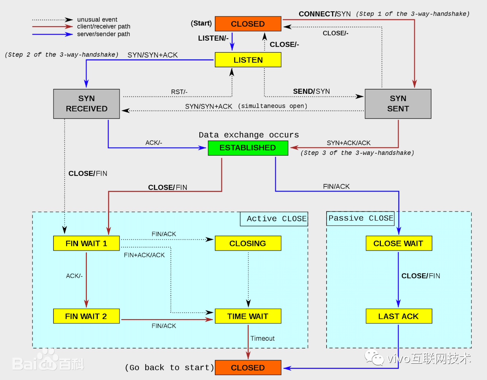
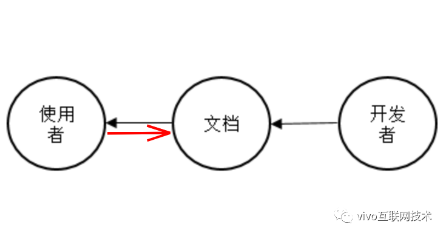

# [开发框架文档体系化的思考](https://my.oschina.net/vivotech/blog/4312347)

本文对自己工作中碰到的大量日常咨询进行经验总结，说明一款开发框架文档应该要写哪些内容。从**功能框架**、**特性使用流程**、**功能描述**三个维度说明文档编写的逻辑性。希望能给同样从事开发框架的开发与维护的同行带来一点启发。

## 一、前言

曾经有一段较为短暂的时间，接手了超过10个开发框架的日常维护，其中大部分还是处于活跃的开发迭代状态。平均下来，那段时间可能每周都有那么一天会被内部即时通讯软件不停打断以至于无法进入既定的工作任务中去，一旦碰到三两个非常棘手，排查起来非常耗时的支持或者问题时，那一周的产出就会比较低了。

有人会说，你不能集中去回答用户的咨询吗？答案是最好不要，因为我们把用户满意度放在很重要的位置，回复的及时性无疑对用户满意度有重要影响。

经过对问题的总结归类：

**（1）第一类约占40%的日常支持**，是关于在某个特定的场景下如何使用这个开发框架（因为接手维护时用户使用文档结构混乱，难以在文档中快速找到想要的内容，或者根本就没有这部分内容，用户只能电话咨询或者面询）；

**（2）第二类约占30%的是使用过程中出现了预期外的状**况，需要帮助定位排查问题；

在多次的思考与总结后，我认为这里面有很大的优化空间，按照我的想法对文档进行优化落地后，预估每周能为我节省出接近1天的时间，接下来我将介绍我的想法及实践经验。

## 二、问题定义及我的思考

### **1、问题描述**

下面我分别给出理想状态（下图左）与现实状态（下图右）下，文档、框架开发者、框架使用者之间的关系。

（图一）

从图中可以看出，理想状态下，开发者只需通过文档向使用者传递信息，实际上很多开源框架在使用的时候也是如此，虽然使用者还是具备与开发者沟通的渠道（例如邮件或者github的issue），但是那是低频的。现实情况下，大公司内部的基础开发框架不仅要编写文档，还需要不停与内部使用者进行多种类多渠道的沟通。

为了能让大家大致理解这是什么样的沟通，以及我面临的文档方面的问题，这里我将过往真实案例，稍作修饰——以期达到较少的案例抽象出较多的问题——陈述如下。

#### **1.1、案例一**

一个老员工希望使用熔断框架保护自己的系统，通过自己保存的我们团队的wiki主页链接找到了熔断框架的文档链接，花了15分钟认真仔细看完全部文档后，不太确定为啥要用我们团队提供的熔断框架，而不直接用开源的，他没有多想，直接按照文档描述写了个demo，最终跑起来了；

接着准备正式应用在业务代码上，他从文档上了解到可能需要根据自己业务情况调整一些初始化参数，但是因为参数说明很简单，以前也没有使用过熔断框架，加上领域知识专业性较强，看了基本不理解具体能达到什么效果，就准备打电话过来咨询下，于是他看到文档的创建人和最近修改人不是同一个人，犹豫了一下，他给最近修改人打了电话。

#### **1.2、案例二**

一个南京的有多年java开发经验的同学，接手了一个有较大数据量的开发任务；由于前面参加了vivo内部基于spirng boot的脚手架(下文简称脚手架)培训分享，从ppt里找到我们的项目网站，并下载了工程，尝试性的从wiki上搜索，找到了我们的文档“使用脚手架快速集成vivo-mybatis”，看完文档后还是不确定他的分库分表之单库多表场景是否支持，于是他打电话过来咨询；咨询完确认支持并了解单库多表与多库多表的配置差异后，他在mybatis的配置文件中加上了分库分表的插件，但是文档没有介绍分库分表的原理，也没有单库多表的配置示例，试了好几次都不行，最后他反编译后看了框架部分源码后明确了配置方式，问题都解决了，但是花费了较大精力。

#### **1.3、案例三**

一个同事在wiki上搜索到了2个关于spring boot工程接入vivo配置中心的文档，是由不同的人编辑维护的，不知道该以哪个文档为准，于是打电话其中一个人反馈了这个情况。后面两个文档的编写者验证情况属实，需要合并，但是难以决定合并后的文档放到配置中心用户文档目录下还是放到脚手架用户文档目录下。

### **2、问题总结**

#### **2.1、案例一问题识别**

**问题1：**文档入口需要口口相传；如果没有保存这个链接信息，那就要从其他同事那里询问。

**问题2：**文档内容存在缺漏，用户短时间就可以看完所有的文档，并且没有按照功能特性进行分类，需要看全部文档。

**问题3：**没有做竞品分析，没有明确介绍内部框架与开源同类框架到底有什么差异。

**问题4：**框架配置参数说明过于简单，没有相应的领域知识介绍，用户看不明白或者不理解。

**问题5：**维护的基于开源的基础框架，没有根据公司开发环境进行定制优化，需要调整参数后才能使用上线。

**问题6：**框架当前的owner从用户角度来说不清晰。

#### **2.2、案例二问题识别**

**问题1：**项目网站地址要人为单独记忆，宣传难度极大。

**问题2：**框架文档没有做到能轻易获取，需要用户尝试不确定性搜索。

**问题3：**用户需要打电话询问是否支持他的场景，说明这个文档没有准确描述支持哪些场景，有遗漏，也没有把相关场景下的demo示例给出来。

**问题4：**框架在打包的时候，没有打源码包。

**问题5：**文档缺乏对实现原理的介绍。

#### **2.3、案例三问题识别**

**问题1**：多个文档说一件事情，说明文档存在混乱的情况。

**问题2：**文档归属到哪个模块难以达成一致，说明没有站在用户角度去划归职责。

## 三、框架文档该写什么

### **1、外行说产品**

本文到现在为止，描述的关于文档的问题以及这些问题出现在什么场景下，已经清晰的浮现于眼前了。但是我们在写文档之前，得先有一个判断标准，怎样的文档才算是好的文档呢？我认为答案很简单，就是只要能减少使用者与开发者间的沟通，只要能提升沟通效率，无限靠近图一中所示的理想状态，那么这个框架的用户文档就算是好的文档。所以你看，文档也是用来解决某个问题的，它可以被视作一款独立的产品。文档该写什么，也就是这个产品应该有什么功能。

接下来我们对文档这款产品进行产品关键特性分析：

- **核心用户：**框架使用者；
- **刚性需求：**基于文档的帮助，快速并顺畅的使用框架；
- **典型场景：**通过阅读框架文档，完成接入、使用、调优、问题排查等日常开发流程；
- **产品概念：**避免或者减少框架使用者与开发者频繁的直接沟通，再不济也要提升沟通效率，让用户更加顺畅的使用，同时将开发者从大量的日常支持中解放出来；
- **竞品调研：**可调研dubbo、spring的用户文档

### **2、文档应当包含哪些内容**

根据自己的过往经验，结合上述产品关键特性分析，我认为完整的框架文档应当包含以下分类的内容。

1. 背景及领域相关知识（介绍背景、基础原理、领域相关知识、专有名词，将部分用户的知识水平尽量拉抬到开发者相同层次）
2. 适用场景，以及场景对应的依赖与限制
3. 接入、使用、调优相关
4. 质量信息（功能测试、性能测试、安全性相关）
5. 用户习惯培养（建议、知识分享、注意事项）
6. 架构设计与源码阅读指引

因为不同框架的文档各个部分的重要性会有所差异，因此以上分类的描述篇幅、呈现方式、内容载体，会有很大差异，下图是我们团队开发的分布式锁框架基于wiki呈现方式的文档目录。前面的序号是为了方便与用户基于文档的沟通（与用户的直接沟通是难以避免的）。

（图二）

### **3、细化落地**

看完上面示例图后，理解会稍微直观点，接下来我将上面的6种较为抽象的分类，细化成具体的wiki的功能页面，当然这只是示例性的：

**（1）框架首页**：对当前框架进行概述性描述，比如宣传标语，具备的功能特性，能解决什么问题，使用场景；下一步引导，社区引导；如果是基于开源版本开发，也可以在此介绍在开源版本基础上做了什么；如果不是，最好能类比下开源同类产品（竞品分析）；还可以有核心指标，用以展示竞争力和受欢迎程度，提升用户的使用信心。

**（2）领域知识：**目标为让用户的相关知识水平与你贴近，让用户理解你的行为与做法，提升用户认可度或者满意度。

**（3）快速开始：**只有最小依赖下的简单场景的快速接入及使用描述，用户拷贝上面的代码即可直接运行，同时描述如何获得它。此处也应该给出示例的demo获取方式。

**（4）依赖与限制：**描述当前框架运行的依赖项，包含运行环境依赖，maven必须依赖与选择依赖列表（例如dubbo使用zookeeper与使用nacos作为注册中心的依赖项有差异），依赖的中间件或者业务系统；限制信息比如不能使用fastjson作为json工具，必须使用cluster模式的redis集群等。

**（5）配置项：**详细描述每一个配置的使用方法，起到什么作用，注意事项，配置key最好有一定设计逻辑，方便理解。

**（6）详细使用说明：**综合性的用户文档，针对所有的能力特性如何使用，进行描述说明，需要说明全部细节。

**（7）多场景使用示例：**从用户各种不同的使用场景出发，给出配置/示例代码，同时给出下载导入IDE即可运行的demo，方便不同需求的用户来阅读。

**（8）版本发布记录：**用于追溯、记录版本的发布时间、变动内容。

**（9）升级指导：**用于指导用户如何升级版本。

**（10）设计及原理：**包含各种类型的设计文档、原理说明、源码导读。帮助深度用户了解运行原理，为源码阅读提供一定的指导；也需要说明设计时遵循了什么规范，帮助用户识别底层特性。

**（11）质量信息：**功能测试报告、性能测试报告、漏洞扫描报告、遵循的标准化规范。

**（12）FAQ：**可以在此页面归纳整理较为典型的/常见的用户疑问，方便其他有类似疑问的同事看（类似最佳实践），减少沟通工作量。需要注意的是，此处只是临时性的公共问题导引地址，从长远看，用户常问的问题需要从系统设计层面进行优化，或者要在详细使用说明处进行显著提示。

## 四、框架文档要怎么写

文档的阅读者一般是程序员，程序员的思维逻辑性较强，因此我们写出来的文档具备较强的逻辑性是基础要求，以下从三个维度来描述文档的逻辑性。

### **1、功能框架逻辑**

文档的整体逻辑建议依据上面的6个分类内容进行“总-分-总”式编写。首先要对框架进行整体介绍，这个可以放到框架首页，接着明确要输出文档的类别（按照框架的不同可以选择性的写对应类别的文档，当然不是一定要输出全部6个类别的文档）及对框架功能特性进行枚举，这是一个“总-分”的过程。接着可以将单个类别的文档或者单个特性的说明文档作为独立的模块，进行详细说明。另外，用户查看频率较高的部分，也应该添加菜单单独编写，方便用户快读查找浏览。我们看下分布式锁框架文档的主页：

（图三）

单个类别的文档在编写的时候，也需要视具体内容的复杂度，多次进行“总-分”形式的拆分。多次拆分后一般需要再次“总”的过程，来组合成一个完整的功能特性。

在图二分布式锁框架的文档目录中，从功能框架逻辑上来说，“依赖与限制”内容虽然也会比较少，但是一般在使用一个框架的时候是必看的内容，因此这里将其作为独立的模块。“快速开始”顾名思义就是引导用户快速了解框架，非常重要，注意要以最简洁的话语、最简的配置、最少的代码、最少的依赖，以最小的篇幅来进行说明，目标是2分钟内能看懂。“配置手册”当然是罗列的全部的框架配置相关，包含功能、性能的调节参数，还要注意将常用配置与不常用的分开，总之一个原则，保持全面完整但是也要按使用频次归类。“详细说明”主要从用户接入、使用、调优、注意事项等角度，对框架进行全方位的说明，一般会占有最大的篇幅。“多场景demo示例”建议枚举用户所有的使用场景，针对场景提供示例代码。“版本与升级”其实就是发布与变更日志，版本兼容性说明，相应的用户的升级注意事项。

如下为我们团队开发的分布式锁框架”详细说明“页面的目录：

（图四）

### **2、功能流程逻辑**

#### **2.1 功能使用**

功能流程逻辑可以理解为一个功能使用时的多个具体步骤的串联。例如使用分布式锁框架的典型步骤如下：

通过maven依赖分布式锁框架jar包->配置zookeeper或者redis的地址->编码(获取锁)->编码(释放锁)

这个过程这么写大家会不会觉得就很明白也很不明白？虽然整体流程是很简单，但是文档绝不可以只是写这些内容，否则会给开发者带来无尽的用户沟通。例如文档还应当包含：指明某个功能最低版本（依赖什么版本的包合适），spring环境、spring boot环境、纯java环境如何依赖，依赖的三方包冲突范围及排查方法，zookeeper配置参数以及集群可用性与框架稳定性说明，zookeeper连接管理说明，锁获取与释放过程可重入性说明，异常处理指导，最佳实践等等，这还是API最基本的使用方式，换做是注解的使用方式，需要说明的细节就更多了。至于应该写清楚哪些细节，可以是逐渐完善的，文档也是需要不断迭代更新的。

为了用户好阅读，建议以流程图的形式，分使用场景逐个进行说明。每个步骤要将相关的细节说清楚，避免用户使用过程的电话沟通确认。

#### **2.2 原理与源码解释**

在进行框架原理或者源码的描述时，时常涉及到状态变化描述、生命周期描述等等，显然使用常规流程图不足以表达清晰，此时换做状态转化图、时序图、加上了泳道的流程图，效果会更好。我们看下TCP连接生命周期状态转化图：

（图五）

### **3、功能描述逻辑**

在功能流程逻辑中有写到，流程中的每一个步骤，都要写清楚相应的细节，通过文档的不断更新迭代来完善。这里如何把这些细节有条理、完整的描述清楚，需要注意以下几点：

- **完整：**列举所有的可能项，逐个说明，不要有疏漏；
- **考虑所有影响点：**例如一个功能配置的变动，可能影响到其他功能；再如如果分布式锁框架中提到的fallback方法返回参数类型与正常业务方法返回参数类型不兼容会怎样？不要让用户去问你；
- **条件判断清晰：**例如在满足什么条件会触发什么逻辑，可以使用if/else/while写出伪代码；
- **含义明确：**所见即所得，用词严谨达意，不可模棱两可；
- **叙述背景：**如果某个功能不是最佳实现，或者与开源方案有差异，最好叙述背景，让用户理解你。

## 五、总结

最后，要意识到每个人的思维方式、逻辑习惯是有差异的，无论花多少心思去写文档，都难以做到十全十美不遗漏无疏忽，因此还需要一个用户反馈的渠道，例如大多数文档系统都有评论功能。下图是文档联系起使用者与开发者后的成熟态。

（图六）

文档编写的基本目的，是帮助使用者来使用框架，但是不能忽略的是，框架的开发者也是文档的重要用户，文档在方便用户的同时，也要方便自己。

本文从日常咨询存在的问题引发出思考，联想到文档也是一个产品，用来解决特定人群的问题。因为不懂产品，不能从产品的专业角度对文档进行解构，只能根据自己经验说明文档应该要写哪些内容，从功能框架、特性使用流程、功能描述时注意事项等说明了文档编写的逻辑性。希望对同样从事开发框架的开发与维护的同行一点启发。

作为框架的开发者，用户的肯定与点赞是我们最好的回报。我们会注重编码质量，但是往往忽略文档的重要性，框架很牛逼但是文档写得很烂，用户用起来不顺畅，会让框架的价值大打折扣。意识到这一点很重要，写出牛逼的代码，文档也写得清晰易读，用户才会觉得框架牛逼，顺带才会认为作者牛逼。牛逼的事情做多了，你的技术影响力自然就上来了。

更多内容敬请关注**vivo 互联网技术**微信公众号