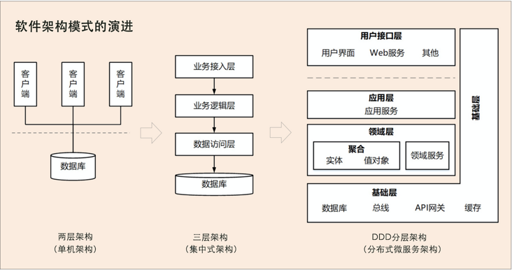
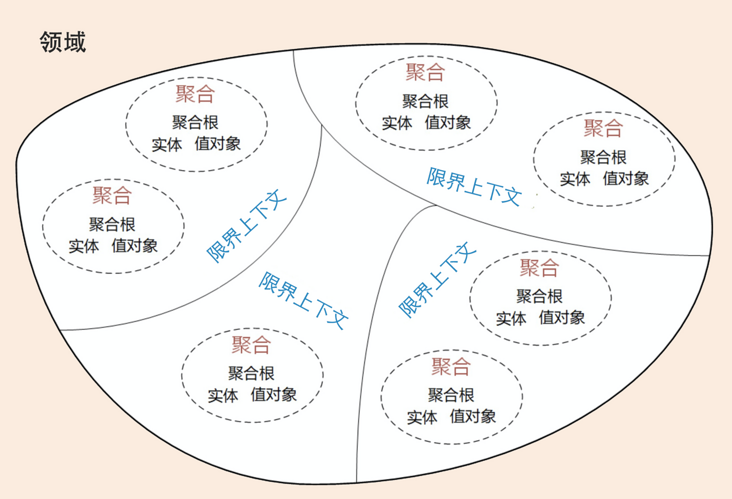
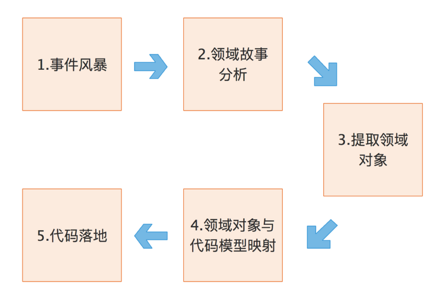

# [DDD学习笔记](https://segmentfault.com/a/1190000022159693)

## 1. 为什么需要DDD，解决了什么问题



#### 当前软件架构模式的演进三阶段：

1. 单机架构（面向过程，2层架构）
2. 集中式架构（面向对象，3层架构或SOA架构）
3. 分布式微服务架构

- 存在的问题
  单机和集中式架构问题在于系统分析设计和开发是独立、分阶段割裂进行，容易信息丢失、上线后需求偏差大，无法快速响应需求和业务的迅速变化
  微服务解决了扩展性、弹性伸缩能力、小规模团队的敏捷开发等等，但微服务需要注意切割的粒度多大、如何拆分设计、边界如何规定等问题，处理不好时会导致拆分过度导致项目复杂度高，无法上线和运维的困境
  `其中根本原因在于不知道业务或者微服务的边界到底在哪里导致，而DDD就很好的指导人们怎么去解决这个问题`

#### DDD（领域驱动设计）：

1. 核心思想是通过领域驱动设计方法定义领域模型，从而确定业务和应用边界，保证业务模型和代码模型的一致性（“高内聚、低耦合”）
2. 一种处理高度复杂领域的设计思想，分离技术实现的复杂性，并围绕业务概念构建领域模型来控制业务的复杂性，以解决软件难以理解、难以演进的问题。
3. 一种架构设计方法论，战略设计（业务视角）和战术设计（技术视角）两部分
   - `战略设计从业务视角出发`，建立业务领域模型、划分领域边界、建立通用语言的限界上下文、限界上下文可以作为微服务设计的参考边界
   - `战术设计从技术角度出发`，侧重于领域模型的技术实现，完成软件开发和落地，包括：聚合根、实体、值对象、领域服务、应用服务和资源库等代码逻辑的设计和实现

##### 如何进行战略设计：



1. 优先建立领域模型
   1. 领域模型用于指导微服务的设计和拆分
   2. 事件风暴是建立领域模型的主要方法，它是一个从发散到收敛的过程
      - 发散过程：采用用例分析、场景分析、用户旅程分析，尽可能全面不遗漏地分解业务领域，并梳理领域对象之间的关系
      - 收敛的过程：过程中产生很多的实体、命令、事件等领域对象、我们将这些领域对象从`不同的维度`进行聚类，形成聚合、限界上下文等边界，建立领域模型
2. 利用三步划定领域模型和微服务边界
   1. 事件风暴中梳理业务过程中的用户操作、事件以及外部依赖关系等，根据这些要素梳理出领域实体等领域对象
   2. 根据领域实体之间的`业务关联性`，将业务紧密相关的实体进行组合形成聚合，同时确定聚合中的聚合根、值对象和实体。聚合之间的边界是第一层边界，它们在同一个微服务实例中运行，这个边界是逻辑边界，所以用虚线表示
   3. 根据业务及语义边界等因素、将一个或者多个聚合划定在一个限界上下文内，形成领域模型。限界上下文之间的边界是第二层边界，这一层边界可能就是未来微服务的边界，不同限界下下文内的领域逻辑被隔离在不同的微服务实例中运行，物理上互相隔离，所以是物理边界，边界之间用实线表示
3. 战略到战术设计的实施过程中（落地过程中）
   - 将领域模型中的领域对象与代码模型中的代码对象建立映射关系，
   - 将业务架构和系统架构进行绑定
   - 当我们去响应业务变化调整业务架构和领域模型时，系统架构也会同时发生调整，并同步建立新的映射关系。

#### DDD与微服务

1. 不同定位
   - DDD是架构设计方法
   - 微服务是架构风格
2. 共同目标
   - 追求高响应力，从业务视角去分离应用系统建设复杂度的手段
   - 强调业务触发，其核心要义是强调根据业务发展，合理划分领域边界，持续调整现有架构，优化现有代码，以保持架构和代码的生命力
3. 不同关注
   - DDD关注：从业务领域视角划分领域边界，构建通用语言进行高效沟通，通过业务抽象，建立领域模型，维持业务和代码的逻辑一致性
   - 微服务关注：运行是的进程间通信、容错和故障隔离，实现去中心化数据管理和去中心化服务治理，关注微服务的独立开发、测试、构建和部署

> DDD不仅可以用于微服务设计，还可以很好地应用于企业中台的设计

#### DDD运用难点

> ```
> DDD 战术设计对设计和开发人员的要求相对较高，实现起来相对复杂。`
> `不同企业的研发管理能力和个人开发水平可能会存在差异。`
> `尤其对于传统企业而言，在战术设计落地的过程中，可能会存在一定挑战和困难，我建议你和你的公司如果有这方面的想法，就一定要谨慎评估自己的能力，选择最合适的方法落地 DDD。
> ```

#### DDD的收获总结

1. DDD 是一套完整而系统的设计方法，它能带给你从战略设计到战术设计的标准设计过程，使得你的设计思路能够更加清晰，设计过程更加规范。
2. DDD 善于处理与领域相关的拥有高复杂度业务的产品开发，通过它可以建立一个核心而稳定的领域模型，有利于领域知识的传递与传承。
3. DDD 强调团队与领域专家的合作，能够帮助你的团队建立一个沟通良好的氛围，构建一致的架构体系。
4. DDD 的设计思想、原则与模式有助于提高你的架构设计能力。无论是在新项目中设计微服务，还是将系统从单体架构演进到微服务，都可以遵循 DDD 的架构原则。
5. DDD 不仅适用于微服务，也适用于传统的单体应用。

## 2. 有哪些元素组成

- 概念名词：(`概念总结`)

  |    名称    |    简要解释     |      |
  | :--------: | :-------------: | ---- |
  |    领域    |     Domain      |      |
  |    子域    |   Sub Domain    |      |
  |   核心域   |   Core Domain   |      |
  |   通用域   |  Common Domain  |      |
  |   支撑域   | Support Domain  |      |
  |  通用语言  | Common Language |      |
  | 限界上下文 | Bounded Context |      |
  |    实体    |     Entity      |      |
  |   值对象   |   ValueObject   |      |
  |    聚合    |    Aggregate    |      |
  |   聚合根   |  AggregateRoot  |      |

- 参与角色：

  |   名称   |
  | :------: |
  | 领域专家 |
  | 产品经理 |
  | 项目经理 |
  |  架构师  |
  | 开发经理 |
  | 测试经理 |

## 3. 如何划分领域、子域、通用域、支撑域

#### 什么是领域

领域：是用来确定范围，范围即边界（DDD设计中不断强调边界的原因）。而在DDD中代表着这个边界内要解决的业务问题域

#### 总体思路

业务领域细分 -> 问题范围限定在特定的边界内 -> 边界内建立领域模型 -> 代码实现领域模型 ->解决相应业务问题

#### 子域划分

1. 子领域：领域用来限定业务边界和范围，自然有大小之分，所以从领域可划分子领域，每个子域对应一个更小的问题域或更小的业务范围
2. 基本思路：
   1. 领域建模和微服务建设的过程和方法基本类似，其核心思想就是将问题域逐步分解，降低业务理解和系统实现的复杂度
3. `划分思路类比自然科学研究过程`：
   1. 确定研究对象 -> 领域
   2. 对研究对象进行细分为器官 ->问题子域
   3. 对器官进行细分为组织 -> 再次细分子域
   4. 对组织进行细分为细胞，细胞壁确定了单元边界 -> 最小边界
4. 子域分类：
   核心域:`决定产品和公司核心竞争力的子域`，业务成功的主要因素和公司的核心竞争力
   通用域：没有太多个性化的诉求，同时被多个子域使用的通用功能子域
   支撑域：不包含决定产品和公司的核心竞争力的功能呢，也不包含通用功能的子域

## 4. 如何划分限界上下文

> 通用语言定义上下文含义，限界上下文则定义领域边界,以确保每个上下文含义在他特定的边界内都具有唯一的含义，领域模型则存在于这个边界之内

#### 什么是通用语言

1. 概念阐述
   - 在事件风暴过程中通过团队交流达成共识的，能够简单、清晰、准确描述业务涵义和规则的语言就是通用语言
   - 目标解决交流障碍这个问题，是领域专家和开发人员能够协同合作，从而确保业务需求的正确表达
   - 通用语言包含属于和用例场景，并且能够直接反应在代码中。
   - 不同类型不同含义
     - 名词可以给领域对象命名，如商品、订单等，对应实体对象
     - 动词可以表示一个动作或者事件，如商品已下单、订单已付款等，对应领域事件或命令
   - 其作用贯穿DDD整个设计过程
2. 从事件风暴建立通用语言到领域对象设计和代码落地完整过程：



```markdown
1.  通过事件风暴过程：领域专家、设计、开发人员一起建立领域模型，在领域建模的过程中会形成通用的业务术语和用户故事。(事件风暴也是一个项目团队统一语言的过程)
2.  通过用户故事分析会形成一个个的领域对象，这些领域对象对应领域模型的业务对象，每个业务对象和领域对象都有通用的名词术语，并且一个个映射
3.  微服务代码模型来源于领域模型，每个代码模型的代码对象跟领域对象一一对应
```

> 小方法：设计过程中可以用一些表格来记录事件风暴和微服务设计过程中产生的领域对象及其属性

1. 要点
   - DDD分析和设计过程中的每一个环节都需要保证限界上下文内属于的统一，在代码模型设计的时候就要建立领域对象和代码对象的一一映射，从而保证业务模型和代码模型的一致，实现业务语言与代码语言的统一

#### 什么是限界上下文

1. 概念阐述

   - DDD在战略设计上提出了`限界上下文`这个概念，用来确定语义所在的领域边界
     - 限界: 领域的边界
     - 上下文：语义环境
   - 限界上下文就是用来封装通用语言和领域对象，提供上下文环境，保证在领域之内的一些属于、业务相关对象等（通用语言）有个确切的含义，没有二义性
   - 领域边界就是通过限界上下文来定义的，而这个边界定义了模型的适用范围，使团队所有成员能够明确地知道什么应该在模型中实现，什么不应该在模型中实现
     - 通过领域的限界上下文，就可以在同一的领域边界内用同一的语言进行交流

2. 限界上下文和微服务的关系
   将限界上下文内的领域模型映射到微服务，就完成了从问题域到软件的解决方案

   > `疑惑仓储到底是什么实现？`

## 5. 如何划分实体、值对象

#### 什么是实体

1. 实体：拥有唯一标识符，且标识符在经历各种状态变更后仍能保持一致
2. 形态表现
   - 业务形态：领域模型中的实体是多个属性、操作或信用的载体；事件风暴中，根据命令、操作或者事件、找出产生这些行为的业务实体对象、进而按照一定的业务规则将依存度高和业务关联紧密的多个实体对象和值对象进行聚类，形成聚合。 实体和值对象是组成领域模型的基础单元
   - 代码形态：实体类，类包含了实体的属性和方法，通过这些方法实现实体自身的业务逻辑。DDD里，这些实体类通常采用`充血模型`，与这个实体相关的所有业务逻辑都在实体类的方法中实现，跨多个实体的领域逻辑则在领域服务中实现
   - 运行形态：DO（领域对象）的形式存在，每个实体对象都有唯一的ID。可以对实体对象进行多次修改，由于拥有相同ID，他们依然是同一个实体。
   - 数据库形态：领域模型映射到数据模型时，一个实体可能对应0~n个数据库持久化对象（通常为1）
     - 用户&角色 可组合得出 权限实体 （2个持久化对应1个实体）
     - 客户信息&账户信息存同一张表 （2个实体对应1个持久化）

#### 什么是值对象

1. 值对象：通过对象属性值来识别的对象，它将多个相关属性组合成一个概念整体，描述领域的特定方向，并一个没有标识符的对象

   - 本质是一个集合，若干个用于描述目的、具有整体概念和不可修改的属性
   - 存在的意义，领域建模过程中保证属性归类的清晰和概念的完整性，避免属性零碎

2. 形态表现

   - 业务形态：基础对象，来源于实践风暴所构建的领域模型。

     > 本质上，实体是看得到、摸得着的实实在在的业务对象，实体具有业务属性、业务行为和业务逻辑。而值对象只是若干个属性的集合，只有数据初始化操作和有限的不涉及修改数据的行为，基本不包含业务逻辑。值对象的属性集虽然在物理上独立出来了，但在逻辑上它仍然是实体属性的一部分，用于描述实体的特征。

   - 代码形态：单一属性时，则直接定义为实体类的属性，如果是属性集合时，设计为Class类（没有ID）

   - 运行形态：两种不同的数据格式分别属性嵌入（1:1时，直接平铺注入）、序列化大对象（1:n，序列化成大对象JSON串嵌入）

   - 数据库形态：值对象的属性值和实体对象的属性值保存在同一个数据库实体表中

     > DDD 引入值对象是希望实现从“数据建模为中心”向“领域建模为中心”转变，减少数据库表的数量和表与表之间复杂的依赖关系，尽可能地简化数据库设计，提升数据库性能。
     > 在领域建模时，我们可以将部分对象设计为值对象，保留对象的业务涵义，同时又减少了实体的数量；在数据建模时，我们可以将值对象嵌入实体，减少实体表的数量，简化数据库设计。

3. 值对象的优势和局限：双刃剑的存在

   - 优势：简化数据库设计，减少实体表的数量，提升数据库性能
   - 局限：无法满足基于值对象的快速查询，值对象过多时导致堆积缺乏完整性的属性失去业务含义以及操作不方便

4. 实体与值对象的关系：

   - 最基础的对象，一起实现实体最基本的核心领域逻辑
   - 引入值对象的重要原因在于 DDD提倡从领域模型设计出发，而不是先设计数据模型

## 6. 如何划分聚合和聚合根

#### 什么是聚合

1. 领域模型内的实体和值对象就好比个体，而能让实体和值对象协同工作的组织就是聚合，它用来确保这些领域对象在实现共同的业务逻辑时，能保证数据的一致性
   - 聚合就是由业务和逻辑紧密关联的实体和值对象组合而成的，聚合是数据修改和持久化的基本单元，每一个聚合对应一个仓储，实现数据的持久化
2. 聚合的组成
   1. 聚合根
   2. 上下文边界：边界根据`业务单一职责`和`高内聚原则`,定义聚合内部应该包含哪些实体和值对象，而聚合之间的边界是松耦合。（高内聚、低耦合）
3. 聚合运用
   1. 属于DDD分层架构里的领域层，包含多个聚合，共同实现核心业务逻辑
   2. 聚合内实体以`充血模型`实现个体业务能力，以及业务逻辑的高内聚
   3. 跨多个实体的业务逻辑通过领域服务来实现
   4. 跨多个聚合的业务逻辑通过应用服务来实现

#### 什么是聚合根

1. 目的是为了避免由于复杂数据模型缺少统一的业务规则控制，而导致聚合、实体之间数据不一致性的问题
2. 如果把聚合比作组织，那聚合根就是这个组织的负责人。聚合根也称为根实体，它不仅是实体，还是聚合的管理者
   1. 作为实体本身，拥有实体的属性和业务行为，实现自身的业务逻辑
   2. 作为聚合的管理者，在聚合内部负责协调实体和值对象按照固定的业务规则协同完成共同的业务逻辑
   3. 聚合对外的接口人，以聚合根 ID 关联的方式接受外部任务和请求，在上下文内实现聚合之间的业务协同

#### 如何设计聚合

> DDD 领域建模通常采用事件风暴，它通常采用用例分析、场景分析和用户旅程分析等方法，通过头脑风暴列出所有可能的业务行为和事件，然后找出产生这些行为的领域对象，并梳理领域对象之间的关系，找出聚合根，找出与聚合根业务紧密关联的实体和值对象，再将聚合根、实体和值对象组合，构建聚合。

1. 采用事件风暴，根据业务行为，梳理出业务过程中发生这些行为的所有的实体和值对象
2. 从众多的实体中选择适合作为对象管理者的根实体（聚合根）。
   1. 判断一个实体是否是聚合根
      1. 是否有独立生命周期
      2. 是否有全局唯一ID
      3. 是否可以创建或修改其他对象
      4. 是否有专门的模块来管这个实体
3. 根据业务单一职责和高内聚原则，找出与聚合根关联的所有紧密依赖的实体和值对象
4. 在聚合内根据聚合根、实体和值对象的依赖关系，画出对象的引用和依赖模型
5. 多个聚合根据业务语义和上下文一起划分到同一个限界上下文内

#### 设计原则

1. 在一致性边界内建模真正的不变条件。聚合用来封装真正的不变性，而不是简单地将对象组合在一起。聚合内有一套不变的业务规则，各实体和值对象按照统一的业务规则运行，实现对象数据的一致性，边界之外的任何东西都与该聚合无关，这就是聚合能实现业务高内聚的原因。
2. 设计小聚合。如果聚合设计得过大，聚合会因为包含过多的实体，导致实体之间的管理过于复杂，高频操作时会出现并发冲突或者数据库锁，最终导致系统可用性变差。而小聚合设计则可以降低由于业务过大导致聚合重构的可能性，让领域模型更能适应业务的变化。
3. 通过唯一标识引用其它聚合。聚合之间是通过关联外部聚合根 ID 的方式引用，而不是直接对象引用的方式。外部聚合的对象放在聚合边界内管理，容易导致聚合的边界不清晰，也会增加聚合之间的耦合度。
4. 在边界之外使用最终一致性。聚合内数据强一致性，而聚合之间数据最终一致性。在一次事务中，最多只能更改一个聚合的状态。如果一次业务操作涉及多个聚合状态的更改，应采用领域事件的方式异步修改相关的聚合，实现聚合之间的解耦（相关内容我会在领域事件部分详解）。
5. 通过应用层实现跨聚合的服务调用。为实现微服务内聚合之间的解耦，以及未来以聚合为单位的微服务组合和拆分，应避免跨聚合的领域服务调用和跨聚合的数据库表关联。

> DDD 的一些通用的设计原则，还是那句话：“适合自己的才是最好的。”在系统设计过程时，你一定要考虑项目的具体情况，如果面临使用的便利性、高性能要求、技术能力缺失和全局事务管理等影响因素，这些原则也并不是不能突破的，总之一切以解决实际问题为出发点。

## 结语

以上内容为在学习“极客时间-欧创新老师-DDD实战课”过程中记录下来的笔记，有兴趣的同学可以买教程细细研究保证有收获！