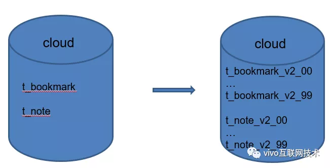

# [vivo 云服务海量数据存储架构演进与实践](https://my.oschina.net/vivotech/blog/4718977)

# 一、写在开头

vivo 云服务提供给用户备份手机上的联系人、短信、便签、书签等数据的能力，底层存储采用 MySQL 数据库进行数据存储。

随着 vivo 云服务业务发展，云服务用户量增长迅速，存储在云端的数据量越来越大，海量数据给后端存储带来了巨大的挑战。云服务业务这几年最大的痛点，就是如何解决用户海量数据的存储问题。

# 二、面临挑战

2017-2018年，云服务产品核心指标着重于提升用户量。云服务在产品策略上做了重大调整，用户登录 vivo 账号后默认开启云服务数据同步开关。

此产品策略给云服务用户量带来了爆发式的增长，用户量从百万级别直接跳跃至千万级别，后端存储的数据量也从百亿级别飞跃至千亿级别。

为了解决海量数据的存储问题，云服务将分库分表的 4 板斧：水平分表、垂直分表、水平分库、垂直分库，全部进行了实践。

## 1、水平分表

> **荆棘之路 1：**浏览器书签、便签单库单表，单表数据量已过亿级怎么办？

相信了解过分库分表知识体系的兄弟很快能够回答：单表数据量过大那就进行分表。我们也是如此做的，将浏览器书签、便签模块单表拆分至 100 张表。

将浏览器书签、便签单表**亿级**数据量迁移至 100 张分表里，每张表承载 **1000W** 的数据量。

这就是大家熟悉的第一板斧：**水平分表**。

 

 

## 2、水平分库

> 荆棘之路 2：联系人、短信数据已分表，但是最初只分了 50 张表，未进行分库。用户量爆发式增长后，单库联系人总数据量已到达 几十亿，单表数据量已高达5000W ,继续增长将严重影响mysql性能，怎么办？

**第二板斧，水平分库**：1个库支撑不住，那就多分几个库。我们**将原来单库拆分成10个库**，并且将原来单库联系人、短信50张表扩展至100张表，同样期间进行了几十亿存量数据的迁移重路由，十分痛苦。

 

## 3、垂直分库、垂直分表

> **荆棘之路3：**最初云服务各个模块的数据存储都冗杂在一起。
>
> 当空间存在瓶颈后，我们对各模块数据的存储空间分布进行了分析，情况如下：
>
> 单库磁盘容量**5T**，**联系人数据**占用存储空间**2.75T（55%）**，**短信数据**占用存储空间**1T（20%）**，**其他所有模块数据**共占用存储空间**500G(5%)**，**剩余可用空间1T**， 联系人、短信数据即占用了总空间的**75%**。
>
>  剩余1T的空间容量是无法支撑用户数据的持续增长,情况不容乐观。若空间不足，所有模块都会因为空间问题导致不可用，怎么办？

（下图为云服务当时的数据存储空间分布图）

 

**第三、四板斧，垂直分库、垂直分表：**我们将联系人数据、短信数据和其他模块数据进行存储解耦。将联系人数据、短信数据都单独拆分成库。

至此，云服务将分库分表的 4 板斧全部实践了一遍，数据该拆的拆，该分的分。

## 4、基于路由表的动态扩容方案

> **荆棘之路4：**从上述描述得知拆分出来的联系人数据库采用固定10个库的分库策略，前期评估10库*100张表是可以满足业务数据增长需求的，本以为可以高枕无忧，但是联系人数据增长速率超出了预期。
>
> 联系人数据库单独拆分**9个月**之后，单个库的存储空间**从35%增长至65%**。按照这个增长速度，再支撑6个月，独立拆分出来的联系人数据库将再次面临空间不足问题。

如何解决？继续扩容是肯定的，核心点在于采用哪种扩容策略。如果采用常规的扩容方案，那我们将面临着海量存量数据的迁移重新路由问题，成本太大。

经过技术组沟通讨论，结合云服务联系人业务的自身特性（老用户的联系人数量基本上是稳定的，不会频繁的添加大量的联系人,老用户联系人数据增长的速率可控），我们最终采用了基于路由表的动态扩容方案。

**以下介绍下此方案特点：**

- 添加用户路由表，记录用户联系人数据具体路由在哪个库，哪张表；
- 新用户的联系人数据会路由到新扩容的数据库里，不会对原有老库造成数据存储压力。
- 老用户的数据不会动，还是保存在原来的数据库。
- 此方案的特点是保证了原有老库只需保证老用户的数据增长即可，新用户全部由新扩容的库来承载。

 

老用户联系人的增长速率虽然可控，但我们期望**原老库能预留60%的存储空间来支撑老用户的数据增长。目前老库只剩余35%的可用空间，不符合我们的要求。**

为了降低老库数据占用的存储空间，自然而然我们想到了从**数据压缩**层面着手。

# 三、压缩方案预研

云服务对数据库数据压缩进行了以下3种方案的预研：

**方案1：程序自行实现数据压缩，压缩后再保存至数据库**

**优势：**

> 无需对数据库进行任何改造，修改完全由程序自己收敛，可以自由控制需要进行压缩的字段。

**劣势：**

> 存量数据需要开发额外的压缩任务进行数据压缩，且存量数据量级过大，靠程序进行数据压缩耗时不可控。
>
> 数据压缩入库后，需要从db平台直接进行select查询字段的内容不再是可读的，加大了后续定位问题的难度。

**方案2：MySQL 数据库 InnoDB 自带的数据压缩能力**

**优势：**

> 利用 InnoDB 已有的能力进行数据压缩，对于上层程序无需做任何改造，且不影响后续select数据查询。

**劣势：**

> 适用于数据量较大，读多写少的业务场景，且对要求高查询性能的业务不太合适。

**方案3：切换InnoDB 存储引擎至TokuDB，利用TokuDB引擎天然的数据压缩能力**

**优势：**

> TokuDB天然支持数据压缩，并且支持多种压缩算法，支持频繁的数据写入场景，对于大数据量的存储有天然的优势。

**劣势：**

> MySQL 需要安装额外的插件对TokuDB引擎进行支持，且公司目前没有业务有TokuDB成熟的使用经验，接入后的风险未知，对后续 DBA 的维护也是一项挑战。

我们经过综合考虑，最终决定采用第二种压缩方案：I**nnoDB自有的压缩能力**。

主要原因有以下几点：

- **操作简单：**由dba更改现有innodb数据表的文件格式，即可对数据进行压缩；
- **压缩速度可控：**经过测试，1张2000W的数据表，通过此方式，1-2天内即可完成整张表的数据压缩；
- **改造成本低：**整个改造过程只需要dba执行相关SQL，更改数据表的文件格式，上层的程序代码无需做任何改动；
- **比较适合云服务的业务场景：**用户数据备份、恢复，都不属于高性能、高QPS的业务场景，且云服务的数据表大多符合存在大量字符串字段的特征，非常适合进行数据压缩。

# 四、压缩方案验证

## 1、InnoDB 压缩能力介绍

MySQL 5.1.38 版本之前只有 innodb-base的存储引擎，默认文件格式为Antelope,此文件格式支持2种行格式（ROW_FORMAT）：COMPACT和REDUNDANT，这2种都不是数据压缩类型的行格式。

MySQL 5.1.38后引入innodb-plugin，同时引入了Barracude类型的文件格式。Barracude完全兼容Antelope的文件格式，同时支持另外2种行格式DYNAMIC、COMPRESSED（支持数据压缩）。

## 2、压缩环境准备

修改数据库配置：更改数据库的文件格式，默认为Antelope ，修改为Barracuda

> SET GLOBAL innodb_file_format=Barracuda;
>
> SET GLOBAL innodb_file_format_max=Barracuda;
>
> SET GLOBAL innodb_file_per_table=1

说明：innodb_file_per_table必须设置为1。原因是在InnoDB系统表空间是无法进行压缩的。系统表空间不仅包含用户数据，还包含 InnoDB 内部系统信息，永远不能被压缩，所以需要设置不同表不同的表空间来支持压缩。

设置OK后可以执行SHOW GLOBAL VARIABLES LIKE ‘%file_format%’及SHOW GLOBAL VARIABLES LIKE ‘%file_per%’确认修改是否生效。

 

（此种设置方式只对当前会话生效，mysql实例重启后会失效。若需要永久生效，请在mysql全局配置文件里配置）

## 3、压缩效果测试验证

准备1张支持压缩格式的数据表，1张不支持压缩的数据表，字段格式全部一样。

**压缩表：**

说明：row_format=compressed,指定行格式为compressed。推荐key_block_size=8。key_block_size默认为16，可选值有16、8、4代表的是 InnoDB 数据页大小，值越小压缩力度越大。基于CPU、压缩率综合考虑，线上推荐设置为8。

**非压缩表：**

准备数据：使用存储过程同时向t_nocompress表和t_compress表插入10W条相同的数据。2张表占用空间大小如下图：

t_compress表数据占用10M，t_nocompress表数据占用20M，压缩率50%。

说明：压缩效果取决于表的字段的类型，典型数据通常具有重复值，因此能够有效压缩。CHAR，VARCHAR，TEXT、BLOB这类。

字符串类型的数据通常能够很好地压缩。而二进制数据(整数或浮点数字)、已经经过压缩的数据(JPEG 或 PNG 图像)通常起不到压缩效果。

# 五、线上实践

从上述测试验证来看，压缩率若能达到50%，那么联系人老库占用空间从65%压缩至33%，预留60%的剩余空间是能够达成的。

但是对线上的数据我们需要保持敬畏之心，线上实践之前，需要线下先进行方案验证，同时我们还需要考虑以下问题：

**1、数据压缩，解压操作是否对db服务器的性能造成影响？**

我们采用性能压测的方式来评估压缩前后对数据库服务器CPU的影响。以下是压缩前后db服务器的CPU对比图：

联系人单表数据量已有2000W的前提下，对此表进行数据插入。

**压缩前：**一次性插入50个联系人，并发量200，持续10分钟 ，TPS 150，CPU33%

**压缩后：**一次性插入50个联系人，并发量200，持续10分钟，TPS 140，CPU43%

 

**数据表压缩后，**频繁数据插入数据库CPU确实会增高，但是TPS未受太大影响。经过反复压测，数据库服务器CPU基本稳定在40%左右，是业务可以接受的范围。

**2、变更数据表文件格式是否会对业务SQL读写造成影响，影响正常的业务功能？**

我们主要做了**线下验证**和**线上验证**：

**线下验证：**测试环境将联系人数据表全部调整为压缩格式，安排测试工程师协助点检了联系人的全量功能，最终功能全部正常。

预上线环境按照测试环境的步骤再走一遍，功能点检无异常。

**线上验证：**选取对于用户不敏感的通话记录模块的数据表进行压缩，选择压缩1个库里的1张表，关注此张表的数据读写情况，留意用户投诉。

持续观察了1周后，此张表的通话记录数据能正常进行读写，期间未收到任何用户的异常反馈。

**3、线上联系人联系人数据量庞大，怎么保障压缩时服务的稳定？**

我们主要是按照以下思路来进行权衡：

- 选取1张联系人数据表进行压缩，评估单张表花费的时间。
- 选择单库，进行多表并发压缩，观察CPU占用情况。DBA权衡CPU最高值不能超过55%，以这个标准逐渐调整压缩并发数，保证CPU稳定在55%左右，最终得到单库最多支持多少张表同时进行压缩。
- 结合第一步和第二步我们可以计算出所有库全部数据表压缩完毕大致花费的时间，同步至项目组及相关责任人后，按照步骤实施压缩工作即可。

最终线上联系人数据库进行数据压缩的效果如下：

# 六、写在最后

本文介绍了云服务随着业务发展，海量数据存储所带来的挑战，以及云服务在分库分表、数据库数据压缩上的一些经验，希望能提供借鉴意义。

**InnoDB** 数据压缩适用于以下场景：

> - 业务数据量较大，且数据库磁盘有空间压力的业务；
> - 适用于读多写少的业务场景，对性能、QPS有高要求的业务不太适用；
> - 适用于业务数据表结构中存在大量字符串类型的数据，这种类型的数据表通常能够进行有效的压缩。

最后：

> - 业务在分库分表选型时，一定要做好数据量增长的充分预估，后续数据库扩容带来的数据迁移工作会伤筋动骨。
> - 对线上数据要保持敬畏之心，方案一定是经过线下反复验证之后才能应用到线上。