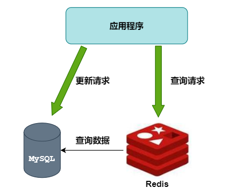
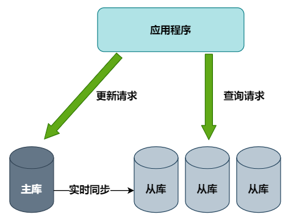
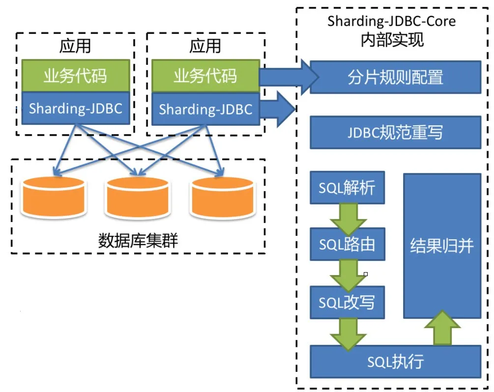
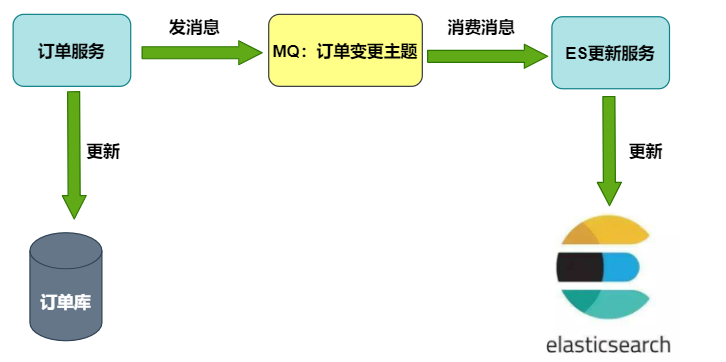
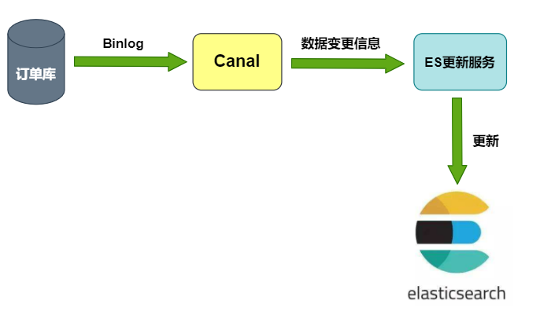
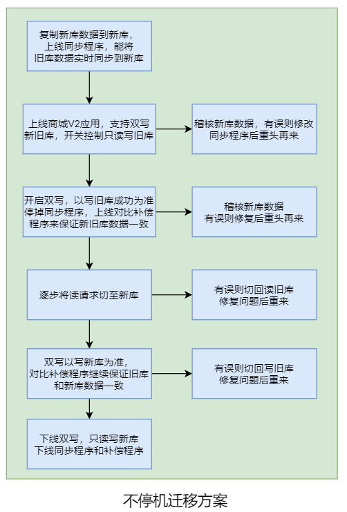
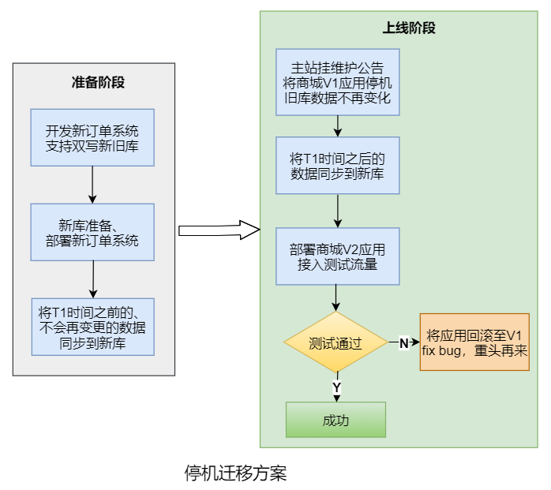
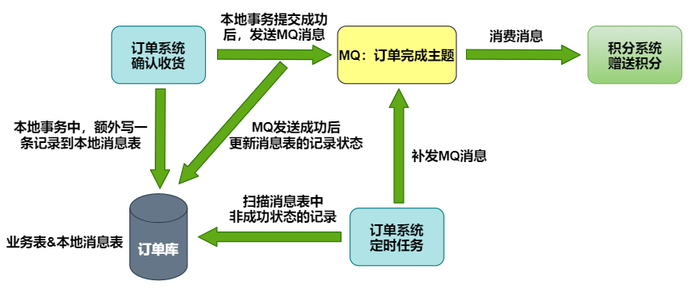
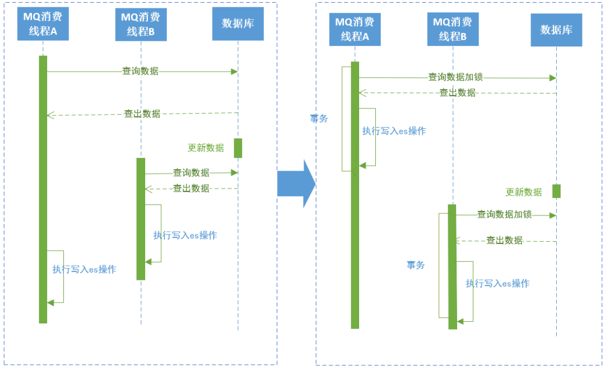

# [vivo 全球商城：订单中心架构设计与实践](https://my.oschina.net/vivotech/blog/4863474)

# 一、背景

随着用户量级的快速增长，vivo 官方商城 v1.0 的单体架构逐渐暴露出弊端：模块愈发臃肿、开发效率低下、性能出现瓶颈、系统维护困难。

从2017年开始启动的 v2.0 架构升级，基于业务模块进行垂直的系统物理拆分，拆分出来业务线各司其职，提供服务化的能力，共同支撑主站业务。

订单模块是电商系统的交易核心，不断累积的数据即将达到单表存储瓶颈，系统难以支撑新品发布和大促活动期间的流量，服务化改造势在必行。

本文将介绍 vivo 商城 订单系统建设的过程中遇到的问题和解决方案，分享架构设计经验。

# 二、系统架构

将订单模块从商城拆分出来，独立为订单系统，使用独立的数据库，为商城相关系统提供订单、支付、物流、售后等标准化服务。

系统架构如下图所示：


# 三、技术挑战


## 3.1 数据量和高并发问题

首先面对的挑战来自存储系统：

- **数据量问题**

  随着历史订单不断累积，MySQL中订单表数据量已达千万级。

  我们知道InnoDB存储引擎的存储结构是B+树，查找时间复杂度是O(log n)，因此当数据总量n变大时，检索速度必然会变慢， 不论如何加索引或者优化都无法解决，只能想办法减小单表数据量。

  数据量大的解决方案有：**数据归档、分表**

- **高并发问题**

  商城业务处于高速发展期，下单量屡创新高，业务复杂度也在提升，应用程序对MySQL的访问量越来越高。

  单机MySQL的处理能力是有限的，当压力过大时，所有请求的访问速度都会下降，甚至有可能使数据库宕机。

  并发量高的解决方案有：**使用缓存、读写分离、分库**

下面对这些方案进行简单描述：

- **数据归档**

  订单数据具备时间属性，存在热尾效应，大部分情况下检索的都是最近的订单，而订单表里却存储了大量使用频率较低的老数据。

  那么就可以将新老数据分开存储，将历史订单移入另一张表中，并对代码中的查询模块做一些相应改动，便能有效解决数据量大的问题。

- **使用缓存**

  使用Redis作为MySQL的前置缓存，可以挡住大部分的查询请求，并降低响应时延。

  缓存对商品系统这类与用户关系不大的系统效果特别好，但对订单系统而言，每个用户的订单数据都不一样，缓存命中率不算高，效果不是太好。



- **读写分离**

  主库负责执行数据更新请求，然后将数据变更实时同步到所有从库，用多个从库来分担查询请求。

  但订单数据的更新操作较多，下单高峰时主库的压力依然没有得到解决。且存在主从同步延迟，正常情况下延迟非常小，不超过1ms，但也会导致在某一个时刻的主从数据不一致。

  那就需要对所有受影响的业务场景进行兼容处理，可能会做一些妥协，比如下单成功后先跳转到一个下单成功页，用户手动点击查看订单后才能看到这笔订单。



- **分库**

  分库又包含垂直分库和水平分库。

  **① 水平分库：**把同一个表的数据按一定规则拆到不同的数据库中，每个库可以放在不同的服务器上。

  **② 垂直分库：**按照业务将表进行分类，分布到不同的数据库上面，每个库可以放在不同的服务器上，它的核心理念是专库专用。

- **分表**

  分表又包含垂直分表和水平分表。

  ***\*①\** 水平分表：**在同一个数据库内，把一个表的数据按一定规则拆到多个表中。

  ***\*②\** 垂直分表：**将一个表按照字段分成多表，每个表存储其中一部分字段。

我们综合考虑了改造成本、效果和对现有业务的影响，决定直接使用最后一招：**分库分表**


## 3.2 分库分表技术选型

分库分表的技术选型主要从这几个方向考虑：

1. 客户端sdk开源方案
2. 中间件proxy开源方案
3. 公司中间件团队提供的自研框架
4. 自己动手造轮子

参考之前项目经验，并与公司中间件团队沟通后，采用了开源的 **Sharding-JDBC** 方案。现已更名为Sharding-Sphere。

- Github：[https://github.com/sharding-sphere/](https://www.oschina.net/action/GoToLink?url=https%3A%2F%2Fgithub.com%2Fsharding-sphere%2F)
- 文档：官方文档比较粗糙，但是网上资料、源码解析、demo比较丰富
- 社区：活跃
- 特点：jar包方式提供，属于client端分片，支持xa事务

 


### **3.2.1 分库分表策略**

结合业务特性，选取用户标识作为分片键，通过计算用户标识的哈希值再取模来得到用户订单数据的库表编号.
假设共有n个库，每个库有m张表，

则库表编号的计算方式为：

> \- 库序号：Hash(userId) / m % n
>
> \- 表序号：Hash(userId) % m

路由过程如下图所示：


### **3.2.2 分库分表的局限性和应对方案**

分库分表解决了数据量和并发问题，但它会极大限制数据库的查询能力，有一些之前很简单的关联查询，在分库分表之后可能就没法实现了，那就需要单独对这些Sharding-JDBC不支持的SQL进行改写。

除此之外，还遇到了这些挑战：

**（1）全局唯一ID设计**

分库分表后，数据库自增主键不再全局唯一，不能作为订单号来使用，但很多内部系统间的交互接口只有订单号，没有用户标识这个分片键，如何用订单号来找到对应的库表呢？

原来，我们在生成订单号时，就将库表编号隐含在其中了。这样就能在没有用户标识的场景下，从订单号中获取库表编号。

**（2）历史订单号没有隐含库表信息**

用一张表单独存储历史订单号和用户标识的映射关系，随着时间推移，这些订单逐渐不在系统间交互，就慢慢不再被用到。

**（3）管理后台需要根据各种筛选条件，分页查询所有满足条件的订单**

将订单数据冗余存储在搜索引擎Elasticsearch中，仅用于后台查询。


## 3.3 怎么做 MySQL 到 ES 的数据同步

上面说到为了便于管理后台的查询，我们将订单数据冗余存储在Elasticsearch中，那么，如何在MySQL的订单数据变更后，同步到ES中呢？

这里要考虑的是数据同步的时效性和一致性、对业务代码侵入小、不影响服务本身的性能等。

- **MQ方案**

  ES更新服务作为消费者，接收订单变更MQ消息后对ES进行更新



 

- **Binlog方案**

  ES更新服务借助canal等开源项目，把自己伪装成MySQL的从节点，接收Binlog并解析得到实时的数据变更信息，然后根据这个变更信息去更新ES。



 

其中BinLog方案比较通用，但实现起来也较为复杂，我们最终选用的是MQ方案。

因为ES数据只在管理后台使用，对数据可靠性和同步实时性的要求不是特别高。

考虑到宕机和消息丢失等极端情况，在后台增加了按某些条件手动同步ES数据的功能来进行补偿。


## 3.4 如何安全地更换数据库

如何将数据从原来的单实例数据库迁移到新的数据库集群，也是一大技术挑战

不但要确保数据的正确性，还要保证每执行一个步骤后，一旦出现问题，能快速地回滚到上一个步骤。

我们考虑了停机迁移和不停机迁移的两种方案：

**（1）不停机迁移方案：**

- 把旧库的数据复制到新库中，上线一个同步程序，使用 Binlog等方案实时同步旧库数据到新库。
- 上线双写订单新旧库服务，只读写旧库。
- 开启双写，同时停止同步程序，开启对比补偿程序，确保新库数据和旧库一致。
- 逐步将读请求切到新库上。
- 读写都切换到新库上，对比补偿程序确保旧库数据和新库一致。
- 下线旧库，下线订单双写功能，下线同步程序和对比补偿程序。

 

**（2）停机迁移方案：**

- 上线新订单系统，执行迁移程序将两个月之前的订单同步到新库，并对数据进行稽核。
- 将商城V1应用停机，确保旧库数据不再变化。
- 执行迁移程序，将第一步未迁移的订单同步到新库并进行稽核。
- 上线商城V2应用，开始测试验证，如果失败则回退到商城V1应用（新订单系统有双写旧库的开关）。

 

考虑到不停机方案的改造成本较高，而夜间停机方案的业务损失并不大，最终选用的是停机迁移方案。


## 3.5 分布式事务问题

电商的交易流程中，分布式事务是一个经典问题，比如：

- 用户支付成功后，需要通知发货系统给用户发货。
- 用户确认收货后，需要通知积分系统给用户发放购物奖励的积分。

我们是如何保证微服务架构下数据的一致性呢？

不同业务场景对数据一致性的要求不同，业界的主流方案中，用于解决强一致性的有两阶段提交(2PC)、三阶段提交(3PC)，解决最终一致性的有TCC、本地消息、事务消息和最大努力通知等。

这里不对上述方案进行详细的描述，介绍一下我们正在使用的本地消息表方案：在本地事务中将要执行的异步操作记录在消息表中，如果执行失败，可以通过定时任务来补偿。

下图以订单完成后通知积分系统赠送积分为例。

 


## 3.6 系统安全和稳定性

- **网络隔离**

  只有极少数第三方接口可通过外网访问，且都会验证签名，内部系统交互使用内网域名和RPC接口。

- **并发锁**

  任何订单更新操作之前，会通过数据库行级锁加以限制，防止出现并发更新。

- **幂等性**

  所有接口均具备幂等性，不用担心对方网络超时重试所造成的影响。

- **熔断**

  使用Hystrix组件，对外部系统的实时调用添加熔断保护，防止某个系统故障的影响扩大到整个分布式系统中。

- **监控和告警**

  通过配置日志平台的错误日志报警、调用链的服务分析告警，再加上公司各中间件和基础组件的监控告警功能，让我们能够能够第一时间发现系统异常。


## 3.7 踩过的坑

**采用MQ消费的方式同步数据库的订单相关数据到ES中，遇到的写入数据不是订单最新数据问题**

下图左边是原方案：

在消费订单数据同步的MQ时，如果线程A在先执行，查出数据，这时候订单数据被更新了，线程B开始执行同步操作，查出订单数据后先于线程A一步写入ES中，线程A执行写入时就会将线程B写入的数据覆盖，导致ES中的订单数据不是最新的。

解决方案是在查询订单数据时加行锁，整个业务执行在事务中，执行完成后再执行下一个线程。

 

**sharding-jdbc 分组后排序分页查询出所有数据问题**

示例：select a  from  temp group by a，b order by a  desc limit 1,10。

执行是Sharding-jdbc里group by 和 order by 字段和顺序不一致是将10置为Integer.MAX_VALUE, 导致分页查询失效。

```
io.shardingsphere.core.routing.router.sharding.ParsingSQLRouter#processLimit

private void processLimit(final List<Object> parameters, final SelectStatement selectStatement, final boolean isSingleRouting) {
     boolean isNeedFetchAll = (!selectStatement.getGroupByItems().isEmpty() || !selectStatement.getAggregationSelectItems().isEmpty()) && !selectStatement.isSameGroupByAndOrderByItems();
    selectStatement.getLimit().processParameters(parameters, isNeedFetchAll, databaseType, isSingleRouting);
}

io.shardingsphere.core.parsing.parser.context.limit.Limit#processParameters

/**
* Fill parameters for rewrite limit.
*
* @param parameters parameters
* @param isFetchAll is fetch all data or not
* @param databaseType database type
* @param isSingleRouting is single routing or not
*/
public void processParameters(final List<Object> parameters, final boolean isFetchAll, final DatabaseType databaseType, final boolean isSingleRouting) {
    fill(parameters);
    rewrite(parameters, isFetchAll, databaseType, isSingleRouting);
}


private void rewrite(final List<Object> parameters, final boolean isFetchAll, final DatabaseType databaseType, final boolean isSingleRouting) {
    int rewriteOffset = 0;
    int rewriteRowCount;
    if (isFetchAll) {
        rewriteRowCount = Integer.MAX_VALUE;
    } else if (isNeedRewriteRowCount(databaseType) && !isSingleRouting) {
         rewriteRowCount = null == rowCount ? -1 : getOffsetValue() + rowCount.getValue();
    } else {
       rewriteRowCount = rowCount.getValue();
    }
    if (null != offset && offset.getIndex() > -1 && !isSingleRouting) {
       parameters.set(offset.getIndex(), rewriteOffset);
     }
     if (null != rowCount && rowCount.getIndex() > -1) {
        parameters.set(rowCount.getIndex(), rewriteRowCount);
      }
}
```

 

正确的写法应该是 select a  from  temp group by a desc ，b limit 1,10 ； 使用的版本是sharing-jdbc的3.1.1。

ES分页查询如果排序字段存在重复的值，最好加一个唯一的字段作为第二排序条件，避免分页查询时漏掉数据、查出重复数据，比如用的是订单创建时间作为唯一排序条件，同一时间如果存在很多数据，就会导致查询的订单存在遗漏或重复，需要增加一个唯一值作为第二排序条件或者直接使用唯一值作为排序条件。


# 四、成果

- 一次性上线成功，稳定运行了一年多
- 核心服务性能提升十倍以上
- 系统解耦，迭代效率大幅提升
- 能够支撑商城至少五年的高速发展

# 五、结语

我们在系统设计时并没有一味追求前沿技术和思想，面对问题时也不是直接采用主流电商的解决方案，而是根据业务实际状况来选取最合适的办法。

个人觉得，一个好的系统不是在一开始就被大牛设计出来的，一定是随着业务的发展和演进逐渐被迭代出来的，持续预判业务发展方向，提前制定架构演进方案，简单来说就是：走到业务的前面去！