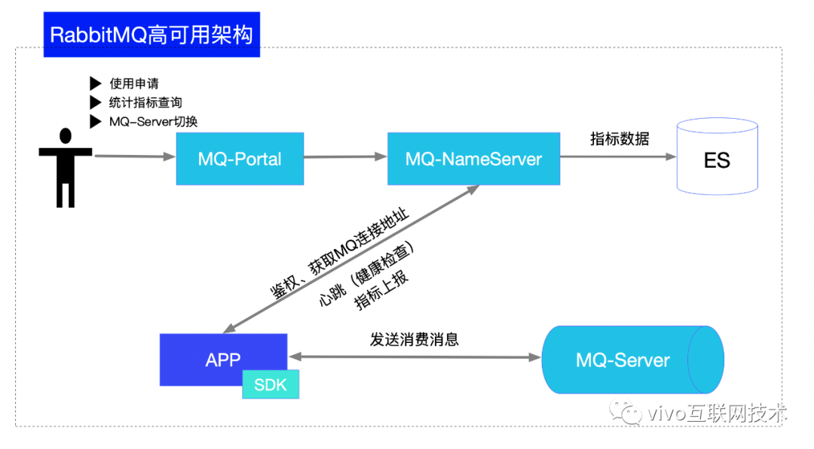

# [vivo 基于原生 RabbitMQ 的高可用架构实践](https://my.oschina.net/vivotech/blog/4688728)

# 一、背景说明

vivo 在 2016 年引入 RabbitMQ，基于开源 RabbitMQ 进行扩展，向业务提供消息中间件服务。

2016~2018年，所有业务均使用一个集群，随着业务规模的增长，集群负载越来越重，集群故障频发。

2019年，RabbitMQ 进入高可用建设阶段，完成了高可用组件 MQ 名字服务以及 RabbitMQ 集群的同城双活建设。

同时进行业务使用集群的物理拆分，严格按照集群负载情况和业务流量进行业务使用集群的分配以及动态调整。

在 2019 年高可用建设后至今，业务流量增加了十倍，集群未出现过严重故障。

RabbitMQ 是实现了 AMQP 协议的开源消息代理软件，起源于金融系统。

具有丰富的特性：

> 1. 消息可靠性保证，RabbitMQ 通过发送确认保证消息发送可靠、通过集群化、消息持久化、镜像队列的方式保证消息在集群的可靠、通过消费确认保证消息消费的可靠性。
> 2. RabbitMQ 提供了多种语言的客户端。
> 3. 提供了多种类型的 exchange，消息发送到集群后通过exchange路由到具体的queue中。
> 4. RabbitMQ 提供了完善的管理后台和管理 API，通过管理API可以快速与自建监控系统整合。

RabbitMQ 在具体实践中发现的问题：

> 1. 为保障业务高可用使用多套集群进行物理隔离，多套集群无统一平台进行管理。
> 2. 原生RabbitMQ客户端使用集群地址连接，使用多套集群时业务需要关心集群地址，使用混乱。
> 3. 原生RabbitMQ仅有简单的用户名/密码验证，不对使用的业务应用方进行鉴权，不同业务容易混用exchange/queue信息，造成业务应用使用异常。
> 4. 使用的业务应用方较多，无平台维护消息发送方、消费方的关联信息，多个版本迭代后无法确定对接方。
> 5. 客户端无限流，业务突发异常流量冲击甚至击垮集群。
> 6. 客户端无异常消息重发策略，需要使用方实现。
> 7. 集群出现内存溢出等造成集群阻塞时无法快速自动转移到其它可用集群。
> 8. 使用镜像队列，队列的master节点会落在具体某个节点上，在集群队列数较多时，容易出现节点负载不均衡的情况。
> 9. RabbitMQ无队列自动平衡能力，在队列较多时容易出现集群节点负载不均问题。


## 二、整体架构




## 1、MQ-Portal--支持应用使用申请

过往业务团队适用RabbitMQ时，应用申请的流量以及对接的应用等信息都在线下表格记录，较为零散，更新不及时，无法准确了解业务当前真实的使用情况，因此通过一个接入申请的流程可视化、平台化建立应用使用的元数据信息。


通过MQ-Portal的申请流程（如上图），确定了消息发送应用、消费应用、使用exchange/queue、发送流量等信息使用申请提交后将进入vivo内部工单流程进行审批。


工单流程审批通过后，通过工单的接口回调，分配应用具体使用的集群，并在集群上创建exchange/queue已经绑定关系。

由于采用多集群物理隔离的方式保证业务在正式环境的高可用，无法简单通过一个exchange/queue的名称定位到使用的集群。

每一个exchange/queue与集群之间通过唯一的一对rmq.topic.key与rmq.secret.key进行关联，这样SDK启动过程中即可定位到具体使用的集群。

rmq.topic.key与rmq.secret.key将在工单的回调接口中进行分配。


## 2、客户端SDK能力概述

客户端SDK基于spring-message和spring-rabbit进行封装，并在此基础上提供了应用使用鉴权、集群寻址、客户端限流、生产消费重置、阻塞转移等能力。


### 2.1、应用使用鉴权

开源RabbitMQ仅通过用户名密码的方式判断是否允许连接集群，但是应用是否允许使用exchange/queue是未进行校验的。

为了避免不同业务混用exchange/queue，需要对应用进行使用鉴权。

应用鉴权由SDK和MQ-NameServer协同完成。

应用启动时首先会上报应用配置的rmq.topic.key信息到MQ-NameServer，由MQ-NameServer判断使用应用与申请应用是否一致，并且在SDK发送消息过程中还会进行二次校验。

```java
/**
  * 发送前校验，并且获取真正的发送factory，这样业务可以声明多个，
  * 但是用其中一个bean就可以发送所有的消息，并且不会导致任何异常
  * @param exchange 校验参数
  * @return 发送工厂
*/
public AbstractMessageProducerFactory beforeSend(String exchange) {
    if(closed || stopped){
        //上下文已经关闭抛出异常，阻止继续发送，减少发送临界状态数据
        throw new RmqRuntimeException(String.format("producer sending message to exchange %s has closed, can't send message", this.getExchange()));
    }
    if (exchange.equals(this.exchange)){
        return this;
    }
    if (!VIVO_RMQ_AUTH.isAuth(exchange)){
        throw new VivoRmqUnAuthException(String.format("发送topic校验异常，请勿向无权限exchange %s 发送数据，发送失败", exchange));
    }
    //获取真正的发送的bean，避免发送错误
    return PRODUCERS.get(exchange);
}
```


### 2.2、集群寻址

前文说过，应用使用RabbitMQ严格按照集群的负载情况和业务流量进行集群的分配，因此具体某个应用使用的的不同的exchange/queue可能是分配在不同的集群上的。

为了提升业务的开发效率， 需要屏蔽多集群对业务的影响，因此按照应用配置的rmq.topic.key信息进行集群的自动寻址。


### 2.3、客户端限流

原生SDK客户端不进行发送流量限流，在部分应用存在异常持续向MQ发送消息时，可能会冲垮MQ集群。并且一个集群为多应用共同使用，单一应用造成集群影响将会影响使用异常集群的所有应用。

因此需要在SDK中提供客户端限流的能力，必要时可以限制应用向集群发送消息，保障集群的稳定。


### 2.4、生产消费重置

（1）随着业务规模增长，集群负载持续增加，此时需要进行集群的业务拆分。为了减少在拆分过程中避免业务重启，需要有生产消费重置功能。

（2）集群出现异常，可能会造成消费者掉线，此时通过生产消费重置可以快速拉起业务消费。

为了实现生产消费重置，需要实现一下流程：

> - 重置连接工厂连接参数
> - 重置连接
> - 建立新的连接
> - 重新启动生产消费

```java
CachingConnectionFactory connectionFactory = new CachingConnectionFactory();
connectionFactory.setAddresses(address);
connectionFactory.resetConnection();
rabbitAdmin = new RabbitAdmin(connectionFactory);
rabbitTemplate = new RabbitTemplate(connectionFactory);
```

同时MQ-SDK中有异常消息重发策略，可以避免在生产重置过程中导致的消息发送异常。


### 2.5、阻塞转移

RabbitMQ在内存使用超过40%，或是磁盘使用超限制时会阻塞消息发送。

由于vivo中间件团队已经完成了RabbitMQ同城双活的建设，因此在出现一个集群发送阻塞时可以通过生产消费重置到双活集群完成阻塞的快速转移。


### 2.6、多集群调度

随着应用的发展，单集群将无法满足应用的流量需求，并且集群队列均为镜像队列，无法简单的通过增加集群节点的方式实现业务支撑流量单集群的水平扩容。

因此需要SDK支持多集群调度能力，通过将流量分散到多个集群上满足业务大流量需求。


### 3、MQ-NameServer--支持MQ-SDK实现故障快速切换

MQ-NameServer为无状态服务，通过集群部署即可保障自身高可用，主要用于解决以下问题：

> - MQ-SDK启动鉴权以及应用使用集群定位。
> - 处理MQ-SDK的定时指标上报（消息发送数量、消息消费数量），并且返回当前可用集群地址，确保SDK在集群异常时按照正确地址进行重连。
> - 控制MQ-SDK进行生产消费重置。


### 4、MQ-Server高可用部署实践


RabbitMQ 集群均采用同城双活部署架构，依靠MQ-SDK和MQ-NameServer提供的集群寻址、故障快速切换等能力保障集群的可用性。


### 4.1、集群脑裂问题处理

RabbitMQ官方提供了三种集群脑裂恢复策略。

**（1）ignore**

> 忽略脑裂问题不处理，在出现脑裂时需要进行人为干预才可恢复。由于需要人为干预，可能会造成部分消息丢失，在网络非常可靠的情况可以使用。

**（2）pause_minority**

> 节点在与超过半数集群节点失联时将会自动暂停，直到检测到与集群超半数节点的通信恢复。极端情况下集群内所有节点均暂停，造成集群不可用。

**（3）autoheal**

> 少数派节点将自动重启，此策略主要用于优先保证服务的可用性，而不是数据的可靠性，因为重启节点上的消息会丢失。

由于RabbitMQ集群均为同城双活部署，即使单集群异常业务流量也可自动迁移到双活机房集群，因此选择使用了pause_minority策略避免脑裂问题。

2018年多次因网络抖动造成集群脑裂，在修改集群脑裂恢复策略后，已未再出现脑裂问题。


### 4.2、集群高可用方案

RabbitMQ采用集群化部署，并且因为集群脑裂恢复策略采用pause_minority模式，每个集群要求至少3个节点。

推荐使用5或7节点部署高可用集群，并且控制集群队列数量。

集群队列均为镜像队列，确保消息存在备份，避免节点异常导致消息丢失。

exchange、queue、消息均设置为持久化，避免节点异常重启消息丢失。

队列均设置为lazy queues，减少节点内存使用的波动。


### 4.3、同城双活建设

双机房部署等价集群，并且通过Federation插件将双集群组成联盟集群。

本机房应用机器优先连接本机房MQ集群，避免因专线抖动造成应用使用异常。

通过MQ-NameServer心跳获取最新的可用集群信息，异常时重连到双活集群中，实现应用功能的快速恢复。


# 三、未来挑战与展望

目前对RabbitMQ的使用增强主要在MQ-SDK和MQ-NameServer侧，SDK实现较为复杂，后期希望可以构建消息中间件的代理层，可以简化SDK并且对业务流量做更加细致化的管理。

> 作者：derek