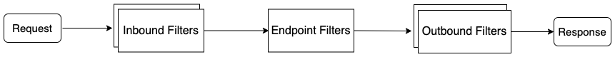
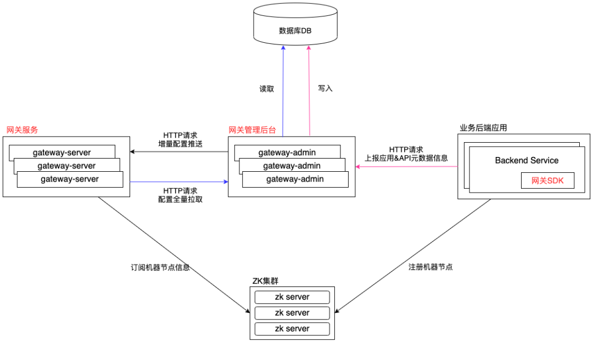

# [vivo 微服务 API 网关架构实践](https://my.oschina.net/vivotech/blog/4817583)

# 一、背景介绍

网关作为微服务生态中的重要一环，由于历史原因，中间件团队没有统一的微服务API网关，为此准备技术预研打造一个功能齐全、可用性高的业务网关。


# 二、技术选型

常见的开源网关按照语言分类有如下几类：

- **Nginx+Lua：**OpenResty、Kong 等；
- **Java：**Zuul1/Zuul2、Spring Cloud Gateway、gravitee-gateway、Dromara Soul 等；
- **Go：**janus、GoKu API Gateway 等；
- **Node.js：**Express Gateway、MicroGateway 等。

由于团队内成员基本上为Java技术栈，因此并不打算深入研究非Java语言的网关。接下来我们主要调研了Zuul1、Zuul2、Spring Cloud Gateway、Dromara Soul。

业界主流的网关基本上可以分为下面三种：

- Servlet + 线程池
- NIO(Tomcat / Jetty) + Servlet 3.0 异步
- NettyServer + NettyClient

在进行技术选型的时候，主要考虑功能丰富度、性能、稳定性。在反复对比之后，决定选择基于Netty框架进行网关开发；但是考虑到时间的紧迫性，最终选择为针对 Zuul2 进行定制化开发，在 Zuul2 的代码骨架之上去完善网关的整个体系。


# 三、Zuul2 介绍

接下来我们简要介绍一下 Zuul2 关键知识点。

Zuul2 的架构图：


为了解释上面这张图，接下来会分别介绍几个点

- 如何解析 HTTP 协议
- Zuul2 的数据流转
- 两个责任链：Netty ChannelPipeline责任链 + Filter责任链


## 3.1 如何解析 HTTP 协议

学习Zuul2需要一定的铺垫知识，比如：Google Guice、RxJava、Netflix archaius等，但是更关键的应该是：如何解析HTTP协议，会影响到后续Filter责任链的原理解析，为此先分析这个关键点。

首先我们介绍[官方文档](https://www.oschina.net/action/GoToLink?url=https%3A%2F%2Fgithub.com%2FNetflix%2Fzuul%2Fwiki%2FFilters)中的一段话：

> *By default Zuul doesn't buffer body content, meaning it streams the received headers to the origin before the body has been received.*
>
> *This streaming behavior is very efficient and desirable, as long as your filter logic depends on header data.*

翻译成中文：

> 默认情况下Zuul2并不会缓存请求体，也就意味着它可能会先发送接收到的请求Headers到后端服务，之后接收到请求体再继续发送到后端服务，发送请求体的时候，也不是组装为一个完整数据之后才发，而是接收到一部分，就转发一部分。
>
> 这个流式行为是高效的，只要Filter过滤的时候只依赖Headers的数据进行逻辑处理，而不需要解析RequestBody。

上面这段话映射到Netty Handler中，则意味着Zuul2并没有使用HttpObjectAggregator。

我们先看一下常规的Netty Server处理HTTP协议的样例：

NettyServer样例

```
@Slf4j
public class ConfigServerBootstrap {
 
    public static final int WORKER_THREAD_COUNT = Runtime.getRuntime().availableProcessors();
 
    public void start(){
        int port = 8080;
        EventLoopGroup bossGroup = new NioEventLoopGroup(1);
        EventLoopGroup workerGroup = new NioEventLoopGroup(WORKER_THREAD_COUNT);
 
        final BizServerHandler bizServerHandler = new BizServerHandler();
 
        try {
            ServerBootstrap serverBootstrap = new ServerBootstrap();
 
            serverBootstrap.group(bossGroup, workerGroup)
                    .channel(NioServerSocketChannel.class)
                    .childHandler(new ChannelInitializer<Channel>() {
                        @Override
                        protected void initChannel(Channel ch) throws Exception {
                            ChannelPipeline pipeline = ch.pipeline();
                            pipeline.addLast(new IdleStateHandler(10, 10, 0));
                            pipeline.addLast(new HttpServerCodec());
                            pipeline.addLast(new HttpObjectAggregator(500 * 1024 * 1024));
                            pipeline.addLast(bizServerHandler);
                        }
                    });
            log.info("start netty server, port:{}", port);
            serverBootstrap.bind(port).sync();
        } catch (InterruptedException e) {
            bossGroup.shutdownGracefully();
            workerGroup.shutdownGracefully();
            log.error(String.format("start netty server error, port:%s", port), e);
        }
    }
}
```

这个例子中的两个关键类为：HttpServerCodec、HttpObjectAggregator。

HttpServerCodec是HttpRequestDecoder、HttpResponseEncoder的组合器。

- **HttpRequestDecoder职责：**将输入的ByteBuf解析成HttpRequest、HttpContent对象。
- **HttpResponseEncoder职责：**将HttpResponse、HttpContent对象转换为ByteBuf，进行网络二进制流的输出。

HttpObjectAggregator的作用：组装HttpMessage、HttpContent为一个完整的FullHttpRequest或者FullHttpResponse。

当你不想关心chunked分块传输的时候，使用HttpObjectAggregator是非常有用的。

HTTP协议通常使用Content-Length来标识body的长度，在服务器端，需要先申请对应长度的buffer，然后再赋值。如果需要一边生产数据一边发送数据，就需要使用"Transfer-Encoding: chunked" 来代替Content-Length，也就是对数据进行分块传输。

接下来我们看一下Zuul2为了解析HTTP协议做了哪些处理。

Zuul的源码：[https://github.com/Netflix/zuul](https://www.oschina.net/action/GoToLink?url=https%3A%2F%2Fgithub.com%2FNetflix%2Fzuul)，基于v2.1.5。

```
// com.netflix.zuul.netty.server.BaseZuulChannelInitializer#addHttp1Handlers
protected void addHttp1Handlers(ChannelPipeline pipeline) {
    pipeline.addLast(HTTP_CODEC_HANDLER_NAME, createHttpServerCodec());
 
    pipeline.addLast(new Http1ConnectionCloseHandler(connCloseDelay));
    pipeline.addLast("conn_expiry_handler",
            new Http1ConnectionExpiryHandler(maxRequestsPerConnection, maxRequestsPerConnectionInBrownout, connectionExpiry));
}
// com.netflix.zuul.netty.server.BaseZuulChannelInitializer#createHttpServerCodec
protected HttpServerCodec createHttpServerCodec() {
    return new HttpServerCodec(
            MAX_INITIAL_LINE_LENGTH.get(),
            MAX_HEADER_SIZE.get(),
            MAX_CHUNK_SIZE.get(),
            false
    );
}
```

通过对比上面的样例发现，Zuul2并没有添加HttpObjectAggregator，也就是需要自行去处理chunked分块传输问题、自行组装请求体数据。

为了解决上面说的chunked分块传输问题，Zuul2通过判断是否LastHttpContent，来判断是否接收完成。


## 3.2 Zuul2 数据流转

 

如上图所示，Netty自带的HttpServerCodec会将网络二进制流转换为Netty的HttpRequest对象，再通过ClientRequestReceiver编解码器将HttpRequest转换为Zuul的请求对象HttpRequestMessageImpl；

请求体RequestBody在Netty自带的HttpServerCodec中被映射为HttpContent对象，ClientRequestReceiver编解码器依次接收HttpContent对象。

完成了上述数据的转换之后，就流转到了最重要的编解码ZuulFilterChainHandler，里面会执行Filter链，也会发起网络请求到真正的后端服务，这一切都是在ZuulFilterChainHandler中完成的。

得到了后端服务的响应结果之后，也经过了Outbound Filter的过滤，接下来就是通过ClientResponseWriter把Zuul自定义的响应对象HttpResponseMessageImpl转换为Netty的HttpResponse对象，然后通过HttpServerCodec转换为ByteBuf对象，发送网络二进制流，完成响应结果的输出。

这里需要特别说明的是：由于Zuul2默认不组装一个完整的请求对象/响应对象，所以Zuul2是分别针对请求头+请求Headers、请求体进行Filter过滤拦截的，也就是说对于请求，会走两遍前置Filter链，对于响应结果，也是会走两遍后置Filter链拦截。


## 3.3 两个责任链


### **3.3.1 Netty ChannelPipeline责任链**

Netty的ChannelPipeline设计，通过往ChannelPipeline中动态增减Handler进行定制扩展。

接下来看一下Zuul2 Netty Server中的pipeline有哪些Handler？

 

接着继续看一下Zuul2 Netty Client的Handler有哪些？

 

本文不针对具体的Handler进行详细解释，主要是给大家一个整体的视图。


### **3.3.2 Filter责任链**

 

请求发送到Netty Server中，先进行Inbound Filters的拦截处理，接着会调用Endpoint Filter，这里默认为ProxyEndPoint（里面封装了Netty Client），发送请求到真实后端服务，获取到响应结果之后，再执行Outbound Filters，最终返回响应结果。

三种类型的Filter之间是通过nextStage属性来衔接的。

Zuul2存在一个定时任务线程GroovyFilterFileManagerPoller，定期扫描特定的目录，通过比对文件的更新时间戳，来判断是否发生变化，如果有变化，则重新编译并放入到内存中。

通过定位任务实现了Filter的动态加载。


# 四、功能介绍

上面介绍了Zuul2的部分知识点，接下来介绍网关的整体功能。

 


## 4.1 服务注册发现

网关承担了请求转发的功能，需要一定的方法用于动态发现后端服务的机器列表。

这里提供两种方式进行服务的注册发现：

**集成网关SDK**

- 网关SDK会在服务启动之后，监听ContextRefreshedEvent事件，主动操作zk登记信息到zookeeper注册中心，这样网关服务、网关管理后台就可以订阅节点信息。
- 网关SDK添加了ShutdownHook，在服务下线的时候，会删除登记在zk的节点信息，用于通知网关服务、网关管理后台，节点已下线。

**手工配置服务的机器节点信息**

- 在网关管理后台，手工添加、删除机器节点。
- 在网关管理后台，手工设置节点上线、节点下线操。

为了防止zookeeper故障，网关管理后台已提供HTTP接口用于注册、取消注册作为兜底措施。


## 4.2 动态路由

动态路由分为：机房就近路由、灰度路由(类似于Dubbo的标签路由功能)。

- **机房就近路由：**请求最好是不要跨机房，比如请求打到网关服务的X机房，那么也应该是将请求转发给X机房的后端服务节点，如果后端服务不存在X机房的节点，则请求到其他机房的节点。
- **灰度路由：**类似于Dubbo的标签路由功能，如果希望对后端服务节点进行分组隔离，则需要给后端服务一个标签名，建立"标签名→节点列表"的映射关系，请求方携带这个标签名，请求到相应的后端服务节点。

网关管理后台支持动态配置路由信息，动态开启/关闭路由功能。


## 4.3 负载均衡

当前支持的负载均衡策略：加权随机算法、加权轮询算法、一致性哈希算法。

可以通过网关管理后台动态调整负载均衡策略，支持API接口级别、应用级别的配置。

负载均衡机制并未采用Netflix Ribbon，而是仿造Dubbo负载均衡的算法实现的。


## 4.4 动态配置

API网关支持一套自洽的动态配置功能，在不依赖第三方配置中心的条件下，仍然支持实时调整配置项，并且配置项分为全局配置、应用级别治理配置、API接口级别治理配置。

在自洽的动态配置功能之外，网关服务也与公司级别的配置中心进行打通，支持公司级配置中心配置相应的配置项。


## 4.5 API管理

API管理支持网关SDK自动扫描上报，也支持在管理后台手工配置。


## 4.6 协议转换

后端的服务有很多是基于Dubbo框架的，网关服务支持HTTP→HTTP的请求转发，也支持HTTP→Dubbo的协议转换。

同时C++技术栈，采用了tars框架，网关服务也支持HTTP → tras协议转换。


## 4.7 安全机制

API网关提供了IP黑白名单、OAuth认证授权、appKey&appSecret验签、矛盾加解密、vivo登录态校验的功能。


## 4.8 监控/告警

API网关通过对接通用监控上报请求访问信息，对API接口的QPS、请求响应吗、请求响应时间等进行监控与告警；

通过对接基础监控，对网关服务自身节点进行CPU、IO、内存、网络连接等数据进行监控。


## 4.9 限流/熔断

API网关与限流熔断系统进行打通，可以在限流熔断系统进行API接口级别的配置，比如熔断配置、限流配置，而无需业务系统再次对接限流熔断组件。

限流熔断系统提供了对Netflix Hystrix、Alibaba Sentinel组件的封装。


## 4.10 无损发布

业务系统的无损发布，这里分为两种场景介绍：

- **集成了网关SDK：**网关SDK添加了ShutdownHook，会主动从zookeeper删除登记的节点信息，从而避免请求打到即将下线的节点。
- **未集成网关SDK：**如果什么都不做，则只能依赖网关服务的心跳检测功能，会有15s的流量损失。庆幸的是管理后台提供了流量摘除、流量恢复的操作按钮，支持动态的上线、下线机器节点。

网关集群的无损发布：我们考虑了后端服务的无损发布，但是也需要考虑网关节点自身的无损发布，这里我们不再重复造轮子，直接使用的是CICD系统的HTTP无损发布功能（Nginx动态摘除/上线节点）。


## 4.11 网关集群分组隔离

网关集群的分组隔离指的是业务与业务之间的请求应该是隔离的，不应该被部分业务请求打垮了网关服务，从而导致了别的业务请求无法处理。

这里我们会对接入网关的业务进行分组归类，不同的业务使用不同的分组，不同的网关分组，会部署独立的网关集群，从而隔离了风险，不用再担心业务之间的互相影响。


# 五、系统架构


## 5.1 模块交互图

 


## 5.2 网关管理后台

模块划分

 


## 5.3 通信机制

由于需要动态的下发配置，比如全局开关、应用级别的治理配置、接口级别的治理配置，就需要网关管理后台可以与网关服务进行通信，比如推拉模式。

两种设计方案

- 基于注册中心的订阅通知机制
- 基于HTTP的推模式 + 定时拉取

这里并未采用第一种方案，主要是因为以下缺点：

- 严重依赖zk集群的稳定性
- 信息不私密(zk集群权限管控能力较弱、担心被误删)
- 无法灰度下发配置，比如只对其中的一台网关服务节点配置生效


### **5.3.1 基于HTTP的推模式**

 

因为Zuul2本身就自带了Netty Server，同理也可以再多启动一个Netty Server提供HTTP服务，让管理后台发送HTTP请求到网关服务，进而发送配置数据到网关服务了。

所以图上的蓝色标记Netty Server用于接收客户端请求转发到后端节点，紫色标记Netty Server用于提供HTTP服务，接收配置数据。


### **5.3.2 全量配置拉取**

网关服务在启动之初，需要发送HTTP请求到管理后台拉取全部的配置数据，并且也需要拉取归属当前节点的灰度配置(只对这个节点生效的试验性配置)。


### **5.3.3 增量配置定时拉取**

上面提到了"基于HTTP的推模式"进行配置的动态推送，也介绍了全局配置拉取，为了保险起见，网关服务还是新增了一个定时任务，用于定时拉取增量配置。

可以理解为兜底操作，就好比配置中心支持长轮询获取数据实时变更+定时任务获取全部数据。

在拉取到增量配置之后，会比对内存中的配置数据是否一致，如果一致，则不操作直接丢弃。


### **5.3.4 灰度配置下发**

上面也提到了"灰度配置"这个词，这里详细解释一下什么是灰度配置？

比如当编辑了某个接口的限流信息，希望在某个网关节点运行一段时间，如果没有问题，则调整配置让全部的网关服务节点生效，如果有问题，则也只是其中一个网关节点的请求流量出问题。

这样可以降低出错的概率，当某个比较大的改动或者版本上线的时候，可以控制灰度部署一台机器，同时配置也只灰度到这台机器，这样风险就降低了很多。

灰度配置：可以理解为只在某些网关节点生效的配置。

灰度配置下发其实也是通过"5.3.1基于HTTP的推模式"来进行下发的。


## 5.4 网关SDK

网关SDK旨在完成后端服务节点的注册与下线、API接口列表数据上报，通过接入网关SDK即可减少手工操作。网关SDK通过 ZooKeeper client操作节点的注册与下线，通过发起HTTP请求进行API接口数据的上报。

支持SpringMVC、SpringBoot的web接口自动扫描、Dubbo新老版本的Service接口扫描。

Dubbo 接口上报：

- **旧版Dubbo：**自定义BeanPostProcessor，用于提取到ServiceBean，放入线程池异步上报到网关后台。
- **新版Dubbo：**自定义ApplicationListener，用于监听ServiceBeanExportedEvent事件，提取event信息，上报到网关后台。

HTTP 接口上报：

- 自定义BeanPostProcessor，用于提取到Controller、RestController的RequestMapping注解，放入线程池异步上报API信息。


# 六、改造之路


## 6.1 动态配置

关联知识点：

- [https://github.com/apache/commons-configuration](https://www.oschina.net/action/GoToLink?url=https%3A%2F%2Fgithub.com%2Fapache%2Fcommons-configuration)
- [https://github.com/Netflix/archaius](https://www.oschina.net/action/GoToLink?url=https%3A%2F%2Fgithub.com%2FNetflix%2Farchaius)

Zuul2依赖的动态配置为archaius，通过扩展ConcurrentMapConfiguration添加到ConcurrentCompositeConfiguration中。

新增GatewayConfigConfiguration，用于存储全局配置、治理配置、节点信息、API数据等。

```
@Singleton
public class GatewayConfigConfiguration extends ConcurrentMapConfiguration {
 
    public GatewayConfigConfiguration() {
        /**
         * 设置这个值为true，才可以避免archaius强行去除value的类型，导致获取报错
         * see com.netflix.config.ConcurrentMapConfiguration#setPropertyImpl(java.lang.String, java.lang.Object)
         */
        this.setDelimiterParsingDisabled(Boolean.TRUE);
    }
 
}
```

通过Google Guice控制Bean的加载顺序，在较早的时机，执行ConfigurationManager.getConfigInstance()，获取到ConcurrentCompositeConfiguration，完成GatewayConfigConfiguration的初始化，然后再插入到第一个位置。

后续只需要对GatewayConfigConfiguration进行配置的增删查改操作即可。


## 6.2 路由机制

 

路由机制也是仿造的Dubbo路由机制，灰度路由是仿造的Dubbo的标签路由，就近路由可以理解为同机房路由。

请求处理过程：

客户端请求过来的时候，网关服务会通过path前缀提取到对应的后端服务名或者在请求Header中指定传递对应的serviceName，然后只在匹配到的后端服务中，继续API匹配操作，如果匹配到API，则筛选出对应的后端机器列表，然后进行路由、负载均衡，最终选中一台机器，将请求转发过去。

这里会有个疑问，如果不希望只在某个后端服务中进行请求路由匹配，是希望在一堆后端服务中进行匹配，需要怎么操作？

在后面的第七章节会解答这个疑问，请耐心阅读。


### **6.2.1 就近路由**

当请求到网关服务，会提取网关服务自身的机房loc属性值，读取全局、应用级别的开关，如果就近路由开关打开，则筛选服务列表的时候，会过滤相同loc的后端机器，负载均衡的时候，在相同loc的机器列表中挑选一台进行请求。

如果没有相同loc的后端机器，则降级从其他loc的后端机器中进行挑选。

  

其中 **loc信息就是机房信息**，每个后端服务节点在SDK上报或者手工录入的时候，都会携带这个值。


### **6.2.2 灰度路由**

灰度路由需要用户传递Header属性值，比如gray=canary_gray。

网关管理后台配置灰度路由的时候，会建立grayName -> List<Server>映射关系，当网关管理后台增量推送到网关服务之后，网关服务就可以通过grayName来提取配置下的后端机器列表，然后再进行负载均衡挑选机器。

如下图所示：

 

 


## 6.3 API映射匹配

网关在进行请求转发的时候，需要明确知道请求哪一个服务的哪一个API，这个过程就是API匹配。

因为不同的后端服务可能会拥有相同路径的API，所以网关要求请求传递serviceName，serviceName可以放置于请求Header或者请求参数中。

携带了serviceName之后，就可以在后端服务的API中去匹配了，有一些是相等匹配，有些是正则匹配，因为RESTFul协议，需要支持 /* 通配符匹配。

这里会有人疑问了，难道请求一定需要显式传递serviceName吗？

为了解决这个问题，创建了一个gateway_origin_mapping表，用于path前缀或者域名前缀 映射到 serviceName，通过在管理后台建立这个映射关系，然后推送到网关服务，即可解决显式传递serviceName的问题，会自动提取请求的path前缀、域名前缀，找到对应的serviceName。

如果不希望是在一个后端服务中进行API匹配，则需阅读后面的第七章节。


## 6.4 负载均衡

替换 ribbon 组件，改为仿造 Dubbo 的负载均衡机制。

```
public interface ILoadBalance {
 
    /**
     * 从服务列表中筛选一台机器进行调用
     * @param serverList
     * @param originName
     * @param requestMessage
     * @return
     */
    DynamicServer select(List<DynamicServer> serverList, String originName, HttpRequestMessage requestMessage);
 
}
```

替换的理由：ribbon的服务列表更新只是定期更新，如果不考虑复杂的筛选过滤，是满足要求的，但是如果想要灵活的根据请求头、请求参数进行筛选，ribbon则不太适合。


## 6.5 心跳检测

核心思路：当网络请求正常返回的时候，心跳检测是不需要，此时后端服务节点肯定是正常的，只需要定期检测未被请求的后端节点，超过一定的错误阈值，则标记为不可用，从机器列表中剔除。

第一期先实现简单版本：通过定时任务定期去异步调用心跳检测Url，如果超过失败阈值，则从从负载均衡列表中剔除。

异步请求采用httpasyncclient组件处理。

```
<dependency>
    <groupId>org.apache.httpcomponents</groupId>
    <artifactId>httpasyncclient</artifactId>
    <version>4.1.4</version>
</dependency>
```

方案为：HealthCheckScheduledExecutor + HealthCheckTask + HttpAsyncClient。


## 6.6 日志异步化改造

Zuul2默认采用的log4j进行日志打印，是同步阻塞操作，需要修改为异步化操作，改为使用logback的AsyncAppender。

日志打印也是影响性能的一个关键点，需要特别注意，后续会衡量是否切换为log4j2。


## 6.7 协议转换

**HTTP -> HTTP**

Zuul2采用的是ProxyEndpoint用于支持HTTP -> HTTP协议转发。

通过Netty Client的方式发起网络请求到真实的后端服务。

**HTTP -> Dubbo**

采用Dubbo的泛化调用实现HTTP -> Dubbo协议转发，可以采用$invokeAsync。

**HTTP → Tars**

基于tars-java采用类似于Dubbo的泛化调用的方式实现协议转发，基于[https://github.com/TarsCloud/TarsGateway](https://www.oschina.net/action/GoToLink?url=https%3A%2F%2Fgithub.com%2FTarsCloud%2FTarsGateway) 改造而来的。


## 6.8 无损发布

网关作为请求转发，当然希望在业务后端机器部署的期间，不应该把请求转发到还未部署完成的节点。

业务后端机器节点的无损发布，这里分为两种场景介绍：

- **集成了网关SDK** 网关SDK添加了ShutdownHook，会主动从zookeeper删除登记的节点信息，从而避免请求打到即将下线的节点。
- **未集成网关SDK** 如果什么都不做，则只能依赖网关服务的心跳检测功能，会有15s的流量损失。庆幸的是管理后台提供了流量摘除、流量恢复的操作按钮，支持动态的上线、下线机器节点。

**设计方案**

我们给后端机器节点dynamic_forward_server表新增了一个字段online，如果online=1，则代表在线，接收流量，反之，则代表下线，不接收流量。

网关服务gateway-server新增一个路由：OnlineRouter，从后端机器列表中筛选online=1的机器，过滤掉不在线的机器，则完成了无损发布的功能。

```
public interface IRouter {
 
    /**
     * 过滤
     * @param serverList
     * @param originName
     * @param requestMessage
     * @return
     */
    List<DynamicServer> route(List<DynamicServer> serverList, String originName, HttpRequestMessage requestMessage);
 
}
```


## 6.9 网关集群分组隔离

网关集群的分组隔离指的是业务与业务之间的请求应该是隔离的，不应该被部分业务请求打垮了网关服务，从而导致了别的业务请求无法处理。

这里我们会对接接入网关的业务进行分组归类，不同的业务使用不同的分组，不同的网关分组，会部署独立的网关集群，从而隔离了风险，不用再担心业务之间的互相影响。

**举例：**

金融业务在生产环境存在一个灰度点检环境，为了配合金融业务的迁移，这边也必须有一套独立的环境为之服务，那是否重新部署一套全新的系统呢(独立的前端+独立的管理后台+独立的网关集群)

其实不必这么操作，我们只需要部署一套独立的网关集群即可，因为网关管理后台，可以同时配置多个网关分组的数据。

创建一个新的网关分组finance-gray，而新的网关集群只需要拉取finance-gray分组的配置数据即可，不会对其他网关集群造成任何影响。

# 七、.如何快速迁移业务

在业务接入的时候，现有的网关出现了一个尴尬的问题，当某些业务方自行搭建了一套Spring Cloud Gateway网关，里面的服务没有清晰的path前缀、独立的域名拆分，虽然是微服务体系，但是大家共用一个域名，接口前缀也没有良好的划分，混用在一起。

这个时候如果再按照原有的请求处理流程，则需要业务方进行Nginx的大量修改，需要在location的地方都显式传递serviceName参数，但是业务方不愿意进行这一个调整。

针对这个问题，其实本质原因在于请求匹配逻辑的不一致性，现有的网关是先匹配服务应用，再进行API匹配，这样效率高一些，而Spring Cloud Gateway则是先API匹配，命中了才知道是哪个后端服务。

为了解决这个问题，网关再次建立了一个 "微服务集" → "微服务应用列表" 的映射关系，管理后台支持这个映射关系的推送。

一个网关分组下面会有很多应用服务，这里可以拆分为子集合，可以理解为微服务集就是里面的子集合。

客户端请求传递过来的时候，需要在请求Header传递 **scTag 参数**，scTag用来标记是哪个微服务集，然后提取到scTag对应的所有后端服务应用列表，依次去对应的应用服务列表中进行API匹配，如果命中了，则代表请求转发到当前应用的后端节点，而对原有的架构改造很小。

如果不想改动客户端请求，则需要在业务域名的Nginx上进行调整，传递scTag请求Header。