# 互联网舆情系统的架构实践

**编者按**

> 现代社会是一个信息驱动的社会，每天都有大量的信息产生。据统计，互联网上每天有数十亿条媒体文章产生，在线信息检索超过 500 亿次。伴随着互联网技术的发展和新媒体创新应用，人们越来越倾向于通过微博、微信、短视频等社交媒体，表达看法，传播诉求，分享信息、甚至建言献策，收集、处理、挖掘其中的价值，洞察观点、情绪、口碑、社情民意，不仅能够为企业提供商业情报，辅助商业决策，还能为政府机构挖掘社情舆论，提升社会治理水平。本文将主要围绕 SaaS 3.0 时代，互联网公开数据信息挖掘的特点和趋势，阐述舆情分析系统的架构和实践。

## 1. 舆情分析的业务特点

### 1.1 信源覆盖广

舆情分析的数据源几乎覆盖所有互联网公开信息，如常见的资讯网站和社交媒体：新华网、腾讯新闻、百度贴吧、论坛、新浪微博、微信、博客等，近几年兴起的自媒体平台和短视频等流媒体应用：小红书、抖音、快手等，人们有更多的渠道可以发声，新时代人人都是自媒体，同时，外媒也是众多跨国公司和政府机构关注的重点，境外主流新闻网站如华尔街日报、纽约时报等和社交媒体如 Facebook、Twitter，甚至 Tik Tok 等，这些舆论阵地都是舆情分析需要覆盖的渠道。

### 1.2 需求行业多

舆情分析的需求几乎涵盖所有行业，互联网时代，信息传播迅速，网络热点事件频发，企业最怕的就是出现各种不良舆论，危及企业运营，损害品牌形象，舆情监测服务被广泛应用于消费品、汽车、互联网金融、地产、教育、餐饮等行业，同时，在电子政务领域，舆情监测服务也为各级政府机构，提供第一时间的舆情资讯，舆情涉及我们生活的方方面面，舆情监测和管理，核心是对我们周围互联网公开信息的大数据分析和价值挖掘。

### 1.3 社会价值高

舆情分析服务能为目标客户提供多维度的信息挖掘和高附加值的洞察分析，具有巨大的企业和社会价值：

**负面信息挖掘**： 负面信息发现，是舆情监测的核心价值点，如果不能及时准确地发现负面信息，造成负面舆论发酵，可能对企业带来不可挽回的损失，对政府带来严重的公信力质疑。

**竞品信息监测**： 无论是企业市场人员，还是产品经理，竞品分析都是门必备的通用技能，通过对现有或潜在的竞争产品或者企业进行信息监测、情报挖掘，分析优劣势，往往能帮助企业掌握竞争的主动权。

**口碑信息挖掘**： 针对自身或竞品，进行有针对性的口碑监测，如一款产品的评论分析，可以帮助企业改进产品功能、辅助市场营销策略，提升客户或产品满意度。

**事件脉络分析**： 无论对于互联网热点事件还是产品传播营销，通过对事件细粒度的传播分析，洞察事件发酵脉络，挖掘传播爆点，掌握事件传播路径，为事件处置或营销效果分析提供决策依据。

**民生民意调查**： 通过对互联网事件的舆论监测，挖掘对于互联网事件的公众情绪、公众观点、意见领袖、传播路径，为政府舆情引导、舆情管控提供决策辅助。

### 1.4 技术挑战大

舆情监测系统，不仅需要具备强大的数据采集和处理能力，还需要具备强大的价值挖掘能力，构建强大的舆情监测系统，往往面临巨大的技术挑战。

**数据全面**： 针对海量的互联网信息，构建强大的数据采集系统，保证数据全面、不遗漏，是舆情监测能力保障的基础。

**检索精确**： 舆情系统能够代替人工精准检索目标数据，这对海量数据的全文检索提出很高的要求，不仅要找到匹配的信息，还要去除干扰，最大化匹配检索意图。

**预警及时**： 舆论环境瞬息万变，企业和政府都期望第一时间掌握舆情动态；舆情监测需要提供 7&24 小时、近实时信息预警，具备秒级采集、处理、研判和下发机制。

**精准研判**： 除数据采集全面、数据处理及时外，信息挖掘研判的准确性往往是衡量服务竞争力的重要指标，通过不断提升敏感信息研判和相似度判定的准确性，可以最大化降低系统误判率。

**标签丰富**： 除了基本的舆情大数据全流程处理，舆情系统还应该具备更深层次的信息挖掘能力，如标签提取、地域甄别、信息分类、事件发现等，最大化提升附加值挖掘能力，降低人工服务成本。

## 2. 舆情发展的新趋势

### 2.1 精细化运营，实现弯道超车

互联网舆情行业发展多年，玩家众多，传统的舆情分析，场景模式相对固定，竞争趋于白热化；而舆情分析的细粒度需求，如负面关注度、文本相关性等，越来越趋于差异化和定制化，在 SaaS 标品的模式下，如何针对不同的行业客户、不同的分析场景实现平台化、精细化的运营，变得越来越重要，打造业务闭环、构建能够实现差异化运营的平台化产品矩阵，才能实现弯道超车。

### 2.2 智能化分析，AI 深度应用

舆情分析是 NLP 文本分析的天然阵地，随着近几年 AI 发展进入快车道，各种技术框架和分析手段层出不穷，为舆情信息挖掘提供了丰富的工具，不仅局限于分词、实体识别、情感判定、关键词提取等底层文本分析技术，诸如主动事件发现、智能化预警研判、智能化信息检索等逐渐落地应用。同时随着 AIOps 的发展，模型算法的工程化落地加速，探索用 AI 代替传统舆情服务中的人工部分，以降低成本。

### 2.3 业务模式创新，拓展深度和广度

舆情业务模式创新，不仅要横向扩展行业，积累各领域知识，形成不同行业的差异化专业解决方案，还要纵向探索新的分析场景，如针对 KOL 的细粒度监测、针对短视频等流媒体的信息挖掘等，与时俱进，不能禁锢在传统的舆情思维之中。

## 3. 舆情信息的挖掘过程

### 3.1 基于实时数据流的数据挖掘

互联网舆情，本质上是对互联网公开信息的采集、分析、研判，并产生业务价值，是一个价值数据挖掘的过程，但基于其业务场景和系统要求，与传统的数据挖掘又有很大差别。

传统的数据挖掘任务，一般有如下几个过程：

> 信息收集 - 数据集成 - 数据加载 - 数据清理 - 数据变换 - 数据挖掘过程 - 模式评估 - 知识表示

ETL 阶段进行数据清洗和标准化，挖掘过程综合运用各种信息挖掘算法，如规则推理、机器学习模型、迁移学习算法等，根据模式评估结果，得到反馈，不断循环，达到最优。但在舆情场景下，数据要从互联网源源不断的输入，分析结果要准实时的输出呈现，价值挖掘过程穿插于信息流之中，同时，系统需要具备动态干预的能力，甚至需要设计单独的指标回算机制，保证信息挖掘的前后一致性，如下图所示：

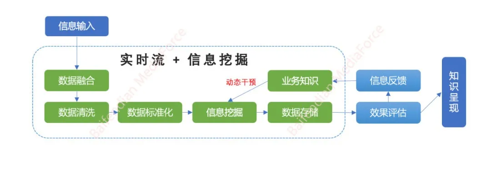

信息以流式输入到在线处理引擎，经过 ETL 处理标准化的数据，进入数据挖掘过程，如基于规则引擎计算文本指标、通过机器学习算法模型计算文本标签等，这些规则或模型蕴含业务知识，数据计算结果经过存储，呈现给业务人员，后续随着业务的评估和迭代，挖掘中的业务知识会被动态干预，形成知识流动迭代的闭环。

因此，传统的数据挖掘过程，往往是静态的一次性过程，而舆情分析的信息挖掘，是一个流动的不间断过程。

### 3.2 多工种协作的业务闭环

同时，舆情监测体系的运行，也是一个多方共同参与的过程，不同角色的人员共同协作，不断迭代产生更优的价值挖掘结果，准确及时地呈现给终端客户。

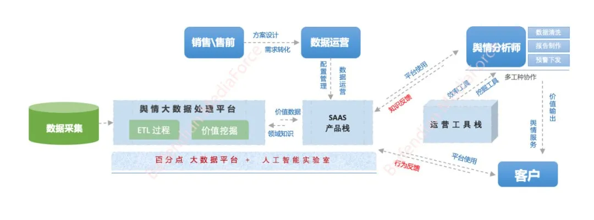

简单来看，舆情监测系统，主要由数据采集、SaaS 平台、运营工具栈构成。

销售、售前人员负责方案制作、需求转化，客户成单，需求确定后，由数据运营人员跟进，负责客户全生命周期的数据、关键词配置管理、数据监控，客户数据实时进入数据挖掘平台，供舆情分析师团队和客户直接使用，如数据筛选、数据预警、报告制作、信息挖掘分析等。

同时，我们还需要提供丰富的运营分析工具栈，如数据清洗、报告制作、预警干预、数据宏观分析、观点挖掘、事件发现等运营工具，帮助舆情分析师制作人工报告，提供高效率的人工服务。

需要指出的是，在整个舆情服务过程中，舆情监测系统需要能够实时收集业务知识，并反馈到信息挖掘平台，不断优化和提升 SaaS 平台的信息挖掘能力和水平。

**舆情分析师的业务经验**： 舆情分析师是人工服务的价值输出方，能够深刻理解客户的监测需求，沉淀下来的业务知识，将直接录入挖掘平台，动态干预定向客户的分析效果，如客户的定制化负面评价指标、客户的定制分析词库等。

**终端用户的行为反馈**： 系统应该能够自动收集用户的行为数据，以最大限度地降低用户的额外工作，提高系统迭代的效率，如数据的收藏行为、数据的屏蔽行为、数据的浏览行为等。

概括来讲，舆情分析系统是一个基于实时流动信息、多方协作参与的价值信息挖掘平台。

## 4. 舆情系统的架构实践

### 4.1 基础架构分析

舆情监测系统，可以看做是一个价值信息挖掘的平台体系，重点是两个能力的建设：

**资源构建能力**： 通过数据采集和信息挖掘，构建舆情系统的资源基础，形成标准一致的信息输出接口。

**业务应用能力**： 依托底层的舆情资源，构建贴合场景的业务应用，既服务于舆情 SaaS 客户，还服务于人工分析师，输出专业能力的同时，帮助提升组织效率。

简化版的舆情系统基础架构如下：

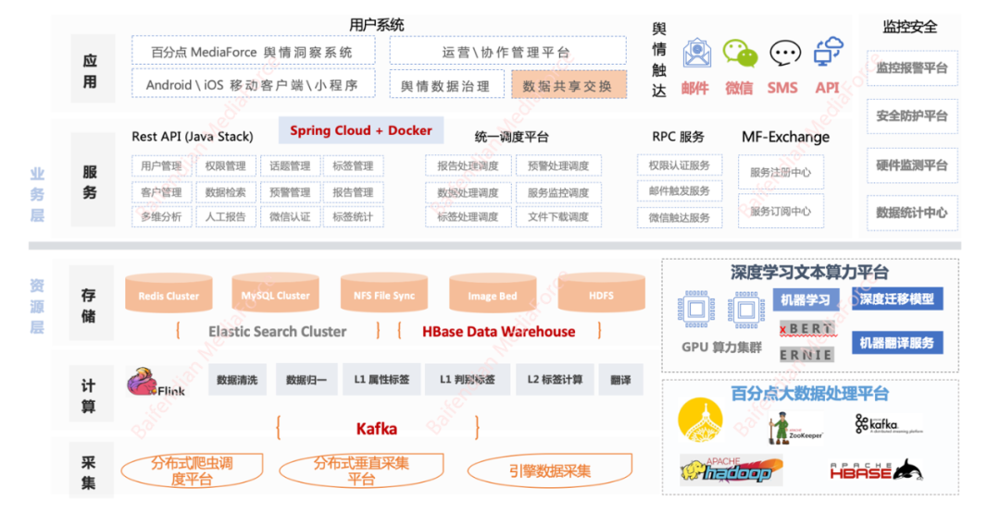

整个架构分为两个层次：

a. 资源层：整合数据采集、计算、存储，形成整体的舆情资产核心能力；

b. 业务层：基于舆情场景，构建各种上层应用。

**数据采集层**：

依托百分点大数据采集系统，我们构建了超过 1000+ 服务器节点的大规模数据采集集群，覆盖 90% 以上的全网公开价值信息；包括新闻、报刊、微博、微信、APP、论坛、贴吧、博客、视频、问答、外媒网站、Facebook、Twitter、短视频等近 14 个信源数据，本文我们不展开讲述采集系统的构建。

**数据计算层**：

数据计算层承担着舆情数据处理的核心部分，除了采集数据的 ETL 过程，我们还构建了高效、智能的核心指标计算体系，通过高效的流式处理引擎，支撑文本、规则指标的计算，挖掘价值信息。

**数据存储层**：

我们综合构建了适用于实时业务检索和离线数据拉取计算的存储架构，核心基于 ElasticSearch（ES） 和 Hbase 存储实时舆情数据，基于 HBase + Hive(HDFS) 构建离线数据仓库，为上层业务分析、数据应用构建提供高效、统一的信息检索服务。

**需要指出的是，基于舆情数据应用场景，我们不仅构建了超过 100 个数据节点的 lambda 架构的大数据生态处理平台，支撑每天亿级数据的实时和离线处理，还依托百分点人工智能实验室，结合舆情数据应用闭环，构建了以 GPU 为硬件基础的深度学习文本算力平台，应用先进的迁移学习技术，服务于模型化的指标挖掘。**

**业务服务层**：

在业务层，我们将舆情的业务模块化，形成众多独立部署的微服务，将用户管理、话题管理、标签管理、数据检索、多维分析、标签分析等核心业务暴露为统一的 REST 接口，构建了多个调度中心，负责处理舆情报告、预警、数据处理、服务监控等服务。

技术栈主要以 SpringCloud 框架和容器云 Docker 虚拟化为主，底层基于 Kubernetes 做资源管理和服务编排，构建了超过 200 个镜像节点的线上微服务集群，支撑每天近万用户的复杂检索和 API 调用。

**业务应用层**：

我们构建了面向客户的舆情 SaaS 平台，为终端客户提供智能化的舆情监测、舆情分析、舆情报告、舆情预警、专题管理等便捷体验，支持 PC、移动端、微信小程序等；同时，我们还构建了面向舆情运营分析师的多工种协作平台，将舆情服务的全流程拆解、工具化，提供了支持众包的客户运营、数据清洗、报告制作、预警下发、价值挖掘等独立的工具平台，支持近百人的同时在线协作。

**作为舆情系统的底层支撑，下面我们将简单分享我们在平台资源层的架构实践，即：高效的数据流处理架构、稳定的数据存储平台、完善的指标挖掘体系。**

### 4.2 数据流处理方案

基于舆情业务特点，数据处理需要满足以下要求：

a. 数据处理高效：数据采集到数据持久化存储，中间的数据处理时间不能超过 30s，最大限度保证舆情消息的及时性；

b. 数据处理稳定：舆情数据有明显的峰谷周期，夜间数据较少，白天出现多个信息波峰，同时互联网舆情事件具有突发性，数据处理平台需要具备削峰填谷的能力；

c. 开发运维方便：开发友好，运维简单。

百分点舆情实时流处理架构，伴随技术演进，经历了多个阶段。2015 年，我们引入了 Storm 作为实时流处理引擎，当时已经能够支撑高效的数据流处理，但随着业务量的增长，计算节点的维护成本越来越高，复杂的业务流程也加大了研发运维的复杂度，硬件资源利用瓶颈时有发生。2019 年初，我们最终引入 Flink 作为我们的核心流处理组件，全面升级到了以 Flink 为中心的微批处理计算平台。

> Storm 和 Flink 都是流数据处理领域成熟的开源组件，但二者有着明显的区别，Storm 是基于拓扑（Topology）的无状态无限流处理平台，能够保证数据不丢失，但窗口函数等高级功能支持较弱；而 Flink 是一个统一了流处理和批处理的分布式数据处理引擎，除具备 Storm 的高吞吐、低延迟、可扩展、支持容错性外，还支持非常灵活的窗口处理，同时有更好的反压机制，对于保证流处理的稳定性有很大的作用。

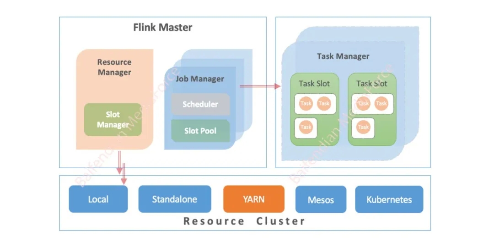

如图所示，Flink 集群由 Flink Master、TaskManager 组成，Flink Master 中对应多个 JobManager，每个 JobManager 负责管理单个 Job 的调度和执行，而 Resource Manager 负责整个集群的内外部资源调度，Flink 可以支持嫁接在 Kubernetes、Mesos、Yarn 等资源调度管理系统之上，结合我们现有的大数据处理平台，我们使用 Yarn 作为我们 Flink 集群的底层资源管理系统。

逻辑上，算子（Operator）是 Flink 最基本的数据处理单元，一个 Job 是由一系列 Task 组成的 DAG，而每个 Task 中是由一个链式的 Operators Chain 构成，因此，我们将舆情数据处理中的数据清洗、标签计算、数据拉通等计算，从 Storm Topology 中的多个 Spout、Bolt 中迁移到重新设计细化的算子序列，让计算单元粒度更细、资源并发度更可控。

以其中一个 < 数据 Level1 清洗 > Job 为例：

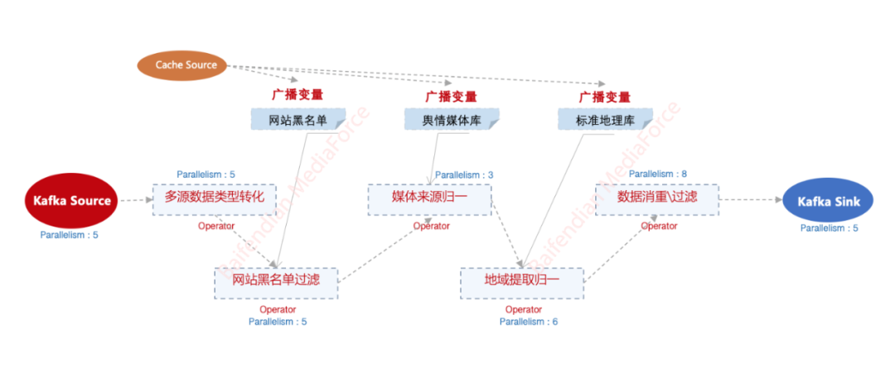

我们将数据清洗阶段的各步骤（类型转化、黑名单过滤、媒体来源归一、地域提取、消重）提取成独立算子，单独设置资源和并行度，并且针对全局只读的字典变量（如数据运营设置的网站黑名单、定期更新的网站媒体库、定期更新的标准地理库等），通过广播变量定期更新到各个算子，优雅的动态更新业务规则。

**使用 Flink 集群的核心优势**：

**资源调度**： 采用统一的 Yarn 作为 Flink 资源调度，相比使用裸机的 Storm，大幅提高了资源利用率，同时使资源伸缩变得更方便。

新的 Flink 集群，在资源利用率持续控制在 60% 左右的情况下，物理机资源节约了 50%，不仅节约了硬件成本，还提高了数据处理的能力。

> Flink On Yarn 提供 2 种任务提交方式：
> a. Yarn Session：多 Job 共享一个 Flink 集群，YARN 资源共享；
> b. Flink Run ：独立 Job 独占 Yarn Session，任务间互不影响。
> 我们使用第二种方式提交，能做到更好的业务资源隔离和集群任务监控。

**动态反压机制**： Flink 提供比 Storm 更好的动态反压机制，能够动态感知被阻塞的 Operator，自适应地降低源头或上游数据的发送速率，从而维持整个系统的稳定。

针对舆情场景下的数据流量波峰波谷和不确定的热点事件，Flink 集群很好的平衡了数据流速，解决了 Storm 集群频发的高负载故障。

**广播变量**： Flink 提供灵活的广播变量，通过将全局共享的数据广播出去，不同的任务在同一个节点上都能获取，数据只存在一份，相比于分布式缓存，节省了内存开销。

**逻辑解耦**： Flink 基于细粒度的算子链构建业务任务，可以把业务抽象成粒度足够小的算子，代码逻辑高度解耦；单个算子可单独配置并行度，其 Operator Chain 机制还能自动优化执行逻辑，将并行度一致的算子转化为线程内的方法调用，减少网络通信，提高运行效率。

除了 Flink 自带的任务资源管理，我们还进一步丰富了 Flink 在 YARN Session 级别的监控维度，接入 Grafana：

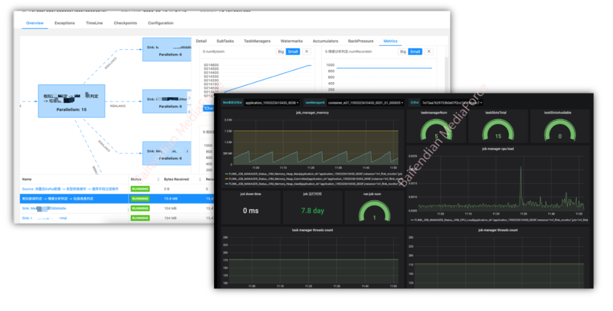

### 4.3 数据存储方案

舆情监控平台的核心价值，就是能够提供快速精准的信息检索，并且舆情系统的使用场景具有以下特点：

**实时数据价值更高**： 舆情数据传播趋势特征明显，人们关注的信息大部分集中在 7 天之内，且信息采集呈现的及时性，往往是分钟级的。

**信息检索维度灵活**： 客户信息筛选的维度是多样的，如根据微博粉丝量、性别、文章段落等。

**检索业务处理集中**： 舆情平台的检索压力有明显的特征曲线，工作时间负载压力大，早晚高峰报告查询集中。

**（1）选型发展**：

信息检索是舆情系统的核心需求，基于 Lucene 的全文检索引擎是实时数据检索的组件首选，早期我们使用 Solr，但是 Solr 依赖外部组件协调（ZooKeeper），运维成本很高。

2015 年，我们引入 ElasticSearch（ES）作为平台的底层数据库，提升了舆情数据存储集群的运维效率，也提高了平台存储的稳定性。

随着业务发展，数据量越来越大，即使是已经按照业务拆分的集群隔离也已经不能满足业务查询的性能要求，2017 年底，我们做了大幅底层集群优化和硬件升级，从业务集群隔离拓展到多集群、多索引的混合集群模式，版本也升级到了 6.*。伴随产品维度和数据量的增长，2018 年我们将 HBase 作为非索引大字段的底层存储，引入基于 Ceph 底层的 OSS 对象数据存储引擎，支撑图片、音视频的存储；架构升级后，支持伴随业务的灵活可扩展的缓存多集群方案。

**（2）存储架构**：

下图描述了简要的数据写入流程：

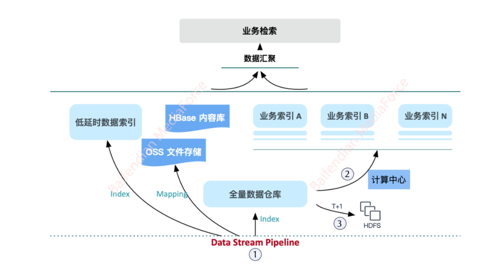

**数据写入**：

通过数据流计算完成的标准数据，通过 Data Pipeline 同步写入 全量数据仓库 和 ES 准实时索引集群，ES 集群存储文本索引字段，构建倒排索引，文档关联的原始 HTML 和 资源（如图片、视频），分别存储到 HBase 和 OSS 对象存储平台，构建 ES 文档关联。

**业务拆分**：

按照业务划分，对实时数据敏感的客户，热数据通过 ES 准实时索引构建检索结果，能够做到数据采集到 UI 呈现低于 30 秒的业务体验，对于预警时效敏感的客户，系统将信息准实时推送给客户，但这部分客户牺牲了一部分的定制化干预功能，如情感标签的定向优化。

对大部分客户，我们根据业务规则分组，将客户的专题规则，经由计算中心，同步计算到可扩展的 ES 业务缓存，这样做到客户专题级别的存储隔离，大幅提高信息检索的性能，同时，在同步计算节点，我们嵌入了可插拔的规则引擎计算插件，可以二次干预标签或者附加值计算，给定点客户提供了更优的数据分析体验，通过不断集群调优和算法改造，实时计算上万客户的全部专题，UI 数据呈现目前已经能做到延迟小于 3 分钟。

**离线备份**：

舆情客户数据具有鲜明的时间属性，历史数据关注度和分析价值不高，因此我们对数据除了 T+1 的同步备份外，线上实时 ES 集群只保留最近 2 年的数据，保证的集群的性能不随数据增量衰减，同时，离线备份的数据，同时用于定期的数据统计任务，服务于舆情分析师，作为长周期报告的数据分析来源。

存储架构的升级和变迁，很大程度上是伴随着系统的负载压力和不断增长的数据和客户增量，不断迭代演进，通过空间换时间，我们目前已经构建了一个超过 200 个 ES 节点的多集群架构，支撑每天 几十 TB 级的数据增量，以及上万客户的复杂舆情检索和计算。

### 4.4 检索优化方案

尽管我们使用 ES 作为全文检索的核心引擎，无论数据索引和简单查询，都能做到很好的性能支撑，但是舆情检索有一定的特殊性和复杂性。

**检索精度要求**：

舆情服务的客户，对于数据检索具有高召回的要求，通过关键词检索，任何匹配关键词、或匹配关键词组合的数据，都应该被及时检索并呈现，但中文语法复杂，对于歧义、包含等语义情况，常常存在分词造成的误差，导致检索召回率降低，造成客户投诉。

**检索性能要求**：

舆情信息检索过程中，相似文章需要默认折叠，以分页形式展示到前端，而数据实时入库，我们要求折叠数据的计算是实时的，虽然 ES 聚合（aggregation）性能随着社区发展不断优化，但其仍不能很好的处理亿级数据的分页聚合需求，尤其面对超过上千复杂关键词逻辑时，性能会变得更差。

**数据相关性要求**：

舆情检索是要发现价值信息，而 ES 自身的评分机制，并不能完整反映互联网公开数据的权重，比如网站权重大的网站发布的文章、传播量大的文章、或者负面倾向大的文章，我们往往需要排在数据呈现的前面，即数据的相关性，我们需要做二次的定制。

**业务灵活性要求**：

为了让信息检索更灵活，我们设计了一套复杂的检索语法，如：或、与、非、距离、字段定制、嵌套检索等，同时一个检索，还需要加入特定的规则干预，如数据定向、黑白名单、屏蔽过滤等，各种附加的操作都对 ES 的检索带来巨大的复杂性。

针对上述种种问题，我们列举部分检索优化点供参考：

**（1）集群调优**

**内存参数优化**： 内存对于 ES 来说异常重要，单个数据节点，JVM 内存设置为 31G（不超过 32G），触发内存指针压缩技术，配置 G1 垃圾回收器；同时，Lucene 被设计为可以利用操作系统底层机制来缓存内存数据结构，我们至少预留操作系统内存的一半作为 Lucene 的非堆内存，如果物理机内存小于 64G，给到 ES 节点的内存应该不超过内存的 50%；另外，内存交换到磁盘对服务器性能来说是致命的，一般会降低一个数量级，应该配置禁止内存交换（sudo swapoff -a）。

**动态分片设置**： 一个 ES index 的分片，底层对应一个 Lucene 的索引文件，会消耗系统的文件句柄、CPU 和内存资源，每个检索请求也会路由分类到每个分片，我们需要综合考虑查询请求的负载和分片的大小，合理设置分片的数量，一般推荐的分片大小是 20 ~ 50G 之间，因此在我们的 ES 集群管理中，每天的索引分片数是动态计算的（根据近期数据增量，预估当天数据量，调整创建索引的分片数量）。

**定时段（segment）合并**：ES 数据写入过程中，会产生大量的段文件，ES 每个分片的资源开销，取决于 segment 的数量，而通过段合并，将较小的分段合并为较大的分段，能减少开销并提高查询性能，但段合并是一项十分耗费性能的操作，我们应该关闭索引的自动段合并，在业务低峰时段（如凌晨）做定时索引段合并。

**硬件优化**： 尽量选配 SSD 硬盘，考虑到成本原因，可以结合业务场景，对业务检索有较高的性能要求的，建议使用 SSD 磁盘，检索不敏感的集群则使用普通磁盘，同时，当 ES 集群上有大量的索引时，通过单节点配置多个挂载磁盘，能够让数据高效的写入不同的磁盘，在硬件性能较差时，能显著提升数据写入的效率。

**（2）分词优化**

我们知道 ES 底层是基于分词的倒排索引，常见的开源中文分词器很多，如 ik 分词器、ansj 分词器、结巴分词器、hanlp 分词器等，但是针对精度要求非常高的舆情数据检索场景，上述分词器均存在不同程度的误差。

ES 的索引字段（analyzed）的分析（analysis）过程如下：

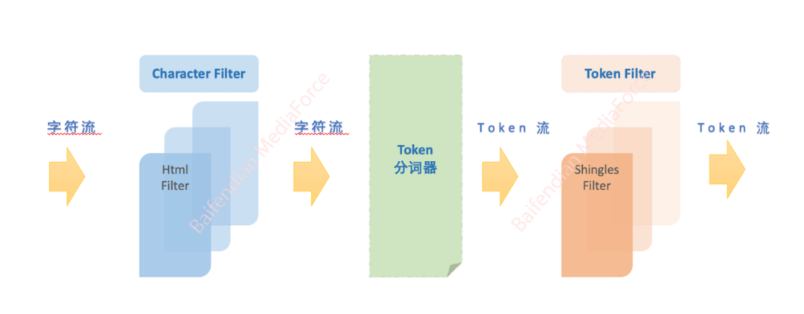

**Character filter 阶段**： 字符过滤器主要以字符流的方式接收原始文本，经过干预转换，输出字符流，比如特殊字符过滤或者编码转化。

**Tokenizer 阶段**： 即切词阶段，接收一个字符流 ，经过分词器切割拆分为多个 token，并输出一个 token 流。

**Token filter 阶段**： 接收 token 流，通过配置的 filter 算法，对每个 token 进行转化，比如小写转化、停用词删除、同义词引入等，ES 也提供了多种预置的 过滤器。

这里需要解决的问题是分词准确性导致的检索召回率问题，比如我们要通过“微贷网”检索数据，无论采用 IK 分词器的 ik_smart 或 ik_max_word，都无法检索出下面这句：“微贷网费用有哪些？”

原因是在分词阶段，在分词词库不添加专有名词“微贷网”的情况下，分词 token 均不包含 “微贷网”，而是“网费”被单独分词，导致检索无法匹配。丰富词库不能对历史数据生效，并不适用舆情实时的数据检索场景。

我们的方案是调整分词，将修饰定制的 ik_smart 和 shingles Token 过滤器相结合。

> Shingles 过滤器是一种特殊的词元过滤器，与 N-Gram 不同的是，n-gram 过滤器针对的是单个词汇单元，输出一个字母 n-gram 词汇单元序列，而 Shingles 是将一个序列的词汇单元，输出一个单词级别的 n-gram 词组单元序列。

- Ik_smart 分词器定制，除了利用 IK 分词器的各种中文定制词库外，将其改造为近似的按字标准分词器。
- 引入 Shingles token filter（Word-based N-Gram 过滤器），对分词后的 token 做 N 字滑动切分，那么输入任何 N 个长度的检索词，均能保证该 term 被检索到，而衡量业务场景和索引存储，我们将 N 设定为 2，入库的文章均做 2 字分词切分，保证了倒排索引的存储相对最优，同时约定检索关键词字符避免单字，在业务合理范围内，能够做到检索召回接近 100%。
- output_unigrams = False, 将 ik 分词结果和 shingles 结果分开存储，便于分别检索。

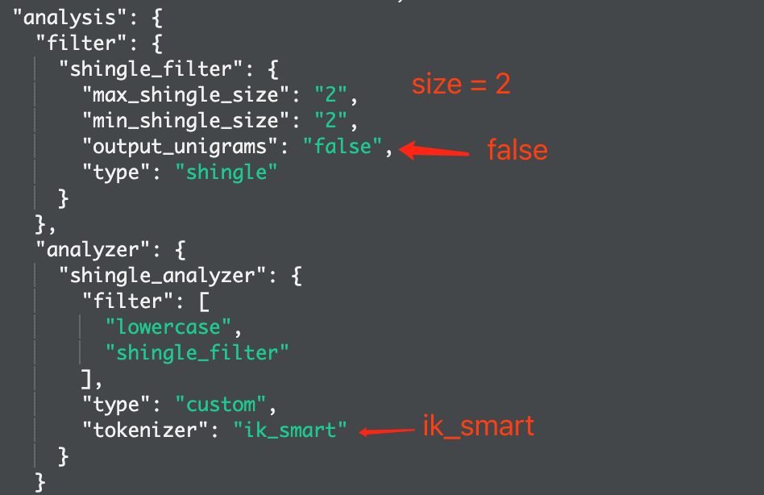

**（3）存储优化**

**索引拆分**：

根据业务场景，做集群拆分，如评论口碑数据与新闻网站数据集群分离，因为这两个场景的业务逻辑不通，查询并发度和分析维度差异很大。

针对单一集群做时间滚动拆分，比如按天创建数据索引，每天一个增量索引，数据检索直接跨索引查询，如前所述，动态规划新建索引的分片数，将单分片的大小维持在 20 ~ 50G 最佳。

**字段拆分**：

ES 是一个全文检索引擎，我们要将用于全文检索、聚合分析的索引存储到 ES，但一些大的文本字段，如 HTML 页面源码等，往往占用大量空间，ES 缓存本身非常宝贵，类似字段不仅会占用大量内存，也会降低网络传输效率，因此我们对类似大文本字段，只存储了索引后的分词结果，并不存储文本，这样大大降低了底层 Lucene 文件的大小，也更能充分利用 ES 和系统的缓存。当然，不存储文本，此类字段将无法提供高亮返回，如有需要，我们通过业务层做过滤计算匹配即可。

### 4.5 指标计算方案

通过分布式采集系统，保证数据全面性；通过数据流处理平台，保证数据处理的及时性和稳定性；通过全文检索数仓，保证数据可以方便的被业务检索应用。而舆情监测的价值，不仅体现在数据的全面、及时，更体现在数据细粒度的分析和挖掘上，每一条流进系统的数据，分析的结果我们都可以通过标签来标识，在舆情标签体系的设计流程中，我们对舆情数据指标划分了不同的层次，在数据流动的不同环节，产出不同类别的数据标签。

**（1）指标分类**

**定量指标**： 主要是针对互联网海量信息的流量变化等宏观统计，如趋势统计、TopN 榜单、关注数量、热度分析、信息地理位置分布等，此类信息主要基于存储引擎做聚合统计，主要难点在于基础指标字段的采集和存储设计。

**定性指标**： 主要针对单篇文章，进行附加信息的二次判定和挖掘，我们将主要的技术指标划分为两类：

a. L1 全局指标：主要在数据清洗、标准化后，全局计算的文本标签，包括但不限于：信源分类、媒体分类、行业分类、地域提取、命名实体识别、通用情感判定、垃圾标签识别、敏感标记、热词计算、传播力指数计算、重要度计算等。

b. L2 个性化指标：基于客户或领域知识，经过个性化调度流程计算干预的文本标签，包括但不限于：个性化情感标签、个性化相关度计算、重要度排名指数、定制化产品识别、定制化品牌提取等。

**（2）计算闭环**

数据流转和计算的基本过程如下图所示，我们可以简单地分为：两个计算中心、一个计算引擎、两个规则干预点。

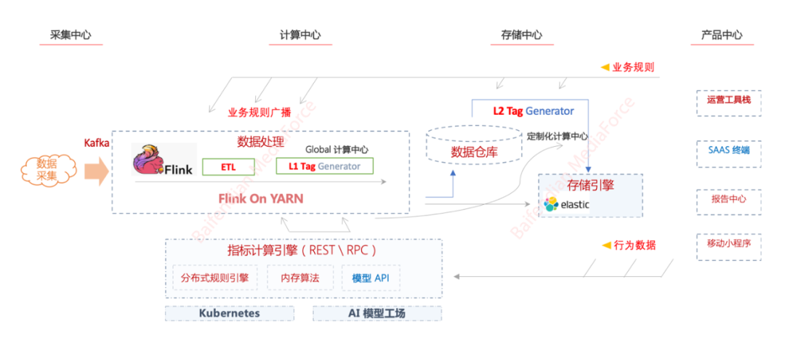

**Flink 实时流计算中心**： 数据进入 Flink 集群， 经过 ETL 处理，数据标准化之后，进行 L1 通用指标的计算，如相似度标签计算、行业分类、通用情感计算等，数据计算完成即入库，前端数据可检索呈现。

**分布式计算调度中心**： 进入数据仓库的数据，通过定制化计算调度中心，将数据刷新到客户存储引擎，数据在此环节按照专题做拆分，同时根据业务配置的干预规则，计算 L2 定制化标签，如定制化细粒度情感标签、客户产品类目标记、文本重要度、文本相关度标签等。

**指标计算引擎**： 指标计算引擎是独立于数据流的一套计算平台，对外提供 REST 和 gRPC 接口，供计算中心调用；计算引擎封装了核心的指标计算算法，一般分为两类：

a. 规则类：基于规则引擎（某些场景，我们使用了基于 Java 的 DROOLS 业务规则引擎框架）的逻辑规则，如网站黑名单过滤、媒体来源归一、通用字段表转化等，我们提供实时的规则编辑、部署、上线功能，让规则的干预更及时。

b. 模型类：基于 NLP 模型算法的计算规则，如：基于 TF-IDF 的文本关键词提取算法，基于 TextRank 的关键词短语和文本摘要提取，基于 Bi-LSTM + Attention 模型的文本分类算法，基于 BERT 及其衍生算法的情感判定算法等。

**规则干预点**： 信息挖掘算法应该通过特定输入，能够增量迭代、不断提升文本计算的效果，这里主要分为业务规则和行为数据：

a. 业务规则：第一种为通用规则，比如定期增量更新的舆情标准媒体库，定期更新的网站媒体 Alex 排名，定期更新的网站采集黑白名单等；第二种为分析师知识库，一些规则往往是随着业务的沉淀、分析师累积，不断迭代和丰富，如行业类目库、数据清洗规则等。

b. 行为数据：客户行为是我们宝贵的反馈输入，通过分析客户对于数据的判别行为，能帮助我们迭代优化分析效果和准确度，客户对数据的收藏和屏蔽，往往能反映数据对客户的价值度和相关度，我们基于此不断迭代优化 L2 标签计算的模型效果。用户的浏览和阅读行为，也能反映出客户的信息关注点，我们基于此不断调优数据配置的合理性和重要度计算标准，尤其随着深度迁移学习的发展和应用，这种基于小量反馈的模型迭代往往能快速提升文本模型的研判效果。

### 4.6 AI 技术赋能信息挖掘

基于互联网公开信息的舆情分析，重点针对的就是非结构化的自然语言文本，而经过多年的舆情技术架构演进，传统的单纯追求信息采集快、覆盖全、检索准的定量分析，已经不能满足企业或政府舆情分析的需求，针对舆情信息的智能化分析越来越成为舆情行业竞争的核心，舆情分析可以说是最适合 NLP（自然语言处理）技术落地和实践的产业阵地。

**（1）技术发展路线**

早在 2015 年，我们就已经开始探索应用 NLP 技术在舆情分析领域的落地场景，我们通过逻辑回归处理文章的分类。

2016 年进入深度学习领域，引入 Word2Vector 在大规模语料集上进行训练，随后在 TextCNN、TextRNN 等深度学习算法上更新迭代，得到了很好的技术指标。

2017 年，结合舆情业务的特点，通过基于依存句法及词性模板的篇章级情感计算，依据可扩充的句法规则及敏感词库进行特定的分析，支持文本中针对品牌或关注主体的情感判定。

2019 年上半年，随着以 BERT 为代表的迁移学习诞生，并且支持在下游进行 Fine-Tune，通过较小的训练数据集，即可得到不错的效果，解决了舆情训练样本不足、模型效果难以提升的难题。

2019 年下半年，从舆情的业务问题入手，通过优化提取更加精准、贴近业务的情感摘要作为模型输入，使用定制化模型以及多模型组合方案，联合对数据进行情感打标。融合基于特定实体（ATSA，aspect -term sentiment analysis）的负面信息研判，使用 Bert-Sentence Pair 的训练方式，将摘要文本、实体联合输入，进行实体的情感倾向性判定，在定点客户上取得不错的成绩，最后的 F1 值能达到 0.95。

除了在舆情情感判定场景，我们在舆情热词提取、事件聚类、多维标签标注、文本相似度计算等方面也在不断迭代，都取得了不错的成果。

**（2）AI 运营平台化**

如前文所述，尽管设计了一套能反馈干预的闭环标签计算流程，但随着客户和数据量的增长，不同行业和不同客户的业务规则越来越难以统一，定制化干预的计算需求越来越多，模型训练、部署的任务就不能仅局限在研发人员身上，因此为了提升业务定制化干预的效率，我们设计和实现了一套打通了业务闭环，集数据标注、模型训练、模型自动化部署的 AI 模型训练平台，将相关部门协同联动起来，大大提升了不同客户效果迭代的效率。

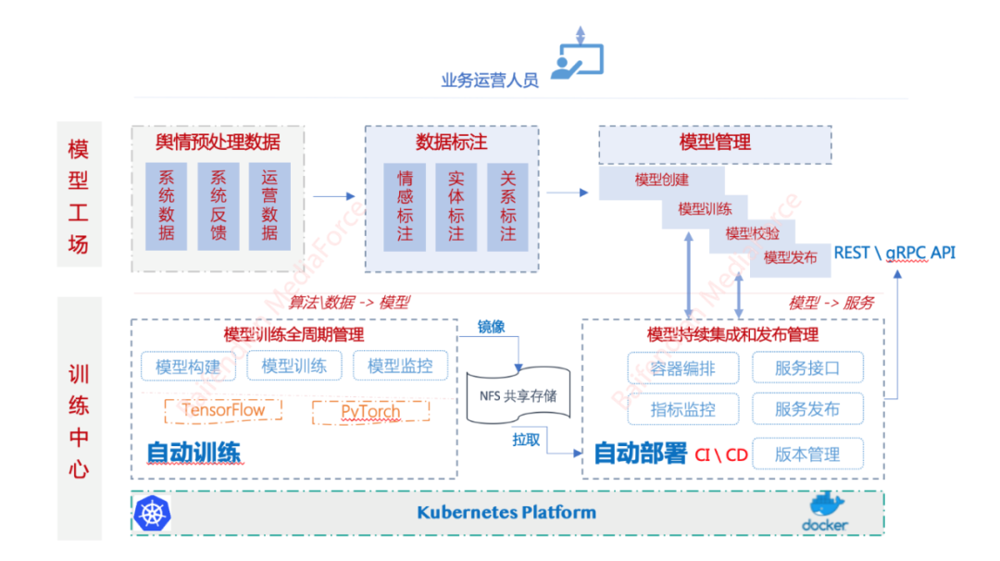

简要架构如上图所示：

平台上层，提供了一套标准的可视化操作界面；

平台底层，设计了一套 AI 模型训练的 CI\CD 流程。

- 自助训练，支持 TensorFlow 和 PyTorch 框架，方便研发人员对底层模型算法的灵活扩充，该流程实现了从算法、数据 到 模型的过程。
- 自动部署，基于 Kubernetes 和 Docker 容器云平台，打通了模型镜像 到 服务发布的全流程，提供模型容器编排、接口映射、服务发布、版本管理等功能。

2020 年 7 月份，AI 运营平台 1.0 版本发布后，上线了超过 200 个个性化定制实时预测模型，依靠底层强大的 GPU 算力，每天都有数十个分类等模型在迭代运算，在情感判定定制化干预模型下，个别客户已经能够做到 99% 的负面判定准确度。

**（3）AI 工具赋能效率提升**

依托百分点人工智能实验室，我们致力于通过人工智能技术提升信息挖掘的智能化水平，同时，我们也专注于通过 AI 帮助提高人员的服务效率，在舆情服务的全周期过程中，我们不仅通过自主研发的 AI 运营平台，为舆情分析师提供文本挖掘效率辅助，还引入了百分点自主研发的智能媒体校对系统，在舆情系统和舆情分析师的报告输出环节，做自动化的媒体稿件审校，避免错误，让报告服务更专业。

## 总结和展望

本文简要介绍了互联网舆情系统的架构思路和若干技术选型，简单来看，舆情服务体系的构建不仅仅是一个汇集数据采集、处理、呈现的大数据流式系统，而是一个服务于舆情客户生态的业务闭环，如何充分利用反馈数据，迭代提升指标效果非常重要。随着 SaaS 发展进入了 3.0 时代，从技术角度看，结合舆情发展的新趋势，我们仍将聚焦以下两点：

**（1）AI 技术将持续精进，从赋能者向引领者进化**

在数据采集方面，将持续推进网络采集机器人的智能化，让人工干预更少，信息覆盖更全，站点采集更稳定；在文本分析方面，将持续探索深度迁移学习在舆情数据信息分类、事件聚类、情绪识别、热点追踪等场景的落地应用；同时，将持续推进 AIOps 在舆情服务体系的应用实践，让 AI 自动化提升信息系统迭代效率，支撑企业细分场景下个性化的需求。

**（2）聚焦效率提升，降低边际成本**

我们仍将聚焦通过技术驱动提升服务效率，降低边际成本。在数据处理层面，推动构建实时数仓，大幅提升数据定量分析效率；在数据运营层面，进一步丰富数据 ETL 自动化工具，降低人工服务的工时成本；在产品创新的同时，促进模式创新，提升舆情服务体系的运转效率。

百分点舆情洞察服务体系是一个持续进化十余年的互联网媒体服务平台，服务了近万家各行业企事业单位，积累了大量的舆情服务体系业务专业知识，在覆盖全面、更新及时、挖掘精准的同时，进一步提升 AI 分析和挖掘水平，让舆情决策更智能。

**本文转载自公众号百分点（ID：baifendian_com）。**