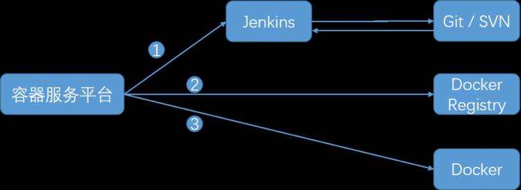
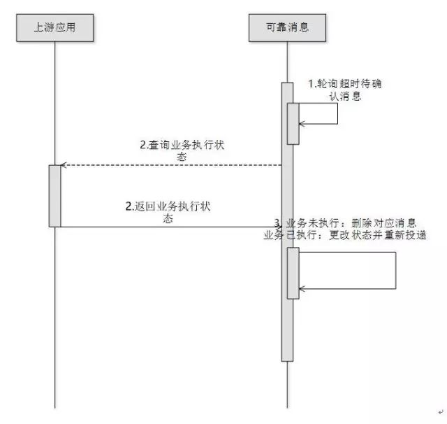

# （一）重识微服务架构

## 导语

虽然已经红了很久，但是“微服务架构”正变得越来越重要，也将继续火下去。  

各个公司与技术人员都在分享微服务架构的相关知识与实践经验，但我们发现，目前网上的这些相关文章中，要么上来就是很有借鉴意义的干货，要么就是以高端的专业术语来讲述何为微服务架构。就是没有一个做到成熟地将技术传播出来，同时完美地照顾“初入微服务领域人员”，从 0 开始，采用通俗易懂的语言去讲解微服务架构的系列。  

所以，我们邀请青柳云的苏槐与 InfoQ 一起共建微服务架构专题“Re：从 0 开始的微服务架构”，为还没有入门该领域的技术人员开路，也帮助微服务架构老手温故知新。  

这是专题的第一篇文章，从最基础的地方入手，让我们重识微服务架构。  

## 前言

得益于 2013 年 Docker 的诞生，微服务概念及架构的推广和落地变得更加的可靠和方便。在 2016 年及之前，微服务架构的讨论更多的是活跃于互联网企业及社区。现如今，随着 Docker 和微服务架构组件与 Docker 等相关技术的逐步成熟，微服务架构已然步入传统企业及传统行业。  

但是，程序员作为一个理性消费的群体，需要冷静地思考，避免挖个大坑把自己给埋了。所以，我们需要冷静地搞清楚：微服务（架构）是什么？它有什么优势劣势？我们为什么需要采用微服务架构？如何让老板接受这一新技术？如何落地？如何升级维护？等等……  

我们在过去 7 年智慧城市的建设过程中，研发和交付了很多的大型项目，踩过很多的坑，趟过很多的雷，深受传统建设方法之苦，也深深被微服务架构带来的好处所感动，我们也将在微服务架构这条路的继续前行。在这里，将我们研发过程中的一些思考和心得分享给大家，供大家参考。  

也许，在不久的将来，软件开发只需要组装，不再需要从头开发。  

[](https://www.infoq.cn/mag4media/repositories/fs/articles//zh/resources/0.png)

> 什么是微服务架构？

形像一点来说，微服务架构就像搭积木，每个微服务都是一个零件，并使用这些零件组装出不同的形状。通俗来说，微服务架构就是把一个大系统按业务功能分解成多个职责单一的小系统，并利用简单的方法使多个小系统相互协作，组合成一个大系统。  

如果学科派一点，微服务架构就是把因相同原因而变化的功能聚合到一起，而把因不同原因而变化的功能分离开，并利用轻量化机制（通常为 HTTP RESTful API）实现通信。  

追本溯源，Martin Folwer 对微服务架构的定义是：  

[](https://www.infoq.cn/mag4media/repositories/fs/articles//zh/resources/1.jpg)

微服务架构是一种架构模式，它提倡将单一应用程序划分成一组小的服务，服务之间互相协调、互相配合，为用户提供最终价值。每个服务运行在其独立的进程中，服务与服务间采用轻量级的通信机制互相协作（通常是基于 HTTP 协议的 RESTful API）。每个服务都围绕着具体业务进行构建，并且能够被独立的部署到生产环境、类生产环境等。另外，对具体的服务而言，应根据业务上下文，选择合适的语言、工具对其进行构建 。（**摘自王磊先生的《微服务架构与实践》**）  

对于我个人，我更喜欢一种延续性的解释，**微服务架构 ≈ 模块化开发 + 分布式计算**。不管微服务架构的定义怎么样，都是在描述一个核心思想：把大系统拆分成小型系统，把大事化小，以降低系统的复杂性，从而大幅降低系统建设、升级、运维的风险和成本。  

顺带提一下，亚马逊创始人 Jeff Bezos 在 2002 年就说过：所有团队的模块都要以 Service Interface 的方式将数据和功能开放出来。不这样做的人会被炒鱿鱼。这才是思路超前的大牛。  

[](https://www.infoq.cn/mag4media/repositories/fs/articles//zh/resources/2.jpg)

需要注意的是“**微服务**”与“**微服务架构**”是有本质区别的。“微服务”强调的是服务的大小，它关注的是某一个点。而“微服务架构”则是一种架构思想，需要从整体上对软件系统进行通盘的考虑。  

Chris Richardson 说：“微服务”是一个很糟糕的名字，它导致开发人员创建了许多粒度很小的服务，每个服务拥有一个单独的 REST 端点。不仅如此，这个名字还暗示了微服务在开发者心目中的重要位置。例如，人们会说“我们可以用微服务来解决这个问题”；我也看到了越来越多的“某某微服务框架”，而实际上，这些框架跟微服务架构不一定有太多联系，它们只是简单的 Web 框架。使用“微服务架构”这个名字会更恰当些。它是一种架构风格，它把一系列协作的服务组织成一个系统来支撑业务。  

## 常见的微服务组件及概念

1. **服务注册**，服务提供方将自己调用地址注册到服务注册中心，让服务调用方能够方便地找到自己。
2. **服务发现**，服务调用方从服务注册中心找到自己需要调用的服务的地址。
3. **负载均衡**，服务提供方一般以多实例的形式提供服务，负载均衡功能能够让服务调用方连接到合适的服务节点。并且，节点选择的工作对服务调用方来说是透明的。
4. **服务网关**，服务网关是服务调用的唯一入口，可以在这个组件是实现用户鉴权、动态路由、灰度发布、A/B 测试、负载限流等功能。
5. **配置中心**，将本地化的配置信息（properties, xml, yaml 等）注册到配置中心，实现程序包在开发、测试、生产环境的无差别性，方便程序包的迁移。
6. **API 管理**，以方便的形式编写及更新 API 文档，并以方便的形式供调用者查看和测试。
7. **集成框架**，微服务组件都以职责单一的程序包对外提供服务，集成框架以配置的形式将所有微服务组件（特别是管理端组件）集成到统一的界面框架下，让用户能够在统一的界面中使用系统。
8. **分布式事务**，对于重要的业务，需要通过分布式事务技术（TCC、高可用消息服务、最大努力通知）保证数据的一致性。
9. **调用链**，记录完成一个业务逻辑时调用到的微服务，并将这种串行或并行的调用关系展示出来。在系统出错时，可以方便地找到出错点。
10. **支撑平台**，系统微服务化后，系统变得更加碎片化，系统的部署、运维、监控等都比单体架构更加复杂，那么，就需要将大部分的工作自动化。现在，可以通过 Docker 等工具来中和这些微服务架构带来的弊端。 例如持续集成、蓝绿发布、健康检查、性能健康等等。严重点，以我们两年的实践经验，可以这么说，如果没有合适的支撑平台或工具，就不要使用微服务架构。

一般情况下，如果希望快速地体会微服务架构带来的好处，使用 Spring Cloud 提供的**服务注册（Eureka）**、**服务发现（Ribbon）**、**服务网关（Zuul）**三个组件即可以快速入门。其它组件则需要根据自身的业务选择性使用。  

## 微服务架构有哪些优势劣势？

要谈优势，就一定要有对比，我们可以尝试着从**两个维度**来对比。  

### 一、微服务架构与单体架构的对比

| S/N  | 对比点                   | 微服务架构                                                   | 单体架构                                                     | 结论         |
| ---- | ------------------------ | ------------------------------------------------------------ | ------------------------------------------------------------ | ------------ |
| 1    | 上手难度                 | API 接口调用                                                 | 数据库共享或本地程序调用                                     | 单体架构胜   |
| 2.1  | 开发效率（简单项目）     | 早期设计和沟通的工作量加大，随着项目规模和时间的推移，效率变化不大 | 早期工作量小，随着项目规模和时间的推移，效率大幅度下降       | 单体架构胜   |
| 2.2  | 开发效率（复杂项目）     | 早期设计和沟通的工作量加大，随着项目规模和时间的推移，效率变化不大 | 早期工作量小，随着项目规模和时间的推移，效率大幅度下降       | 微服务架构胜 |
| 3    | 系统设计（高内聚低耦合） | 每个业务单独包装成一个微服务，数据和代码都从物理上隔离开来，实现高内聚低耦合相对容易 | 以包的形式对代码进行模块划分，控制得当即可实现高内聚。但最终都是在数据层面将整个系统耦合在一起 | 微服务架构胜 |
| 4    | 系统设计（扩展性）       | 独立开发新模块，通过 API 与现有模块交互                      | 在现有系统上修改，与现存业务逻辑高度耦合                     | 微服务架构胜 |
| 5    | 需求变更响应速度         | 各个微服务组件独立变更，容易实施敏捷开发方法                 | 需要了解整个系统才可以正确修改，容易导致不相关模块的意外失败 | 微服务架构胜 |
| 6    | 系统升级效率             | 各个微服务组件独立升级，上手和开发效率高，影响面小           | 需要了解整个系统才可以正确修改，容易导致不相关模块的意外失败 | 微服务架构胜 |
| 7    | 运维效率                 | 大系统被拆分为多个小系统，部署和运维难度加大，但可以利用 DevOps 等方式将运维工作自动化 | 简单直接                                                     | 单体架构胜   |
| 8    | 知识积累                 | 微服务组件可以在新项目中直接复用，包括前端页面               | 一般以共享库的形式复用后台代码                               | 微服务架构胜 |
| 9.1  | 硬件需求（简单项目）     | 一个系统需部署多个微服务，需要启动多个运行容器               | 整个系统只需要一个运行容器                                   | 单体架构胜   |
| 9.2  | 硬件需求（高要求项目）   | 按需为不同业务模块伸缩资源节点                               | 为整个系统分配资源，导致冗余                                 | 微服务架构胜 |
| 10.1 | 项目成本（简单系统）     | 项目早期和后期，成本变化曲线平缓                             | 项目早期成本低，后期成本大                                   | 单体架构胜   |
| 10.2 | 项目成本（复杂系统）     | 项目早期和后期，成本变化曲线平缓                             | 项目早期成本低，后期成本大                                   | 微服务架构胜 |
| 11   | 非功能需求               | 为单独的微服务按需调优，甚至更换实现方式和程序语言           | 为整个系统调优，牵一发而动全身                               | 微服务架构胜 |
| 12   | 职责、成就感             | 拥有明确的职责划分，主人翁意识和成就感加强，容易形成自组织型团队 | 职责不明确，容易产生扯皮行为                                 | 微服务架构胜 |
| 13   | 风险                     | 大系统被拆分为小系统，风险可被控制在小系统内，但也引入了各小系统之间的交互风险 | 系统是一个整体，一荣俱荣，一损俱损                           | 微服务架构胜 |

**结论**:  

对于**简单项目**来说，单体架构 5 胜 8 败。（优势项：开发效率、上手难度、运维效率、硬件需求、项目成本；劣势项：系统设计（高内聚低耦合）、系统设计（扩展性）、需求变更响应速度、系统升级效率、知识积累、非功能需求、职责、成就感、风险）  

对于**复杂项目**来说，单体架构 2 胜 11 败。（优势项：上手难度、运维效率；劣势项：硬件需求、项目成本、开发效率、系统设计（高内聚低耦合）、系统设计（扩展性）、需求变更响应速度、系统升级效率、知识积累、非功能需求、职责、成就感、风险；）  

### 二、微服务与共享库的对比

**注**：这里以使用方自行安装微服务为场景来比较。这里的共享库指的是像 Java 中的公共 jar 依赖。  

| S/N  | 对比点     | 微服务                                                       | 共享库                                                       | 结论         |
| ---- | ---------- | ------------------------------------------------------------ | ------------------------------------------------------------ | ------------ |
| 1    | 易用性     | 整体安装 + API 调用                                          | 共享库引用 + 本地调用                                        | 平手         |
| 2    | 程序耦合度 | 微服务为完整的业务逻辑单元，通过 API 的形式为其它模块提供服务 | 在使用方的源代码中引用共享库的类和方法                       | 平手         |
| 3    | 版本升级   | 单独升级，其它模块无感知                                     | 修改源代码，升级使用方的代码版本，例如 pom.xml, build.gradle | 微服务架构胜 |
| 4    | Bug 修复   | 单独升级，自动生效                                           | 修改源代码，升级使用方的代码版本，例如 pom.xml, build.gradle | 微服务架构胜 |
| 5    | 非功能需求 | 为单独的微服务优化或扩缩容；在需求更高的情况下，可以重新设计或使用不同的程序语言 | 为整个业务系统优化或扩缩容，共享库的程序语言必须和业务系统的程序语言相同 | 微服务架构胜 |
| 6    | 复用程度   | 可以复用从前端页面到后台数据库的整个业务逻辑和代码           | 可以复用后台代码和数据库，但程序语言需要和业务系统保持一致   | 微服务架构胜 |

## 什么场景需要用微服务架构？

看了上面的比较，微服务架构可以说是以压倒性的优势胜过单体架构和共享库，会让人产生一种错觉，微服务架构就是软件开发中的银弹。  

但是，正如大家所了解的，软件研发是一个系统工程，它没有银弹，不能够一招鲜吃遍天。正如当年的 CMMI 和敏捷方法一样，敏捷虽好，但它不一定能适用于所有的场景，它对组织环境、团队氛围、沟通方式、技术能力这些都是有一些要求的，如果用不好，反而会带来一些负面影响。  

那么，我们什么时候需要采用微服务呢？从我个人的经验来看，我认为有三种场景可以考虑使用微服务。  

1. 规模大（团队超过 10 人）
2. 业务复杂度高（系统超过 5 个子模块）
3. 需要长期演进（项目开发和维护周期超过半年）

这里借一张图来说明:  

[](https://www.infoq.cn/mag4media/repositories/fs/articles//zh/resources/3.jpg)

横轴是复杂度，纵轴是生产效率。从生产效率的角度来讲，在两条曲线的交叉点之前，单体架构是占优势的，过了交叉点之后，单体架构的生产效率将大幅度下降。  

所以很多专家和同行朋友都说，我们可以在开始的时候先使用单体架构，当业务发展到一定程度的时候，再重构成微服务架构。对于这一点，我是持保留意见的，因为在实践中，架构改造的难度还是很大的，会有一些问题，例如:  

- 客户或业务部门是否给我们这样的时间窗口？  
- 这段时间的研发经费是否有出处？  
- 项目负责人或技术团队是否有主动的意愿进行架构升级？  
- 项目负责人或技术团队是否愿意为架构升级带来的不稳定风险负责？

我们常常听到的一句话是：暂时先这样，等我们没这么忙的时候，再来优化一下。但是，绝大多数情况下，这一天从来没有出现过。  

再想想年初，我们的私有云平台经过 2 年多的发展，已经包含了容器服务平台（PaaS）、API 网关、监控平台、定时任务平台、数据库管理、用户权限管理等等十多个基础模块，也包含了一些为上层应用服务提供的日志服务、缓存服务、消息服务等等。并且，部署到了二十多个客户的生产环境里。可悲的是，我们支撑了很多的业务系统的微服务化，但平台本身任然是一个单体系统。  

我们也深深地感受到了平台往前发展的阻力：  

- 很多时候，客户需要的不是一个大而全的平台，他们希望按他们的意愿采购需要的模块。  
- 新人进入团队后，从熟悉到动手产出的时间偏长。  
- 其它研发团队有一些比较好的组件能满足平台产品的需求，却不能直接拿来用。  
- 两个不同的模块之间产生了不该出现的耦合关系，导致意想不到的 Bug。

所以，春节过后，大家开了一个会，决定将平台微服务化。而带来的代价就是要说服老板给我们两个月时间来重构。  

幸运的是，我们很快得到了老板的支持，并且重构工作比较顺利；不幸的是，那二十多个客户的生产环境的升级非常麻烦，每升级一个客户都得花上一周左右的时间，至今也才升级了一小部分。  

所以，理想的情况下，我建议在项目初期的时候就从上面提到的三点做好评估，到底采用哪种架构形式是符合项目具体情况的。  

当然，如果真的有朋友想将历史悠久的单体架构升级到微服务架构，我建议先从边缘逻辑开始，逐步逐步地将业务逻辑从单体系统里剥离出来。我没有这方面的经验，但可以想象，这将是一个非常长期和痛苦的过程。  

## 下篇文章

下篇文章分享一下**微服务架构的简单模式**。  

[](https://www.infoq.cn/mag4media/repositories/fs/articles//zh/resources/4.png)

# （二）如何快速体验微服务架构？


虽然已经红了很久，但是“微服务架构”正变得越来越重要，也将继续火下去。各个公司与技术人员都在分享微服务架构的相关知识与实践经验，但我们发现，目前网上的这些相关文章中，要么上来就是很有借鉴意义的干货，要么就是以高端的专业术语来讲述何为微服务架构。就是没有一个做到成熟地将技术传播出来，同时完美地照顾“初入微服务领域人员”，从 0 开始，采用通俗易懂的语言去讲解微服务架构的系列。所以，我们邀请青柳云的苏槐与 InfoQ 一起共建微服务架构专题“Re：从 0 开始的微服务架构”，为还没有入门该领域的技术人员开路，也帮助微服务架构老手温故知新。

> **这是专题的第二篇文章，看看如何搭建一个简单模式的微服务架构**。

记得好久之前看到一个大牛说过：如果单体架构都搞不好，就别搞微服务架构。乍一看，这句很有道理，后来发现这句话是不太对的，因为微服务架构的目的就是为了降低系统的复杂性，所以 **微服务架构应该比单体架构更简单、更好实践才对**。 

这篇文章，我们就分享一下如何搭建一个 **简单模式** 的微服务架构。 

## 什么是微服务架构的简单模式？

相对于大型互联网平台动辄几万并发的访问量，或者每天多次的在线版本发布，绝大多数企业和项目并没有这样的需求。他们关注的是如何更好地提高开发效率，如何更快地实现新需求，如何更便利地运维，等等。 

微服务架构的简单模式就是可以满足以上需求的软件架构方案。 

相对于“完美”的微服务架构方案，微服务架构简单模式可以暂且不用关注保障数据一致性的分布式事务技术、方便程序包在环境间（开发、测试、生产）迁移的配置中心组件、监控 API 调用情况的调用链组件、避免系统超载的断路器组件、方便 API 管理和测试的 API 文档框架、Zookeeper、Redis，以及各种 MQ。只需要关注常常谈到的 **注册中心**、**服务发现**、**负载均衡** 和 **服务网关** 即可。 

## 如何将微服务架构的简单模式落地？

落地微服务架构，重点就是发扬优点，克服缺点。如前篇文章《**Re: 从 0 开始的微服务架构：（一）重识微服务架构**》的对比所示，相对于单体架构，微服务架构最大的缺点是 **上手难** 和 **运维难**。 

下面我们就来看看如何从这两个方面入手，将微服务架构的简单模式落地。 

### 上手难

相对于传统的单体架构，微服务架构一下子引入了太多的概念，让新手有点无可适从。所以，我们更要去芜存菁，理清楚哪些是自身需要的，哪些只是江湖上的传说。下面就来看看哪些组件是开发一个微服务架构的系统所必需的。 

首先说一下，使用微服务简单模式进行开发的四个步骤： 

**第一步**：沿用组织中现有的技术体系开发单一职责的微服务。 

**第二步**：服务提供方将地址信息注册到注册中心，调用方将服务地址从注册中心拉下来。 

**第三步**：通过门户后端（服务网关）将微服务 API 暴露给门户和移动 APP。 

**第四步**：将管理端模块集成到统一的操作界面上。 

为了实现以上 4 点，相对应的就是下面必需掌握的基础技术（必需的组件）。 

- **注册中心、服务发现、负载均衡**：对应上边第一步与第二步
- **服务网关**：对应上边第三步
- **管理端集成框架**：对应上边第四步

## 注册中心、服务发现、负载均衡

和单体架构不同，微服务架构是由一系列职责单一的细粒度服务构成的 **分布式网状结构**，服务之间通过轻量机制进行通信，这时候必然引入一个 **服务注册发现** 问题，也就是说服务提供方要将自己的服务地址注册到某个地方（**服务注册中心， Service Registry Center**），服务的调用方可以从服务注册中心找到需要调用的服务的地址（**服务发现，Service Discovery**）。同时，服务提供方一般以集群方式提供服务，也就引入了 **负载均衡** 的需求。 

根据负载均衡（**Load Balancer，简称 LB**）所在位置的不同，目前主要的服务注册、发现和负载均衡方案有三种： 

**集中式 LB 方案** 

第一种是集中式 LB 方案，在服务消费者和服务提供者之间有一个独立的 LB，LB 通常是专门的硬件设备如 F5，或者基于软件如 LVS，HAproxy 等实现。 

[](https://www.infoq.cn/mag4media/repositories/fs/articles//zh/resources/1.jpg)

服务调用者调用服务时，向 LB 发起请求，LB 再根据一定的策略（比如轮询、随机、最小响应时间、最小并发数等等）将请求路由到指定的服务。这个方案的最大问题是：**调用者和提供者之间增加了一跳，LB 也最有可能成为整个系统的瓶颈**。 

**进程内 LB 方案** 

第二种是进程内 LB 方案，针对集中式 LB 的不足，进程内 LB 方案将 LB 的功能以库的形式集成到服务消费方进程里头，该方案也被称为软负载 (Soft Load Balancing) 或者客户端负载方案。 

[](https://www.infoq.cn/mag4media/repositories/fs/articles//zh/resources/2.jpg)

其原理是：服务提供者将自身的地址发送到服务注册中心，同时定时发送心跳给注册中心，注册中心按心跳情况判断是否将此节点从注册表中摘除。服务提供者调用服务时，先从注册中心拉取服务注册信息，然后根据一定的策略去调用服务节点。 

这种情况下，即使注册中心宕机，调用方也可以根据内存中已经拉到的服务地址将请求路由到正确的服务上去。这个方案的最大问题是：**服务调用者可能需要集成注册中心的客户端，即将来注册中心服务端升级，可能会需要升级注册中心客户端**。 

**主机独立 LB 进程方案** 

[](https://www.infoq.cn/mag4media/repositories/fs/articles//zh/resources/3.jpg)

第三种是主机独立 LB 进程方案，该方案是针对第二种方案的不足而提出的一种折中方案，原理和第二种方案基本类似，不同之处是，他将 LB 和服务发现功能从进程内移出来，变成主机上的一个独立进程，主机上的一个或者多个服务要访问目标服务时，他们都通过同一主机上的独立 LB 进程做服务发现和负载均衡。该方案的典型案例是 Airbnb 的 SmartStack 服务发现框架。这个方案的最大问题是：**部署和运维比较麻烦**。 

以上三点摘自杨波先生的《**实施微服务，我们需要哪些基础框架？**》 

并作了部分补充，如果希望查看这三个方案的更详细说明，推荐读一读杨波先生的文章。 

当下，随着 Netflix 的微服务方案和 Spring Cloud 的兴起与成熟，**第二个方案** 成为我们的首选。我们推荐使用 **Eureka 做服务注册中心，Ribbon 做客户端服务发现和负载均衡**。 

这个选择的最大好处是 **简单 + 实用 + 可控**，不用引入额外的 Zookeeper、Etcd 做注册中心，部署和运维也都比较简单。从代码上来说，使用起来也非常简单。 

只是，需要注意的是，这种方案一般是用来做 **局域网内** 的负载均衡，如果要为开放到互联网的服务做负载均衡，可以使用 Nginx Upstream 来做。 

下面是 Eureka 最重要的几个参数配置，从这些参数也可以大概看看 Eureka 是如何工作的。 

[](https://www.infoq.cn/mag4media/repositories/fs/articles//zh/resources/4.jpg)

由于 Eureka 的注册及过期机制，服务从启动到完全可用需要近 2 分钟的时间，所以，为了提高开发及测试环境中的发版速度，我们改了以下几个参数。生产时，一定要改回去。 

[](https://www.infoq.cn/mag4media/repositories/fs/articles//zh/resources/5.jpg)

Eureka 注册中心的界面如下： 

[](https://www.infoq.cn/mag4media/repositories/fs/articles//zh/resources/6.jpg)

详细信息可参考[链接 1 ](https://github.com/Netflix/eureka)和[链接 2 ](https://github.com/Netflix/ribbon). 

## 服务网关

通常，一个大系统里会有很多职责单一的微服务，如果门户系统或移动 APP 来调用这些微服务的 API 时，至少要做好两件事： 

- 由统一的入口来调用微服务的 API
- API 鉴权

这就需要一个 **服务网关**。2015 年，我们使用 Rest Template + Ribbon 做了一个简单的 API 网关。原理就是当 API 网关接到请求 /service1/api1.do 时，将请求转发到 service1 对应的微服务的 api1 接口。 

后来，发现我们实现的功能，Spring Cloud Zuul 都有比较好的实现，也就切换到 Zuul 上面去了。Zuul 是 Netflix 基于 Java 开发的服务端 API 网关和负载均衡器。 

除此之外，Zuul 还可以对过滤器进行动态的加载、编译、运行。最令人吃惊的是，Zuul 的转发性能据说和 Nginx 差不多。详细信息可参考 https://github.com/Netflix/zuul。 

总的来说，一般情况下，API 网关（可以称为门户后端）用来进行反向代理、权限认证、数据剪裁、数据聚合等。 

[](https://www.infoq.cn/mag4media/repositories/fs/articles//zh/resources/7.jpg)

## 管理端集成框架

掌握注册中心、服务发现、负载均衡和服务网关技术后，微服务已经可以为门户系统和移动 APP 提供可靠服务。但是，给后台运营人员使用的管理端是怎么实现的呢？ 

由于后端运营系统的压力不大，我们可以通过 CAS 和 UPMS（UPMS 是我们团队研发的契合微服务架构的用户及权限管理系统，我们将分享到青柳云官网，欢迎关注）将单独开发的微服务整合起来。 

三步集成一个微服务的基本过程就是： 

1. 在微服务中引入基于 Spring Boot 的 security starter，starter 里包含了系统的顶端 Banner 和左侧菜单。
2. 将微服务的访问地址注册到 UPMS 中，这个地址作为此微服务的入口菜单（一级菜单）。
3. 在 UPMS 中配置微服务的功能菜单及角色权限信息。

用户从浏览器打开一个微服务的时候，security starter 会调用 UPMS 的 API 拉取所有的微服务清单（一级菜单）和当前微服务的功能清单（二级菜单），并将当前微服务的页面在内容区展现给用户。 

应用架构图: 

[](https://www.infoq.cn/mag4media/repositories/fs/articles//zh/resources/8.jpg)

UPMS 截图，橙色部分由 UPMS 框架提供，红色框为微服务的页面: 

[](https://www.infoq.cn/mag4media/repositories/fs/articles//zh/resources/9.jpg)

UPMS 通过“模块”功能接入新的微服务: 

[](https://www.infoq.cn/mag4media/repositories/fs/articles//zh/resources/10.jpg)

所以，到最后，一个简单模式的基于微服务架构的系统就可以长成这样: 

[](https://www.infoq.cn/mag4media/repositories/fs/articles//zh/resources/11.jpg)

至此，基本的微服务架构已经搭建起来。下面来聊聊怎么解决微服务运维的问题。 

### 运维难

微服务架构的运维问题，主要是相对于单体架构来说的。因为实施微服务架构后，整个系统的模块一下子比原来多了很多，模块变多后，部署和维护的工作量都会变大。所以，解决运维难的问题，可以先从 **自动化** 的角度来解决。 

更进一步，如果希望更好地发挥微服务架构的优势，规避缺点，则建议准备一个可靠的基础设施，包含自动构建、自动部署、日志中心、健康检查、性能监控等功能。 

否则，很有可能会因为微服务架构的缺点导致我们的团队丧失对微服务架构的信心，从而回到单体架构的老路上去。**工欲善其事，必先利其器，这一点真的很重要**。 

## 持续集成

单体应用被微服务化后，很有可能从原来的一个程序包分成了 10 个、20 个甚至更多的程序包。那么，我们首先遇到的麻烦就是部署工作直接扩大了 10 - 20 倍。这时，持续集成的方法和工具就成了实施微服务架构的前提条件。我们在实践过程中，利用基于 Docker 的容器服务平台自动部署整个系统的微服务。其过程如下图: 

[](https://www.infoq.cn/mag4media/repositories/fs/articles//zh/resources/12.jpg)

如果没有微服务支撑平台，也可以通过 Shell 脚本的形式来调用 Jenkins API 和 Docker API。 

主要过程是: 

1. 调用 Jenkins 命令从代码仓库拉取代码，并打包代码。
2. 调用 Docker /build 和 /images/push 命令构建镜像，并将镜像推送到私有镜像仓库中。
3. 调用 Docker /containers/create 和 /containers/start 命令创建并启动容器。

## 配置中心

在开发 / 测试环境上，程序包已经被打包成 Docker 镜像，如果能将通过测试的镜像直接推到生产环境，可以直接省去为生产环境而重复进行的打包部署工作，岂不是很美？ 

如果需要达到这个效果，就需要将程序包打包成具有环境无关性，也就是说，在程序包里是不可以有环境相关的配置信息的，这也就引入了 **配置中心** 组件。 

这个组件非常简单，只是根据项目代号、环境代号和微服务代号来获取微服务所需要的键值对。例如： 

ProjectA_PRODUCTION_MicroService1_jdbc.connection.url。 

使用配置中心还有一个很重要的附加价值，那就是可以做到不同环境的配置信息可以由不同的人来管理，加强了生产环境的配置信息的安全性，例如数据库帐号和密码。 

这个模块也有一些开源的项目可以参考，例如百度 disconf，Spring Cloud Config。而我们自己发杨了重复造轮子的精神，开发了一个配置中心微服务，以方便地与上面提到的 UPMS 进行整合。 

注意：这一组件并不是微服务架构简单模式的必需组件，只是建议使用。 

## 监控告警

单体应用被微服务化后，一个单体应用被拆成了很多个微服务，系统的健康巡检、性能监控、业务指标健康、文件备份监控、数据库备份监控、定时任务执行情况监控都变得困难。 

所以，为了让运维的同学能生活得踏实点，最好也能把监控平台给建了。如果希望快速搭建监控平台，可以考虑 Nagios，Zabbix。如果希望扩展性、可定制性更好，可以考虑使用以下组件搭建： 

[](https://www.infoq.cn/mag4media/repositories/fs/articles//zh/resources/13.jpg)

**Collectd** 是一款主机、数据库、网络、存储指标采集器。GitHub 上 1653 个 Star。 

**Metrics** 是一款牛逼的 JVM 指标采集器，提供了很多模块可以为第三方库或者应用提供辅助统计信息， 比如 Jetty， Logback，Log4j，Apache HttpClient，Ehcache，JDBI，Jersey，它还可以将度量数据发送给 Ganglia 和 Graphite 以提供图形化的监控。GitHub 上 5000+ 个 Star。 

**CAdvisor** 是一款 Docker 容器指标采集器，Google 出品。GitHub 上 6000 个 Star。 

**Grafana** 是一款非常精美的开源仪表盘工具，支持 Graphite，InfluxDB ，MySQL 和 OpenTSDB 等多种数据源。GitHub 上 17000 个 Star。 

**InfluxDB** 是一款优秀的开源分布式时序数据库，目前在时序数据中排名第一，它的特性中，RETENTION POLICY 可以自动地清除不需要的历史数据，很实用。GitHub 上 11175 个 Star。 

除了以上模块，我们还开发了一个模块，用来探测应用程序的健康情况和性能，在主机、程序健康情况、程序性能等各种指标出现异常时，发送警报给运维人员。 

## 总结

在这篇文章结束的时候，我们可以回过头来看看，我们只需要在开发层面理解了注册中心、服务发现、负载均衡、服务网关和管理端集成框架，在运维层面准备好持续集成工具、配置中心和监控告警工具，就可以很容易地落地微服务架构，享受微服务架构带来的精彩。祝大家玩得愉快。

# （三）微服务架构 API 的开发与治理

虽然已经红了很久，但是“微服务架构”正变得越来越重要，也将继续火下去。各个公司与技术人员都在分享微服务架构的相关知识与实践经验，但我们发现，目前网上的这些相关文章中，要么上来就是很有借鉴意义的干货，要么就是以高端的专业术语来讲述何为微服务架构。就是没有一个做到成熟地将技术传播出来，同时完美地照顾“初入微服务领域人员”，从 0 开始，采用通俗易懂的语言去讲解微服务架构的系列。所以，我们邀请青柳云的苏槐与 InfoQ 一起共建微服务架构专题“Re：从 0 开始的微服务架构”，为还没有入门该领域的技术人员开路，也帮助微服务架构老手温故知新。 

> **这是专题的第三篇文章，聊聊内网环境中的 API 开发与治理**。

前面的文章中有说到微服务的通信方式，Martin Folwer 先生在他对微服务的定义中也提到“每个服务运行在其独立的进程中，服务与服务间采用 **轻量级的通信机制** 互相协作（通常是基于 HTTP 协议的 RESTful API）”。 

那么，在各个微服务之间具体怎么进行轻量级的通信呢？这篇文章就来聊聊微服务 API 开发及治理的几个方面。 

首先需要解释一下，标题中的“**内网环境中** 的 API”指的是提供给内网里的其它微服务调用的 API。与其相对应的是“**开放给互联网** 用户调用的 API”，它们的开发方法大体相同，但治理方法却不太一样。 

例如开放给互联网用户调用的 API 需要在 API 网关上加上授权、鉴权、限流、限并发、统计、计费等等功能。 

本篇文章分享的是内网环境中的 API 开发及治理。 

## API 开发

API 开发，首先考虑的就是该用什么样的协议，是 HTTP API 还是 RPC？ 

我们先来介绍一下这两种 API 类型： 

### HTTP API

HTTP API 指的是简单的基于 HTTP 协议的 API，具体的例子就是 Spring MVC 的 Controller，例如 

**“****http://127.0.0.1/helloworld/myapi.do”**。 

### RPC

RPC 就是 **Remote Procedure Call**，中文名远程过程调用，在 API 调用的场景下，大多指的是基于 Socket 通信方法的远程调用（当然，我们也可以使用 HTTP 协议来实现 RPC 调用，例如 gRPC）。Json-RPC 和 Xml-RPC 指的是使用 Json 或 Xml 作为文本格式的方式传输命令和数据。 

那么回到刚才那个问题，到底要使用 HTTP API 还是 RPC 呢？我们之所要对比 HTTP API 和 RPC，主要是因为大家都知道 **HTTP 简单**，而基于 Socket 的 **RPC 性能更好**。 

这个问题我们纠结了很久，直到后来，想明白了下面两件事，最终决定在绝大部分场景中使用 HTTP API。 

### HTTP API 的性能足以支撑大多数项目

通常来讲（根据资料），算上序列化的时间，RPC 协议的吞吐量是 HTTP 性能 **两倍**（没有亲测），例如 Protobuf、Thrift、Kyro、Dubbo 等等。 

这里面，又以 Thrift 的性能最高。具体的性能测试报告可以参考《RPC 框架性能基本比较测试》。 

(点击放大图像)

[](https://www.infoq.cn/mag4media/repositories/fs/articles//zh/resources/1.jpg)

我们团队在结合自身技术栈、成本、稳定性、易用性、可维护性、业务场景等等因素综合考虑后，觉得我们面临的大多数场景中，**HTTP 和 RPC 的性能差别并不是主要问题**。 

再加上下图所示的 HTTP 性能测试结果作为佐证，我们**完全可以**采用 HTTP API 的方式来进行微服务 API 开发。 

再者，当业务发展到一定的程度，如果某些业务功能的性能压力变大时，我们还是可以使用 RPC 小范围地进行改造。这也是符合敏捷思想的一个决定。 

下图是对 helloworld 页面进行 10000 次连续请求的测试结果，总耗时 1.504 秒，平均每个请求耗时 0.15 毫秒。 

测试环境：原生 Tomcat7（没有任何优化）运行在本地虚拟机上  

(点击放大图像)

[](https://www.infoq.cn/mag4media/repositories/fs/articles//zh/resources/2.jpg)

下面是对 helloworld 页面以 100 并发数进行 10 万次请求的测试结果，平均每个请求耗时 11.9 毫秒。 

测试环境：原生 Tomcat7（没有任何优化）运行在本地虚拟机上  

(点击放大图像)

[](https://www.infoq.cn/mag4media/repositories/fs/articles//zh/resources/3.jpg)

所以，按照上面的测试结果，HTTP API 方式的性能完全足以支撑绝大多数的微服务 API 开发。**让我们把 RPC 方式留给那些可能出现双十一业务量的大型互联网公司去玩**。 

### RESTful API 适用于开放 API 的场景

这是另一个折磨人的问题。相对于 HTTP API，RESTful API 在 HTTP API 的基础上增加了一些非常抽象晦涩的概念，例如资源（Resource）、表述（REpresentation）、状态转移（State Transfer）、统一接口（Uniform Interface）……。 

在经历了一次又一次的折磨，例如“**login/logout 是什么 RESTful 方法？**”、“**批量删除该怎么实现？**”、“**RESTful 的 resource 究竟该怎么定义？**”之后，越来越感觉这是一个形而上学的问题，太过于抽像。 

我们不该盲从于时髦的技术，需要加上技术人的基于自身情况的理性思考。所以，RESTful 虽好，但不是我们团队的菜。 

再者，即使团队中有些人可以理解并正确地实践，也很难或者说不可能让整个团队来正确地实践这样一种方法。 

所以，我们在一番挣扎后，选择了 HTTP API 方式，原来怎么开发，现在还是怎么开发，把主要精力放到了 API 的监控和治理上面。 

这里推荐大家看看知乎上的这篇讨论 **《WEB 开发中，使用 JSON-RPC 好，还是 RESTful API 好？》,** 几位大神讲得都挺好。 

## API 治理

### API 文档

API 存在的意义在于有人调用它，如果调用方在调用 API 的时候很麻烦，甚至不能正确地调用，那么团队内部及团队之间的沟通成本及配合程度就会大受影响。 

我们是通过文档来沟通的，项目开始的时候还好，但随着时间的推移，文档的更新变得不是那么及时（**这其实是个自我辩解的说法，事实是大部分情况下文档都不更新了**），API 变更时，也不容易找出哪些模块调用了这个 API。 

所以，得先解决 **文档不及时更新** 的问题。虽然我们可以通过流程管理的方式来强制大家更新文档，但这对于开发人员来说，显然是不够科学或人性化的，因为变更一个 API，就要在两个地方进行修改，一是 API 代码，二是 API 文档，程序员的思维就得在代码和文档之间不断切换，工作效率必然受影响。 

我们就想，能不能只需要在同一个地方修改，如果能做到，API 文档的更新就没有那么麻烦了，于人于已都是好事。 

经过调研，我们选择使用 Swagger 来编写文档，按照 Swagger 的规范，在 API 上加一些描述性的 Annotation 就可以了。 

(点击放大图像)

[](https://www.infoq.cn/mag4media/repositories/fs/articles//zh/resources/4.jpg)

通过以上的 Annotation，将自动生成以下在线 API 文档。 

(点击放大图像)

[](https://www.infoq.cn/mag4media/repositories/fs/articles//zh/resources/5.jpg)

调用方可以在 API 文档界面填入参数并点击“Try it out!”按钮尝试调用这个 API。这样，在没有 API 提供方支持的情况下，即可以自行完成绝大部分的 API 调用，是不是很爽？ 

### 调用链管理

**API 开发出来了，API 文档也写好了，接下来就是被调用了**。前篇文章讲到，通过 Spring Cloud 的 Eureka + Ribbon + Zuul 可以很方便地调用到这些 API。 

那么，如何来追踪 API 被谁调用了，调用是否出错及出错原因，调用链路里各个 API 的性能怎么样，是不是存在僵尸 API……这些都是关于 API 治理的问题。 

实现这个目标，有一个比较取巧的方法，就是在 Ribbon 的客户端里做点文章，在调用 API 之前记录一下开始时间，API 调用返回后，记录 API 调用耗时、调用状态，如果有错则记录一下错误原因。 

如果还想追踪调用链，可以在请求头里加上一个调用链 ID，这样就来把调用关系都串连起来。 

下边是我们自己研发的调用链管理组件（**DCTrace**）的几个效果图： 

(点击放大图像)

[](https://www.infoq.cn/mag4media/repositories/fs/articles//zh/resources/6.jpg)

查看微服务之间的调用关系，调用性能  

(点击放大图像)

[](https://www.infoq.cn/mag4media/repositories/fs/articles//zh/resources/7.jpg)

查看调用失败原因  

(点击放大图像)

[](https://www.infoq.cn/mag4media/repositories/fs/articles//zh/resources/8.jpg)

图形化查看调用关系，太乱 ，下次迭代改进一下 [摊手] 

站在技术管理者的角度，可以从调用链里看出来，哪些模块之间发生了不正当关系 [噗嗤]；哪些模块之间本该有关系的，事实却没有；通过对比 Swagger 和调用链的 API 清单，找出僵尸 API…… 

### API 测试

使用微服务架构后，API 是每个微服务的 **唯一能力出口**。由于互联网行业的快速发展，软件需求变更变得越来越频繁，迭代升级的速度变得越来越快。 

对于提供方来说，需要保证变更和迭代的过程中，不影响之前承诺的功能（包括正确性、稳定性和性能等）。 

对于调用方来说，同样需要确保自身依赖的 API 能正常使用，不能因为其它模块的错误而导致自身业务受到影响（包括正确性、稳定性和性能等）。 

毕竟，从组织角度来看，**系统出错就是出错，不管原因是自身导致的还是服务提供方导致的**，所以 **服务调用方就需要对服务提供方进行管理**。 

这也就是前几年契约测试（Pact）方法大行其道的原因。有兴趣的朋友可以去看看这种测试方法。 

对于 API 白盒测试，推荐使用基于 Java 的 **REST-Assured** 测试框架，用起来特别方便。 

(点击放大图像)

[](https://www.infoq.cn/mag4media/repositories/fs/articles//zh/resources/9.jpg)

更进一步，基于 HTTP 协议、JSON/XML 报文的规范性，完全可以开发一个 API 测试小工具（暂且叫它 **小鹰** 吧）来替换 REST-Assured。我们也暂未实践，只是觉得会很有用，供大家参考。 

(点击放大图像)

[](https://www.infoq.cn/mag4media/repositories/fs/articles//zh/resources/10.jpg)

基础步骤是： 

1. 服务提供方开发 API，并正确书写 Swagger 文档。
2. 服务提供方在小鹰的界面上选择需要测试的 API，并填写测试参数。（API 清单和参数都可以通过调用 Swagger 的 API 获取）
3. 服务调用方根据自已的理解，也将对自己有用的服务方提供的 API 配置到小鹰上。
4. 小鹰 7*24 小时为服务提供方和调用方巡视这些 API，并在异常出现时发送警报。

## 总结

所以，对于微服务 API 开发，我们  

- 使用最常见的技术（例如 **Spring MVC**）进行 API 开发
- 使用 **REST-Assured**（以及未来的 **小鹰**）进行测试
- 使用 **Swagger** 来管理 API 文档
- 使用自研的 **DCTrace** 进行调用链管理

## 作者介绍

**苏槐**，微信号 Sulaohuai，青柳云研发总监，现服务于神州数码青柳云团队，曾就职于 Oracle，新加坡电信等企业。擅长容器技术、微服务架构、敏捷开发及技术管理。          

# （四）如何保障微服务架构下的数据一致性

虽然已经红了很久，但是“微服务架构”正变得越来越重要，也将继续火下去。各个公司与技术人员都在分享微服务架构的相关知识与实践经验，但我们发现，目前网上的这些相关文章中，要么上来就是很有借鉴意义的干货，要么就是以高端的专业术语来讲述何为微服务架构。就是没有一个做到成熟地将技术传播出来，同时完美地照顾“初入微服务领域人员”，从 0 开始，采用通俗易懂的语言去讲解微服务架构的系列。所以，我们邀请青柳云的苏槐与 InfoQ 一起共建微服务架构专题“Re：从 0 开始的微服务架构”，为还没有入门该领域的技术人员开路，也帮助微服务架构老手温故知新。

专题文章传送

- [Re：重识微服务架构](http://www.infoq.com/cn/articles/micro-service-architecture-from-zero)
- [快速快速体验微服务架构？](http://www.infoq.com/cn/articles/micro-service-architecture-from-zero-part02)
- [微服务架构 API 的开发与治理](http://www.infoq.com/cn/articles/micro-service-architecture-from-zero-part03)

> **这是专题的第四篇文章，我们来了解一下如何保障微服务架构下的数据一致性。**

随着微服务架构的推广，越来越多的公司采用微服务架构来构建自己的业务平台。就像前边的文章说的，微服务架构为业务开发带来了诸多好处的同时，例如单一职责、独立开发部署、功能复用和系统容错等等，也带来一些问题。

例如上手难度变大，运维变得更复杂，模块之间的依赖关系更复杂，数据一致性难以保证，等等。但是办法总是比问题多，本篇文章就来介绍一下我们是如何保障微服务架构的数据一致性的。

## 微服务架构的数据一致性问题

以电商平台为例，当用户下单并支付后，系统需要修改订单的状态并且增加用户积分。由于系统采用的是微服务架构，分离出了支付服务、订单服务和积分服务，每个服务都有独立数据库做数据存储。当用户支付成功后，无论是修改订单状态失败还是增加积分失败，都会 **造成数据的不一致**。


为了解决例子中的数据一致性问题，一个最直接的办法就是考虑数据的 **强一致性**。那么如何保证数据的强一致性呢？我们从关系型数据库的 ACID 理论说起。

### ACID

关系型数据库具有解决复杂事务场景的能力，关系型数据库的事务满足 ACID 的特性。

- **Atomicity**：原子性（要么都做，要么都不做）
- **Consistency**：一致性（数据库只有一个状态，不存在未确定状态）
- **Isolation**：隔离性（事务之间互不干扰）
- **Durability**： 永久性（事务一旦提交，数据库记录永久不变）

具有 ACID 特性的数据库支持数据的强一致性，保证了数据本身不会出现不一致。

然而微服务架构下，每个微服务都有自己的数据库，导致微服务架构的系统不能简单地满足 ACID，我们就需要寻找微服务架构下的数据一致性解决方案。

微服务架构的系统本身是一种分布式系统，而本文讨论的问题其实也就是分布式事务之数据一致性的问题，我们来聊聊分布式系统的 CAP 理论和 BASE 理论。

### CAP

CAP 是指在一个分布式系统下， 包含三个要素：Consistency（一致性）、Availability（可用性）、Partition tolerance（分区容错性），并且 **三者不可得兼**。

- **C：Consistency**，一致性，所有数据变动都是同步的。
- **A：Availability**，可用性，即在可以接受的时间范围内正确地响应用户请求。
- **P：Partition tolerance**，分区容错性，即某节点或网络分区故障时，系统仍能够提供满足一致性和可用性的服务。

关系型数据库 **单节点** 保证了数据强一致性（C）和可用性（A），但是却无法保证分区容错性（P）。

然而在分布式系统下，为了保证模块的分区容错性（P），**只能在数据强一致性（C）和可用性（A）之间做平衡**。具体表现为在一定时间内，可能模块之间数据是不一致的，但是通过自动或手动补偿后能够达到最终的一致。

### BASE

BASE 理论主要是解决 **CAP 理论中分布式系统的可用性和一致性不可兼得的问题**。BASE 理论包含以下三个要素：

- **BA：Basically Available**，基本可用。
- **S：Soft State**，软状态，状态可以有一段时间不同步。
- **E：Eventually Consistent**，最终一致，最终数据是一致的就可以了，而不是时时保持强一致。

BASE 模型与 ACID 不同，满足 CAP 理论，通过 **牺牲强一致性来保证系统可用性**。由于牺牲了强一致性，系统在处理请求的过程中，数据可以存在短时的不一致。

系统在处理业务时，记录每一步的临时状态。当出现异常时，根据状态判断是否继续处理请求或者退回原始状态，从而达到数据的最终一致。

例如，在上面的案例中，支付成功，订单也成功，但增加积分失败，此时，不应回滚支付和订单，而应通过一些 **补偿方法** 来让积分得以正确地增加。后面会讲到具体的实现方法。

在分享我们的分布式事务实践方案之前，先看看早期解决分布式事务问题的二阶段提交协议。

## 二阶段提交协议

**X/Open DTP**（Distributed Transaction Process）是一个分布式事务模型，此模型主要使用二阶段提交（2PC，Two-Phase-Commit）来保证分布式事务的完整性。在这个模型里面，有三个角色：

- **AP：Application**，应用程序，业务层。
- **RM：Resource Manager**，资源管理器，关系型数据库或支持 XA 接口（XA 规范是 X/Open 组织定义的分布式事务规范）的组件。
- **TM： Transaction Manager** ，事务管理器，负责各个 RM 的提交和回滚。

当应用程序（AP）调用了事务管理器（TM）的提交方法时，**事务的提交分为两个阶段实行**。

### 第一阶段（准备阶段）

[](https://www.infoq.cn/mag4media/resource/articles/micro-service-architecture-from-zero-part04/zh/resources/172-1508681361394.jpg)

TM 通知所有参与事务的各个 RM，给每个 RM 发送 prepare 消息。

RM 接收到消息后进入准备阶段后，要么直接返回失败，要么创建并执行本地事务，写本地事务日志（redo 和 undo 日志），但是 **不提交**（此处只保留最后一步耗时最少的提交操作给第二阶段执行）。

### 第二阶段（提交 / 回滚阶段）

[](https://www.infoq.cn/mag4media/resource/articles/micro-service-architecture-from-zero-part04/zh/resources/183-1508681361394.jpg)

TM 收到 RM 准备阶段的失败消息或者获取 RM 返回消息超时，则直接给 RM 发送回滚（rollback）消息，否则发送提交（commit）消息。

RM 根据 TM 的指令执行提交或者回滚，执行完成后释放所有事务处理过程中使用的锁（最后阶段释放锁）。

### 二阶段提交的利弊

**优点**

2PC 提供了一套完整的分布式事务的解决方案，遵循事务严格的 ACID 特性。

**缺点**

- TM 通过 XA 接口与各个 RM 之间进行数据交互，从第一阶段的准备阶段，业务所涉及的数据就被锁定，并且锁定跨越整个提交流程。在高并发和涉及业务模块较多的情况下 **对数据库的性能影响较大**。
- 二阶段是 **反可伸缩模式** 的，业务规模越大，涉及模块越多，局限性越大，系统可伸缩性越差。
- 在技术栈比较杂的分布式应用中，存储组件有很多 **不支持 XA 协议**。

二阶段的诸多弊端，导致分布式系统下无法直接使用此方案来解决数据一致性问题，但它提供了解决分布式系统下数据一致性问题的思路。。

下面就通过案例来分享我们是如何保证微服务架构的数据一致性的。

## 可靠消息最终一致性

可靠消息最终一致性方案本质上是 **利用 MQ 组件实现的二阶段提交**。此方案涉及 3 个模块：

- **上游应用**，执行业务并发送 MQ 消息。
- **可靠消息服务和 MQ 消息组件**，协调上下游消息的传递，并确保上下游数据的一致性。
- **下游应用**，监听 MQ 的消息并执行自身业务。

[](https://www.infoq.cn/mag4media/resource/articles/micro-service-architecture-from-zero-part04/zh/resources/144-1508681361394.jpg)

### 上游应用执行业务并发送 MQ 消息（第一阶段）

上游应用将本地业务执行和消息发送绑定在同一个本地事务中，保证要么本地操作成功并发送 MQ 消息，要么两步操作都失败并回滚。

上游应用和可靠消息之间的业务交互图如下：

[](https://www.infoq.cn/mag4media/resource/articles/micro-service-architecture-from-zero-part04/zh/resources/135-1508681361394.jpg)

1. 上游应用发送待确认消息到可靠消息系统
2. 可靠消息系统保存待确认消息并返回
3. 上游应用执行本地业务
4. 上游应用通知可靠消息系统确认业务已执行并发送消息。
5. 可靠消息系统修改消息状态为发送状态并将消息投递到 MQ 中间件。

以上每一步都可能出现失败情况，分析一下这 5 步出现异常后上游业务和消息发送是否一致：


上游应用执行完成，下游应用尚未执行或执行失败时，此事务即处于 BASE 理论的 **Soft State** 状态。

### 下游应用监听 MQ 消息并执行业务（第二阶段）

下游应用监听 MQ 消息并执行业务，并且将消息的消费结果通知可靠消息服务。

可靠消息的状态需要和下游应用的业务执行保持一致，可靠消息状态不是已完成时，确保下游应用未执行，可靠消息状态是已完成时，确保下游应用已执行。

下游应用和可靠消息服务之间的交互图如下：

[](https://www.infoq.cn/mag4media/resource/articles/micro-service-architecture-from-zero-part04/zh/resources/77-1508681361395.jpg)

1. 下游应用监听 MQ 消息组件并获取消息
2. 下游应用根据 MQ 消息体信息处理本地业务
3. 下游应用向 MQ 组件自动发送 ACK 确认消息被消费
4. 下游应用通知可靠消息系统消息被成功消费，可靠消息将该消息状态更改为已完成。

以上每一步都可能出现失败情况，分析一下这 4 步出现异常后下游业务和消息状态是否一致：


通过分析以上两个阶段可能失败的情况，为了确保上下游数据的最终一致性，在可靠消息系统中，需要开发 **消息状态确认** 和 **消息重发** 两个功能以实现 BASE 理论的 **Eventually Consistent** 特性。

### 消息状态确认

可靠消息服务定时监听消息的状态，如果存在状态为待确认并且超时的消息，则表示上游应用和可靠消息交互中的步骤 4 或者 5 出现异常。

可靠消息则携带消息体内的信息向上游应用发起请求查询该业务是否已执行。上游应用提供一个可查询接口供可靠消息追溯业务执行状态，如果业务执行成功则更改消息状态为已发送，否则删除此消息确保数据一致。具体流程如下：

[](https://www.infoq.cn/mag4media/resource/articles/micro-service-architecture-from-zero-part04/zh/resources/39-1508682042964.jpg)

1. 可靠消息查询超时的待确认状态的消息
2. 向上游应用查询业务执行的情况
3. 业务未执行，则删除该消息，保证业务和可靠消息服务的一致性。业务已执行，则修改消息状态为已发送，并发送消息到 MQ 组件。

### 消息重发

消息已发送则表示上游应用已经执行，接下来则确保下游应用也能正常执行。

可靠消息服务发现可靠消息服务中存在消息状态为已发送并且超时的消息，则表示可靠消息服务和下游应用中存在异常的步骤，无论哪个步骤出现异常，可靠消息服务都将此消息重新投递到 MQ 组件中供下游应用监听。

下游应用监听到此消息后，在保证幂等性的情况下重新执行业务并通知可靠消息服务此消息已经成功消费，最终确保上游应用、下游应用的数据最终一致性。具体流程如下：

[](https://www.infoq.cn/mag4media/resource/articles/micro-service-architecture-from-zero-part04/zh/resources/410-1508682042964.jpg)

1. 可靠消息服务定时查询状态为已发送并超时的消息
2. 可靠消息将消息重新投递到 MQ 组件中
3. 下游应用监听消息，在满足幂等性的条件下，重新执行业务。
4. 下游应用通知可靠消息服务该消息已经成功消费。

通过消息状态确认和消息重发两个功能，可以确保上游应用、可靠消息服务和下游应用数据的最终一致性。

当然在实际接入过程中，需要引入 **人工干预** 功能。比如引入重发次数限制，超过重发次数限制的将消息修改为死亡消息，等待人工干预。

代入开篇案例，通过可靠消息最终一致性方案，第一阶段，订单状态更改之前，订单服务向可靠消息服务请求保存待确认消息。可靠消息服务保存消息并返回。

订单服务接收到返回信息后执行本地业务并通知可靠消息服务业务已执行。消息服务更改消息状态并将消息投递到 MQ 中间件。

第二阶段，积分系统监听到 MQ 消息，查看积分是否已增加，如果没有增加则修改积分，然后请求可靠消息服务。可靠消息服务接收到积分系统的请求，将消息状态更改为已完成。

到这里，已经介绍完如何通过可靠消息服务来保证数据的一致性。但由于引入了可靠消息服务和消息队列，带来了一定的 **复杂性**，所以，它更 **适用于跨平台技术栈不统一的场景**。

下面再来介绍在技术栈统一的情况下，如何通过 TCC 来解决数据一致的方法。

## TCC（Try-Confirm-Cancel）

TCC 方案是二阶段提交的 **另一种实现方式**，它涉及 3 个模块，**主业务**、**从业务** 和 **活动管理器（协作者）**。

下面这张图是互联网上关于 TCC 比较经典的图示：

[](https://www.infoq.cn/mag4media/resource/articles/micro-service-architecture-from-zero-part04/zh/resources/411-1508682042964.jpg)

**第一阶段**：主业务服务分别调用所有从业务服务的 try 操作，并在活动管理器中记录所有从业务服务。当所有从业务服务 try 成功或者某个从业务服务 try 失败时，进入第二阶段。

**第二阶段**：活动管理器根据第一阶段从业务服务的 try 结果来执行 confirm 或 cancel 操作。如果第一阶段所有从业务服务都 try 成功，则协作者调用所有从业务服务的 confirm 操作，否则，调用所有从业务服务的 cancel 操作。

在第二阶段中，confirm 和 cancel 同样存在失败情况，所以需要对这两种情况做 **异常处理**以保证数据一致性。

1. **Confirm 失败**：则回滚所有 confirm 操作并执行 cancel 操作。
2. **Cancel 失败**：从业务服务需要提供自动 cancel 机制，以保证 cancel 成功。

目前有很多基于 RPC 的 TCC 框架，但是不适用于微服务架构下基于 HTTP 协议的交互模式。我们这次只讨论基于 HTTP 协议的 TCC 实现。具体的实现流程如下：

[](https://www.infoq.cn/mag4media/resource/articles/micro-service-architecture-from-zero-part04/zh/resources/512-1508682042964.jpg)

1. 主业务服务调用从业务服务的 try 操作，并获取 confirm/cancel 接口和超时时间。
2. 如果从业务都 try 成功，主业务服务执行本地业务，并将获取的 confirm/cancel 接口发送给活动管理器，活动管理器会顺序调用从业务 1 和从业务 2 的 confirm 接口并记录请求状态，如果请求成功，则通知主业务服务提交本地事务。如果 confirm 部分失败，则活动管理器会顺序调用从业务 1 和从业务 2 的 cancel 接口来取消 try 的操作。
3. 如果从业务部分或全部 try 失败，则主业务直接回滚并结束，而 try 成功的从业务服务则通过定时任务来处理处于 try 完成但超时的数据，将这些数据做回滚处理保证主业务服务和从业务服务的数据一致。

代入开篇提到的案例，通过 TCC 方案，订单服务在订单状态修改之前执行预增积分操作（try），并从积分服务获取 confirm/cancel 预增积分的请求地址。

如果预增积分（try）成功，则订单服务更改订单状态并通知活动管理器，活动管理器请求积分模块的 confirm 接口来增加积分。

如果预增积分（try）失败，则订单服务业务回滚。积分服务通过定时任务删除预增积分（try）超时的数据。

另外如果活动管理器调用积分服务的 confirm 接口失败，则活动管理器调用积分服务 cancel 接口来取消预增积分，从而，保证订单和积分数据的最终一致性。

通过上面的对可靠消息服务和 TCC 方案的描述，我们 **解决了技术栈一致和不一致的两种情况下的数据一致性问题**。

但是，通常在这些核心业务上有 **很多附加业务**，比如当用户支付完成后，需要通过短信通知用户支付成功。

这一类业务的成功或者失败不会影响核心业务，甚至很多大型互联网平台在并高并发的情况下会主动关闭这一类业务以保证核心业务的顺利执行。那么怎么处理这类情况呢，我们来看看最大努力通知方案。

## 最大努力通知

最大努力通知方案涉及三个模块：

- **上游应用**，发消息到 MQ 队列。
- **下游应用**（例如短信服务、邮件服务），接受请求，并返回通知结果。
- **最大努力通知服务**，监听消息队列，将消息存储到数据库中，并按照通知规则调用下游应用的发送通知接口。

具体流程如下：

[](https://www.infoq.cn/mag4media/resource/articles/micro-service-architecture-from-zero-part04/zh/resources/213-1508682042964.jpg)

1. 上游应用发送 MQ 消息到 MQ 组件内，消息内包含通知规则和通知地址
2. 最大努力通知服务监听到 MQ 内的消息，解析通知规则并放入延时队列等待触发通知
3. 最大努力通知服务调用下游的通知地址，如果调用成功，则该消息标记为通知成功，如果失败则在满足通知规则（例如 5 分钟发一次，共发送 10 次）的情况下重新放入延时队列等待下次触发。

最大努力通知服务表示在 **不影响主业务** 的情况下，尽可能地确保数据的一致性。它需要开发人员根据业务来指定通知规则，在满足通知规则的前提下，尽可能的确保数据的一致，以尽到最大努力的目的。

根据不同的业务可以定制不同的通知规则，比如通知支付结果等相对严谨的业务，可以将通知频率设置高一些，通知时间长一些，比如隔 5 分钟通知一次，持续时间 1 小时。

如果不重要的业务，比如通知用户积分增加，则可以将通知频率设置低一些，时间短一些，比如 10 分钟通知一次，持续 30 分钟。

代入上面提到的支付成功短信通知用户的案例，通过最大努力通知方案，当支付成功后，将消息发送到 MQ 中间件，在消息中，定义发送规则为 5 分钟一次，最大发送数为 10 次。

最大努力通知服务监听 MQ 消息并根据规则调用消息通知服务（短信服务）的消息发送接口，并记录每次调用的日志信息。在通知成功或者已通知 10 次时，停止通知。

## 总结

上面通过案例详细介绍了我们解决微服务之间数据不一致问题的三种方案，下面通过一张简单的对比图，为大家选择合适的解决方案提供简单依据。


## 作者介绍

**小羊**，青柳云架构师，现服务于神州数码青柳云团队，擅长大型项目规划、微服务架构和分布式架构。

**苏槐**，微信号 Sulaohuai，青柳云研发总监，现服务于神州数码青柳云团队，曾就职于 Oracle，新加坡电信等企业。擅长容器技术、微服务架构、敏捷开发及技术管理。

# （五）代码给你，看如何用 Docker 支撑微服务

虽然已经红了很久，但是“微服务架构”正变得越来越重要，也将继续火下去。各个公司与技术人员都在分享微服务架构的相关知识与实践经验，但我们发现，目前网上的这些相关文章中，要么上来就是很有借鉴意义的干货，要么就是以高端的专业术语来讲述何为微服务架构。就是没有一个做到成熟地将技术传播出来，同时完美地照顾“初入微服务领域人员”，从 0 开始，采用通俗易懂的语言去讲解微服务架构的系列。所以，我们邀请青柳云的苏槐与 InfoQ 一起共建微服务架构专题“Re：从 0 开始的微服务架构”，为还没有入门该领域的技术人员开路，也帮助微服务架构老手温故知新。

> **这是专题的第五篇文章，看如何用 Docker 支撑微服务。**

### 专题文章传送

- [Re：重识微服务架构](http://www.infoq.com/cn/articles/micro-service-architecture-from-zero)
- [快速快速体验微服务架构？](http://www.infoq.com/cn/articles/micro-service-architecture-from-zero-part02)
- [微服务架构 API 的开发与治理](http://www.infoq.com/cn/articles/micro-service-architecture-from-zero-part03)
- [如何保障微服务架构下的数据一致性](http://www.infoq.com/cn/articles/micro-service-architecture-from-zero-part04)

非常巧合，2013 年 3 月 Docker 发布 0.1 版本，时隔一年（2014 年 3 月）Martin Fowler 给出了微服务架构的定义。经过几年的发展，两个毫不相干的技术最终走到了一起：**使用 Docker 来支撑微服务架构的开发和运维**。

我们甚至可以说，没有 Docker 的蓬勃发展，就没有微服务架构的落地与开花。SoundCloud 的 Phil Calcado 最近却在 Twitter 上说了这样的话：

> “Microservices came to be because of containers” is a myth. We were already doing microservices on fvcking Weblogic。


起初，我也很好奇他为什么这么说，后来才发现他说的是”fvcking Weblogic”，并且早在 15 年接受 InfoQ 采访的时候，他已坦诚有更好的方法来实现微服务架构的构建流水线：“那是我第一次意识到我们搞砸了，原来有简单渐进的方式能够解决研发环境快速构建、基本的监控以及应用快速部署的问题，而且完全没必要构建自己的系统”。详情见：

http://www.infoq.com/cn/news/2015/03/soundcloud-microservices

**各位怎么看？**

不谈这个。在前几篇文章中，我们已经聊到微服务架构的优势、劣势，什么时候该选择微服务架构，使用哪些技术和组件来开发微服务，微服务 API 如何治理等等。

同时，前面也提到使用基于 Docker 的微服务平台来支撑微服务的自动化开发和运维，但是并没有深入。那么，这篇文章就来详细聊聊怎么使用 Docker 来提高微服务的开发效率和运维效率。

这篇文章的阅读对象是希望借助 Docker 实施轻量级微服务架构却不知道如何下手的朋友，所以，我还是延续前文的风格，尽量以浅显的语言来从以下几个方面进行介绍。

- **Docker 核心概念**

介绍 Docker 的镜像、容器以及镜像仓库概念。

- **为什么使用 Docker 实施微服务架构**

介绍使用 Docker 实施微服务架构的优势。

- **必须了解的 Docker 知识**

介绍镜像构建、容器创建、容器编排、集群管理、文件存储、容器网络、容器监控、容器日志。

- **快速运行一个微服务架构 Demo**

包含注册中心（Eureka）、调用链（DCTrace）、Service A、Service B、网关（Zuul）和 Demo 门户

## Docker 核心概念

### 镜像（Image）

我们可以认为：**镜像 = 操作系统 + 运行环境 + 应用程序**。譬如，我们可以将 Centos7 操作系统、JVM 和 Java 应用程序做成一个镜像。我们交付的软件不再是 zip 包或者 war 包，而是镜像。Docker 镜像技术实现了应用程序运行环境与主机环境的无关性。

### 容器（Container）

容器是镜像的运行态。通过 docker run 命令即可快速的基于镜像创建一个或多个容器。

### 镜像仓库（Registry）

在项目或者产品的不断迭代过程中，应用的各版本镜像存储在镜像仓库中，类似于代码仓库 for source code 或 Maven 仓库 for Jar file。

## 为什么使用 docker 实施微服务架构


在前文介绍如何快速搭建一个微服务架构时提到，我们需要使用自动化的构建和监控工具来解决微服务架构运维难的问题。之前由于篇幅问题，并没有把微服务的运维问题展开来谈。所以，这里我们就来详细看看 Docker 为微服务开发和运维带来了什么样的好处。


### 环境依赖隔离

我们经常会碰到一种现象，"应用在我的机器上跑的好好的，部署到生产环境就有出问题了"。Docker 隔离了应用对环境的要求，它将应用依赖的底层库或者组件制作成镜像，从而保证了开发、测试、生产环境的一致性。

### 计算资源隔离

Docker 之前，在同一台机器上部署多个同构甚至异构应用是非常困难的，不同的应用依赖的底层库有可能冲突，不同应用之间可能会抢占 CPU 和内存等计算资源。Docker 利用 Linux 的名称空间 (Namesaces)、控制组 (Contorl groups)、Union 文件系统和容器格式 (Container format) 实现了资源（例如 CPU、内存、IO 等）的隔离，保证同一台主机上的多个应用不会互相抢占资源。

### 更高的计算资源利用率

在微服务架构下，系统从单体程序拆成了多个独立部署的程序，每个程序处于独立的 Web 容器中，必然增加了对计算资源的需求。Docker 可以帮助抵消这个弊端。

基于资源隔离的特性，我们就可以在主机上部署多个应用，把主机的每个角落的计算资源都利用起来。所以，使用 Docker 后，我们可以提高 5~10 倍的计算资源利用率。

例如原来我们将应用部署在一个 4 核 8G 的主机上，而这个应用真实需要的内存只有 1GB，我们就可以在这台主机上部署 7 个类似的应用（还有 1GB 留给操作系统）。对我们公司来说，这种利用率的提高在开发测试环境上尤为明显。

### 迁移方便

Docker 之前，一个版本发布时，交付物是一个程序包加一份环境配置的文档。现在，交付物是一个 Docker 镜像，这个镜像里，已经包含了最新版本的程序包和修改过的运行环境。真正上线时，一条命令就可以把最新版本的程序发布起来。这对于需要半夜上线的同学是绝对的救星。

### 版本管理更便捷

之前，对于版本的管理，更多考虑的源代码级的，比如开个 Branch 或打个 Tag。现在，版本是一个包含了运行环境和程序包的镜像。在上线失败的时候，可以很快回滚到之前的版本。

### 编排的支持

微服务架构下，一个系统包含多个程序包，而多个程序包之间是有依赖关系的。Docker 编排工具可以帮助管理这些依赖关系，从而达到一键创建整个系统的目的。

### 运维更快速

Docker 除了能够方便地管理应用系统，还能够方便地管理 DB、Redis、MQ 这些中间件。除了能够快速地创建和启停这些中间件，我们可以基于系统的需求把对这些中间件的优化配置一起做到镜像里。中间件研发人员交会的成果不再是一个基础安装文件加一堆配置说明，而是一个标准化的镜像。

### 环境可重建

以前，运行环境是由基础环境加一堆配置文档组成的，如果管理稍有不慎，文档和真实环境就会不一致。在 Docker 中，使用 Dockerfile 来创建运行环境，每一个对环境的修改都是一条 Dockerfile 命令，所以，运行环境的创建也变得程序化和标准化。从而能够快速地重建所需要的运行环境，进一步保证开发、测试、生产环境的一致性。

就目前来看，Docker 能够支持除.net 以外的几乎所有开发语言。对于.net core，2016 年 6 月发布 1.0 版本，2017 年 8 月发布 2.0 版本，应该说微软还是在这上面花了不少力气。只是，还没有听到身边的朋友有谁把.net 项目迁到.net core 上面去。也许还需时日来观察和沉淀，我们也做了一个基于.net core 的 demo 放到了青柳云镜像里，持续关注。如果哪位朋友有在生产上使用了.net core，请不吝赐教。

## 必须了解的 Docker 知识

Docker 的理念为“**Build, Ship and Run Any App, Anywhere**”，通过容器和镜像的特性让 DevOps 变得容易，但 Docker 的前景，更在于支持分布式、服务化设计，实现一系列可独立开发、独立部署和独立扩展的服务组合，以保证业务的灵活性和稳定性。

当前 AWS、微软、阿里云、IBM、Redhat、VMware、华为、Intel 等各大公有云和私有云提供商都不约而同地大力投资 Docker，实际上就是认可了这样的趋势。

利用 Docker 搭建微服务架构，就需要了解一些必需的 Docker 知识，比如镜像构建、容器创建、容器编排、集群管理、文件存储、容器网络、容器监控、容器日志。

拿一个包含 ABC 组件的微服务系统为例，我们会利用持续集成工具（例如 Jenkins）创建镜像，并将镜像推送到镜像仓库中（例如 Docker Registry，Harbor），再利用编排工具（例如 Docker Compose）创建并启动容器。

容器启动后，ABC 组件就会随着容器一起启动，这时就需要考虑 ABC 组件的数据文件如何持久化存储，分布在不同主机上的组件如何网络通信（Docker 容器默认不能跨主机通信），容器资源使用情况如何监控，容器日志如何查看，等等。

下面，就来简要介绍一下这些知识。

### 镜像构建

最简单的方法，一条命令就可以从镜像仓库（**Docker registry**，类似于代码仓库或 Maven 仓库）里拉取指定版本的镜像到本地。例如 docker pull mysql:5.6，5.6 就是镜像的版本号。

除了从镜像仓库里拉到现成的镜像，还可以使用 Dockerfile 来创建自定义的镜像。


由于国内访问直接访问 Docker hub 网速比较慢，拉取镜像的时间就会比较长。我们可以从一些国内的镜像仓库上拉取，或者配置阿里的镜像加速来拉取，或者自已搭建一个镜像中心。

- **网易镜像中心**： https://c.163.com/hub#/m/home/
- **阿里开发者中心**： https://dev.aliyun.com/
- **自建镜像中心**： Docker registry 或 Harbor

另外，对于镜像，还有一个需要了解的概念就是层。对于一个镜像来说，是分为很多层的，每一条 Dockerfile 命令都会创建一个新的层，但是如果这条命令产生的结果和之前执行过的 Dockerfile 命令产生的结果相同，Docker 就会复用之前已经创建的层。

例如，Dockerfile 里有三个步骤：**拉取 CentOS**，**安装 Tomcat**，**上传程序包**。那么，在创建新的程序包时，由于 CentOS 和 Tomcat 没有变化，所以本次镜像创建只会为“上传程序包”这一步骤创建新层。

这也就为什么第二次执行 Dockerfile 会比之前的执行快很多的原因。所以，我们就需要尽量把引起镜像层变化的步骤放到 Dockerfile 的后半部分。

### 容器创建

如果把镜像类比成 Java 的类，容器就是基于类（镜像）创建出来的对象。镜像创建好了，一条命令就可以基于镜像创建多个容器实例：

```
docker run -d --name=helloworld helloworld:2.0
```

### 容器编排

微服务架构下，一个系统有 N 多的组件，用户中心、配置中心、注册中心、业务组件、数据库、缓存服务等等等。我们如果希望一键创建和启动这些组件，就需要容器编排工具，例如 Google 的 Kubernetes，Docker 原生的 Docker Compose。两者相比，Kubernetes 提供了更多的高级功能，而 Docker Compose 相对来说更易于使用。

下面以代码示例来使用 Docker Compose 创建 Spring Cloud Eureka 和 MySQL。后面的 Demo 中还会再次讲到。


### 集群管理

多数情况下，出于性能和高可用的考虑，都需要将系统部署于多台主机上（多个 Docker），那么手工地选择主机并在主机上一个个地创建容器是不现实的。

Kubernetes 和 Docker Swarm 都很好地解决了这个问题。Kubernetes 的功能更完善，资源调度、服务发现、运行监控、扩容缩容、负载均衡、灰度升级、失败冗余、容灾恢复、DevOps 等样样精通，可实现大规模、分布式、高可用的 Docker 集群。而 Swarm 的优势则是 Docker 原厂打造，并且暴露的 API 与 Docker API 一致，使用起来更简便、可控。

### 文件存储

要将应用或数据库放在容器里运行，并且有效利用容器的快速创建、快速销毁、快速扩展运行实例的优势，一个前提条件就是要保证容器的 **无状态性**，也就意味着要将应用程序或数据库产生的数据文件放到容器外面。Docker 提供了四种方法持久化应用数据。

- **挂载宿主机文件**

在创建容器的时候，可以添加“-v” 参数来添加挂载目录。譬如，运行 MySQL 镜像时，我们需要将 MySQL 中的数据目录挂在到物理磁盘上，执行命令

```
docker run --name=mysql -d -p3306:3306 -v /data/mysql/data:/var/lib/mysql mysql:5.6
```

此命令将容器中 MySQL 数据目录“/var/lib/mysql”挂在到宿主机“/data/mysql/data”目录上。

**注意**：使用“-v”参数一定要牢记，宿主机挂载目录中的文件会覆盖容器中同名文件。如果不需要分布式存储，建议使用这种简单方式实现数据持久化。

- **添加数据卷**

这种数据持久化方式也是通过“-v”参数实现数据挂在到物理机器上。与第一种唯一不同的是，不需要指定宿主机挂载的目录。

譬如，运行 MySQL 镜像，执行命令

```
docker run --name=mysql -d -p3306:3306 -v /var/lib/data mysql:5.6
```

无需指定宿主机目录。我们可以使用“docker inspect ContainerName" 查看挂载目录在物理机器的实际位置。

**注意**：卸载容器后，数据卷不会自动删除。这种数据持久化方式，一般不太建议使用。

- **使用数据卷容器**

如果多个容器之间需要共享数据，譬如，容器 A 需要使用容器 B 的数据。docker 还提供了容器数据卷方式。首先，我们需要创建数据卷容器 B：

```
docker run --name=containerB -v /dbstore training/postgres
```

然后，在创建容器 A 时，使用 --volumes-from 参数挂载数据卷容器 B：

```
docker run --name=containerA --volumes-from containerB  training/postgres
```

这样，在容器 A 中就可以访问 /dbstore 数据目录了。这种数据持久化方式，我们一般也很少使用。

- **第三方存储插件**

Docker 支持第三方存储方式以插件形式接入 Docker。采用这个方式，存储不依赖宿主机。Docker 支持非常多的存储插件，譬如：Contiv、Convoy、Netshare、Azure 等等。

- **Contiv**：目前支持分布式存储 Ceph 与 NFS 文件系统。
- **Convoy**：支持 devicemapper、nfs 文件系统。
- **Netshare**：支持 NFS 3/4，AWS EFS 和 CIFS 文件系统。
- **Azure File Storae plugin**：支持微软 Azure 文件系统。

微服务应用中，应用之间需要跨多主机共享文件，建议使用第三方存储插件方式扩展存储。

简而言之，最简单的方法就是将本地目录挂载到容器中，并将本地目录映射到文件存储服务器，从而实现多容器实例共享相同的文件数据。

### 容器网络

容器网络可以算是 Docker 中最复杂的部分了，Docker 内置了 none、bridge、host 三种方式的网络驱动。

- **none**：创建容器时，如果指定网络为 none，那么此容器内将没有网络。我们使用第三方网络插件时，创建容器时选择为 none 类型网络驱动。
- **bridge**：创建容器时，如果不指定网络驱动，Docker 默认采用此方式。
- **host**：如果容器使用 host 类型网络，容器与宿主机处在同一网络空间（Network Namespace）中，这种方式，数据包无需转换，其网络性能基本等同于物理机网络的性能。

上面介绍的几种网络，只是针对单主机而言。下面介绍两种 **跨多主机通讯** 的 SDN 网络。

- **Calico**

Calico 是纯三层实现的网络通讯技术。主要利用 Linux 路由表和 iptables 实现网络转发与隔离。Calico 相比于其他网络技术，其性能更接近物理网络。但是，Calico 对物理网络是有入侵的。

要实现三层网络，首要实现路由发现。Calico 通过 BGP 协议实现路由发现。但是，不是所有的路由设备都支持 BGP 协议。国内，阿里云 ECS 多实例之间也不支持 BGP 路由发现。在云服务环境中，如果不支持 BGP 协议，Calico 提供了隧道模式，但是，其性能远不如前者。

- **Overlay**

Overlay 容器间跨主机通讯原理：Overlay 是将容器发送数据包封装到三层网络中，通过 UDP 发送到其他宿主上（譬如，M），宿主机 M 收到此数据包后交由 VTMP 拆包并转发到对应的容器中。因为需要做装包与拆包，所以其性能不如 Calico 网络。

Overlay 网络下的容器与外部网络通讯，还是走桥接网络，但是这个网络不是 docker0，而是 docker_gwbridge。相比 Calico 网络，Overlay 性能比较差。

但是，由于 docker1.9 版本已经将 Overlay 网络做了跨主机通讯网络，在后续升级、维护方面比较具有优势（强大与火热的 Docker 社区支持）。

在微服务实施中，如果容器间不需要跨主机通讯的，建议使用 bridge 与 host 网络。如果需要跨主机通讯的，网络性能要求比较高，建议使用 Calico 网络；网络性能无特殊要求，建议使用 Overlay 网络。

### 容器监控

为容器分配了 CPU、内存等计算资源后，自然需要时刻监控容器的资源使用情况，这当然也可以借助开源工具来完成，例如 Google 的 Cadvisor 和 Prometheus。

我们没有对 Prometheus 做过研究，有兴趣的朋友可以去试试看。对于 Cadvisor，虽然它提供了图形化界面来查看资源使用情况，但没有提供告警功能。

所以，我们使用 **Cadvisor + InfluxDB + Grafana** 来查看容器使用情况，并将 InfluxDB 数据源接入到自研的监控平台中，实现告警功能。

### 容器日志

Docker 容器日志来源于容器的标准输出流（stdout）与标准错误流（stderr）。在微服务开发中，使用 log4j、slf4j、logback 等日志组件时，默认都会将日志输出到文件和标准输出流中。

通过 Docker 容器方式部署后，对于重要的日志文件，在创建容器时，通过“-v” 参数将日志文件挂在到宿主机磁盘上永久保存。如果将日志输入到标准输出流，我们可以通过“docker logs”命令查看日志。

**注意**：如果通过 docker  logs 查看的日志量很大时（超过 1GB），将会使 Docker 出现假死现象。所以，在使用 docker log 命令时，我们建议加上 --tail 参数，指定查看最后多少行日志信息。

过多的日志将会占用大量的磁盘空间，在创建容器时，可以通过参数“--log-driver”与“--log-opt”指定容器产生的日志文件数已经文件大小。譬如

```
docker run --name=mysql -d ---log-drive=json-file --log-opt=max-size=00m;max-file=1 mysql:5.6
```

至此，我们简要介绍了使用 Docker 支撑微服务架构开发需要用到的功能和注意的事项。下面，我们就用一个 Demo 来完成一个实例的演练。

## 快速运行一个微服务架构 Demo

在开始之前，可以通过地址 [http://msa.qingliuyun.com/ ](http://msa.qingliuyun.com/)来查看 Demo 的效果。


请求处理流程：

1 . 内部服务 A 和 B 启动后，将自身服务地址注册到注册中心（Eureka）。

2 . API 网关从注册中心拉取服务 A 和 B 的服务地址。

3 . 客户端（Client）调用 API 网关（API Gateway）。

4 . API 网关将调用请求转发给内部服务 A（Service A）。

5 . 内部服务 A 接受到请求后，将请求转发给服务 B（Service B）处理。

6 . 内部服务 B 返回处理结果。内部服务 B 将请求结果返回给客户端。

考虑到本篇文章的篇幅问题，我们将 Demo 源代码上传到了

https://github.com/qingliuyun/msa-demo

有兴趣的同学可以去看看，非常简单。

同时，也准备了一篇文档来介绍 Demo 的两种安装方法：

- 基于 Docker + Docker Comopose；
- 基于青柳云微服务平台；

链接地址：

http://docs.qingliuyun.com/pro/images/quick_start/kuai-su-da-jian-wei-fu-wu-jia-gou-zu-jian.html

文档中包含了安装过程中需要的数据库初始化脚本和 Docker Compose 脚本文件。

### 写在最后

至此，我们就完整地介绍了**微服务架构的概念**、**优势劣势**、**使用场景**、基于 Spring Cloud 的**微服务开发和 API 治理**，以及如何**使用 Docker 来支撑微服务的开发和运维**。

虽然不能详细地介绍每个知识点，但还是希望这个系列能帮助大家对微服务架构有一个比较全面的认识。也感谢大家在文章发表过程中提出的各种问题、建议和指正，衷心希望微服务架构能让大家的系统运行得更好。

最后，特别感谢田光同学在文章编写过程中给出的各种建议，祝愿 InfoQ 越办越好。

## 作者介绍

**苏槐**，微信号 Sulaohuai，青柳云研发总监，现服务于神州数码青柳云团队，曾就职于 Oracle，新加坡电信等企业。擅长容器技术、微服务架构、敏捷开发及技术管理。

## 下篇文章

没有下篇文章咯，这个系列到这里就结束了，感谢各位读者的关注，也感谢苏槐老师和中途出场的小羊老师的分享！