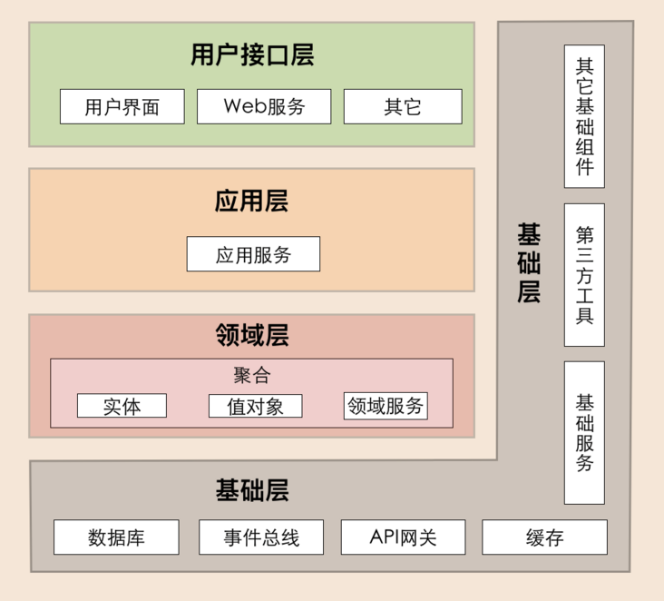
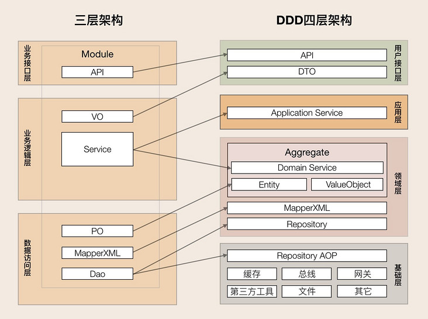
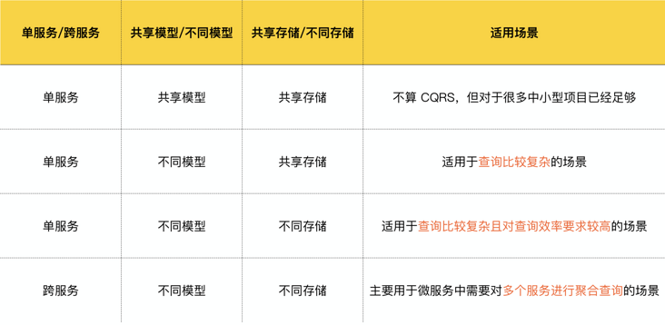
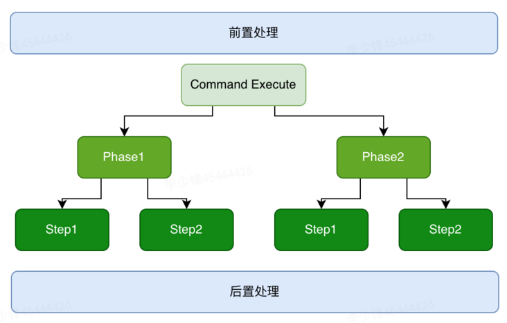
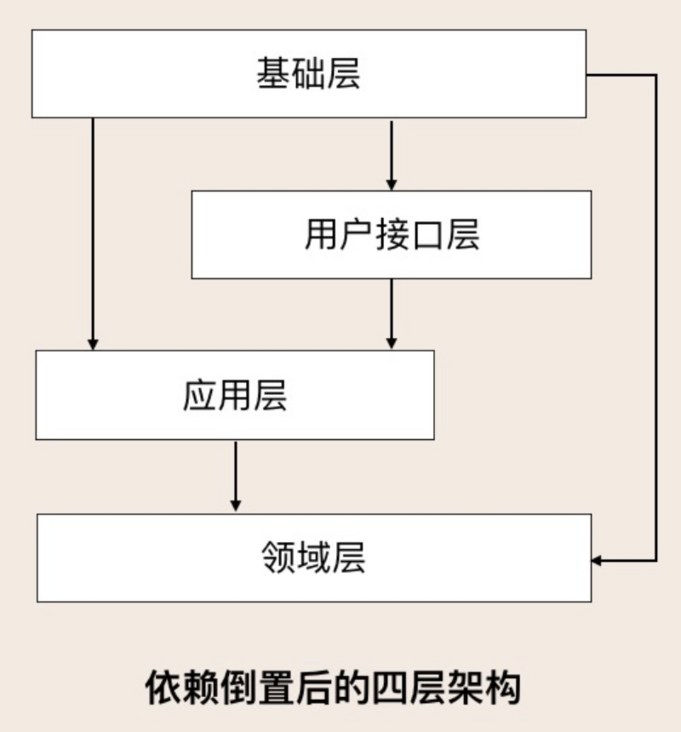
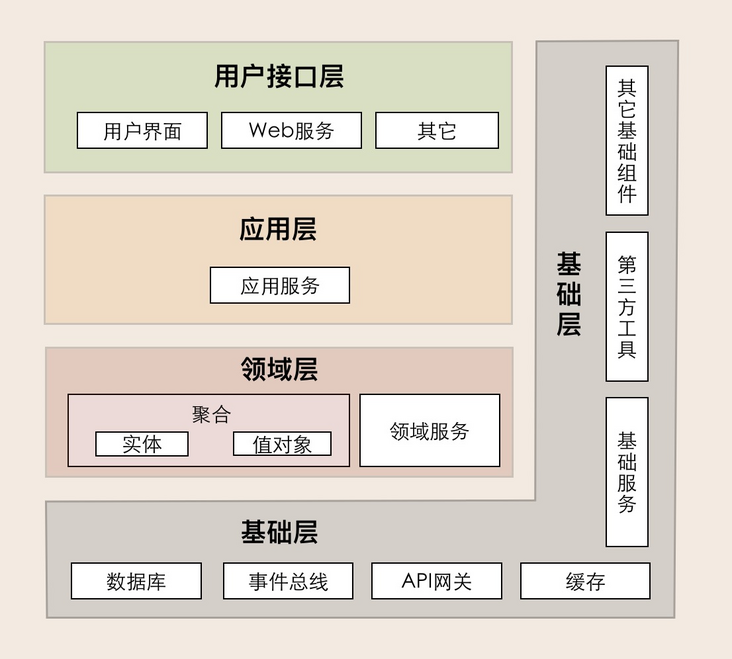
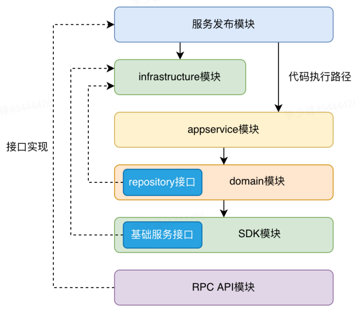
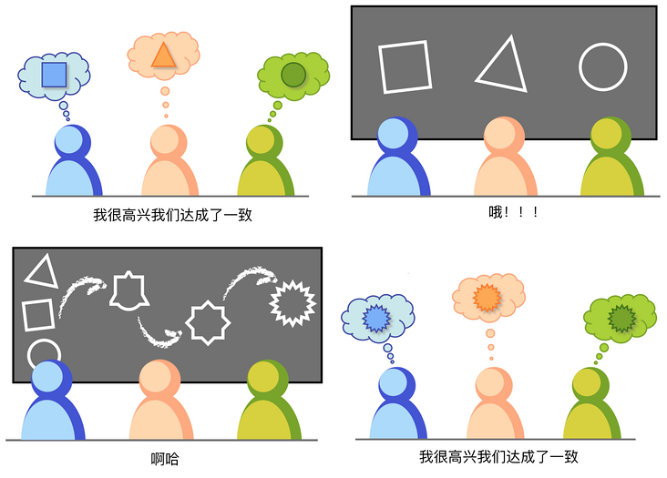
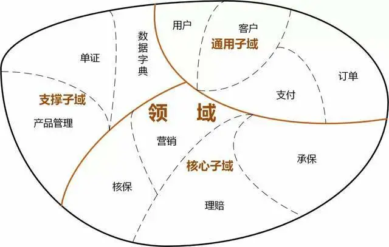

# [从MVC到DDD的架构演进](https://segmentfault.com/a/1190000041409973)

DDD这几年越来越火，资料也很多，大部分的资料都偏向于理论介绍，有给出的代码与传统MVC的三层架构差异较大，再加上大量的新概念很容易让初学者望而却步。本文从MVC架构角度来讲解如何演进到DDD架构。

### 从DDD的角度看MVC架构的问题

代码角度：

- 瘦实体模型：只起到数据类的作用，业务逻辑散落到service，可维护性越来越差；
- 面向数据库表编程，而非模型编程；
- 实体类之间的关系是复杂的网状结构，成为大泥球，牵一发而动全身，导致不敢轻易改代码；
- service类承接的所有的业务逻辑，越来越臃肿，很容易出现几千行的service类；
- 对外接口直接暴露实体模型，导致不必要开放内部逻辑对外暴露，就算有DTO类一般也是实体类的直接copy；
- 外部依赖层直接从service层调用，字段转换、异常处理大量充斥在service方法中；

项目管理角度：

- 交付效率：越来越低；
- 稳定性差：不好测试，代码改动的影响范围不好预估；
- 理解成本高：新成员介入成本高，长期会导致模块只有一个人最熟悉，离职成本很大；

### 第一层：初出茅庐

以上的问题越来越严重，很多人开始把眼光转向DDD，于是埋头啃了几本大部头的书，对以下概念有了基本的了解：

- 统一语言
- 限界上下文
- 领域、子域、支撑域
- 聚合、实体、值对象
- 分层：用户接口层、应用层、领域层、基础层

于是把MVC架构进行了改造，演进成DDD的分层架构。

DDD分层架构：



MVC架构到DDD分层架构的映射：



至此，算了基本入门了DDD架构，扩展性也得到了一定的提升。不过随着业务的发展，不断冒出新的问题：

- 一段业务逻辑代码，到底应该放到应用层还是领域层？
- 领域服务当成原来的MVC中的service层，随着业务不断发展，类也在不断膨胀，好像还是老样子啊？
- 聚合包含多个实体类，这个接口用不到这么多实体，为了性能还是直接写个SQL返回必要的操作吧，不过这样貌似又回到了MVC模式
- 既然实体类可以包含业务逻辑、领域服务也可以放业务逻辑，那到底放哪里？
- 资料上说领域层不能有外部依赖，要做到100%单测覆盖，可是我的领域服务中需要用到外部接口、中央缓存等等，那这不就有了外部依赖了吗？

### 第二层：草船借箭（战术设计）

带着问题不断学习他人经验，并不断的尝试，逐渐get到以下技能：

#### 1、领域层

领域（domain）是个模块，包含以下组成部分，传统的service按功能可能拆分到任何一个地方，各司其职。

- 1个聚合
- 1到多个实体
- 若干值对象
- 多个DomainService
- 1个Factory：新建聚合
- 1个Repository：聚合仓储服务

##### 聚合根（AggregateRoot）

聚合本身也是一个实体，聚合可以包含其他实体，其他实体不能脱离聚合而单独提供服务，比如一篇文章下的评论，评论必须从属于文章，没有文章也就没有评论。仓库层（repository）也必须是以聚合为核心提供服务的；

实体：可以理解为一张数据库表，必须有主键；

值对象：没有主键，依附于实体而存在，比如用户实体下住址对象，一般在数据库中已json字符串的形式存在；最常见的值对象是枚举；

##### 仓库服务（repository）

资源库是聚合的仓储机制，外部世界通过资源库，而且只能通过资源库来完成对聚合的访问。资源库以聚合的整体管理对象。因此，一个聚合只能有一个资源库对象，那就是以聚合根命名的资源库。除此之外的其他对象，都不应该提供资源库对象。仓储服务的实现一般有Spring Data JPA、Mybatis两种方式。

如果是用Spring Data JPA实现，直接使用JPA注解@OneToOne、@OneToMany，配合fetch配置，即可一个方法查询出所有的关联实体。

如果是用Mybatis实现，那么repository需要加入多个mapper的引用，再手动做拼装。

这里有一个经典的Hibernate笛卡尔积问题，答案是在聚合根中，一般不会加在大量的关联实体对象。如果确实需要查询关联对象而关联对象又比较多怎么办呢？在DDD中有一个CQRS(Command-Query Responsibility Segregation)模式，是一种读写分离模式，在此场景中需要将查询操作放到查询命令中分页查询。

当然CQRS也是一个很复杂模式，不应照搬他人方案，而是根据自己的业务场景选择适合自己的方案，以下列举了CQRS的几种应用模式：



##### 工厂服务（factory）

作用是创建聚合，只传入必要的参数，工厂服务内部隐藏复杂的创建逻辑。简单的聚合可以直接通过new、静态方法等创建，不是必须由factory创建。

##### 领域服务

单个实体对象能处理的逻辑放到实体里，多个实体或有交互的场景放到领域服务里。

领域服务可不可以调用仓储层或外部接口？ 可以，但不能直接和领域服务代码放一起，领域服务模块存放API，实现放基础层（infrastructure）。

领域服务对象不建议直接以聚合名+DomainService命名，而要以操作命令关联，比如用户保存服务命名为：UserSaveService, 审核服务：UserAuditSerivce。

#### 2、应用层

应用层通过应用服务接口来暴露系统的全部功能。在应用服务的实现中，它负责**编排和转发**，它将要实现的功能委托给一个或多个领域对象来实现，它本身只负责处理业务用例的执行顺序以及结果的拼装。通过这样一种方式，它隐藏了领域层的复杂性及其内部实现机制。

比如下订单服务的方法：

```reasonml
public void submitOrder(Long orderId) {
    Order order = OrderFetchService.fetchById(orderId);   //获取订单对象
    OrderCheckSerivce.check(order);    //验证订单是否有效
    OrderSubmitSerivce.submit(order);  //提交订单
    ShoppingCartClearService.clear(order);  //移除购物车中已购商品
    NotifySerivce.emailNotify(order.getUser());  //发送邮件通知买家
}
```

对于复杂的业务来说，应用层也有几种模式：

- 编排服务：最典型比如Drools；
- Command、Query命令模式；
- 业务按Rhase、Step逐层拆分模式；



#### 3、Maven模块划分

基础层是比较简单一层，不过这里还有个比较疑惑的问题：按照DDD的四层架构图去划分Maven模块，基础层是最上的一层，但是基础层也要包含基础组件供其他层使用，这时基础层应该是放到最下层，直接按照这样构建Maven模块会造成循环依赖。



相比来说，另一个架构图更准确一些，不过依然没有直观体现Maven模块如何划分。



我的最佳实践是将基础层拆分两部分，一部分是基础的组件+仓储API，一部分是实现，maven模块划分图如下所示：



### 第三层：运筹帷幄（战略设计）

经过以上的两层的磨炼，恭喜你把DDD战术都学习完了，应付日常的代码开发也够了，不过作为架构师来说，探索的道路还不能止步于此，接下来会DDD战略部分。战略部分关注点有3个：

- 统一语言
- 领域
- 限界上下文

##### 1、统一语言

统一语言的重要性可以根据Jeff Patton 在《用户故事地图》中给出的一副漫画来直观的描述：



统一语言是提炼领域知识的输出结果，也是进行后续需求迭代及重构的基础，统一语言的建立有以下几个要点：

- 统一语言必须以文档的形式提供出来，并且在整个项目组的各团队达成共识；
- 统一语言必须每个中文名有对应的英文名，并且在整个技术栈保持一致；
- 统一语言必须是完整的，包含以下要素：
  1. 领域模型的概念与逻辑；
  2. 界限上下文（Bounded Context）；
  3. 系统隐喻；
  4. 职责的分层；
  5. 模式（patterns）与惯用法。

##### 2、领域划分

以事件风暴的形式（Event Storming），列出所有的用户故事（Use Story），用户故事可通过**6W模型**来构建，即描写场景的 **W**ho、**W**hat、**W**hy、**W**here、**W**hen 与 ho**W** 六个要素。然后圈选功能相近的部分，就形成了领域，领域又根据职能不同划分为：核心域、支撑域、通用域，

具体的过程有很多参考资料，这里不再细讲，最终的输出是领域划分图，以下是一个保险业务示例：



##### 3、限界上下文

限界上下文包含两部分：上下文（Context）是业务目标，限界（Bounded）则是保护和隔离上下文的边界。

比如上图中的实现部分即是限界上下文的边界，虚线部分代表了领域的边界。限界上下文没有统一的划分标准，需要的读者根据自己的业务场景来甄别如何划分。

一个上下文中包含了相同的领域知识，角色在上下文中完成动作目标；

边界体现在以下几方面：

- **领域逻辑层**：确定了领域模型的业务边界，维护了模型的完整性与一致性，从而降低系统的业务复杂度；
- **团队合作层**：限界上下文一般也是用户换分团队的依据；
- **技术实现层**：限界上下文可当成是微服务的划分边界；

### DDD的不足

DDD架构作为一套先进的方法论，在很多场景能发挥很大价值，但是DDD也不是银弹。高级的架构师把DDD架构当成一种工具，结合其他架构经验一起为业务服务。

DDD的不足有几个方面：

1. 性能：DDD是基于聚合来组织代码，对于高性能场景下，加载聚合中大量的无用字段会严重影响性能，比如报表场景中，直接写SQL会更简单直接；
2. 事务：DDD中的事务被限定在限界上下文中，跨多个限界上下文的场景需要开发者额外考虑分布式事务问题；
3. 难度系数高，推广成本大：DDD项目需要领域专家专家，且需要特别熟悉业务、建模、OOP，对于管理者来说评估一个人是否真的能胜任也是一件困难的事情；

### 总结

本文从MVC架构开始讲述了如何从演进到DDD架构，限于篇幅很多DDD的知识点没有讲到，希望大家在实践过程中能灵活运用，尽享DDD给业务带来的价值。本文如有不足之处敬请反馈。

本文链接：[从MVC到DDD的架构演进](https://link.segmentfault.com/?enc=S%2BAA7sxpWB28wp5LpAlTYw%3D%3D.2wzvGBhr81UJidOi%2BhWR89%2FbpJ5ci652cDlTPKaxd48lcOmS%2BMmtwQNGkCcw%2F8YLFCNdXWNjI1TsTqXG33rW3Q%3D%3D)

作者简介：木小丰，美团Java技术专家，专注分享软件研发实践、架构思考。欢迎关注公共号：**Java研发**