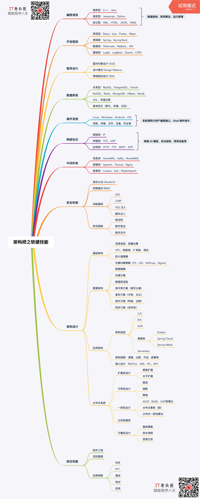

# [从程序员到架构师的技能图谱](https://segmentfault.com/a/1190000021967209)

最近，老兵哥在构思从程序员到架构师的成长系列分享，梳理了从事架构工作需要熟悉或精通的软硬技能，现发布出来邀请各位小伙伴一起来探讨，后续我还会继续完善补充：

## 编程语言

- 强类型：C++、Java
- 弱类型：Javascript、Python
- 标记型：XML、HTML、JSON、YAML

## 开发框架

- 表现层：React、Vue、Flutter、Weex
- 领域层：Spring、Spring Boot
- 数据层：Hibernate、MyBatis、JPA
- 基础层：Log4j、LogBack、Quartz、C3P0

## 程序设计

- 面向对象设计 OOD
- 设计模式 Design Patterns
- 领域驱动设计 DDD

## 数据库类

- 关系型：MySQL、PostgreSQL、Oracle
- NoSQL：Redis、MongoDB、HBase、Neo4j
- SQL、存储过程
- 查询优化（索引、存储、分区）

## 操作系统

- Linux、Windows、Android、iOS
- 进程、存储、文件、设备、作业等

## 网络协议

- 网络层：IP
- 传输层：TCP、UDP
- 应用层：HTTP、FTP、SMTP、NTP

## 中间件类

- 消息类：ActiveMQ、Kafka、RocketMQ
- 容器类：Apache、Tomcat、Nginx
- 检索类：Lucene、Solr、ElasticSearch

## 安全机制

- 身份认证 OAuth2.0
- 权限鉴权 RBAC
- 风险漏洞：XSS、CSRF、SQL 注入、脚本注入
- 防范措施：验证码、数字签名、数字证书

## 基础架构

- 资源选型，容量估算：VPC、网络域、IP 网段、域名
- 防火墙策略
- 负载均衡策略：F5、LVS、HAProxy、Nginx

## 数据架构

- 数据建模
- 存储方案
- 数据库选型
- 高可用方案（读写分离）
- 备份方案（冷热、主从）
- 容灾方案（同城、远程）
- 同步方案（实时性）

## 应用架构

- 架构选型：C/S、B/S、SOA、微服务（Dubbo Spring Cloud Service MeshServerless
- 架构视图：逻辑、过程、开发、部署等
- 接口设计：RESTful、JMS、IPC、RPC

## 分布式系统

- 扩展性设计：垂直扩展、水平扩展
- 可用性设计：限流、熔断、降级
- 一致性设计：ACID、BASE、CAP等理论、分布式事务（锁）、分布式一致性算法
  - 分区容错性
  - 可靠性设计：服务隔离、异步调用、资源冗余

## 综合技能

- 软件工程
- 项目管理
- 自我销售：写作、PPT、演讲、培训、咨询

架构师，是我们程序员打怪升级的主要方向，它不像某单项技能报个培训班就能获得，胜任架构工作需要慢慢积累许多技能，既有硬技能还有软技能。一口吃不成胖子。从程序员到架构师也无法一蹴而就，它是一个循序渐进、稳步提升的进阶过程，每个阶段都有每个阶段要掌握的技能，多项技能之间还存在先后顺序。如果你想往架构师转型升级，那你可以在日常工作中有意识地储备这些技能。

坚持原创不易，如果你觉得有价值，麻烦动动手指点个 「**赞**」或 **转发** 给更多小伙伴，老兵哥会更有动力坚持。另外，我还会持续分享职业规划、应聘面试、技能提升、影响力打造等经验，**关注** 「 **IT老兵哥** 」，赋能程序人生！