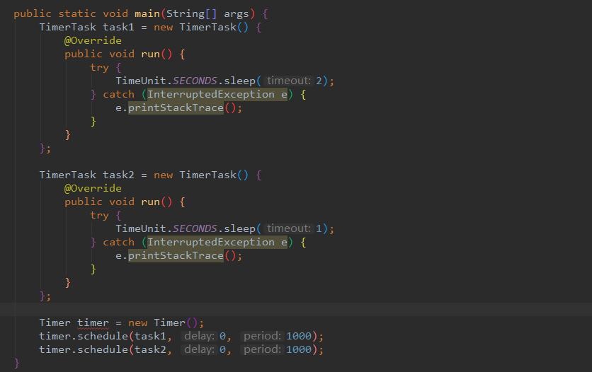

# [分布式定时任务调度框架实践](https://my.oschina.net/vivotech/blog/3190348)

分布式任务调度框架几乎是每个大型应用必备的工具，本文介绍了任务调度框架使用的需求背景和痛点，对业界普遍使用的开源分布式任务调度框架的使用进行了探究实践，并分析了这几种框架的优劣势和对自身业务的思考。


## 一、业务背景


### **1.1 为什么需要使用定时任务调度**

**（1）时间驱动处理场景：**整点发送优惠券，每天更新收益，每天刷新标签数据和人群数据。

**（2）批量处理数据：**按月批量统计报表数据，批量更新短信状态，实时性要求不高。

**（3）异步执行解耦：**活动状态刷新，异步执行离线查询，与内部逻辑解耦。


### **1.2 使用需求和痛点**

（1）任务执行监控告警能力。

（2）任务可灵活动态配置，无需重启。

（3）业务透明，低耦合，配置精简，开发方便。

（4）易测试。

（5）高可用，无单点故障。

（6）任务不可重复执行，防止逻辑异常。

（7）大任务的分发并行处理能力。


## 二、开源框架实践与探索


###  **2.1 Java 原生 Timer 和ScheduledExecutorService**


#### 2.1.1 Timer使用



 

Timer缺陷：

1. Timer底层是使用单线程来处理多个Timer任务，这意味着所有任务实际上都是串行执行，前一个任务的延迟会影响到之后的任务的执行。
2. 由于单线程的缘故，一旦某个定时任务在运行时，产生未处理的异常，那么不仅当前这个线程会停止，所有的定时任务都会停止。
3. Timer任务执行是依赖于系统绝对时间，系统时间变化会导致执行计划的变更。

由于上述缺陷，尽量不要使用Timer， idea中也会明确提示，使用ScheduledThreadPoolExecutor替代Timer 。


#### 2.1.2 ScheduledExecutorService使用

ScheduledExecutorService对于Timer的缺陷进行了修补，首先ScheduledExecutorService内部实现是ScheduledThreadPool线程池，可以支持多个任务并发执行。

对于某一个线程执行的任务出现异常，也会处理，不会影响其他线程任务的执行，另外ScheduledExecutorService是基于时间间隔的延迟，执行不会由于系统时间的改变发生变化。

当然，ScheduledExecutorService也有自己的局限性：只能根据任务的延迟来进行调度，无法满足基于绝对时间和日历调度的需求。


### **2.2 Spring Task**


#### 2.2.1 Spring Task 使用

spring task 是spring自主开发的轻量级定时任务框架，不需要依赖其他额外的包，配置较为简单。

此处使用注解配置


#### 2.2.2 Spring Task缺陷

Spring Task 本身不支持持久化，也没有推出官方的分布式集群模式，只能靠开发者在业务应用中自己手动扩展实现，无法满足可视化，易配置的需求。


### **2.3 永远经典的 Quartz**


#### 2.3.1 基本介绍

Quartz框架是Java领域最著名的开源任务调度工具，也是目前事实上的定时任务标准，几乎全部的开源定时任务框架都是基于Quartz核心调度构建而成。


#### 2.3.2 原理解析

核心组件和架构


 关键概念

（1）**Scheduler**：任务调度器，是执行任务调度的控制器。本质上是一个计划调度容器，注册了全部Trigger和对应的JobDetail， 使用线程池作为任务运行的基础组件，提高任务执行效率。

（2）**Trigger**：触发器，用于定义任务调度的时间规则，告诉任务调度器什么时候触发任务，其中CronTrigger是基于cron表达式构建的功能强大的触发器。

（3）**Calendar**：日历特定时间点的集合。一个trigger可以包含多个Calendar，可用于排除或包含某些时间点。

（4）**JobDetail**：是一个可执行的工作，用来描述Job实现类及其它相关的静态信息，如Job的名称、监听器等相关信息。 

（5）**Job**：任务执行接口，只有一个execute方法，用于执行真正的业务逻辑。

（6）**JobStore**：任务存储方式，主要有RAMJobStore和JDBCJobStore，RAMJobStore是存储在JVM的内存中，有丢失和数量受限的风险，JDBCJobStore是将任务信息持久化到数据库中，支持集群。


#### 2.3.3 实践说明

（1）关于Quartz的基本使用

- 可参考Quartz官方文档和网上博客实践教程。

（2）业务使用要满足动态修改和重启不丢失， 一般需要使用数据库进行保存。

- Quartz本身支持JDBCJobStore，但是其配置的数据表比较多，官方推荐配置可参照官方文档，超过10张表，业务使用比较重。
- 在使用的时候只需要存在基本trigger配置和对应任务以及相关执行日志的表即可满足绝大部分需求。

（3）组件化

- 将quartz动态任务配置信息持久化到数据库，将数据操作包装成基本jar包，供项目之间使用，引用项目只需要引入jar包依赖和配置对应的数据表，使用时就可以对Quartz配置透明。

（4）扩展

- **集群模式**

  通过故障转移和负载均衡实现了任务的高可用性，通过数据库的锁机制来确保任务执行的唯一性，但是集群特性仅仅只是用来HA，节点数量的增加并不会提升单个任务的执行效率，不能实现水平扩展。

- **Quartz插件**

  可以对特定需要进行扩展，比如增加触发器和任务执行日志，任务依赖串行处理场景，可参考：[quartz插件——实现任务之间的串行调度](https://www.oschina.net/action/GoToLink?url=https%3A%2F%2Fwww.cnblogs.com%2FsurprizeFuture%2Farticles%2FquartzPlugin.html)


#### 2.3.4 缺陷和不足

（1）需要把任务信息持久化到业务数据表，和业务有耦合。

（2）调度逻辑和执行逻辑并存于同一个项目中，在机器性能固定的情况下，业务和调度之间不可避免地会相互影响。

（3）quartz集群模式下，是通过数据库独占锁来唯一获取任务，任务执行并没有实现完善的负载均衡机制。


### **2.4 轻量级神器 XXL-JOB**


#### 2.4.1 基本介绍

XXL-JOB是一个轻量级分布式任务调度平台，主打特点是平台化，易部署，开发迅速、学习简单、轻量级、易扩展，代码仍在持续更新中。

 “调度中心”是任务调度控制台，平台自身并不承担业务逻辑，只是负责任务的统一管理和调度执行，并且提供任务管理平台， “执行器” 负责接收“调度中心”的调度并执行，可直接部署执行器，也可以将执行器集成到现有业务项目中。 通过将任务的调度控制和任务的执行解耦，业务使用只需要关注业务逻辑的开发。

主要提供了任务的动态配置管理、任务监控和统计报表以及调度日志几大功能模块，支持多种运行模式和路由策略，可基于对应执行器机器集群数量进行简单分片数据处理。


#### 2.4.2 原理解析

2.1.0版本前核心调度模块都是基于quartz框架，2.1.0版本开始自研调度组件，移除quartz依赖 ，使用时间轮调度。


 


#### 2.4.3 实践说明

详细配置和介绍参考[官方文档](https://www.oschina.net/action/GoToLink?url=http%3A%2F%2Fwww.xuxueli.com%2Fxxl-job%2F%23%2F%3Fid%3D%e3%80%8a%e5%88%86%e5%b8%83%e5%bc%8f%e4%bb%bb%e5%8a%a1%e8%b0%83%e5%ba%a6%e5%b9%b3%e5%8f%b0xxl-job%e3%80%8b)。


####  2.4.3.1 demo使用：

示例1：实现简单任务配置，只需要继承IJobHandler 抽象类，并声明注解 

@JobHandler(value="offlineTaskJobHandler") ，实现业务逻辑即可。（注：此次引入了dubbo，后文介绍）。

```java
@JobHandler(value="offlineTaskJobHandler")
@Component
public class OfflineTaskJobHandler extends IJobHandler {
  
   @Reference(check = false,version = "cms-dev",group="cms-service")
   private OfflineTaskExecutorFacade offlineTaskExecutorFacade;
  
   @Override
   public ReturnT<String> execute(String param) throws Exception {
      XxlJobLogger.log(" offlineTaskJobHandler start.");
  
      try {
         offlineTaskExecutorFacade.executeOfflineTask();
      } catch (Exception e) {
         XxlJobLogger.log("offlineTaskJobHandler-->exception." , e);
         return FAIL;
      }
  
      XxlJobLogger.log("XXL-JOB, offlineTaskJobHandler end.");
      return SUCCESS;
   }
}
```

 示例2：分片广播任务。

```java
@JobHandler(value="shardingJobHandler")
@Service
public class ShardingJobHandler extends IJobHandler {
  
   @Override
   public ReturnT<String> execute(String param) throws Exception {
  
      // 分片参数
      ShardingUtil.ShardingVO shardingVO = ShardingUtil.getShardingVo();
      XxlJobLogger.log("分片参数：当前分片序号 = {}, 总分片数 = {}", shardingVO.getIndex(), shardingVO.getTotal());
  
      // 业务逻辑
      for (int i = 0; i < shardingVO.getTotal(); i++) {
         if (i == shardingVO.getIndex()) {
            XxlJobLogger.log("第 {} 片, 命中分片开始处理", i);
         } else {
            XxlJobLogger.log("第 {} 片, 忽略", i);
         }
      }
  
      return SUCCESS;
   }
}
```


####  2.4.3.2 整合dubbo 

（1）引入dubbo-spring-boot-starter和业务facade jar包依赖。

```java
<dependency>
    <groupId>com.alibaba.spring.boot</groupId>
    <artifactId>dubbo-spring-boot-starter</artifactId>
    <version>2.0.0</version>
</dependency>
  
<dependency>
    <groupId>com.demo.service</groupId>
    <artifactId>xxx-facade</artifactId>
    <version>1.9-SNAPSHOT</version>
</dependency>
```

（2）配置文件加入dubbo消费端配置（可根据环境定义多个配置文件，通过profile切换）。

```java
## Dubbo 服务消费者配置
spring.dubbo.application.name=xxl-job
  
spring.dubbo.registry.address=zookeeper://zookeeper.xyz:2183
spring.dubbo.port=20880
  
spring.dubbo.version=demo
spring.dubbo.group=demo-service
```

（3）代码中通过@Reference注入facade接口即可。

```java
@Reference(check = false,version = "demo",group="demo-service")
private OfflineTaskExecutorFacade offlineTaskExecutorFacade;
```

（4）启动程序加入@EnableDubboConfiguration注解。

```java
@SpringBootApplication
@EnableDubboConfiguration
public class XxlJobExecutorApplication {
   public static void main(String[] args) {
        SpringApplication.run(XxlJobExecutorApplication.class, args);
   }
}
```


#### 2.4.4 任务可视化配置 

内置了平台项目，方便了开发者对任务的管理和执行日志的监控，并提供了一些便于测试的功能。


 


#### 2.4.5 扩展 

（1）任务监控和报表的优化。

（2）任务报警方式的扩展，比如加入告警中心，提供内部消息，短信告警。

（3）对实际业务内部执行出现异常情况下的不同监控告警和重试策略。


### **2.5 高可用 Elastic-Job**


#### 2.5.1 基本介绍

Elastic-Job是一个分布式调度解决方案，由两个相互独立的子项目Elastic-Job-Lite和Elastic-Job-Cloud组成。

Elastic-Job-Lite定位为轻量级无中心化解决方案，使用jar包的形式提供分布式任务的协调服务。

Elastic-Job-Cloud使用Mesos + Docker的解决方案，额外提供资源治理、应用分发以及进程隔离等服务。

可惜的是已经两年没有迭代更新记录。  


#### 2.5.2 原理解析

 


 


#### 2.5.3 实践说明

**2.5.3.1 demo使用**

（1）安装zookeeper，配置注册中心config，配置文件加入注册中心zk的配置。

```java
@Configuration
@ConditionalOnExpression("'${regCenter.serverList}'.length() > 0")
public class JobRegistryCenterConfig {
  
    @Bean(initMethod = "init")
    public ZookeeperRegistryCenter regCenter(@Value("${regCenter.serverList}") final String serverList,
                                             @Value("${regCenter.namespace}") final String namespace) {
        return new ZookeeperRegistryCenter(new ZookeeperConfiguration(serverList, namespace));
    }
}
```


```java
spring.application.name=demo_elasticjob
  
regCenter.serverList=localhost:2181
regCenter.namespace=demo_elasticjob
  
spring.datasource.url=jdbc:mysql://127.0.0.1:3306/xxl-job?Unicode=true&characterEncoding=UTF-8
spring.datasource.username=user
spring.datasource.password=pwd
```

（2）配置数据源config，并配置文件中加入数据源配置。

```java
@Getter
@Setter
@NoArgsConstructor
@AllArgsConstructor
@ToString
@Configuration
@ConfigurationProperties(prefix = "spring.datasource")
public class DataSourceProperties {
    private String url;
    private String username;
    private String password;
  
    @Bean
    @Primary
    public DataSource getDataSource() {
        DruidDataSource dataSource = new DruidDataSource();
        dataSource.setUrl(url);
        dataSource.setUsername(username);
        dataSource.setPassword(password);
        return dataSource;
    }
}
```


```java
spring.datasource.url=jdbc:mysql://127.0.0.1:3306/xxl-job?Unicode=true&characterEncoding=UTF-8
spring.datasource.username=user
spring.datasource.password=pwd
```

（3）配置事件config。

```java
@Configuration
public class JobEventConfig {
    @Autowired
    private DataSource dataSource;
  
    @Bean
    public JobEventConfiguration jobEventConfiguration() {
        return new JobEventRdbConfiguration(dataSource);
    }
}
```

（4）为了便于灵活配置不同的任务触发事件，加入ElasticSimpleJob注解。

```java
@Target({ElementType.TYPE})
@Retention(RetentionPolicy.RUNTIME)
public @interface ElasticSimpleJob {
  
    @AliasFor("cron")
    String value() default "";
  
    @AliasFor("value")
    String cron() default "";
  
    String jobName() default "";
  
    int shardingTotalCount() default 1;
  
    String shardingItemParameters() default "";
  
    String jobParameter() default "";
}
```

（5）对配置进行初始化。

```java
@Configuration
@ConditionalOnExpression("'${elaticjob.zookeeper.server-lists}'.length() > 0")
public class ElasticJobAutoConfiguration {
  
    @Value("${regCenter.serverList}")
    private String serverList;
  
    @Value("${regCenter.namespace}")
    private String namespace;
  
    @Autowired
    private ApplicationContext applicationContext;
    @Autowired
    private DataSource dataSource;
  
    @PostConstruct
    public void initElasticJob() {
        ZookeeperRegistryCenter regCenter = new ZookeeperRegistryCenter(new ZookeeperConfiguration(serverList, namespace));
        regCenter.init();
        Map<String, SimpleJob> map = applicationContext.getBeansOfType(SimpleJob.class);
  
        for (Map.Entry<String, SimpleJob> entry : map.entrySet()) {
            SimpleJob simpleJob = entry.getValue();
            ElasticSimpleJob elasticSimpleJobAnnotation = simpleJob.getClass().getAnnotation(ElasticSimpleJob.class);
  
            String cron = StringUtils.defaultIfBlank(elasticSimpleJobAnnotation.cron(), elasticSimpleJobAnnotation.value());
            SimpleJobConfiguration simpleJobConfiguration = new SimpleJobConfiguration(JobCoreConfiguration.newBuilder(simpleJob.getClass().getName(), cron, elasticSimpleJobAnnotation.shardingTotalCount()).shardingItemParameters(elasticSimpleJobAnnotation.shardingItemParameters()).build(), simpleJob.getClass().getCanonicalName());
            LiteJobConfiguration liteJobConfiguration = LiteJobConfiguration.newBuilder(simpleJobConfiguration).overwrite(true).build();
  
            JobEventRdbConfiguration jobEventRdbConfiguration = new JobEventRdbConfiguration(dataSource);
            SpringJobScheduler jobScheduler = new SpringJobScheduler(simpleJob, regCenter, liteJobConfiguration, jobEventRdbConfiguration);
            jobScheduler.init();
        }
    }
}
```

（6）实现 SimpleJob接口，按上文中方法整合dubbo, 完成业务逻辑。

```java
@ElasticSimpleJob(
        cron = "*/10 * * * * ?",
        jobName = "OfflineTaskJob",
        shardingTotalCount = 2,
        jobParameter = "测试参数",
        shardingItemParameters = "0=A,1=B")
@Component
public class MySimpleJob implements SimpleJob {
    Logger logger = LoggerFactory.getLogger(OfflineTaskJob.class);
  
    @Reference(check = false, version = "cms-dev", group = "cms-service")
    private OfflineTaskExecutorFacade offlineTaskExecutorFacade;
  
  
    @Override
    public void execute(ShardingContext shardingContext) {
  
        offlineTaskExecutorFacade.executeOfflineTask();
  
        logger.info(String.format("Thread ID: %s, 作业分片总数: %s, " +
                        "当前分片项: %s.当前参数: %s," +
                        "作业名称: %s.作业自定义参数: %s"
                ,
                Thread.currentThread().getId(),
                shardingContext.getShardingTotalCount(),
                shardingContext.getShardingItem(),
                shardingContext.getShardingParameter(),
                shardingContext.getJobName(),
                shardingContext.getJobParameter()
        ));
    }
}
```


 


### **2.6 其余开源框架**

（1）**Saturn**：Saturn是唯品会开源的一个分布式任务调度平台，在Elastic Job的基础上进行了改造。

（2）**SIA-TASK**：是宜信开源的分布式任务调度平台。


## 三、优劣势对比和业务场景适配思考


业务思考：

1. 丰富任务监控数据和告警策略。
2. 接入统一登录和权限控制。
3. 进一步简化业务接入步骤。


## 四、结语

对于并发场景不是特别高的系统来说，xxl-job配置部署简单易用，不需要引入多余的组件，同时提供了可视化的控制台，使用起来非常友好，是一个比较好的选择。希望直接利用开源分布式框架能力的系统，建议根据自身的情况来进行合适的选型。


## 附：参考文献

- [quartz插件——实现任务之间的串行调度](https://www.oschina.net/action/GoToLink?url=https%3A%2F%2Fwww.cnblogs.com%2FsurprizeFuture%2Farticles%2FquartzPlugin.html)

更多内容敬请关注 **vivo 互联网技术** 微信公众号