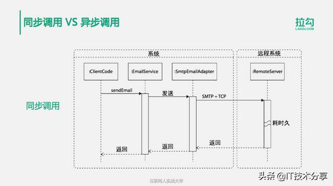
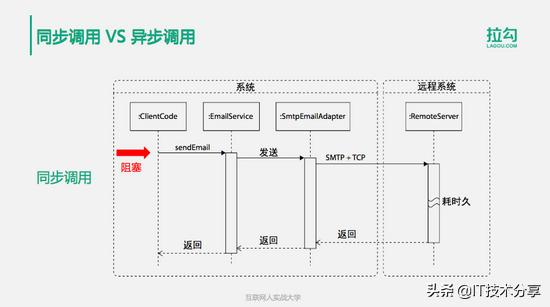
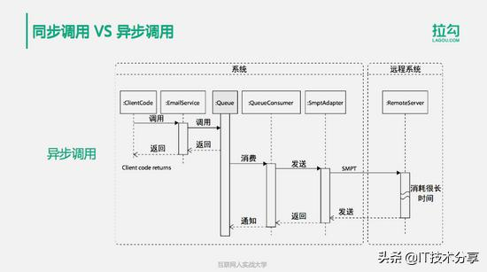
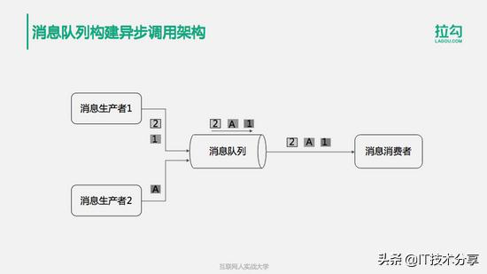
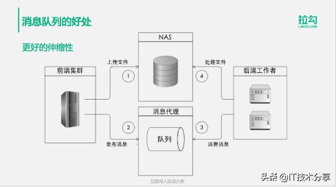
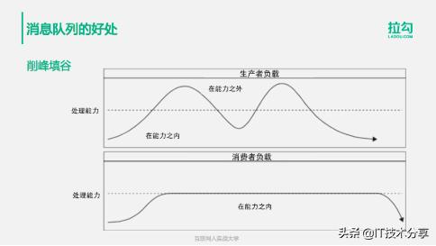

# 分布式消息队列详解：10分钟搞懂同步和异步架构等问题

IT技术分享 2019-06-07 21:06:20

分布式消息队列是是大型分布式系统不可缺少的中间件，主要解决应用耦合、异步消息、流量削锋等问题。实现高性能、高可用、可伸缩和最终一致性架构。

对于一个架构师来说，在大型系统设计中，会经常需要面对同步和异步等架构问题，搞明白这些问题，能更好地实现程序并行执行，减少等待或无效操作，以及充分利用计算机的性能！

```
1.同步架构和异步架构的区别
2.异步架构的主要组成部分：消息生产者、消息消费者、分布式消息队列
3.异步架构的两种主要模型：点对点模型和发布订阅模型。
4.消息队列的好处
5.消息队列相关产品
```

建议用10min通读，搞懂分布式消息队列的核心内容。

## 一、同步架构和异步架构的区别

### 1.同步调用

是指从请求的发起一直到最终的处理完成期间，请求的调用方一直在同步阻塞等待调用的处理完成。



如图，在这个例子中客户端代码ClientCode，需要执行发送邮件sendEmail这样一个操作，它会调用EmailService进行发送，而EmailService会调用SmtpEmailAdapter这样一个类来进行处理，而这个类会调用远程的一个服务，通过SMTP和TCP协议把请求发送给它。

而远程服务器收到消息以后会对消息进行一系列的操作，然后将邮件发送出去，再进行返回。Adapter收到返回后，再返回给EmailService，EmailService收到返回后再把返回结果返回给Clientcode。



ClientCode在sendEmail发出请求后，就一直都阻塞在这里，等待最终调用结果的返回，是成功还是失败。因为这个过程是阻塞等待的，所以这个过程也就是同步调用。

### 2.异步调用

是指在请求发起的处理过程中，客户端的代码已经返回了，它可以继续进行自己的后续操作，而不需要等待调用处理完成，这就叫做异步调用。



异步调用过程，同样看刚刚发送邮件的例子，用户Clientcode调用EmailService以后，EmailService会把这个调用请求发送给消息队列，然后就立即返回了。Clientcode收到返回以后继续向下处理，不会继续阻塞等待。实际上消息发送到Queue后，还没有被处理，我们看到后面的消息消费，其实要比EmailService返回可能还要晚一点，EmailService返回以后消息才会被消费处理。

有一个QueueConsumer消息队列的消费者，从消息队列中取出这个消息，再把这个消息发送给SmtpAdapter，也就是调用SmtpAdapter，处理逻辑跟同步调用一样，SmtpAdapter通过SMTP的通讯协议，把消息发送给远程的一个服务器，进行邮件发送，通过RemoteServer进行处理，处理完了收到返回，再把返回结果通知消息队列Queue。

在这个过程中，客户端的调用，也就是应用程序的调用，和业务逻辑真正发送邮件的操作是不同步的。

## 二、异步架构的主要组成部分

使用异步调用架构的主要手段，就是通过消息队列构建，如下是它的架构图。



消息的生产者将消息发送到消息队列以后，由消息的消费者从消息队列中获取消息，然后进行业务逻辑的处理，消息的生产者和消费者是异步处理的，彼此不会等待阻塞，所以叫做异步架构。

使用消息队列构建一个异步调用架构，你需要了解如下3种角色。

### **1.消息的生产者**

是客户端应用程序代码的一部分，用来初始化异步调用处理流程。在基于消息队列的处理中，生产者的职责非常少，它要做的就是创建一个合法的消息，并把这个消息发送到消息队列中，由应用开发者决定生产者的代码在哪里执行，什么时候发送消息。

### **2.消息队列**

消息队列是消息发送的目的地和发给消费者的一个缓冲。消息队列实现的方法有好多种，可以用共享文件夹，也可以用关系数据库或者NoSQL系统，当然最主要的还是使用专门的分布式消息队列服务器来实现。

### **3.消息的消费者**

消息的消费者从消息队列中接受并处理消息，消息的消费者也是由应用开发者实现的，但是它是一个异步处理的组件。消息的消费者不需要知道生产者存在，它只依赖消息队列中的消息。消息的消费者通常部署在独立的服务器上，和消息的生产者完全隔离，并且可以通过添加硬件的方式进行伸缩。

## 三、异步架构的两种主要模型

使用消息队列构建异步的调用架构，你还需要知道两种模型：点对点模型和发布订阅模型。

### **1.点对点模型**

消费者和生产者只需要知道消息队列的名字，生产者发送消息到消息队列中，而消息队列的另一端是多个消费者竞争消费消息，每个到达消息队列的消息只会被路由到一个消费者中去，所以消费者看到的是全部消息的一个子集。我们看这张图，消息的生产者有多个，消息的消费者也有多个，多个生产者将消息发送到消息队列中，而有多个消费者去消息队列中对消息进行竞争性的消费。每个消息只会被一个消费者消费，每个消费者只会消费消息队列中的一部分消息。

### **2.发布订阅模型**

在发布订阅模型中，消息可能被发送到不止一个消费者，生产者发送消息到一个主题，而不是队列中。消息被发布到主题后，就会被克隆给每一个订阅它的消费者，每个消费者接收一份消息复制到自己的私有队列。消费者可以独立于其他消费者使用自己订阅的消息，消费者之间不会竞争消息。常用的分布式消息队列都支持发布订阅模型，也就是说消息的发布订阅模型是分布式消息队列的一个功能特性。

### **3.两个模型的应用**

点对点模型：主要用于一些耗时较长的、逻辑相对独立的业务。

比如说我前面的讲到的发送邮件这样一个操作。因为发送邮件比较耗时，而且应用程序其实也并不太关心邮件发送是否成功，发送邮件的逻辑也相对比较独立，所以它只需要把邮件消息丢到消息队列中就可以返回了，而消费者也不需要关心是哪个生产者去发送的邮件，它只需要把邮件消息内容取出来以后进行消费，通过远程服务器将邮件发送出去就可以了。而且每个邮件只需要被发送一次。所以消息只被一个消费者消费就可以了。

发布订阅模型：如新用户注册这样一个消息，需要使用按主题发布的方式。

比如新用户注册，一个新用户注册成功以后，需要给用户发送一封激活邮件，发送一条欢迎短信，还需要将用户注册数据写入数据库，甚至需要将新用户信息发送给关联企业的系统，比如淘宝新用户信息发送给支付宝，这样允许用户可以一次注册就能登录使用多个关联产品。一个新用户注册，会把注册消息发送给一个主题，多种消费者可以订阅这个主题。比如发送邮件的消费者、发送短信的消费者、将注册信息写入数据库的消费者，跨系统同步消息的消费者等。

## **四、消息队列的好处**

### 1.实现异步处理，提升处理性能

对一些比较耗时的操作，可以把处理过程通过消息队列进行异步处理。这样做可以推迟耗时操作的处理，使耗时操作异步化，而不必阻塞客户端的程序，客户端的程序在得到处理结果之前就可以继续执行，从而提高客户端程序的处理性能。

### 2.可以让系统获得更好的伸缩性

耗时的任务可以通过分布式消息队列，向多台消费者服务器并行发送消息，然后在很多台消费者服务器上并行处理消息，也就是说可以在多台物理服务器上运行消费者。那么当负载上升的时候，可以很容易地添加更多的机器成为消费者。



如图中的例子，用户上传文件后，通过发布消息的方式，通知后端的消费者获取数据、读取文件，进行异步的文件处理操作。那么当前端发布更多文件的时候，或者处理逻辑比较复杂的时候，就可以通过添加后端的消费者服务器，提供更强大的处理能力。

### 3.可以平衡流量峰值，削峰填谷

使用消息队列，即便是访问流量持续的增长，系统依然可以持续地接收请求。这种情况下，虽然生产者发布消息的速度比消费者消费消息的速度快，但是可以持续的将消息纳入到消息队列中，用消息队列作为消息的缓冲，因此短时间内，发布者不会受到消费处理能力的影响。



从这张图可以看到，因为消息的生产者是直接面向用户请求的，而用户的请求访问压力是不均衡的。如淘宝每天的访问高峰是在上午10点左右，而新浪微博则可能在某个明星半夜发一条微博后突然出现访问高峰。

在访问高峰，用户的并发访问数可能超过了系统的处理能力，所以在高峰期就可能会导致系统负载过大，响应速度变慢，更严重的可能会导致系统崩溃。这种情况下，通过消息队列将用户请求的消息纳入到消息队列中，通过消息队列缓冲消费者处理消息的速度。

如图中所示，消息的生产者它有高峰有低谷，但是到了消费者这里，只会按照自己的最佳处理能力去消费消息。高峰期它会把消息缓冲在消息队列中，而在低谷期它也还是使用自己最大的处理能力去获取消息，将前面缓冲起来、来不及及时处理的消息处理掉。那么，通过这种手段可以实现系统负载消峰填谷，也就是说将访问的高峰消掉，而将访问的低谷填平，使系统处在一个最佳的处理状态之下，不会对系统的负载产生太大的冲击。

### 4.失败隔离和自我修复

因为发布者不直接依赖消费者，所以分布式消息队列可以将消费者系统产生的错误异常与生产者系统隔离开来，生产者不受消费者失败的影响。 当在消息消费过程中出现处理逻辑失败的时候，这个错误只会影响到消费者自身，而不会传递给消息的生产者，也就是应用程序可以按照原来的处理逻辑继续执行。

所以，这也就意味着在任何时候都可以对后端的服务器执行维护和发布操作。可以重启、添加或删除服务器，而不影响生产者的可用性，这样简化了部署和服务器管理的难度。

### 5.可以使生产者和消费者的代码实现解耦合

也就是说可以多个生产者发布消息，多个消费者处理消息，共同完成完整的业务处理逻辑，但是它们的不需要直接的交互调用，没有代码的依赖耦合。在传统的同步调用中，调用者代码必须要依赖被调用者的代码，也就是生产者代码必须要依赖消费者的处理逻辑代码，代码需要直接的耦合，而使用消息队列，这两部分的代码不需要进行任何的耦合。

耦合程度越低的代码越容易维护，也越容易进行扩展。

比如新用户注册，如果用传统同步调用的方式，那么发邮件、发短信、写数据库、通知关联系统这些代码会和用户注册代码直接耦合起来，整个代码看起来就是完成用户注册逻辑后，后面必然跟着发邮件、发短信这些代码。如果要新增一个功能，比如将监控用户注册情况，将注册信息发送到业务监控系统，就必须要修改前面的代码，至少增加一行代码，发送注册信息到监控系统，我们知道，任何代码的修改都可能会引起bug。

而使用分布式消息队列实现生产者和消费者解耦合以后，用户注册以后，不需要调用任何后续处理代码，只需要将注册消息发送到分布式消息队列就可以了。如果要增加新功能，只需要写个新功能的消费者程序，在分布式消息队列中，订阅用户注册主题就可以了，不需要修改原来任何一行代码。


这种解耦的特点对于团队的工作分工也很有帮助！从消息生产者的视角看，它只需要构建消息，将消息放入消息队列中，开发就完成了。而从消费者的开发视角看，它只需要从消息队列中获取消息，然后进行逻辑处理。它们彼此之间不进行任何耦合。消息的生产者不关心放入消息队列中下一步会发生什么，而消费者也不需要知道消息从哪里来。这两部分程序的开发者也可以不关心彼此的工作进展，他们开发的代码也不需要集成在一起，只要约定好消息格式，就可以各自开发了。

## 五、常用的消息队列产品

目前业界常用的消息队列产品，有这么几种：RabbitMQ 、ActiveMQ、RocketMQ 、Kafka

RabbitMQ 的主要特点是性能好，社区活跃，但是RabbitMQ用Erlang开发，我们的应用很少用Erlang，所以不便于二次开发和维护。

ActiveMQ 影响比较广泛，可以跨平台，使用Java开发，对Java比较友好。

RocketMQ 是阿里推出的一个开源产品，也是使用Java开发，性能比较好，可靠性也比较高。

Kafka 是LinkedIn出品的，专门针对分布式场景进行了优化，因此分布式的伸缩性会比较好。

目前看来，Kafka因为最初设计时就是针对互联网的分布式、高可用应用场景而设计，并且在大数据领域得到广泛支持，资料文档更加完善，因此在互联网企业得到更多的应用。

这里跟大家分享一个进行技术产品选型的小技巧，供你在进行技术决策的时候参考。当在几个相似的技术产品中进行选型决策，如果拿不定主意，感觉都差不多的时候，一个办法就是利用搜索引擎搜索一下这些产品的名字，搜索结果最多的产品，代表了这个产品是最热门，文档资料最多的、遇到问题有更大概率可以通过搜索引擎找到答案的，最有发展前景、不会半途而废没人维护的。

利用这个技巧，我们看一下消息队列MQ的产品选型，Kafka在百度中的搜索结果数量是其他三个MQ产品的搜索结果数量之和，那么如果你拿不定主意，选择Kafka至少不会是一个糟糕的选择。