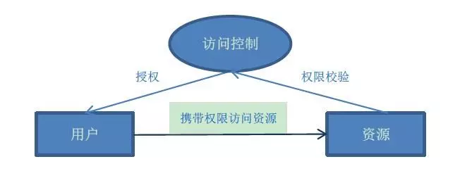
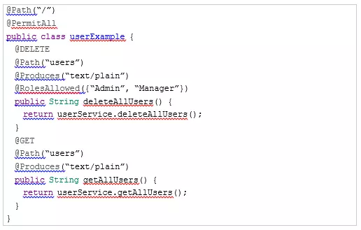
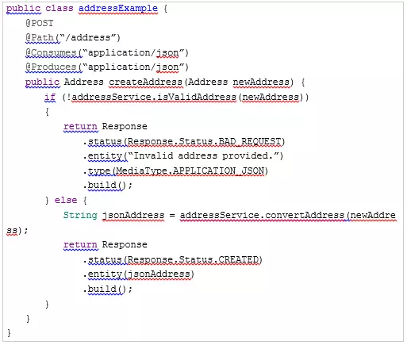

# 分析RESTful API安全性及如何采取保护措施

本文中讨论了API安全性和采用安全措施的重要性，如身份验证，API密钥，访问控制和输入验证。

## API设计的第一步是撰写接口文档

根据TechTarget（海外IT专业媒体）的定义，RESTful API是一个应用程序接口，它使用HTTP请求来获取GET，PUT，POST和DELETE等数据。从技术层面上看，RESTful API（也称为RESTful Web服务）是一种基于代表性状态转移（REST）技术，这是一种通常用于Web服务开发的架构风格和通信方法。

但随着 RESTful API 应用范围的爆炸性扩大，安全性越来越成为API架构设计中最容易被忽视的部分。

## 为什么API安全性很重要？

在设计和部署RESTful API时，有以下三个核心原因可以解释为什么安全性应该是一个很重要的考虑因素。

**▼1.数据保护**

RESTful API是一种向外界传输价值的服务方式。因此，保护通过RESTful方式提供的数据始终应该是属于高优先级。

**▼2.DOS攻击**

如果不采取正确的安全措施，（DOS）攻击可以使RESTful API进入非功能状态。考虑到很多基础的RESTful API是开放给所有人使用的情况，通过这种类似开源的方式有助于它更好推广给市场，让更多人投入使用，但同时意味着如果有人选择对API执行DOS攻击时，它也可能导致灾难性的结果。

**▼3.商业影响**

如今有越来多的服务平台，提供着影响衣食住行的各种信息，从飞机航班时刻表到高铁余票查询，甚至只是超市里日常用品，都能给你提供价格、数量、时间等诸多信息，让你足不出户，买到最合心意的商品。在这样的大趋势下，这种利用API数据来获取更多信息，再提供给你的聚合服务平台将会越来越多。于是通过RESTful API传输的信息会被频繁调用，而其中的个人信息很容易被泄露。

## 保障安全采用的措施

以下介绍一些RESTful API通用设计中的关键概念。

**▼1.会话管理和认证**

除了使用TLS / HTTPS之外，最重要的RESTful API安全级别是以会话管理和身份验证为中心的。在本文讨论中重点将放在API密钥，OpenID Connect / OAuth2 / SAML和会话状态事项上。

**▼2.API密钥**

API密钥的概念是为使用者提供了作为其HTTP请求的一部分的唯一字符串（密钥）。虽然不是一个完整的安全解决方案，但与匿名使用相比，使用API密钥可以更清楚地了解谁在使用API。

API密钥也可用于提供附加服务。例如，对于RESTfulAPI，附加的服务可以选择使用不同的级别。以一般、高、最高三个等级为例，在“一般”的级别，用户可以自由访问，但只能访问一组有限的数据。假如要访问更多组的数据，那就必须支付费用才能访问“高”的级别，以此类推，不受限制的访问所有的数据则要支付“最高”等级的费用，通过提供不同API密钥的方式，提供额外的服务。

**使用API密钥的最常用的方式是将它们包含在请求头中。**

例如，当调用某个小部件的头部时，67A73DD1BD1D90210BA的API设置为HTTP头部中的X-API-KEY键/值对：

curl-H“X-API-键：67A73DD1BD1D90210BA”

**API密钥的另一个常见用法是将该密钥包含在URI中：**

[www.example.com/v1/widgets?…](https://link.juejin.im/?target=https%3A%2F%2Fwww.example.com%2Fv1%2Fwidgets%3Fapi_key%3D) 67a73dde1bdd1d90210ba

但这种方法的问题在于，API密钥在浏览器历史记录和对应服务器的日志中都会显示出来，意味着向所有有权访问这些数据的人公开唯一密钥。

**▼3.OpenID Connect，OAuth2和SAML**

OpenID Connect，OAuth2和SAML使用HTTP协议作为传输，用于安全目的。身份验证提供个人的验证，同时授权执行或撤消访问的任务。

**从身份验证角度来看，存在以下选项：**

- OpenID Connect：可以利用现有的身份提供商（如Google或Facebook）获取用于验证用户授权的令牌。
- OAuth2：可以通过授权执行伪认证（如下所述）。
- SAML：使用断言、协议、绑定和配置文件来管理身份验证，包括标识提供者，但不太适合移动应用程序验证。

**为提供授权服务，采用以下策略：**

- OAuth2：提供安全的委托访问，通过允许第三方身份提供程序颁发令牌来代表用户执行操作。由于OAuth2必须了解被委派的用户，因此身份验证是以伪方式实现的（如上所述）。
- SAML：对可信服务执行断言，包括提供授权的令牌。

**▼4.会话状态事项**

RESTful API端点应始终保持无状态会话状态，这意味着会话的所有内容都必须保存在客户端。来自客户端的每个请求都必须包含服务器理解请求所必需的所有信息。为了简化流程，包括API令牌以及会话令牌，作为每个业务中都需要的一部分。

**▼5.访问控制**

如上所述，对RESTful服务的授权可以将安全性引入到所提供的端点中，以便对那些可以向API发出HTTP删除请求的人有限制。

在

在下面的简单Java示例中，只有Admin和Manager角色（即组）的成员可以执行删除所有用户的DELETE请求，但是所有用户都可以执行GET请求以获取用户列表：

**▼6.速率限制**

如上所述，API密钥是判断RESTful API的使用者身份级别一种很有用的策略。除了提供等级识别外，使用API密钥的另一个好处是能够限制API的使用，例子像Tibco Mashery、MuleSoft和Dell Boomi等API管理解决方案允许限制API请求，利用API密钥实现此功能。因此，试图执行DoS攻击（有意或无意）的时候将会达到一个设定的阈值，到达阈值后后续所有的请求都将被拒绝。

**▼7.输入验证和HTTP返回代码**

在保护RESTful API时，应始终考虑对输入进行验证。例如，如果用户试图发布与地址相关的JSON数据集合，则RESTful端点内的服务应验证数据并使用HTTP返回代码来反映正确的状态。在下面简化的Java示例中，就是调用一个非常基本的AdvSersService来验证和保存地址：

在上面的示例中，使用isValidAddress（）方法验证newAddress对象（从JSON编组到Address Java对象）。如果地址无效，则向用户返回HTTP 401（错误请求）代码，文本显示为“提供的地址无效。” 如果认为该地址有效，则convertAddress（）将执行必要的操作，然后将包含地址内容的JSON格式的字符串返回给用户，以及一个HTTP 201（创建）返回代码。

## 结论

保护RESTful API的安全应该始终处于API设计工作中最先被考虑的部分。如果不保护敏感数据，允许DOS攻击以及不考虑使用RESTful API的影响，那么即使它只是短暂的影响，相关的风险可能很容易使企业处于不利地位。

授权和身份验证可以为RESTful API提供必要的安全性，实现API密钥策略可以有效的用最低成本保护RESTful API的安全。对输入内容进行验证始终应该是RESTful API的一部分，因为无法保证API后续是否会进行任何必要的验证，同时返回到客户端的结果应该符合预设中HTTP返回代码，而不仅仅只是状态码显示的成功（200）或者错误（404）。

除了API的安全性需要被保护，时刻掌握API运行中的动态也是很重要的事情。最近发掘了一个新的工具：EOLINKER，他们本身是做API研发管理服务，因工作原因最近一直使用他们的另一个产品：API监控，最大的改变就是能随时查看接口是否报错，报错时可以查看错误的地方，对比之前效率高了不少，对API管理、监控等方面有兴趣的小伙伴自行了解下哦！[www.eolinker.com](https://link.juejin.im/?target=https%3A%2F%2Fs.growingio.com%2FKvEkln)

**你使用过RESTful API吗？又对RESTful API安全性有什么看法？欢迎在下方留言中与我讨论。**

*原标题：RESTful API Security*

*作者：John Vester*

*原文地址：dzone.com/articles/re…*