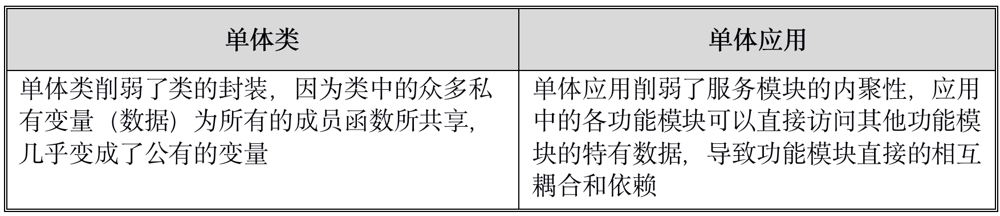

# 基于容器的微服务架构技术选型与设计

## 背景介绍

作为金融企业，国投瑞银基金多年以来 IT 工作主要还是以运维为主，主要业务系统基本采用外购模式，但随着业务的不断发展，业务部门个性化需求越积越多，外购与外包已经不能很好满足业务员部门的需要了。2016 年底公司着手开发团队的组建工作，同时对公司的业务开发平台进行架构选型与设计，以求统一开发平台，提升研发效率，从而加快业务部门的业务需求处理效率。

下面我们将就这两年在平台架构选型、平台架构设计、平台及相关子系统的逐步完善背后的一些经验进行分享。

### 适用对象

该架构全部基于开源平台，经过三年多的生产上线实践，平台运行平稳，可扩展性强，可用性高，可以很好满足公司对于金融业务不断发展的需要，这对类似的中小型企业的业务架构选型也具有一定的参考意义。

> 注：UFOS：国投瑞银基金运营系统

## 架构设计与选型

### 架构设计考量因素

在初期平台[架构设计](https://s.geekbang.org/search/c=2/k=架构设计/t=)与选型时，我们根据现有业务系统的需求，梳理出了技术架构选型需要考量关键因素：

1. 架构平台的前瞻性或先进性，符合当前潮流与未来发展趋势，有较好的生态链和较强的生命力，不能因为平台架构选型不当，导致未来平台重新架构，造成大量的迁移和重构工作，需保障平台架构能在一段时间内保持技术领先。

   这里有两点注意，一是对技术成熟度的考量，是否采用有风险的前沿技术以及拥抱这种技术带来的风险，这一点类似于金融投资中收益与风险的关系，我们需要在系统的先进性与系统的稳定性之间进行平衡；二是采用前沿技术可能会面对更多的困难，如国内可能缺乏相关资料，或难以找到可以参考的成功案例，很多时候只能通过官方和论坛获取相关技术信息，会对架构按时交付带来风险。

2. 平台的[可扩展性](https://s.geekbang.org/search/c=2/k=可扩展性/t=)

   能满足基金行业业务不断的发展与创新的需求，尽量能做到平台的横向平滑扩展，满足以上特性其实就决定了架构的分布式特性，当然我们更希望它是云原生的架构

3. 系统的[可靠性](https://s.geekbang.org/search/c=2/k=可靠性/t=)和[可用性](https://s.geekbang.org/search/c=2/k=可用性/t=)

   作为金融业务系统平台，需保证业务系统连续不间断运行，保证平台的高可用。采用集群或平台自动恢复功能，确保平台局部出错也不影响系统整体的运行；这里有两个层面，一是业务系统中的功能组件能相互隔离，其中一个组件的不可用不能影响到系统的其他部分；二是平台基础系统采用集群架构，有自动恢复功能，确保即使系统中有节点出错，也可在很短时间内完成出错节点中服务的切换与恢复

4. 开销

   不同的架构 / 技术选择有着不同的开发成本，包括技术框架，平台的学习成本，我们期望平台能支持异构的技术，使得开发人员可以采用比较适合的技术栈来快速实现业务功能的开发

5. 开发运维一体化思想（[ DevOps ](https://s.geekbang.org/search/c=2/k=DevOps/t=)），在设计时考虑运维，尽量减少后期运维操作的复杂度，减轻后期业务系统运维的负担。

6. 让开发人员更多专注在业务功能需求开发，其它非功能需求如负载均衡、高可用等尽量由平台提供，做到对开发人员透明，以提升开发效率。

当公司规模不大，实力不足以自己实现部分或全部架构，选择现成的“轮子”来组装自己的架构就成了一种自然的选择。在选择上可能会更多考虑如何使用更“标准”的“轮子”来满足自己业务的需求，以便于今后业务的升级和扩展。

要实现上述平台的扩展性和高可用性，一般都离不开分布式架构，而分布式架构一般离不开服务来承载 。

### 基于服务架构演进

基于服务的架构设计早已有之，比如基于 RPC 的服务调用，最早可追溯到 CORBA，以及现在还有很多金融公司在交易系统中使用的 BEA 早期的框架 Tuxedo（主要编程语言为 C/C++）。后来者有 Facebook 的 Thrift，Google Protocolbuf 框架 /grpc，阿里的 Dubbo 框架等等。这些框架支持消息的二进制编码（序列化与反序列化），效率高，因此成了对网络传输，并发处理要求高的应用如 App 应用，游戏，交易软件等的首选。

后来随着 HTTP 协议的广泛应用，发展衍生出面向服务的架构（SOA）的架构设计，该架构一般都应用在比较复杂，大型项目中，为了异构系统中的功能复用，或系统性能的考量将功能模块独立出来成为服务，服务可以分布式部署，服务之间通过标准的软件接口方式在网络中相互调用；为了统一服务调用标准，SOA 往往还引入了数据总线概念，服务可以通过数据总线进行服务注册，服务的查找与调度。

[SOA ](https://s.geekbang.org/search/c=2/k=SOA/t=)架构中的服务之间是松耦合的，服务的颗粒度相对比较粗，而近些年出现的微服务，则可以看作是对 SOA 服务的一种精简，细化，或者说是 SOA 服务的轻量版。

### 微服务

在谈及[微服务](https://s.geekbang.org/search/c=2/k=微服务/t=)的时候，大都会对应到单体应用，以示鲜明对比；单体应用其实就是一个服务中包含了太多种功能的应用，它跟面向对象的设计里的单体类（包含太多功能实现的类）的提法颇有些类似，英文单词中有一个专有名词 monolithic 来描述二者：

如果你再仔细对照微服务和类，你会发现两者有诸多相似之处，比如微服务和类在设计原则上也是一致的，也就是高内聚 / 封装与松耦合，高内聚也就是只负责一项任务，也就是单一职责原则，而松耦合则是指模块之间的接口尽量简单，减少耦合度，这样也使得开发，独立部署和升级微服务更加容易。

微服务同时也很好地匹配了敏捷开发团队，减少了开发团队的沟通成本，更小的代码库同时有效降低了开发团队之间的冲突，使得小团队开发更加有效。

### 微服务框架选型

2016 年，当时的微服务还不像在现在的市场上一样炙手可热，当时微服务兴起不算太久，在互联网企业有早行者，但市场整体上参考资料与可参考的案例相对并不多，市场上对选型微服务架构也不是太明朗。但对照前面架构选型的各种考量因素，微服务还是非常匹配我们的选型标准的，而且能与我们小团队敏捷开发的组织架构相匹配，因而微服务架构基本成为了我们架构中的首选。

既然选择了微服务，接下来的工作就是微服务框架的选型，选型中我们主要考量的因素是：

1. 编程语言，编程语言需要考虑现有开发人员的技术栈和语言的流行度，以及其生态
2. 框架的生态链，比如安全，服务注册，服务发现与监控等等

我们列出了当时市面上比较流行的微服务框架候选者：

- 基于 RPC 协议的框架，如阿里的[ Dubbo ](https://s.geekbang.org/search/c=2/k=Dubbo/t=)框架，在国内电商，物流，金融软件等行业都有较多的应用场景，还有 Java RMI，Apache Thrift 和 Google grpc
- 基于[ Spring Cloud ](https://s.geekbang.org/search/c=2/k=Spring Cloud/t=)Java 微服务框架
- 基于容器的微服务框架

当时微服务兴起不久，市场框架选择并不是太明朗，Spring Cloud 当时也在不断地演进与完善中，Dubbo 已经停止更新，但相对来说，国内市面上这两者的选择比较多，微服务开发的主流语言也是 Java。

通过对比和调研我们最终选择了基于容器的微服务方案，这主要是基于：

- 微服务设计中有一个比较的重要原则是，技术异构性，可以使用与需求比较匹配的语言和相关的数据存储方案，而不限于哪种编程语言和哪一种统一的数据库来实现微服务的开发。比如对于数据分析型微服务，你可以采用 Python；对于性能有要求的微服务，你可以采用 Go 或者 C++ 进行开发，底层数据存储也不限于 RDBMS，可以使用 NoSQL，嵌入式数据库，这使得我们可以更快地使用新技术。基于容器的方案可以很好的满足以上微服务设计的需求，每个容器运行一个微服务，微服务之间通过协议实现互联，众多微服务组合起来组成一个大的完整的应用系统；而 Dubbo 和 Spring Cloud 基本就是捆绑在了 Java 语言平台。
- 基于容器云原生方案，微服务的平台更宽泛，可以选择基于云的部署方案。
- 微服务容器基于标准的容器基础镜像构建，这样容器的运行环境统一，便于统一管理，也便于排查问题。
- 由于容器的标准化，容器平台可以通过容器提供标准的服务注册，服务负载均衡，服务监控，服务的 failover 机制等，而这些都不需要植入源码，可以最大限度让开发人员专注于业务的开发。

开发语言我们还是选定了主流的 Java，即使我们有一些历史遗留的 C#项目，Java 毕竟是编程语言的排头兵，也是开源的主力军，有很多的开源“轮子”使用，可以大大加快开发进程，即使其编译后的执行包偏大（几十到近百兆，虽然自 Java 9 的模块化编程有所改善），但对我们的业务平台相对来说并没有多大影响。

Java 框架我们选择了 Spring Boot，它在 Spring MVC 基础上简化了配置管理，也有多种 starter，简化了编程，可以快速搭建微服务应用。

#### 微服务间前端框架选型

架构前期，由于人力有限，我们并未对微服务前端框架进行选型，更多是依赖外包开发商的现成框架，比如第一个项目的几个微服务就是采用的是基于 jQuery 的框架；第二个项目的开发商采用的是 vue.js，并基于 vue.js 进行了组件包装（尚未完全完工），不过该组件包装需要额外付费。由于我们对外包方包装的组件信心不是很足，因为包装的组件基本没有测试用例，这迫使我们下定决心进行前端选型，这也有利于后续业务开发的一致性与可维护性，保证应用研发的质量。

随后我们花了两个多星期对市面上的前端主流框架进行了初略快速的选型，并做了 Demo，最终 Google 公司当年的前端新品 Angular 2 框架被采纳。一是 AngularJS 受众大，这次 Google 团队不兼容重新设计也从 AngularJS 1.x 吸取了大量的经验，并结合近年来新的 Web 的进化和前端开发尤其是移动方面的变革，运用全新的思路进行重新架构，精简了 1.x 的概念与指令，并利用单向数据流，服务端渲染机制等大大提升框架性能；二是 Angular 支持组件式开发，并支持 TypeScript，TypeScript 吸收了许多面向对象的编程语言优势，跟后端语言更接近，使得后端人员上手前端开发比较容易。我们的开发人员通过 Demo 的学习与服务的前后端一体化指导开发，很快就成为前后端一体开发的全栈开发工程师。

后续 Angular 的高速发展印证我们选择还是正确的，对于自身没有很强研发实力的，选择正确的框架还是非常重要的，尤其是大厂商的产品，因为其周边的生态也会日趋完善，产品生命周期更长久（慎用小开发商的产品，对开发中组件的引入最好也要做好审批）。

在 Angular 之上我们选择了开源的 PrimyNG 组件套件以简化前端开发，PrimeNG 是一个极为完善的开源 Angular UI 组件库，现在已经发展到 80 多个组件，基本可满足我们业务开发中的所有 UI 需求，虽然当时的版本还偶有 Bug 或功能未完善的组件。现在，我们的前端已经形成了一套比较成熟的开发模板，可以快速完成微服务前端模块的搭建。

当然，在 Angular 上还有其他一些成熟的开源组件平台可以选择，比如官方的 Material 和阿里的 NG-ZERO 组件等。

### 微服务通信

运行中的微服务实例其实就是一个个的进程，它们可以在网络中分布式部署，微服务调用涉及到网络之间数据的交换，其实也就是数据对象的序列化与反序列化。

RPC 框架通常有自己的接口描述语言（Interface Definition Language，IDL），框架提供工具可以将 IDL 生成服务端和客户端的 stub，stub 可以实现消息序列化与反序列化，以便于数据消息对象通过网络在客户端与微服务之间传输。由于 RPC 框架支持二进制编码方式进行序列化，因此传输效率更高，可以获得更高的性能和更低的延迟；而且相对纯文本方式的数据传输，数据安全性更高。为增加安全性，一般这种编码还会设计相应的数据头，以便于对主体数据进行加密与签名。

RPC 通信由于双边需要 stub，更多用在有独立客户端的情况如 Client/Server 模式下，很多还受限于具体框架支持的语言，也与平台相关（比如很多本质上是基于二进制，有的对大端字节顺序的平台可能就不支持），因此选用和语言和平台无关的通信协议是一种更好的方式。

RESTful API 是基于超文本传输协议 HTTP 之上一种架构设计风格，当时已经在 Web 应用开发中比较流行了，它通过 URI 来唯一定位一个需要操作的资源，而使用标准的 HTTP 方法来完成对资源的 CURD 操作，这种设计简洁，轻量，易用。URI 中的数据传输简单的可以采用 Key/Value 的形式，复杂的可以采用 JSON 数据格式，后者在诸多编程语言中可以方便实现数据的序列化和反序列化。

选择开放标准的传输协议，其上的生态链更丰富。我们微服务平台架构选择了当时流行的 B/S 架构模式，RESTful API 就成为我们一种自然的选择，结合 SpringBoot 框架，它给我们带来以下好处：

1. 编程简单，SpringBoot 的 Controller 可以方便直接获取 HTTP 中的参数对象，前端的 TypeScript 也可以直接映射到对象。
2. 调试和测试比较轻松，毕竟 URI 中的参数都是文本编码可见，可以方便结合测试工具进行接口测试，比如 Postman；我们的平台也集成了 Swagger API，可以直接在 Swagger 界面上直接进行测试。

除了基于 REST API 方式的数据交换以外，我们在设计规范中也规定了其他的 RPC 通信模式，比如 Thrift 和 Protocolbuf，当遇到以下场景可以考虑使用：

- 对性能有要求的微服务。
- 有异种语言之间通信，而另外一种语言标准中对基于 HTTP 通信协议支持不是很好，例如在我们的传真微服务开发中，我们就使用了 Protocolbuf 协议，传真服务采用 C++ 开发，Java 客户端通过消息队列异步与后端的传真服务通信。

#### 微服务间的交互模式

RESTful API 微服务调用一般都采用请求 / 响应的同步模式（单向通知除外），如果需要进行异步的 API 调用，比如有些耗时的请求，客户端一直阻塞等待响应可能不是一种好的处理方式，采用异步处理方式有：

- 大多数 RPC 框架都提供异步调用机制，如 Thrift 与 grpc，通常它与同步调用区别在于调用返回的不是结果，而是一个句柄，该句柄可以用于随后的结果获取。
- 使用一些高级语言的同步控制机制，比如使用 future 与相关的 Provider，处理机制与第一种方式比较类似。
- 采用异步的消息通信机制，客户端通过向服务端发送消息提交请求。如果服务端需要回复，则会发送另外一个独立的消息给客户端，消息通信一般通过独立的消息队列实现，经常使用的消息队列包括 RabbitMQ，ActiveMQ。

#### 消息系统

消息系统使用方式通常有以下几种方式：

1. 消息队列模式。
2. 发布、订阅模式。
3. 消息路由模式。
4. 主题（Topic）消息订阅。
5. RPC 模式，可以理解为异步远程过程。

采用消息机制的优点：

- 解耦客户端和服务端：客户端只需要将消息发送到正确的 channel，客户端完全不需要了解后端具体的服务实例，更不需要一个发现机制来确定服务实例的位置。
- 消息缓存，不需要像同步调用，必须保证所有的客户端和服务端在交互期间保持可用，即使是服务端处理不过来，客户端依然可以发送请求。

消息机制的缺点：

- 增加了操作系统的复杂性：需要安装、配置和部署消息系统，消息 broker（代理）必须保证高可用，否则系统可靠性将会受到影响。
- 增加了编程的复杂性，消息驱动开发的代码比较难以理解和维护。

##### 消息系统选型

根据业务需求，我们对消息系统的选型更侧重在可靠性，其他方面如吞吐量等并无更多的特别要求，市面上有较多成熟的消息系统可以选择，在金融系统中，RabbitMQ 就因其较强的扩展性，较高的可靠性和可用性被广泛使用，ActiveMQ 也有不少使用案例。

ActiveMQ 是基于 JMS 实现的消息系统，它主要提供了两种类型的消息：点对点以及发布 / 订阅。它是一个高可靠性、高性能和可扩展的消息系统，支持消息标准协议，例如 AMQP（1.0 标准）和 STOMP，官方支持多种编程语言，包括经常使用的 Java, C++（RabbitMQ 官方并不提供 C++ 编程语言包，而我们在平台中规划了 C++ 应用比如传真微服务）和 Python， ActiveMQ 可以很好满足现有业务的需求，最终我们选择了 ActiveMQ 作为我们消息系统。

### 服务发现与部署

设想一下，微服务按照我们上面所述通信方式提供了 REST API 或者 RPC 接口调用，为了完成一次服务请求，调用方需要知道服务实例的网络位置（IP 地址和端口）。传统应用都运行在物理硬件上，服务实例的网络位置都是相对固定的（DNS 或者静态 IP 地址）。而对于一个现代的，基于云部署的微服务应用来说，这却是一个很麻烦的问题，服务实例的网络位置都是动态分配的，而且因为扩展、失效和升级等需求，服务实例会经常动态改变，因此，客户端代码需要使用一种更加复杂的服务发现机制。

在我们的架构设计中，我们选择了容器作为微服务的载体。其设计思路就是把一个微服务装入一个容器中，也就是一个容器中运行一个微服务，微服务通过容器对外提供服务接口调用；而容器作为一种标准构件，非常容易在网络中实现管理和监控；服务的发现和注册可以通过容器相关技术来实现，这会用到容器的编排与管理技术。

当时在容器市场上，Docker 可谓一枝独秀，但容器编排还处在一片混战中，局势并不是太明朗，市面上流行的编排方案有 Kubernetes，Mesos 和 Docker Swarm 等，Docker Swarm 是由 Docker 容器厂商创建的集群工具，它对外提供的是完全标准的 Docker API，可以与 Docker 引擎无缝集成，任何使用 Docker API 与 Docker 进行通讯的工具（Docker CLI, Docker Compose）都可以完全无缝地和 Docker Swarm 协同工作，因此 Docker 的经验也可以继承过来，非常容易上手，学习曲线和二次开发成本相对 Kubernetes 都比较低。同时 Docker Swarm 本身专注于 Docker 集群管理（Kubernetes 对容器管理进行了抽象，支持 Docker，rtk 等），非常轻量，占用资源也非常少，运行效率也高，也有支持几千个容器的集群案例。

虽然 Kubernetes 发展势头更猛，根据项目需求和公司研发实力，我们最终还是选择了能更快实施与部署的 Docker Swarm 方案（当然到了 2017 年中，容器编排之争基本落下帷幕，最新统计 Kubernetes 占据了 75% 以上市场，Docker Swarm 从曾经的三成已经减少到了个位数）。

Docker Swarm 在版本 1.12 之前是一个独立的项目叫 Swarm Standalone，这也是我们使用的第一个版本，它的服务发现依赖于外部的 k/v 存储，我们按官方指引选用了 Consul 集群；Swarm 也是独立的进程，需要独立安装，我们采用了容器模式运行 Swarm 进程。

版本 1.12 后 Docker Swarm 升级为 Swarm Mode，Swarm 也合并到了 Docker 引擎之中，也就是安装了 Docker 引擎 Swarm 服务（内置安全认证，服务发现，负载均衡，集群放置在内置的 datastore 的 meta data，调度，容器网络）就已经在那里了，不需要额外安装，你所需要的只是创建集群。

Swarm Mode 内置的服务发现是通过每个节点 Docker 引擎内置的 DNS Server 来实现，在集群中创建的服务都会在相应的节点的 DNS Server 进行登记，各节点的 DNS Server 之间通过 gossip 协议进行信息交换；每个服务都有一个 DNS 解析器，它将 DNS 查询转发到节点 Docker 引擎，由 DNS Server 来进行解析， 如果不能解析则转发到配置的外部 DNS Server，这样服务在集群中任意节点就可以相互访问了。

服务的负载均衡（LB）缺省是通过虚 IP（VIP，使用微服务的服务名）或一组服务的 IP（tasks. 服务名）根据内置的 IPVS 来实现，也可以在创建服务的时候指定 dnsrr 模式通过 round-robin 轮询来实现。

就 Swarm Mode 集群本身来说，安装比 Swarm Standalone 简单了不少，升级和移植也比较简单。通过近 3 年多我们业务系统生产的营运实践表明，Docker Swarm 可以说完美满足我们的现有业务平台的需要，包括其稳定性，集群的高可用性（包括容器自我检测与自动重启，错误节点中的容器自动转移）和可扩展性（包括集群节点的动态扩容，容器服务的实例动态扩充），也可以满足业务未来多年发展的需要。

Figure 1: Docker Swarm 服务发现与负载均衡

### HTTP 反向代理 / 服务网关

微服务除了内部相互之间调用和通信之外，最终要以某种方式暴露出去，才能让外界系统（例如 Web 应用、移动应用等）访问到，这就涉及服务的前端路由，它是连接内部微服务和外部应用系统的一个通道。

HaProxy 与 Ngix 等工具也可以实现 HTTP 反向代理，但基于以下特性，开源的 HTTP 反向代理与负载均衡工具 Traefik 成为我们的最终选择：

1. Traefik 更适合需要服务发现和服务注册的应用场景，它 支持多种后台应用自动发现，如 Docker，Swarm，Kubernetes，Consul 等，它还可以动态监测后台服务的变动以自动实时更新自己的配置。
2. 支持限流与自动熔断功能。
3. 支持配置热更新。

可以说 Traefik 非常适合容器化的微服务，采用 Traefik 可以带来以下好处：

1. 服务反向路由，Traefik 将外部请求反向路由到内部具体的微服务，这样虽然系统平台内部是复杂的分布式微服务架构，但是外部系统从代理上看到的就像是一个统一的完整服务，代理屏蔽了后台服务的复杂性（类似 Facade 模式），同时也可以屏蔽后台服务的升级和变化。
2. 便于安全控制，服务通过代理统一访问后端的微服务，而代理访问微服务是通过容器内部网络进行，也就是微服务都可以不用暴露端口到容器外端，外部应用也就不能直接访问容器里边的微服务了，而必须通过 Traefik 代理。代理有微服务的注册信息，它可以根据微服务名正确路由到相应的 IP/ 端口的微服务容器。这样我们的安全策略就只需要集中在 Traefik 代理端控制即可。
3. 提供多种格式度量数据，比如可以提供我们采用的 Prometheus 监控数据格式，提供访问量，调用延迟，错误计数等数据，为后端的性能优化或者扩容提供数据支持。

Figure 2: HTTP 反向代理

### 日志子系统

由于采用分布式架构，并且使用容器来承载微服务，如果使用本地日志文件模式，日志就散落在各个容器内部或各个宿主机上了，这样不利于日志的统一管理和使用，因此，采用一个集中的日志系统中心，也就成了一个必然的选择。

Figure 3: 日志子系统

在我们的架构选型中，我们选择了流行的开源框架 ELK 栈；日志写入远端的 Elasticsearch，通常可以采用两种方式，一种方式是通过日志代理，如 Elasticsearch 提供的高效的 Beats 工具，可以将 Beats 与业务服务部署在一起，这适合第三方服务（没有源码）或开发语言无标准日志组件的服务。而另外一种方式则是通过日志的 SocketAppender，直接将日志通过网络写入远程的日志服务，如 LogStash，很多标准的日志组件都支持这种方式，如 Java 标准日志输出如 Log4j，Logback 等。这种方式也比较适合在容器中部署的微服务，不需要额外再部署另外的日志工具。在我们微服务平台中，日志输出我们选用了性能较高的 Logback，并选用了与之配套的 LogStash 输出插件，通过该插件（代理）Logback 可以将日志通过 Socket 直接输出到 Logstash 服务，而这毋须对代码做任何改动，仅需要通过简单的配置文件配置即可方便实现，对调用日志的应用微服务完全透明。

为便于后续的日志查找和 Kibana 中的日志数据展示 我们需要对日志的格式进行规范化，以便将日志中的关键信息以键值对的方式存入 ElasticSearch，规范化涉及到日志文本的编码与解码，分别在应用端和 LogStash 端，LogStash 服务可以通过配置来对消息进行 Mapping 和过滤。

如果日志量比较大，则需要在日志输出与 LogStash 中间增加消息缓冲，Kafka 是一个高吞吐量的消息系统，Log4j2 有直接输出到 Kafka 的 Appender。

### 监控子系统

监控系统是平台服务治理中的一个重要组成部分，没有监控的应用系统可以称作一个裸奔的系统；我们原有的业务平台已经有了一套传统的监控系统 Netgain，但更多是对基础设施的监控，缺乏对应用系统内部状态的真正监控，比如对微服务和容器的支持，不能很好满足 UFOS 微服务平台的需求。

Prometheus 作为从 CNCF 毕业的第二个开源项目（第一个是容器编排项目 Kurbernetes，Prometheus 本来也是源自 Google 对 Kurbernetes 的监控），它能很好地监控服务以及容器，除了能与 Kurbernetes 无缝集成以外，也可以与 Swarm 很好地集成，尤其是配合 Docker Swarm 中的 label 与 global 配置选项使用，可以非常方便实施远程应用监控代理（exporter）的部署。

由于 Prometheus 是一个开放的监控平台，因此有大量的官方及第三方的监控代理 Exporter（监控代理可以协助不支持 Prometheus 数据采集接口的第三方服务公开自身的监控数据），在 UFOS 中主要使用了以下监控 / 代理：

其中 BlackBox 采用的是非代理模式，由于已有 netgain 做基础设施监控，所以并未使用 SNMP Exporter。

Prometheus 本身也提供了告警服务模块 AlertManager，你可以通过基于 Prometheus 内置的强大的查询语言 PromQL 来设置告警规则，Prometheus 会根据设定的时间间隔从配置好的服务收集度量指标，如果某个指标与定义好的规则匹配，则触发告警。AlertManager 支持告警分组，告警抑制和静默，告警撤销，告警规则正则表达式匹配，告警模板等功能特点。AlertManager 支持多种告警通知，如邮件，Scribe，Hipchat，Wechat（官方原生支持）等，还支持 web 接口调用，可以通过 webhook 与微服务集成，比如阿里钉钉就可以通过该种方式接入。

Figure 4: 监控子系统架构图

Prometheus 提供多种客户端 API 接口调用库，如官方提供 Java，Python，Go，第三方提供 C++，PHP 等库，通过这些库你可以很方便在你的微服务中植入监控的度量数据（通过微服务 Web 接口，如果是批处理任务，则可以将生成的监控度量数据发送到 PushGateway 服务进行托管），为 Prometheus 服务进程拉取到，这样我们可以方便实现对业务数据的监控。

监控界面展示使用 Grafana，Grafana 是一个开源的图表可视化系统，支持多种时序数据库如 InfluxDB，当然也支持 Prometheus，Grafana 有丰富的图形展示组件，官方网站也提供大量现成的模板，UFOS 中对 Swarm 节点，微服务，数据库，告警等资源进行了监控展示。

### 高可用设计

为保障业务的稳定可用，平台应保证持续可用，不会无故宕机，即使出现故障也可以快速发现和定位，通过监控机制，能在系统用户发现之前尽快解决问题，抑或系统能通过设计自动发现故障并进行自动故障转移，比如通过主备或集群的冗余方式来避免单点的问题，这里我们将针对后者，从系统设计来提升系统高可用性进行简要介绍。

#### 接入层

UFOS 运行平台基于 Linux 系统，平台入口是 HTTP 反向代理 Traefik，为实现入口的高可用，我们必须保证 Traefik 的冗余备份。

Traefik 本身支持集群方式的 HA 方式，基于配置的 K/V 存储，官方推荐的是 Consul。但是由于我们服务平台是基于 Swarm 集群，Traefik 是以 Swarm 服务方式运行（限制在 Swarm Manager 节点），它可以通过 Swarm Manager 节点读取到足够的 Swarm 中运行的服务实例的相关信息。而 Swarm Manger 之间通过 Raft 算法实时交换信息，因此运行多个独立的 Traefik 实例它们获的服务实例信息是最新也是对等的，所以我们并不需要按官方指引的使用 K/V 存储来实现 Traefik 的高可用。

为实现 Traefik 的故障自动转移，我们对运行 Traefik Replica 实例的 Swarm Manager 节点设计了基于 VIP 的 Linux 集群方案，使用 Pacemaker+Corosync，其中 Corosync 用于检测节点间通讯是否正常，而 pacemaker 则用于管理集群资源。当检测到 Linux 集群中的任何一台节点故障时 VIP 会自动切换到其他的正常节点，入口也自动切换到该节点上运行的 Traefik 上来，保证 HTTP 访问代理的可用。

#### 应用服务层

所有的微服务都是以 Swarm 服务的方式运行在 Swarm 容器平台上，微服务的高可用性由 Swarm 提供。Swarm 容器编排系统本身支持高可用，在 UFOS Swarm 集群中配置了三台 Manager 节点（最多可以承受一台 Manager 故障），Manager 之间通过 Raft 进行 Leader 的选举，这种选举保证了单个节点的异常不影响整个 Swarm 集群的运行。

Swarm 中运行的微服务容器也是高可用的，一是可以通过启动多个相同微服务实例来实现微服务的高可用，Swarm 内部可以通过 VIP 的方式来实现微服务容器之间的负载均衡与故障的无缝切换（VIP 只会转发到健康的服务）。即使是单个微服务容器实例，Swarm 仍能保证微服务的高可用性，如因节点故障，导致节点中运行的微服务容器异常，Swarm Manager 可以自动检测到节点异常，然后把异常节点中的微服务容器，转移到集群中其他健康的节点上去，并在其他节点重启微服务应用，这样仍然可以保证容器中运行的微服务可以被访问，从而实现微服务的高可用性（容器编排技术可以保证容器的动态发现，即使容器被转移到其他节点上重启，从而实现微服务的动态访问，当然这里可能有个延迟，要实现这点还有一个就是需要保证微服务被设计为无状态的）。

#### 数据层

Oracle Database 采用典范的 RAC 集群，MongoDB 则是基于官方提供的容器镜像，以容器方式实现了三台 MongoDB 的 Replica 配置。

Redis 采用主从复制模式，配置了一主二从三个节点，同时配置了相等数目的 Redis Sentinel，这些 Sentinel 能共同合作完成故障发现与判断，以及故障转移，并通知应用方，从而实现真正的高可用。

ActiveMQ 采用官方推荐方式，实现了基于 RDBMS 的主从模式，从消息队列定时从 RDBMS 共享表中检测主消息队列的刷新情况，如主消息队列异常，未能在指定时间内更新，从消息队列提升自己为主消息队列，从而实现主从的切换。这里需要注意的是必须保证主从服务节点的系统时间的同步。

文件系统的高可用是通过 NFS 文件系统与底层的存储来实现。

经过生产环境的实践，随着平台的不断完善和运维经验的不断积累，UFOS 平台的可用性已从 99.95% 逐步提升到了 99.99%。

### 微服务整体技术架构

以上各小节对微服务平台的各个子系统依次进行了描述，下图是各子系统集成到一起组成的一个完整的微服务平台整体架构图：

Figure 5: 微服务平台整体技术架构图

### 总结

该基于容器的微服务架构平台给我们的研发带来了以下益处：

经过三年多微服务平台运营实践，总结起来该基于容器的微服务架构平台给我们的研发带来以下益处：

1. 由于完全基于开源系统，可以实现自主可控
2. 平台基本对于开发人员来说透明，同时 DevOps 使得运维简单，有效提升了研发效率，节省了人力资源方面的投入
3. 平台微服务开发语言选择更具弹性，现在平台中已有三种语言开发的微服务，而且平台还可以根据开发语言的发展进行语言的更迭，也可以根据市场的变化对开发语言进行调整，最大限度保护现有投资，以及最佳化未来投入
4. 实现公司的统一开发服务云平台，可以无缝整合现存的第三方服务商提供的服务，有效利用平台在服务治理方面的资源
5. 可以方便整合第三方开源软件系统为平台直接使用，为平台提供服务，有效节省开发人力投入
6. 容器运行环境高度统一，微服务问题可以排除干扰，便于问题分析与排查
7. 该架构平台运行非常稳定，可用性高，可扩展性强，可以根据业务需要进行动态扩展，可以满足公司业务的未来长期发展的需要，并且技术架构有一定的前瞻性，有效避免了因平台架构选型不当导致后续的平台改造移植造成大量的迁移和重构工作，保护了投资（资源投入，包括人力）。

该平台架构可以作为中小企业对微服务平台架构选型的一种参考，当然你可以使用 Kubernetes 替换 Docker Swarm， 毕竟后者成为了小众产品（如果从入手的简洁性，Swarm 依然还是具有吸引力的，几天之类上手），其他子系统的选型也可以作为参考。