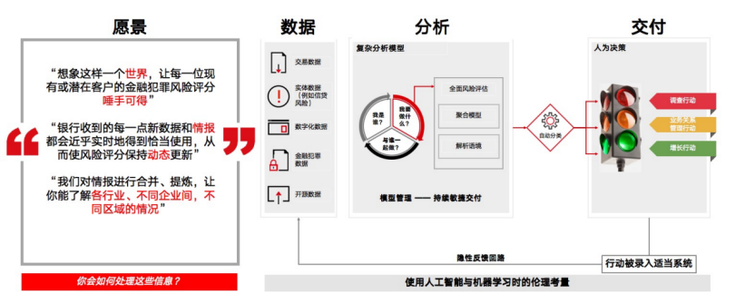

# 大型跨国银行系统架构的微服务与敏捷开发实践之路

30 多年前，汇丰银行聚集了一批当时的 IT 精英，花了几年时间，在 IBM AS400 小型机平台上，开发了一个当时非常前沿领先的国际财富交易系统。这个传奇系统第一个版本在香港正式上线运作，是 1987 年。

30 年后，2016 年，这个系统的单体式架构和瀑布开发模式已经难以适应现阶段的业务需求，没人相信这个系统还能继续起舞。

但七个月后，该系统重新登台，与微服务架构深度结合，拥抱敏捷开发的工程理念，在复杂的业务环境中如鱼得水。如今，开发人员仍在围绕性能、安全等方向继续优化系统架构。

在互联网产业飞速变革的今天，这样的故事时有发生，为了给大家揭示这些架构演进背后的秘密，在[ 2019 ArchSummit 全球架构师峰会·深圳站](https://archsummit.infoq.cn/2019/shenzhen/) 现场，来自汇丰科技的资深技术专家，为参会者详细展示了传统遗留系统的改造思路，同时还带来更多技术领域的分享，包括微服务架构的设计心得、敏捷开发思想的践行方法以及在金融犯罪监控领域的架构设计要点。

## 一、使用微服务进行外围搭建，让“祖传系统”重返青春

遗留代码、遗留系统，常被开发者戏称为“历史遗留问题”，让整个团队身负重担。它往往经历过多支团队的维护，业务逻辑异常复杂冗余，难以支撑业务拓展、难以维护，难以拥抱新的技术和理念。

针对以上遗留系统的改造问题，汇丰科技软件工程经理刘华 、汇丰科技基金服务部门架构师谢强彬 以自身负责的基金服务系统为例，在现场总结了相应的三条解决方案，分别是：

- 在遗留系统外围搭建微服务系统，从而解决遗留问题；
- 通过 API 的设计解耦，使银行系统不再依赖落地文件；
- 使用[ OAuth 认证](https://mp.weixin.qq.com/s?__biz=MzAxODcyNjEzNQ==&mid=2247486910&idx=1&sn=1722e78723d23bb55888c38771bfba7e&chksm=9bd0a026aca729308879039f05cd8719e9de4293a1ef37195e68c58192cfc06475a8910d90f6&scene=27#wechat_redirect) 完善外部交互的安全机制。

### 1. 采用微服务架构搭建外围系统

每当有新的需求到来，开发团队会首先构建数个微服务作为中间层满足需求，解决单体应用的复杂性问题。然后将其注册到[ Eureka ](https://www.infoq.cn/article/jlDJQ*3wtN2PcqTDyokh)，以保证微服务集群的可用性和分区容错性。同时，允许内外部系统通过路由服务器输入 Gateway 访问中间的服务。

在微服务监控方面，系统会主动将日志文件从微服务推送到 ELK 服务器，并配合[ ZipKin ](https://mp.weixin.qq.com/s?__biz=MzIzNjUxMzk2NQ==&mid=2247490343&idx=1&sn=874d9235eb226529339e392256c69022&chksm=e8d7e4e5dfa06df31ea9d19e36bd649b60897546652a8036c4ab7114c90c0d835824af357327&scene=27#wechat_redirect)、[ Prometheus ](https://www.infoq.cn/article/CkjHGXEl7ro_69FXFSpV)等工具对服务状态作出监控，一旦出现故障立刻熔断，并在[ Grafana ](https://www.infoq.cn/article/YDUNAC_XVBStyFheNEj6)展现出来。

### 2. 通过 API 设计解耦对落地文件的依赖

API 设计是改造的关键，它分为系统级 API 和业务级 API，保证了与供应商系统的解耦。汇丰科技通过系统级 API 把供应商里的数据通过领域抽象进行映象，使得数据成为单独的 API。当新的需求到来，即通过业务级 API 调度系统级 API，完成需求。

API 开发的上下游测试也是一件比较麻烦的事情。汇丰科技利用契约测试，由 API 开发的下游对上游约定接口的期望结果。约定完成后，大家可以按契约分别测试，从而解耦 API 上下游之间开发和测试之间的依赖，使得大家可以按照自己的开发节奏进行。

### 3. 使用 OAuth 完善外部交互的安全机制

OAuth 是为用户资源的授权提供的一个安全、开放、简易的标准协议。OAuth 的授权不会使第三方触及到用户的帐号信息，非常安全。而且任何第三方都可以使用 OAuth 认证服务，所以现在 Google、Microsoft 等公司都提供了 OAuth 认证服务，使其正在逐渐成为开放资源授权的标准。

在这套架构里，每一次来自外部的对微服务的请求，都要通过 OAuth 服务器验证。OAuth 在此统一了众多微服务的安全机制，并且将安全做到了微服务级别而不是网关级别。

基于上述设计理念，汇丰银行对基金服务系统的整体架构进行了重新设计，如下图所示：

至此，曾经难以支撑业务发展的古老系统重新焕发生机。未来，两位专家还期望将 API 开放成 API 商店，提供完善的 API 文档和服务。

## 二、控制好微服务划分颗粒度，使用成熟的解决方案加速改造

我们了解了微服务在传统遗留系统改造问题上的设计方案，但很多开发者在实施的过程中仍然会被很多具体问题所困扰。比如从单体架构演进为微服务架构，对于模块的划分力度的掌握非常重要，这也是开发者经常碰到的问题。如果划分太粗会有复用性和灵活性的问题，划分太细会造成 API 臃肿的问题。

汇丰工商金融香港网上银行架构师傅寅旺 为我们分享的原则是：

- 每个微服务设计都能快速响应市场需求，可以代表完整的业务功能。
- 尽量将业务逻辑放在外层处理，从而保证架构的灵活性，减少以后系统升级的复杂度。
- 允许不同的服务按照不同的版本进行部署，便于实现平台的灵活性，上下兼容。

为了实现这些原则，这里将微服务架构进行分层：

在架构图中，最底层是公共基础层，它在所有下游系统间进行通讯，把数据收集起来后暴露接口给外层使用；

向上是基础业务层，某一个具体功能的业务处理将在这一层进行应用过滤；

最上层是应用服务层，主要体现微服务和对应功能之间的差异，解决不同场景、不同项目之间的需求，对基础服务层和公共基础层进行不同的编排调用。

在银行的数字化转型过程中，技术团队面临的问题往往包括基础设施和软件设计两方面。一个好的基础设施能极大加速架构的改造过程，避免团队精力的浪费。因此，傅寅旺团队也对一些 toB 解决方案做了调研选型。

经过整个团队的探讨分析，在前端系统的构建上，选用了 Backbase；在后端系统构建上，选择了 MuleSoft。

选择 Backbase 主要考虑到其提供的平台管理工具，将 UI 设计变得简单，释放前端工程师的精力；同时，Backbase 也提供外部容器，可以使用 Camel 将请求转发到后台微服务系统中。

对 MuleSoft 的选用则主要看中了可视化 API 编程与对每一条 API 请求都有有效校验的安全机制。

这两者的选择与充分利用最终帮助汇丰香港网上银行顺利完成了架构改造。

在维护正常业务需求的同时对固有的遗留系统进行改造并不轻松，如何在精力有限的情况下打磨细节避免绕弯路，合理选择成熟产品避免重复造轮子，是一个成功架构师的必备能力。

## 三、“乐高积木”式架构，用敏捷开发让系统“健步如飞”

架构设计的重要程度不言而喻，一套优秀的架构不但能让遗留系统焕发新的生机，还具备良好的可拓展性，对未来可能的业务拓展也有很强的支撑能力。但在汇丰银行特殊业务场景下的前端领域，新的问题又出现了，汇丰亚太区手机银行开发总监刘明华为我们带来了详细的讲解：

首先，前端技术更迭非常快，每隔三个月到半年，就会出现新的架构、新的技术，开发团队追之不及。

其次，汇丰作为一家大型跨国银行，所处理业务遍及全球多个地区，每个地区的政策、用户使用习惯都不同，反映到技术层面就需要大量差异化的 APP 开发。

最后，前端架构缺乏很好的依赖管理工具，模块难以复用，代码越来越臃肿，严重影响开发和部署速度。

在这种情况下，如何实现敏捷开发是个难题，而汇丰科技采用“乐高积木”的方式构建了自己的敏捷开发基础。

首先设计通用的底层框架作为插板，然后将所有的功能模块像乐高零件一样分配给小型团队维护开发。各团队根据国家及地区差异完善配置文件，从模块库里选择组件安装在“插板”上，接下来通过持续集成、持续发布的工具，不断的将代码、零部件按照你的要求整合打包发布在对应的市场上。

这些乐高零件般的功能模块包括设计库、核心功能库等等，通过 GitHub 来管理，同时严格禁止“重复造轮子”的问题，以最大程度实现代码和模块的复用。

当然，这些方案的推行离不开方法和机制的辅助，例如[ InnerSource（内部开源）](https://www.infoq.cn/article/2015/11/innersource-at-paypal) 和自动化代码审查。

很多巨头如 Google、Paypal 都在采用 InnerSource，最大程度的加强了软件组件的重用。当然，InnerSource 的好处不止于此，其在改善软件质量、促进开放式创新等方面都效果显著。对于汇丰科技团队来说，InnerSource 是团队敏捷开发的核心，代码管理直接建构在 InnerSource 机制之上，如果不使用基础组件，不利用可以复用的代码模块，则根本不能进入开发流程。

而自动化代码审查更需要一个完整、严谨的流程，使自动化测试和单元测试贯穿开发流程始终，如此才能保障代码质量，让以上所有机制不会成为工程师协作的负担，得以顺利执行。

在上述方案一一得以实行后，敏捷开发的基因已经融入团队，系统的迭代和拓展也因此“健步如飞”。

## 四、统一全球标准，以情报为主导构建金融犯罪风险管理系统

在大型跨国银行的业务背景下，单纯的数字化转型恐怕还不足以满足一些特有业务的需求。

一份 2017 年的联合国调查报告显示，当年全球金融犯罪金额高达 3.8 万亿美元，其中接近 2 万亿美元流入全球金融系统进行洗钱操作，银行的金融犯罪监控系统面临的压力与日俱增。

那么如何优化系统架构设计，在技术的纬度打击犯罪分子？

汇丰科技合规科技部中国区负责人关助凡 给出的答案主要分为两点：

- 建立统一的全球标准，并保证数据同步。
- 建立以情报为主导的金融犯罪风险管理系统。

统一的全球标准主要是为了应对各个地区政策不同，各个银行对洗钱行为的鉴别方式不同等情况。首先汇丰科技建立了通过 Hadoop 管理的数据池，辅以客户细分工具，将所有的数据放入池中管理并细分；接下来，对细分后的数据分析建模，并对模型进行检验，将存在威胁的事件按不同权重派送给调查员进行调查。

以情报为主导的金融犯罪架构分为三大部分：

- 数据
- 分析
- 交付

数据，包括交易数据、实体数据、数字化数据、金融犯罪数据、开源数据等。

分析是指对我们的数据进行分析。通过数据建立模型，并对模型进行分析及语境解释，对事件进行分类、事件排序，最终交给我们调查员进行决策。

交付阶段主要依赖人为决策，决策行为则转换成数据进行反馈，作为日后人工智能技术应用的基础。

上述两点综合起来，为金融犯罪监控领域的诸多问题提供了至关重要的技术解决方案。

以上五位专家的解析涵盖了一个传统单体架构如何优化转型，如何应用敏捷开发思想让系统始终保持旺盛的生命力，以及如何面向未来迎接新的需求挑战。

在这个过程中，敏捷开发的思想始终伴随着架构的设计和搭建，企业内部的 DevOps 文化建设更与银行的数字化转型相辅相成。须知，未来各领域业务的复杂度会进一步增长，业务规模也会迅速增大，只有将前沿技术与先进思想有机结合，才能在变幻莫测的挑战和机遇中稳居不败之地。