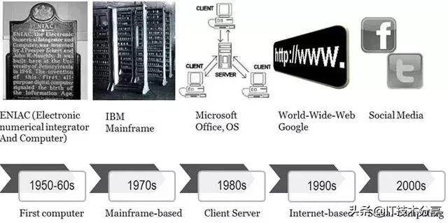
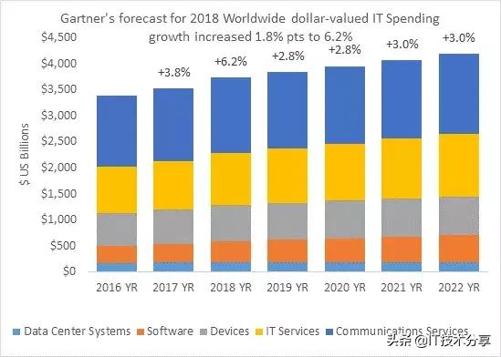

# 如何设计一个优秀的分布式系统？重要因素、工具、策略都在这里

IT技术分享 2019-06-01 10:32:02

## **介 绍**

应用程序的组件可能托管在一个功能强大的系统上，该系统由用户自己携带，并且可以和世界各地的应用程序组件或服务进行通信（他们都是数据中心的副本）。

而令人惊讶的是，使用这些应用程序的用户通常并不会对复杂环境的请求作出响应。这样的请求包含了像本地时间、本地天气或前往酒店的方向等等。

让我们慢慢开始介绍，看看使这一切成为可能的工业魔法，并思考开发人员在处理这种复杂性时应该牢记哪些思想和规则。

## **系统设计的演变史**

图1：系统设计的历史演变

来源：Interaction Design Foundation， The Social Design of Technical Systems: Building technologies for communities

从程序员编写应用程序，手工将它们编译成他们正在使用的机器的语言，然后使用切换开关将单个机器指令和数据直接输入到计算机的内存开始，应用程序开发已经走过了漫长的道路。

随着处理器越来越强大，系统内存和在线存储容量增加，计算机网络能力显著增强，开发方法也产生了变化。现在，数据可以从地球的一段传递到另一端，而速度比早期电脑将数据从系统内存转移到处理器本身的速度还要快！

让我们看看这一惊人转变中的一些亮点。

## **单体设计**

早期的计算机程序都是基于单体设计的，所有的应用程序组件都被设计成在一台机器上执行。这意味着像用户界面（如果用户实际能与程序交互）、应用程序处理规则、数据管理、存储管理和网络管理（如果计算机连接到计算机网路上）等功能都包含在了程序中。

这些虽然编写起来简单，但这些程序会变得越来越复杂，越来越难以形成文档，也难以更新和更改。这时，机器本身对企业来说就成了最大的开销，因此应用程序的设计是为了尽最大可能使用机器。

## **客户端/服务器架构**

随着处理器越来越强大，系统和在线存储容量增加，数据通信更快、更经济，应用程序的设计也随之发展，以适应发展的速度。应用程序逻辑被重构或分解，允许每个应用程序在不同的机器上执行，并且在组件之间插入了不断改进的网络。这使得一些特性可以迁移到当前可用的成本最低的计算环境中。这一演变经历了一下几个阶段：

- **终端和终端模拟**

早期的分布式计算依赖于特别用途的用户访问设备——终端。应用程序必须理解它们使用的通信协议，并直接向设备发出命令。当廉价的个人计算机（PC）出现时，终端被运行终端模拟程序的PC所取代。

此时，应用程序的所有组件仍然驻留在单个大型机或小型计算机上

- 轻量客户端

随着PC的功能越来越强大，支持更大的内部和在线存储，网络性能进一步提高，企业对其应用程序进行了细分或分解，以便在本地PC上提取和执行用户界面。应用程序的其余部分则继续在数据中心的系统上执行。

这些PC通常比它们所替代的终端便宜，并且它们还有额外的优点。这些PC是多功能设备，它们可以运行在它们所替换的终端上无法运行的、却能提高办公效率的应用程序。这种组合促使企业在更新或刷新应用程序时，开始倾向于客户端/服务器应用体系结构。

- 中型客户端

PC的发展仍在快速进行。一旦出现了更强大、存储容量更大的系统，企业就会使用它们，将更多的处理操作从数据中心昂贵的系统迁移到便宜的用户办公桌上。这时，用户界面和一些计算任务就迁移到了本地的PC上。

这样大型机和小型计算机（现在成为服务器）就有了更长的使用寿命，从而降低了企业总体的计算成本。

- 重型客户端

随着PC变得越来越强大，更多的应用程序度可以从后端服务器迁移过来。在这里，除了数据和存储管理功能之外的所有功能都已迁移。

- 进入互联网和万维网

这时，公共互联网和万维网出现了。客户端/服务器计算的方式仍然在使用。为了降低总体成本，一些企业开始重新架构它们的分布式应用程序，便于使用标准的internet协议进行通信，并使用Web浏览器代替之前定制的用户界面功能。后来，一些应用程序的特性通过Javascript语言重新编写，这样它们就可以在客户端的计算机上本地执行。

- 服务器的改进

行业创新并不仅仅关注客户端侧的通信链路，对服务器也做了很大的改进。企业开始利用许多更小、更便宜的符合行业标准的服务器，通过它们强大的功能来支持部分或者全部原来基于大型机的功能。这样它们可以减少需要部署的昂贵主机系统的数量。

接着，远程PC就可以和许多服务器通信，每个服务器都支持自己的应用程序组件。在此环境中使用了专用的数据库和文件服务器。之后，再将其他应用程序功能迁移到应用程序服务器。

网络是另一个业界高度关注的领域。企业开始使用提供防火墙以及其他安全功能的专用网络服务器、文件缓存功能来加速应用程序的数据访问，电子邮件服务器、web服务器、web应用程序服务器、分布式命名服务器这些服务器跟踪和控制用户凭证，用于访问数据和应用程序。封装在设备服务器中的网络服务列表一直在增长。

## **基于对象的开发**

PC和服务器功能的快速变化，加上处理能力、内存和网络这三者的价格的大幅下降，这些都对应用程序开发产生了重大影响。IT领域中最大的成本开销不再是硬件和软件，而是变成了通信、IT服务（员工）、电力以及冷却系统。

软件开发、软件维护和IT操作出现了新的重要性，开发过程也发生了变化以迎合新的形势，即系统便宜，而人员、通信和电力越来越贵。

图2：全球IT花费预测

企业希望通过改进数据和应用程序架构来充分发挥员工的价值。其结果就是面向对象的应用程序和开发方法。许多编程语言，例如下面的语言，都支持这种方式：

C++、C#、COBOL、Java、PHP、Python、Ruby

在定义和记录数据结构时，应用程序开发者的编写变得更加系统化来适应变化。这种方式还使得维护和改进应用程序更加容易。

## **开源软件**

Opensource.com为开源软件提供了以下定义：“开源软件是带有源代码的软件，任何人都可以检查、修改和增强代码。”“而有些软件的源代码只有创建它的个人、团队或组织才能修改——并且保有对它的独占控制。人们称这种软件为‘专有’或‘闭源’软件。”

只有专有软件的原始作者才能合法地复制、检查和修改该软件。为了使用专有软件，计算机用户必须同意（通常通过接受首次运行该软件时显示的许可证），如果软件作者没有明确允许的话，他们不会对软件做任何的修改。微软Office和Adobe Photoshop都是专有软件的例子。

虽然开源软件在计算机早期就已经存在，但直到20世纪90年代，当完整的开源操作系统、虚拟化技术、开发工具、数据库引擎和其他重要功能出现时，它才走到了前台。开源技术通常是基于web和分布式计算的关键组件。其中，以下类别的开源软件很受欢迎：

- 开发工具
- 应用支持
- 数据库（flat文件，SQL，No-SQL，以及内存）
- 分布式文件系统
- 消息传输/队列
- 操作系统
- 聚类

## **分布式计算**

强大的系统、快速的网络以及复杂软件可用性的结合，已经将主要的应用程序开发从单一转向了更加分布式的形式。然而企业已经意识到，有时候从头开始比尝试重构或分解旧的应用程序要更好。

当企业进行创建分布式应用程序的工作时，常常会发现一些有趣的副产品。一个设计得当的应用程序，它已经分解成单独的功能或服务，可以由单独的团队并行开发。

快速应用程序开发和部署（也称为DevOps）就是一种利用新环境的方法。

## **面向服务的架构**

随着行业从客户端/服务器的计算模式，发展到更加分布式的方法，“面向服务的架构”一词出现了。这种方法基于分布式系统的概念、消息队列和交付中的标准，以及将XML消息传递作为共享数据和数据定义的标准方法。

各个应用程序的功能被打包成面向网络的服务，这些服务接收一条消息，请求它们执行特定的服务，在它们执行服务之后，将响应发送回请求该服务的函数。

这种方法还提供了另一个好处，即可以将给定的服务托管在网络的多个位置。这既提高了整体性能，又增强了可靠性。

除此之外，现在还有很多工作负载管理工具，它用于接收服务请求、检查可用容量、将请求转发给具有最大可用容量的服务，然后将响应发送回请求者。如果特定的服务器没有及时响应，工作负载管理器会简单地向服务转发另一个实例。它还会将没有响应的服务标记为失败，并且在它收到一条表明服务仍在运行的消息之前，不会向它发送额外的请求。

## **设计分布式系统的重要考虑因素**

现在我们已经走过了50多年的计算机历史，下面让我们来看看分布式系统开发人员的一些经验法则。需要考虑的东西很多，因为分布式解决方案可能有组件和服务在许多地方、不同类型的系统中运行，而且必须来回传递消息才能执行工作。要想成功创建这些解决方案，谨慎思考是必须的。除此之外还必须为所使用的每种主机系统、开发工具和消息传递系统提供专门的知识。

### **确定需要做什么**

我们首先要考虑的事情，是我们究竟需要完成什么。虽然这听起来很简单，但却非常重要。

令人惊讶的是，许多开发人员在知道具体需要什么之前就开始构建东西。通常情况下，这意味着他们构建了不必要的功能，浪费了时间。引用Yogi Berra的话就是：“如果你不知道自己要去哪里，你最终会去往别的地方”。

首先需要知道要做什么，已经有哪些工具和服务可用，以及使用最终解决方案的人应该看到什么。

### **交互和批处理**

快速响应和低延迟常常是我们的需求，因此比较明智的做法是考虑在用户等待时应该做什么，以及可以将什么放入批处理过程中，而这些批处理执行在事件驱动或时间驱动的计划中。

在考虑了功能的初始分割之后，比较好的做法是计划何时需要执行后台、批处理进程、这些功能操作哪些数据、以及如何确保这些功能是可靠的、何时可用以及如何防止数据丢失。

### **功能应该托管在哪里**

只有在详细计划了“完成什么”之后，才应该考虑“在哪里”以及“如何做”。开发人员有各自最喜欢的工具和方法，并且经常会调用它们，即使可能不是最佳的选择。Bernard Baruch说过：“如果你只有一把锤子，那么所有东西看起来都像钉子”。

了解企业开发的企业标准也很重要。仅仅因为工具目前很流行就选择它是不明智的。这个工具可以完成这些工作，但是需要记住的是，它构建的所有东西都需要维护。如果你构建了一些只有自己才能理解或者维护的东西，那么在你职业生涯的剩下时间中，你可能已经把自己束缚在这一功能上了。我自己也有过这种经历，自认为自己创建的功能工作正常、轻量而且可靠。但在我离开那家公司后的十年里，我不断地收到关于这些功能的电话，因为后来的开发人员无法理解这些功能是如何实现的，而我写的文件又早就被丢掉了。

在分布式解决方案中，每个功能或服务都应该分别考虑。该功能应该在企业数据中心？还是使用云服务提供商？还是两者兼有？另外还要考虑到在某些行业中存在法规要求，这些要求指导我们选择需要在何处以及如何维护和存储数据。

其他需要考虑的东西还包括：

- 该功能的主机应该是什么类型的系统。有没有系统架构更合适该功能？系统应该基于ARM、x86、SPARC、Precision、Power，还是大型机？
- 会有某种特定的操作系统为该功能提供了更好的计算环境吗？Linux、Windows、UNIX、System I，或是System Z会是更好的平台吗？
- 某特定的开发语言是否更适合该功能？它是一种特定类型的数据管理工具吗？该用Flat文件、SQL数据库还是No-SQL数据库？还是说非结构化的存储机制更好？
- 功能应该托管在虚拟机中还是容器中，方便迁移、自动化以及编排吗？

在本世纪初，运行Windows或Linux虚拟机往往是首选。虽然它们为方法提供了重要的隔离，并且在必要时很容易重启或移动他们，但是他们的处理、内存以及存储要求相当高。容器是处理虚拟化的另一种方式，它提供了类似的隔离级别，能够重新启动和迁移方法，而且消耗的处理能力、内存或存储都要小得多。

## **性能**

性能是另一个重要的考虑因素。在定义组成解决方案的功能或服务时，开发人员应该注意它们是否有重要处理、内存或存储需求。仔细研究这些问题非常重要，这样才能知道是否可以进一步细分或分解这些功能。

进一步的分割会允许并行处理的增加，这样能很大可能地提供性能上的改进。当然，这样做的代价是，它也增加了复杂性，可能会更加难以管理和保证安全。

### **可靠性**

在高风险的企业环境中，解决方案的可靠性至关重要。开发人员必须考虑何时可以要求人们重新输入数据、重新运行功能，或者何时功能将不可用。

数据库开发人员在20世纪60年代就遇到了这个问题，并开发了原子功能的概念。也就是说，功能必须完成或者部分的更新必须回滚，以使得数据处于功能开始前的状态。分布式系统也需要这种思维方式，确保即使在出现服务故障和事物中断的情况下也能保证数据完整性。

例如，在关键消息传递系统中，在确认消息已经被接收方收到之前，消息必须被一直存储好。如果消息没能成功收到，则必须重新发送原始消息，并向系统管理报告故障。

### **可管理性**

尽管没有核心应用程序功能那么有趣，但可管理性仍然是保证应用程序正常运转的关键因素。所有分布式功能都必须得到充分的检测，让管理员了解每个功能的当前状态，并在需要时更改功能的参数。毕竟，分布式系统是由比它们所替代的单片系统更多的活动部件组成的。开发人员必须时刻注意让这个分布式计算环境易于使用和维护。

这给我们带来了一个绝对的要求，即必须对所有分布式功能进行充分的工具化，让管理员了解到它们的当前状态。毕竟，分布式系统本质上比它们所替代的单片系统更加复杂，并且有更多的活动部件。

### **安全性**

确保分布式系统安全性，比单片环境中安全问题的难度高了一个数量级。每个功能都必须单独保密，功能之间的通信连接也必须保密。随着网络规模和复杂性的增长，开发人员必须考虑如何控制对功能的访问，如何确保只有授权用户才能访问这些功能，以及如何将服务与其他服务隔离开来。

安全性是一个关键元素，必须添加到每个功能中而不是之后才加入。必须避免和汇报对功能和数据的未经授权访问。

### **隐私性**

关于隐私性的话题有越来越多的规范。对与每个面向客户系统的开发人员来说，欧盟的GDPR以及美国的HIPPA法规都是重要的考虑因素。

### **掌控复杂性**

开发人员必须花时间考虑如何将复杂计算环境中全部的内容组合在一起。服务应该被封装成一个单一的功能 ，或者少量紧密相关的功能，想要维护这样的规则非常困难。如果一个功能在多个地方实现，那么想要维护和更新就会很困难。当一个功能的实例没有更新会怎样？这个问题非常具有挑战性。

这就意味着，对于复杂应用程序的开发人员来说，维护一个用于显示每个功能所在位置的可视化模型就非常有用了，这样，如果规则或业务需求发生变化，就可以对其进行更新。

通常情况下，开发人员就必须花时间记录他们做了什么，什么时候做了更改，以及这些更改的目的是什么，这样其他人员就不必为了了解一个功能在哪里或者它是如何工作的而费心思去理解成堆的代码。

要成为分布式系统的架构师，开发人员就必须要掌握复杂性。

## **开发人员必须掌握的方法**

开发人员必须掌握分解和重构应用程序体系结构，从团队的角度思考问题，并提高他们在快速应用程序开发和部署（DevOps）方法方面的技能。毕竟，他们必须能够系统地思考哪些功能彼此独立，哪些功能依赖于其他功能的输出来工作。依赖于其他功能的这部分功能最好作为单个服务来实现。将它们作为独立的功能实现，可能会产生不必要的复杂性，导致应用程序性能低下，并且给网络带来不必要的负担。

### **虚拟化技术涵盖了许多基础**

虚拟化是一个比虚拟机软件或容器更大的类别。这两个功能都被认为是虚拟化技术。在目前的应用程序中，至少有7种不同类型的虚拟化技术在使用。虚拟化技术可用于增强用户访问应用程序的方式、应用程序在何处以及如何执行、处理在何处以及如何执行、网络功能怎么样、数据在哪里以及如何存储、安全性如何实现以及管理功能如何实现。下面的虚拟化技术模型可能有助于开发人员理解虚拟化的概念。

图3：虚拟化系统的架构

### **从软件定义的解决方案角度考虑**

对于开发人员来说，从“软件定义的”解决方案的角度来考虑也是非常重要的。这也就是说，将控制从实际的处理中分割出来，这样功能就可以被自动化以及编排了。

#### **有哪些工具和策略可供使用**

当开发人员步入这个复杂的世界时，他们不应该觉得自己是独立的。供应商和开源社区提供了许多强大的工具。各种形式的虚拟化技术都可以成为开发人员最好的朋友。

#### **虚拟化技术是你最好的朋友**

- **容器**让轻松地开发功能成为可能，这些功能可以在不互相干扰的情况下执行，并且可以根据工作负载需求从一个系统迁移到另一个系统。
- **编排技术**让控制多个功能成为可能，确保它们运行良好且可靠。它还可以在失败的情况下重启或移动它们。
- **支持增量开发**：功能可以并行开发，并在准备好时部署。它们还可以用新特性进行更新，而不需要在其他地方进行更改。
- **支持高度分布式系统**：既可以在企业数据中心本地部署功能，也可以在云服务提供商的数据中心远程部署功能。

### **从服务的角度考虑**

这意味着开发人员必须考虑服务以及服务之间如何通信。

#### 定义良好的API

定义良好的API可以让多个团队更好地协同工作，并且确保一切都能按照计划组合在一起。通常情况下这意味着要做更多的前期工作，但最终是非常值得的。为什么？因为整体开发可以更快。而且它还可以减少文档工作的工作量。

#### 支持快速应用程序开发

这种方法对于快速应用程序开发和快速原型开发（即DevOps）来说也是完美的。如果执行得当，DevOps还可以只需很短的部署时间。

### **从标准的角度思考**

分布式系统的开发人员应该充分考虑多供应商的国际标准，而不是单单依赖于一个供应商。这种方法避免了厂商的锁定，并且可以找到在不同领域最出彩的那个供应商。

## **总 结**

值得注意的一点是，快速应用程序开发和分布式系统部署的指南，是从“慢慢来”开始的。最明智的做法就是先计划好你要去哪里，你要做什么，否则你很可能最终没能达成目标、开发预算耗尽并且毫无成果。