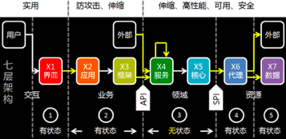
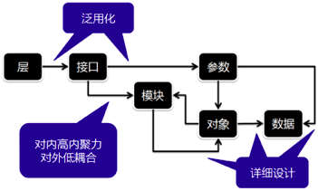
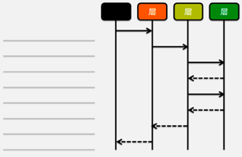
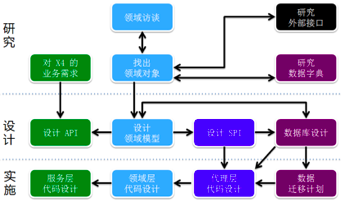

# [如何设计分层架构和交互接口 API ?](https://segmentfault.com/a/1190000022011879)

## 架构设计流程

在「 [如何建立架构师的立体化思维？](https://segmentfault.com/a/1190000021998729) 」这篇文章中，[老兵哥](https://link.segmentfault.com/?enc=rXDKj6KsQZc2HyvTEDJIHg%3D%3D.wSXOy6JelD6xI9GsbqNYHEq674Y8%2BL9VdOeRe%2BsFf%2BQ%3D) 跟大家一起聊到架构设计涉及业务、技术、系统和时间等几个维度，也知道从技术维度可以将应用分成七层，那具体怎么做呢？今天我们继续来聊聊分层架构的设计流程，以及接口设计方法等内容。通常，我们可以将分层架构的设计流程分解为下列 4 个步骤：

1. 结合现实情况，将系统划分成多个层次。
2. 确定层与层之间的关系，梳理出层与层之间的交互接口。
3. 将功能相近的接口划归到一个模块，确保模块高内聚，对外低耦合。
4. 在此基础上进一步明晰接口的参数列表。

仅仅四个步骤就完成了架构设计吗？这会不会太简单空洞了呢？各位看官，不要着急，请听蔡老师慢慢道来，每个步骤都有极具可操作性的方法及工具。

## 层次的切分方法

面对一个庞然大物，你该如何下手呢？不用担心，这已经给你准备了庖丁解牛的方法，轻轻松松把一个复杂的大系统变得可以掌控了。

- **第一刀**：按照这套方法论来进行架构设计，最理想的情况是将X轴切分成七层。而第一刀应该先切在业务和领域之间，即通过API把两边解耦。交互和业务跟用户关联度高，经常随需求变化而改动，而领域和资源相对比较稳定。
- **第二刀**：考虑到要完成某些业务功能，系统可能需要调用外部系统协同完成，为了保证领域层相对稳定，我们需要隔离外部系统或数据持久层变化带来的影响，那第二刀应该切在领域和资源之间。
- **第三刀**：考虑到同样的一个业务可能会有多套界面，例如有Web版、桌面版、移动版等，为了提高重用，隔离变更，那接下来要把交互和业务切开。

通过上面这“温柔的三刀”，我们就可以把一个大块头切分成七个层次。

## 接口的设计方法

在确定分层之后，我们可以把每个业务需求的交互时序图画出来，而分层就是交互时序图的主角。这时候我们就可以清晰的找出层与层之间的交互接口，以及可以初步确定每个接口的参数列表。

考虑到API、领域模型接口、SPI是最为关键的接口，那良好的设计就显得更为重要。那如何能够设计出良好的接口呢？在这点上，蔡老师也有非常丰富的经验可以分享：

1. **找出领域对象**：通过多轮领域访谈，与业务专家一起分析出领域对象。另外，也可以通过研究外部接口及数据字典来明晰领域对象，反过来也可以丰富外部接口和数据字典。
2. **设计领域模型、资源模型、数据模型**：在挖掘领域对象的过程中，我们就可以开始设计领域模型了，确定领域对象之间的关联关系。当关联关系逐步清晰之后，我们还可以根据关联关系的密集程度对领域对象的组织方式做一些调整，找出核心的领域对象集合，其他领域对象可以归类到围绕核心领域对象集合的卫星集合里面。通过多轮调整，我们可以得到一个能够映射业务、关系简化的领域模型。然后兵分两路启动资源模型和数据模型的设计工作。上述三个模型之间的关系及区别，请参见下文。
3. **设计领域模型接口、API、SPI、数据库**：在设计领域模型接口时，我们要尽量做到不多不少，这些接口都是对外提供服务所必须的，也是全面的，并且粒度要细。在设计API时，我们要考虑内外客户的需求和特点，做到方便易用，可以参考RESTful API设计相关的资料。在设计SPI时，我们要尽量隔离资源层对领域层的影响。

在完成上述工作之后，我们就可以进入实施阶段，开始启动代理层、核心层和服务层的代码设计工作。另外，如果是对线上已有系统进行升级，那还要开始制定数据的迁移计划。

### 三个模型之间的关系及区别

- **领域模型**，映射特定业务领域当中核心领域对象及其关联关系，这些对象及关系的存在都是完成业务规则所必须的，甚至是法律法规等明文要求的，不会轻易变动。
- **资源模型**，基于领域模型，从为内外客户提供服务的角度分析定义出来的，包含了资源对象及其关联关系。根据内外客户的特点及需求，我们可以调整资源模型中的内容。
- **数据模型**，基于领域模型，从存储（持久化或缓存）信息的角度分析定义出来的，包含数据对象及其关联关系。根据存储载体的特点及需求，我们可以调整数据模型中的内容。