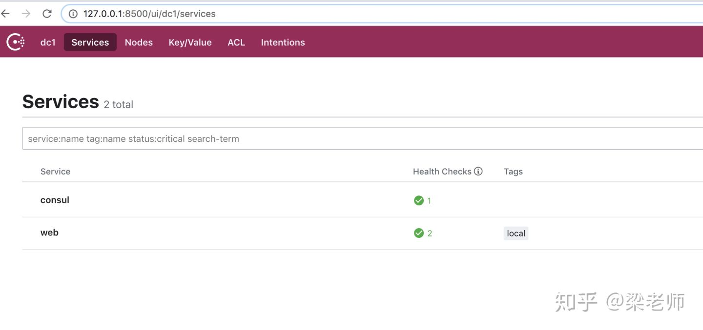
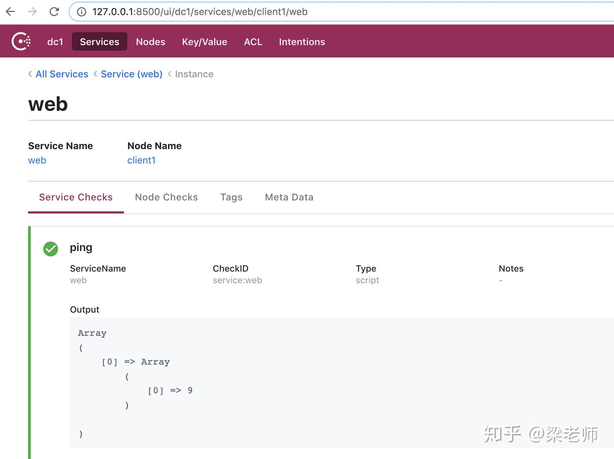

# 带你入门consul

consul用于微服务下的服务治理，主要特点有：服务发现、服务配置、健康检查、键值存储、安全服务通信、多数据中心等。

什么叫服务治理发现？起初我们的服务比较单一，各服务之间通过接口就能访问。后面服务越来越复杂出现了分布式，为了不引起单点问题，必然是多服务部署，如果还用原来的方式直接连接，那么在某个服务挂掉或者修改了信息，就会导致连接失败。如果连接端能够不去关心具体的服务配置，他只要连接到那个服务，后续的工作由其它服务保证，包括负载均衡、健康检查等，保证总有可用的连接那就行了，consul就是做这个的，当然，它的功能远不止这些，这里只是以服务发现为例。

与它同类的东西，还有Eureka、zooKeeper、etcd等也能做这些事，说不上谁好谁坏，看场景挑合适的吧，不过Eureka现在已经闭源了，这个还是建议不要去用这个了。

### consul下载

consule的安装超级简单，去官方下载地址[Download](https://link.zhihu.com/?target=https%3A//www.consul.io/downloads.html) ，找到自已对应系统的压缩包，解压后里面就一个文件consul, 将这个文件放到你的PATH中，就能直接用了。

验证下安装成功没有, 看到下面的提示就行了。

```text
$ consul  version
Consul v1.7.2
Protocol 2 spoken by default, understands 2 to 3 (agent will automatically use protocol >2 when speaking to compatible agents)
```

### consul的CLI操作

consul提供了cli的命令操作，如启动代理、键值存储、注册／注销服务、加入集群等，这个consul提供的HTTP的API操作也是一样的，只是这里都是shell的操作。

```text
$ consul
Usage: consul [--version] [--help] <command> [<args>]

Available commands are:
    acl            Interact with Consul's ACLs
    agent          Runs a Consul agent
    catalog        Interact with the catalog
    config         Interact with Consul's Centralized Configurations
    connect        Interact with Consul Connect
    debug          Records a debugging archive for operators
    event          Fire a new event
    exec           Executes a command on Consul nodes
    force-leave    Forces a member of the cluster to enter the "left" state
    info           Provides debugging information for operators.
    intention      Interact with Connect service intentions
    join           Tell Consul agent to join cluster
    keygen         Generates a new encryption key
    keyring        Manages gossip layer encryption keys
    kv             Interact with the key-value store
    leave          Gracefully leaves the Consul cluster and shuts down
    lock           Execute a command holding a lock
    login          Login to Consul using an auth method
    logout         Destroy a Consul token created with login
    maint          Controls node or service maintenance mode
    members        Lists the members of a Consul cluster
    monitor        Stream logs from a Consul agent
    operator       Provides cluster-level tools for Consul operators
    reload         Triggers the agent to reload configuration files
    rtt            Estimates network round trip time between nodes
    services       Interact with services
    snapshot       Saves, restores and inspects snapshots of Consul server state
    tls            Builtin helpers for creating CAs and certificates
    validate       Validate config files/directories
    version        Prints the Consul version
    watch          Watch for changes in Consul
```

### Agent启动

consul是通过Agent来运行的，Agent又分为Server Agent和Client Agent两种类型，这两类型基本上是没区别的，Server Agent会将服务的消息存储起来，至少要启动一个Server Agent，为了防止单点，集群环境中推荐3-5个。

Client Agent主要用于注销服务、健康检查及转发Server Agent的查询等，它相当于一个代理，所以他必须在集群的每台主机上都要运行。

先看下Agent的常用配置

```text
$ consul agent --help
```

- --server 定义运行server agent
- --data-dir 配置consul数据存储路径
- --bootstrap-expect ：期望的server节点数目，consul一直等到指定sever数目的时候才会引导整个集群
- --bind：该地址用来在集群内部的通讯，集群内的所有节点到地址都必须是可达的，默认是0.0.0.0
- --node：节点在集群中的名称，在一个集群中必须是唯一的，默认是该节点的主机名
- --ui： web的管理ui,查看服务和节点
- --config-dir：配置文件目录，所有以.json结尾的文件都会被加载，可以是服务或consul自身的配置
- --client：提供HTTP、DNS、RPC等服务，默认是127.0.0.1,不对外提供服务，如果需要则改成0.0.0.0

我本地没有虚拟机，也没用Docker操作，所以，如果要同时启动Server和Client的话，我就用的改端口的方式，当然生产环境肯定就没有这个了，它都是一台机器启动一个Agent, 这里只是测试用的。

启动一个Server Agent

```text
$ consul agent --server=true --ui=true --data-dir=/tmp/consul --node=server1 --dev
```

上面的 `--server`表示以server方式，`--ui` 会开启一个web ui管理界面, `--dev` 表示开发者模式，不需要ACL验证。不然那个web ui的打不开会报没有权限。

```text
==> Starting Consul agent...
           Version: 'v1.7.2'
           Node ID: 'f6272369-098a-1412-ed86-6e2076c1e5e4'
         Node name: 'server1'
        Datacenter: 'dc1' (Segment: '<all>')
            Server: true (Bootstrap: false)
       Client Addr: [127.0.0.1] (HTTP: 8500, HTTPS: -1, gRPC: 8502, DNS: 8600)
      Cluster Addr: 127.0.0.1 (LAN: 8301, WAN: 8302)
           Encrypt: Gossip: false, TLS-Outgoing: false, TLS-Incoming: false, Auto-Encrypt-TLS: false

==> Log data will now stream in as it occurs:

    2020-04-01T14:28:52.579+0800 [DEBUG] agent.tlsutil: Update: version=1
    2020-04-01T14:28:52.580+0800 [DEBUG] agent.tlsutil: OutgoingRPCWrapper: version=1
    2020-04-01T14:28:52.580+0800 [INFO]  agent.server.raft: initial configuration: index=1 servers="[{Suffrage:Voter ID:f6272369-098a-1412-ed86-6e2076c1e5e4 Address:127.0.0.1:8300}]"
    2020-04-01T14:28:52.580+0800 [INFO]  agent.server.raft: entering follower state: follower="Node at 127.0.0.1:8300 [Follower]" leader=
    2020-04-01T14:28:52.581+0800 [INFO]  agent.server.serf.wan: serf: EventMemberJoin: server1.dc1 127.0.0.1
    2020-04-01T14:28:52.581+0800 [INFO]  agent.server.serf.lan: serf: EventMemberJoin: server1 127.0.0.1
    2020-04-01T14:28:52.581+0800 [INFO]  agent.server: Adding LAN server: server="server1 (Addr: tcp/127.0.0.1:8300) (DC: dc1)"
    2020-04-01T14:28:52.581+0800 [INFO]  agent.server: Handled event for server in area: event=member-join server=server1.dc1 area=wan
    2020-04-01T14:28:52.581+0800 [INFO]  agent: Started DNS server: address=127.0.0.1:8600 network=tcp
    2020-04-01T14:28:52.582+0800 [INFO]  agent: Started DNS server: address=127.0.0.1:8600 network=udp
    2020-04-01T14:28:52.582+0800 [INFO]  agent: Started HTTP server: address=127.0.0.1:8500 network=tcp
    2020-04-01T14:28:52.582+0800 [INFO]  agent: Started gRPC server: address=127.0.0.1:8502 network=tcp
    2020-04-01T14:28:52.582+0800 [INFO]  agent: started state syncer
==> Consul agent running!
```

启动Client Agent

```text
$ consul agent   --data-dir=/tmp/consul_client --join=127.0.0.1:8301 --serf-lan-port=8303 --serf-wan-port=8305  --dns-port=8601 --server-port=8304   --http-port=8503  --server=false   --config-dir=./consul.d  --enable-script-checks   --node=client1
```

上面有一个`--join`表示加入到集群中，写server agent的地址就行。 config-dir的配置目录下面一个服务的配置

```text
{
    "service":{
        "name":"web",
        "tags":[
            "local"
        ],
        "port":80,
        "check":{
            "name":"ping",
            "args":["/usr/bin/curl","-s", "http://localhost/"],
            "interval":"10s"
        }
    }
}
```

上面的命令运行后，会启动一个名字为“web"的服务，并提供健康检查。

```text
==> Starting Consul agent...
           Version: 'v1.7.2'
           Node ID: 'e1c8f283-f5c4-27e7-c29c-64666df1c52b'
         Node name: 'client1'
        Datacenter: 'dc1' (Segment: '')
            Server: false (Bootstrap: false)
       Client Addr: [127.0.0.1] (HTTP: 8503, HTTPS: -1, gRPC: -1, DNS: 8601)
      Cluster Addr: 192.168.0.103 (LAN: 8303, WAN: 8305)
           Encrypt: Gossip: false, TLS-Outgoing: false, TLS-Incoming: false, Auto-Encrypt-TLS: false

==> Log data will now stream in as it occurs:

    2020-04-01T00:00:49.227+0800 [INFO]  agent.client.serf.lan: serf: EventMemberJoin: client1 192.168.0.103
    2020-04-01T00:00:49.231+0800 [INFO]  agent: Started DNS server: address=127.0.0.1:8601 network=udp
    2020-04-01T00:00:49.232+0800 [INFO]  agent: Started DNS server: address=127.0.0.1:8601 network=tcp
    2020-04-01T00:00:49.232+0800 [INFO]  agent: Started HTTP server: address=127.0.0.1:8503 network=tcp
==> Joining cluster...
    2020-04-01T00:00:49.232+0800 [INFO]  agent: (LAN) joining: lan_addresses=[127.0.0.1:8301]
    2020-04-01T00:00:49.233+0800 [WARN]  agent.client.memberlist.lan: memberlist: Refuting a dead message (from: client1)
    2020-04-01T00:00:49.233+0800 [INFO]  agent.client.serf.lan: serf: EventMemberJoin: server1 127.0.0.1
    2020-04-01T00:00:49.233+0800 [INFO]  agent.client: adding server: server="server1 (Addr: tcp/127.0.0.1:8300) (DC: dc1)"
    2020-04-01T00:00:49.233+0800 [INFO]  agent: (LAN) joined: number_of_nodes=1
    2020-04-01T00:00:49.233+0800 [INFO]  agent: Join completed. Initial agents synced with: agent_count=1
    2020-04-01T00:00:49.233+0800 [INFO]  agent: started state syncer
==> Consul agent running!
    2020-04-01T00:00:49.235+0800 [INFO]  agent: Synced node info
    2020-04-01T00:00:49.235+0800 [INFO]  agent: Synced service: service=web
    2020-04-01T00:00:53.316+0800 [INFO]  agent: Synced check: check=service:web
```

查看下，启动的Agent

```text
$ ./consul members
Node     Address         Status  Type    Build  Protocol  DC   Segment
server1  127.0.0.1:8301  alive   server  1.7.2  2         dc1  <all>
client1  127.0.0.1:8303  alive   client  1.7.2  2         dc1  <default>
```

### web管理界面

可以查看服务的定义和节点，访问[web管理界面]([http://127.0.0.1:8500/ui](https://link.zhihu.com/?target=http%3A//127.0.0.1%3A8500/ui))








### HTTP API

consul除了提供DNS外，还提供Http的操作，如注册服务、查看节点、查看服务信息等，一般都是通过API来操作的。

如我上面定义的 "web"服务，通过下面的API查询，就能得到具体的IP地址和端口，这样就能直接连到那台服务了。

其它更详情API操作，可以自已去参照官方的文档 [API](https://link.zhihu.com/?target=https%3A//www.consul.io/api/index.html)

```text
$ curl http://127.0.0.1:8500/v1/catalog/service/web
[
    {
        "ID": "e1c8f283-f5c4-27e7-c29c-64666df1c52b",
        "Node": "client1",
        "Address": "127.0.0.1",
        "Datacenter": "dc1",
        "TaggedAddresses": {
            "lan": "127.0.0.1",
            "lan_ipv4": "127.0.0.1",
            "wan": "127.0.0.1",
            "wan_ipv4": "127.0.0.1"
        },
        "NodeMeta": {
            "consul-network-segment": ""
        },
        "ServiceKind": "",
        "ServiceID": "web",
        "ServiceName": "web",
        "ServiceTags": [
            "local"
        ],
        "ServiceAddress": "",
        "ServiceWeights": {
            "Passing": 1,
            "Warning": 1
        },
        "ServiceMeta": {},
        "ServicePort": 80,
        "ServiceEnableTagOverride": false,
        "ServiceProxy": {
            "MeshGateway": {},
            "Expose": {}
        },
        "ServiceConnect": {},
        "CreateIndex": 15,
        "ModifyIndex": 15
    }
]
```