# 开放API网关实践

# 一、 设计一个API网关

> 如何设计实现一个轻量的开放API网关.

## 前言

随着业务的发展, 所对接的第三方越来越多, 各个业务系统面临着同样一个问题: `如何让第三方安全快速接入`. 此时有一个集验签、鉴权、限流、降级等功能于一身的API网关服务变得尤为重要.

接下来将分享如何设计实现一个轻量级的API开放网关, 包括接口设计、数据库设计、签名验签方案、鉴权等. 本文侧重于总体设计, 具体实现细节将陆续在后续的文章中分享.

## API网关简介

API网关在微服务中尤为重要, 其抽象了鉴权、限流、降级等各个业务系统通用的功能. 作为众多内部业务系统外的一层屏障.

## 基本需求

1. 签名及验签
2. 鉴权
3. 路由
4. 权限及资源管理

## 总体设计

验签、鉴权等功能以职责链的方式进行处理, 网关根据配置进行路由并附加参数用以配合业务系统进行处理(如数据过滤等). 简要请求处理流程如下：

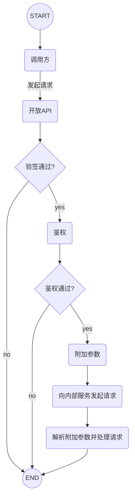

## 接口设计

网关最基本的功能是转发请求, 常见的方式是根据配置中的路由规则将请求转发给内部服务, 如:

将`/order/*`的请求转发给内部的订单系统、`/user/*`的请求转发给内部的用户系统, 这种做法常用于对整个业务系统负责的基础网关.

而本文所设计的是`服务于第三方的开放API网关`, 并未使用上述做法, 而是将请求的资源作为参数放到请求体中, 其原因如下:

1. 开放API服务于第三方, 屏蔽内部路径, 有利于提供命名统一且规范的接口.
2. 请求接口的映射由网关的路由表维护, 内部接口升级甚至切换到新服务对外接口不变.
3. 能够更细粒度地针对接口进行权限控制、限流、统计等.

### 地址

开放API网关对外提供唯一入口, 具体请求的资源作为参数传入.

### 公共参数

为了简化签名和验签的操作, 同时也提高灵活度, 唯一入口的约定了固定的公共参数和返回值, 如下:

#### 公共请求参数

| 参数名称    | 是否必须 |  类型  | 示例                              | 备注                   |
| :---------- | :------: | :----: | :-------------------------------- | :--------------------- |
| app_id      |    是    | string |                                   | 应用ID                 |
| method      |    是    | string | aaa.bbb.ccc                       | 请求方法               |
| charset     |    是    | string | UTF-8                             | 编码                   |
| format      |    是    | string | JSON                              | 业务参数格式           |
| sign_type   |    是    | string | RSA2                              | 签名类型               |
| sign        |    是    | string |                                   | 签名                   |
| timestamp   |    是    | number | 1564929661796                     | 时间戳, 单位: 毫秒     |
| nonce       |    是    | string | 63DCB93D270E44D49499F9E5D55705FE  | 随机字串(建议使用UUID) |
| version     |    是    | string | 1.0                               | 接口版本               |
| biz_content |    是    | string | {"start_time":"1564929661796", …} | 请求业务参数           |

- `app_id`: 应用ID, 应用ID是授权的主体, 是调用方的身份标识
- `method`: 请求方法, 与内部URL对应, 由网关的路由表维护.
- `timestamp`和`nonce`用来防重放攻击.
- `biz_content`: 业务参数, 这个参数将转发给内部业务系统.

#### 公共返回参数

|  参数名称   | 是否必须 |  类型  |           示例            |        备注        |
| :---------: | :------: | :----: | :-----------------------: | :----------------: |
|    code     |    是    | number |             0             |       错误码       |
|   message   |    否    | string |                           |      错误信息      |
|   charset   |    是    | string |           UTF-8           |        编码        |
|   format    |    是    | string |           JSON            |    返回参数格式    |
|  sign_type  |    是    | string |           RSA2            |      签名类型      |
|    sign     |    是    | string |                           |        签名        |
|  timestamp  |    是    | number |                           | 时间戳, 单位: 毫秒 |
| biz_content |    是    | string | {"id":"1564929661796", …} |    返回业务参数    |

- `biz_content`: 返回业务参数, 网关转发业务系统的返回值.

**[版权声明]**
本文发布于[朴瑞卿的博客](https://blog.piaoruiqing.com/), 允许非商业用途转载, 但转载必须保留原作者[朴瑞卿](https://blog.piaoruiqing.com/) 及链接:[https://blog.piaoruiqing.com](https://blog.piaoruiqing.com/).
如有授权方面的协商或合作, 请联系邮箱: [piaoruiqing@gmail.com](mailto:piaoruiqing@gmail.com).

## 签名方案

调用方和服务方均生成`2048`位`RSA`秘钥, 交换公钥. 私钥用于签名, 公钥用于验签, 开放API网关对外接口使用`https`, 故暂不需额外做加密处理.

### 签名算法

| 签名算法名称 | 标准签名算法名称 |                备注                |
| :----------: | :--------------: | :--------------------------------: |
|     RSA2     |  SHA256WithRSA   | 强制要求 RSA 密钥的长度至少为 2048 |

### 签名规则

#### 签名参数内容

剔除`sign`之后的全部参数.

#### 签名参数排序

按照参数名的`ASCII`码递增排序(字母升序排序).

#### 签名生成方式

排序后的参数列表组合成`参数名a=参数值a&参数名b=参数值b&...&参数名z=参数值z`的字符串, 并使用`私钥`生成`sign`.

## 数据库设计

数据库用于存储秘钥权限等配置, 程序和数据库之间有多级缓存用以提高访问速度. 简要ER图如下:

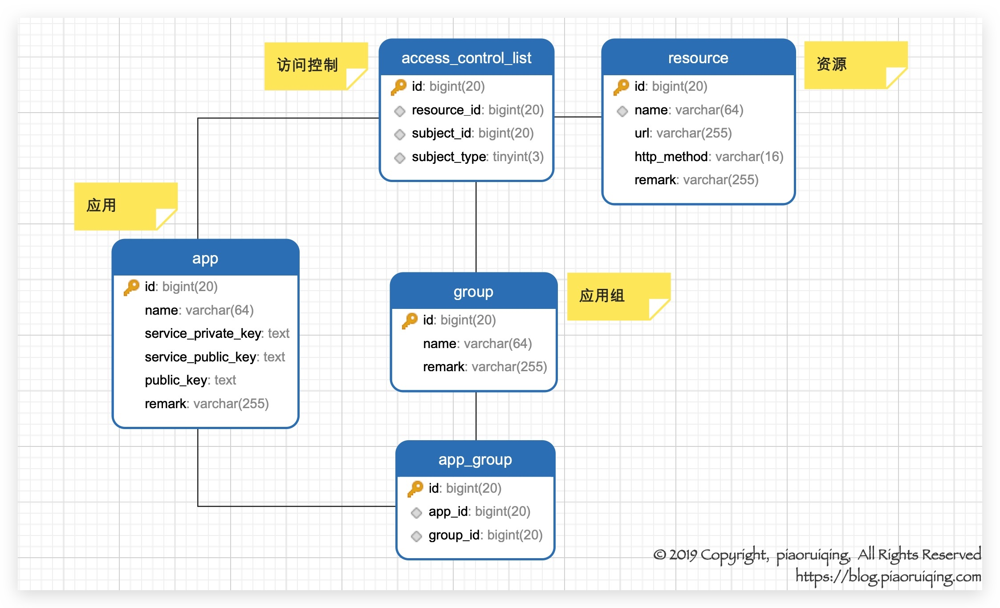

- `app`: 调用方主体, 用于标识请求方身份.
- `group`: 组, `app`分组, 可通过`group`统一进行授权.
- `subject`: 主体(app/group).
- `resource`: 资源, 维护请求资源与内部接口的映射关系, `url`+`http_method` 对应唯一的resource_id.

## 技术选型

网关除了满足功能上的需求外, 性能上的需求也需要着重考虑, 毕竟作为各个业务系统对外的唯一入口, 网关的性能可能会成为整个业务系统的瓶颈. 业务并不复杂, 性能要求高, 响应式编程正是一个不错的选择.

- `Spring WebFlux` + `netty`: 响应式Web框架.
- `Spring Data Reactive Redis` + `Lettuce`: 响应式redis客户端.
- `Guava`: Google工具包, 使用`LoadingCache`作为进程内缓存.

## 结语

网关作为内部系统外面的一层屏障和入口, 除基本功能和性能上的需求外, 监控、统计、日志等都是需要考虑到的问题, 网关方面开源产品众多, 但选择时一定要考虑自身业务, 适合自身的前提下参考各个成熟的方案进行实践。

# 二、重放攻击及防御

## 前言

[上一篇文章《开放API网关实践(一)》](https://blog.piaoruiqing.com/blog/2019/08/05/开放api网关实践/)中的接口设计提到`timestamp`和`nonce`两个参数的作用是用来放重放. 本文就重放攻击及其防御进行探讨. 先抛出两个问题:

- 什么是重放攻击
- 如何防御重放攻击

## 什么是重放攻击(Replay Attacks)

什么是`重放`，先举个例子：

打开浏览器的调试工具并访问一个网站，在网络工具中找到一个请求并右键选择`Replay`。如图：

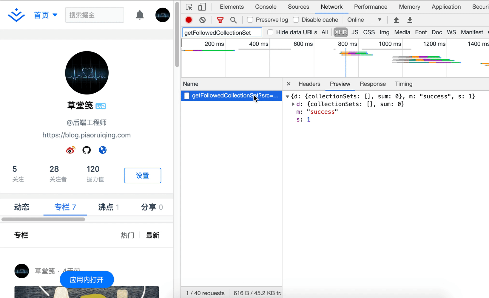

上述的`重放`操作是接口调试中比较常用的手段, 这种操作可以让我们跳过认证信息的生成过程, 直接重复发起多次有效的请求。

而`重放攻击`是一种黑客常用的攻击手段，又称`重播攻击`、`回放攻击`，是指攻击者发送目的主机`已接收过的数据`，以达到欺骗系统的目的，主要用于身份认证过程，破坏认证的正确性。

举个易懂的例子:

- 服务端提供了打款接口，用户A向服务端请求发起一次打款5元的操作(附带了签名并进行了加密)，服务端接收到了数据并正确打款给用户B。
- 但这个请求被黑客拦截到，黑客将请求原封不动地向服务器发送，服务器多次错误地打款给用户B。(当然，这些都是是建立在服务端的付款没做幂等等防范措施、安全级别较低的前提下)
- 尽管A发起的请求有签名和加密, 但B无需破解这个数据, 只是将`同样的数据`重复发给服务器就能达到欺骗的目的.

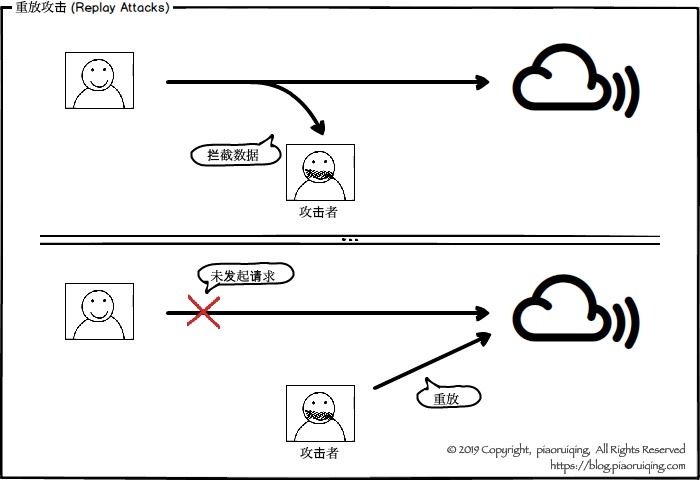

## 模拟重放攻击

### 实验器材

| 序号 |    名称     | 数量 |                        备注                         |
| :--: | :---------: | :--: | :-------------------------------------------------: |
|  1   |   服务器    |  2   | 10.33.30.101 – 真实服务器 10.33.30.100 – 伪造服务器 |
|  2   |    域名     |  1   |     replay-test.piaoruiqing.com (10.33.30.101)      |
|  3   | `DNS`服务器 |  1   |                  用来模拟`DNS`劫持                  |

### 实验步骤

1. 启动服务器, 请求接口并收到响应数据.
2. 劫持DNS(在路由器中修改DNS服务器地址模拟劫持), 并拦截请求数据.
3. 向服务器重复发送拦截到的数据(重放攻击).

### 过程记录

#### 准备工作

DNS配置，将域名`replay-test.piaoruiqing.com`指向内网中服务器的IP， 并启动服务器。

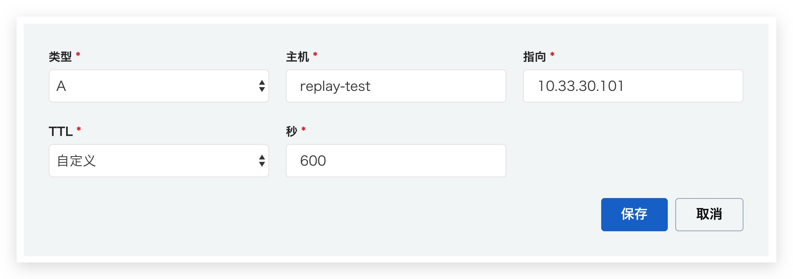

#### 正常请求

使用`postman`发起一个正常的请求, 其中签名已在`Pre-request-script`中生成。

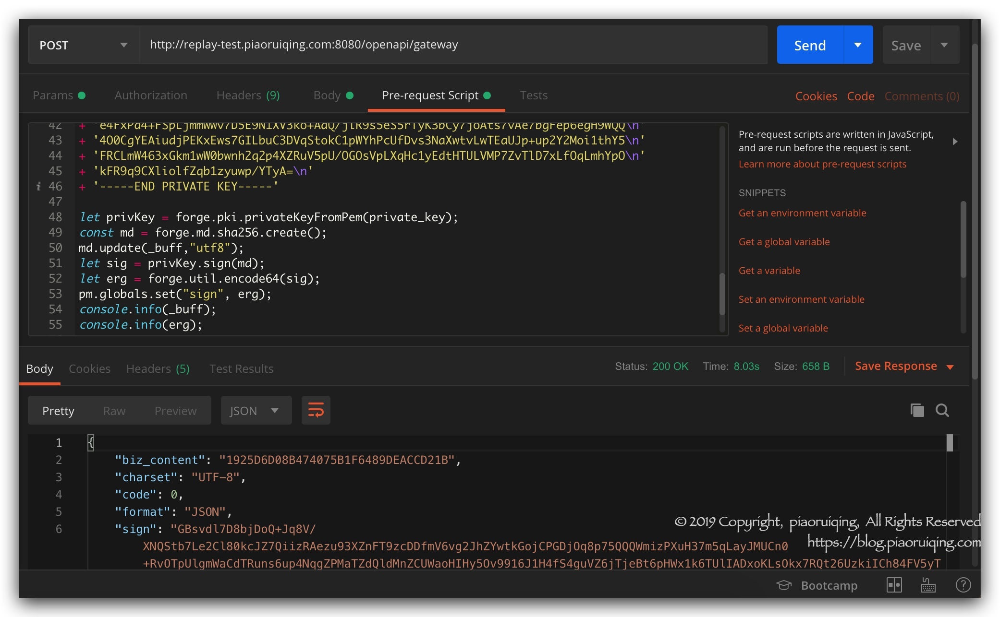

#### 通过DNS劫持来拦截数据

修改内网的`dnsmasq`配置，将域名`replay-test.piaoruiqing.com`指向伪造的服务器`10.33.30.100`。

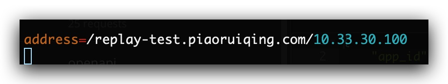

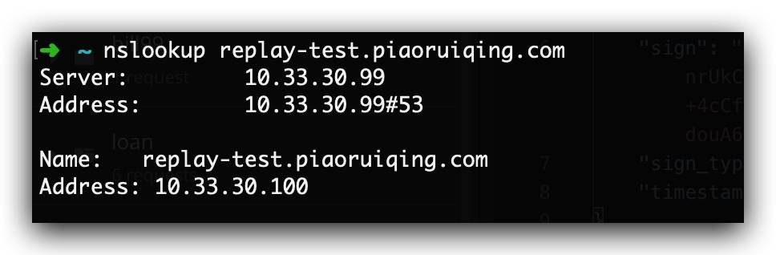

此时向`replay-test.piaoruiqing.com`发起的请求便会被发送到伪造的服务器上(10.33.30.100)，手动将请求的数据保存下来。由于请求带有签名，且攻击者并没有拿到私钥，故无法篡改请求，但可以进行重放攻击。如图，伪造服务器已成功接收到请求数据：

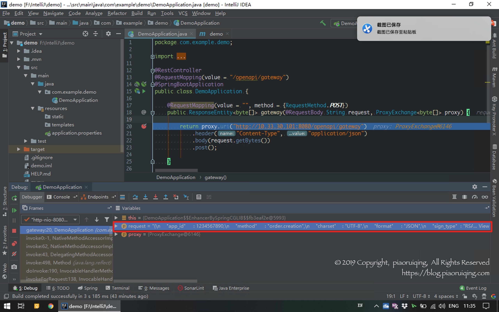

**[版权声明]**
本文发布于[朴瑞卿的博客](https://blog.piaoruiqing.com/)，允许非商业用途转载，但转载必须保留原作者[朴瑞卿](https://blog.piaoruiqing.com/) 及链接：[https://blog.piaoruiqing.com](https://blog.piaoruiqing.com/).
如有授权方面的协商或合作，请联系邮箱：[piaoruiqing@gmail.com](mailto:piaoruiqing@gmail.com)。

#### 重放请求

使用上一步保存下来的数据，直接向真实服务器发送请求(带有签名数据)。如图：

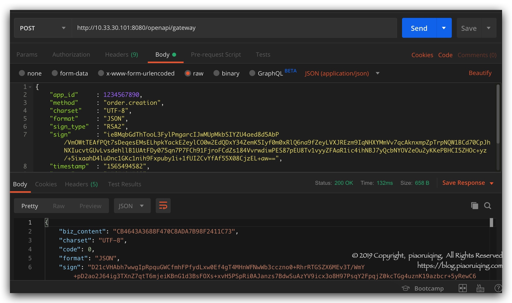

事实上，签名、加密等手段并不能防御重放攻击, 因为攻击者拦截到的数据已是正确的请求数据, 即使无法破解其内容, 也可以重放向服务器发送原数据以达到欺骗的目的。

## 如何防御重放攻击

> [百度百科](https://baike.baidu.com/item/重放攻击)

1. `加随机数`: 该方法优点是认证双方不需要时间同步，双方记住使用过的随机数, 如发现报文中有以前使用过的随机数, 就认为是重放攻击. 缺点是需要额外保存使用过的随机数, 若记录的时间段较长, 则保存和查询的开销较大；
2. `加时间戳`: 该方法优点是不用额外保存其他信息. 缺点是认证双方需要准确的时间同步, 同步越好, 受攻击的可能性就越小. 但当系统很庞大, 跨越的区域较广时，要做到精确的时间同步并不是很容易；
3. `加流水号`: 就是双方在报文中添加一个逐步递增的整数, 只要接收到一个不连续的流水号报文(太大或太小), 就认定有重放威胁. 该方法优点是不需要时间同步, 保存的信息量比随机数方式小. 缺点是一旦攻击者对报文解密成功, 就可以获得流水号, 从而每次将流水号递增欺骗认证端；

在实际使用中, 常将1和2结合使用，时间戳有效期内判断随机数是否已存在，有效期外则直接丢弃。

## 重放攻击防御实践

我们采取`时间戳`+`随机数`的方式来实现一个简单的重放攻击拦截器. 时间戳和随机数互补, 既能在时间有效范围内通过校验缓存中的随机数是否存在来分辨是否为重放请求, 也能在缓存失效后(缓存有效时间和时间范围一致)通过时间戳来校验该请求是否为重放. 如图:

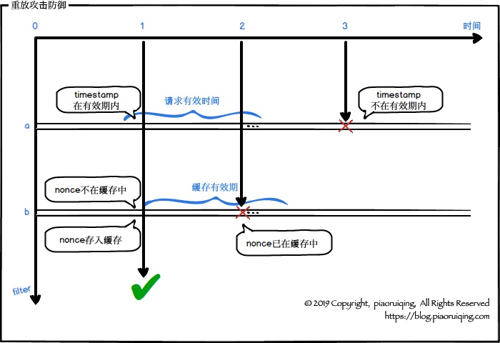

代码如下:

```java
@Resource
private ReactiveStringRedisTemplate reactiveStringRedisTemplate;

private ReactiveValueOperations<String, String> reactiveValueOperations;

@PostConstruct
public void postConstruct() {
    reactiveValueOperations = reactiveStringRedisTemplate.opsForValue();
}

@Override
protected Mono<Void> doFilter(ServerWebExchange exchange, WebFilterChain chain) {
    // 此处的<code>ATTRIBUTE_OPEN_API_REQUEST_BODY</code>是前面过滤器存入的
    OpenApiRequest<String> body 
        = exchange.getRequiredAttribute(ATTRIBUTE_OPEN_API_REQUEST_BODY);
    if (!ObjectUtils.allNotNull(body, body.getTimestamp(), body.getNonce())) {
        return fail(exchange);
    }
    Long gmt = System.currentTimeMillis();
    // (一)
    if (gmt + effectiveTimeRange < body.getTimestamp() || 
        gmt - effectiveTimeRange > body.getTimestamp()) {
        return fail(exchange);
    }
    // (二)
    return reactiveValueOperations.setIfAbsent(MessageFormat.format(
            KEY_REPLAY_NONCE, body.getAppId(), body.getNonce()),
            String.valueOf(System.currentTimeMillis()),
            Duration.ofMillis(effectiveTimeRange * 2L))
        .log(LOGGER, Level.FINE, true)
        .flatMap(approved -> approved ? 
                 chain.filter(exchange) : fail(FORBIDDEN, exchange)
            );
```

- `(一)`: 请求时间超出时间范围的将被拒绝.
- `(二)`: 缓存过期时间等于有效时间的跨度, 若缓存中已存在该随机数, 则拒绝.

## 结语

重放攻击防御的关键点:

- 记录请求标识并缓存, 接受请求时校验, 拒绝重放, 即将`nonce`存入缓存, 拒绝相同的`nonce`
- 随机数的方式可能造成过多的缓存, 故需要配合时间戳进行过滤, 时间戳不在有效范围内的一律拒绝.

重放攻击是一种常用且有效的攻击手段, 其危害不可忽视, 尽管可以通过业务层面来保障数据的正确性, 但依旧会给系统造成不必要开销, 在网关层过滤掉重放请求是一个不错的选择.

# 三、限流

## 前言

开发高并发系统时有多重系统保护手段, 如缓存、限流、降级等. 在网关层, 限流的应用比较广泛. 很多情况下我们可以认为网关上的限流与业务没有很强的关联(与系统的承载能力有关)，且各个子系统都有限流这种需求，将部分限流功能放到网关会比较合适。

## 什么是限流

众所周知, 服务器、网站应用的处理能力是有上限的, 不论配置有多高总会有一个极限, 超过极限如果放任继续接收请求, 可能会发生不可控的后果。

举个栗子🌰, 节假日网上购票, 常常会遇到`排队中`、`系统繁忙请稍后再试`等提示，这便是服务端对单位时间处理请求的数量进行了限制, 超出限制就会排队、降级甚至拒绝服务，否则如果把系统搞崩了，大家都买不到票了。

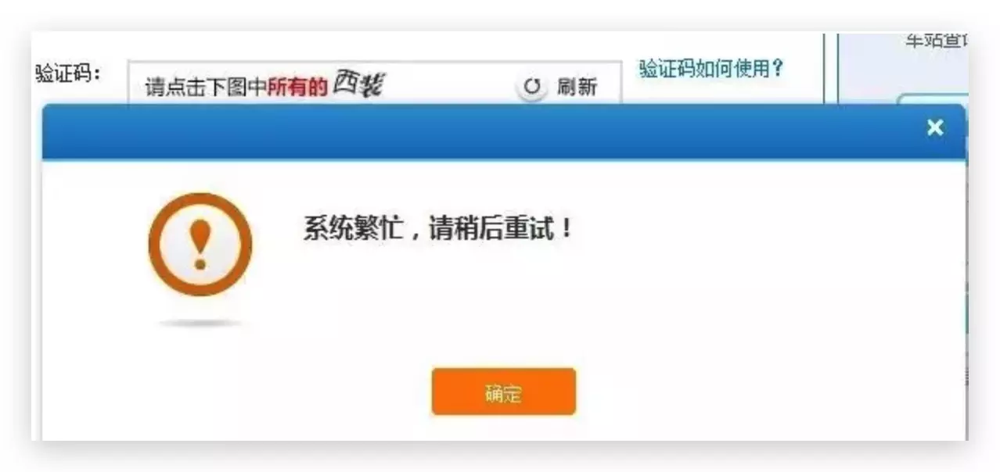

我们先给出`限流`的定义: `限流`是高并发系统保护保护手段之一, 在网关层的应用很广泛. 其目的是对并发请求进行限速或限制一个时间窗口内请求的数量, 一旦达到阈值就排队等待或降级甚至拒绝服务。

其最终目的是: 在扛不住过高并发的情况下做到`有损服务`而不是不服务。

## 常用限流玩法

### 令牌桶

令牌桶算法, 是一个存放固定数量令牌的桶按照固定速率添加令牌。如图：

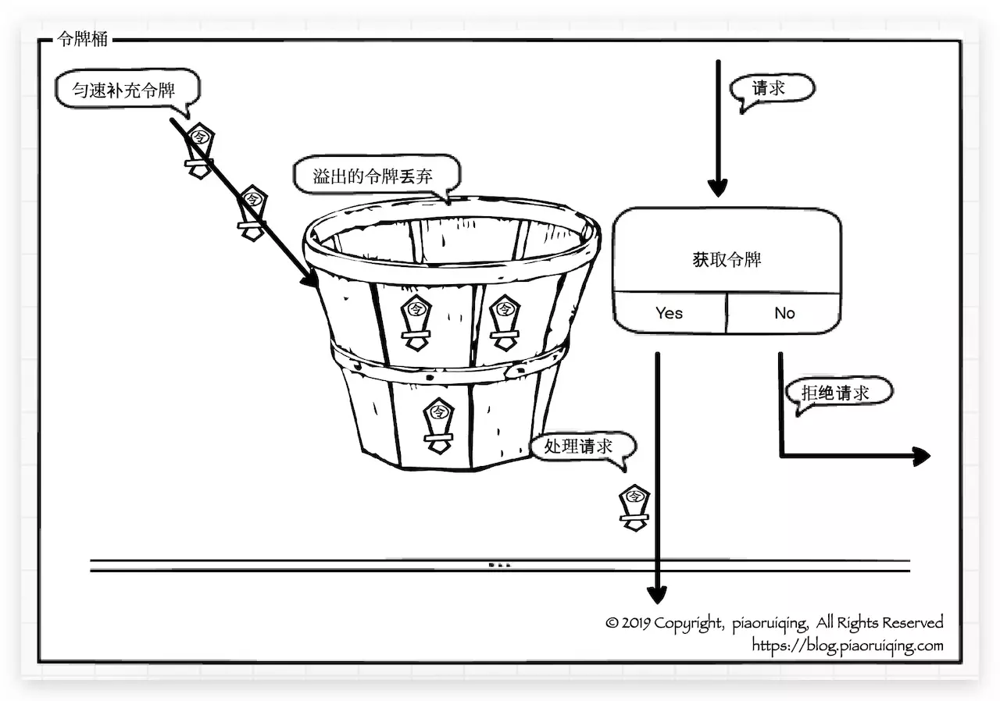

- 按照固定速率向桶中添加令牌
- 桶满时拒绝增加新令牌
- 每次请求消耗一个令牌(也可根据数据包大小来消耗对应的令牌数)
- 当令牌不足时, 拒绝请求(或等待)
- 特点: 可以应对一定程度的突发

举个现实生活中比较常见的例子来理解，电影院售票，每场电影所售出的票数是一定的，如果来晚了(后面的请求)就没票了，要么等待下一场(等待新的令牌发放)，要么不看了(被拒绝)

### 漏桶

漏桶是一个底部破洞的桶，水可以匀速流出，所以与令牌桶不一样的是, 漏桶算法是匀速消费，可以用来进行`流量整形`和`流量控制`。如图：

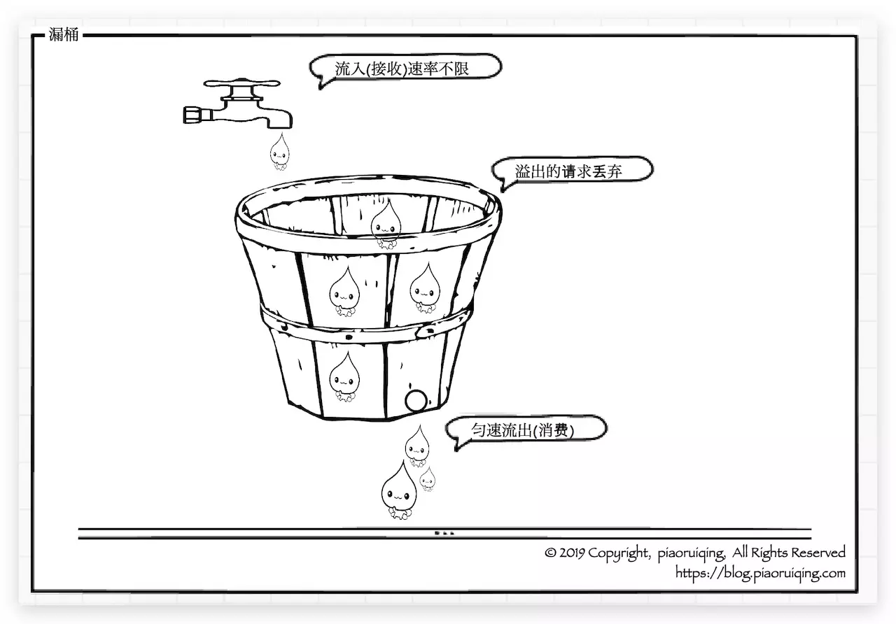

- 固定容量的漏桶, 按照固定速率流出水(不要杠水深和压强的问题)
- 流入水的速率固定, 溢出则被丢弃
- 特点: 平滑处理速率

​    **[版权声明]**
​    本文发布于[朴瑞卿的博客](http://blog.piaoruiqing.com), 允许非商业用途转载, 但转载必须保留原作者[朴瑞卿](http://blog.piaoruiqing.com) 及链接:[blog.piaoruiqing.com](http://blog.piaoruiqing.com).     如有授权方面的协商或合作, 请联系邮箱: [piaoruiqing@gmail.com](mailto:piaoruiqing@gmail.com).

## 应用级限流

一个单体的应用程序有其承受极限, 在高并发情况下, 有必要进行过载保护, 以防过多的请求将系统弄崩. 最简单粗暴的方式就是使用计数器进行控制, 处理请求时+1, 处理完毕后-1, 除此之外我们还可以利用前文提到的令牌桶和漏桶来进行更精细的限流.如果网关是单体应用, 我们完全可以不借助其他介质, 直接在应用级别进行限流.

### 计数器

这种方式实现最简单粗暴

```java
try {
    if (counter.incrementAndGet() > limit) {
        throw new SomeException();
    }
    // do something
} finally {
    counter.decrementAndGet();
}
```

### 令牌桶

`Guava`提供了令牌桶算法的实现.

```java
@Test
public void testGuavaRateLimiter() throws InterruptedException {
    RateLimiter limiter = RateLimiter.create(5);
    TimeUnit.SECONDS.sleep(1);	// 等待一秒钟发几个令牌
    for (int index = 0; index < 10; index++) {
        System.out.println(limiter.acquire()); // 打印等待时间
    }
}
```

输出为：

```
0.0
0.0
0.0
0.0
0.0
0.0
0.196108
0.194372
0.19631
0.198373
```

在令牌用尽后，后面的请求都要等待有新的令牌后才能继续执行。

应用级限流实现简单，但其局限性在于无法进行全局限流，对于集群就无能为力了。

## 分布式限流

想要在集群中进行全局限流，其关键在于将限流信息记录在共享介质中，如`Redis`、`memcached`等。为了将限流做的精确, 写必须是原子操作。

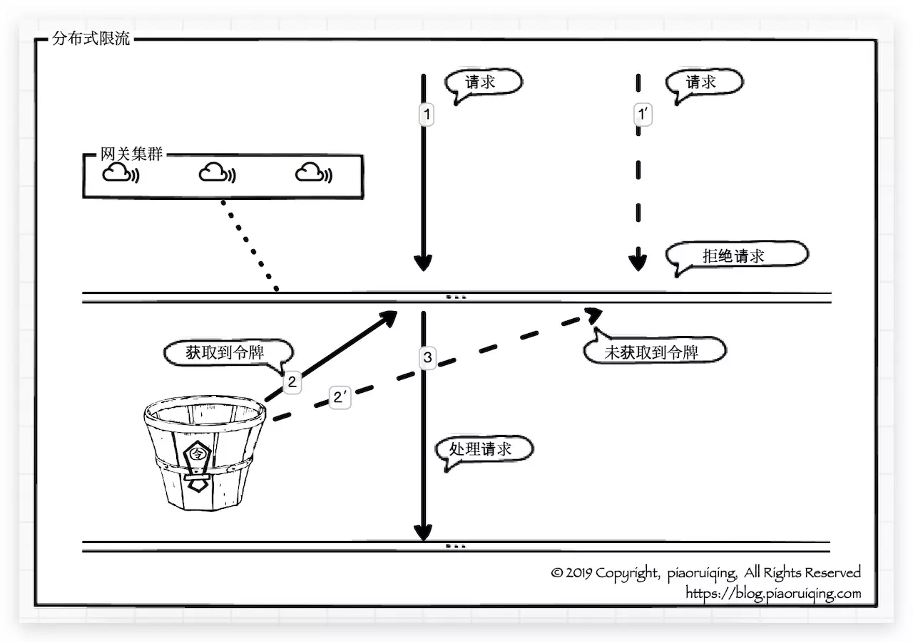

`Redis`+`Lua`是一个不错的选择, 示例`Lua`脚本如下:

```
local key = KEYS[1] -- 限流的KEY
local limit = tonumber(ARGV[1])	-- 限流大小
local current = tonumber(redis.call('get', key) or '0')
if current + 1 > limit then
    return 0
else
    redis.call('INCRBY', key,'1')
    redis.call('expire', key,ARGV[2])	-- 过期时间
    return current + 1
end
```

- 分布式限流将令牌的发放放到共享介质中
- 获取(消费)令牌操作必须是原子的
- 共享介质要高可用(Redis集群)

## 结语

网关作为内部系统外的一层屏障, 对内起到一定的保护作用, 限流便是其中之一. 网关层的限流可以简单地针对不同业务的接口进行限流, 也可考虑将限流功能做成网关的一个功能模块(如限流规则的配置、统计、针对用户维度进行统计和限流等)