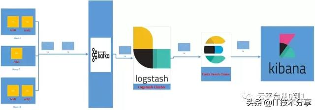

# 微服务分布式日志体系架构

IT技术分享 2019-06-07 13:42:04

众所周知，微服务运行在多个主机上。为了满足某个业务需求，我们可能需要与运行在不同机器上的多个服务进行通信。因此，微服务生成的日志分布在多个主机上。

作为一个开发人员或管理员，如果您想解决这个问题，那将使您毫无头绪。您不知道运行在哪个主机上的哪个微服务，满足了您的请求。即使您知道哪些主机服务于您的请求，切换到不同的主机并查看日志，然后将它们与所有微服务请求相关联，也是一个繁琐的过程。如果您的环境是自动扩展的，那么解决上述问题是不可想象的。以下是一些在微服务领域，解决此类问题时，更容易使用的实践。

## **集中和外部化日志存储**

由于微服务在多个主机上运行，您应该将所有生成的日志跨主机发送到一个外部的集中位置。从那里，您可以很容易地从一个地方获得日志信息。它可能是另一个高可用的物理系统，或者云存储，或任何其他存储选项。

## **记录结构化数据**

通常，我们将带有原始文本输出的日志消息放在日志文件中。有不同的日志编码器可用于生成JSON日志消息。这样，我们可以在结构化的日志数据中，寻找正确的数据来解决遇到的问题。下面是一些配置JSON appender的有用链接。

- https://logging.apache.org/log4j/2.x/manual/layouts.html
- https://github.com/qos-ch/logback-contrib/wiki/JSON

如果您使用Logstash作为日志聚合工具，则可以配置编码器以输出JSON日志消息。

- https://github.com/logstash/logstash-logback-encoder
- https://github.com/logstash/log4j-jsonevent-layout

## **关联ID**

在进行第一个微服务调用时生成一个相关的ID，并将该ID传递给下个服务。记录所有微服务调用之间的关联ID。这样，我们就可以使用这个ID来跟踪日志。

如果您使用SpringCloud开发微服务，那么您可以使用Spring Sleuth模块和Zipkin。

## **动态日志记录和异步日志记录**

我们应该在代码中使用不同的日志级别，并且在代码中也有足够的日志记录语句。我们应该有入口可以动态更改日志级别。启用适当的日志级别非常有用·。在服务器启动期间，我们不需要启用最低日志级别来打印所有日志。我们也避免了过度记录的开销。添加异步日志追加器，这样日志记录器线程就不会阻塞当前的请求线程。

## **日志可搜集**

确保日志中的所有可用字段都是可搜索的。例如，如果您得到了相关ID，那么您可以基于该ID搜索所有日志，以找出请求响应流。

现在，让我们来研究一下微服务世界中日志管理的体系结构。此解决方案使用ELK堆栈。通常，对于不同的环境，我们会有不同的日志配置。对于开发环境，我们将使用控制台附加器或文件附加器，他们将在本地主机中输出日志。这在开发过程中很容易和方便。对于其他环境，我们将把日志发送到一个集中的地方。我们将讨论的体系结构是针对QA和更高的环境。

在上面的体系结构中，我们配置了Kafka日志附加器以将日志消息输出到Kafka集群。从Kafka群集中，Logstash将接收该消息。在将日志消息提取到Logstash中时，我们可以根据需要转换信息。Logstash的输出将存储到Elasticsearch。使用Kibana可视化工具，我们可以使用我们记录的参数搜索索引日志。请记住，我们可以使用Rabbit MQ / Active MQ（或其他）消息代理而不是Kafka。以下是附加器的一些有用链接。

- https://github.com/danielwegener/logback-kafka-appender
- http://docs.spring.io/spring-amqp/api/org/springframework/amqp/rabbit/logback/AmqpAppender.html
- https://logging.apache.org/log4j/2.0/manual/appenders.html#KafkaAppender
- https://logging.apache.org/log4j/2.0/manual/appenders.html#JMSAppender

在下面给出的第二个选项中，我们将使用Logstash附加器将日志消息写入主机上的文件。Filebeat代理将监视日志文件并将日志信息提取到Logstash群集。

在第一个和第二个选项中，我的选择是第一个。那是因为：

- 如果系统具有高度可伸缩性，并具有自动缩放功能，则将根据需要创建和销毁实例。在这种情况下，如果使用第二个选项，则如果主机被销毁，则可能会丢失日志文件。但是使用第一个选项，当我们记录时，消息将出现在我们的中间件中。它是自动缩放环境的完美套件。
- 使用第二个选项，我们在主机上安装Filebeat或类似的文件监视器。出于某种原因，如果这些代理停止工作，我们可能无法从该主机获取日志。同样，我们正在丢失日志信息。