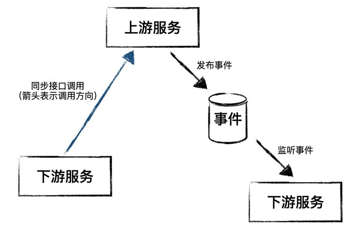

# 微服务架构下的数据一致性

> 数据一致性问题首先是个业务问题，其次才是个技术问题。在微服务架构下，我们期望每个服务职责单一，这种职责单一体现的是业务价值，如果微服务的拆分过小而导致业务难以实现，那这种拆分是不合理的，业务专家们非常有必要了解系统，从业务侧给出服务拆分的建议。

微服务架构的流行源于它能够带来更快的变化响应能力，比如独立部署，每个服务的能力职责是独立的，可以按需独立发布；再比如每个服务可以由不同的开发团队负责，每个服务的技术栈也可以不同，可以选择更快捷合理的方式实现不同的服务。

然而，微服务架构作为分布式架构，躲不开的一个问题就是数据一致性的问题，特别是在技术异构和数据源类型不同的情况下，传统的分布式事务（2PC或3PC）也很难解决微服务架构下的一致性问题。

### **数据怎么会不一致呢？**

在微服务架构下，多个服务之间通常会定义明确上下游关系，下游系统可以依赖上游系统，下游系统可以通过API查询或修改上游系统的数据；反过来则不然，上游系统不应该知道下游系统的存在，也就是说上游系统不能依赖下游系统，上游系统的变化只能通过异步事件的方式发出，下游系统监听事件并基于事件做对应的数据状态变化。

在基于上面原则的微服务架构下（见上面图示，本文不考虑服务间循环依赖的场景），在上下游服务间的数据通信（图示中的每个箭头表示一种数据通信）一旦发生问题，都会产生数据不一致的场景，下面我们逐一说明：

### **场景一：下游服务数据状态变化时同步调用上游服务接口失败**

举个例子，订单服务是下游服务，库存服务是上游服务，在订单确认时要锁定库存，实现上订单服务在状态变化同时通过同步API修改库存的状态，为了保证数据一致性，在调用库存服务API异常后订单服务会回滚当前的数据状态变更。

在这个场景下，同一个业务流程，需要同时修改两个服务的数据，在以下两种情况下会发生数据不一致的问题：

- 库存服务API调用成功，库存状态变更，但订单状态变更提交到数据库时失败，结果是库存被锁定，但订单没有确认。
- 库存服务API调用失败，但实际上库存服务的数据变更已成功，失败原因是响应消息返回订单服务过程中网络异常，订单服务回滚数据变更，结果同样是库存被锁定但没有订单确认。

### **场景二：上游服务在状态变化时没有发出事件**

上游服务每个关键状态变更都可能触发下游服务的一些逻辑链，因此上游服务发布的事件对于下游服务是非常重要的，但这些事件并不影响上游服务自身逻辑，也不影响自身数据状态的变化，因此通常不会设计成阻碍业务流程，那么在事件服务或事件载体（通常是消息队列）与上游服务之间的通信异常，就会导致上游服务的事件发布失败。

这种场景下，上游服务的业务流程已经成功，不可能有再次触发事件的场景，这个事件就丢失了，下游服务因为没有收到上游服务的事件，数据没有做对应的变化而导致数据不一致。

### **场景三：下游服务没有办法正常消费上游服务的事件**

同样，下游服务在消费事件时也很有可能因为一些原因，导致事件的消费失败，这些原因可能包括：

- 上游服务发布事件的内容格式发生变化
- 上游服务发布事件的格式没变，但某些字段的可选值空间变化了，比如一些枚举值的扩充
- 下游服务内部逻辑异常（数据库、跨服务调用等）

上游服务并不关心下游的消费者，所以对于发布出去的事件，上游系统也不关心下游服务是否消费成功，更不会有因某个下游服务消费失败而重发事件的逻辑，这同样会导致类似于场景二的数据不一致。

### **如何消除数据不一致？**

根据CAP理论，分区容错性、可用性和一致性里面必须要牺牲掉一个，而在实际实现过程中，分区容错性和可用性是很难舍弃的，所以通常会舍弃一致性，取而代之会用最终一致性保证数据在可容忍的时长内达到最终一致。

微服务架构也不例外，在服务内部，可以通过本地事务保证数据的强一致性；而当业务发生在多个服务中，我们追求最终一致性。那么怎么解决上面提到的问题，做到跨服务的最终一致性呢？

### **避免同时跨服务的写操作**

这是个业务问题，在微服务的架构下，每个服务都是独立的，如果有一个业务功能需要同时修改两个服务的数据，往往这个业务可以拆分成两个步骤，比如场景一种提到的订单和库存的例子，如果我们可以先锁定库存，然后再确认订单看上去这个问题就迎刃而解了。

因此在业务中发现一个功能需要同时修改两个服务的数据，我们首先可以来讨论这个业务设计是否合理；如果业务上很多场景都要求两个服务的数据保持强一致，那可能我们需要看看微服务的划分是否合理。

### **最大努力通知 + 最大努力处理**

为了解决场景二和场景三的不一致性问题，需要上游服务和下游服务的共同努力：

上游服务需要尽可能将事件发送出去，比如：先同步发送，如果失败改为异步重试，重试多次仍然失败可以先持久化，通过定时任务来重发或者人工干预重发。

下游服务也要尽可能的把事件处理掉，收到事件后可以考虑先将事件持久化，消费成功后标记事件，如果消费失败可以通过定时任务重试消费。

### **保证幂等性**

当我们提到重试，就不得不考虑幂等性的问题，这里的幂等性包括以下两个场景：

- 上游服务接口的幂等性，保证下游系统的重试逻辑可以得到正确响应
- 下游服务消费事件保证幂等性，避免因上游多发事件或事件已消费成功后再次重试产生的问题

### **核心业务数据补偿机制**

在分布式系统的执行链路上，每个节点都有可能失败，加上业务的复杂度，即便我们做了很多我们认为万全的准备，数据不一致的情景也很难彻底解决，而对于那些小概率发生但技术解决起来成本昂贵的问题，我们可以尝试通过对业务的深刻理解设计一些后台的维护功能，保证在核心业务数据异常时，可以在一定的规则内进行修复，从而保证业务的顺利进行。

### **写在最后**

数据一致性问题首先是个业务问题，其次才是个技术问题。在微服务架构下，我们期望每个服务职责单一，这种职责单一体现的是业务价值，如果微服务的拆分过小而导致业务难以实现，那这种拆分是不合理的，业务专家们非常有必要了解系统，从业务侧给出服务拆分的建议。

在数据一致性问题上，我们首先要思考业务设计的合理性，其次是当前架构设计的合理性，然后在一定的约束下，通过最终一致性保证业务价值，除非迫不得已，不建议引入分布式事务框架，一方面成本较高，另一方面也会引入性能等新的问题。