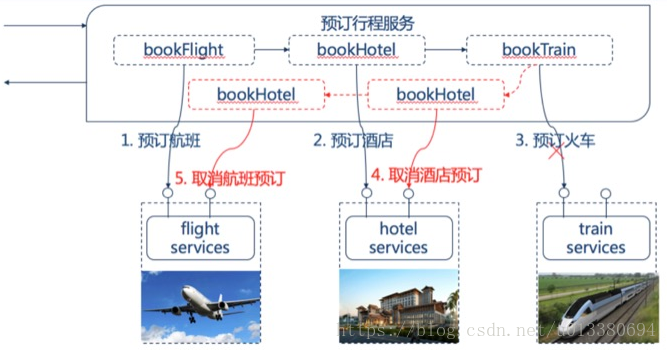

# 微服务架构下的数据一致性保证

从2014年开始，微服务逐渐进入大家的视野，被认为是下一代实现信息化的有效手段。设计到系统，其中绕不开的就是数据一致性，从本地事务，到后来的分布式事务，都能够有效的保证数据一致性。但是在微服务架构中，这两种方式都不是最好的选择。

## **1.** **使用本地事务和分布式事务保证一致性**

在传统的单击应用中，最简单、最直接、最普遍的会使用一个关系型数据库，通过关系型数据库的事务保证数据的一致性。这种事务有四个基本要素：ACID。

- A（Atomicity，原子性）：整个事务中的所有操作，要么全部完成，要么全部失败，不可能停滞在中间某个环节。事务在执行过程中发生错误，会被回滚（Rollback）到事务开始前的状态，就像这个事务从来没有执行过一样。
- C（Consistency，一致性）：一个事务可以封装状态改变（除非它是一个只读的）。事务必须始终保持系统处于一致的状态，不管在任何给定的时间并发事务有多少。
- I（Isolation，隔离性）：隔离状态执行事务，使它们好像是系统在给定时间内执行的唯一操作。如果有两个事务，运行在相同的时间内，执行相同的功能，事务的隔离性将确保每一事务在系统中认为只有该事务在使用系统。这种属性有时称为串行化，为了防止事务操作间的混淆，必须串行化或序列化请求，使得在同一时间仅有一个请求用于同一数据。
- D（Durability，持久性）：在事务完成以后，该事务对数据库所作的更改便持久的保存在数据库之中，并不会被回滚。

在传统的本地事务中，为了保证数据一致性，我们只需要先开始一个事务，然后进行新增、修改、删除等操作，然后提交事务，如果发生异常就回滚。简简单单，就能够站在各大数据库厂商的肩膀上，实现数据一致性。

随着组织规模不断扩大、业务量不断增加，单机应用已不足以支撑庞大的业务量和数据量。这个需要对应用和数据进行拆分。就出现了需要同时访问多个数据库的情况。这个时候就需要分布式事务来保证数据一致性，也就是常说的两阶段提交协议（2PC，Two Phase Commitment Protocol）。在这个协议中，最关键的点就是，多个数据库的活动，均由一个事务协调器的组件来控制。具体的分为5个步骤：

- 应用程序调用事务协调器中的提交方法
- 事务协调器将联络事务中涉及的每个数据库，并通知它们准备提交事务（这是第一阶段的开始）
- 接收到准备提交事务通知后，数据库必须确保能在被要求提交事务时提交事务，或在被要求回滚事务时回滚事务。如果数据库无法准备事务，它会以一个否定响应来回应事务协调器。
- 事务协调器收集来自各数据库的所有响应。
- 在第二阶段，事务协调器将事务的结果通知给每个数据库。如果任一数据库做出否定响应，则事务协调器会将一个回滚命令发送给事务中涉及的所有数据库。如果数据库都做出肯定响应，则事务协调器会指示所有的资源管理器提交事务。一旦通知数据库提交，此后的事务就不能失败了。通过以肯定的方式响应第一阶段，每个资源管理器均已确保，如果以后通知它提交事务，则事务不会失败。

在传统的系统架构中，通常使用的是数据库来作为资源管理器，数据的一致性通过事务来保证，即使实在分布式事务中，也能够利用数据库的事务来实现数据一致性。

但是在微服务架构中，数据访问变得复杂。通常情况下，数据都是各个微服务私有的，只能通过API的方式访问数据。这种方式可以实现微服务之间的松耦合，使彼此独立的微服务更容易的进行扩展。但是带来的一个问题就是，不清楚各自底层的数据存储（不一定是关系型数据库），无法通过统一的事务协调器来完成数据一致性。

简单的说，传统的本地事务或分布式事务不适合微服务架构。

## **2.** **微服务架构中的最终一致性**

在分布式系统架构中有一个CAP理论：任何分布式系统只可同时满足一致性（Consistency）、可用性（Availability）、分区容错性（Partition tolerance）中的两点，没法三者兼顾。对于分布式系统来说，分区容错性是基本要求，否则就失去了价值。因此，就只能在可用性和一致性之间做出选择。如果选择提供一致性需要付出在满足一致性之前阻塞其他并发访问的代价。这可能持续一个不确定的时间，尤其是在系统已经表现出高延迟时或者网络故障导致失去连接时。依据目前的成功经验，可用性一般是更好的选择，但是在服务和数据库之间维护数据一致性是非常根本的需求，微服务架构中选择满足最终一致性。

最终一致性是指系统中的所有数据副本经过一段时间后，最终能够达到一致的状态。

这里所说的一段时间，也要是用户可接受范围内的一段时间。

从一致性的本质来看，就是在一个业务逻辑中包含的所有服务要么都成功，要么都失败。那我们又该如何选择方向，来保证成功还是保证失败呢？就是就需要根据业务模式做出选择。实现最终一致性有三种模式：可靠事件模式、业务补偿模式、TCC模式。

### **2.1** **可靠事件模式**

可靠事件模式属于事件驱动架构，当某件重要事情发生时，例如更新一个业务实体，微服务会向消息代理发布一个事件。消息代理会向订阅事件的微服务推送事件，当订阅这些事件的微服务接收此事件时，就可以完成自己的业务，也可能会引发更多的事件发布。

下面举个简单的例子

1.订单服务创建一个订单，发布一个“创建订单”事件

2.支付服务消费“创建订单”事件，待支付完成后发布一个“支付成功”事件

3.订单服务消费“支付成功”事件，订单状态更新为待出库。

从而就实现了完整的业务流程。

这个过程可能导致出现不一致的地方在于：

1. 某个服务在更新了业务实体后发布事件却失败
2. 虽然服务发布事件成功，但是消息代理未能正确推送事件到订阅的微服务
3. 接受事件的微服务重复消费了事件

可靠事件模式在于保证可靠事件投递和避免重复消费。可靠事件投递定义为：每个服务原子性的业务操作和发布事件，消息代理确保事件传递至少一次。避免重复消费要求服务实现幂等性，如支付服务不能因为重复收到事件而多次支付。

### **2.2** **业务补偿模式**

在描述业务补偿模式之前，先先定义两个概念：

- 业务异常：业务逻辑产生错误的情况，比如账户余额不足、商品库存不足等。
- 技术异常：非业务逻辑产生的异常，如网络连接异常、网络超时等。

补偿模式使用一个额外的协调服务来协调各个需要保证一致性的微服务，协调服务按顺序调用各个微服务，如果某个微服务调用异常（包括业务异常和技术异常）就取消之前所有已经调用成功的微服务。

我们通过一个例子来说明补偿模式，一家旅行公司提供预订行程的业务，可以通过公司的网站提前预订飞机票、火车票、酒店等。

假设一位客户规划的行程是：（1）上海-北京6月19日9点的某某航班，（2）某某酒店住宿3晚，（3）北京-上海6月22日17点火车。在客户提交行程后，旅行公司的预订行程业务按顺序串行的调用航班预订服务、酒店预订服务、火车预订服务。最后的火车预订服务成功后整个预订业务才算完成。

如果火车票预订服务没有调用成功，那么之前预订的航班、酒店都得取消。取消之前预订的酒店、航班即为补偿过程。

需要注意的是酒店的取消预订、航班的取消预订同样不能保证一定成功，所以补偿过程往往也同样需要实现最终一致性，需要保证取消服务至少被调用一次和取消服务必须实现幂等性。

我们应该尽可能通过设计避免采用补偿方式，比如上面的例子中，在预订火车票失败的时候可以提示客户更改其他的时间。

### **2.3 TCC模式（Try-Confirm-Cancel）**

一个完整的TCC业务由一个主业务服务和若干个从业务服务组成，主业务服务发起并完成整个业务活动，TCC模式要求从服务提供三个接口：Try、Confirm、Cancel。

- Try：完成所有业务检查，预留必须业务资源
- Confirm：真正执行业务，不作任何业务检查，只使用Try阶段预留的业务资源，Confirm操作满足幂等性
- Cancel：释放Try阶段预留的业务资源，Cancel操作满足幂等性

整个TCC业务分成两个阶段完成：

第一阶段：主业务服务分别调用所有从业务的try操作，并在活动管理器中登记所有从业务服务。当所有从业务服务的try操作都调用成功或者某个从业务服务的try操作失败，进入第二阶段。

第二阶段：活动管理器根据第一阶段的执行结果来执行confirm或cancel操作。如果第一阶段所有try操作都成功，则活动管理器调用所有从业务活动的confirm操作。否则调用所有从业务服务的cancel操作。

需要注意的是第二阶段confirm或cancel操作本身也是满足最终一致性的过程，在调用confirm或cancel的时候也可能因为某种原因（比如网络）导致调用失败，所以需要活动管理支持重试的能力，同时这也就要求confirm和cancel操作具有幂等性。

## **3.** **总结**

前面提到的三种模式，几乎能够很好的解决网络故障或调用超时等基本问题。但在当今复杂的环境中，很多服务需要依赖外部系统，在这些业务场景中，就需要周期性的进行校验操作，比如支付系统和银行的对账过程。

还需要顺带的提一下，技术能够解决问题，但不能解决所有问题，很多情况下，需要首先保证业务流程准确，然后在技术解决不了的情况下，仍然需要人工干预。

参考文献：

https://mp.weixin.qq.com/s?__biz=MzI5MDEzMzg5Nw==&mid=2660392782&idx=1&sn=d28e43bf6f7cf140eed9fffcf2f29e86&scene=1&srcid=0719GVTmJxt0EIHUCCt5VRuT&pass_ticket=62sxSNNbb4c5RynZPQfPfFbDs80zoGRU7eQWI84tsKNOI08773ppKTq6%2BIQFTHcv#rd