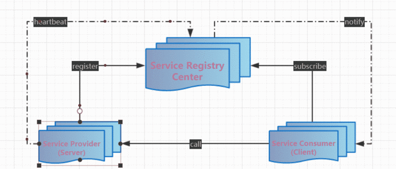
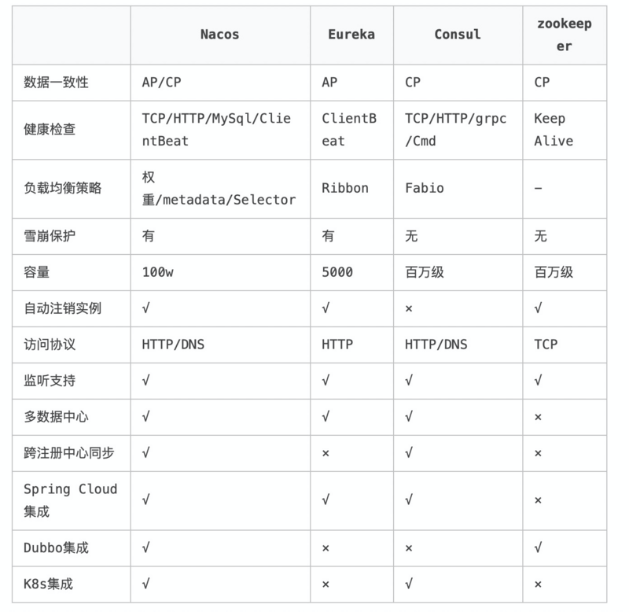
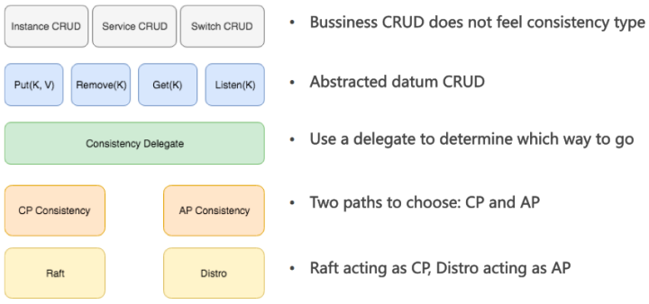
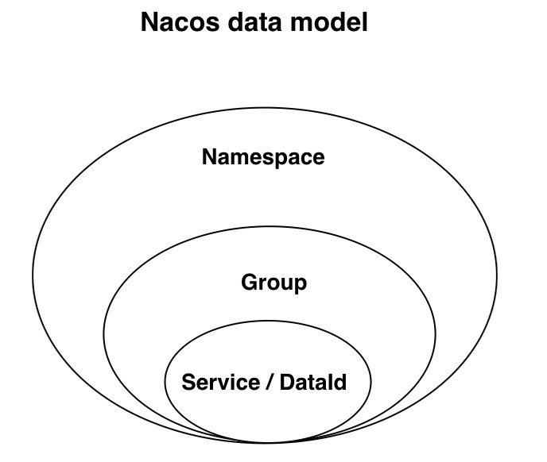
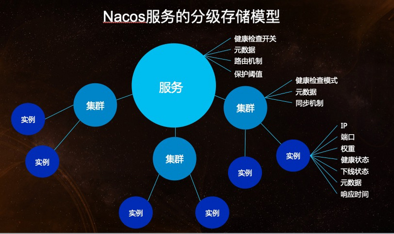
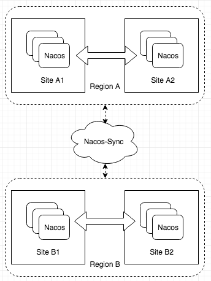

# [微服务架构中常见的注册中心](https://segmentfault.com/a/1190000023568313)

# 盘点一下常用的[注册中心](https://www.cnblogs.com/allennote/articles/12459814.html)



上图基本表达了注册中心的交互过程, 体现出三种角色之间关系:

- 服务提供者 Service Provider (Server):
  - 服务启动后向RegistryCenter**注册** 自己的一个实例
  - 定期向RegistryCenter发送**心跳**(heartbeat), 证明自己还能苟一会
  - 服务关闭时向RegistryCenter发起注销
- 服务消费者 Service Consumer(Client):
  - 服务启动后RegistryCenter订阅所需要使用的服务(Server), 并缓存到实例列表中
  - 向对应服务(Server)发起**调用**时,从内存中的该服务的实例列表选择一个,进行远程调用.
  - 服务关闭时向RegistryCenter取消订阅
- 注册中心 Service Registry Center:
  - Server超过一定时间未**心跳**时,从服务的实例列表移除.
  - 服务的实例列表发生变化(新增或者移除)时,通知订阅该服务的 Consumer,从而让 Consumer 能够刷新本地缓存. 有些 注册中心不提供这项功能, 例如Eureka,二手Client 定期轮询更新本地缓存

> 大多数情况下一个服务可能既是Client又是 Consumer

## CAP

CAP理论是分布式架构中重要理论

- 一致性(Consistency) (所有节点在同一时间具有相同的数据)
- 可用性(Availability) (保证每个请求不管成功或者失败都有响应)
- 分隔容忍(Partition tolerance) (系统中任意信息的丢失或失败不会影响系统的继续运作)

由于C与A的特性无法共存.CAP 不可能都取,只能取其中2个,要么AP要么CP

## 注册中心的品牌

说到这个, 先扯一下服务发现, 当我们的服务从单机走向社会的时候, 就产生了服务发现.

一开始服务发现是通**DNS**协议实现的, 就是网路IP协议, 通过DNS + LVS基本就实现了http形式的服务发现, 这个时候IP通常是配置在LVS.之后大家开始玩起RPC服务, 服务的部署开始频繁.为了实现动态上下线, 整出来注册中心 目的其实就是推送IP列.

### `Zookeeper`

Zoopkeeper 在国内很长一段时间都是注册中心一哥.大部分是因为Dubbo 在国能的盛行.

### `Eureka`

Eureka是一家在线影片租赁提供商Netflix开源的, 这家公司的理念还是满超前的.

> Netflix玩的是一种流媒体服务. 爱、死亡与机器人, 怪奇物语,纸牌屋,黑镜.. 这些耳熟能详的美剧都是旗下的作品. Netflix一直以来的商业模式其实就是众筹, 用户用更低的产品看电视剧. 到现在开始踏足原创剧集时代,这才是Netflix从诸多电视巨头中突围的原因.非常的顶.

很多Spring Cloud的组件都是Netflix做的, 这是Netflix的微服务生态.方便Spring开发人员构建微服务基础框架.而Eureka则借着微服务概念的流行,与SpringCloud生态的深度结合,也获取了大量的粉丝.

### `Nacos`

Nacos 是阿里开源的, 功能其实也很多, 服务注册, 配置管理, 动态 DNS 服务, 元数据管理

## 注册中心的较量



### 数据一致性

数据一致性一直是分布式系统的热点, 目前基本归为两派:

- AP: 对等部署的多写一致性
- CP: 基于leader的非对等部署的单点写一致性

可以通过**心跳检测**来举个例子, 强一致性注册中心,服务节点不会发送心跳,因为第一次注册的时候就必须保证数据不会丢失,而如果服务节点能发送心跳第一次注册的成功与否就会显得不那么重要(当然也非常重要,这里指的是允许出现失败)

这也是Eureka为什么采用自定义的**Renew**机制的原因,而不是Paxos协议(据说拿过图灵奖).

对于dubbo来说其实采用Renew机制更好, 主要是因为注册到zookeeper上是临时节点,还允许服务下线,发送心跳到zookeeper上来续约服务节点.zookeeper保证了一致性,就确实服务的高可用,导致机房容灾能力的确实.

Nacos支持AP和CP两种协议如图所示.在这点设计上有个骚操作, 就是把业务相关逻辑和底层同步逻辑分层,将业务读写抽象为Nacos定义为的[数据模型](# 数据模型).通过代理, 根据一定的规则进行转发.



### 数据模型

注册中心最核心的数据就是服务名和IP地址,zookeeper是一个树形k-v的数据结构,理论上满足各种语境的数据.而Eureka和Consul做到**实例级别的数据扩展**.满足最根本需求.Nacos的数据模型相对复杂.如图所示:



**Nacos考虑的是数据的隔离模型**, 并提供了四种.作为一个共享服务的组件,需要能够在各种环境保证数据的隔离和安全,这点在庞大的业务场景中非常常见.



上面说的业务逻辑和同步逻辑其实指的就是临时实例和持久化实例.

- 在定义上区分临时实例和持久化实例的关键是**健康检查的方式**,
- 临时实例使用客户端上报模式, 而持久化实例使用服务端反向探测模式.临时实例需要能够自动摘除不健康实例,而且无需持久化存储实例.
- 持久化实例使用服务端探测的健康检查方式,因为客户端不会上报心跳,那么自然就不能去自动摘除下线的实例.

- 一些基础的组件例如数据库、缓存等,这些往往不能上报心跳,这种类型的服务在注册时,就需要作为持久化实例注册.而上层的业务服务

### 健康检查

大多通过心跳检测实现,如果客户端一定时间内没发送心跳,服务节点会被注销.这种机制被称为TTL(Time To Live). Eureka(自我保护机制：默认90s)允许自定义检查服务本身的方法.不同注册中心检查机制不同, Nacos是5秒一个周期,15秒没收到心跳,服务被标记为不健康, 30秒没收到则注销服务.

另外, client服务和server服务又有不同:

- client健康检查关注上报心跳的方式,注销不健康服务的机制.
- server健康检查关注的是探测服务端的方式,灵敏度以及设置server服务健康状态的机制.

一般来说注册过的server服务实例如果不调用结构主动注销,就意味着维持健康检查的探测任务, 而client服务实例则可以随时注销不健康的实例,减轻服务端的压力.

### 负载均衡

讲道理,负载均衡不是注册中心的传统艺能.一般来说,服务发现的流程就是从注册中心获取实例列表, 然后选择自身所需符合规则被分配的服务提供者,注册中心不会限制消费者的访问策略.

Eureka,zookeeper,Consul基本都是这样.

```
*  Eureka的负载均衡是由Ribbon负责的;
*  Consul的负载均衡是由Fabio完成的.
```

目前的负载均衡有**基于权重、服务提供者负载、响应时间、标签**等策略.

Ribbon设计的客户端负载均衡机制主要是选择合适现有的IRule、ServerListFilter等接口实现,两步实现负载均衡:

1. 过滤掉不会采用的服务提供者实例
2. 在被过滤后的服务列表中进行负载均衡

Fabio是**基于标签**做负载均衡, 这点和kubernetes类似, 都是将标签运到资源的过滤上,实现标签的比例和权重的负载均衡.

Nacos除了提供权重的负载均衡之外, 还提供了**CMDB的标签负载均衡**.实现同标签优先访问的流量调度策略.如果服务部署在多个不同的地区, CMDB的负载将会起到不错的效果.充分均匀的分配流量.

### 集群扩展性

- Zookeeper基于leader的非对等部署的单点写一致性,无法做到自动多机房容灾;
- Eureka的部署模式天然支持多机房容灾
- Nacos支持两种模式的部署,一种是和Eureka一样的AP协议的部署,这种模式只支持临时实例,可以完美替代当前的Zookeeper、Eureka,并支持机房容灾.另一种是支持持久化实例的CP模式,这种情况下不支持双机房容灾.
- 机房容灾是异地多活的一部分,让业务能够在访问服务注册中心时,动态调整访问的集群节点,需要第三方做路由.
- 多数据中心其实也算是异地多活的一部分. Zookeeper和Eureka没有官方的数据中心方案.Nacos有Nacos-Sync组件来做数据中心之间的数据同步,不仅可以在Nacos之间同步, 还可以实现Nacos在zookeeper,k8s.Consul和Eureka的数据同步, 实现生态大和谐.



## 总结

这篇文章盘点注册中心各自的特性

- Nacos大而全
- Eureka 小而美
- Consul其实跟Nacos比较相似.
- zookeeper 性能好难扩展