# [微服务架构实践](https://www.cnblogs.com/exceptioneye/p/9334303.html)

**目录**

业务背景
微服务概念
微服务技术选型
微服务架构设计
微服务架构设计落地
微服务架构设计过程中积累的心得
总结

## 一、业务背景

### 1.1 产品现状

1、各产品系统独立开发，代码复用率低，系统之间互相调用，耦合严重，系统解耦独立部署困难。
2、传统的单体架构，规模越来越大也越来越笨重；当新功能的开发、功能的重构变得不再敏捷可控；测试者的回归测试边界难以琢磨；系统的上线部署也变的艰难
3、高并发访问下无法提供可靠性服务
4、持续集成、持续部署、持续交付等工程效率化工具严重缺失
5、监控系统、日志分析等系统稳定性工具严重缺失
以上种种情况，都让我们应对需求的变化而变得迟钝。

### 1.2 业务需求

架构肯定是为业务需求而生的，先来看看我们面对的业务需求及其特点。平台最主要满足两大类业务需求：面向餐饮企业在餐饮新零售下的经营和运营需求和面向产品及运营团队。
具体来看：
1、餐饮新零售下的餐饮企业经营和运营的痛点

- 如何提升营销能力和管理会员，以更低的成本为餐饮企业带来更多利润
- 如何对数据进行深度挖掘和分析，助力决策者进行运营决策
- 如何掌握实时数据，让决策者及时了解餐厅运营情况

2、面向产品及运营团队

- 主要是提升产品控制能力，促进整体系统的良好运转

因此开发SAAS服务的产品迫在眉睫，需要满足快速开发、灵活升级、高性能、高可用、高稳定、简化运维等更高的需求。

这一步的转型，不是"快"与"慢"，而是"生"与"死"。

## 二、微服务概念

专注于单一责任与功能独立运行的服务，模组化方式组合出大型应用。

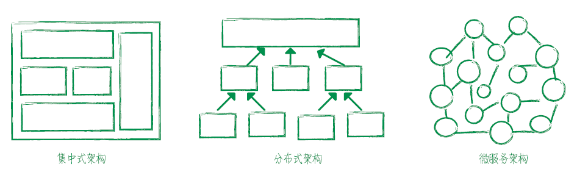

### 2.1 特点

- 集中式架构：单体无分散
- 分布式架构：分散压力
- 微服务架构：分散能力

### 2.2 微服务架构优势

- 每个微服务组件都是简单灵活的，能够独立部署。不再像单体应用时代，应用需要一个庞大的应用服务器来支撑。
- 可以由一个小团队负责更专注专业，相应的也就更高效可靠。
- 微服务之间是松耦合的，微服务内部是高内聚的，每个微服务很容易按需扩展。

## 三、微服务技术选型和微服务的问题

### 3.1 技术选型

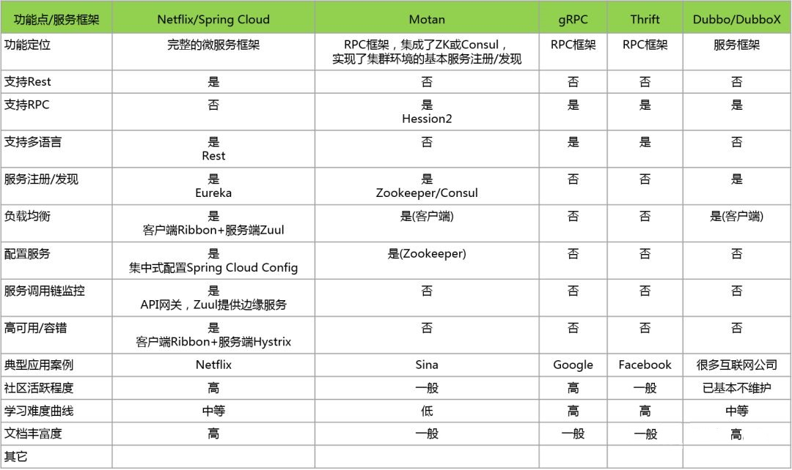

#### 3.1.1 技术矩阵结论

- Netflix提供了比较全面的解决方案
- Spring Cloud对于Netflix的封装比较全面
- Spring Cloud基于Spring Boot，团队有基础
- Spring Cloud提供了Control Bus能够帮助实现监控埋点
- 业务应用部署在阿里云，Spring Cloud对12 Factors以及Cloud-Native的支持，有利于在云环境下使用

#### 3.1.2 团队期望

- 首先支持Rest
- 团队技术栈和实例比较单薄，希望对新的技术平滑的学习曲线和能够Hold住
- 小团队，希望能够有一个比较全面的解决方案
- 目前团队主要采用Spring Cloud + Spring Boot的方式实现服务化

有关技术选型详细分析，请查看我的上一篇文章[《我的技术选型》](http://mp.weixin.qq.com/s?__biz=MzI4NjY0NTYwMg==&mid=2247483821&idx=1&sn=e54f3a6d0ff89f892c05bc8ec9fc5da3&chksm=ebd88da0dcaf04b64033dda78a64475d478b80a587a6a5270d0d0b6c67c2d1fcb4d4dba78473&scene=21#wechat_redirect)。

### 3.2 微服务带来的问题

- 依赖服务变更很难跟踪，其他团队的服务接口文档过期怎么办？依赖的服务没有准备好，如何验证我开发的功能。
- 部分模块重复构建，跨团队、跨系统、跨语言会有很多的重复建设。
- 微服务放大了分布式架构的系列问题，如分布式事务怎么处理？依赖服务不稳定怎么办？
- 运维复杂度陡增，如：部署物数量多、监控进程多导致整体运维复杂度提升。

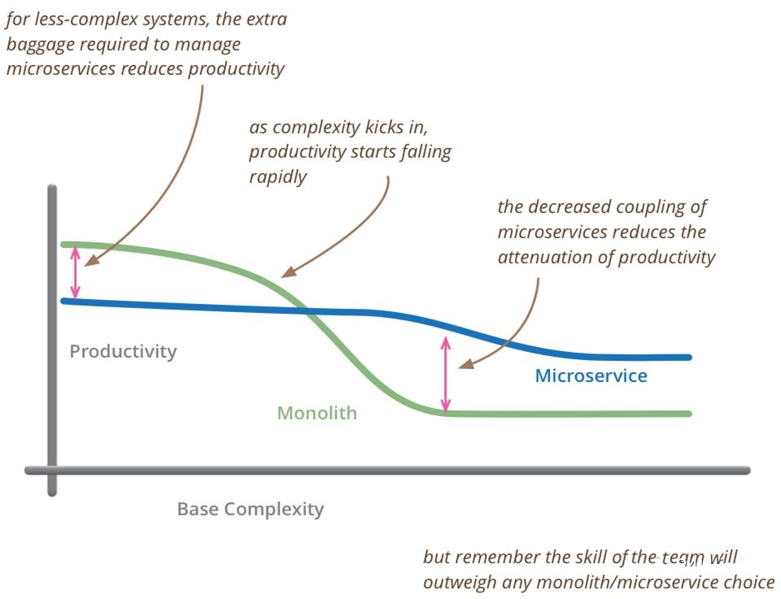

上面这些问题我们应该都遇到过，并且总结形成了自己的一些解决方案，比如提供文档管理、服务治理、服务模拟的工具和框架； 实现统一认证、统一配置、统一日志框架、分布式汇总分析； 采用全局事务方案、采用异步模拟同步；搭建持续集成平台、统一监控平台等等。

微服务架构是一把双刃剑，虽然解决了集中式架构和分布式架构的问题，却带来了如上种种问题。因此我们是需要一个微服务应用平台才能整体性的解决这些问题。

## 四、微服务架构设计

### 4.1 微服务应用架构设计原则

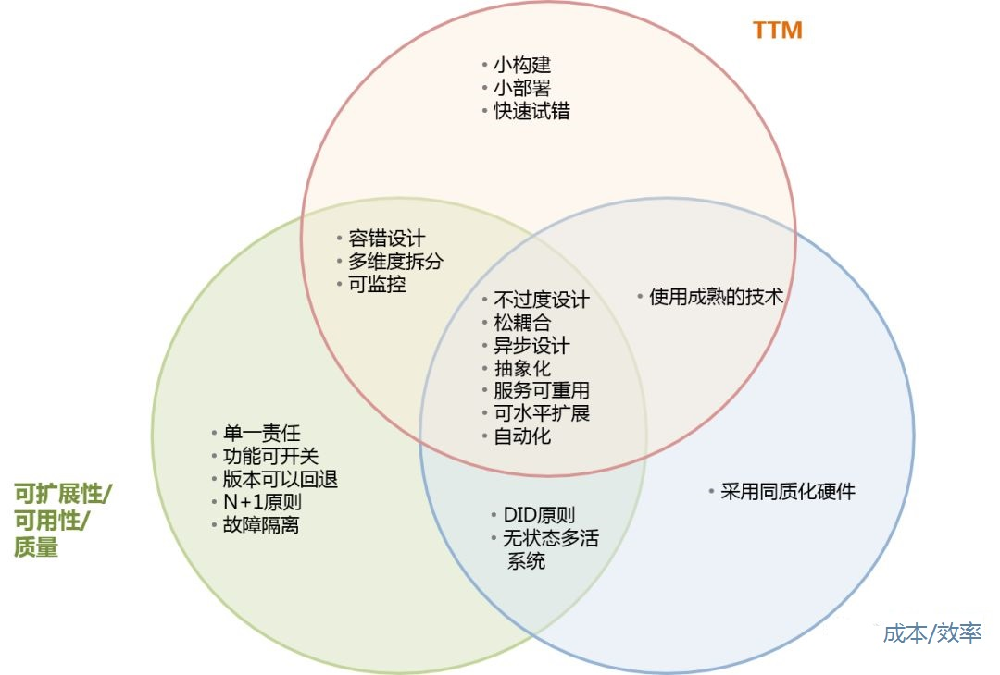

### 4.2 微服务应用架构设计目标

微服务架构设计的目标，满足快速开发、灵活升级、高性能、高可用、高稳定、简化运维等更高的需求。

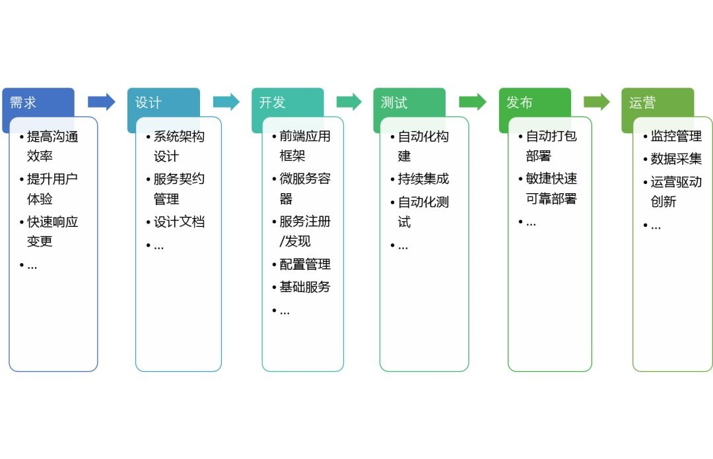

### 4.3 微服务应用总体架构

微服务应用平台的总体架构，主要是从开发集成、微服务运行容器与平台、运行时监控治理和外部渠道接入等维度来划分和考虑的。

- 开发集成：主要是搭建一个微服务平台需要具备的一些工具和仓库
- 运行时：要有微服务平台来提供一些基础能力和分布式的支撑能力，我们的微服务运行容器则会运行在这个平台之上。
- 监控治理：则是致力于在运行时能够对受管的微服务进行统一的监控、配置等能力。
- 服务网关： 则是负责与前端的WEB应用 移动APP 等渠道集成，对前端请求进行认证鉴权，然后路由转发。

### 4.4 微服务框架概览

 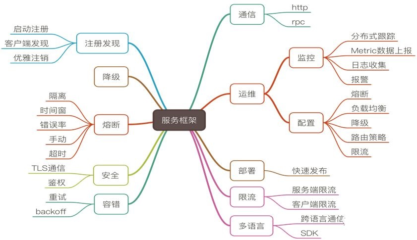

这里不详细讲解服务框架中每一个组件，另开一篇文章来讲解。

## 五、微服务架构设计落地

### 5.1 基础环境

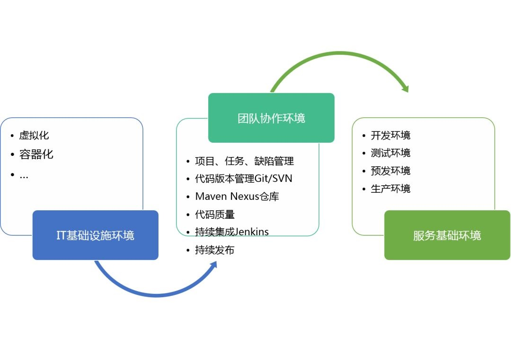

一个企业的IT建设非常重要的三大基础环境：团队协作环境、服务基础环境、IT基础设施。

- 团队协作环境：主要是DevOps领域的范畴，负责从需求到计划任务，团队协作，再到质量管理、持续集成和发布。
- 服务基础环境：指的是微服务应用平台，其目标主要就是要支撑微服务应用的设计开发测试，运行期的业务数据处理和应用的管理监控。
- IT基础设施：主要是各种运行环境支撑如IaaS (VM虚拟化)和CaaS (容器虚拟化)等实现方式。

### 5.2 服务通信

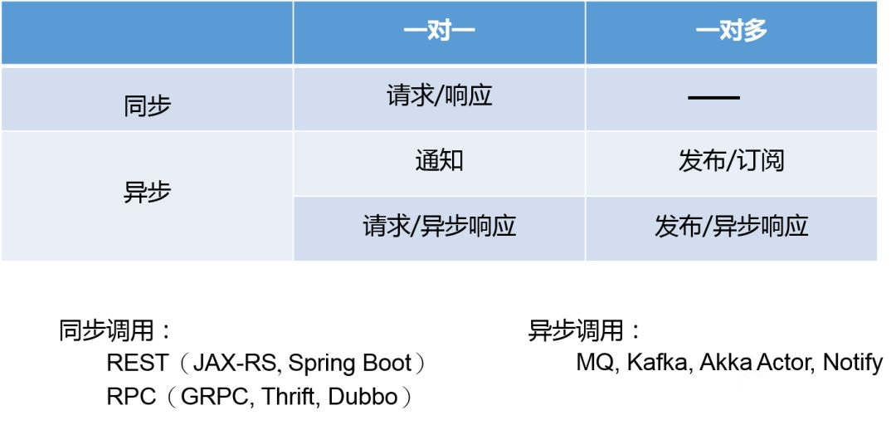 

服务间的通信，往往采用HTTP+REST 和 RPC通信协议。

 HTTP+REST，对服务约束完全靠提供者的自觉。

- 特点是简单，对开发使用友好。
- 缺点治理起来困难，连接的无状态，缺失多路复用、服务端推送等。

 RPC对通信双方定义了数据约束。

- 连接大多基于长连接以获得性能的提升及附带的服务端推、调用链路监控埋点等，增强了系统的附加能力。
- 缺点是对调用端提出了新的要求。

综合来看，RPC从性能、契约优先来说具有优势，如何做到扬长避短呢？
引入GateWay层，让REST与RPC的优点进行融合，在GateWay层提供REST的接入能力。

### 5.3 服务注册/发现

以前的单体应用之间互相调用时配置个IP或域名就行了，但在微服务架构下，服务提供者会有很多，手工配置IP地址或域名又变成了一个耦合和繁琐的事情。那么服务自动注册发现的方案就解决了这个问题。
我们的服务注册发现能力是依赖SpringCloud Eureka组件实现的。服务在启动的时候，会将自己要发布的服务注册到服务注册中心；运行时，如果需要调用其他微服务的接口，那么就要先到注册中心获取服务提供者的地址，拿到地址后，通过微服务容器内部的简单负载均衡期进行路由用。

Eureka Server特点：

- Eureka Client会缓存服务注册信息
- Eureka Server的注册信息只存储在内存中
- Eureka的注册只针对application级别，不支持更细粒度的服务注册，如单个服务Rest
- 服务每隔30秒向Eureka Server发送心跳，不建议修改心跳时间。Eureka用这个时间来判断集群内是否存在大范围的服务通信异常
- 如果在15分钟内有85%的服务没有被续约，则Eureka Server停止移除已注册的服务，以保障已注册的服务信息不丢失
- Eureka Server之间的数据同步，采用全量拉取，增量同步的方式
- Eureka 满足分布式事务中的CAP理论中的AP

### 5.4 集中式配置管理

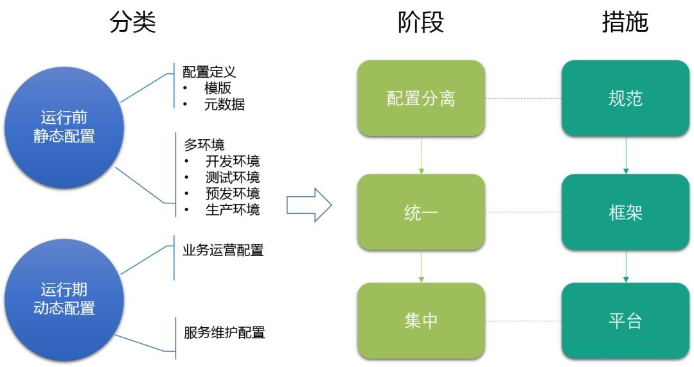

微服务分布式环境下，一个系统拆分为很多个微服务，一定要告别运维手工修改配置配置的方式。需要采用集中配置管理的方式来提升运维的效率。
`配置文件主要有运行前的静态配置和运行期的动态配置两种。`

- 静态配置通常是在编译部署包之前设置好。
- 动态配置则是系统运行过程中需要调整的系统变量或者业务参数。

 要想做到集中的配置管理，那么需要注意以下几点。

- 配置与介质分离，这个就需要通过制定规范的方式来控制。
- 配置的方式要统一，格式、读写方式、变更热更新的模式尽量统一，要采用统一的配置框架。
- 需要运行时需要有个配置中心来统一管理业务系统中的配置信息。

概念抽象：
介质，是源码编译后的产物与环境无关，多环境下应该是可以共用的如：jar

### 5.5 统一认证鉴权

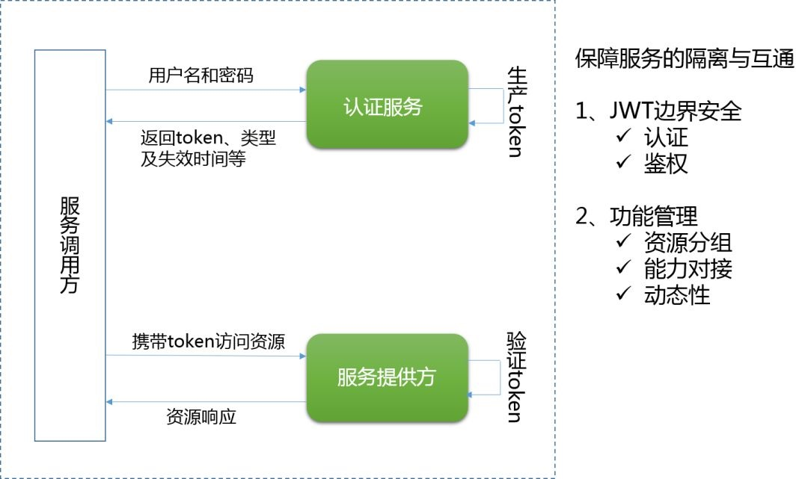

安全认证方面，我们基于Spring Security OAuth2 + JWT做安全令牌，实现统一的安全认证与鉴权，使得微服务之间能够按需隔离和安全互通。
认证鉴权一定是个公共的服务，而不是多个系统各自建设。

### 5.6 分布式调用

微服务架构下，相对于传统部署方式，存在更多的分布式调用，那么“如何在不确定的环境中交付确定的服务”，这句话可以简单理解为，我所依赖的服务的可靠性是无法保证的情况下，我如何保证自己能够正常的提供服务，不被我依赖的其他服务拖垮？
我们采用的方案：

- 合理的超时时间
- 合理的重试机制
- 合理的异步机制
- 合理的限流机制（调用次数和频率）
- 合理的降级机制
- 合理的熔断机制

推荐SEDA架构来解决这个问题。
SEDA : staged event-driven architecture本质上就是采用分布式事件驱动的模式，用异步模拟来同步，无阻塞等待，再加上资源分配隔离结起来的一个解决方案。

### 5.7 分布式事务

**分布式事务-CAP**

- C 分布式环境下多个节点的数据是否强一致
- A 分布式服务能一直保证可用状态
- P 网络分区的容错性

**分布式事务-策略**

- 避免跨库事务，尽可能相关表在同一个DB
- 2PC 3PC TCC 补偿模式等， 耗时且复杂
- 基于MQ的最终一致性 简单、高效、易于理解
- 将远程分布式事务拆解成一系列本地的事务

**分布式事务-基于MQ**

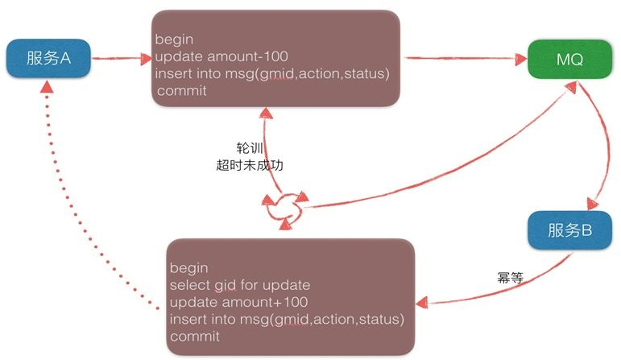

### 5.8 服务拆分

**服务拆分方式**

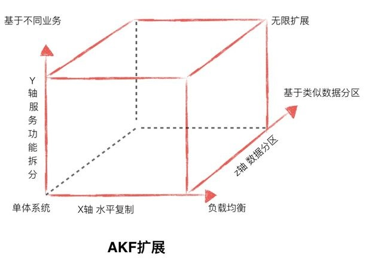

AKF扩展立方体，是抽象总结的应用扩展的三个维度。

- X轴 扩展部署实例，就是讲单体系统多运行几个实例，做个集群加负载均衡的模式。
- Y轴 业务领域分离，就是基于不同的业务拆分。
- Z轴 数据隔离分区，比如共享单车在用户量激增时，集群模式撑不住了，那就按照用户请求的地区进行数据分区，北京、上海、深圳等多建几个集群。

 **服务拆分要点**

- 低耦合、高内聚：一个服务完成一个独立的功能
- 按照团队结构：小规模团队维护，快速迭代

### 5.9 数据库拆分

单库单表难以支撑日益增长的业务量和数据量，服务拆分了数据库也跟着拆分。

**5.9.1 模式**

- 垂直拆分
- 水平拆分

 **5.9.2 原则**

- 尽可能不拆分
- 避免跨库事务
- 单表量级1000w
- 避免垮裤join（冗余、全局表）

 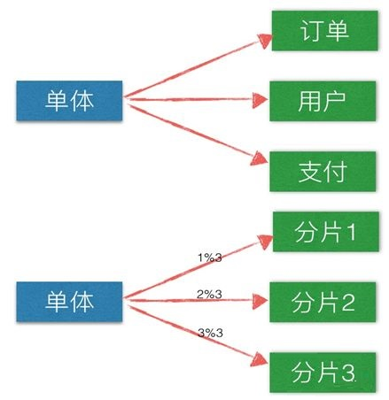

### 5.10 日志管理

日志主要有三种，系统日志，业务日志，跟踪日志。有了这些日志，在出问题的时候能够帮助我们获取一些关键信息进行问题定位。
要想做到，出了问题能够追根溯源，那么我们需要一个可以将整个完整的请求调用链串联起来的标识，这个标识能够让我们快速定位问题发生的具体时间地点以及相关信息，能够快速还原业务交易全链路。对这些日志与流水的细节处理，对于系统运维问题定位有非常大的帮助。通常开源框架只是提供基础的框架，而设计一个平台则一定要考虑直接提供统一规范的基础能力。

分布式跟踪

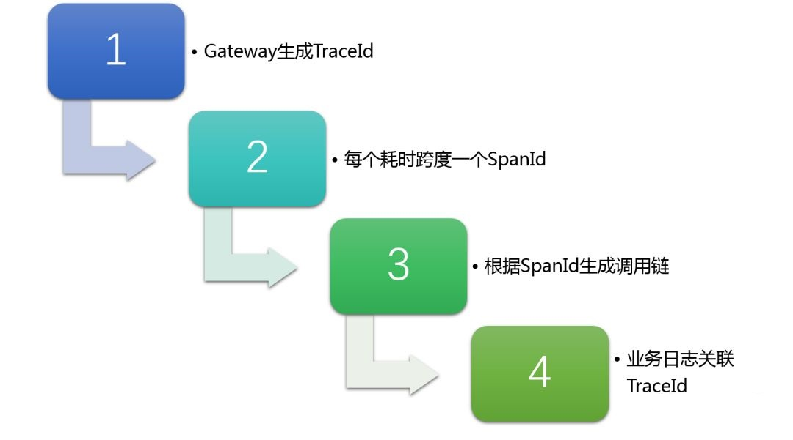

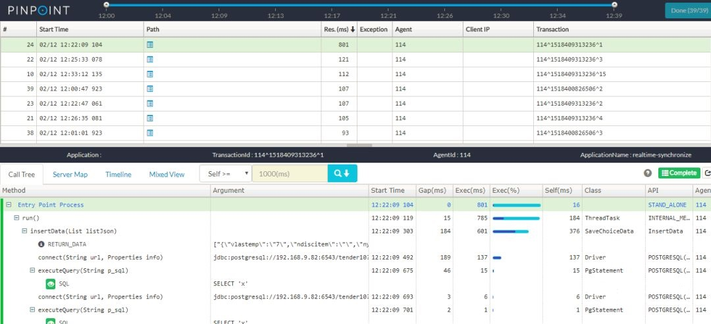

### 5.11 服务契约与API管理

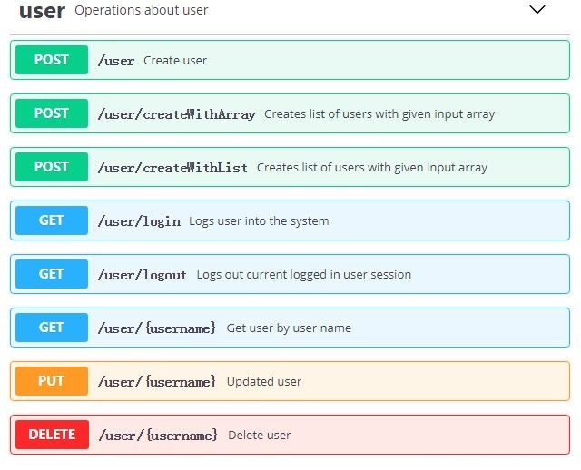

对于前面提到的微服务带来的依赖管理问题，我们需要提供API管理能力。说到API管理，那首先就用提到服务契约。
服务契约，主要描述服务接口的输入输出规格标准和其他一些服务调用集成相关的规格内容。

### 5.12 服务契约与服务模拟

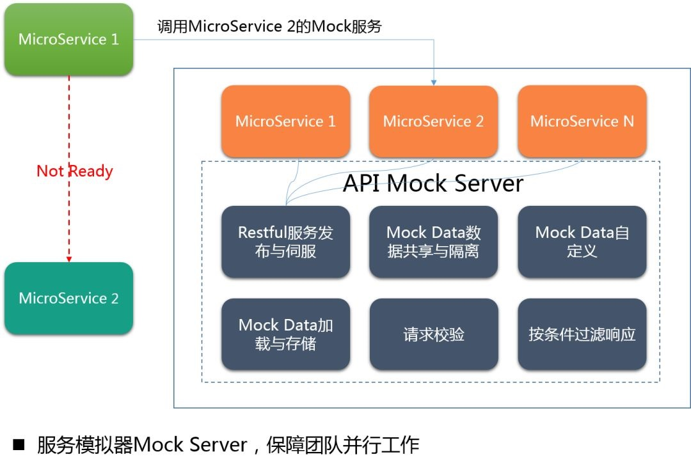

有了服务契约，研发人员就可以方便的获取到依赖服务变更的情况，能够及时的根据依赖服务的变化调整自己的程序，并且能够方便的进行模拟测试验证。
根据契约生成模拟服务也就是我们常说的服务挡板，这样即使依赖的其他服务还无法提供功能，我们也可以通过挡板来进行联调测试。

### 5.13 微服务容器

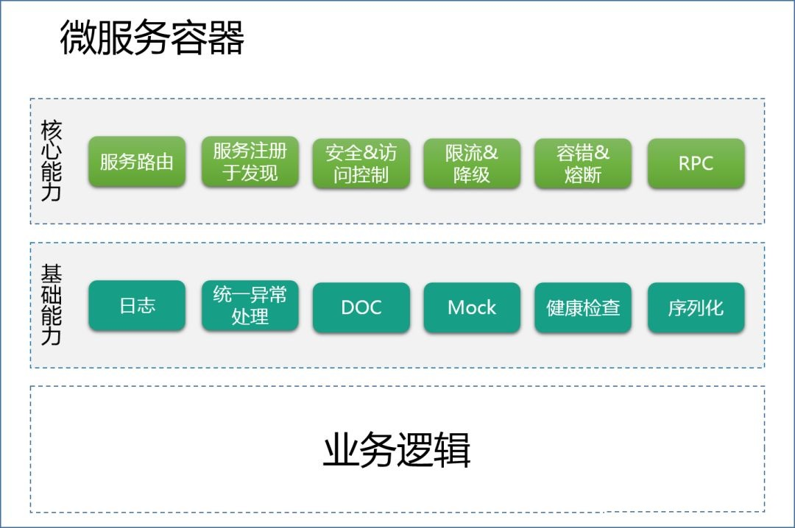

我们要做稳定、高效、易扩展的微服务应用，实际上我们需要做的事情还是非常多的。如果没有一个统一的微服务容器，这些能力在每个微服务组件中都需要建设一遍，也很难集成到一起。有了统一的微服务运行容器和一些公共的基础服务，前面所提到的微服务架构下部分组件重复建设的问题也迎刃而解。

### 5.14 持续集成与持续部署

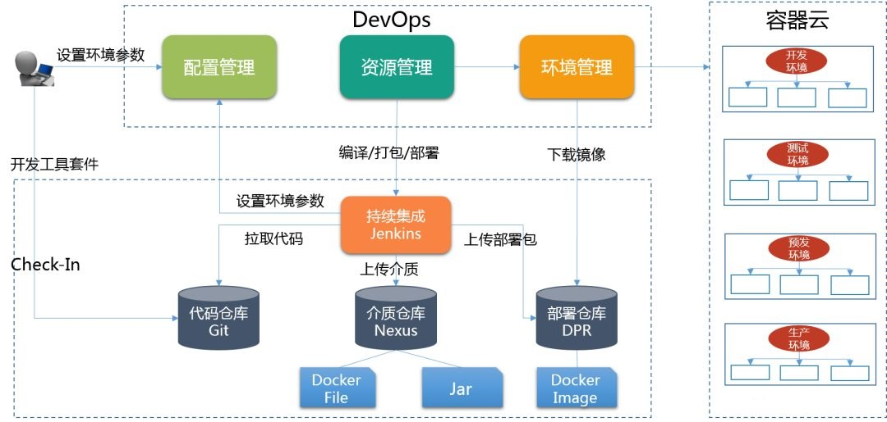

在运维方面，首先我们要解决的就是持续集成和持续交付，能够方便的用持续集成环境把程序编译成介质包和部署包并持续稳定的部署到每个环境。

概念抽象：

- 介质：是源码编译后的产物与环境无关，多环境下应该是可以共用的。如：jar
- 配置：则是环境相关的信息。

部署包=配置+介质。

### 5.15 微服务平台与容器云、DevOps的关系

就微服务应用平台本身来说，并不依赖DevOps和容器云，开发好的部署包可以运行在物理机、虚拟机或者是容器中。然而当微服务应用平台结合了DevOps和容器云之后，我们就会发现，持续集成和交付变成了一个非常简单便捷并且又可靠的过程。简单几步操作，整套开发、测试、预发或者生产环境就能够搭建完成。
整个过程的复杂度都由平台给屏蔽掉了，通过三大基础环境的整合，我们能够使分散的微服务组件更简单方便的进行统一管理和运维交付。

### 5.16 技术团队的组织

**技术团队组织 – 小团队**

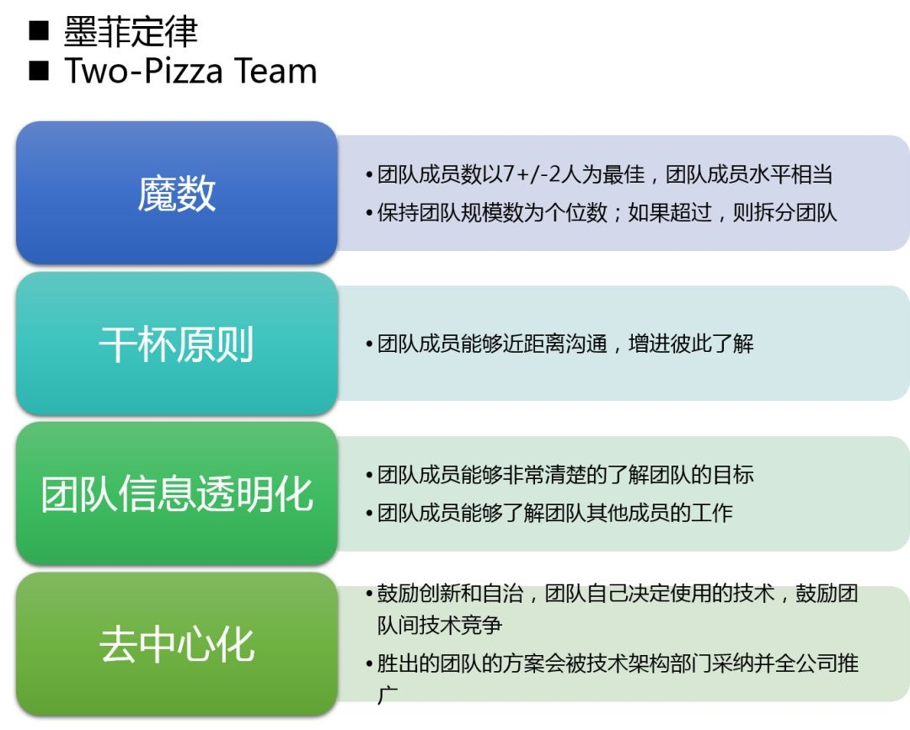

根据“康威定律”，软件架构是由组织的架构决定的，因此按照贝索斯“two-pizza”团队的理论和敏捷方法，构建小的团队，可以有效减少沟通成本，有利于团队的自治。

我们通过让一个小的团队有比较全面的建制，Leader（熟悉业务和技术）+ 前端工程师 + 后端工程师，往往可以能够比较独立地承接一个或者几个业务的工作。这样团队成员整体负责一个或者几个业务模块，可以极大地提高团队成员的参与感、使命感和责任感，团队成员相互帮助，高度自治，大家要么一起成功，要么一起失败。

**技术团队组织 – 团队划分**

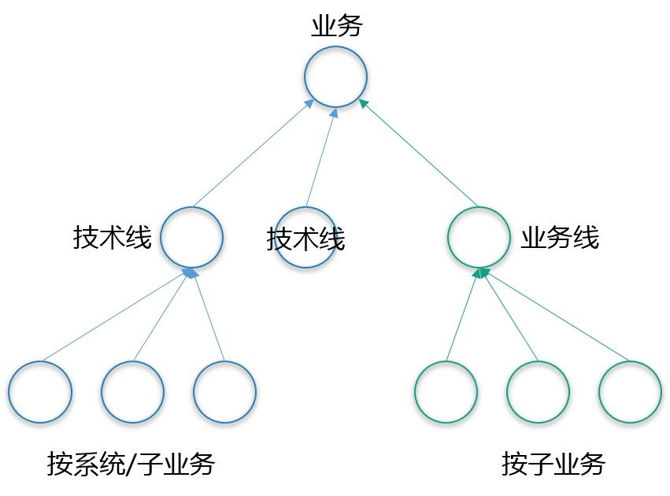

团队的划分，是按照业务线划分的。随着业务的复杂度的增加，可以按照业务/子业务线的方式来划分团队，但并不是绝对的扁平化，而是严格遵循two-pizza原则。
业务线的划分常常按业务细分，技术团队要负责支持全部业务线，因此技术团队的划分通常按系统或者是业务，Two pizza团队的原则在组织层级的任何部分都适用，当人数过多时，必须继续拆分。

**技术团队组织 – 团队合作**

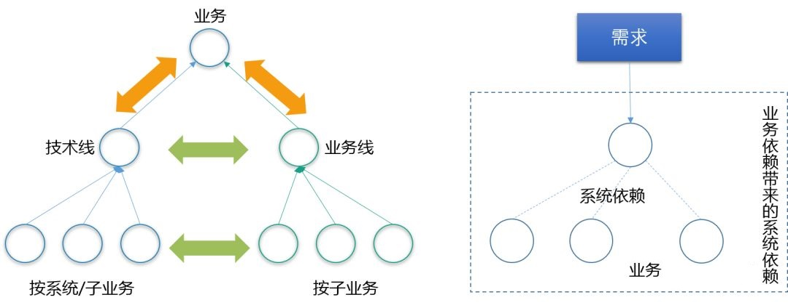

**技术团队组织 – 结果导向**

1. 主人翁意识（Ownership）
2. 行动力（Bias for Action）
3. 吃自己的狗粮（Eat your dog food）
   • 工程师负责从需求调研、设计、开发、测试、部署、维护、监控、功能升级等一系列的工作，也就是说软件工程师负责应用或者服务的全生命周期的所有工作
   • 运维是团队成员的第一要务，在强大的自动化运维工具的支撑下，软件工程师必须负责服务或者应用的SLA
4. 开发人员参与架构设计，而不是架构师参与开发
   • 研发人员是Owner，对业务和团队负责
   • 强调抽象和简化，将复杂的问题分解成简单的问题，并有效解决，避免过度设计
   • 鼓励用新技术解决问题，但强调掌控力

## 六、微服务架构设计过程中积累的心得

- 深入理解业务
- 设计阶段要追求完美，实践阶段要考虑实际情况作出平衡
- 容错能力
- 监控先行
- 任何上线可回滚

## 七、总结

微服务架构是技术升级，但更多的是管理模式的升级、思维方式的转变。

 -EOF-