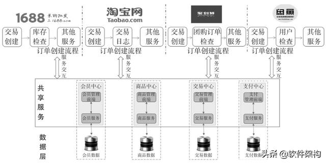

# 微服务和中台相关知识

## 

## 什么是微服务？

微服务架构将单体应用，按照业务领域拆分为多个高内聚低耦合的小型服务，每个小服务运行在独立进程，由不同的团队开发和维护，服务间采用轻量级通信机制，如HTTP RESTful API，或者RPC，独立自动部署，可以采用不同的语言及存储。

微服务体现去中心化、天然分布式，是中台战略落地到IT系统的具体实现方式的技术架构，用来解决企业业务快速发展与创新时面临的系统弹性可扩展、敏捷迭代、技术驱动业务创新等难题。

## 微服务解决什么问题？

传统的单体应用有很大的局限性，应用程序随着业务需求的迭代、功能的追加扩展，最终成为一个庞然大物。单体应用的局限性大体包括以下几方面：

- 复杂性高：业务规模和团队规模发展的一定阶段，模块耦合严重，代码难以理解，质量变差。
- 交付效率低：构建和部署耗时长，难以定位问题，开发效率低，全量部署耗时长、影响范围广、风险大，发布频次低。
- 伸缩性差：单体只能按整体横向扩展，无法分模块垂直扩展。
- 可靠性差：一个bug有可能引起整个应用的崩溃。
- 阻碍技术创新：受技术栈限制，团队成员使用同一框架和语言。

## 微服务有什么特点？

- 易于开发与维护：微服务相对小，易于理解；

- 独立部署：一个微服务的修改不需要协调其它服务；

- 伸缩性强：每个服务都可按硬件资源的需求进行独立扩容；

- 与组织结构相匹配：微服务架构可以更好将架构和组织相匹配，每个团队独立负责某些服务，获得更高的生产力；

- 技术异构性：使用最适合该服务的技术，降低尝试新技术的成本；

- 企业环境下的特殊要求：去中心化和集中管控/治理的平衡，分布式数据库和企业闭环数据模型的平衡；

## 什么是中台？

  中台的定义应该是：企业级能力复用平台。

  - 企业级-定义了中台的范围，中台不同于单系统的服务化和微服务。
  - 能力-定义了中台的主要承载对象，可以是业务能力，技术能力，数据能力，甚至是财务能力，人力资源管理能力。
  - 复用-定义了中台的核心价值，传统的IT系统对于复用没有太多的关注，而中台要求组织需要通过复用实现数字化敏捷力。
  - 平台-定义了中台的主要形式，区别于传统IT系统的烟囱式构建，通过对能力的更细粒度识别，实现企业能力的柔性复用。

  **共享服务体系是业务中台的核心中枢。**

  - 对这些服务中心的服务稳定性、服务能力的扩展性、服务需求的快速响应能力提出了更高要求。
  - 构建共享服务体系，需要采用一套服务化框架来支撑整个服务体系的运转。

  **服务中心的服务形态多样性：**

1. 接口是服务最主要的形式。

  如果服务中心的服务都完全拘泥于接口这种形式，那又大大局限了服务中心的服务能力，或者会增加上层业务的使用成本。

2. 服务中心也可提供界面形式的服务能力。

  淘宝的商品中心的商品发布能直接提供用户操作的界面，商品的类目管理也会有淘宝小二操作的界面，类似的交易中心、营销中心都有提供界面形式的服务能力。

  ## 为什么中台化落地需要使用微服务架构？

  中台强调核心基础能力的建设，基础能力以原子服务的形式来建设，并通过将原子服务产品化，支撑业务端各种场景的快速迭代和创新；原子服务和微服务所倡导的服务自闭环思想不谋而合，使得微服务成为实现原子服务的合适架构。

  支撑业务场景的应用也是通过服务来实现，其生命周期随业务变化需要非常灵活的调整，这也和微服务强调的快速迭代高度一致，所以业务应用服务也适合通过微服务来实现。

  中台化系统建设不是一蹴而就的，需要长期动态的演进，加上其技术体系已经在互联网领域被证明且相当成熟，其在企业落地、执行的土壤已经具备。

## 阿里的中台战略是什么？

阿里的中台大约有十几个共享业务单元，包括用户中心、商品中心、交易中心等。淘宝、天猫、聚划算等 25 个大型业务应用都是由中台的共享业务单元支持的，共享业务单元则由阿里云平台支持。共享业务单元的划分原则其实不是可以简单掌握的，要综合考量设计、运营和工程因素，尽可能遵循“高内聚、低耦合”、“数据完整”、“业务可运营”和“渐进”的原则。阿里在划分中台时非常重视其业务价值和基于业务的设计，而且有业务架构岗位，每个共享单元都有业务架构师。但总体来讲，其业务架构仍然是领域性的。

**服务中心的设计--基本原则：**

- 高内聚、低耦合原则；
- 数据完整性原则；（服务化架构一个很重要的业务价值，就是数据模型统一）
- 业务可运营型原则；（期望服务中心是承载业务逻辑、沉淀业务数据、产生业务价值的业务单元）
- 渐进性的建设原则；（小步快跑的方式逐步推进，服务化从简单开始，只有真实的业务需求才会锤炼出稳定可靠的共享服务）

业务通过中台进行共享支持后，基础设施基于阿里云支持高并发和可扩展。阿里采用去中心的 HSF/Dubbo 分布式服务框架，以支持服务的点对点调用，解决 ESB 可能产生的瓶颈问题；采用微服务设计方式，提高变化响应速度，并通过大力推行 DDD（领域驱动开发）设计模式，提升设计效率；自研设计了分布式数据层框架 TDDL（Taobao Distributed Data Layer）以及分布式数据库 DRDS；研发了支持分布式事务处理的 TXC；支持高效故障定位和运维监控的鹰眼平台；实现了限流和优雅降级设计，以及做保障的全链路压测平台、业务一致性平台等。这是一套完整的基础设施，提供针对电商业务特点的支持。

在阿里的中台战略中，共享服务中心是中台架构的基石，如何构建稳定可靠、最高效地支撑上层业务快速创新的共享服务能力是中台战略成功落地的关键。

