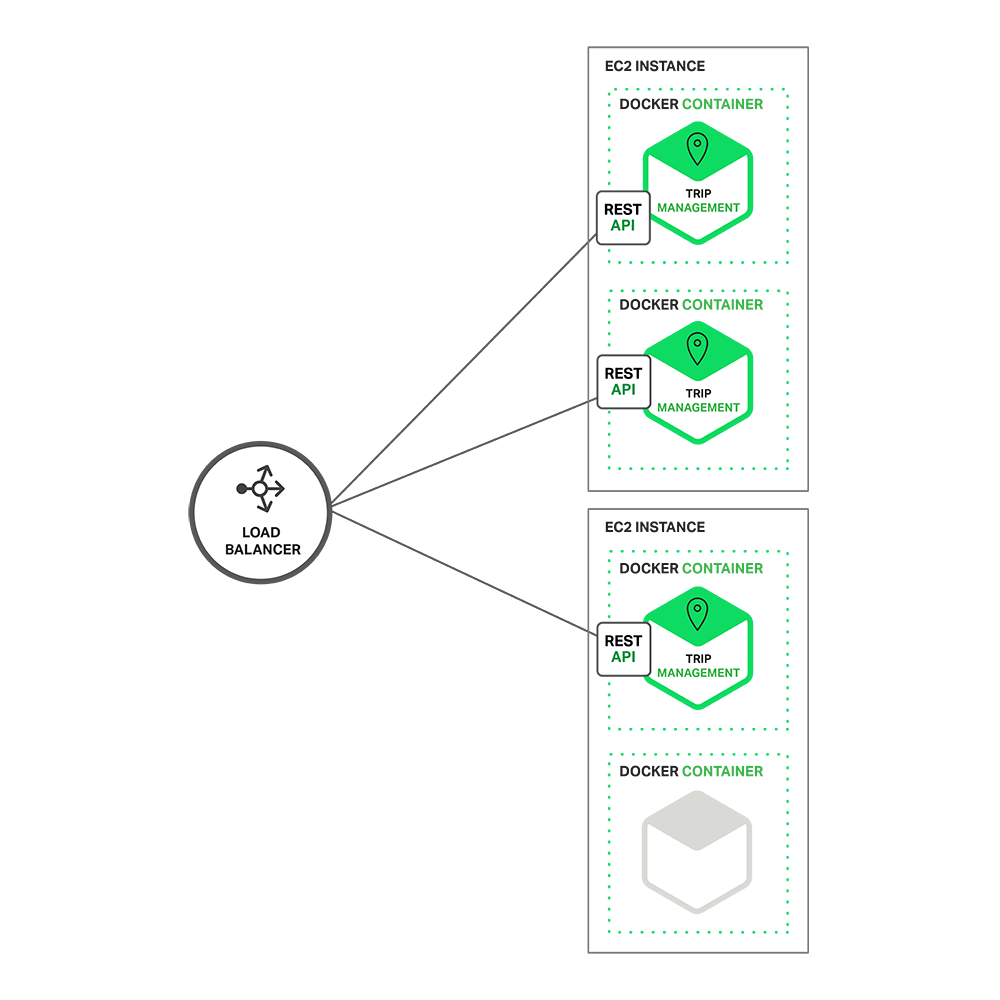

# [微服务系列](https://www.cnblogs.com/jpwahaha/p/10600970.html)

 **作者介绍：**Chris Richardson，是世界著名的软件大师，经典技术著作《POJOS IN ACTION》一书的作者，也是 cloudfoundry.com 最初的创始人，Chris Richardson 与 Martin Fowler、Sam Newman、Adrian Cockcroft 等并称为世界十大软件架构师。

**Chris Richardson 所著所有文章已独家授权 DaoCloud 翻译并刊载。**

# [（一）：微服务架构的优势与不足](https://www.cnblogs.com/jpwahaha/p/10600970.html)

微服务在当下引起广泛关注，成为文章、博客、社交媒体讨论和大会演讲的热点；在 Gartner 的 “Hype Cycle” 上排名也非常靠前。与此同时，在软件社区也有人质疑微服务并非新事物。反对者认为微服务只是 SOA （Service Oriented Architecture）的二度包装。然而，无论是追捧还是质疑，微服务架构拥有巨大优势，尤其是它让敏捷开发和复杂的企业应用交付成为可能。

本系列包含 7 篇文章，介绍了微服务的设计、构建和部署，并与传统的单体架构进行了比较。本系列将分析微服务架构的各种因素，你也将了解微服务架构模型的优劣、是否适合你的项目，以及如何应用。

Chris Richardson 微服务系列全 7 篇：

> 1. 微服务架构的优势与不足
>
> [2. 构建微服务架构：使用 API Gateway](https://www.cnblogs.com/jpwahaha/p/10601035.html)
>
> [3. 深入微服务架构的进程间通信](https://www.cnblogs.com/jpwahaha/p/10601096.html)
>
> [4. 服务发现的可行方案以及实践案例](https://www.cnblogs.com/jpwahaha/p/10601145.html)
>
> [5. 微服务的事件驱动数据管理](https://www.cnblogs.com/jpwahaha/p/10601342.html)
>
> [6. 选择微服务部署策略](https://www.cnblogs.com/jpwahaha/p/10601385.html)
>
> [7. 将单体应用改造为微服务](https://www.cnblogs.com/jpwahaha/p/10601446.html)

首先让我们了解为何要将微服务纳入考量。

## 构建单体应用

假设我们要开发一款全新的与 Uber 和 Hailo 竞争的打车软件。在前期的会议和需求整理后，你要么需要手动创建一个新项目，要么可以使用 Rails、Spring Boot、Play 或者 Maven 来生成。这个新应用可能采用了六边形架构模块，如下图所示：

应用的核心是商业逻辑，它由定义服务、域对象和事件各模块来完成。各种适配器围绕核心与外部交互。适配器包括数据库访问组件、生成和 consume 信息的消息组件，以及提供 API 或者 UI 访问支持的 web 模块。

尽管拥有逻辑缜密的模块化设计，整个应用仍然以整体打包和部署，实际格式依赖于应用的语言和框架。譬如，许多 Java 应用被打包为 WAR 文件，部署在 Tomcat 或者 Jetty 这样的应用服务器。有些 Java 应用本身就是包涵 JARs 的软件包。与此类似，Rails 和 Node.js 应用也通过目录层级打包。

采用此种风格的应用非常普遍。由于 IDE 和其他工具擅长构建单一应用，这类应用也易于部署。这类应用也非常容易测试。你可以非常轻松地进行端到端测试，使用 Selenium 测试 UI 。整体应用也便于部署，只需将软件包复制到服务器。你也可以通过运行多个包和负载均衡实现扩展。在项目早期这么做非常有效。

## 踏入单体架构的地狱

很不幸，这一简单的方法有着巨大的局限。成功的应用最终会随着时间变得巨大。在每个 sprint 阶段，开发团队都会新加许多行代码。几年后，原本小而简单的应用会变得臃肿。举个极端的例子，我最近与一位开发者交流，他正在开发一款小工具，来分析他们应用（包括几百万行代码）中的几千个 JARs 的依赖。我相信每年都会有大量开发者不遗余力地对付这种麻烦。

一旦你的应用变得庞大、复杂，你的开发团队将饱受折磨，苦苦挣扎于敏捷开发和交付。一大原因就是应用已经格外复杂，庞大到任何一个开发者都无法完全理解。最后，修复 bug 和实施新功能也就极其困难且耗时颇多。更可怕的是，这是一个向下的螺旋发展。代码库越难理解，正确的修改就越难。最后你会深陷庞大的、无法估量的泥淖之中。

而这种应用的尺寸也会拖慢开发进度。应用越大，启动时间越长。譬如在最近的调查中，不少开发者指出启动时间长达 12 分钟。我也听说有的应用启动时间居然得 40 分钟。如果开发者不得不频繁重启应用服务器，那大量时间就被浪费，生产效率也饱受其害。

庞大且复杂的单体应用的另一大问题就是难以进行持续部署。现在， SaaS 应用的发展水平足以在单日内多次将修改推送到生产环境。然而要让复杂的单个应用达到此水平却极为棘手。想更新应用的单个部分，必须重新部署整个应用，漫长的启动时间更是雪上加霜。另外，由于不能完全预见修改的影响，你不得不提前进行大量人工测试。结果就是，持续部署变得不可能。

如果单体应用的不同模块在资源需求方面有冲突的话，那应用的扩展也很难。比如，模块之一需要执行 CPU-intensive 图像处理逻辑，最好部署到 AWS 的 EC2 Compute Optimized instances；而另一模块需要内存数据库，最好适配 EC2 Memory-optimized instances。由于这两个模块需要共同部署，你不得不在在硬件选择方面做妥协。

单体应用的另一问题就是可靠性。由于所有模块都运行在同一进程中，任何模块中的一个 bug，比如内存泄漏都可能弄垮整个进程；此外，由于应用中的所有实例都是唯一，这个 bug 将影响整个应用的可用性。

最后，单体应用会让采用新框架和语言极其困难。举例来说，你有两百万行使用 XYZ 框架的代码，如果要使用 ABC 框架重写代码，无论时间还是成本都将非常高昂，即便新框架更好。这也就成为使用新技术的阻碍。

总结：这个一开始曾经成功关键业务应用，最终却变成一个臃肿的、无法理解的庞然大物。它使用老旧、陈腐、低效的技术，几乎吸引不到出色的开发者。这个应用非常难于扩展，也不稳定可靠。最终，敏捷开发和交付几乎成为不可能。

你该何去何从？

## 微服务——直击痛点

诸如亚马逊、eBay、Netflix 等公司已经通过采用微服务架构范式解决了上文（第一部分）提到的问题。不同于构建单一、庞大的应用，微服务架构将应用拆分为一套小且互相关联的服务。

一个微服务一般完成某个特定的功能，比如订单管理、客户管理等。每个微服务都是一个微型应用，有着自己六边形架构，包括商业逻辑和各种接口。有的微服务通过暴露 API 被别的微服务或者应用客户端所用；有的微服务则通过网页 UI 实现。在运行时，每个实例通常是一个云虚拟机或者 Docker 容器。

对于前文所述的系统，一种可能的系统分解图如下：

应用的每个功能区都由其自身微服务实施。此外，整个网页应用被拆分为一套简单的网页应用（比如我们的打车软件拆分为乘客应用和司机应用），从而能够轻松地针对特定用户、设备或者用户案例进行单独部署。

每个后端服务包括一个 REST API 和由其它服务提供的服务消耗 API。例如，司机管理服务使用“通知”服务器来告知司机即将的行程。UI 服务唤醒其它服务，从而呈现网页。这些服务也可能用到基于信息的异步通信。内部服务通信会在本系列文章中详述。

有的 REST API 也对司机和乘客的移动应用开放。这些应用并不能直接访问后端服务器，相反，通信由名为 API Gateway 的中间人调解。AIP Gateway 负责负载均衡、缓存、访问控制、API 计费、监控等，通过 NGINX 高效实施。本系列的后续文章将会讲解 API Gateway。

上图是 Scale Cube 的 3D 模型，来自《The Art of Scalability》 一书。微服务架构范式对应 Y 轴，X 轴由负载均衡器后端运行的多个应用副本组成，Z 轴（数据分割）将需求路由到相关服务。

应用通常同时使用这三种不同类型的扩展。Y 轴扩展将应用分解为如图一（https://www.nginx.com/wp-content/uploads/2015/05/Graph-031-e1431992337817.png）所示的微服务。在运行时维度，X 轴扩展在输出和可用性的负载均衡后运行多个实例。部分应用会使用 Z 轴扩展来对服务进行数据分割。下图展示了行程管理服务（Trip Management）是如何使用 Docker 部署到 AWS EC2 上的。

在运行时，行程管理服务包括多个服务实例，每个服务实例都是一个 Docker 容器。为了实现高可用性，这些容器运行在多个云虚拟机上。在应用实例前面是 NGINX 这样的负载均衡，将请求分发给全部实例。负载均衡也可以处理缓存、访问控制、 API 测量和监控等。

微服务架构范式对应用和数据库的关系影响巨大。每个服务都有自身的数据库计划，而不与其它服务共享同一个数据库。一方面，这个方法类似企业级数据模型。同时，它也导致部分数据的重复。然而，要想从微服务中获益，为每个服务提供单个的数据库计划就非常必要，这能保证松散耦合。下面的图表展示了示例应用的数据库架构。

每个服务都有其自己的数据库。此外，单个服务可以使用符合自己需要的特定类型的数据库，即多语言一致性架构。例如，为了发现附近乘客，驾驶员管理服务必须使用高效支持地理位置请求的数据库。

表面上看，微服务架构范式与 SOA 非常类似，这两种架构都包括一套服务。然而，微服务架构范式被看作不包含某些功能的 SOA 。这些功能包括网络服务说明（ WS-* ）和 Enterprise Service Bus (ESB) 的商品化和请求包。基于微服务的应用更青睐 REST 这样简单的、轻量级的协议，而不是 WS-* 。他们也极力避免在微服务中使用 ESBs 及类似功能。微服务架构范式也拒绝 SOA 的其它部分，比如 canonical schema 的概念。

## 微服务架构的好处

微服务架构模式有很多好处**。首先，**通过分解巨大单体应用为多个服务方法解决了复杂性问题。在功能不变的情况下，应用被分解为多个可管理的分支或服务。每个服务都有一个用 RPC- 或者消息驱动 API 定义清楚的边界。微服务架构模式给采用单体式编码方式很难实现的功能提供了模块化的解决方案，由此，单个服务很容易开发、理解和维护。

**第二，**这种架构使得每个服务都可以有专门开发团队来开发。开发者可以自由选择开发技术，提供 API 服务。当然，许多公司试图避免混乱，只提供某些技术选择。然后，这种自由意味着开发者不需要被迫使用某项目开始时采用的过时技术，他们可以选择现在的技术。甚至于，因为服务都是相对简单，即使用现在技术重写以前代码也不是很困难的事情。

**第三，**微服务架构模式使得每个微服务独立部署，开发者不再需要协调其它服务部署对本服务的影响。这种改变可以加快部署速度，譬如 UI 团队可以采用 AB 测试并快速部署变化。微服务架构模式使得持续化部署成为可能。

**最后，**微服务架构模式使得每个服务独立扩展。你可以根据每个服务的规模来部署满足需求的实利。甚至于，你可以使用更适合于服务资源需求的硬件。比如，你可以在 EC2 Compute Optimized instances 上部署 CPU 敏感的服务，而在 EC2 memory-optimized instances 上部署内存数据库。

## 微服务架构的不足

Fred Brooks 在 30 年前写道 “there are no silver bullets”，像任何其它科技一样，微服务架构也有不足。其中一个跟他的名字类似，“微服务”强调了服务大小，实际上，有一些开发者鼓吹建立稍微大一些的，10-100 LOC服务组。尽管小服务更乐于被采用，但是不要忘了微服务只是结果，而不是最终目的。微服务的目的是有效的拆分应用，实现敏捷开发和部署。

另外一个不足之处在于，微服务应用是分布式系统，由此会带来固有的复杂性。开发者需要在 RPC 或者消息传递之间选择并完成进程间通讯机制。此外，他们必须写代码来处理消息传递中速度过慢或者不可用等局部失效问题。当然这并不是什么难事，但相对于单体式应用中通过语言层级的方法或者进程调用，微服务下这种技术显得更复杂一些。

另外一个关于微服务的挑战来自于分区的数据库架构。同时更新多个业务主体的事务很普遍。这种事务对于单体式应用来说很容易，因为只有一个数据库。在微服务架构应用中，需要更新不同服务所使用的不同的数据库。使用分布式事务并不一定是好的选择，不仅仅是因为 CAP 理论，还因为当前高扩展性的 NoSQL 数据库和消息传递中间件并不支持这一需求。最终你不得不使用一个最终一致性的方法，从而对开发者提出了更高的要求和挑战。

测试一个基于微服务架构的应用也是很复杂的任务。比如，对于采用流行的 Spring Boot 架构的单体式 web 应用，测试它的 REST API，是很容易的事情。反过来，同样的服务测试需要启动与它有关的所有服务（至少需要这些服务的 stubs）。再重申一次，不能低估了采用微服务架构带来的复杂性。

另外一个挑战在于，微服务架构模式应用的改变将会波及多个服务。比如，假设你在完成一个案例，需要修改服务A、B、C，而 A 依赖 B，B 依赖 C。在单体应用中，你只需要改变相关模块，整合变化，部署就好了。对比之下，微服务架构模式就需要考虑相关改变对不同服务的影响。比如，你需要更新服务 C，然后是 B，最后才是 A。幸运的是，许多改变一般只影响一个服务，而需要协调多服务的改变很少。

部署一个微服务应用也很复杂，一个单体应用只需要在复杂均衡器后面部署各自的服务器就好了。每个应用实例是需要配置诸如数据库和消息中间件等基础服务。相比之下，一个微服务应用一般由大批服务构成。根据 Adrian Cockcroft 的分享，Hailo 由 160 个不同服务构成，而 NetFlix 则超过 600 个服务。每个服务都有多个实例，这就形成大量需要配置、部署、扩展和监控的部分。除此之外，你还需要完成一个服务发现机制（后续文章中发表），以用来发现与它通讯服务的地址（包括服务器地址和端口）。传统的解决问题办法并不能解决这么复杂的问题。最终，成功部署一个微服务应用需要开发者有足够的控制部署方法，并高度自动化。

自动化的方法之一是使用譬如 Cloud Foundry 这样的 PaaS 服务。PaaS 能让开发者轻松部署和管理微服务，让他们无需为获取并配置 IT 资源劳神。同时，配置 PaaS 的系统和网络专家可以采用最佳实践和策略来简化这些问题。另外一个自动部署微服务应用的方法是开发自己的基础 PaaS 系统。通常的起步方式是 Mesos 或 Kubernetes 这样的集群管理方案，配合 Docker 使用。作为一种基于软件的应用交付方法，NGINX 能够方便地在微服务层面提供缓冲、权限控制、API 统计、以及监控。我们会在后续的文章中分析它如何解决这些问题。

## 总结

构建复杂的应用的确非常困难。单体式的架构更适合轻量级的简单应用。如果你用它来开发复杂应用，那真的会很糟糕。微服务架构模式可以用来构建复杂应用，当然，这种架构模型也有自己的缺点和挑战。

在后续的博客中，我会深入探索微服务架构模式，并讨论多个话题，包括服务发现、服务部署选择、以及将单体应用拆分为多个服务的策略。

阅读英文原文：https://www.nginx.com/blog/introduction-to-microservices/#rd?sukey=fa67fe3435f5c4beec6f6cb43b96b08f1bd5e81949c8ff8b1378a0b2b94608dce9afd0ef72370c53e80e111d7ff9595f

#  [（二）：使用 API 网关构建微服务](https://www.cnblogs.com/jpwahaha/p/10601035.html)

> 本文将探讨：微服务架构是如何影响客户端到服务端的通信，并提出一种使用 API 网关的方法。

## 本期内容

微服务系列文章的第一篇介绍了微服务架构模式，讨论了使用微服务的优缺点，以及为什么微服务虽然复杂度高却是复杂应用程序的理想选择。

在决定以一组微服务来构建自己的应用时，你需要确定应用客户端如何与微服务交互。

在单体式程序中，通常只有一组冗余的或者负载均衡的服务提供点。在微服务架构中，每一个微服务暴露一组细粒度的服务提供点。在本篇文章中，我们来看它如何影响客户端到服务端通信，并提出一种使用 API 网关的方法。

## 简要概述

让我们想象一下，你要为一个购物应用程序开发一个原生移动客户端。你很可能需要实现一个产品详情页面，展示任何指定商品的信息。

下图展示了 Amazon Android 应用在商品详情页显示的内容。

 

即使只是个智能手机应用，产品详情页面也显示了大量的信息。该页面不仅包含基本的产品信息（如名称、描述、价格），而且还显示了如下内容：

> - 购物车中的商品数量
> - 历史订单
> - 客户评论
> - 低库存预警
> - 送货选项
> - 各种推荐，包括经常与该商品一起购买的其它商品、购买该商品的客户购买的其它商品、购买该商品的客户看过的其它商品
> - 其它的购物选择

使用单体应用程序架构时，移动客户端通过向应用程序发起一次 REST 调用（GET api.company.com/productdetails/）来获取这些数据。负载均衡器将请求路由给 N 个相同的应用程序实例中的其中之一。然后，应用程序会查询各种数据库表，并将响应返回给客户端。

相反，若是采用微服务架构，显示在产品页上的数据会分布在不同的微服务上。下面列举了可能与产品详情页数据有关的一些微服务：

> - 购物车服务——购物车中的件数
> - 订单服务——历史订单
> - 目录服务——商品基本信息，如名称、图片和价格
> - 评论服务——客户的评论
> - 库存服务——低库存预警
> - 送货服务——送货选项、期限和费用，这些信息单独从送货方 API 获取
> - 推荐服务——推荐商品

我们需要决定移动客户端如何访问这些服务。让我们看看有哪些方法。

## 客户端与微服务直接通信

从理论上讲，客户端可以直接向每个微服务发送请求。每个微服务都有一个公开的端点(https ://.api.company.name）。该 URL 映射到微服务的负载均衡器，由后者负责在可用实例之间分发请求。为了获取产品详情，移动客户端将逐一向上文列出的 N 个服务发送请求。

遗憾的是，这种方法存在挑战和局限。**问题之一是客户端需求和每个微服务暴露的细粒度 API 不匹配。**在这个例子中，客户端需要发送 7 个独立请求。在更复杂的应用程序中，可能要发送更多的请求；按照 Amazon 的说法，他们在显示他们的产品页面时就调用了数百个服务。然而，客户端通过 LAN 发送许多请求，这在公网上可能会很低效，在移动网络上就根本不可行。这种方法还使得客户端代码非常复杂。

**客户端直接调用微服务的另一个问题是，部分服务使用的协议对 web 并不友好。**一个服务可能使用 Thrift 二进制 RPC，而另一个服务可能使用 AMQP 消息传递协议。不管哪种协议对于浏览器或防火墙都不够友好，最好是内部使用。在防火墙之外，应用程序应该使用诸如 HTTP 和 WebSocket 之类的协议。

**这种方法的另一个缺点是，它会使得微服务难以重构。**随着时间推移，我们可能想要更改系统拆分成服务的方式。例如，我们可能合并两个服务，或者将一个服务拆分成两个或更多服务。然而，如果客户端与微服务直接通信，那么执行这类重构就非常困难了。

由于上述三种问题的原因，客户端直接与服务器端通信的方式很少在实际中使用。

## 使用 API 网关构建微服务

通常来说，使用 API 网关是更好的解决方式。API 网关是一个服务器，也可以说是进入系统的唯一节点。这与面向对象设计模式中的 Facade 模式很像。API 网关封装内部系统的架构，并且提供 API 给各个客户端。它还可能还具备授权、监控、负载均衡、缓存、请求分片和管理、静态响应处理等功能。下图展示了一个适应当前架构的 API 网关。

API 网关负责服务请求路由、组合及协议转换。客户端的所有请求都首先经过 API 网关，然后由它将请求路由到合适的微服务。API 网关经常会通过调用多个微服务并合并结果来处理一个请求。它可以在 web 协议（如 HTTP 与 WebSocket）与内部使用的非 web 友好协议之间转换。

API 网关还能为每个客户端提供一个定制的 API。通常，它会向移动客户端暴露一个粗粒度的 API。以产品详情的场景为例，API 网关可以提供一个端点（/productdetails?productid=xxx），使移动客户端可以通过一个请求获取所有的产品详情。API 网关通过调用各个服务（产品信息、推荐、评论等等）并合并结果来处理请求。

**Netflix API 网关是一个很好的 API 网关实例。**Netflix 流媒体服务提供给成百上千种类型的设备使用，包括电视、机顶盒、智能手机、游戏系统、平板电脑等等。

最初，Netflix 试图为他们的流媒体服务提供一个通用的 API。然而他们发现，由于各种各样的设备都有自己独特的需求，这种方式并不能很好地工作。如今，他们使用一个 API 网关，通过运行与针对特定设备的适配器代码，来为每种设备提供定制的 API。通常，一个适配器通过调用平均 6 到 7 个后端服务来处理每个请求。Netflix API 网关每天处理数十亿请求。

## API 网关的优点和缺点

如你所料，使用 API 网关有优点也有不足。**使用 API 网关的最大优点是，它封装了应用程序的内部结构。**客户端只需要同网关交互，而不必调用特定的服务。API 网关为每一类客户端提供了特定的 API，这减少了客户端与应用程序间的交互次数，还简化了客户端代码。

**API 网关也有一些不足。它增加了一个我们必须开发、部署和维护的高可用组件。还有一个风险是，API 网关变成了开发瓶颈。**为了暴露每个微服务的端点，开发人员必须更新 API 网关。API网关的更新过程要尽可能地简单，这很重要；否则，为了更新网关，开发人员将不得不排队等待。不过，虽然有这些不足，但对于大多数现实世界的应用程序而言，使用 API 网关是合理的。

## 实现 API 网关

到目前为止，我们已经探讨了使用 API 网关的动力及其优缺点。下面让我们看一下需要考虑的各种设计问题。

### **性能和可扩展性**

只有少数公司拥有 Netflix 这样的规模，需要每天处理每天需要处理数十亿请求。不管怎样，对于大多数应用程序而言，API 网关的性能和可扩展性都非常重要。**因此，将 API 网关构建在一个支持异步、I/O 非阻塞的平台上是合理的。**有多种不同的技术可以实现一个可扩展的 API 网关。在 JVM 上，可以使用一种基于 NIO 的框架，比如 Netty、Vertx、Spring Reactor 或 JBoss Undertow 中的一种。一个非常流行的非 JVM 选项是 Node.js，它是一个基于 Chrome JavaScript 引擎构建的平台。

另一个方法是使用 NGINX Plus。NGINX Plus 提供了一个成熟的、可扩展的、高性能 web 服务器和一个易于部署的、可配置可编程的反向代理。NGINX Plus 可以管理身份验证、访问控制、负载均衡请求、缓存响应，并提供应用程序可感知的健康检查和监控。

### **使用响应式编程模型**

API 网关通过简单地将请求路由给合适的后端服务来处理部分请求，而通过调用多个后端服务并合并结果来处理其它请求。对于部分请求，比如产品详情相关的多个请求，它们对后端服务的请求是独立于其它请求的。为了最小化响应时间，API 网关应该并发执行独立请求。

然而，有时候，请求之间存在依赖。在将请求路由到后端服务之前，API 网关可能首先需要调用身份验证服务验证请求的合法性。类似地，为了获取客户心愿单中的产品信息，API 网关必须首先获取包含这些信息的客户资料，然后再获取每个产品的信息。关于 API 组合，另一个有趣的例子是 Netflix Video Grid。

使用传统的异步回调方法编写 API 组合代码会让你迅速坠入回调地狱。代码会变得混乱、难以理解且容易出错。一个更好的方法是使用响应式方法，以一种声明式样式编写 API 网关代码。响应式抽象概念的例子有 Scala 中的 Future、Java 8 中的 CompletableFuture 和 JavaScript 中的P romise，还有最初微软为 .NET 平台开发的 Reactive Extensions（RX）。Netflix 创建了 RxJava for JVM，专门用于他们的 API 网关。此外，还有 RxJS for JavaScript，它既可以在浏览器中运行，也可以在 Node.js 中运行。使用响应式方法能让你编写简单但高效的 API 网关代码。

### **服务调用**

基于微服务的应用程序是一个分布式系统，必须使用一种进程间通信机制。有两种类型的进程间通信机制可供选择。**一种是使用异步的、基于消息传递的机制。**有些实现使用诸如 JMS 或 AMQP 那样的消息代理，而其它的实现（如 Zeromq）则没有代理，服务间直接通信。

**另一种进程间通信类型是诸如 HTTP 或 Thrift 那样的同步机制。**通常，一个系统会同时使用异步和同步两种类型。它甚至还可能使用同一类型的多种实现。总之，API 网关需要支持多种通信机制。

### **服务发现**

API 网关需要知道它与之通信的每个微服务的位置（IP 地址和端口）。在传统的应用程序中，或许可以硬连线这个位置，但在现代的、基于云的微服务应用程序中，这并不是一个容易解决的问题。基础设施服务（如消息代理）通常会有一个静态位置，可以通过 OS 环境变量指定。但是，确定一个应用程序服务的位置没有这么简单。应用程序服务的位置是动态分配的，而且，单个服务的一组实例也会随着自动扩展或升级而动态变化。

**总之，像系统中的其它服务客户端一样，API 网关需要使用系统的服务发现机制，可以是服务器端发现，也可以是客户端发现。**下一篇文章将更详细地描述服务发现。现在，需要注意的是，如果系统使用客户端发现，那么 API 网关必须能够查询服务注册中心，这是一个包含所有微服务实例及其位置的数据库。

### **处理局部失败**

在实现 API 网关时，还需要处理局部失败的问题。该问题出现在所有的分布式系统中。当一个服务调用另一个服务，而后者响应慢或不可用的时候，就会出现这个问题。API 网关不能因为无限期地等待下游服务而阻塞。不过，如何处理失败取决于特定的场景以及哪个服务失败。例如，在产品详情场景下，如果推荐服务无响应，那么 API 网关应该向客户端返回产品详情的其它内容，因为它们对用户依然有用。推荐内容可以为空，也可以用一个固定的 TOP 10 列表取代。不过，如果产品信息服务无响应，那么 API 网关应该向客户端返回一个错误信息。

如果缓存数据可用，那么 API 网关还可以返回缓存数据。例如，鉴于产品价格不会频繁变动，如果价格服务不可用，API 网关可以返回缓存的价格数据。数据可以由 API 网关自己缓存，也可以存储在像 Redis 或 Memcached 之类的外部缓存中。通过返回默认数据或者缓存数据，API 网关可以确保系统故障不影响用户体验。

在编写代码调用远程服务方面，Netflix Hystrix 是一个格外有用的库。Hystrix 会暂停超出特定阈限的调用。它实现了一个“断路器（circuit breaker）”模式，可以防止客户端对无响应的服务进行不必要的等待。如果服务的错误率超出了设定的阈值，那么 Hystrix 会启动断路器，所有请求会立即失败并持续一定时间。Hystrix 允许用户定义一个请求失败后的后援操作，比如从缓存读取数据，或者返回一个默认值。如果你正在使用 JVM，那么你应该考虑使用 Hystrix；如果你正在使用一个非 JVM 环境，那么可以使用一个功能相同的库。

## 总结

对于大多数基于微服务的应用程序而言，实现 API 网关，将其作为系统的唯一入口很有必要。API 网关负责服务请求路由、组合及协议转换。它为每个应用程序客户端提供一个定制的 API。API 网关还可以通过返回缓存数据或默认数据屏蔽后端服务失败。在本系列的下一篇文章中，我们将探讨服务间通信。

**下期题目：深入微服务架构的进程间通信 ，敬请期待！**

点击“[Building Microservices: Using an API Gateway](https://www.nginx.com/blog/building-microservices-using-an-api-gateway/#rd?sukey=fa67fe3435f5c4be6421e18baad6a2d40a99d952ea34ddbdbd8de1d300544a8e37b45ad97ffee186e8d6fdbc549097c0)”，查看英文原文

# [（三）：微服务架构中的进程间通信](https://www.cnblogs.com/jpwahaha/p/10601096.html)

> 编者的话｜本文来自 Nginx 官方博客，是微服务系列文章的第三篇，在第一篇文章中介绍了微服务架构模式，与单体模式进行了比较，并且讨论了使用微服务架构的优缺点。第二篇描述了采用微服务架构的应用客户端之间如何采用 API 网关方式进行通信。在这篇文章中，我们将讨论系统服务之间是如何实现通信的。

## 简介

在单体应用中，各模块之间的调用是通过编程语言级别的方法或者函数来实现的。而基于微服务的分布式应用是运行在多台机器上的；一般来说，每个服务实例都是一个进程。

因此，如下图所示，服务之间的交互必须通过进程间通信（IPC）来实现。

后面我们将会详细介绍 IPC 技术，现在我们先来看下设计相关的问题。

## 交付模式

当为某个服务选择 IPC 时，首先需要考虑服务之间的交互问题。客户端和服务器之间有很多的交互模式，我们可以从两个维度进行归类。第一个维度是一对一还是一对多：

• 一对一：每个客户端请求有一个服务实例来响应。

• 一对多：每个客户端请求有多个服务实例来响应。

第二个维度是这些交互式是同步还是异步：

• 同步模式：客户端请求需要服务端即时响应，甚至可能由于等待而阻塞。

• 异步模式：客户端请求不会阻塞进程，服务端的响应可以是非即时的。

下表显示了不同交互模式：

一对一的交互模式有以下几种方式：

请求/响应：一个客户端向服务器端发起请求，等待响应，客户端期望此响应即时到达。在一个基于线程的应用中，等待过程可能造成线程阻塞。
通知（也就是常说的单向请求）：一个客户端请求发送到服务端，但是并不期望服务端响应。
请求/异步响应：客户端发送请求到服务端，服务端异步响应请求。客户端不会阻塞，而且被设计成默认响应不会立刻到达。
一对多的交互模式有以下几种方式：

发布/ 订阅模式：客户端发布通知消息，被零个或者多个感兴趣的服务消费。

发布/异步响应模式：客户端发布请求消息，然后等待从感兴趣服务发回的响应。

每个服务都是以上这些模式的组合。对某些服务，一个 IPC 机制就足够了；而对另外一些服务则需要多种 IPC 机制组合。下图展示了在用户叫车时，打车应用内的服务是如何交互的。

上图中的服务通信使用了通知、请求/响应、发布/订阅等方式。例如，乘客在移动端向“行程管理”服务发送通知，请求一次接送服务。“行程管理”服务通过使用请求/响应来唤醒“乘客服务”来验证乘客账号有效，继而创建此次行程，并利用发布/订阅来通知其它服务，其中包括定位可用司机的调度服务。

现在我们了解了交互模式，接下来我们一起来看看如何定义 API。

## 定义 API

API 是服务端和客户端之间的契约。无论选择了何种 IPC 机制，重点是使用某种交互定义语言（IDL）来准确定义服务的 API。对于如何使用 API 优先的方式来定义服务，已经有了一些很好的讨论。你在开发服务之前，要定义服务接口并与客户端开发者共同讨论，后续只需要迭代 API 定义。这样的设计能够大幅提升服务的可用度。

在本文后半部分你将会看到，API 定义实质上依赖于选定的 IPC 机制。如果使用消息机制，API 则由消息频道（channel）和消息类型构成；如果选择使用 HTTP 机制，API 则由 URL 和请求、响应格式构成。后面将会详细描述 IDL。

## 不断进化的 API

服务的 API 会随着时间而不断变化。在单体应用中，经常会直接修改 API 并更新所有的调用者。但是在基于微服务的应用中，即使所有的 API 的使用者都在同一应用中，这种做法也困难重重，通常不能强制让所有客户端都与服务保持同步更新。此外，你可能会增量部署服务的新版本，这时旧版本会与新版本同时运行。了解这些问题的处理策略至关重要。
对 API 变化的处理方式与变化的大小有关。有的变化很小，并且可以兼容之前的版本；比如给请求或响应增加属性。在设计客户端和服务时，很有必要遵循健壮性原则。服务更新版本后，使用旧版 API 的客户端应该继续使用。服务为缺失的请求属性提供默认值，客户端则忽略任何额外的响应。使用 IPC 机制和消息格式能够让你轻松改进 API。

然而有时候，API 需要进行大规模改动，并且不兼容旧版本。鉴于不能强制让所有客户端立即升级，支持旧版 API 的服务还要再运行一段时间。如果你使用的是诸如 REST 这样的基于 HTTP 机制的 IPC，一种方法就是将版本号嵌入到 URL 中，每个服务实例可以同时处理多个版本。另一种方法是部署不同实例，每个实例处理一个版本的请求。

## 处理局部失败

在上一篇关于 API 网关的文章中，我们了解到，分布式系统普遍存在局部失败的问题。由于客户端和服务端是独立的进程，服务端可能无法及时响应客户端请求。服务端可能会因为故障或者维护而暂时不可用。服务端也可能会由于过载，导致对请求的响应极其缓慢。

以上篇文章中提及的产品页为例，假设推荐服务无法响应，客户端可能会由于无限期等待响应而阻塞。这不仅会导致很差的用户体验，并且在很多应用中还会占用之前的资源，比如线程；最终，如下图所示，运行时耗尽线程资源，无法响应。

为了预防这种问题，设计服务时候必须要考虑部分失败的问题。

Netfilix 提供了一个比较好的解决方案，具体的应对措施包括：

- 网络超时：在等待响应时，不设置无限期阻塞，而是采用超时策略。使用超时策略可以确保资源不被无限期占用。
- 限制请求的次数：可以为客户端对某特定服务的请求设置一个访问上限。如果请求已达上限，就要立刻终止请求服务。
- 断路器模式（Circuit Breaker Pattern）：记录成功和失败请求的数量。如果失效率超过一个阈值，触发断路器使得后续的请求立刻失败。如果大量的请求失败，就可能是这个服务不可用，再发请求也无意义。在一个失效期后，客户端可以再试，如果成功，关闭此断路器。
- 提供回滚：当一个请求失败后可以进行回滚逻辑。例如，返回缓存数据或者一个系统默认值。
  Netflix Hystrix 是一个实现相关模式的开源库。如果使用 JVM，推荐使用Hystrix。而如果使用非 JVM 环境，你可以使用类似功能的库。

## IPC 技术

现在有很多不同的 IPC 技术。服务间通信可以使用同步的请求/响应模式，比如基于 HTTP 的 REST 或者 Thrift。另外，也可以选择异步的、基于消息的通信模式，比如 AMQP 或者 STOMP。此外，还可以选择 JSON 或者 XML 这种可读的、基于文本的消息格式。当然，也还有效率更高的二进制格式，比如 Avro 和 Protocol Buffer。在讨论同步的 IPC 机制之前，我们先了解异步的 IPC 机制。

### 基于消息的异步通信

使用消息模式的时候，进程之间通过异步交换消息消息的方式通信。客户端通过向服务端发送消息提交请求，如果服务端需要回复，则会发送另一条独立的消息给客户端。由于异步通信，客户端不会因为等待而阻塞，相反会认为响应不会被立即收到。

消息由数据头（例如发送方这样的元数据）和消息正文构成。消息通过渠道发送，任何数量的生产者都可以发送消息到渠道，同样，任何数量的消费者都可以从渠道中接受数据。频道有两类，包括点对点渠道和发布/订阅渠道。点对点渠道会把消息准确的发送到从渠道读取消息的用户，服务端使用点对点来实现之前提到的一对一交互模式；而发布/订阅则把消息投送到所有从渠道读取数据的用户，服务端使用发布/订阅渠道来实现上面提到的一对多交互模式。

下图展示了打车软件如何使用发布/订阅：

通过向发布/订阅渠道写入一条创建行程的消息，行程管理服务会通知调度服务有新的行程请求。调度服务发现可用的司机后会向发布/订阅渠道写入一条推荐司机的消息，并通知其它服务。

有多种消息系统可供选择，最好选择支持多编程语言的。有的消息系统支持 AMQP 和 STOMP 这样的标准协议，有的则支持专利协议。也有大量的开源消息系统可用，譬如 RabbitMQ、Apache Kafka、Apache ActiveMQ 和 NSQ。宏观上，它们都支持一些消息和渠道格式，并且努力提升可靠性、高性能和可扩展性。然而，细节上，它们的消息模型却大相径庭。

**使用消息机制有很多优点：**

- 解耦客户端和服务端：客户端只需要将消息发送到正确的渠道。客户端完全不需要了解具体的服务实例，更不需要一个发现机制来确定服务实例的位置。
- 消息缓冲：在 HTTP 这样的同步请求/响应协议中，所有的客户端和服务端必须在交互期间保持可用。而在消息模式中，消息中间人将所有写入渠道的消息按照队列方式管理，直到被消费者处理。也就是说，在线商店可以接受客户订单，即使下单系统很慢或者不可用，只要保持下单消息进入队列就好了。
- 客户端-服务端的灵活交互：消息机制支持以上说的所有交互模式。
- 清晰的进程间通信：基于 RPC 的通信机制试图让唤醒远程服务端像调用本地服务一样，然而，囿于物理定律和可能的局部失败，这二者大不相同。消息机制能让这些差异直观明确，开发者不会产生安全错觉。

**然而，消息机制也有自己的缺点：**

- 额外的操作复杂性：消息系统需要单独安装、配置和部署。消息broker（代理）必须高可用，否则系统可靠性将会受到影响。
- 实现基于请求/响应交互模式的复杂性：请求/响应交互模式需要完成额外的工作。每个请求消息必须包含一个回复渠道 ID 和相关 ID。服务端发送一个包含相关 ID 的响应消息到渠道中，使用相关 ID 来将响应对应到发出请求的客户端。这种情况下，使用一个直接支持请求/响应的 IPC 机制会更容易些。

现在我们已经了解了基于消息的 IPC，接下来我们来看看基于请求/响应模式的 IPC。

### 基于请求/响应的同步 IPC

使用同步的、基于请求/响应的 IPC 机制的时候，客户端向服务端发送请求，服务端处理请求并返回响应。一些客户端会由于等待服务端响应而被阻塞，而另外一些客户端可能使用异步的、基于事件驱动的客户端代码，这些代码可能通过 Future 或者 Rx Observable 封装。然而，与使用消息机制不同，客户端需要响应及时返回。这个模式中有很多可选的协议，但最常见的两个协议是 REST 和 Thrift。首先我们来了解 REST。

#### REST

当前很流行开发 RESTful 风格的 API。REST 基于 HTTP 协议，其核心概念是资源典型地代表单一业务对象或者一组业务对象，业务对象包括“消费者”或“产品”。REST 使用 HTTP 协议来控制资源，通过 URL 实现。譬如，GET 请求会返回一个资源的包含信息，可能是 XML 文档或 JSON 对象格式。POST 请求会创建新资源，而 PUT 请求则会更新资源。REST 之父 Roy Fielding 曾经说过：

REST 提供了一系列架构系统参数，作为整体使用，强调组件交互的扩展性、接口的通用性、组件的独立部署、以及减少交互延迟的中间件，它强化安全，也能封装遗留系统。

— Fielding, Architectural Styles and the Design of Network-based Software Architectures
下图展示了打车软件如何使用 REST。

乘客通过移动端向行程管理服务的 /trips 资源提交了一个 POST请求。行程管理服务收到请求之后，会发送一个 GET 请求到乘客管理服务以获取乘客信息。当确认乘客信息之后，随即创建一个行程，并向移动端返回 201 响应。

很多开发者都表示他们基于 HTTP 的 API 是 RESTful 风格。但是，如同 Fielding 在他的博客中所说，并非所有这些 API 都是 RESTful。Leonard Richardson（注：与本文作者 Chris 无任何关系）为 REST 定义了一个成熟度模型，具体包含以下四个层次：

- Level 0：本层级的 Web 服务只是使用 HTTP 作为传输方式，实际上只是远程方法调用（RPC）的一种具体形式。SOAP 和 XML-RPC 都属于此类。
- Level 1：Level 1 层级的 API 引入了资源的概念。要执行对资源的操作，客户端发出指定要执行的操作和任何参数的 `POST` 请求。
- Level 2：Level 2 层级的 API 使用 HTTP 语法来执行操作，譬如 `GET` 表示获取、`POST` 表示创建、`PUT` 表示更新。如有必要，请求参数和主体指定操作的参数。这能够让服务影响 web 基础设施服务，如缓存 `GET` 请求。
- Level 3：Level 3 层级的 API 基于 HATEOAS（Hypertext As The Engine Of Application State）原则设计，基本思想是在由 `GET`请求返回的资源信息中包含链接，这些链接能够执行该资源允许的操作。例如，客户端通过订单资源中包含的链接取消某一订单，`GET` 请求被发送去获取该订单。HATEOAS 的优点包括无需在客户端代码中写入硬链接的 URL。此外，由于资源信息中包含可允许操作的链接，客户端无需猜测在资源的当前状态下执行何种操作。

使用基于 HTTP 的协议有如下好处：

- HTTP 非常简单并且大家都很熟悉。
- 可以使用浏览器扩展（比如 Postman）或者 curl 之类的命令行来测试 API。
- 内置支持请求/响应模式的通信。
- HTTP 对防火墙友好。
- 不需要中间代理，简化了系统架构。

不足之处包括：

- 只支持请求/响应模式交互。尽管可以使用 HTTP 通知，但是服务端必须一直发送 HTTP 响应。
- 由于客户端和服务端直接通信（没有代理或者缓冲机制），在交互期间必须都保持在线。
- 客户端必须知道每个服务实例的 URL。如前篇文章“API 网关”所述，这也是个烦人的问题。客户端必须使用服务实例发现机制。

开发者社区最近重新认识到了 RESTful API 接口定义语言的价值，于是诞生了包括 RAML 和 Swagger 在内的服务框架。Swagger 这样的 IDL 允许定义请求和响应消息的格式，而 RAML 允许使用 JSON Schema 这种独立的规范。对于描述 API，IDL 通常都有工具从接口定义中生成客户端存根和服务端框架。

#### Thrift

Apache Thrift 是一个很有趣的 REST 的替代品，实现了多语言 RPC 客户端和服务端调用。Thrift 提供了一个 C 风格的 IDL 定义 API。通过 Thrift 编译器能够生成客户端存根和服务端框架。编译器可以生成多种语言的代码，包括 C++、Java、Python、PHP、Ruby, Erlang 和 Node.js。

Thrift 接口由一个或多个服务组成，服务定义与 Java 接口类似，是一组强类型方法的集合。Thrift 能够返回（可能无效）值，也可以被定义为单向。返回值的方法能够实现交互的请求/响应模式。客户端等待响应，可能会抛出异常。单向方法与交互的通知模式相对应。服务端不会发送响应。

Thrift 支持 JSON、二进制和压缩二进制等多种消息格式。由于解码更快，二进制比 JSON 更高效；如名称所称，压缩二进制格式可以提供更高级别的压缩效率；同时 JSON 则易读。Thrift 也能够让你选择传输协议，包括原始 TCP 和 HTTP。原始 TCP 比 HTTP 更高效，然而 HTTP 对于防火墙、浏览器和使用者来说更友好。

### 消息格式

了解 HTTP 和 Thrift 后，我们要考虑消息格式的问题。如果使用消息系统或者 REST，就需要选择消息格式。像 Thrift 这样的 IPC 机制可能只支持少量消息格式，或许只支持一种格式。无论哪种情况，使用跨语言的消息格式非常重要。即便你现在使用单一语言实现微服务，但很有可能未来需要用到其它语言。

目前有文本和二进制这两种主要的消息格式。文本格式包括 JSON 和 XML。这种格式的优点在于不仅可读，而且是自描述的。在 JSON 中，对象的属性是名称-值对的集合。与此类似，在 XML 中，属性则表示为命名的元素和值。消费者能够从中选择感兴趣的值同时忽略其它部分。相应地，对消息格式的小幅度修改也能容易地向后兼容。

XML 的文档结构由 XML schema 定义。随着时间发展，开发者社区意识到 JSON 也需要一个类似的机制。方法之一是使用 JSON Schema，要么独立使用，要么作为 Swagger 这类 IDL 的一部分。

文本消息格式的一大缺点是消息会变得冗长，特别是 XML。由于消息是自描述的，所以每个消息都包含属性和值。另外一个缺点是解析文本的负担过大。所以，你可能需要考虑使用二进制格式。

二进制的格式也有很多。如果使用的是 Thrift RPC，那可以使用二进制 Thrift。如果选择消息格式，常用的还包括 Protocol Buffers 和 Apache Avro，二者都提供类型 IDL 来定义消息结构。差异之处在于 Protocol Buffers 使用添加标记的字段（tagged fields），而 Avro 消费者需要了解模式来解析消息。

Martin Kleppmann 的[博客文章](http://martin.kleppmann.com/2012/12/05/schema-evolution-in-avro-protocol-buffers-thrift.html) 对 Thrift、Protocol Buffers 和 Avor 进行了详细的比较。

## 总结

微服务必须使用进程间通信机制来交互。在设计服务的通信模式时，你需要考虑几个问题：服务如何交互，每个服务如何标识 API，如何升级 API，以及如何处理局部失败。微服务架构异步消息机制和同步请求/响应机制这两类 IPC 机制可用。在下一篇文章中，我们将会讨论微服务架构中的服务发现问题。

# [（四）：服务发现的可行方案以及实践案例](https://www.cnblogs.com/jpwahaha/p/10601145.html)

> 编者的话｜本文来自 Nginx 官方博客，是微服务系列的第四篇文章。第一篇介绍了微服务架构的模式，讨论了使用微服务架构的优缺点；第二篇和第三篇描述了微服务架构内部的通讯机制。这篇文章中，我们将会探讨服务发现。

## 本期内容：为什么要使用服务发现?

假设我们写的代码会调用 REST API 或者 Thrift API 的服务。为了完成一次请求，代码需要知道服务实例的网络位置（IP 地址和端口）。运行在物理硬件上的传统应用中，服务实例的网络位置是相对固定的；代码能从一个偶尔更新的配置文件中读取网络位置。

对于基于云端的、现代化的微服务应用而言，这却是一大难题，正如下图所示。

服务实例的网络位置都是动态分配的。由于扩展、失败和升级，服务实例会经常动态改变，因此，客户端代码需要使用更加复杂的服务发现机制。

服务发现有两大模式：客户端发现模式和服务端发现模式。我们先来了解客客户端发现模式。

## 客户端发现模式

使用客户端发现模式时，客户端决定相应服务实例的网络位置，并且对请求实现负载均衡。客户端查询服务注册表，后者是一个可用服务实例的数据库；然后使用负载均衡算法从中选择一个实例，并发出请求。

客户端从服务注册服务中查询，其中是所有可用服务实例的库。客户端使用负载均衡算法从多个服务实例中选择出一个，然后发出请求。

下图显示了这种模式的架构：

服务实例的网络位置在启动时被记录到服务注册表，等实例终止时被删除。服务实例的注册信息通常使用心跳机制来定期刷新。

Netflix OSS 是客户端发现模式的绝佳范例。Netflix Eureka 是一个服务注册表，为服务实例注册管理和查询可用实例提供了 REST API 接口。Netflix Ribbon 是 IPC 客户端，与 Eureka 一起实现对请求的负载均衡。我们会在后面深入讨论 Eureka。

客户端发现模式优缺点兼有。这一模式相对直接，除了服务注册外，其它部分无需变动。此外，由于客户端知晓可用的服务实例，能针对特定应用实现智能负载均衡，比如使用哈希一致性。这种模式的一大缺点就是客户端与服务注册绑定，要针对服务端用到的每个编程语言和框架，实现客户端的服务发现逻辑。

分析过客户端发现后，我们来了解服务端发现。

## 服务端发现模式

另外一种服务发现的模式是服务端发现模式，下图展现了这种模式的架构：

客户端通过负载均衡器向某个服务提出请求，负载均衡器查询服务注册表，并将请求转发到可用的服务实例。如同客户端发现，服务实例在服务注册表中注册或注销。

AWS Elastic Load Balancer（ELB）是服务端发现路由的例子，ELB 通常均衡来自互联网的外部流量，也可用来负载均衡 VPC（Virtual private cloud）的内部流量。客户端使用 DNS 通过 ELB 发出请求（HTTP 或 TCP），ELB 在已注册的 EC2 实例或 ECS 容器之间负载均衡。这里并没有单独的服务注册表，相反，EC2 实例和 ECS 容器注册在 ELB。

HTTP 服务器与类似 NGINX PLUS 和 NGINX 这样的负载均衡起也能用作服务端的发现均衡器。Graham Jenson 的 [Scalable Architecture DR CoN: Docker, Registrator, Consul, Consul Template and Nginx](https://www.airpair.com/scalable-architecture-with-docker-consul-and-nginx) 一文就描述如何使用 Consul Template 来动态配置 NGINX 反向代理。Consul Template 定期从 Consul Template 注册表中的配置数据中生成配置文件；文件发生更改即运行任意命令。在这篇文章中，Consul Template 生成 nginx.conf 文件，用于配置反向代理，然后运行命令，告诉 NGINX 重新加载配置文件。在更复杂的实现中，需要使用 HTTP API 或 DNS 来动态配置 NGINX Plus。

Kubernetes 和 Marathon 这样的部署环境会在每个集群上运行一个代理，将代理用作服务端发现的负载均衡器。客户端使用主机 IP 地址和分配的端口通过代理将请求路由出去，向服务发送请求。代理将请求透明地转发到集群中可用的服务实例。

服务端发现模式兼具优缺点。它最大的优点是客户端无需关注发现的细节，只需要简单地向负载均衡器发送请求，这减少了编程语言框架需要完成的发现逻辑。并且如上文所述，某些部署环境免费提供这一功能。这种模式也有缺点。除非负载均衡器由部署环境提供，否则会成为一个需要配置和管理的高可用系统组件。

## 服务注册表

服务注册表是服务发现的核心部分，是包含服务实例的网络地址的数据库。服务注册表需要高可用而且随时更新。客户端能够缓存从服务注册表中获取的网络地址，然而，这些信息最终会过时，客户端也就无法发现服务实例。因此，服务注册表会包含若干服务端，使用复制协议保持一致性。

如前所述，Netflix Eureka 是服务注册表的上好案例，为注册和请求服务实例提供了 REST API。服务实例使用 POST 请求来注册网络地址，每三十秒使用 PUT 请求来刷新注册信息。注册信息也能通过 HTTP DELETE 请求或者实例超时来被移除。以此类推，客户端能够使用 HTTP GET 请求来检索已注册的服务实例。

Netflix 通过在每个 AWS EC2 域运行一个或者多个 Eureka 服务实现高可用性。每个 Eureka 服务器都运行在拥有弹性 IP 地址的 EC2 实例上。DNS TEXT 记录被用来保存 Eureka 集群配置，后者包括可用域和 Eureka 服务器的网络地址列表。Eureka 服务在启动时会查询 DNS 去获取 Eureka 集群配置，确定同伴位置，以及给自己分配一个未被使用的弹性 IP 地址。

Eureka 客户端，包括服务和服务客户端，查询 DNS 去发现 Eureka 服务的网络地址。客户端首选同一域内的 Eureka 服务。然而，如果没有可用服务，客户端会使用其它可用域中的 Eureka 服务。

其它的服务注册表包括：

- etcd – 高可用、分布式、一致性的键值存储，用于共享配置和服务发现。Kubernetes 和 Cloud Foundry 是两个使用 etcd 的著名项目。
- consul – 发现和配置的服务，提供 API 实现客户端注册和发现服务。Consul 通过健康检查来判断服务的可用性。
- Apache ZooKeeper – 被分布式应用广泛使用的高性能协调服务。Apache ZooKeeper 最初是 Hadoop 的子项目，现在已成为顶级项目。

此外，如前所强调，像 Kubernetes、Marathon 和 AWS 并没有明确的服务注册，相反，服务注册已经内置在基础设施中。

了解了服务注册的概念后，现在了解服务实例如何在注册表中注册。

## 服务注册的方式

如前所述，服务实例必须在注册表中注册和注销。注册和注销有两种不同的方法。方法一是服务实例自己注册，也叫自注册模式（self-registration pattern）；另一种是采用管理服务实例注册的其它系统组件，即第三方注册模式。

### 自注册方式

当使用自注册模式时，服务实例负责在服务注册表中注册和注销。另外，如果需要的话，一个服务实例也要发送心跳来保证注册信息不会过时。下图描述了这种架构：

Netflix OSS Eureka 客户端是非常好的案例，它负责处理服务实例的注册和注销。Spring Cloud 能够执行包括服务发现在内的各种模式，使得利用 Eureka 自动注册服务实例更简单，只需要给 Java 配置类注释 @EnableEurekaClient。

自注册模式优缺点兼备。它相对简单，无需其它系统组件。然而，它的主要缺点是把服务实例和服务注册表耦合，必须在每个编程语言和框架内实现注册代码。

另一个方案将服务与服务注册表解耦合，被称作第三方注册模式。

### 第三方注册模式

使用第三方注册模式，服务实例则不需要向服务注册表注册；相反，被称为服务注册器的另一个系统模块会处理。服务注册器会通过查询部署环境或订阅事件的方式来跟踪运行实例的更改。一旦侦测到有新的可用服务实例，会向注册表注册此服务。服务管理器也负责注销终止的服务实例。下面是这种模式的架构图。

Registrator 是一个开源的服务注册项目，它能够自动注册和注销被部署为 Docker 容器的服务实例。Registrator 支持包括 etcd 和 Consul 在内的多种服务注册表。

NetflixOSS Prana 是另一个服务注册器，主要面向非 JVM 语言开发的服务，是一款与服务实例一起运行的并行应用。Prana 使用 Netflix Eureka 来注册和注销服务实例。

服务注册器是部署环境的内置组件。由 Autoscaling Group 创建的 EC2 实例能够自动向 ELB 注册。Kubernetes 服务自动注册并能够被发现。

第三方注册模式也是优缺点兼具。在第三方注册模式中，服务与服务注册表解耦合，无需为每个编程语言和框架实现服务注册逻辑；相反，服务实例通过一个专有服务以中心化的方式进行管理。它的不足之处在于，除非该服务内置于部署环境，否则需要配置和管理一个高可用的系统组件。

## 总结

在微服务应用中，服务实例的运行环境会动态变化，实例网络地址也是如此。因此，客户端为了访问服务必须使用服务发现机制。

服务注册表是服务发现的关键部分。服务注册表是可用服务实例的数据库，提供管理 API 和查询 API。服务实例使用管理 API 来实现注册和注销，系统组件使用查询 API 来发现可用的服务实例。

服务发现有两种主要模式：客户端发现和服务端发现。在使用客户端服务发现的系统中，客户端查询服务注册表，选择可用的服务实例，然后发出请求。在使用服务端发现的系统中，客户端通过路由转发请求，路由器查询服务注册表并转发请求到可用的实例。

服务实例的注册和注销也有两种方式。一种是服务实例自己注册到服务注册表中，即自注册模式；另一种则是由其它系统组件处理注册和注销，也就是第三方注册模式。

在一些部署环境中，需要使用 Netflix Eureka、etcd、Apache Zookeeper 等服务发现来设置自己的服务发现基础设施。而另一些部署环境则内置了服务发现。例如，Kubernetes 和 Marathon 处理服务实例的注册和注销，它们也在每个集群主机上运行代理，这个代理具有服务端发现路由的功能。

HTTP 反向代理和 NGINX 这样的负载均衡器能够用做服务器端的服务发现均衡器。服务注册表能够将路由信息推送到 NGINX，激活配置更新，譬如使用 Cosul Template。NGINX Plus 支持额外的动态配置机制，能够通过 DNS 从注册表中获取服务实例的信息，并为远程配置提供 API。

英文原文：https://www.nginx.com/blog/service-discovery-in-a-microservices-architecture/

# [（五）：事件驱动的数据管理](https://www.cnblogs.com/jpwahaha/p/10601342.html)

> 编者的话｜本文来自 Nginx 官方博客，是「Chris Richardson 微服务」系列的第五篇文章。第一篇文章介绍了微服务架构模式，并且讨论了使用微服务的优缺点；第二和第三篇描述了微服务架构模块间通讯的不同方面；第四篇研究了服务发现中的问题。**本篇研究微服务架构带来的分布式数据管理问题。**

## 本期内容：

## 一、微服务以及分布式数据管理中存在的问题

单体应用通常使用单个关系型数据库，由此带来的好处在于应用能够使用 ACID 事务，后者提供了重要的操作特性：

> - **原子化：**原子粒度的更改
> - **一致性：**数据库的状态始终保持一致
> - **隔离：**并发执行的事务显示为串行执行
> - **持久：**事务一旦提交就不会被撤销

**如此，应用能够简单地开始事务、更改（插入、更新和删除）多行、以及提交事务。**

使用关系型数据库的另一大好处是它支持 SQL。SQL 是一门丰富、可声明的和标准化的查询预约。用户能够轻松通过查询将多个表中的数据组合起来，然后 RDBMS 查询调度器决定执行查询的最优方法。用户不必关心底层细节，比如如何访问数据库。此外，由于所有的应用数据在一个数据库中，很容易查询。

然而，微服务架构中的数据访问变得复杂许多。每个微服务拥有的数据专门用于该微服务，仅通过其 API 访问。这种数据封装保证了微服务松散耦合，并且可以独立更新。但如果多个服务访问相同数据，架构更新会耗费时间、也需要所有服务的协调更新。

更糟糕的是，不同的微服务通常使用不同类型的数据库。现代应用存储和处理各种类型的数据，而关系型数据库并非总是好选择。对于一些使用场景，特定的 NoSQL 数据库能提供更方便的数据模型、更好的性能和可扩展性。譬如，服务使用 Elasticsearch 这样的文本搜索引擎来存储和查询文本；同样地，存储社交图谱数据的服务可能需要使用 Neo4j 这样的图谱数据库。因此，基于微服务的应用通常会混合使用 SQL 和 NoSQL 数据库，即多语言留存（polyglot persistence approach）。

分区的、多语言留存的架构对于数据存储有很多好处，包括服务的松耦合、更好的性能和可扩展性。然而，它也确实给分布式数据管理带来了挑战。

**第一个挑战就是如何实现业务逻辑，保持多种服务的一致性。**为了说明为何这是一个问题，我们以在线 B2B 商店为例。Customer Service（下文使用客户服务）维护与用户有关的信息，包括信用信息。Order Service（下文使用订单服务）管理订单，验证新订单没有超出用户的信用额度。在单体应用里，订单服务可以简单地使用 ACID 事务来核对提供的信用信息和创建订单。

相反，在微服务架构中，如下图所示，订单表和客户表为各自对应的服务私有。

订单服务无法直接访问客户表，只能通过客户服务提供的 API。订购服务可能使用分布式事务，也被称为两步提交（2PC）。然而，2PC 通常不是现代应用的可行选项。CAP 定理需要用户在可用性和 ACID 风格的一致性中二选一，通常可用性是更好的选择。此外，许多现代技术，譬如大多数 NoSQL 数据库并不支持 2PC。维护整个服务和数据库中的数据一致性是至关重要的，因此我们需要另一种解决方案。

**第二个挑战就是如何实现检索多个服务数据的查询。**假设应用需要显示一位客户和他的最近的订单。如果订单服务为检索客户订单提供了 API，那么可以使用应用端获取该数据。应用通过客户服务检索该客户，通过订单服务检索该顾客的订单。但是假如订单服务只支持通过订单主键查询订单（可能使用仅支持键值检索的 NoSQL 数据库），这种情况下，就没有合适的方法来检索所需数据。

## 二、事件驱动的架构

**对于许多应用，解决方案就是事件驱动的架构。**在这一架构里，当有显著事件发生时，譬如更新业务实体，某个微服务会发布事件，其它微服务则订阅这些事件。当某一微服务接收到事件就可以更新自己的业务实体，实现更多事件被发布。

用户能够使用事件来实现跨多个服务的业务逻辑。事务由一系列步骤组成，每一步都有一个微服务更新业务实体，然后发布触发下一步的事件。下面的系列图展示了如何使用事件驱动的方法在创建订单时检查可用信用。微服务通过消息代理来交换事件。

**1. 订单服务创建状态为 NEW 的订单，并发布“订单已创建”事件。**

 

**2. 客户服务获取“订单已创建”事件，为此订单保留信用，发布“信用保留”事件。**

**3. 订单服务获取“信用保留”事件，把订单状态修改为 OPEN。**

更为复杂的场景可能涉及更多的步骤，比如在核对客户信用的同时预留库存。

基于（a）每个服务自动更新数据库和发布事件，以及（b）消息代理确保事件传递至少一次，用户能够跨多个服务完成业务逻辑。注意它们并非 ACID 业务。这种模式提供弱确定性，比如最终一致性。这种事务模型也被称作 BASE 模型。

用户也可以使用事件来维护不同微服务拥有的预连接数据的物化视图。维护此视图的服务订阅相关事件，并更新视图。例如，维护客户订单视图的客户订单视图更新服务会订阅由客户服务和订单服务发布的事件。

当客户订单查看更新服务收到客户或者订单事件，就会更新客户订单查看的数据存储。用户能够使用类似 MongoDB 的文档数据库查看用户订单，并为每位客户存储一个文档。用户订单预览查询服务通过客户订单预览数据存储，处理来自客户和最近订单的请求。

**事件驱动的架构有优点也有缺点。**它使得事务跨多个服务并提供最终一致性，也可以让应用维护物化视图。缺点之一在于，它的编程模型要比使用 ACID 事务的更加复杂。为了从应用级别的失效中恢复，还需要完成补偿性事务，例如，如果信用检查不成功则必须取消订单。此外，由于临时事务造成的改变显而易见，因而应用必须处理不一致的数据。此外，如果应用从物化视图中读取的数据没有更新时，也会遇到不一致的问题。此架构的另一缺点就是用户必须检测并忽略重复事件。

## 三、实现原子化

**事件驱动的架构还存在以原子粒度更新数据库并发布事件的问题。**例如，订单服务必须在订单表中插入一行，然后发布“订单已创建”事件。这两个操作需要原子化实现。如果服务在更新数据库之后、发布事件之前崩溃，系统变得不一致。确保原子化的标准做法是使用包含数据库和消息代理的分布式事务。然而，基于以上描述的 CAP 理论，这并非我们所想。

### 使用本地事务发布事件

实现原子化的方法是使用多步骤进程来发布事件，该进程只包含本地事务。诀窍就是在存储业务实体状态的数据库中，有一个事件表来充当消息队列。应用启动一个（本地）数据库事务，更新业务实体的状态，在事件表中插入一个事件，并提交该事务。独立的应用线程或进程查询事件表，将事件发不到消息代理，然后使用本地事务标注事件并发布。下图展示了这一设计。

订单服务在订单表中插入一行，然后在事件表中插入“订单已创建”的事件。时间发布线程或进程在事件表中查询未发布的事件并发布，然后更新事件表，将该事件标记为已发布。

**这种方法优缺点兼具。优点之一是保证每个更新都有对应的事件发布，并且无需依赖 2PC。**此外，应用发布业务级别的事件，消除了推断事件的需要。**这种方法也有缺点。由于开发者必须牢记发布事件，因此有很大可能出错。**此外这一方法对于某些使用 NoSQL 数据库的应用是个挑战，因为 NoSQL 本身交易和查询能力有限。

通过此方法，应用使用本地事务来更新状态和发布事件，排除了对 2PC 的需要。接下来，我们了解使用应用更新状态实现原子化的方法。

### 挖掘数据库事务日志

**无需 2PC 实现原子化的另一种方式是由线程或者进程通过挖掘数据库事务或提交日志来发布事件。**应用更新数据库，数据库的事务日志记录这些变更。事务日志挖掘线程或进程读取这些日志，并把事件发布到消息代理。如下图所示：

**这一方法的范例是开源的 LinkedIn Databus 项目。**Databus 挖掘 Oracle 事务日志并发布与之对应的事件。LinkedIn 使用 Databus 维持各种来源的数据存储与记录系统一致。

**另一个范例则是 AWS DynamoDB 采用的流机制**，AWS DynamoDB 是一个可管理的 NoSQL 数据库。每个 DynamoDB 流包括 DynamoDB 表在过去 24 小时之内的时序变化，包括创建、更新和删除操作。应用能够读取这些变更，将其作为事件发布。

**事务日志挖掘具有多个优点。**首先，它能保证无需使用 2PC 就能针对每个更新发布事件。其次，通过将日志发布于应用的业务逻辑分离，事务日志挖掘能够简化应用。事务日志挖掘也有缺点，主要缺点就是事务日志的格式与每个数据库对应，甚至随着数据库版本而变化。此外，很难从底层事务日志更新记录中逆向工程这些业务事件。

通过让应用更新数据库，事务日志挖掘消除了对 2PC 的需要。接下来我们会讨论另一种方法——消除更新，只依赖事件。

### 使用事件源

通过采用一种截然不同的、以事件为中心的方法来留存业务实体，事件源无需 2PC 实现了原子化。不同于存储实体的当前状态，应用存储状态改变的事件序列。应用通过重播事件来重构实体的当前状态。每当业务实体的状态改变，新事件就被附加到事件列表。鉴于保存事件是一个单一的操作，本质上也是原子化的。

要了解事件源如何运行，可以以订单实体为例。在传统的方法中，每个订单映射为订单表的一行，例如一个 ORDER*LINE*ITEM 表。使用事件源的时候，订单服务以状态更改事件的方式存储订单，包括已创建、已批准、已发货、已取消等。每个事件都包含足够的数据去重建订单状态。

事件长期保存在事件数据库，使用 API 添加和检索实体的事件。事件存储类似上文提及的消息代理，通过 API 让服务订阅事件，将所有事件传达到所有感兴趣的订阅者。事件存储是事件驱动的微服务架构的支柱。

**事件源有不少优点。**它解决了实施事件驱动的微服务架构时的一个关键问题，能够只要状态改变就可靠地发布事件。另外，它也解决了微服务架构中的数据一致性问题。由于储存事件而不是域对象，它也避免了对象关系抗阻不匹配的问题（object‑relational impedance mismatch problem）。事件源提供了 100% 可靠的业务实体变化的审计日志，使得获取任何时间点的实体状态成为可能。事件源的另一大优势在于业务逻辑由松耦合的、事件交换的业务实体构成，便于从单体应用向微服务架构迁移。

**事件源也有缺点。**由于采用了不同或不熟悉的编程风格，会有学习曲线。事件存储只直接支持通过主键查询业务实体，用户还需要使用 Command Query Responsibility Segregation (CQRS) 来完成查询。因此，应用必须处理最终一致的数据。

## 四、总结

在微服务架构中，每个微服务都有其私有数据存储，不同的微服务可能使用不同的 SQL 和 NoSQL 数据库。这些数据库架构带来便利的同时，也给分布式数据管理带来挑战。**第一个挑战就是如何实现业务事务，保持多个服务的一致性。第二个挑战就是如何从多个服务中检索数据，实现查询。**

对于许多应用，解决方案就是使用事件驱动的架构。事件驱动的架构带来的挑战是如何原子化地更新状态和发布事件。有几个方法可以做到这一点，包括把数据库用作消息队列、事务日志挖掘和事件源。

**下期：选择微服务部署策略 ，敬请期待！**

英文原文：https://www.nginx.com/blog/event-driven-data-management-microservices/#rd?sukey=3903d1d3b699c208399dd6922d8d126482bd8560185d42bce5e1cbadd95d73b2ec7920d426d50fb40c313e8d269066a4

# [（六）：选择微服务部署策略](https://www.cnblogs.com/jpwahaha/p/10601385.html)

> 编者的话｜本文来自 Nginx 官方博客，是「Chris Richardson 微服务」系列的第五篇文章。第一篇文章介绍了微服务架构模式，并且讨论了使用微服务的优缺点；第二和第三篇描述了微服务架构模块间通讯的不同方面；第四篇研究了服务发现中的问题。**本篇研究微服务架构带来的分布式数据管理问题。**

## 本期内容：

## 一、诱因

部署单体应用意味着运行大型应用的多个相同副本，通常提供若干台（N）服务器（物理机或虚拟机），在每台服务器上运行若干个（M）应用实例。部署单体应用并不总是简单明了，但还是比部署微服务应用简单。

微服务应用由几十甚至数百个服务组成。服务用不同的语言和框架写成，每个都是一个小应用，包括特定的部署、资源、扩展和监控需求，例如，根据服务需求运行若干数量的服务实例。此外，每个服务实例必须配套提供适当的 CPU、内存 和 I/O 资源。更具挑战性的是，尽管如此复杂，部署服务还必须快速、可靠和性价比高。

微服务部署模式有多个，先从单主机多个服务实例开始讲起。

## 二、单主机多服务实例模式

部署微服务的方法之一是使用单主机多服务实例模式。使用此模式，用户要提供一到多台物理或虚拟主机，在每个主机上运行多个服务实例。很多情况下，这是传统的应用部署方法。每个服务实例在一个或多个主机的已知端口上运行，主机通常被看做宠物。

下图展示了这一模式的结构。

**这一模式有几个变****型。其中一个变型是服务实例作为进程或进程组。**例如，在 Apache Tomcat 服务器上部署 Java 服务实例作为网页应用，Node.js 服务实例可能包括一个父进程和一个或多个子进程。

**这一模式的另一个变型是在同一进程或进程组中运行多个服务实例。**例如，在同一台 Apache Tomcat 服务器上部署多个 Java 网页应用，或者在同一个 OSGI 容器中运行多个 OSGI 捆绑组件。

**单主机多服务实例模式有诸多优点。****一个主要优点就是资源利用相对高效，多服务实例共享服务器及其操作系统。**如果进程或进程组运行多个服务实例，效率更高，比如共享同一个 Apache Tomcat 服务器和 JVM 的多个网页应用。

**这个模式的另一大优点是部署服务实例更快，只需将服务复制到主机并启动。**如果服务用 Java 写成，复制 JAR 或者 WAR 文件；对于其它语言，如果是 Node.js 或者 Ruby，复制源代码。在这两种情况下，通过网络复制的字节数比较小。

此外，由于没有太多开销，启动服务通常很快。如果服务自包含进程，只需要启动。如果是运行在同一容器进程或进程组的服务实例，则需要动态部署到容器中，或者重启容器。

除了上述吸引力之外，单主机多服务实例模式也有一些显著缺点。**主要缺点在于，除非每个服务实例是一个单独的进程，否则会甚少或者没有隔离。**虽然能够准确监控每个服务实例的资源利用率，但是并不能限制每个实例使用的资源；很有可能一个异常的服务实例会消耗主机的所有内存和 CPU。

运行在同一进程的多个服务实例没有隔离，所有实例可能共享同一个 JVM 堆。出现异常的服务实例能够轻易中断运行在同一进程中的其它服务。此外，也无法监控每个服务使用的资源。

**这种方法的另一显著问题是，部署服务的运维团队需要了解部署的具体细节。**服务可能用各种语言和框架写成，因而开发团队必须与运维团队沟通诸多细节。这种复杂性增加了部署中出错的风险。

尽管单主机多服务实例模式颇为友好，但仍有显著缺点。接下来介绍其它的部署方式，能够避免这些缺点。

## 三、单主机单服务实例模式

**部署微服务的另一种方法是单主机单服务实例模式。**在此模式中，每台主机上运行独立的服务实例。这一模式有两种不同实现——**单虚拟机单服务实例和单容器单服务实例。**

### 单虚拟机单服务实例模式

使用单虚拟机单服务实例模式时，把每个服务大包围一个虚拟机镜像，类似 Amazon EC2 AMI。每个服务实例就是一台使用此镜像启动的虚拟机，譬如 EC2 实例。下图展示了此模式的结构。

**这也是 Netflix 在部署视频流媒体服务时采用的主要方式。**Netflix 使用 Aminator 把每个服务实例打包成 EC2 AMI，每个正在运行的服务实例就是一个 EC2 实例。

有多种工具可用来搭建自己的虚拟机。用户能够配置持续集成（CI）服务器（例如 Jenkins）来调用 Aminator，把服务打包为 EC2 AMI。Packer.io 是另一个自动化创建虚拟机镜像的工具。不同于 Aminator，它支持包括 EC2、DigitalOcean、VirtualBox 和 VMware 在内的多种虚拟化技术。

Boxfuse 这家公司使用令人信服的方式构建虚拟机镜像，克服了我上文描述的虚拟机的缺点。Boxfuse 把 Java 应用打包为一个最小的虚拟机镜像。这些镜像能够快速构建、启动，并且由于只暴露了有限的端口，也更安全。

CloudNative 提供 Bakery 这款 SaaS 工具来创建 EC2 AMI。用户的微服务通过测试，能够配置 CI 服务器来调用 Bakery，后者把服务打包为 AMI。使用 Bakery 这样的 SaaS 工具意味着你不需要浪费宝贵的时间来设置创建 AMI 的基础设施。

**单虚拟机单服务实例有许多优点。****一大好处就是每个服务实例完全隔离运行，每个实例都有固定的 CPU 和内存，不会被别的服务占用资源。**

**把微服务作为虚拟机部署的另一个优势就是能够充分利用成熟的云基础设施。**AWS 这样的云服务提供了负载均衡和自动扩展这样实用的功能。

**再一个优势就是封装了服务的实施技术。**一旦服务被打包成虚拟机，就变成了黑盒，虚拟机的管理 API 成为部署该服务的 API。部署变得更简单可靠。

**单虚拟机单服务实例模式也有缺点。缺点之一就是资源利用率低。**每个服务实例占用包括操作系统在内的整个虚拟机的开销。此外，在典型的公有 IaaS，虚拟机资源固定，很难被充分利用。

此外，公有 IaaS 通常依据虚拟机数量收费，不考虑其繁忙与否。AWS 这类的 IaaS 提供了自动扩展，但是很难针对需求快速反应；因而很容易过度配置虚拟机，增加部署成本。

**这种方法的另一个缺点是，部署服务的新版本通常很缓慢。**由于体积较大，虚拟机镜像构建缓慢。同样，由于体积较大，虚拟机的实例化也比较缓慢。此外，操作系统也需要时间启动。然而，鉴于存在由 Boxfuse 构建的轻量级的虚拟机，这一规律也并非普遍适用。

**单虚拟机单服务实例的另一个缺点就是，用户或组织中的其他人要负责大量无差别的沉重的工作。**除非使用 Boxfuse 这样的工具来解决构建和管理虚拟机的开销，否则这种必要且耗时的工作会占用你处理核心业务的时间。

下面来了解另一种部署微服务的方法，它比虚拟机轻量，但具有其优点。

### 单容器单服务实例模式

使用单容器单服务实例模式，每个服务实例运行在自有容器中。容器是操作系统级别的虚拟化机制。每个容器包含一个或多个运行在沙盒中的进程。从进程的角度看，它们有着自己的端口命名空间和根文件系统。用户能够限制容器的内存和 CPU 资源，有些容器还能限制 I/O 速率。容器技术的代表包括 Docker 和 Solaris Zone。

下图显示了这种模式的结构：

使用这一模式时，用户将服务打包为容器镜像。每个容器镜像就是一个文件系统镜像，由应用和运行服务所需的库构成。有的容器镜像还包括完整的 Linux 根文件系统，有的则更轻量。以部署 Java 服务为例，构建的容器镜像包括 Java 运行时、Apache Tomcat 服务器、以及编译好的 Java 应用。

一旦将服务打包为容器镜像，就启动一到多个容器。通常每个物理机或虚拟主机上会运行多个容器，会用到 Kubernetes 或 Marathon 这样的集群管理工具来管理容器。集群管理工具把主机看做资源池，根据每个容器需要的资源和每个主机上可用的资源来调度容器。

**单容器单服务实例模式有缺点兼备。****容器的优点与虚拟机类似，服务实例之间完全隔离，也能轻松监控每个容器的资源消耗。**此外，与虚拟机相似，容器能够封装执行服务的技术。容器管理 API 也可用作管理服务的 API。

不同于虚拟机，容器技术更为轻量，容器镜像构建速度更快。只用短短五秒就可以在笔记本电脑上把 Spring Boot 应用打包为 Docker 容器。由于没有冗长的操作系统启动机制，容器启动也非常迅速。容器启动，服务立刻运行。

**使用容器也有一些缺点。虽然容器架构迅速成长，然而并不如虚拟机架构那般成熟。**此外，由于容器之间共享主机操作系统的内核，因而也没有虚拟机安全。

**容器的另一个缺点是，管理容器镜像是一项无差别的繁重工作。**除非能使用 Google Container Engine 或 Amazon EC2 容器服务（ECS），否则需要同时管理容器基础设施和虚拟机基础设施。

此外，容器通常部署在以每台虚拟机定价的基础设施上，为了处理负载高峰，你可能会过度配置虚拟机，带来额外的成本。

有趣的是，容器和虚拟机之间的区别并非泾渭分明。如前文所述，Boxfuse 能够快速构建和启动虚拟机，Clear Container 项目则致力于创建轻量级的虚拟机，此外 unikernel 技术也引起大家注意。Docker 近期（注：2016 年 1 月 21 日）收购了 Unikernel Systems。

无服务器部署的概念也崭露头角，日渐流行。无服务器部署不需要选择将服务部署在容器还是服务器。

## 四、无服务器部署

AWS Lambda 就是无服务器部署的例子。它支持 Java、Node.js 和 Python 服务。要部署微服务，把服务打包为 ZIP 文件并上传到 AWS Lambda。用户也可以提供元数据，指定函数名称，后者被用于处理请求（即事件）。

Lambda 函数是无状态的服务，通过调用 AWS 服务处理请求。例如，当镜像被上传到 S3 存储桶，Lambda 函数被调用，在 DynamoDB 镜像中插入一项条目，并向 Kinesis 流发布消息，触发镜像处理。Lambda 函数也可以调用第三方网页服务。

有以下四种方法来调用 Lambda 函数：

> - 直接调用，直接使用网页服务请求
> - 自动调用，自动响应由 S3、DynamoDB、Knesis、或 Simple Email Service 等 AWS 服务生成的事件
> - 自动调用，自动通过 AWS API 网关处理来自应用客户端的 HTTP 请求
> - 定期调用，通过类似 Cron 的定时任务实现

可以看出，AWS Lambda 是部署微服务的便捷途径。基于请求的定价方式意味着用户只需要为服务实际运行的业务付费。此外，由于无需考虑 IT 基础设施，用户也能专注于应用开发。

然而，AWS Lambda 也有一些明显的局限。它并不适合被用来部署长期运行的服务，比如读取来自第三方消息代理的信息。请求需要在 300 秒内完成。由于 AWS Lambda 理论上能够针对每个请求运行单独的实例，因此服务必须保持无状态。此外，它们还必须用某一种支持的语言完成。服务也需要快速启动，然而有时候会有超时和停止。

## 总结

部署微服务应用充满挑战。几十个甚至上百个服务用不同的语言和框架写成，每个服务都是一个自带特定部署、资源、扩展和监控需求的微型应用。微服务部署的模式有多种，包括单虚拟机单服务实例和单容器单服务实例。另一个让人倍感兴趣的微服务部署方法则是 AWS Lambda，无服务器部署方案的代表。在本系列的最后一篇，我们将分析如何将单体应用迁移到微服务架构。

**下期：将单体应用改造为微服务 ，敬请期待！**

英文原文：https://www.nginx.com/blog/deploying-microservices/

# [（七）：将单体应用改造为微服务](https://www.cnblogs.com/jpwahaha/p/10601446.html)

> 编者的话｜本文来自 Nginx 官方博客，是「Chris Richardson 微服务」系列的第五篇文章。第一篇文章介绍了微服务架构模式，并且讨论了使用微服务的优缺点；第二和第三篇描述了微服务架构模块间通讯的不同方面；第四篇研究了服务发现中的问题。**本篇研究微服务架构带来的分布式数据管理问题。**

## 本期内容：

这一系列文章有助于读者更好地了解微服务架构及其优缺点，以及何时使用这一架构。微服务架构可能适合你的应用。

然而，你仍有很大可能去开发大型、复杂的单体应用，每天的开发和部署缓慢且痛苦。微服务看起来是遥远的「天堂」。幸运的是，你可以采用一些策略来摆脱单体应用的痛苦。在本篇文章中，我会介绍如何逐步把单体应用重构为微服务。

## 概述

将单体应用转变为微服务的过程也是将应用现代化的过程，数十年来开发者们一直致力于此。因此，当把应用重构为微服务的时候，我们可以借鉴其中的理念。

**首先不要大规模地重写代码。**大规模重写代码意味着你需要集中全部开发力量、从头构建全新的基于微服务的应用；听起来吸引人，但是充满风险，有可能以失败告终。**正如 Martin Fowler 所言，“大规模重写唯一能够保证的只有大规模！”**

相反，应当采取逐步重构单体应用的策略。逐步构建一个由微服务构成的应用，与单体应用并行运行；随着时间推移，原先由单体应用实现的功能不断收缩，最后或者完全消失，或者转变为微服务。这一方法虽然充满挑战，但风险远小于大规模重写代码。

Martin Fowler 将这一应用现代化的策略称为“杀手应用”。这一名称源自热带雨林中的杀手藤。杀手藤附生于树，直达树冠上方；树死后，留下树状的藤蔓。应用的现代化也是遵循这一模式。微服务构成的新应用围绕着遗留应用，后者最终完全不复存在。

接下来了解不同的实现策略。

## 策略一：停止挖坑

**挖坑第一法则指出，如果发现自己掉坑里，马上停止。**这一忠告也适用于难以管理的单体应用。换句话说，应该停止让单体应用继续变大，也就是在实现新功能的时候，不应该再增加代码。相反，这一策略的理念在于，把这部分新代码开发称为独立的微服务。下图展示了采用此方法的系统架构。

除了新服务和遗留应用，这个系统还包括另外两个组件。**其一是请求路由，处理传入（HTTP）请求，与之前文章中描述的 API 网关类似。**路由将与新功能对应的请求发送到新服务，将遗留请求发送到已有的单体应用。

**另一组件是胶水代码（glue code），负责集成微服务与单体应用。**微服务很少孤立存在，通常需要访问单体应用拥有的数据。胶水代码存在于单体应用或微服务中，或者两者兼有，负责数据集成。微服务使用胶水代码来读取和写入单体应用拥有的数据。

微服务可以通过以下三种方式访问单体应用的数据：

> - 调用由单体应用提供的远程 API
> - 直接访问单体应用的数据
> - 维护一份数据拷贝，与单体应用的数据库保持同步

胶水代码也被称作防崩溃层（anti-corruption layer）。对于拥有自己全新领域模型的微服务，胶水代码能够阻止其受到遗留单体应用的领域模型的污染，并且为这两种模型提供转换。防崩溃层这一术语最早出现于 Eric Evans 撰写的必读书 Domain Driven Design 中，并被提炼成为白皮书。开发防崩溃层是项不平凡的工作，要想远离单体应用的泥淖，创建防崩溃层必不可少。

以轻量级微服务的方式实现新功能有诸多优点。它能够防止单体应用变得不可管理。微服务能够独立于单体服务进行开发、部署和扩展。采用微服务能让开发者切身感受其好处。

然而，这一方法并没有解决单体应用的问题。要想解决这些问题，需要分解单体应用。

## 策略二：拆分前端和后端

缩小单体应用的策略之一是将表示层（presentation layer）与业务逻辑和数据访问层分离。典型的企业应用包括至少三类组件：

> - 表示层：处理 HTTP 请求并实现 (REST)API 或基于 HTML 的 Web UI。对于包含复杂用户接口的应用，表示层往往是代码的实体部分。
> - 业务逻辑层：应用的核心，实现业务逻辑
> - 数据访问层：访问诸如数据库和消息代理这样的基础架构组件

在表示逻辑与业务和数据访问逻辑之间，有着清晰的间隔。业务层的粗粒度的 API 由若干方面组成，内部封装业务逻辑组件。这个 API 是一道天然分界线，将单体应用分割成两个较小的应用。一个应用包含表示层，另一个应用包含业务和数据访问逻辑。拆分后，表示逻辑应用对业务逻辑应用远程调用。下图展示了重构前后的构架。

以这种方式切割单体应用有两大好处。首先，它使得这两个应用的开发、部署和扩展用各自独立。尤其是，它使得表示层的开发人员能够快速迭代用户接口，轻松进行 A|B 测试。其次，它暴露了远程 API，能够被微服务调用。

这种策略也只是部分解决方案，很有可能其中一个应用或两个应用变成难以管理的单体应用。这时需要使用第三种策略来消除剩余的单体应用。

## 策略三：提取微服务

第三种重构策略是将单体应用内现有的模块转变为独立的微服务。每当提取模块并将其转化为服务，单体应用就会收缩。一旦转化了足够的模块，单体应用也不再是问题，它或者彻底消失，或者小到成为另一个微服务。

### **为需要转化为微服务的模块设置优先级**

大型、复杂的单体应用由数十甚至数百个模块组成，每个都是提取的对象。要弄清楚哪些模块首先被转化，往往具有挑战性。从易于提取的模块开始是个好方法，它能让开发者熟悉微服务和提取过程。然后就应该转化能从中获益最多的模块。

鉴于把模块转变为微服务非常耗时，一般会根据获益程度来给模块排序。从频繁更改的模块开始会让用户收获不菲。一旦把模块转化为微服务，也就能独立开发和部署，从而加速开发进度。

将资源需求大不相同的模块优先转化，也颇有好处。例如，把内存数据库模块转化为微服务，能够被部署在大内存主机上。同样，将实现计算算法的模块提取出来也是非常值得，这一微服务能够部署在拥有大量 CPU 的主机上。通过将对资源有着特殊需求的模块转变为微服务，应用能够易于扩展。

找出哪些模块需要优先提取后，找出现有粗粒度的边界（即分界线）也大有裨益。这些边界让模块转变为微服务更加简单、省力。例如，通过异步消息与应用的其它部分通信的模块能够相对省力、简便地转化为微服务。

### **如何提取模块**

模块提取的第一步是定义模块和单体应用间的粒度接口。由于单体应用和微服务互相需要对方拥有的数据，因此更像是双向 API。由于模块和应用其它部分之间存在着互相依赖和细粒度的交互模型，因此实现这样的 API 充满挑战。对于重构微服务，通过领域模型实现的业务逻辑尤为挑战，开发人员需要大刀阔斧地修改代码来打破这些依赖。

粗粒度接口一旦完成，模块也就变成了独立的微服务。要做到这一点，开发人员必须编写代码，能够让单体应用和微服务通过 API 通信，API 使用进程间通信（IPC）机制。 下图展示了重构前、重构中和重构后的不同架构。

在图片中，模块 Z 将要被重构，它用到了模块 Y 的组件，同时它的组件被模块 X 使用。重构的第一步就是定义一对粗粒度 API。第一个接口是模块 X 使用的对内接口，用来唤醒模块 Z。第二个接口是模块 Z 使用的对外接口，唤醒模块 Y。

重构的第二步则是把模块转变为独立的微服务。对内和对外接口通过 IPC 机制的代码实现，开发人员可能只需要将模块 Z 与微服务支撑框架（Microservice Chassis framework）组合起来构建微服务。微服务支撑框架处理与割接相关的问题，比如服务发现。

一旦将模块提取完毕，相当于得到一个微服务，能够独立于单体应用和其它微服务进行开发、部署和扩展。如果要从头重写微服务代码，集成微服务和单体应用的 API 代码会成为这两个领域模型之间的防崩溃层。每重构一个组件，就向着微服务的方向又迈进了一步。随着时间推移，单体应用逐渐消失，微服务则越来越多。

## 总结

将现有单体应用迁移到微服务架构是应用的现代化。实现这一结果并不需要从头重写代码，相反，只需要渐进式地将应用重构为一组微服务。其中有三种策略可以采纳：**使用微服务实现新功能、将表示组件与业务和数据访问组件拆分、以及将现有应用内的模块转变为微服务。**随着时间推移，大量微服务形成，团队的敏捷和效率也会提升。