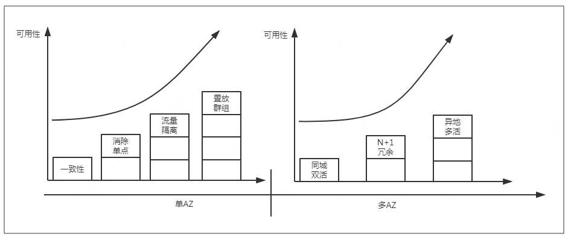
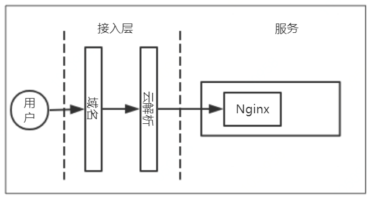
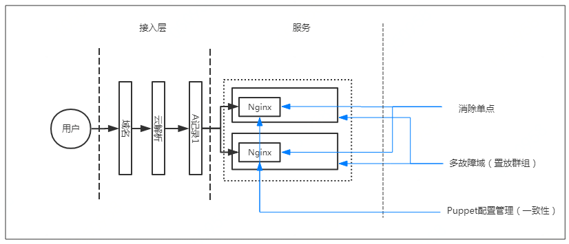
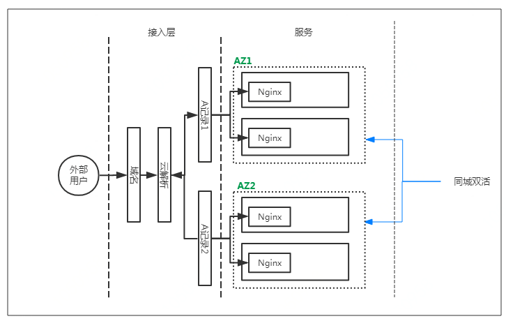
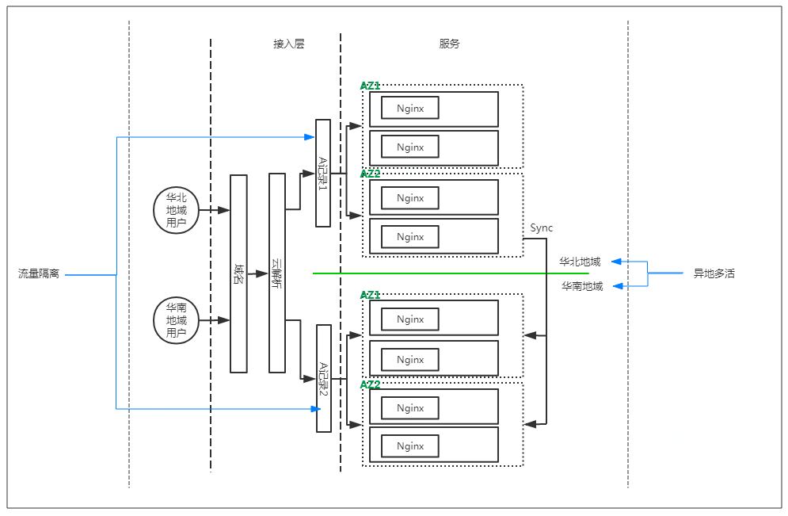

# 服务部署如何做到高可用

一个高可用的服务需要从部署、变更、预案、监控、安全等多方面考虑。如何做到 99.99% 服务高可用的要求，需要各个角色的工程师共同努力。从部署的角度，本文介绍了高可用服务所需具备的规范，案例部分通过对 Yum 源服务架构的演变让读者更好的理解高可用服务部署，希望对大家有所帮助。enjoy：

## 高可用部署要求

图 1 高可用部署

（* 注：随着服务满足高可用要求的增多，服务的高可用能力就越强）

### 一致性

这里的一致性指的是模块依赖的方方面面，包括但不限于硬件规格和配置、操作系统、基础软件、系统参数，还包括模块自身的相关信息，如配置文件、版本、上下游依赖组件等的一致性。可以通过配置管理工具（如 Puppet）进行管理和周期性维护，确保配置始终如一。列举一些不一致的问题，如 CPU 是否开启超线程、内存是否关闭 SWAP、操作系统版本、JDK 版本、内核各种参数、文件系统类型以及模块的配置等等，这些均可能对服务可用性造成严重影响，并带来极大的问题定位成本。

### 消除单点

单点有两种场景：一种是某个模块仅部署了一个实例；第二种是某个模块虽然部署了多个实例，但任意实例故障都会导致服务整体或者大面积不可用。如何识别系统单点？通过排查模块的实例数量和进行破坏性测试来发现系统中是否存在单点。对于已知的单点，则应该尽量做好预案，减少故障时长。

### 置放群组

要理解置放群组首先要理解故障域（Fault Domain）的概念。故障域指单个机房内由交换机或电源设备所造成故障的最大影响范围，通常为一个或一组机架。同一模块需要尽可能的分散部署在不同的故障域中，避免由单一故障域异常而导致模块整体不可用。公有云下的置放群组就是为了提高业务的高可用性，在创建时将实例以某种策略强制打散，以降低底层硬件 / 软件故障给业务带来的影响。举例来说，一个模块的所有实例绝不应该部署在同一个接入交换机下，因为一旦这个接入交换机故障，就会导致该模块整体故障，而一个机房内，有大量的接入交换机，是完全可以避免这种悲剧的。

### 流量隔离

流量隔离是搭建多套同质集群根据流量的属性进行分而治之的管理。常见的隔离策略主要基于流量的来源、重要性和资源消耗进行隔离。举例来说：

- 基于地域分为华北、华中、华南区域的用户
- 基于硬件类型分为 PC、APP 等
- 基于重要性分为 VIP 用户和普通用户
- 基于资源消耗分为报表请求和用户请求

### 弹性伸缩

弹性伸缩是根据业务需求和策略，针对无状态的服务，通过定时、阈值设定等方式，自动调整集群规模，在各类云厂商中，如果不是过大的系统镜像，一般都可以在 10min 内完成弹性伸缩，对于大促，机房故障等灾难场景，能够很好的提升可用性。伸缩伸缩，有伸也有缩，缩的特性，可能让集群维持在一个合理的规模上，从而避免造成不必要的成本浪费。因此，弹性伸缩也是常态下系统保持可用性的重要手段。

### 同城双活

同城双活即多 AZ 部署。同城机房之间延迟很低，一般 ping 延迟在 5ms 以内。同城的 AZ 间，基于网络，供电等的物理隔离，因此能够避免单个机房故障导致的服务中断。同城双活是建立在“系统消除单点”的前提下。多 AZ 间，服务请求应该尽量在一个 AZ 中处理完毕。

### 单元化

在同城双活建设完毕后，很多时候都会面临跨机房混连的问题。这是因为，同城双活的建设，主要以对另外一个 AZ 进行扩容为主，因此建设完毕后，或多或少都会存在一个跨机房混连的问题。而跨机房混连在单 AZ 故障后，每个模块都会出现超时和重试，会出现很多不可预期的情况。

将业务按照 AZ 的维度拆分成独立的单元，每个单元内包含完整的基础设施，包括应用程序、数据库、消息队列等，单元内是封闭的，每个单元内部的应用访问和数据库读写均在同一个单元内部完成。对于数据库读写在同一个单元内完成，很多业务是有困难的，因此可以进行折中，对于读操作在同一个单元内完成，写操作可以跨单元进行，这也是很多互联网公司的做法。即使数据库主所在的 AZ 故障，业务依然可以降级运行在只读状态，同时，数据库在分钟级别进行主从切换，进而恢复业务。

### N+1 冗余

服务可以根据同城机房数量进行多 AZ 部署。N+1 中的“N”指的是处理请求所需要的资源容量，“1”指的是防止机房故障所做的资源冗余。因此，N+1 中的所有机房应该具备同等的请求处理能力，从而避免某机房故障后，其余机房无法处理所需请求。N+1 会导致一定的资源冗余，合理设置 N 的数量能够减少成本。举例来说，2 机房的冗余度就是 50%，而 5 机房的冗余度仅为 20%。

### 异地多活

异地多活是保证服务高可用的高阶方法。目前国内多应用在大型互联网公司，用以防御单地域整体故障。异地多活的主要问题在于跨地域带宽、成本问题以及跨地域延时较大。举例来讲，同城的延迟一般在 5ms 以内，而华北到华南的延迟可以达到 50ms 延迟，这还是使用专线的前提下。

## 案例 —“Yum 源服务”的高可用部署实践

Yum 源服务是一种提供 Centos 系统的 Yum 仓库的下载服务。案例以此服务为例，讨论如何搭建一个高可用的 Yum 源服务。Yum 源服务最简单的架构设计如下所示：

图 2 简单服务架构

此服务由一台云主机提供，数据存储在本地，由 Nginx 提供下载服务。

以上架构服务完全可以实现 Yum 源服务的功能。但是若此架构的服务要对外提供服务会面对如下几个问题：

- 单机部署，服务器一旦宕机，服务就会故障；
- 性能瓶颈，一台机器一次处理的请求数是有上限的，服务器 IO 也会成为性能瓶颈。

我们需要对架构进行调整以达到高可用的服务架构。

### 高可用服务 2.0v

高可用 2.0v 目的是解决上文中的问题。

首先识别服务中是否模块都支持多实例部署（消除单点）：

- 对于 Nginx 模块，Nginx 是无状态的，可以进行横向扩容；
- 数据存储在本地磁盘也可以进行横向扩展，但是此时数据一致性将是主要问题。建议使用分布式文件系统解决数据存储一致性的问题。

服务要满足一定的并发量的要求，Nginx 具有高并发的能力，并且支持横向扩展。使用分布式文件系统以达到并发量和解决数据一致性的要求。

我们使用 Puppet 对服务器进行配置管理，保证服务器的配置一致（一致性）。每台服务器都要求不在同一个故障域中（置放群组）。高可用的服务架构如下：

图 3 高可用部署架构 2.0v

### 高可用服务 3.0v

3.0v 的高可用部署考虑同城双活的场景。我们选择华北两个 AZ 进行高可用服务的部署。架构图如下图所示。两个 AZ 部署同配置的服务，通过云解析将流量分配到两个 AZ 中，达到故障切换和负载均衡。

图 4 高可用部署架构 3.0v

### 高可用服务 4.0v

再考虑异地多活的架构，上文提到异地多活难点是数据同步。对于此服务来说，其对数据一致性并不是强依赖，短时间的数据不一致可以接受。基于地域对流量进行隔离，从而实现分而治之的目的（流量隔离）。我们选择在华南两个机房部署一套和华北机器配置一样的服务。
服务架构如下：

图 5 高可用部署 4.0V

## 总结

以上仅仅是高可用部署的一次简单实践。实际情况下，服务的模块几十到几百个都有，服务的复杂性与高可用是反比例关系。而且，随着服务的高可用部署特征越多，也会增加服务的复杂度，若做不好故障切换和预案建设，可能还会降低服务的可用性指标。另一方面，服务的高可用部署与成本也有密切关系，跨机房、跨地域服务部署无论在资源成本和技术能力都会产品带来挑战。所以说高可用部署需要做到的是与服务复杂度和成本之间的权衡，达到满足服务当前和未来一段时间内需求的目标。

**参考文章**

https://docs.microsoft.com/zh-cn/azure/architecture/reliability/

本文转载自公众号“京东云”：[ https://mp.weixin.qq.com/s/6uzmSl0y9eZ3HkTO49mFYQ](https://mp.weixin.qq.com/s/6uzmSl0y9eZ3HkTO49mFYQ)