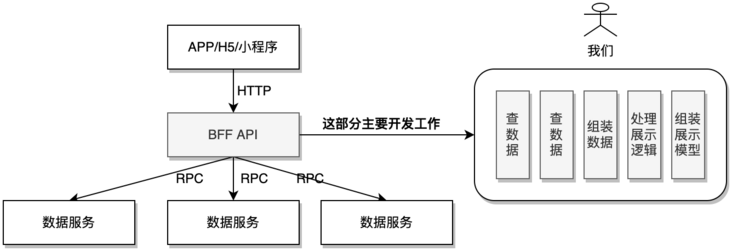
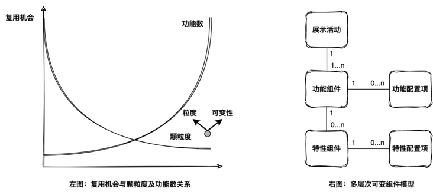
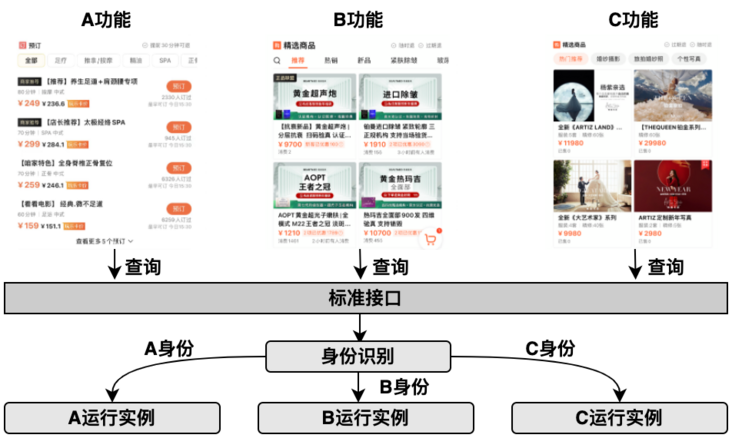
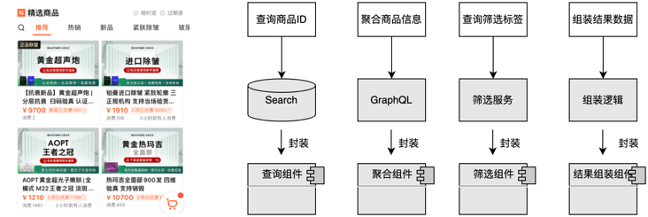
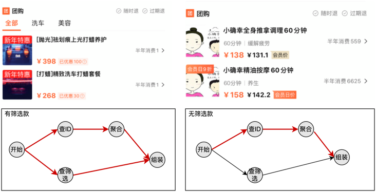
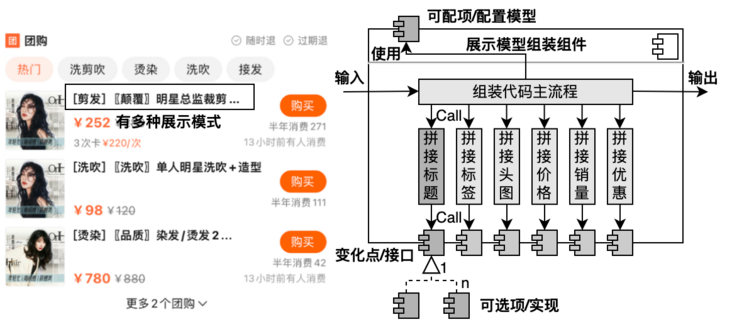
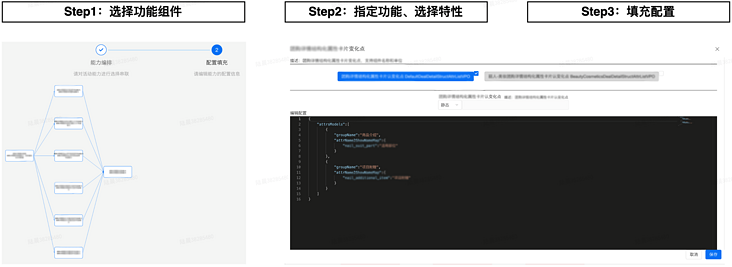

# [标准化思想及组装式架构在后端BFF中的实践](https://segmentfault.com/a/1190000041776041)

[**美团技术团队**](https://segmentfault.com/u/meituanjishutuandui)发布于 4 月 29 日

## 1. 前言

在本地生活服务领域，面向C端的信息展示类功能存在着类生物系统的复杂性，具体体现在以下三个方面：**功能多**，为了帮助用户高效找店、找服务，信息会在尽可能多的地方展示；**差异大**，同样的信息，在不同客户端、不同页面及模块下的展示逻辑会存在一些差异；**功能易变**，产品逻辑经常调整。以上三个方面的特点给研发同学带来了很大的挑战，比如当我们面临数千个功能模块，数十个行业产品的持续需求时，如何快速响应呢？

进入互联网“下半场”，靠“堆人力”的研发方式已经不再具备竞争力了，真正可行且有效的方式是让系统能力变得可沉淀、可组合复用、可灵活应对各种变化。在多业态、大规模定制需求的背景下，本文分享了如何通过组装式开发的方法来提升业务的竞争力。

## 2. 背景与问题

### 2.1 业务背景

先来讲一下我们的业务和产品，美团到店是一个生活服务平台，通过“信息”连接消费者和商家，帮助用户降低交易成本，这是信息产品功能的业务价值。当我们打开美团/点评App，搜索“美发”，就可以看到一个搜索结果页，展示着基于关键词召回的美发商户（如下图左所示）。商户下面挂着当前门店所提供的团购、会员卡概要信息，我们选择一家门店进入商户详情页，自上而下滑动，可以看到商户的地址模块、营业信息模块等基础模块（如下图右所示）。继续往下还能看到商品货架模块、会员卡模块、发型师信息等等，以上就是信息展示产品的具体形态。

前文我们提到过本地生活服务行业信息类产品功能的核心特点是功能多、差异大、功能易变，为了帮助读者更好地了解相关的业务背景，针对这几个特点我们进一步补充：

- **功能多**：在多业态背景下，信息展示功能总体上表现为功能模块非常多。主要是因为同样的内容会在多个地方展示，比如某个行业的商品信息会在App的首页、搜索结果页、频道页、详情页、订单页、运营页等多个页面进行展示。并且当新行业新内容出现的时候，又会全面铺开，进而导致增加更多的功能。截至目前，我们已有上千个展示功能，呈规模化势态。
- **差异大**：差异化主要体现在相同的内容，在不同行业、不同客户端、不同模块、不同版本甚至是不同用户条件下，都会有不同展示逻辑。比如商户详情页货架的商品标题这个字段，有的行业展示的规则是“服务类型+商品名字”，如“[玻璃贴膜]龙膜全车车窗隔热膜套餐”。有的行业的展示规则是“服务特性+商品名字”，如“[洗吹]单人明星洗吹+造型”。再比如跳转链接这个字段，H5、小程序和App内的跳转链接的拼接规则都不一样。诸如此类的差异几乎贯穿所有的功能。
- **功能易变**：主要体现在产品逻辑会经常发生迭代。分析变化原因来自多个方面，首先是这类信息产品面向海量互联网用户，用户体验敏感度高，细微的展示规则差别都可能会导致不同的转化效果，到底是哪个展示规则效果比较好，产品只能通过不断的调整来进行验证。其次，本地生活服务标准化程度低，内容本身的结构也在不断迭代，内容变更同时也决定了展示功能要跟着变。最后一点，互联网行业中产品的职责也会经常进行调整，不同的产品对功能的理解是不一样的，这也是导致功能更迭的原因之一。

以上是生活服务行业信息产品的特点，面对大规模、差异化的信息展示类功能的挑战，产品在持续迭代，研发同学又面临怎样的问题和挑战呢？

### 2.2 研发挑战

在分享技术挑战之前，可以先看看研发同学的日常。这里有两个小场景：

- 场景一，由B端（商家/运营）直接生产出来的信息，不能直接展示给用户。B端主要关注信息能否高效录入，录入的信息不适合直接展示给用户，需要经过一些逻辑加工，同一份B端录入的信息可能会有多种加工展示规则。
- 场景二，由于B/C端业务领域问题差别较大，为降低开发难度，B/C端一般会做精细化分工，一拨人专注B端的信息录入能力建设，一拨人专注C端的信息展示。

而我们就是专注信息展示的这拨人。这类系统业界也有一些标准的术语，叫BFF（Backend For Frontend）。BFF的主要职责是组合使用底层数据，额外处理C端展示逻辑。综上所述，我们研发同学具体的工作通常是：通过外部数据源将原始数据查到，然后按照产品的要求，把查到的原始信息加工成可以展示给用户的信息，最后发送给客户端使用。如下图所示，这部分工作主要由中间的BFF API服务负责：

看到这里，我们猜你可能会这么想：就这么简单的工作，能有啥技术挑战？确实，如果是站在纯编码的角度，代码“撸上”就完事了，确实没什么挑战。但，这不是一个简单的敲代码问题，而是一个工程问题。当有上千个这样的功能，产品需求持续涌入时，如何用有限的研发资源满足无限的业务需求，同时能够控制系统的复杂性及运维成本，还要考虑人的成长问题，这才是我们面临的关键挑战。

- **问题1 - 效率**：天下武功，唯快不破。产品功能追求快速上线似乎是个永恒的命题，在互联网行业C端海量用户的背景下，这个命题尤为突出。此外，很小一个功能点的改动就会对用户体验产生非常大的影响。在人力有限的情况下，如何满足大量产品需求快速上线是研发团队面临的首要挑战。
- **问题2 - 复杂性**：稍微有点追求的工程师都会考虑代码复用的问题，不管代码写得优不优雅，绝对不能允许重复，于是代码中就充斥着各种`if…else…`，因为有的逻辑只有当某些特定情况下才会运行。但是，复用需要良好的建模，嵌入过多的逻辑，只会让系统的复杂性变得越来越高，进而让系统难以进行下一步的演进，这通常会消耗大量的隐性成本。如何控制好系统的复杂性，让系统长期保持可理解、可修改，是我们面临的又一挑战。
- **问题3 - 运维成本**：如果缺少抽象的过程式开发，还会导致系统功能变得非常繁多，接口就好几百个，平时这些接口的运维工作也要耗费大量的人力。如果功能的开发缺少统一的章法，代码逻辑复杂交错，就会给运维工作带来非常大的挑战。
- **问题4 - 成就感**：根据马斯洛需求层次的理论，顶层是“自我实现”的需求。如果落实到工程师的日常，大家也需要在工作中找到成就感。可问题在于，如果每天都“过程式”地编写数据的查询、加工和组装的业务，对大家来说，很难产生什么成就感。

导致这些问题的根本原因是什么呢？这里想借用美团联合创始人王慧文在知乎上说的一句话，**以科学和工程追求真理**。真理是什么难以定义，但我们一定要运用科学的、工程的方法。下面将会进一步介绍对这个问题的思考以及我们的解决思路。

## 3. 问题分析与解决思路

### 3.1 问题思考

常规编程的基本工作，总是基于某种编程范式展开的，比如面向对象、过程式、函数式。我们很容易就想到，如果解决问题的范式不能很好地和问题相匹配，那么就会引起矛盾。所以历史上有很多使用汇编语言难以完成大规模项目、使用结构化编程难以应对超大规模项目的故事。

那么，前文提到的问题，是不是因为开发方式和业务问题不匹配而导致的呢？举个通俗的例子，好比我们现在要做的是一道西红柿炒蛋，但是拿出的工具却是电烤箱，后果可想而知。当然，有人说可能会说“真正的高手是可以的”，但毕竟绝世高手是极少数。而如果我们拿的出是平底锅，肯定会更容易一些。所以解决问题不能一味地追求成为“绝世高手”，降低解决问题的门槛才是真正行之有效的方式。

静心反思，我们认为真正原因在于：我们所使用的开发范式与业务问题不匹配。换句话来讲，我们对问题缺少针对性的建模，缺少针对性的方法论。比如在业务层面，我们的诉求是能够快速交付，能够满足需求的多样性，并且能够快速响应产品功能的灵活变化。在技术层面，我们的诉求是在人力有限的背景下，让系统复杂度可控，且代码复杂度不会与业务逻辑呈现“乘积式”关系的增加。此外，还要保证运维成本可控，系统数不会和功能数呈现“线性关系”的增加。

而我们当前的开发方式却是“过程式”的，这种“过程式”体现为面向产品需求文档的直译式编程。但这种开发模式和我们的诉求并不匹配。因此，我们需要取寻找适合我们自己的开发范式。

### 3.2 标准化及组装式思想

John Ousterhout曾说过：复杂性是由模糊性和依赖性引起的。模糊性主要源于对事物缺少清晰的概念描述，因此复杂性通常会通过应用很多关键概念来解决，这些概念通过抽象、分解、迭代和细化这样的方法来进行表达，建立明确的概念是消除模糊性的关键，也是我们解决复杂问题的常规思维方法。

在这个过程中，分解指的是把一个较大的问题分解成较小的、可管理的单元，每个单元都可以单独处理，这些单元被称为模块、包或组件。这个思路可以追溯到哲学上的“还原论”，目前已成为软件工程的很多方法论的核心。依赖性指的是模块之间依赖关系的多少以及强弱程度，比如一个模块是否依赖另一个模块的实现，模块之间的依赖是否遵循统一的契约，这些都会影响到系统的复杂性。

组装式开发指的是将系统分解为标准组件，再由标准组件组装成系统，以此形成的架构被称为组装式架构。跟传统代码复用技术关键的不同点在于组件的含义。组件是高度标准化的单元，具备可复用性、标准化、可替换性、可包装及独立自治这些特征。组装式开发背后的核心逻辑是基于标准化思想的代码复用。

关于标准化，历史上还有这样的一个故事：18世纪末，美国刚建立不久，由于国内外战火尚未停息，政府担心会与法国作战，急需准备大量的军火。但是，当时的传统制枪方式是依靠熟练的工匠采用磨、削、锤等工序制成一个个非标准的枪机零件，然后将它们组装成枪支，这种制作方法即使全部都是“能工巧匠”，生产效率也非常低下。于是，在政府的敦促下，伊莱·惠特尼（美国发明家、机械工程师和企业家，发明了轧花机、铣床）把整个工序分成若干工序，并把一个零件都比照标准来福抢的样品纺制成通用的零件，由此在军火生产中成功地引进了零件可替换性的原理，这是工业标准化划时代的开端。此后，标准化的互换性原理促进了工业的迅速发展，惠特尼也被誉为现代工业的“标准化之父”。

再举一个例子，乐高积木玩具我们都知道，玩具厂商制造了一批标准的积木，孩童可以基于这些积木组装成不同款式的玩具，喜欢飞机，就组装飞机，喜欢坦克，就组装坦克，这也是利用了标准化的可换性原理。再回到软件行业，基于组件实现大规模的软件复用这个概念，最早来源于Doug McIlroy在1968年的一次软件工程学会上的演讲，演讲名为“大规模生产的软件组件”，之后这被公认为软件复用的起源。基于这个思想，如果我们能够引入组装式开发的思想，将业务代码分解成标准化的组件，然后再基于这些组件组装成不同的功能，进而满足不同场景下的业务需求，这不就是符合我们需求的开发方式吗？

但知易行难，因为它忽略了很多现实的细节，我们在实际应用的时候总是要面临各种现实问题的挑战。柏拉图曾对人生的终极问题做了定义：我是谁？我来自哪里？我将要到哪里去？这些问题延续至今，一直困扰着人们人类。而软件工程也向工程师门提出了软件设计的终极问题：什么是抽象层次？什么颗粒度？以及如何应对变化？

所以，组装式开发的历史坎坷崎岖，更难的是在每个技术领域这些问题的答案还都不一样。比如在颗粒度的问题上，组件的颗粒度到底要多大，颗粒度越大，被修改的风险也就越大，而过小的颗粒度可以让组件更稳定，但是会带来组装的复杂性。再比如在应对变化这个问题上，这段逻辑到底是通用的还是个性的，非常难以辨别，但是我们的系统设计又强依赖于这个判断，如果最初的判断失误，就有可能导致系统最终的失败。我们就遇到过这种情况，有一次自信满满地封装了一个组件，感觉应该可以满足各种复杂的情况，刚好就在下一个需求来临时，发现不太匹配。

### 3.3 我们的解决思路

前文讲，组装式开发看起来正是我们所需要的开发模式，然后我们也讨论了组装式开发面临的关键挑战。那么，在我们的实际业务中，组装式开发真的可行吗？如果可行，我们又怎样应对随之而来的挑战？特别是本地生活行业细分行业多、功能多。当然在业务给技术带来了挑战的同时也蕴含着巨大的机会。因为涉及行业越多，系统功能越多，代码复用的机会也会越高（如下图左所示）。虽说不同的功能在感官上给人的感觉差别很大，但是有很多功能的底层存在着太多的共性。我们认为，解决问题的关键在于对颗粒度的把控，以及对可变性的处理。

然后，我们主要从粒度及可变性两个方面着手。在粒度问题上，我们引入多层次多颗粒度的组件体系设计；在可变性问题上，我们通过可变性建模让整个功能具备灵活应对变化的能力，最终形成了如上右图所示的概念模型。除此之外，我们还通过可视化组装的方式来简化组装过程，总体思路如下：

- **产品功能归类之系列化**：福特T型车生产的案例告诉我们，单一的产品无法满足市场化的需求，多样性更具备市场竞争力。但是高效的多样性需要范围的约束，所以现代汽车生产商会对产品进行系列化，比如宝马轿车有7系、5系、3系，系列化是厂商在效率和多样性之间追求平衡的产物。在软件开发领域亦然，组件的复用应该是有范围的，我们首先将产品功能进行系列化归类，进一步降低了系统整体的复杂性及设计难度。
- **功能组件提取与预组装**：组件标准化是组装式开发的前提，所以我们需要先将组件提取出来。在最终组装功能的时候，为了降低组装的复杂性，我们引入了“预组装”的概念。针对每个系列的产品功能，我们将通用部分提前组装好，将定制部分提前预留出来，定制部分包括功能和特性的定制，这部分可延迟到需要的时候再组装。
- **变化应对之可变性建模**：在电动车出现以前，所有的汽车几乎都需要燃油来发动，因此燃油机属于共性功能的需求。但是我们发现，有的车主是新手，对车子非常爱惜，因此需要全景的倒车仪。有的车主是老司机，他们根本不需要全景的倒车仪，所以全景倒车仪就属于变化功能的需求。不仅如此，我们还发现对于同样有全景倒车仪诉求的车主，他们也会选择具有不同特性的设备功能，这部分属于更细粒度的定制需求。所以，变化本身是复杂的，是有层次的，变化需要被单独建模，才能够被有效管理。
- **可视化组装与配置填充**：细颗粒度的组件带来了一定的组装复杂性，为简化组装过程，我们将可用组件呈现在用户的界面上，开发同学通过点击鼠标即可完成组件的组装，而对于功能特性组件的配置填充，也是在用户界面上直接完成的。

通过以上几个策略，我们将信息展示场景的研发模式打造成一个多系列产品的生产线，每个生产线都支持组装式生产一个系列的定制功能。下一章节我们将介绍更多的技术细节。

## 4. 标准化思想及组装式架构在后端BFF中的实践

### 4.1 产品功能归类之系列化

#### 1）产品系列化

在官方语言里，系列化指的是“对同一类产品的结构形式和主要参数规格进行科学规划的一种标准化形式”。在我们这里，系列化指的是对信息类产品功能进行归类，目的包含两个方面，一方面是为了降低系统整体的复杂性，另一方面也为建设组装这些功能的“生产线”做准备，一个系列的功能由一个“生产线”来组装，组件可以在不同范围内进行复用。

信息类产品展示的内容通常来自多个领域，比如一个商品展示模块，可能要聚合门店的信息，很难直接通过领域来进行划分，那么怎么划分系列呢？显性的差异我们能直接看出来，主要包括两方面，首先是展示内容方面，我们能够比较容易地发现每个展示模块都有主要的展示内容的差别，比如主要内容分别是门店信息、评价信息、内容信息、商品信息等内容，其他信息往往附属于主要内容。其次展示样式方面，有的展示样式差别很明显，比如商品详情页和商品货架模块；有的展示样式差别没那么大，比如同样是商品货架模块，只是个别字段有差异。隐性的差别主要是内部的实现，因为这些实现直观上是看不出来的。

我们主要从展示内容、展示样式及展示逻辑实现等几个方面来对功能进行归类合并：

- **基于内容**：一个模块展示的内容通常分为主要内容和附属内容，不同展示模块最大的差别来源于展示主要内容的差别。比如以展示门店为主的模块和以展示商品为主的模块，不管是系统实现，还是功能形态，都存在比较明显的差别。因此我们首先把展示内容的主体是谁作为归类依据，将不同内容的展示功能区分开来。
- **基于样式**：功能展示的样式差别往往会决定展示数据的差别，如果展示数据差别较大，那么接口则不容易做标准化。比如商品详情页和商品货架模块，商品详情只展示一个商品，同时会展示更多的商品信息。商品货架模块会展示多个商品，但是每个商品只展示少部分的信息，商品货架模块还会展示筛选项。显然它们的接口很难统一，因此展示形式是一个重要的归类维度。
- **基于实现**：最后要从实现层面看好不好抽象，另外两个维度的抽象已经为这个维度打好了良好的基础。怎么抽象呢？比如有两个功能的步骤和依赖功能的组合能够抽象的大致相似，那么这两个功能可以归为一个系列。

以上维度并不是绝对的优先级关系，但能解决绝大多数的问题。也存在例外情况，比如有的功能也可能同时展示多种信息，但找不到主要展示的对象，那么我们可以基于实现这个因素来进行选择。经过上面一波操作，我们基本可以得到产品功能的系列化全景，上千个功能经过系列化之后，也就仅仅只有几个系列。以上只是业务层面的划分，那么系统对应有怎样的设计呢？

#### 2）接口标准化

在产品功能系列化归类之后，同一系列内的产品功能之间仍然会存在逻辑差异，这些差异主要体现在展示模型以及内部实现上。展示模型是后端吐给前端的数据结构，主要的职责是承载展示数据，不同功能存在字段上的差别，所以导致模型会有差别。比如一个简单的例子，有的功能有标签字段，有的没有，那在标签这个字段上就形成了差异。内部实现主要包括数据的查询逻辑、加工逻辑等。针对这两方面差异，我们的核心思路是接口模型标准化及统一业务身份来串联差异化逻辑。

系列化本身更有利于接口模型做统一抽象，因为同一系列内部的功能在结构上的差异不会太大，我们只需要稍微做一些抽象，大多数字段都可以收敛。对于极少的个别情况，比如某个字段就个别功能才有，我们就通过K-V结构来进行应对。

模型设计的具体细节在这里不过多展开，重点是接口统一化、标准化之后有明显的好处。前后端的协作效率提高了，前端和后端不再需要在每次需求变更的时候都当面沟通一次接口。不仅如此，系统层面接口的标准化也能够让前端的代码和后端接口的集成关系变得更加稳定。

在搞定接口之后，内部的差异怎么办？下文会介绍我们在这部分的组装式思路。在这个思路下，内部实现方面的差异最终会表现为一系列不同颗粒度组件的集合差异，所以这里核心要解决的问题是如何能够识别功能差异化组装组件的问题。针对这个问题，我们的思路是引入“业务身份”这个概念，这个概念目前应用得也比较广泛，我们通过业务身份来串联不同业务场景的数据组装组件，从而实现差异化逻辑的处理。

### 4.2 功能组件提取与预组装

#### 1）功能组件提取

系统划分方法在业界应用的比较多的是领域驱动方法（DDD），基于领域驱动方法，我们一般会按照实体或者聚合根来划分子系统或模块，但是对于信息展示类的系统来说，很难应用领域驱动的方法。因为我们开发的不是一个单领域的小系统，而是一类跨多个领域的、属于由几千人共同开发的复杂分布式系统之上的一个子系统。这个系统负责查询和组装由底层系统提供的数据，然后将数据加工、裁剪、组装展示模型给到前端。这类系统距离业务实体很远，因此对于这类系统的组件化分解，不能应用传统领域驱动的方法，而需要使用一种特殊的方法。我们的基本的思路是梳理现有流程步骤，将现有功能按相关性归类，同一类功能封装成一个功能组件，然后再由多个组件组合成一个系列功能。这里举个例子：

左图所示的是一个商品货架的场景，右图展示的是要生产这个货架所需展示数据需要经历的流程步骤。通过上图我们可以看到，货架的展示数据的生产过程主要包括以下几个步骤：

1. 根据查询条件查询商品ID，比如查询门店下可售卖的团单ID；
2. 聚合商品维度信息，这些信息包括商品的标题、价格、服务流程、优惠促销、标签等等；
3. 查询货架的筛选数据及商品的摆放规则，比如推荐、热销、新品等标签数，以及哪些商品放在哪些标签下面的摆放规则；
4. 组装结果展示模型，涉及聚合数据的再加工，如标题、标签的拼接。

以上流程步骤相对比较清晰，并且能够适应一类场景，只是不同场景在步骤内存在部分差异而已。所以我们可以将这几个步骤抽取出来，每个步骤分别封装成单独组件负责解决一类问题，同时组件可以组合复用。值得强调的是，这些组件的封装都是基于标准的接口实现。

#### 2）功能组件预组装

传统的业务流程编排适合于流程类业务场景，比如OA办公审核系统，基于业务流程引擎的好处，一方面是容易实现能力的复用，复用现有能力编排出新的流程。另一方面是更容易应对流程的变化，因此特别适合流程类且流程易变化的场景。组件类似业务流程编排类系统中的“能力”，如果通过业务流程引擎，也可以实现类似的效果。但是实际上，信息展示场景的业务流程更像是一个图，我们姑且称之为“活动图”，而不是一条长长的管道流程，如下图所示：

流程引擎适合应对流程的变化，而我们业务场景中，变化之处不在于流程本身，而在于在这个活动图上执行的步骤集合。如上图的示例，左侧是有筛选的货架，需要查询筛选标签数据，所以执行的是整个活动图。右侧是没有筛选的情况，不需要查筛选标签数据，所以执行的是活动图的子图，实际业务场景更复杂一点的活动图也有，这里只是举个简单的例子。

我们会发现，不同情况的不同之处在于遍历这个活动图的节点的集合不同，总体类似在一个完整的图中选取一个子图。因此，我们选择以图的方式组织我们的组件，而不是传统的流程，这样更贴合我们的实际情况，也更容易理解。

另外，为了提高组件组装的效率，我们将一个系列功能使用到的所有组件提前组装好，得到一张全景图。那么在需要的时候，我们只需要对着这个完整的图选择子图即可，然后再基于子图组装定制部分的组件。预组装不仅能够提升组装的效率，同时也能够避免错误，让系统变得更稳定。传统业务流程编排中，能力的应用上下文其实是有限制的，虽然流程引擎足够灵活，但是实际上在编排能力时仍然需要人工对能力做检测，确认是不是能够满足当前的流程。而预组装可以从根本上避免这个问题，因为只要是存在的路径，都是可以执行的。

### 4.3 变化应对之可变性建模

通过将功能组件组织成一个个活动图，每个活动图负责解决一个系列的产品功能展示信息组装问题，此时的组件颗粒度还是较大的。组件颗粒度大的问题在于，容易不稳定，从软件设计的角度来看，是因为变化的因素太多。比如在组装展示模型环节，展示模型组装组件负责将数据组装成发给前端的展示模型，实际业务场景中不同情况对于同一个展示字段的组装存在不同的拼接策略，我们拿开篇的例子来讲解：

左侧丽人行业商品标题的组装规则是“服务类型+商品名字”，右图养车/用车行业商品标题组装规则是“服务特性+商品名字”。其实这个组件的颗粒度刚刚好，因为它让我们的活动图看起来不至于太复杂，但怎么应对这种变化呢？作为有经验的程序员，可能自然会想到条件分支语句`if…else…`，而且实际中很多项目针对这种问题的处理方式都是`if…else…`。

对于简单的情况，使用这种方式无可厚非，我们这里讨论更复杂的情况，过多的使用条件分支至少存在两个方面的问题。一方面是代码将会变得非常复杂，就像密密麻麻缠绕在一起的电线，这样的代码难以理解和维护。另一方面，这种模式本身会让共享组件变得极其不稳定。如果我们的系统建立在经常有变动的根基上，那么我们很难保证系统的稳定性，每一次共享组件的变更都面临着故障风险，为了让变化可管控，我们要对变化进行建模。

#### 1）可变性建模

这些年，软件工程在如何应对“变化”这个问题上，最具革命性的创新是将共性和变化分离，分离的变化通过使用扩展点代码或配置化变量的方式实现。这些经典思想真是太棒了。对于我们也很有启发，如果将容易变化的逻辑和变化的逻辑分离开来，同时引入配置化能力，那么我们的组件将会很容易应对变化。因此，对于可变性的管理，我们通过标准功能组件引入了可变性分离这个思想来解决。如下图所示，组件本身具备变化点和配置项这两种应变能力：

**变化点**这个概念是我们对扩展点代码的具象化，寓意容易变化的地方；**配置项**用来承接变量的抽离。变化点和配置项都是应对变化的实现方式，那么实际应用时怎么选择？针对可枚举的变化，可以提取变量配置化。针对复杂度多变性，可以通过变化点来扩展。变化点的具体形式是个接口，将变化点的具体实现放到组件之外，组件内部公共逻辑部分只调用变化点接口。这样的话，不管变化点的地方怎么变，即使有一百种变体，都不会影响组件的公共部分。

针对具体案例，比如查询商品ID这个组件，我们实际上有多个查询索引，比如商品推荐索引、商品筛选索引，还有一些强实时索引，但总体还是相对稳定可枚举的，所以我们将不同的查询索引建模为查询渠道配置项，使用的时候只要填写查询渠道配置项即可。再比如展示模型组装这个组件，因为标题的拼接规则会有所变化，而且较为不可枚举，产品规则变化多，因此我们在标题这个地方设定一个变化点，不同标题组装的逻辑作为变化点的不同实现，这样更能够应对变化。

不同变化点的实现可以认为是组件提供的多种功能特性，因此我们又抽象出可选项这个概念来描述变化点实现。一个变化点有多个选项，选项是可复用的，贴合现实世界，更容易理解。在组装的时候只需要“选择需要的特性选项”即可满足定制需求。以上通过**变化点-可选项-配置项**这组概念解决了组件的灵活应变的问题，同时能够让组件本身变得更为稳定。

#### 2）可选项爆炸问题

我们发现如果每个选项都通过硬编码实现的话，有的变化点可能会存在非常多的可选项。比如标签这个字段，标签往往来源于扩展属性，不同商品的模型和扩展属性不一样，造成这个标签的来源差异很大。如果我们都是通过硬编码实现选项，那么由于标签来源有所差异所导致的选项扩散问题就会很明显，可能有多少种商品，就会有多少种选项。选项本质上是一种更细粒度的组件，这个组件内部本身也需要有应对变化的能力。因此，我们的解决思路是为选项这个细粒度的组件增加可配置能力，每个选项可以设计自己的配置项，将易变规则通过配置来实现，这样选项就有了一定程度应对变化的能力，从而得到了收束。

### 4.4 可视化组装与配置填充

在以前，当我们需要开发一个展示功能的时候，我们需要做以下几件事情：

1. 编写将外部数据粘合在一起的代码，包括远程RPC的访问代码和数据的组装代码；
2. 依照PRD编写一遍展示加工逻辑；
3. 将加工好的数据字段填充在和前端同学一起定义好的展示模型上；
4. 构建和集成代码。

组装式开发的基本要求是：将系统功能基于标准接口封装成不同颗粒度的组件单元，这个要求为产品功能的生产过程带来了革命性的转变。功能的组装不再需要手写“胶水代码”，而是通过系统就可以完成自动化的组装。大部分的功能是复用已有的组件，而不是重头编写，实际上经过功能特性组件的不断沉淀，我们已经实现了80%以上的产品逻辑都是复用已有组件。

此时，我们的研发过程整体上可分为**组件开发**和**组装集成**两个阶段。组件开发环节关注功能的抽象和封装，基于已有组件，组装集成环节做的事情就是选择需要的组件，填充配置，一旦组装结果被保存之后，即完成系统的集成，不再需要构件和部署。下图展示的是选择和集成组件的过程：

组件的选择和组装这个过程是围绕活动图展开的，总体经过选功能-选特性-填配置三个步骤，每个步骤所做的具体工作如下：

- **功能选择**：基于对产品需求功能点的捕捉，在预先组装好的组件活动图上选择当前要开发的展示功能所需要的功能组件，这一步操作决定了大体的功能点，比如这个货架需要筛选功能，那么就把筛选组件选中，不需要就不选。
- **特性选择**：功能确定之后再确定更细粒度的功能特性，比如选择展示模型组装组件之后，这个组件要组装多个字段，每个字段都有多种展示策略，再比如标题这个字段，到底是要带括号的还是不带括号的，此时需要勾选。
- **配置填充**：经过以上两个步骤，基本确定了当前要组装的展示功能所需的组件集合，但有的组件是有配置项的，比如前文举的查询商品ID这个组件，填充查询渠道配置项就是在这一步完成的。

填充好配置就可以发布了，系统运行时，多个产品功能在运行时候共享一套组件实例，差别在于执行组件的组合和配置不同。这一点是通过前文提到过的业务身份来实现的，不同业务身份关联不同的组件组装DSL及组件用户配置，最终实现差异化功能组装和执行。

## 5. 总结

组装式开发实践有没有解决最初的问题？组件分为大颗粒度的功能组件和小颗粒度的特性组件，不同颗粒度的组件都具备复用性和应变能力，因此在展示功能搭建方面的效率有了显著提升。内部数据显示，我们组的开发效率至少提升50%以上。

其次，每个组件单元都是经过良好设计的逻辑单元，单个组件的规模都有所控制，因此代码的复杂度得到明显的降低。实践结果显示，研发同学自然开发的业务组件代码圈复杂度不超过10。另外，通过信息功能的系列化编制，整个信息展示系统也有所收束，接口数由上百个减少到了个位数，大大降低了接口的维护成本。

最后，以前研发人员“过程式”地翻译业务需求，现在则需要考虑组件怎么设计。因为架构本身提供了这种条件，并且也有这种要求，研发同学在为系统“添砖加瓦”的过程中需要考虑封装和抽象问题，以集成到系统中。封装和抽象是基本的软件工程思维，这就让“体力活动”变成了“脑力活动”，现在研发同学更像是一个软件工程师，工作上也更有成就感。所以，总体上我们取得了不错的效果。

每个领域都有各自领域的复杂性，比如有的领域问题在于计算复杂，有的领域在于模型的存储和维护复杂。由于软件开发是一个工程问题，我们不能仅仅考虑技术的复杂性，同时还要考虑业务及人员的问题。科学的思维告诉我们，解决问题要讲究范式，当一个范式不满足的时候，需要有敢于突破的勇气。本文主要介绍了我们在信息展示场景下，如何通过新的开发范式来解决我们所面临的问题，希望对大家有所帮助，也欢迎大家在文末留言，跟我们交流。

## 6. 参考文献

- [1] [Pattern: Backends For Frontends](https://link.segmentfault.com/?enc=SX4TSR202sW16DPTt0W80A%3D%3D.WhnTnjkjMSNl7Rlfo0YLXCKB%2FLMmQPrJZM1fAWyS4isKKfT7mq3SyTpkGD3QQf70B9broqrhimmNbkxERy7Zcg%3D%3D)
- [2] [GraphQL及元数据驱动架构在后端BFF中的实践](https://link.segmentfault.com/?enc=YKYGpVW5TyHvX%2Fpk3sbIlw%3D%3D.upZTZ1O1W6QSs2E4HrVae7V%2BA1uim0ABoJc5MHTO%2FVirpouNUSwGhxKxfxj6wNGyKmAyadFnf%2Fa8m8E9X7eC%2Fg%3D%3D)
- [3] [福特T型车丨成也标准化，败也标准化](https://link.segmentfault.com/?enc=sdh%2FCxFntJURLIvSc7dSiw%3D%3D.wlsR48skn33kb%2BvHbeBNtCB8DF94rKGcKqcN7miBbTiaavwb9lrUR9VgW9%2FF0Kx%2F)
- [4] [中台之上（十三）：探讨支持组装式开发的业务架构设计方法](https://link.segmentfault.com/?enc=Oo9RbmLVDY3kHXF1lOrmUA%3D%3D.FuvVIeLyy8tSMWkhINdqXuuQfVCco5DEubbF0b05pK5vM25OAQEzc0i2FpApgq6QmJO4756lTpmOG4sai0M%2FyQ%3D%3D)
- [5] [美团内部的 Slogan「以科学和技术追求真理」是什么意思？](https://link.segmentfault.com/?enc=o%2BzhjYlpWYwt6c8Q6mdRTg%3D%3D.7up0hSNKyFGCIm7%2BKkEYA9yfEP0RHk2e3VgfC4fm1iLTHY844Jz4uXNHqn6%2FjBMzLXi5aTzyhDteCEY8ACVnGg%3D%3D)
- [6] 叶柏林. 标准化. 中国科学技术出版, 1988.
- [7] Alan W. Brown. 大规模基于构件的软件开发. 机械工业出版社, 2003.
- [8] Thomas S. Kuhn. 科学的革命结构.北京大学出版社, 2012.
- [9] John Ousterhout. A Philosophy Of Software Design, 2018.
- [10] Tassio Vale et al. Twenty-eight Years of Component-based Software Engineering[J]. The Journal of Systems and Software, 2016.
- [11] Rafael Capilla, Barbara Gallina et al. Opportunities for Software Reuse in an Uncertain World: from past to emerging trends. Software:Evolution and Process, 2019.
- [12] Peter Naur, Brian Randell et al. Software Engineering[R]. NATO Science Committee, 1968.