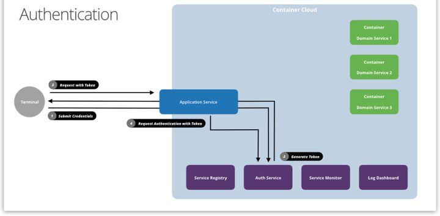
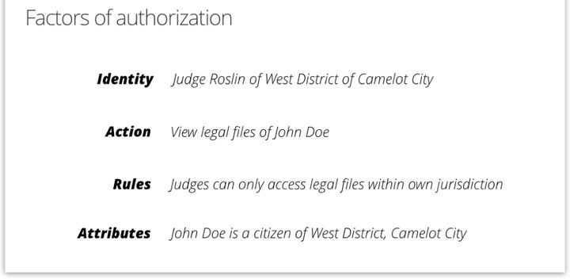
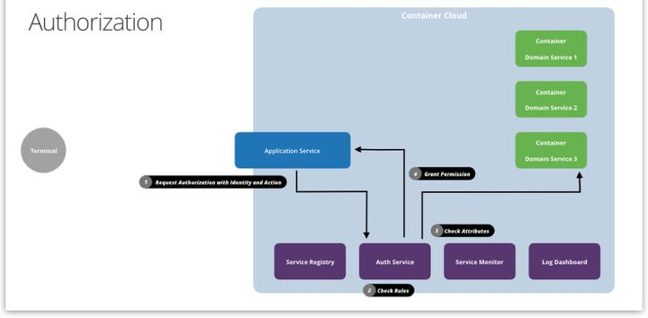

# 浅谈微服务架构中的鉴权体系

在微服务架构中，有一个核心的问题是处理好“集权”（中心化）和“放权”（去中心化）的关系。虽然微服务的主旋律是把数据和业务拆成小而独立的模块，但我们仍然需要一个强力的中央安保体系来确保“数据分散，权限集中”。这一篇就谈谈微服务架构中的鉴权体系。

## 身份认证

身份认证（Authentication）的目的是证明“你是你（所号称的那个人）”。

要证明这一点，你必须掌握一个只有你自己和认证机构才知道的机密信息。在现实中，这个信息可能是 DNA、指纹、虹膜这样的生物识别特征，但由于这种特征跟人身直接绑定且又不可修改，一旦泄露，可能被持续冒用，造成不可挽回的严重后果，所以现实中较少采用这些生物识别特征作为识别之用。

如果不采用机密信息作为判断标准，就需要一个持续的、不易伪造的“证明材料”。在中国，这个证明材料就是户口或身份证。中国对公民信息的登记相对严格，所以会在小孩出生的时候要求把身份信息登记到户口之中，形成身份证明，跟随一生。在需要证明“你是你”的时候，拿出身份证就行了。

（生物特征不可废弃，所以我们必须把它包一层，形成证明材料和对应的 Persona）

与生物识别特征不同的是，身份证如果丢失，从理论上说，应该可以挂失并且让其失效，然后办理一张新的身份证。不过，设计我国身份证的机构和供应商也许没有考虑到这个问题，或者考虑到现实情况太复杂，导致身份证无法挂失，丢失的身份证仍然具备证明效力，但这个是后话了。

为了避免身份证被冒用，在对身份认证要求比较严格的场合（比如银行），会附加一些别的检查，比如对比照片等等。

那么，现在我们来对身份认证进行规划。

- 身份认证机构可以颁发两个东西给用户，作为身份认证的输入：机密信息或证明材料。
- 身份认证机构可以通过对比用户提交和机构保存的机密信息来判断用户身份。
- 身份认证机构可以通过检查和对比用户提交的证明材料来判断用户身份。
- 如果需要，身份认证机构可能会附加别的验证来增加认证可信度。
- 用户可以变更机密信息，避免冒用。
- 用户可以挂失证明材料，使证明材料失效，避免冒用。

身份认证中的机密信息在 Web 环境中通常以用户名和密码的形式存在。由于 HTTP 协议没有“状态”的概念，所以对于 Web 服务器来说，每次请求都是全新的体验，都必须验明请求者的正身。要做到这一点，客户端可以在每次请求的时候都附上用户名和密码（或者别的凭据），表明身份。

可是，每次都发送用户名和密码增加了泄露风险，所以在第一次验明正身（登录）之后，服务器可以发给调用者一个“令牌”（Token）。这样，后端的后续身份认证，无外乎就是把令牌换成“身份”（Identity）。这个令牌实际上就是前面说的证明材料。

我们应该尽量让令牌不容易仿造，但是技术上无法做到完全杜绝。所以，在敏感操作的时候可能会附加一些别的验证，比如再次输入密码或者用短信验证码做二次校验，这也就是前面所说的附加验证。

## 权限验证

和身份认证相比，权限验证（Authorization）要复杂一些。

身份认证的输入，要么是用户名和密码（或别的身份凭据），要么是令牌，只需要通过一个检查，就能输出身份信息。而权限的验证要检查的是“某用户能不能做某事情”，所以，至少需要有两个输入：“用户身份”和“想要执行的动作”。除了这两个输入之外，还需要有一个具体的“判断规则”，验证者才能根据规则，输出“同意”或者“拒绝”。

在现实中，这个判断规则有很多种可能。

- 在等级森严的军队里面，所有的动作和文档都有明确的“查阅级别”，而每个人也有自己的“查阅级别”。只有用户的级别高于动作的级别，才能执行这个动作。
- 在分工明确的工厂里面，每个人都只负责自己的工作，那么，所有的动作和资源都按照不同的工种来进行分配。各工种只能执行属于自己负责范围的动作，获取属于自己负责范围的资源。
- 在架构明确的公司里面，每个人都属于公司行政架构中的一个节点，可以执行属于这个节点的动作，并且访问这个节点及其下属节点的信息。
- 在专家主导的医院里面，所有人都围绕专家的需要服务，而专家则为病人服务（执业）。根据专家的需要，同时保护敏感信息，我们可能会设置更加复杂的判断规则，比如根据时间段、服务流程阶段等来判断，或者提供一个特定的委托授权的流程用于临时开放权限。

不管怎么变，只要有了身份、动作和规则，我们就能做判断。当然，如果规则要求我们核实部分数据，我们还需要这部分的数据作输入。不过，由谁来执行这个判断比较合适，值得我们探讨一下。

举一个生活中的例子。

有这么一家公司，在 A 市有个办公室，办公室有个戴经理。戴经理有一天兴之所至，想起来要查一下员工老王的工资。他来到了 HR 部门，找到了 HR 主管，想要调老王的工资出来看看。

HR 看了看公司规定，经理只能看自己所辖办公室的员工工资，然后又看了看戴经理，是负责成都的，再看看老王，是成都员工，然后，就把老王的工资调出来给了戴经理。戴经理看了，然后说，再给我看看老陈的工资啊。然后 HR 调出档案一看，老陈是北京办公室的，就拒绝了。

又有一天，员工老王也兴之所至，想要查一下戴经理的工资。他也来到 HR 部门，找到 HR 主管，问戴经理的工资。HR 一看，你这不是经理啊，怎么能查别人工资呢，就直接拒绝了。

如果看这个例子，我们就会发现，这个规则的检查是 HR 做的。实际上，绝大部分非 IT 的业务流程中，权限的检查都由信息的保管方来执行。

我们当然也可以按照这个来建模，但是稍等，再深入分析一下。

- 首先，“谁能看谁的工资”这个规则，是不是 HR 部门来决定的呢？不是。公司的规章制度决定了“谁能看谁的工资”，规章制度由公司管理者制定。
- 然后，当公司制度需要调整的时候，是不是由 HR 部门来调整呢？不是。 还是由管理者来制定，然后由各个部门来执行。各个部门实际上是收到了制度调整的结果，而不是自己去调整制度。
- 最后，“谁能看谁的工资”这个规则，是不是 HR 的专业范围？不是。只有“调出工资档案”这个动作是 HR 的专业范围，至于“谁能看”，其实跟 HR 的专业知识没有直接关系。

要理解最后这一点，我们可以看两个场景。

- 某 HR 换了一家新公司。现在这个新的公司很有意思，允许所有人看所有人的工资，层级也不同，规章完全不同，但 HR 仍然可以按照自己的专业来工作不受影响。不只是 HR，对其他部门的人来说也是如此。规章制度的变化，对它们的职责没有实质的影响。
- 某 HR 换了一家新公司。这家公司专门搞高精尖的研究，对于员工的信息和商业机密控制极其严格。只要有人来调取数据，都必须经过专门的审核人员审核放行。这对 HR 的职责也没有实质影响，只要能通过审核，照办即可。审核人员也不知道 HR 具体的工作是什么，只知道规则要求检查什么，就去检查什么。

总结就是以下几点。

- 专业知识（领域逻辑、业务规则）和权限是相对独立的东西。
- 要运用专业知识，不需要知道权限。
- 要检查权限，不需要用到专业知识。

既然如此，为什么在现实中还是由专业人士来兼职检查权限呢？这也许是因为对于很多公司来说，绝大部分的数据都没有那么敏感，所以为了降低管理成本，绝大部分的数据访问都没有那么严格地用专职人员去检查，而是由专业人士代劳。

了解了这些之后，我们就可以开始规划了。

- 权力机构会制定一套权限规则，并且可能调整这套规则。
- 这套规则可能会用到一些外部的输入，比如员工所在的办公室。
- 有了这套规则和查验数据的权力，任何人都可以判断一个动作是否合规。

这样做的好处，就是业务变得非常纯粹，而权限相关的东西完全挪出业务层面，即便业务或者权限需要频繁变化，问题也不大。

说到这里，也顺便抛一个待验证的设想：不同公司的业务逻辑总是高度雷同，差别最大（妨碍复用）的其实是公司的管理体系。我们把组织结构和与之相关的安全权限单独拎出来，也许可以更好地促进业务逻辑的复用。

## 鉴权服务

为了提升服务的效率，我们一般会希望尽早地做完身份认证和权限验证。如果用户执行了越权操作，那我们应该及早中止访问并返回错误提示。

前面提到，权限验证的输入之一是用户身份，所以身份认证和权限验证通常是前后脚来做。二者组合，形成鉴权服务（Auth Service）。鉴权服务负责维护令牌身份映射以及权限规则，它的输入是“令牌”和“想执行的动作”，输出是“身份”和“是否允许执行”。

## 几个例子

现在，我们用这样一个场景来实验一下整个鉴权流程。

设有这么一个订单管理系统，其中有一个订单查询功能。其权限要求如下。

- 买家只能看到自己下的订单
- 卖家只能看到下给自己的订单
- 卖家管辖多个小二，小二可以分组给不同的权限，有的只能看分配给自己的订单，有的可以查看分配到自己组的订单
- 运营商可以看到所有订单

要对这个权限体系进行建模，我们必须认识到，这些操作，虽然查看的都是订单，但是因为是不同的业务上下文，表现到 API 呈现上也会有不同。

- 买家看自己的订单：/CustomerViewOrders
- 卖家看自己的订单：/MerchantViewOrders
- 运营商看任意订单：/AdminViewOrders

然后，我们可以制订如下规则。

- 所有这些 API 都要求用户处于已登录状态
- 对于 /CustomerViewOrders ，访问者必须有 customer 身份
- 对于 /MerchantViewOrders ，访问者必须有 merchant 身份
- 对于 /AdminViewOrders，要求当前用户必须有 admin 身份

这样，鉴权服务就可以根据身份、动作和规则三者来判断访问权限了。

（图片来自：[http://t.cn/RHRujGG](https://link.zhihu.com/?target=http%3A//t.cn/RHRujGG)）

至于卖家给小二的权限分配，根据不同需要，我们可以选择两个方案。第一是让卖家自己去处理这个细粒度的权限，形成自己的一套小的权限体系，这也意味着小二访问的可能是因卖家中转而暴露出来的新 API。第二是把这个细粒度的权限也建模到原来的权限体系里面，加入如下新的 API 和判断规则。

- 小二查看订单： /ClerkViewOrders，检查：

- - 用户必须是 clerk 身份
  - 用户在组织结构上必须属于某个 merchant
  - 如果用户类别是 1，那么他可以查看所有分配到自己组内任意小二的订单
  - 如果用户类别是 2，那么他可以查看分配给自己的订单

我们再来看另一个场景，查看员工信息。API 的和规则的设计如下。

- 所有 API 要求用户处于登录状态

- 员工查看自己的信息：/EmployeeViewOwnProfile

- - 所有员工均可访问

- 员工查看其他员工的信息：/EmployeeViewProfile

- - 所有员工均可访问

- 经理查看员工信息：/ManagerViewProfile

- - 当前用户必须为 manager 角色
  - 请求中的员工必须属于该 manager 负责的 location

不同的 API 返回的数据可能有差别，比如看自己的信息可以看全，看别人的只能看名字、照片和联系方式，经理则可以看所有人的完整信息，这由应用逻辑决定。

（图片来自：[http://t.cn/RHRu1e3](https://link.zhihu.com/?target=http%3A//t.cn/RHRu1e3)）

再来看一个医院的。医院有一点不同的是，病人和病历实际上需要在多个部门之间周转，而不同的角色处在不同部门的时候，其职能和权限会有变化。比如， 有时候实习医生会守急诊室，住院医生不在的时候护士也需要代理执行医嘱，职工可能会轮岗到不同部门，等等。

基于这样一些假想场景，我们可能会有如下一些 API 和权限。

- 挂号处，要求用户必须有 clerk 身份

- - 建档：/RegistrationsCreateMedicalRecord
  - 挂号：/RegistrationsCreateVisit
  - 查看病历（用于确认病人已建档）：/RegistrationViewMedicalRecord

- 门诊部，要求用户必须有 doctor 身份

- - 诊断：/OutPatientCreateDiagnosis
  - 开药：/OutPatientCreatePrescription
  - 查看病历：/OutPatientViewMedicalRecord

- 急诊室，要求用户必须有 doctor 身份

- - 查看病历：/EmergencyViewMedicalRecord

- 住院部，要求用户必须有 doctor 或者 nurse 身份

- - 入院：/InPatientAdmitPatient

  - - 仅 nurse 可以执行入院

  - 日常检查记录：/InPatientCreateRoutineRecord

  - - doctor 只能给自己分管的病人创建检查记录
    - nurse 只能给自己负责区域的病人创建检查记录

  - 创建医嘱：/InPatientCreateOrder

  - - doctor 只能给自己分管的病人创建医嘱
    - nurse 不能创建医嘱

  - 出院：/InPatientDismissPatient

  - - 仅 nurse 可以执行出院

  - 查看病历：/InPatientViewMedicalRecord

  - - doctor 只能查看自己分管病人的病历

- 手术室，要求用户必须有 doctor-surgeon 身份

- - 准备材料：/OpRoomPrepareMaterial
  - 记录结果：/OpRoomCreateOpRecord

- 检查部，要求用户必须有 technician 身份

- - 录入结果：/LabsCreateExaminationRecord
  - 查看病历：/LabsViewMedicalRecord

- 药房，要求用户必须有 pharmacist 身份

- - 看处方：/PharmacyViewPrescription
  - 放药：/PharmacyDeliverMedicine

上述 API 能访问到的数据和权限主要根据部门来进行划分，方便轮岗。比如，医生在门诊的时候，可以查看完整的病人病历，但轮岗到挂号处的时候，虽然也查看病历，但就只能查看最基本的个人信息了，用于给病人补办卡片之类。

## 功能和数据权限

从上面几个例子看来，我们通常可以把权限的验证分成两个步骤：先确定职能，然后确定职能作用范围。

比如，先确定你能看订单，然后确定你能看哪些订单；先确定你能看工资，然后确定你能看谁的工资。再比如，某国法律规定，当一个案件发生在某地，警察来调查，但只有该辖区的警察有调查权，跨区域的案件必须交给联邦警察。如此等等。

既然这两步看上去分得很清楚，那么我们不妨给它们分别取名。用户能不能执行某个动作，使用某个功能，是功能权限，而能不能在某个数据上执行该功能（访问某部分数据），是数据权限。

促成这种拆分方式的原因可能有下面几种。

- 现实中，很多组织采取了这种“职能 + 组织节点”的形式来确定权限，所以这样的拆分实际上为建模提供了方便。
- 由于功能权限通常会直接对应应用的 API 列表，所以权限验证可以及早失败，而无需把数据取出来做对比，提升了鉴权的效率。
- 方便我们把所有的功能 API 提取出来形成一个列表或者表格，可以更好地查看和管理权限。

此外，这种形式的权限管理还可以让业务人员在不写代码的情况下对功能权限进行重新分配。如果涉及数据权限，则必然会有某种形式的判断逻辑，写代码也就必不可少了。

话说回来，尽管这种拆分很常见，我们仍应该认识到这只是人为的一种拆分。二者都是权限验证的一部分，都是为了回答“该用户能不能做某件事”这个问题，本质没变。

需要注意的是，在制定权限规则时，制订者需要参考业务规则，但是反之则不然。业务规则可以在完全不了解权限验证规则的情况下执行。甚至，从理论上说，所有的业务单元都应该可以在完全没有权限验证的情况下“正常裸奔”，即假设所有人可以做所有事情，但业务应该被正常执行，业务规则应该被正常遵守。用语言学的词汇来说，就是在没有权限验证的情况下，业务数据中也许会有语义问题（semantic problem），但是不会有句法错误（syntax error）。

## 鉴权体系回顾

我们来回顾一下这篇文章中提到的鉴权体系。

- **身份认证**。确认“你是你”，获取你的身份信息。
- **权限验证**。确认“你能做某件事”。

二者合称为“鉴权”。身份认证输入令牌，输出身份。权限验证输入身份、动作（包括动作范围），输出“同意”或“拒绝”。我们希望身份和权限在一个体系内高度一致，所以，鉴权是一个半中心化的行为，权限规则在一个体系（比如组织、应用）内是中心化管理的。

权限的形成需要对业务知识的了解，但规则抽象出来之后，要使用它就不需要业务知识了。权限验证的独立，意味着我们把“权限规则”和“业务规则”拆成了两个部分。前者拥抱变化，而后者追求稳定；前者在意的是业务的意义，后者在意的是业务的逻辑。

为了适应现有组织形态和更清晰地展示权限信息，在给权限建模的时候我们常常会把它拆分成功能和数据权限两种。我们应该认识到二者都是权限验证的一部分，都是为了回答同一个问题：这个用户能不能做某事。

从整个分析脉络我们可以看到，这个鉴权体系是通用的。在设计任意一个系统的过程中，我们都应该注意尽量把安全相关的判断和业务规则拆开对待，方便集中管理权限，把业务规则提纯。

对于微服务架构来说，鉴权是一个重要的节点，它和应用场景密切结合，是安保的最后一道关口。在对权限进行建模的时候，我们应该尤其谨慎。希望这篇文章能给大家一些启示。