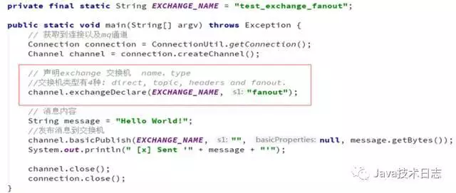
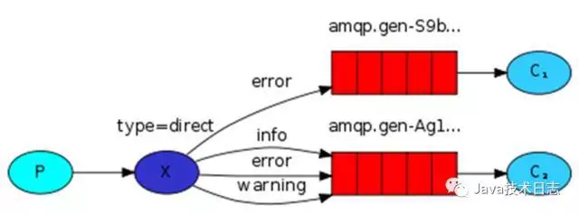
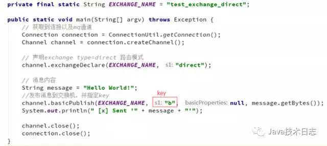
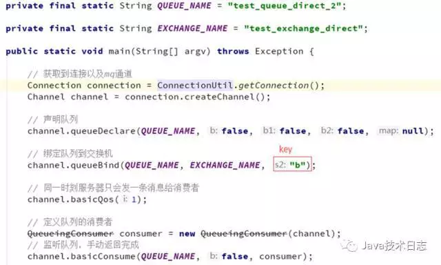
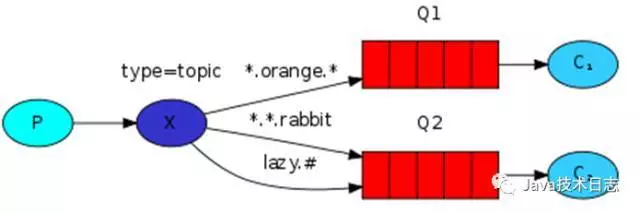
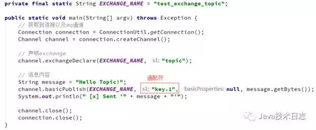

# 消息队列RabbitMQ入门与5种模式详解

## 1.RabbitMQ概述

**简介**：

- MQ全称为Message Queue，消息队列是应用程序和应用程序之间的通信方法；
- RabbitMQ是开源的，实现了AMQP协议的，采用Erlang(面向并发编程语言)编写的，可复用的企业级消息系统；
- AMQP（高级消息队列协议）是一个异步消息传递所使用应用层协议规范，为面向消息中间件设计，基于此协议的客户端与消息中间件可以无视消息来源传递消息，不受客户端、消息中间件、不同的开发语言环境等条件的限制；
- 支持主流操作系统：Linux、Windows，MacOX等；
- 支持多种客户端开发语言：Java、Python、Ruby、.NET，PHP、C/C++、Node.js等

**术语说明**：

- Server(Broker):接收客户端连接，实现AMQP协议的消息队列和路由功能的进程；
- Virtual Host：虚拟主机的概念，类似权限控制组，一个Virtual Host里可以有多个Exchange和Queue,权限控制的最小丽都是Virtual Host；
- Exchange:交换机，接收生产者发送的消息，并根据Routing Key将消息路由到服务器中的队列Queue。
- ExchangeType:交换机类型决定了路由消息行为，RabbitMQ中有三种类型Exchange，分别是fanout、direct、topic；
- Message Queue：消息队列，用于存储还未被消费者消费的消息；
- Message：由Header和body组成，Header是由生产者添加的各种属性的集合，包括Message是否被持久化、优先级是多少、由哪个Message Queue接收等；body是真正需要发送的数据内容；
  BindingKey：绑定关键字，将一个特定的Exchange和一个特定的Queue绑定起来。

------

## 2.RabbitMQ安装启动与管理

### 2.1 Windows64位环境下安装RabbitMQ

到RabbitMQ官网下载win64位最新版erlang和rabbitmq-server的安装包，分别是 erlang otp_win64_19.3和rabbitmq-server-3.6.9。注意安装时计算机全名最好是英文，先安装erlang，再安装rabbitmq-server，根据安装向导，采用默认安装配置即可。安装完成后，可以从开始-所有程序中找到RabbitMQ Server如下图所示：

点RabbitMQ Command Prompt启动命令行，输入 `rabbitmq-plugins enable rabbitmq_management` 启动管理工具，在浏览器中输入 `http://127.0.0.1:15672/` 即可打开管理登录界面，默认超级管理员用户名guest、密码guest。

### 2.2 Linux环境下安装RabbitMQ

**先安装Erlang**
wget [http://packages.erlang-solutions.com/erlang-solutions-1.0-1.noarch.rpm](https://link.jianshu.com/?t=http://packages.erlang-solutions.com/erlang-solutions-1.0-1.noarch.rpm)
rpm -Uvh erlang-solutions-1.0-1.noarch.rpm
rpm --import [http://packages.erlang-solutions.com/rpm/erlang_solutions.asc](https://link.jianshu.com/?t=http://packages.erlang-solutions.com/rpm/erlang_solutions.asc)
sudo yum install erlang
**再安装RabbitMQ**
rpm --import [https://www.rabbitmq.com/rabbitmq-release-signing-key.asc](https://link.jianshu.com/?t=https://www.rabbitmq.com/rabbitmq-release-signing-key.asc)
yum install rabbitmq-server-3.6.9-1.noarch.rpm
**操作命令：**
启动 service rabbitmq-server start
停止 service rabbitmq-server stop
重启 service rabbitmq-server restart
设置开机启动 chkconfig rabbitmq-server on
**开启web界面管理工具**
rabbitmq-plugins enable rabbitmq_management
service rabbitmq-server restart
**防火墙开放15672端口访问**
/sbin/iptables -I INPUT -p tcp --dport 15672 -j ACCEPT
/etc/rc.d/init.d/iptables save

------

### 2.3RabbitMQ管理界面添加用户和Virtual host

**Admin-Users-Add a user**

Add a user

Tags:用户角色说明** 超级管理员(administrator)**可登陆管理控制台，可查看所有的信息，并且可以对用户，策略(policy)进行操作。**监控者(monitoring)**可登陆管理控制台，同时可以查看rabbitmq节点的相关信息(进程数，内存使用情况，磁盘使用情况等)**策略制定者(policymaker)**可登陆管理控制台, 同时可以对policy进行管理,但无法查看节点的相关信息。**普通管理者(management)**仅可登陆管理控制台，无法看到节点信息，也无法对策略进行管理。**其他none**无法登陆管理控制台，通常就是普通的生产者和消费者。**Admin-Virtual Host-Add virtual host**

Admin-Virtual Host

添加virtual host和用户后，需要为用户指定virtual host，之后用该用户可以登录

## 3.RabbitMQ的五种队列模式与实例

### 3.1 简单模式Hello World

简单模式Hello World

功能：一个生产者P发送消息到队列Q,一个消费者C接收**生产者实现思路：**创建连接工厂ConnectionFactory，设置服务地址127.0.0.1，端口号5672，设置用户名、密码、virtual host，从连接工厂中获取连接connection，使用连接创建通道channel，使用通道channel创建队列queue，使用通道channel向队列中发送消息，关闭通道和连接。

生产者实现思路

**消费者实现思路**创建连接工厂ConnectionFactory，设置服务地址127.0.0.1，端口号5672，设置用户名、密码、virtual host，从连接工厂中获取连接connection，使用连接创建通道channel，使用通道channel创建队列queue, 创建消费者并监听队列，从队列中读取消息。

消费者实现思路

### 3.2 工作队列模式Work Queue

工作队列模式Work Queue

**功能：**
避免立即做一个资源密集型任务，必须等待它完成，而是把这个任务安排到稍后再做。我们将任务封装为消息并将其发送给队列。后台运行的工作进程将弹出任务并最终执行作业。当有多个worker同时运行时，任务将在它们之间共享。**生产者实现思路：**创建连接工厂ConnectionFactory，设置服务地址127.0.0.1，端口号5672，设置用户名、密码、virtual host，从连接工厂中获取连接connection，使用连接创建通道channel，使用通道channel创建队列queue，使用通道channel向队列中发送消息，2条消息之间间隔一定时间，关闭通道和连接。

生产者实现思路

**消费者实现思路：**创建连接工厂ConnectionFactory，设置服务地址127.0.0.1，端口号5672，设置用户名、密码、virtual host，从连接工厂中获取连接connection，使用连接创建通道channel，使用通道channel创建队列queue，创建消费者C1并监听队列，获取消息并暂停10ms，另外一个消费者C2暂停1000ms，由于消费者C1消费速度快，所以C1可以执行更多的任务。

消费者实现思路

### 3.3发布/订阅模式 Publish/Subscribe

发布/订阅模式 Publish/Subscribe

**功能：**一个生产者发送的消息会被多个消费者获取。一个生产者、一个交换机、多个队列、多个消费者

**生产者**：可以将消息发送到队列或者是交换机。
**消费者**：只能从队列中获取消息。
如果消息发送到没有队列绑定的交换机上，那么消息将丢失。
交换机不能存储消息，消息存储在队列中
**生产者实现思路：**
创建连接工厂ConnectionFactory，设置服务地址127.0.0.1，端口号5672，设置用户名、密码、virtual host，从连接工厂中获取连接connection，使用连接创建通道channel，使用通道channel创建队列queue，使用通道channel创建交换机并指定交换机类型为fanout，使用通道向交换机发送消息，关闭通道和连接。

生产者实现思路

**消费者实现思路：**

创建连接工厂ConnectionFactory，设置服务地址127.0.0.1，端口号5672，设置用户名、密码、virtual host，从连接工厂中获取连接connection，使用连接创建通道channel，使用通道channel创建队列queue，绑定队列到交换机，设置Qos=1，创建消费者并监听队列，使用手动方式返回完成。可以有多个队列绑定到交换机，多个消费者进行监听。

消费者实现思路

### 3.4路由模式Routing

路由模式Routing

说明：生产者发送消息到交换机并且要指定路由key，消费者将队列绑定到交换机时需要指定路由key

**生产者实现思路：**
创建连接工厂ConnectionFactory，设置服务地址127.0.0.1，端口号5672，设置用户名、密码、virtual host，从连接工厂中获取连接connection，使用连接创建通道channel，使用通道channel创建队列queue，使用通道channel创建交换机并指定交换机类型为direct，使用通道向交换机发送消息并指定key=b，关闭通道和连接。
作者：梁朋举链接：https://www.jianshu.com/p/80eefec808e5来源：简书简书著作权归作者所有，任何形式的转载都请联系作者获得授权并注明出处。

生产者实现思路

**消费者实现思路：**
创建连接工厂ConnectionFactory，设置服务地址127.0.0.1，端口号5672，设置用户名、密码、virtual host，从连接工厂中获取连接connection，使用连接创建通道channel，使用通道channel创建队列queue，绑定队列到交换机，设置Qos=1，创建消费者并监听队列，使用手动方式返回完成。可以有多个队列绑定到交换机,但只要绑定key=b的队列key接收到消息，多个消费者进行监听。

消费者实现思路

### 3.5通配符模式Topic

通配符模式Topic

**说明**：生产者P发送消息到交换机X，type=topic，交换机根据绑定队列的routing key的值进行通配符匹配；
符号#：匹配一个或者多个词 lazy.# 可以匹配 lazy.irs或者lazy.irs.cor
符号*：只能匹配一个词 lazy.* 可以匹配 lazy.irs或者lazy.cor
**生产者实现思路：**
创建连接工厂ConnectionFactory，设置服务地址127.0.0.1，端口号5672，设置用户名、密码、virtual host，从连接工厂中获取连接connection，使用连接创建通道channel，使用通道channel创建队列queue，使用通道channel创建交换机并指定交换机类型为topic，使用通道向交换机发送消息并指定key=key.1，关闭通道和连接。

生产者实现思路

**消费者实现思路：**

创建连接工厂ConnectionFactory，设置服务地址127.0.0.1，端口号5672，设置用户名、密码、virtual host，从连接工厂中获取连接connection，使用连接创建通道channel，使用通道channel创建队列queue，绑定队列到交换机，设置Qos=1，创建消费者并监听队列，使用手动方式返回完成。可以有多个队列绑定到交换机,凡是绑定规则符合通配符规则的队列均可以接收到消息，比如key.*,key.#，多个消费者进行监听。

消费者实现思路

## 4.Spring集成RabbitMQ配置

Spring提供了AMQP的一个实现，并且spring-rabbit是RabbitMQ的一个实现，下面给出订阅者模式的事例配置如下：

Spring集成RabbitMQ配置

## 5.总结

RabbitMQ提供6种模式，分别是Hello，Work Queue，Publish/Subscribe，Routing，Topics，RPC Request/reply，本文详细讲述了前5种，并给出代码实现和思路。其中Publish/Subscribe，Routing，Topics三种模式可以统一归为Exchange模式，只是创建时交换机的类型不一样，分别是fanout、direct、topic。Spring提供了rabbitmq的一个实现，所以集成起来很方便，本文第4章给出了订阅者模式的一种spring配置。