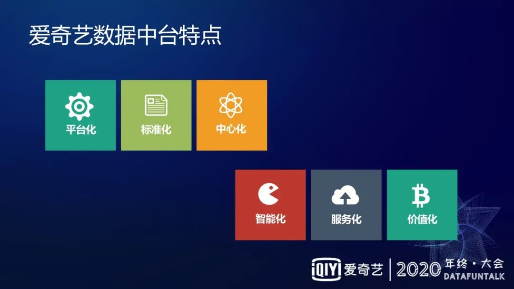

# 爱奇艺数据中台的建设实践

> 随着市场对数据价值的认可，促进了数据在各行各业的爆发式增长，以及大数据设施的快速演化，同时也带来了不少新的数据问题；解决这些问题，发挥更大的数据价值，成为了各大公司的重点工作。爱奇艺通过数据中台的建设和实施，发挥通用化、中心化、服务化和标准化等能力和特点，将数据能力覆盖到公司任何角落，赋能业务发展，并通过加深数据 AI 化等新的技术方式，对数据价值进行深度探索；本文将从数据中台的概念、架构、建设理念等角度切入，对关键组成部分进行深入介绍，让大家能够在理解中台的同时，了解到如何通过中台解决问题，帮助业务挖掘数据价值。主要内容包括：
>
> - 定位和价值
> - 爱奇艺数据中台介绍
> - 数据中台统一服务层
> - 应用场景

## 定价和价值

首先和大家分享下数据中台的定位和价值,数据中台的定位主要是为了解决大数据快速发展过程中所遇到的各种棘手问题。

### 1. 现状和问题

大数据发展的现状特点主要归纳为以下几点：

- 基础设施发展的速度过快，导致在使用的层面需要快速响应，快速的迭代，从而给业务使用和数据挖掘带来很高的成本；
- 数据量级爆发式增长，对于存储、计算以及一些特殊场景的优化带来很大的挑战；
- 应用场景的融合叠加，以往数据产品主要用于报表分析，再进行应用分析，现在数据和 AI 技术深度融合，对大数据应用以及管理有更高的要求；
- 随着业务发展节奏越来越快，对数据时效性的要求也越来越高，已经不能止步于 T+1 的离线数据，或是 H+1 的数据，可能现在需要的是分钟级，甚至是秒级的延迟速度。

针对大数据发展特点遇到的各种问题,包括一些特殊业务场景中遇到的特例问题,在此仅罗列一些比较通用的问题：

- 数据口径的不一致；
- 数据质量的可靠性；
- 数据使用门槛高;
- 资源消耗浪费严重；
- 数据资产管理混乱；
- 数据接入成本高；
- 数据流通性差；
- 数据生产链路长；
- 数据业务打通难；

### 2. 数据中台的定义

中台是一个企业架构，是把一些通用的能力进行抽象。数据中台,就是对数据能力进行抽象，并且把数据的治理以及资产的管理统一抽象出一种通用的能力，把这种数据使用的门槛降到一定程度，让更多的业务，更多的用户可以通过数据去挖掘一些业务价值。

数据中台如何解决问题可从以下八个点展开:

① 打造一站式数据开发平台,这个方式是为了解决因大数据基础设施快速发展，面对不同的场景下需要大家用不同的技术手段去处理数据，然而设置零散性的数据组织形式会导致数据使用效率以及维护效率特别低。

② 建立统一的元数据中心,以往企业更关注数据生产，在管理上相对来说比较薄弱,因此需要建立统一的数据中心对数据的元数据元信息进行统一的管理，后续会为更多使用场景提供元数据。

③ 提供配置化的数据服务托管能力,就是数据中台的统一服务化建设。

④ 建设覆盖全生命周期的数据治理体系,对于大数据产生的价值以及成本，需要更细粒度的管制，所以要建立一个覆盖全生命周期的数据治理体系。

⑤ 制定数据生产和采集标准,数据生产和采集的过程是业务和用户接触数据中台的第一个环节，如何把数据生产标准化，如何把数据的采集和输入标准化对用户来说是节省成本的一个关键环节。

⑥ 建立一个数据湖,数据仓库及周边体系,把数据作为一个中心化的组织形式来为公司或者各个业务的产品使用场景提供环境。

⑦ 推动数据中心化,传统的数据结构往往是 A 依赖于 B,B 依赖于 C，C 可能依赖于 A 的网状引用结构,这个过程会带来很多沟通的成本以及使用上的理解偏差，包括各自维护自己的数据，导致存储成本和管理方面成本相对较高.对此如何加快数据交换,需要运营中心化的建设，来帮助数据的生产方和使用方降低使用和维护的成本，并作为一个数据交换的中心。

⑧ 通过 AI 能力替代人工的反复性工作,通过 AI 技术的融合建设一个自动化平台，让用户可以方便快捷地使用这种 AI 能力，同时需要把 AI 能力赋能到我们的数据平台中，比如数据质量的监测、数据使用的分析，包括数据仓库建设的健康度，都需要 AI 能力去覆盖。

## 爱奇艺数据中台介绍

### 1. 爱奇艺数据中台定位

爱奇艺数据中台主要服务于业务前台和业务中台,数据中台主要由数据的生产接入，数据的处理加工，数据资产,数据治理，以及最终对外提供数据服务组成。数据中台主要的作用分以下四个方面展开：

① 将数据的生产收集处理存储和服务等环节进行封装，面向于不同层级的用户和业务，提供不同的服务形式。可以解释为，面向不同层级且具备一定的数据开发能力的用户，可能需要写 SQL 对数据表进行直接的查询，或者做更深度的数据开发，比如比较复杂的数据处理流程，数据开发平台支持用户通过拖拉拽的方式构建复杂工作流去 DAG。数据中台在对接业务前台时，如果直接使用数据表的成本会比较高，因此需要将数据封装成数据服务，并提供数据服务能力去帮助用户通过这种配置化的能力达到业务系统的对接能力。

② 在数据标准化的过程中，防止数据的重复建设，以及避免口径问题，来提高数据的使用效率，防止大家在从各种口径问题上花费过多的精力，或者避免因为口径问题带来一些决策上的错误。

③ 对于数据进行全链路的治理，来保证数据的生产使用，使得对资源的利用，有比较好的保障。

④ 最终的目的，屏蔽数据处理的复杂性，让用户可以更方便更高效地使用和发现数据，满足业务快速发展需求。

### 2. 爱奇艺数据中台组成

接下来介绍爱奇艺数据中台组成，这个分层组成的粒度较粗，但完全能覆盖到数据中台应该具备的能力。

架构最底层是大数据基础设施，结合云技术，可提供标准化、可弹性高、可用的统一云服务的能力。云服务之上有两部分，一个是统一数据生产和接入，另一个是统一数据的开发平台。往上是统一的数据组织形式，主要是数据湖,数据仓库以及其他的一些数据组织形式。统一数据层上方是本文主要的分析方向——统一数据服务层。统一数据服务层有以下几个特性，分别是可弹性、可配置化、可监控、可组合。这其实是一个高阶应用,高阶使用的方式，把一些原子的数据服务能力进行二次或者三次组合，来完成相对复杂的数据服务。

### 3. 爱奇艺数据中台特点

爱奇艺数据中台有以下六个特点：

① 平台化，以平台化的形式对用户展现能力，比如数据开发平台、数据服务平台、数据治理平台、以及一些数据接入工具等。

② 标准化，可以体现在多个方面，一方面是流程的标准化，包括如何采集数据，如何存储数据，然后如何管理对外交换的数据。另一方面，是对数据资产本身的标准化，比如数据表的命名、库的命名、字段的命名，还有数据仓库相关的，比如数据模型、指标系统、维度系统的标准化建设。打造全公司标准的统一的存储平台以及指标系统和维度系统，所有的数据体系可能都依赖于此。

③ 中心化，数据中台相当于把公司数据放入中转站，把数据汇总和分发，然后让数据得以统一管理，进而高效管理，同时对数据使用和安全情况做后续的审计。

④ 智能化， 体现在两方面，一方面是提供一个平台，智能化平台（AI 平台），让用户可以通过拖拉拽的方式快速地获得一些简单的 AI 机器学习的能力或者深度学习的能力。另一方面是在中台内部体现智能化能力，比如把智能的预测能力用于数据监测、数据分析上。

⑤ 服务化，是指把数据中台的能力通过服务的形式对系统推进，展现给业务，同时在组织形式上更像公司内部 toB 的一个公司，去服务于各个业务线，帮助售前、售中、售后实施数据定制方案。

⑥ 价值化，数据中台的建设与业务目标的关系相对模糊，所以希望能够寻求一些合理的方式来衡量建设数据中台的价值。

## 数据中台统一服务层

### 1. 统一服务面对的问题

接下来介绍一下爱奇艺数据中台的统一服务层，统一服务面对的问题主要分为以下几点:

① 数据和接口的复用性。由于传统的数据使用场景更多的是直接暴露数据表或者分配权限，往往这种情况下表的改动或者迁移，都会对于下游的服务造成特别大的影响。另外，数据表本身的流通性比数据接口的流动性差，因为对接业务或对接前台的部门，可能存在大家对于接口理解远高于对数据表的理解。

② 发现和理解数据。过去，爱奇艺通过各种形式维护元数据，比如数据表的含义、数据表字段的定义、字段类型等描述，但是这些数据在长时间运转下来，这些数据的信息其实逐渐的落后于实际情况，就造成了信息的缺失和不准确。其次是沟通成本问题，更多的还是需要人和人沟通，这种沟通一方面沟通效率会比较差，另一方面因为人与人沟通会产生理解的偏差。

③ 标准和统一管理。对于数据接口，过去总是各自依赖于自己所需要的数据，然后自己定义自己开发，导致出现各式各样的接口，在流通或者管理过程中的成本是很高的。而且往往对于一个数据资源，大家开发不同的数据接口，它的重复性会比较多，重复的概率会比较大，从而造成资源浪费严重。

④ 数据接入效率。过去给业务去提供一个数据表或者一个数据库业务，需要根据自身的情况去做相应的开发，然后评估服务的 QPS 和部署形式，以及申请域名的接口、安全网关等，但是这些其实都可以通过通用化的能力去解决，把效率提升起来。

⑤ 服务使用审计。以往提供的一个数据接口，可能就是 A 传 B、B 传 C 就扩散地使用起来了，但是往往这种情况会对于数据血缘的信息收集带来特别大的影响，导致后续升级一些数据表或者升级数据服务的时候，缺失部分下游的信息，从而导致一些操作对于某些线上业务带来额外的影响，而且有一些高精密性的数据，可能也会由于这种分享式的方式导致安全隐患。

### 2. 数据服务介绍

对于数据服务的定义以及它所具备的能力有了一个初步的概括后，开始介绍爱奇艺数据服务内容，主要有几下六点：

① 一站式的开发和运维的能力，它可以通过 SQL,可以通过配置来定义输入输出，并且可以和元数据中心打通，通过一些可选的方式去定义自己的数据服务。

② 全链路打通，因为有了数据接口到数据之间的血缘，并且依赖于现有数据和数据之间的血缘关系。其实从数据的生产到数据的加工到最终数据的使用，是一个全链路打通的一个状态，我们可以有效地去评估这个数据对于下游的影响情况，并且去衡量数据的价值。

③ API 集市，过去的使用背景往往是大家的数据表可能是基于各自的需求去开发各自的数据接口，这种复用性很难得到保障。通过 API 集市的方式，把所有基于某些表的数据接口展现出来，以及它所对应的输入输出，一个接口的元信息以更友好的形式体现出来。这样，用户再去新建或者再去寻找数据服务的时候，有可靠的统一的入口，可以有很好的达到接口复用的目的。

④ PULL 和 PUSH 的这两种能力，也是业务关注的两种服务模式。PULL 很容易理解，用户通过发送数据访问到数据接口，数据接口对请求进行解析和优化，通过各种数据源计算数据，以秒或者毫秒级的响应速度返回数据结果，但这种场景往往是面向小型的数据量。而在数据服务面向的广大的业务当中，有一些场景下数据的时效性要求不是极高高，不需要到秒级或者毫秒级，但可以退而取其次可以达到一个分钟级，从而用以换取可以获得更大数据量的结果。这种情况下， 靠 PULL 的形式就很难以实现，所以需要通过 PUSH 回调的形式去通知调用数据服务的业务，去拉取这种大数据量的数据来满足后续业务的需求。

⑤ 逻辑模型，可以给业务或者用户一个更低门槛的或者更容易理解的一种展现形式。数据表往往有一些局限性，所以需要通过一种模型的概念，也就是大家都能理解的一个文字性的描述的东西，去支持数据接口的一个定义来解决数据复用的能力。

⑥ 数据网关，其实一个很通用的能力，对于这种数据服务，一定要提供网关的集成能力，以及支持认证权限，然后限流和监控的这一整套的服务能力。

### 3. 数据服务架构

**关于数据服务架构：**

自上往下，最上层是最终对外提供的 API 集市，大家可以通过 REST API 的形式去访问，查询数据以及获取数据。下一层是查询引擎，产品群里基本上是 API 的接口，更多的是以一种协议的形式存在，所以在查询引擎的最上层是有一个解析的过程。根据协议标准将数据请求进行解析，获取将要查询的数据源，根据数据源信息获取对应的数据模型，数据模型会通过底层元数据信息映射出对应的数据表；根据请求中的字段列表以及 filter 条件，最终将请求解析成一个逻辑执行计划，并进一步产生一个物理执行计划，计算出最终结果封装成响应返回。这种调用形式其实分为两种，一种是同步的接口形式，也就是接口 API，另外一种就是异步。异步就是说定义一个异步的时候，可能要比同步的方案要定义的信息更多一些，比如说给业务方提供的一个数据接口，数据的业务方需要去定制自己的回调接口，以及制定适合自己业务后续去处理的数据存储地址，然后填写到数据服务的定制化接口配置界面上。当数据请求过来之后，数据服务会把整个的接口请求转换成一种 DAG 工作流的形式。因为这个数据量比较大，靠一个本地的计算已经难以满足，或者说是内存上可能会存在一些瓶颈，所以把它翻译成一种离线的 DAE 形式来去计算，或者是判断其他的覆盖能力,计算完的数据，会存到用户指定的地方，并且调用户指定的回调接口来告知用户，数据已经准备好，可以去某某地方拉取。这个数据存储的最终形式就是按照用户定义的那种结果形式去存储，这样供业务前台可以快速的去拿到数据去进行后续的处理，这些产品其实都是通过统一的查询能力去完成。

查询引擎的下一层是 API 的配置层。对 API 配置功能的拆解，首先是接口定义,接口的名字是什么，接口的描述以及传入的参数,输出的结果，包括 filter 的条件。其次是协议的管理，不仅支持 AGP 的协议，还可以支持 RPC 的各种协议。还有异步的形势下，需要用户填写自己的回调地址，或者说指定一下数据存储的位置。

再往下是对于整个数据服务的管理模块，主要分为数据源管理、版本管理、资源管理、流量管理等。数据源管理是对数据接口的数据服务自身的一个管理。对于资源的管理能力，体现在数据服务常常会消耗服务器资源，然后对接公司的 QAE 的这套体系，就是说一套虚拟化的一个容器。流量管理就是对于每一个服务，可能都需要有一定的流量的管理措施去衡量以及动态调整服务的副本数。

左边就是网关，一个数据服务或者是一个服务接口所具备的能力，比如说一些安全认证及权限访问的问题，包括数据服务本身运行的稳定性的监控，还有数据接口调用分析，包括当接口并发量突然有激增的情况发生时，需要有限流的能力。

最底层是数据源，为了后续对数据服务做一个更深层次分析，我们需要对日志进行统一采集，统一管理。

最右边是整个数据中台里面很重要的一块——元数据中心，因为现在看无论是任何一个模块，任何一个数据的分层，对元数据的依赖都是相当重的。

### 4. 元数据服务组成

元数据的概念比较难理解，其实元数据就是数据的数据。对于元数据服务，现在提供了两种服务形式。一种是搜索服务，就是大家可以通过已知的一些信息去进行搜索，拿到数据资产的一些更详细的说明。比如可以通过搜表名、搜维度，搜业务线的名称、搜指标，就可以拿到跟搜索词相关的数据资产，并且进一步查看它的详细信息。另外一种形式可能比较偏向导性的或者结构化的一种展现形式，也就是业务图谱。我们可以从业务的角度出发，一层一层地圈定更细的范围来查找我们想要看到的数据资产。

元数据中心给用户展现的信息主要是包括几种，一种是基础信息，也就是说数据的定义，包括任务的定义、数据的生产者、安全责任人、数据的样例以及变更的历史。另一种是数据资产本身的特点，首先是数据资产等级，我们需要对不同的资产做分级，以保证不同等级的资产有不同的保障机制，然后更多的精力放到重要资产上。其次是对数据的健康度和质量的体现，我们会对于所有的数据资产分级地检测质量，包括它的产出时间来对数据资产进行定级。最后是数据流行度,主要是为了体现数据在下游使用当中的使用次数，以此来表明数据的重要程度。我们也会把数据的流行度作为数据价值的一个重要衡量指标。

除了这些元信息之外，我们可能也需要对于整个数据生态的一数据标准，通过元数据中心去对外去体现。比如业务的信息，包括业务的所属部门、负责人的信息，以及业务相关的一些指标维度和数据模型，把元信息以这两种服务形式对外提供，其实是为了可以让使用方可以更快速更高效地去找数据，把数据能理解和使用起来，并且可以指导用户去快速地开发自己的数据需求。

### 5. 元数据服务架构

关于元数据的服务架构，左侧是相当于元数据的采集员,血缘采集其实是把数据资产由血缘形式体现出来，让每一个数据知道其的上下游是谁，然后在一些变更的时候能及时通知，并且如果数据上有一些变化，也可以及时的通过数据血缘的能力去找到自己的上游来排查数据变化的原因。血缘采集主要是分以下几部分：

一是通过 HiveHook 采集，Hive 表之间的血缘，然后 sparkhook 采集 spark 的生产数据，就是发个任务生产的数据，以及它的数据源之间的关系。接下来是数据集成，是对数据异构数据源的同步能力，我们把这种导入导出的一种血缘管控起来。最后是 pingback，因为 pingback 是很多数据产生的一个源头，所以这一块是说我们从数据产生最源头到最终数据的使用，全链路渲染的采集的方式。

下边是对于非关系型数据的元数据采集，比如说 Hive、Kafka、MySQL,pingback，还有数据报表。这些更多的是对于数据资产的原始信息的采集方式。然后通过消息队列和 API 的这两种形式实现离线或者是实时的元数据采集流程。元数据中心可以通过 JanusGraph 去对血缘进行一个整体的管理。我们现在的血缘其实支持 pingback 到 Hive,Hive 到 Hive,Hive 到 MySQL，然后 MySQL 到报表的整体的血缘关系。这样我们所有的数据资产，正常的来说应该都在这整个的血缘网当中，而且通过 JanusGraph 我们可以通过这种图结构的数据库去快速查找一些数据资产，包括它的上下游关系以及相互依赖关系。

然后技术元数据和业务元数据，主要是包括一些字段信息、存储信息、分区信息、资产信息、数据模型、数据流行度等等。为了快速查找，把索引信息存到了 ES 里，用于实现快速的搜索能力，并且这种详细信息我们可以通过 JanusGraph 或者其他的这种数据库存储形式去获取。

最后，元数据中心对外的体验形式主要有两种，一种叫查询 API，它可以对接到各种的业务系统上。另一种叫搜索 API，搜索 API 就是现在平台的展现形式，后面展现数据库的搜索 APIDE 能力。

### 6. 推理服务介绍

接下来对推理服务作一个简单的介绍，前面花了很大篇幅讲了数据服务和元数据服务，而推理服务其实是基于我们现在智能化建设的角度提出的。我们在离线部分有一个叫机器学习平台，它可以通过和我们现有的数据开发平台打通去做一些离线的特征管理、样板管理、特征训练，然后通过和数据服务打通，能支持模型的自动复制。推理服务还可以可以对外提供 AGTP 或者 RPC 的接口服务，对各种前台应用提供实时在线的一个预测服务能力，并且它可以支持预加载或者热更新，以及支持 ABTest。

### 7. 推理服务架构

推理服务的架构，它主要分为几个模块。其中，模型的管理平台，通过离线训练，把一些模型数据通过 PMML 的形式来管理起来，然后输出到在线预测管理平台上。再通过预测管理平台去部署推理服务，同时运维监控平台对于线上的推理服务做一些性能或者心跳方面的监测。

## 场景应用

### 1. 数据服务案例

数据服务平台其实是数据平台和业务前台以及数据源之间的关系，可以说是管理各种数据源发布同步数据的接口，然后提供给 Client。Client 其实很多时候是业务前台来提供同步的调用法。右侧的异步的交流能力是通过发布一个异步的数据接口来把数据源做一些 DAG 的管理和处理，把最终的数据发布到消息队列上，同时去回调业务前台的回调接口，再通知业务前台去消息队列获取结果数据。

### 2. 数据服务平台

上图所示是数据服务的应用场景，左图是数据服务的 API 集市。上面有数据服务的简单介绍、创建人、创建部门以及上线时间。右侧是接口的详细信息，比如上线时间、有效期、紧急程度、接口的地址说明、接口描述和一些列的解释，这个列的解释就是最终的输出的结果。

### 3. 元数据服务案例

云数据服务就是数据源和数据使用方进行打通。上游的数据生产、数据采集和数仓建设来对元数据进行生产，然后通过元数据服务，把元数据的输出到比如数据图谱报表系、自助查询系统以及后续的数据治理体系当中。

### 4. 数据图谱

这是数据图谱的界面，其实是元数据一个体现形式。通过搜索可以快速地查找到一些表，然后再进一步去看右下方表的详细信息，包括所属于的项目、集群、库名、owner、创建人，以及相关的字段信息等。除此之外还会有一些血缘数据、血缘关系，包括所关联的模型、变更历史以及使用记录。

## 未来展望

最后是对数据服务未来的展望。在数据服务上我们其实还有很多事情要去完成，主要为以下四个方面：

① 第一块是需要做一些跨数据源的合并，目前虽然我们做到了一些小数据量的跨数据源合并，但是大数据量的跨数据源合并能还需要再深挖升级。

② 第二块是服务接口组合，也是说我们如果有了一些原子接口，怎么去把它组合成更复杂更灵活的服务接口也是未来要解决的。

③ 第三块就是服务模型化，就是如何通过数据模型去构建服务，让使用方不去关注表的底层表的概念，或者底层表的信息，就能创建出符合自己预期的模型。

④ 最后一块是自动化管理，目前主要是人为地定义接口，后续需要把接口定义的各个环节尽可弱化，通过生成一个接口，然后内部的 request 模板或者 response 的字段说明，可以通过接口自动解析，然后以更灵活的方式体现出来，不需要每一个接口都事先定义才能使用。

**嘉宾介绍：**

**马金韬**

爱奇艺 | 数据中台负责人

马金韬，目前就职于爱奇艺，负责数据中台的规划、建设和推广工作，前后在 360、百度和阿里巴巴等多家公司从事广告和大数据相关工作，目前主要关注大数据技术生态、发展方向和业务价值实现等方向。

本文转载自：DataFunTalk（ID：dataFunTalk）